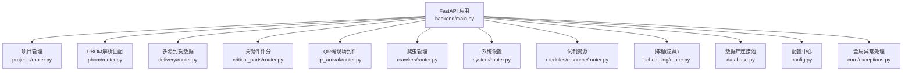
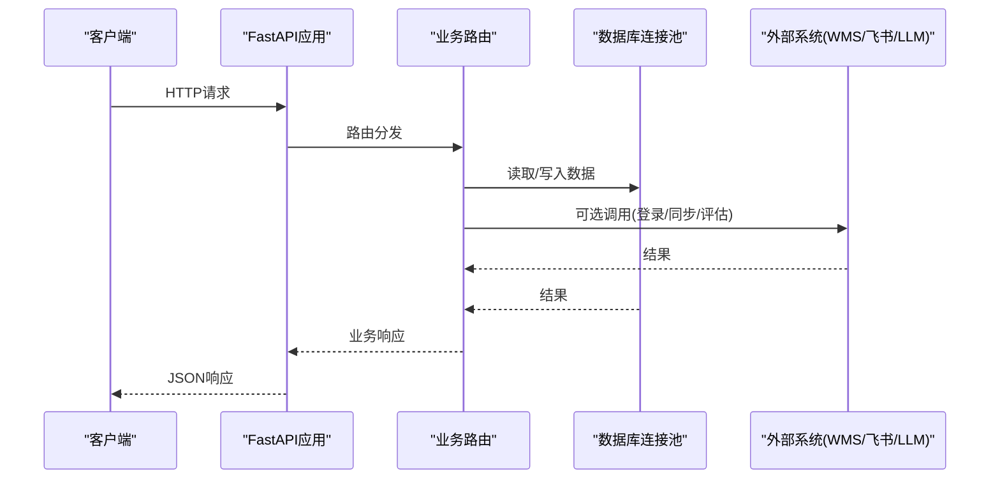
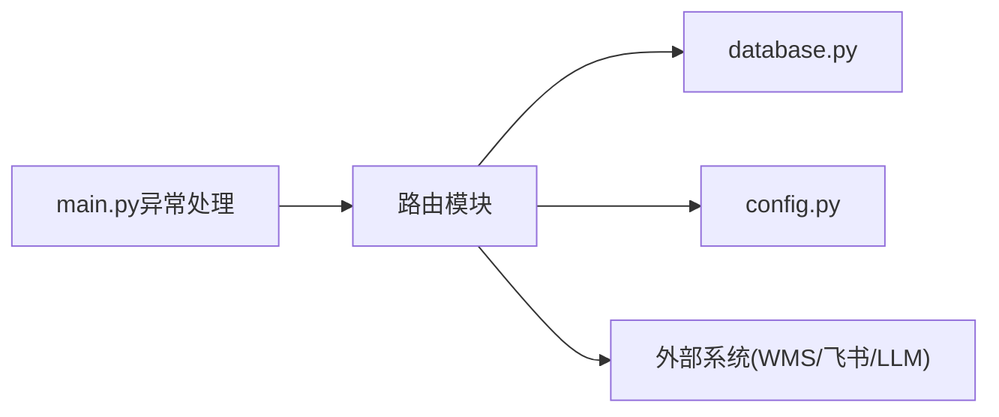

# API接口文档

<cite>
**本文引用的文件**
- [backend/main.py](file://backend/main.py)
- [backend/config.py](file://backend/config.py)
- [backend/database.py](file://backend/database.py)
- [backend/core/exceptions.py](file://backend/core/exceptions.py)
- [backend/projects/router.py](file://backend/projects/router.py)
- [backend/projects/schemas.py](file://backend/projects/schemas.py)
- [backend/pbom/router.py](file://backend/pbom/router.py)
- [backend/delivery/router.py](file://backend/delivery/router.py)
- [backend/delivery/schemas.py](file://backend/delivery/schemas.py)
- [backend/critical_parts/router.py](file://backend/critical_parts/router.py)
- [backend/critical_parts/schemas.py](file://backend/critical_parts/schemas.py)
- [backend/qr_arrival/router.py](file://backend/qr_arrival/router.py)
- [backend/crawlers/router.py](file://backend/crawlers/router.py)
- [backend/scheduling/router.py](file://backend/scheduling/router.py)
- [backend/system/router.py](file://backend/system/router.py)
- [backend/modules/resource/router.py](file://backend/modules/resource/router.py)
</cite>

## 目录
1. [简介](#简介)
2. [项目结构](#项目结构)
3. [核心组件](#核心组件)
4. [架构总览](#架构总览)
5. [详细接口说明](#详细接口说明)
6. [依赖关系分析](#依赖关系分析)
7. [性能与可用性](#性能与可用性)
8. [故障排查指南](#故障排查指南)
9. [结论](#结论)
10. [附录](#附录)

## 简介
本文件为“试制资源数智化管理系统”的完整API接口文档，覆盖项目管理、PBOM解析匹配、多源到货数据、关键件评分、现场到件（QR码）、爬虫管理、系统设置与试制资源管理等模块。文档包含：
- RESTful端点、HTTP方法、URL模式、请求参数与响应格式
- 认证授权机制、数据格式规范、错误码定义与状态码说明
- 每个接口的参数说明、返回值示例与调用示例
- 接口前后依赖关系与业务场景
- Swagger文档使用与调试技巧
- 客户端集成示例与最佳实践
- 接口版本管理与向后兼容性策略

## 项目结构
后端基于FastAPI构建，模块化路由按业务域划分，统一在应用入口注册前缀与标签；数据库通过连接池访问；全局异常处理器统一返回业务错误。

图表来源
- [backend/main.py:29-83](file://backend/main.py#L29-L83)
- [backend/database.py:12-43](file://backend/database.py#L12-L43)
- [backend/config.py:48-101](file://backend/config.py#L48-L101)

章节来源
- [backend/main.py:29-83](file://backend/main.py#L29-L83)
- [backend/config.py:48-101](file://backend/config.py#L48-L101)
- [backend/database.py:12-43](file://backend/database.py#L12-L43)

## 核心组件
- 应用入口与中间件：CORS、健康检查、SPA回退、启动/关闭事件（调度器）
- 配置中心：从环境变量加载数据库、爬虫、WMS、飞书、LLM、服务端口等
- 数据库层：连接池、查询/执行封装、事务性写操作
- 全局异常：BusinessError统一转换为JSON错误响应
- 模块路由：各业务域独立Router，统一前缀与标签

章节来源
- [backend/main.py:29-83](file://backend/main.py#L29-L83)
- [backend/config.py:48-101](file://backend/config.py#L48-L101)
- [backend/database.py:12-43](file://backend/database.py#L12-L43)
- [backend/core/exceptions.py:1-8](file://backend/core/exceptions.py#L1-L8)

## 架构总览

图表来源
- [backend/main.py:29-83](file://backend/main.py#L29-L83)
- [backend/database.py:12-43](file://backend/database.py#L12-L43)

## 详细接口说明

### 通用约定
- 基础路径：根据各模块注册的前缀，如 /api/projects、/api/pbom、/api/delivery、/api/critical、/api/qr-arrival、/api/crawlers、/api/system、/api/resource
- 内容类型：默认 application/json；上传接口使用 multipart/form-data
- 分页：多数列表接口支持 page、page_size
- 统一成功响应：不同模块略有差异，常见包含 code/message/data 或 data/total/page/page_size
- 错误响应：
  - HTTP 4xx/5xx 由 FastAPI/业务逻辑抛出
  - BusinessError 会被全局处理器转换为 { error: message } 并附带指定状态码

章节来源
- [backend/main.py:85-97](file://backend/main.py#L85-L97)
- [backend/core/exceptions.py:1-8](file://backend/core/exceptions.py#L1-L8)

### 健康检查
- GET /api/health
- 响应：{ status, message }

章节来源
- [backend/main.py:94-97](file://backend/main.py#L94-L97)

### 项目管理（/api/projects）
- GET /api/projects/pbom-template
  - 功能：下载PBOM导入模板
  - 响应：文件流（Excel）
- GET /api/projects/
  - 查询：page, page_size
  - 响应：{ projects[], total }
- GET /api/projects/{project_id}
  - 响应：{ project }
- POST /api/projects/
  - 请求体：ProjectCreate（name, project_code, apply_code, apply_code2?, status?, trial_leader?, process_leader?, assembly_leader?）
  - 响应：{ project, message }
- PUT /api/projects/{project_id}
  - 请求体：ProjectUpdate（字段均为可选）
  - 响应：{ message }
- DELETE /api/projects/{project_id}
  - 响应：{ message }
- GET /api/projects/{project_id}/parts
  - 响应：{ parts[] }
- GET /api/projects/{project_id}/stats
  - 响应：{ total_parts, total_demand, total_received, total_line_side, matched_rate, critical_count }
- GET /api/projects/{project_id}/shortage-parts
  - 查询：page, page_size, keyword, doc_state_filter, warehouse_filter
  - 响应：{ total, page, page_size, data[] }
- GET /api/projects/{project_id}/doc-state-distribution
  - 响应：单据状态分布
- DELETE /api/projects/{project_id}/pbom-clear
  - 响应：{ success, message }
- POST /api/projects/{project_id}/pbom-upload
  - 请求：multipart/form-data 文件（xlsx/xls/csv）
  - 行为：保存临时文件→解析→保存零件→尝试匹配→清理临时文件
  - 响应：{ success, code, count, message }

章节来源
- [backend/projects/router.py:20-231](file://backend/projects/router.py#L20-L231)
- [backend/projects/schemas.py:1-26](file://backend/projects/schemas.py#L1-L26)

### PBOM解析匹配（/api/pbom）
- POST /api/pbom/upload
  - 请求：multipart/form-data（.xlsx/.xls）
  - 响应：{ filename, size, path, message }
- POST /api/pbom/detect-columns
  - 查询：file_path
  - 响应：{ data: { need_confirm, candidates[] } }
- POST /api/pbom/parse
  - 请求体：ParseRequest（project_id, file_path, confirmed_columns[], display_names?）
  - 响应：{ data: { project_id, parts_count, config_count, message } }
- GET /api/pbom/{project_id}/parts
  - 响应：{ project_id, parts[], configs[] }
- POST /api/pbom/{project_id}/match
  - 响应：{ data: match_result }

章节来源
- [backend/pbom/router.py:23-166](file://backend/pbom/router.py#L23-L166)

### 多源到货数据（/api/delivery）
- GET /api/delivery/detail
  - 查询：page, page_size, search, state, days, delivery_code, apply_code, project_code, part_code, part_name, exact, source(wms|feishu)
  - 响应：{ data[], total, page, page_size, source }
- GET /api/delivery/stats
  - 查询：days
  - 响应：{ data: { total_records, total_order, total_in, total_cant, project_count, wms_records, feishu_records } }
- GET /api/delivery/state-distribution
  - 查询：days
  - 响应：{ data[], states[] }
- GET /api/delivery/feishu-state-distribution
  - 响应：{ data[], states[] }
- POST /api/delivery/{project_id}/merge
  - 请求体：MergeRequest（project_id, days=7）
  - 响应：合并结果（含统计与记录）
- GET /api/delivery/{project_id}/merge-summary
  - 查询：days
  - 响应：{ project_id, days, total_raw, merged_count, duplicate_count, anomaly_count }

章节来源
- [backend/delivery/router.py:28-259](file://backend/delivery/router.py#L28-L259)
- [backend/delivery/schemas.py:1-30](file://backend/delivery/schemas.py#L1-L30)

### 关键件评分（/api/critical）
- GET /api/critical/ping
  - 响应：{ message }
- POST /api/critical/{project_id}/score
  - 功能：对项目所有零件进行四维加权评分并持久化
  - 响应：评分结果（含各维度分数、总分、等级、是否关键件、原因）
- GET /api/critical/{project_id}/scores
  - 响应：{ scores[], summary }
- GET /api/critical/{project_id}/summary
  - 响应：摘要统计
- POST /api/critical/{project_id}/llm-evaluate/{part_code}
  - 功能：对单个零件进行LLM智能评估（需配置DEEPSEEK_API_KEY）
  - 响应：{ part_code, part_name, llm_evaluation }

章节来源
- [backend/critical_parts/router.py:18-95](file://backend/critical_parts/router.py#L18-L95)
- [backend/critical_parts/schemas.py:1-40](file://backend/critical_parts/schemas.py#L1-L40)

### QR码现场到件（/api/qr-arrival）
- GET /api/qr-arrival/{project_id}/qr-code
  - 响应：PNG图片流（二维码）
- GET /api/qr-arrival/{project_id}/info
  - 响应：{ project }
- POST /api/qr-arrival/{project_id}/submit
  - 请求体：ArrivalSubmit（part_code, arrival_qty, arrival_time, remark, submitter）
  - 行为：校验→保存→三向匹配→应用匹配结果
  - 响应：{ record_id, match_result }
- GET /api/qr-arrival/{project_id}/records
  - 查询：limit
  - 响应：{ records[], total }
- GET /api/qr-arrival/{project_id}/status
  - 响应：项目零件线边到货状态汇总

章节来源
- [backend/qr_arrival/router.py:14-88](file://backend/qr_arrival/router.py#L14-L88)

### 爬虫管理（/api/crawlers）
- GET /api/crawlers/config
  - 响应：{ success, data }
- POST /api/crawlers/config
  - 请求体：配置对象
  - 响应：{ success, data, message }
- GET /api/crawlers/status
  - 响应：{ success, data: { crawlers[], config, sources } }
- GET /api/crawlers/status/{source}
  - 响应：{ success, data }
- GET /api/crawlers/task/{task_id}
  - 响应：{ success, data } 或错误信息
- POST /api/crawlers/run
  - 请求体：可选（source, sync_type/mode/type, enabled_sources, force_full, blocking）
  - 响应：异步任务时返回 { success, async, task_id, message }；阻塞模式返回执行结果
- GET /api/crawlers/summary
  - 响应：{ success, data: { config, crawlers, source_count, total, is_running, scheduler } }
- POST /api/crawlers/start_scheduler
  - 响应：{ success, message }
- POST /api/crawlers/stop_scheduler
  - 响应：{ success, message }
- POST /api/crawlers/stop
  - 请求体：可选（source）
  - 响应：{ success, data?, message }

章节来源
- [backend/crawlers/router.py:43-225](file://backend/crawlers/router.py#L43-L225)

### 排程（/api/schedule，隐藏于Schema）
- GET /api/schedule/ping
  - 响应：{ message }

章节来源
- [backend/scheduling/router.py:12-14](file://backend/scheduling/router.py#L12-L14)

### 系统设置（/api/system）
- POST /api/system/login
  - 请求体：LoginRequest（source=wms, username, password, env=prod）
  - 响应：登录结果（token/凭证）
- POST /api/system/login/feishu
  - 请求体：FeishuLoginRequest（app_id, app_secret）
  - 响应：tenant_access_token
- GET /api/system/credentials
  - 响应：{ data }
- POST /api/system/credentials
  - 请求体：CredentialRequest（source, name, config, is_active）
  - 响应：{ data, message }
- POST /api/system/credentials/sync
  - 请求体：CredentialSyncRequest（source, token_type, token, authorization, cookie, username, password）
  - 响应：同步结果
- DELETE /api/system/credentials/{source}
  - 响应：{ message }
- GET /api/system/params
  - 响应：{ data }
- POST /api/system/params
  - 请求体：ParamRequest（param_key, param_value）
  - 响应：{ message }

章节来源
- [backend/system/router.py:16-109](file://backend/system/router.py#L16-L109)

### 试制资源（/api/resource）
- GET /api/resource/ping
  - 响应：模块就绪信息
- 设备台账
  - GET /api/resource/equipment（分页+筛选+搜索）
  - GET /api/resource/equipment/{equipment_code}
  - POST /api/resource/equipment
  - PUT /api/resource/equipment/{equipment_code}
  - DELETE /api/resource/equipment/{equipment_code}
  - PUT /api/resource/equipment/{equipment_code}/status
  - GET /api/resource/equipment/stats
  - GET /api/resource/equipment/{equipment_code}/maintenance
  - POST /api/resource/equipment/{equipment_code}/maintenance
  - PUT /api/resource/equipment/maintenance/{maintenance_id}/status
- 区域
  - GET /api/resource/zones
  - GET /api/resource/zones/map
- 人员
  - GET /api/resource/personnel（分页+筛选+搜索）
  - GET /api/resource/personnel/{personnel_code}
  - POST /api/resource/personnel
  - PUT /api/resource/personnel/{personnel_code}
  - DELETE /api/resource/personnel/{personnel_code}
  - PUT /api/resource/personnel/{personnel_code}/status
  - GET /api/resource/personnel/stats
  - GET /api/resource/personnel/source-distribution
  - GET /api/resource/personnel/map
  - GET /api/resource/personnel/efficiency
- 任务
  - GET /api/resource/tasks（分页+筛选+搜索）
  - GET /api/resource/tasks/{task_id}
  - POST /api/resource/tasks
  - PUT /api/resource/tasks/{task_id}
  - DELETE /api/resource/tasks/{task_id}
  - GET /api/resource/tasks/stats
  - GET /api/resource/tasks/status-distribution

章节来源
- [backend/modules/resource/router.py:47-800](file://backend/modules/resource/router.py#L47-L800)

## 依赖关系分析
- 路由注册：main.py集中引入各模块router并设置前缀与标签
- 数据访问：各模块通过database.py提供的连接池与查询函数访问MySQL
- 配置依赖：config.py提供数据库、爬虫、WMS、飞书、LLM、服务端口等配置
- 异常处理：BusinessError被全局处理器捕获并转为JSON错误
- 外部系统：
  - WMS：登录与查询（通过系统设置中的凭证）
  - 飞书：共享表与登录（通过系统设置中的凭证）
  - LLM：DeepSeek评估（需配置DEEPSEEK_API_KEY）

图表来源
- [backend/main.py:29-83](file://backend/main.py#L29-L83)
- [backend/database.py:12-43](file://backend/database.py#L12-L43)
- [backend/config.py:48-101](file://backend/config.py#L48-L101)

章节来源
- [backend/main.py:29-83](file://backend/main.py#L29-L83)
- [backend/database.py:12-43](file://backend/database.py#L12-L43)
- [backend/config.py:48-101](file://backend/config.py#L48-L101)

## 性能与可用性
- 数据库连接池：延迟初始化，避免启动失败；最大连接数与缓存可控
- 大文件上传：分块写入临时目录，解析后删除，降低内存占用
- 异步任务：爬虫运行支持异步模式，前端轮询任务日志
- 调度器：启动/停止/暂停/恢复，避免手动触发与自动调度冲突
- CORS：允许跨域，便于前后端分离部署

章节来源
- [backend/database.py:12-43](file://backend/database.py#L12-L43)
- [backend/projects/router.py:152-231](file://backend/projects/router.py#L152-L231)
- [backend/crawlers/router.py:89-147](file://backend/crawlers/router.py#L89-L147)
- [backend/main.py:66-72](file://backend/main.py#L66-L72)

## 故障排查指南
- 数据库连接失败：检查 .env 中 DB_HOST/DB_PORT/DB_USER/DB_PASSWORD/DB_DATABASE
- 业务错误：查看全局异常处理器返回的 { error } 字段
- 爬虫任务异常：通过 /api/crawlers/status/{source} 与 /api/crawlers/task/{task_id} 获取任务详情
- 文件上传失败：确认文件格式与大小限制，检查上传目录权限
- LLM评估不可用：确保已配置 DEEPSEEK_API_KEY

章节来源
- [backend/database.py:12-43](file://backend/database.py#L12-L43)
- [backend/main.py:85-97](file://backend/main.py#L85-L97)
- [backend/crawlers/router.py:74-86](file://backend/crawlers/router.py#L74-L86)
- [backend/critical_parts/router.py:74-95](file://backend/critical_parts/router.py#L74-L95)

## 结论
本系统以FastAPI为核心，模块化组织REST接口，提供项目管理、PBOM解析、多源到货融合、关键件评分、现场到件、爬虫管理与系统设置等能力。通过统一的异常处理、配置中心与数据库连接池，保障系统的可维护性与稳定性。建议在生产环境完善CORS与安全策略，结合Swagger进行接口测试与联调。

## 附录

### 认证与授权机制
- 系统登录：POST /api/system/login 获取WMS凭证（JWT/Cookie）
- 飞书登录：POST /api/system/login/feishu 获取 tenant_access_token
- 凭证管理：CRUD /api/system/credentials
- 手动同步：POST /api/system/credentials/sync 支持从浏览器复制Token/Cookie
- 注意：当前模块未实现统一的鉴权中间件，建议在网关或反向代理层增加鉴权

章节来源
- [backend/system/router.py:54-96](file://backend/system/router.py#L54-L96)

### 数据格式规范
- 请求：application/json；上传接口使用 multipart/form-data
- 响应：各模块略有差异，常见包含 code/message/data 或 data/total/page/page_size
- 时间：datetime类型在部分接口中需要格式化为字符串（如YYYY-MM-DD HH:MM:SS）
- 分页：page≥1，page_size有上限限制

章节来源
- [backend/projects/router.py:32-131](file://backend/projects/router.py#L32-L131)
- [backend/delivery/router.py:41-118](file://backend/delivery/router.py#L41-L118)
- [backend/modules/resource/router.py:58-800](file://backend/modules/resource/router.py#L58-L800)

### 错误码与状态码
- HTTP状态码：4xx/5xx由FastAPI或业务逻辑抛出
- 业务错误：BusinessError携带code与message，全局处理器返回 { error }
- 常见状态码：
  - 200：成功
  - 400：参数错误或业务校验失败
  - 404：资源不存在
  - 500：服务器内部错误

章节来源
- [backend/core/exceptions.py:1-8](file://backend/core/exceptions.py#L1-L8)
- [backend/main.py:85-97](file://backend/main.py#L85-L97)

### Swagger文档使用与调试
- 访问地址：http://{SERVER_HOST}:{SERVER_PORT}/docs（OpenAPI UI）
- 调试技巧：
  - 使用内置UI直接发送请求，查看响应结构与错误信息
  - 上传接口选择multipart/form-data，填写文件
  - 分页接口调整page与page_size观察数据变化
  - 爬虫接口先读取配置，再执行run，最后轮询status/task

章节来源
- [backend/main.py:29-33](file://backend/main.py#L29-L33)
- [backend/crawlers/router.py:43-147](file://backend/crawlers/router.py#L43-L147)

### 客户端集成示例与最佳实践
- 基础流程：
  - 登录获取凭证（WMS/飞书）
  - 执行爬虫同步（异步模式，轮询任务状态）
  - 上传PBOM并解析匹配
  - 查询到货明细与统计
  - 执行关键件评分与LLM评估
  - 现场扫码提交到件并查看状态
- 最佳实践：
  - 统一错误处理：捕获HTTP异常与业务错误
  - 重试与超时：对网络请求设置合理超时与重试策略
  - 分页与搜索：合理使用分页与关键词过滤提升性能
  - 文件上传：分片上传与进度反馈

章节来源
- [backend/system/router.py:54-96](file://backend/system/router.py#L54-L96)
- [backend/crawlers/router.py:89-147](file://backend/crawlers/router.py#L89-L147)
- [backend/projects/router.py:152-231](file://backend/projects/router.py#L152-L231)
- [backend/delivery/router.py:41-118](file://backend/delivery/router.py#L41-L118)
- [backend/critical_parts/router.py:23-95](file://backend/critical_parts/router.py#L23-L95)
- [backend/qr_arrival/router.py:44-88](file://backend/qr_arrival/router.py#L44-L88)

### 接口版本管理与向后兼容性
- 版本号：应用级别version="5.0.0"
- 兼容策略：
  - 新增字段采用可选参数，避免破坏旧客户端
  - 保留旧参数名（如crawler/name/source）以兼容历史调用
  - 隐藏敏感或内部接口（如排程模块include_in_schema=False）
- 建议：
  - 未来可通过URL前缀（/v1/...）进行版本控制
  - 变更通知与弃用提示（Deprecation）

章节来源
- [backend/main.py:29-33](file://backend/main.py#L29-L33)
- [backend/main.py:81-83](file://backend/main.py#L81-L83)
- [backend/crawlers/router.py:89-147](file://backend/crawlers/router.py#L89-L147)