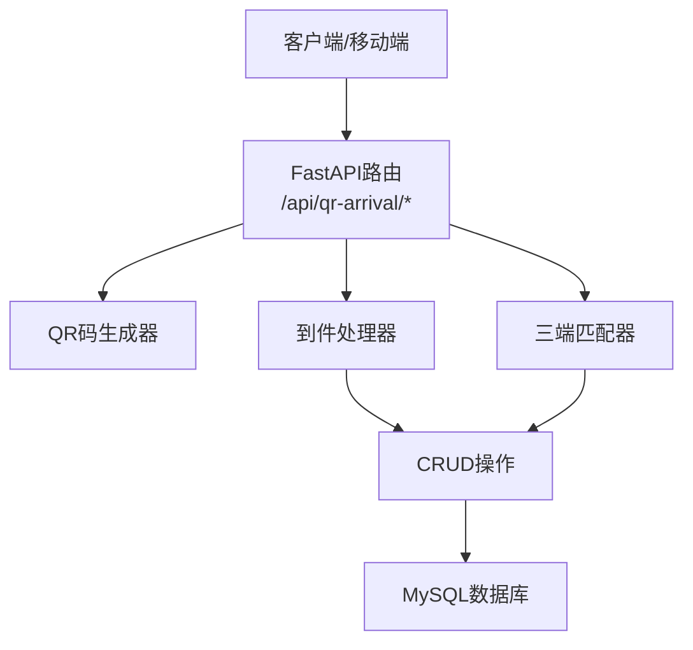
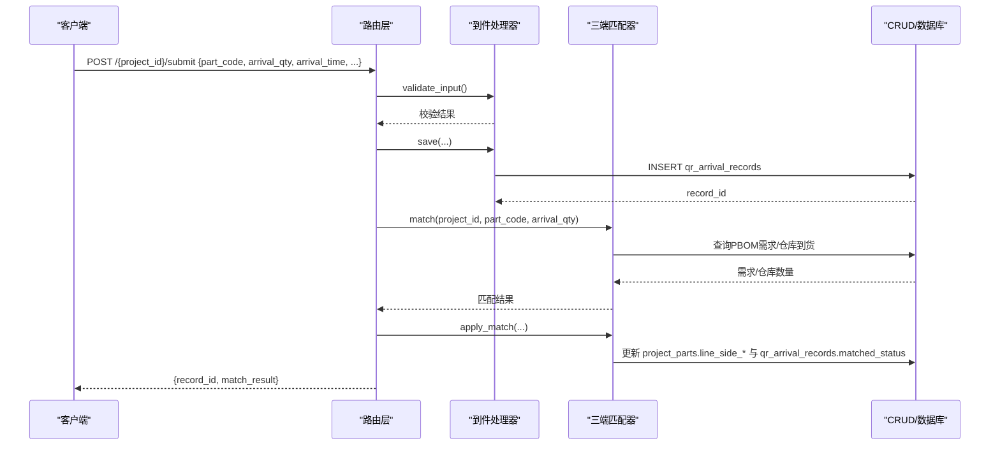
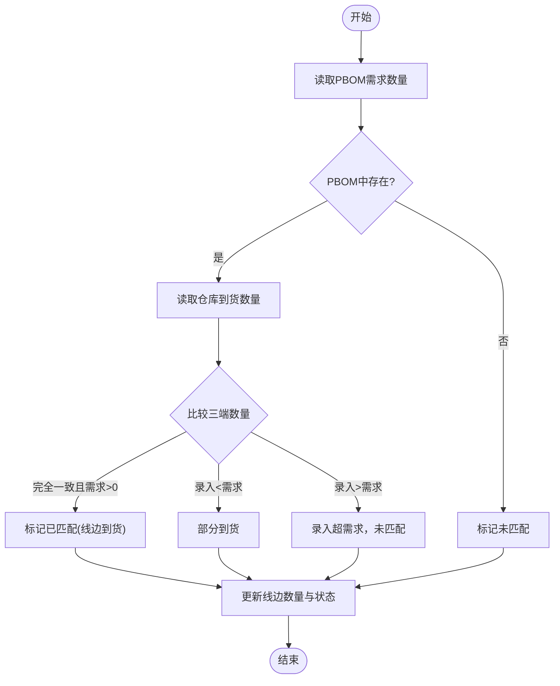
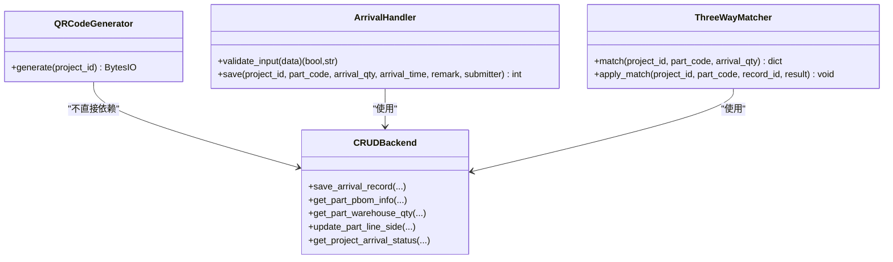
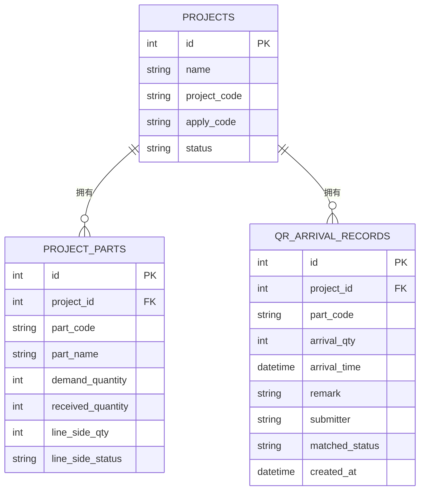

# 二维码到件API

<cite>
**本文引用的文件**
- [backend/qr_arrival/router.py](file://backend/qr_arrival/router.py)
- [backend/qr_arrival/schemas.py](file://backend/qr_arrival/schemas.py)
- [backend/qr_arrival/qr_generator.py](file://backend/qr_arrival/qr_generator.py)
- [backend/qr_arrival/matcher.py](file://backend/qr_arrival/matcher.py)
- [backend/qr_arrival/arrival_handler.py](file://backend/qr_arrival/arrival_handler.py)
- [backend/qr_arrival/crud.py](file://backend/qr_arrival/crud.py)
- [backend/config.py](file://backend/config.py)
- [backend/scripts/init_db.py](file://backend/scripts/init_db.py)
- [static/qr-arrival.html](file://static/qr-arrival.html)
</cite>

## 目录
1. [简介](#简介)
2. [项目结构](#项目结构)
3. [核心组件](#核心组件)
4. [架构总览](#架构总览)
5. [详细接口说明](#详细接口说明)
6. [依赖与数据流分析](#依赖与数据流分析)
7. [性能与扩展性](#性能与扩展性)
8. [故障排查指南](#故障排查指南)
9. [结论](#结论)
10. [附录：数据库表结构](#附录数据库表结构)

## 简介
本模块提供“二维码到件管理”的完整后端能力，覆盖二维码生成、扫码信息展示、现场到件提交、三端匹配（PBOM需求、仓库到货、现场录入）、状态汇总等。通过REST API对外暴露接口，配合前端页面实现扫码登记与可视化看板。

## 项目结构
- 路由层：定义HTTP接口路径与参数校验
- 业务层：处理输入校验、保存记录、执行匹配、更新状态
- 数据层：读写数据库表，聚合统计
- 配置与工具：二维码生成器、全局配置

图表来源
- [backend/qr_arrival/router.py:11-88](file://backend/qr_arrival/router.py#L11-L88)
- [backend/qr_arrival/qr_generator.py:7-51](file://backend/qr_arrival/qr_generator.py#L7-L51)
- [backend/qr_arrival/arrival_handler.py:7-72](file://backend/qr_arrival/arrival_handler.py#L7-L72)
- [backend/qr_arrival/matcher.py:11-123](file://backend/qr_arrival/matcher.py#L11-L123)
- [backend/qr_arrival/crud.py:1-104](file://backend/qr_arrival/crud.py#L1-L104)

章节来源
- [backend/qr_arrival/router.py:11-88](file://backend/qr_arrival/router.py#L11-L88)
- [backend/config.py:87-92](file://backend/config.py#L87-L92)

## 核心组件
- 路由层：提供二维码生成、项目信息查询、到件提交、记录查询、状态汇总等接口
- 二维码生成器：根据项目ID生成包含访问URL的二维码图片
- 到件处理器：校验输入、持久化到件记录
- 三端匹配器：对比PBOM需求、仓库到货、现场录入数量，判定匹配状态并更新线边库存
- CRUD层：封装SQL操作，包括保存到件、查询PBOM、查询仓库到货、更新线边状态、汇总统计

章节来源
- [backend/qr_arrival/router.py:14-88](file://backend/qr_arrival/router.py#L14-L88)
- [backend/qr_arrival/qr_generator.py:7-51](file://backend/qr_arrival/qr_generator.py#L7-L51)
- [backend/qr_arrival/arrival_handler.py:7-72](file://backend/qr_arrival/arrival_handler.py#L7-L72)
- [backend/qr_arrival/matcher.py:11-123](file://backend/qr_arrival/matcher.py#L11-L123)
- [backend/qr_arrival/crud.py:1-104](file://backend/qr_arrival/crud.py#L1-L104)

## 架构总览

图表来源
- [backend/qr_arrival/router.py:44-74](file://backend/qr_arrival/router.py#L44-L74)
- [backend/qr_arrival/arrival_handler.py:10-72](file://backend/qr_arrival/arrival_handler.py#L10-L72)
- [backend/qr_arrival/matcher.py:28-123](file://backend/qr_arrival/matcher.py#L28-L123)
- [backend/qr_arrival/crud.py:4-83](file://backend/qr_arrival/crud.py#L4-L83)

## 详细接口说明

### 通用约定
- 基础路径：/api/qr-arrival
- 成功响应：JSON对象，字段见各接口
- 失败响应：HTTP状态码+detail/message
- 时间格式：YYYY-MM-DD HH:mm

#### 1) 生成项目二维码
- 方法：GET
- 路径：/{project_id}/qr-code
- 功能：返回PNG格式的二维码图片，扫码后打开前端页面进行到件登记
- 请求参数：
  - path参数：project_id（整数）
- 响应：
  - 媒体类型：image/png
  - 文件名：project-{project_id}-qr.png
- 错误：
  - 500：生成失败

调用示例
- GET /api/qr-arrival/123/qr-code

章节来源
- [backend/qr_arrival/router.py:14-26](file://backend/qr_arrival/router.py#L14-L26)
- [backend/qr_arrival/qr_generator.py:19-40](file://backend/qr_arrival/qr_generator.py#L19-L40)
- [backend/config.py:87-92](file://backend/config.py#L87-L92)

#### 2) 获取项目基本信息（扫码后展示用）
- 方法：GET
- 路径：/{project_id}/info
- 功能：返回项目基本信息，用于扫码后的页面展示
- 请求参数：
  - path参数：project_id（整数）
- 响应：
  - project：对象，包含 id、name、code、apply_code、status
- 错误：
  - 404：项目不存在

调用示例
- GET /api/qr-arrival/123/info

章节来源
- [backend/qr_arrival/router.py:29-41](file://backend/qr_arrival/router.py#L29-L41)

#### 3) 提交现场到件信息
- 方法：POST
- 路径：/{project_id}/submit
- 功能：登记现场到件，自动执行三端匹配并更新状态
- 请求体（JSON）：
  - part_code：字符串，必填，长度1-200
  - arrival_qty：整数，必填，>0
  - arrival_time：字符串，必填，格式 YYYY-MM-DD HH:mm
  - remark：可选，最大500字符
  - submitter：可选，最大100字符
- 响应：
  - record_id：本次到件记录ID
  - match_result：匹配结果对象
    - status：matched | partial | unmatched
    - message：匹配说明
    - detail：包含 demand_qty、warehouse_qty、arrival_qty、line_side_qty
- 错误：
  - 400：参数校验失败
  - 404：项目不存在
  - 500：服务器异常

调用示例
- POST /api/qr-arrival/123/submit
- Body:
  - part_code: "P-ABC-001"
  - arrival_qty: 10
  - arrival_time: "2025-01-01 10:30"
  - submitter: "张三"
  - remark: "首批到货"

章节来源
- [backend/qr_arrival/router.py:44-74](file://backend/qr_arrival/router.py#L44-L74)
- [backend/qr_arrival/schemas.py:6-12](file://backend/qr_arrival/schemas.py#L6-L12)
- [backend/qr_arrival/arrival_handler.py:10-72](file://backend/qr_arrival/arrival_handler.py#L10-L72)
- [backend/qr_arrival/matcher.py:28-123](file://backend/qr_arrival/matcher.py#L28-L123)

#### 4) 获取项目的到件记录列表
- 方法：GET
- 路径：/{project_id}/records
- 功能：分页查询该项目的到件记录（按创建时间倒序）
- 请求参数：
  - path参数：project_id（整数）
  - query参数：limit（整数，默认50，范围1-200）
- 响应：
  - records：数组，元素为到件记录对象
  - total：记录总数
- 错误：
  - 404：项目不存在（由上游校验）

调用示例
- GET /api/qr-arrival/123/records?limit=50

章节来源
- [backend/qr_arrival/router.py:77-81](file://backend/qr_arrival/router.py#L77-L81)
- [backend/qr_arrival/crud.py:27-31](file://backend/qr_arrival/crud.py#L27-L31)

#### 5) 获取项目零件线边到货状态汇总
- 方法：GET
- 路径：/{project_id}/status
- 功能：汇总该项目各零件的线边到货情况与匹配状态
- 请求参数：
  - path参数：project_id（整数）
- 响应：
  - total_parts：零件种类数
  - pending_count：待到货数
  - partial_count：部分到货数
  - matched_count：已匹配数
  - parts：数组，每项包含 part_code、part_name、demand_qty、warehouse_qty、line_side_qty、line_side_status
- 错误：
  - 404：项目不存在（由上游校验）

调用示例
- GET /api/qr-arrival/123/status

章节来源
- [backend/qr_arrival/router.py:84-88](file://backend/qr_arrival/router.py#L84-L88)
- [backend/qr_arrival/crud.py:86-104](file://backend/qr_arrival/crud.py#L86-L104)

## 依赖与数据流分析

### 三端匹配流程

图表来源
- [backend/qr_arrival/matcher.py:28-123](file://backend/qr_arrival/matcher.py#L28-L123)
- [backend/qr_arrival/crud.py:34-83](file://backend/qr_arrival/crud.py#L34-L83)

### 类关系图

图表来源
- [backend/qr_arrival/qr_generator.py:7-51](file://backend/qr_arrival/qr_generator.py#L7-L51)
- [backend/qr_arrival/arrival_handler.py:7-72](file://backend/qr_arrival/arrival_handler.py#L7-L72)
- [backend/qr_arrival/matcher.py:11-123](file://backend/qr_arrival/matcher.py#L11-L123)
- [backend/qr_arrival/crud.py:1-104](file://backend/qr_arrival/crud.py#L1-L104)

### 数据模型

图表来源
- [backend/scripts/init_db.py:40-62](file://backend/scripts/init_db.py#L40-L62)
- [backend/scripts/init_db.py:99-117](file://backend/scripts/init_db.py#L99-L117)
- [backend/scripts/init_db.py:241-252](file://backend/scripts/init_db.py#L241-L252)

## 性能与扩展性
- 二维码生成：内存中生成PNG，适合高频调用；可通过缓存减少重复生成
- 匹配逻辑：单次提交触发一次数据库查询（PBOM、仓库），建议对热点项目做缓存或异步批处理
- 批量生成：当前接口为单项目生成，可基于现有生成器封装批量任务，结合队列避免阻塞
- 并发安全：写入操作使用事务型数据库，注意幂等设计（如重复提交去重）
- 可扩展点：
  - 模板配置：可在二维码内容中嵌入更多元数据（如站点、批次）
  - 回调机制：在匹配完成后调用外部系统回调（需新增回调服务）
  - 权限控制：增加鉴权中间件，限制提交与查询范围

[本节为通用指导，无需代码来源]

## 故障排查指南
- 404 项目不存在
  - 检查项目ID是否正确，确认projects表中存在对应记录
  - 参考：[router.py:29-41](file://backend/qr_arrival/router.py#L29-L41)
- 400 参数校验失败
  - 检查part_code长度、arrival_qty正整数、arrival_time格式
  - 参考：[schemas.py:6-12](file://backend/qr_arrival/schemas.py#L6-L12)、[arrival_handler.py:10-53](file://backend/qr_arrival/arrival_handler.py#L10-L53)
- 500 生成二维码失败
  - 检查QR_BASE_URL配置与网络连通性
  - 参考：[config.py:87-92](file://backend/config.py#L87-L92)、[router.py:14-26](file://backend/qr_arrival/router.py#L14-L26)
- 匹配结果为unmatched/partial
  - 核对PBOM需求数量、仓库到货数量与现场录入数量是否一致
  - 参考：[matcher.py:28-123](file://backend/qr_arrival/matcher.py#L28-L123)
- 前端扫码无法提交
  - 检查静态页面API_BASE与后端地址一致性
  - 参考：[qr-arrival.html:367-392](file://static/qr-arrival.html#L367-L392)

章节来源
- [backend/qr_arrival/router.py:14-88](file://backend/qr_arrival/router.py#L14-L88)
- [backend/qr_arrival/arrival_handler.py:10-72](file://backend/qr_arrival/arrival_handler.py#L10-L72)
- [backend/qr_arrival/matcher.py:28-123](file://backend/qr_arrival/matcher.py#L28-L123)
- [backend/config.py:87-92](file://backend/config.py#L87-L92)
- [static/qr-arrival.html:367-392](file://static/qr-arrival.html#L367-L392)

## 结论
本模块以清晰的层次划分实现了二维码到件的全链路能力：从二维码生成、现场登记、三端匹配到状态汇总。接口简洁稳定，便于集成到移动端与管理系统。后续可按需扩展批量生成、回调通知、权限控制与缓存优化。

[本节为总结，无需代码来源]

## 附录：数据库表结构
- qr_arrival_records：存储现场到件记录，含匹配状态与时间戳
- project_parts：存储项目零件需求、仓库到货、线边到货及状态
- projects：项目主表，关联到件记录与零件清单

章节来源
- [backend/scripts/init_db.py:40-62](file://backend/scripts/init_db.py#L40-L62)
- [backend/scripts/init_db.py:99-117](file://backend/scripts/init_db.py#L99-L117)
- [backend/scripts/init_db.py:241-252](file://backend/scripts/init_db.py#L241-L252)