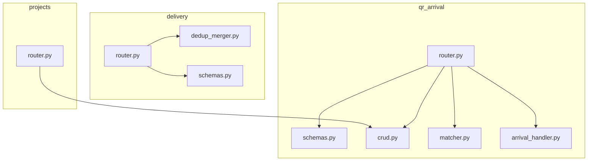
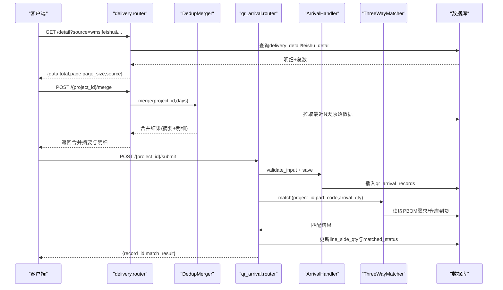
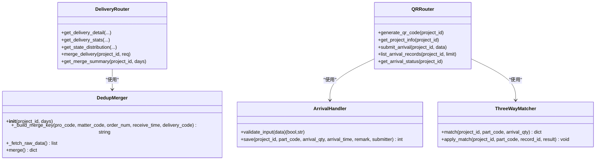
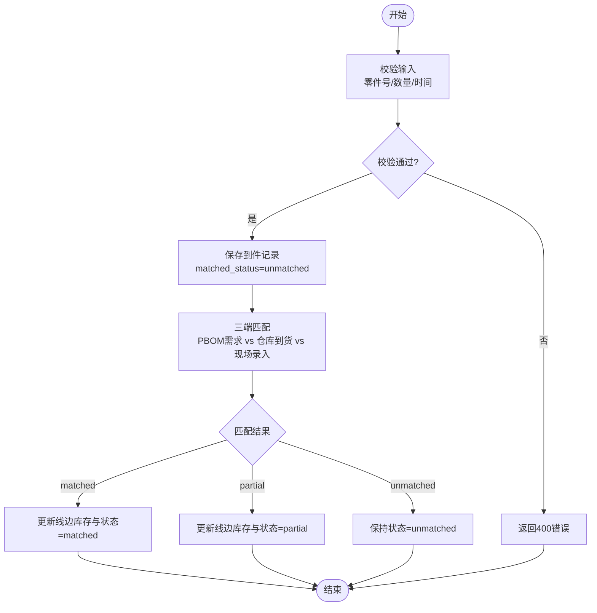

# 到货管理API

<cite>
**本文引用的文件**
- [backend/delivery/router.py](file://backend/delivery/router.py)
- [backend/delivery/schemas.py](file://backend/delivery/schemas.py)
- [backend/delivery/dedup_merger.py](file://backend/delivery/dedup_merger.py)
- [backend/qr_arrival/router.py](file://backend/qr_arrival/router.py)
- [backend/qr_arrival/schemas.py](file://backend/qr_arrival/schemas.py)
- [backend/qr_arrival/crud.py](file://backend/qr_arrival/crud.py)
- [backend/qr_arrival/matcher.py](file://backend/qr_arrival/matcher.py)
- [backend/qr_arrival/arrival_handler.py](file://backend/qr_arrival/arrival_handler.py)
- [backend/projects/router.py](file://backend/projects/router.py)
</cite>

## 目录
1. [简介](#简介)
2. [项目结构](#项目结构)
3. [核心组件](#核心组件)
4. [架构总览](#架构总览)
5. [详细接口说明](#详细接口说明)
6. [依赖关系分析](#依赖关系分析)
7. [性能与扩展性](#性能与扩展性)
8. [故障排查指南](#故障排查指南)
9. [结论](#结论)
10. [附录：调用示例与数据处理流程](#附录调用示例与数据处理流程)

## 简介
本模块提供“到货管理”的完整API能力，覆盖多源到货数据查询、状态统计、去重合并、现场扫码到件录入与三端匹配、以及到货与项目/任务的关联查询。主要功能包括：
- 到货单CRUD：通过WMS与飞书共享表的多源数据聚合，提供分页查询、筛选、统计等能力（读为主）。
- 到货状态跟踪：按数据库真实状态字段统计分布，支持时间范围过滤。
- 去重合并：基于五维键（项目号、零件号、数量、日期、单据号）进行跨源去重与异常检测。
- 现场到件：扫码生成二维码、提交到件信息、三端匹配（PBOM需求、仓库到货、现场录入）、更新线边库存与状态。
- 关联查询：按项目维度汇总到货、缺件、状态分布等信息。

## 项目结构
后端采用模块化路由组织：
- delivery：多源到货数据查询、统计、去重合并
- qr_arrival：现场扫码到件、三端匹配、状态同步
- projects：项目基础信息与缺件统计等

图表来源
- [backend/delivery/router.py:1-259](file://backend/delivery/router.py#L1-L259)
- [backend/delivery/dedup_merger.py:1-128](file://backend/delivery/dedup_merger.py#L1-L128)
- [backend/qr_arrival/router.py:1-88](file://backend/qr_arrival/router.py#L1-L88)
- [backend/qr_arrival/crud.py:1-104](file://backend/qr_arrival/crud.py#L1-L104)
- [backend/qr_arrival/matcher.py:1-123](file://backend/qr_arrival/matcher.py#L1-L123)
- [backend/projects/router.py:1-231](file://backend/projects/router.py#L1-L231)

章节来源
- [backend/delivery/router.py:1-259](file://backend/delivery/router.py#L1-L259)
- [backend/qr_arrival/router.py:1-88](file://backend/qr_arrival/router.py#L1-L88)
- [backend/projects/router.py:1-231](file://backend/projects/router.py#L1-L231)

## 核心组件
- 多源到货查询与统计：支持wms与feishu双源，提供分页、多维筛选、状态分布、综合统计。
- 去重合并器：按五维键分组，识别多源重复与数量异常，输出合并摘要与明细。
- 现场到件处理：输入校验、落库、三端匹配（PBOM需求、仓库到货、现场录入），更新线边库存与记录状态。
- 项目关联：按项目维度获取缺件、状态分布、统计指标。

章节来源
- [backend/delivery/dedup_merger.py:1-128](file://backend/delivery/dedup_merger.py#L1-L128)
- [backend/qr_arrival/matcher.py:1-123](file://backend/qr_arrival/matcher.py#L1-L123)
- [backend/qr_arrival/arrival_handler.py:1-72](file://backend/qr_arrival/arrival_handler.py#L1-L72)
- [backend/qr_arrival/crud.py:1-104](file://backend/qr_arrival/crud.py#L1-L104)
- [backend/projects/router.py:1-231](file://backend/projects/router.py#L1-L231)

## 架构总览

图表来源
- [backend/delivery/router.py:41-118](file://backend/delivery/router.py#L41-L118)
- [backend/delivery/router.py:229-259](file://backend/delivery/router.py#L229-L259)
- [backend/delivery/dedup_merger.py:48-128](file://backend/delivery/dedup_merger.py#L48-L128)
- [backend/qr_arrival/router.py:44-81](file://backend/qr_arrival/router.py#L44-L81)
- [backend/qr_arrival/arrival_handler.py:10-72](file://backend/qr_arrival/arrival_handler.py#L10-L72)
- [backend/qr_arrival/matcher.py:28-123](file://backend/qr_arrival/matcher.py#L28-L123)

## 详细接口说明

### 一、多源到货数据查询与统计（delivery）
- 基础路径前缀：/delivery
- 数据源：wms（delivery_detail）、feishu（feishu_detail）

1) 获取到货明细（分页+筛选）
- 方法：GET
- 路径：/delivery/detail
- 查询参数
  - page: 页码，默认1，最小1
  - page_size: 每页条数，默认50，最大500
  - search: 通用模糊搜索（送货单号/申请号/项目号/零件号/零件名）
  - state: 按数据库STATE字段过滤；空值/空白统一视为“未标注”
  - days: 仅wms有效，限制最近N天
  - delivery_code: 送货单号（优先于search）
  - apply_code: 试制申请单号
  - project_code: 项目号（wms用PRO_CODE，feishu用PRO_NAME）
  - part_code: 零件号
  - part_name: 零件名
  - exact: true=精确匹配，false=模糊匹配（默认）
  - source: wms或feishu，默认wms
- 响应
  - data: 记录列表
  - total: 总记录数
  - page: 当前页
  - page_size: 每页大小
  - source: 数据源标识
- 备注
  - state为“未标注”时，对wms源会匹配STATE为空或空白
  - feishu源不支持state过滤

2) 获取合并统计数据（wms+feishu）
- 方法：GET
- 路径：/delivery/stats
- 查询参数
  - days: 仅wms有效，限制最近N天
- 响应
  - data.total_records: 总记录数（两源合计）
  - data.total_order: 订单总数（两源合计）
  - data.total_in: 入库总数（两源合计）
  - data.total_cant: 不合格总数（两源合计）
  - data.project_count: 项目数（两源合计）
  - data.wms_records: wms记录数
  - data.feishu_records: feishu记录数

3) 状态分布（wms）
- 方法：GET
- 路径：/delivery/state-distribution
- 查询参数
  - days: 限制最近N天
- 响应
  - data: 数组，每项包含state与count
  - states: 标准状态枚举顺序

4) 状态分布（feishu）
- 方法：GET
- 路径：/delivery/feishu-state-distribution
- 响应
  - data: 已到货/部分到货/未到货计数
  - states: ["已到货","部分到货","未到货"]

5) 执行去重合并
- 方法：POST
- 路径：/delivery/{project_id}/merge
- 请求体
  - project_id: 项目ID
  - days: 统计最近N天，默认7，范围1-365
- 响应
  - total_raw: 原始记录数
  - merged_count: 合并后记录数
  - duplicate_count: 多源重复数
  - anomaly_count: 异常记录数（同一合并键下数量不一致）
  - records: 合并后的记录列表，包含merge_key、pro_code、matter_code、order_num、in_num、receive_time、sources、source_count、is_duplicate、is_anomaly

6) 获取去重合并摘要
- 方法：GET
- 路径：/delivery/{project_id}/merge-summary
- 查询参数
  - days: 1-365
- 响应
  - project_id, days, total_raw, merged_count, duplicate_count, anomaly_count

章节来源
- [backend/delivery/router.py:41-118](file://backend/delivery/router.py#L41-L118)
- [backend/delivery/router.py:121-164](file://backend/delivery/router.py#L121-L164)
- [backend/delivery/router.py:167-226](file://backend/delivery/router.py#L167-L226)
- [backend/delivery/router.py:229-259](file://backend/delivery/router.py#L229-L259)
- [backend/delivery/schemas.py:6-30](file://backend/delivery/schemas.py#L6-L30)
- [backend/delivery/dedup_merger.py:21-35](file://backend/delivery/dedup_merger.py#L21-L35)
- [backend/delivery/dedup_merger.py:48-128](file://backend/delivery/dedup_merger.py#L48-L128)

### 二、现场扫码到件与三端匹配（qr_arrival）
- 基础路径前缀：/api/qr-arrival

1) 生成项目二维码
- 方法：GET
- 路径：/api/qr-arrival/{project_id}/qr-code
- 响应：PNG图片流
- 错误：项目不存在或生成失败返回HTTP 500

2) 获取项目基本信息
- 方法：GET
- 路径：/api/qr-arrival/{project_id}/info
- 响应
  - project: {id,name,code,apply_code,status}
- 错误：项目不存在返回HTTP 404

3) 提交现场到件信息
- 方法：POST
- 路径：/api/qr-arrival/{project_id}/submit
- 请求体
  - part_code: 零件号，必填，长度1-200
  - arrival_qty: 到货数量，必填，正整数
  - arrival_time: 到货时间，格式YYYY-MM-DD HH:mm
  - remark: 可选，最长500字符
  - submitter: 可选，最长100字符
- 处理流程
  - 校验输入
  - 保存到件记录（初始matched_status=unmatched）
  - 三端匹配：对比PBOM需求、仓库到货、现场录入
  - 更新线边库存与记录状态
- 响应
  - record_id: 保存的记录ID
  - match_result: {status,message,detail}
    - status: matched | partial | unmatched
    - detail: {demand_qty, warehouse_qty, arrival_qty, line_side_qty}
- 错误：项目不存在返回HTTP 404；输入不合法返回HTTP 400

4) 获取项目的到件记录列表
- 方法：GET
- 路径：/api/qr-arrival/{project_id}/records
- 查询参数
  - limit: 1-200，默认50
- 响应
  - records: 记录列表
  - total: 记录数

5) 获取项目零件线边到货状态汇总
- 方法：GET
- 路径：/api/qr-arrival/{project_id}/status
- 响应
  - total_parts: 零件总数
  - pending_count: 待到货数
  - partial_count: 部分到货数
  - matched_count: 完全到货数
  - parts: 各零件的线边状态明细

章节来源
- [backend/qr_arrival/router.py:14-88](file://backend/qr_arrival/router.py#L14-L88)
- [backend/qr_arrival/schemas.py:6-46](file://backend/qr_arrival/schemas.py#L6-L46)
- [backend/qr_arrival/arrival_handler.py:10-72](file://backend/qr_arrival/arrival_handler.py#L10-L72)
- [backend/qr_arrival/matcher.py:28-123](file://backend/qr_arrival/matcher.py#L28-L123)
- [backend/qr_arrival/crud.py:4-104](file://backend/qr_arrival/crud.py#L4-L104)

### 三、到货与项目/任务关联查询（projects）
- 基础路径前缀：/projects

1) 项目列表
- 方法：GET
- 路径：/projects/
- 查询参数
  - page, page_size
- 响应
  - projects: 项目列表
  - total: 总数

2) 项目详情
- 方法：GET
- 路径：/projects/{project_id}
- 响应
  - project: 项目对象
- 错误：项目不存在返回HTTP 404

3) 创建项目
- 方法：POST
- 路径：/projects/
- 请求体
  - name, project_code, apply_code, apply_code2, status, trial_leader, process_leader, assembly_leader
- 响应
  - project: 新建项目
  - message: 成功提示

4) 更新项目
- 方法：PUT
- 路径：/projects/{project_id}
- 请求体：可更新字段（非空即更新）
- 响应
  - message: 成功提示
- 错误：项目不存在返回HTTP 404

5) 删除项目
- 方法：DELETE
- 路径：/projects/{project_id}
- 响应
  - message: 成功提示
- 错误：项目不存在返回HTTP 404

6) 项目零件清单
- 方法：GET
- 路径：/projects/{project_id}/parts
- 响应
  - parts: 零件列表

7) 项目统计
- 方法：GET
- 路径：/projects/{project_id}/stats
- 响应
  - total_parts, total_demand, total_received, total_line_side, matched_rate, critical_count

8) 缺件零件列表（分页+筛选）
- 方法：GET
- 路径：/projects/{project_id}/shortage-parts
- 查询参数
  - page, page_size
  - keyword: 搜索关键词（零件号/零件名/专业师）
  - doc_state_filter: 单据状态筛选（all/入库完成/待检/不合格待判定等）
  - warehouse_filter: 到货仓库筛选
- 响应
  - total, page, page_size, data

9) 未到仓库缺件的单据状态分布
- 方法：GET
- 路径：/projects/{project_id}/doc-state-distribution
- 响应
  - 按零件种类统计的单据状态分布

10) PBOM导入与清理
- 下载模板：GET /projects/pbom-template
- 清除PBOM零件：DELETE /projects/{project_id}/pbom-clear
- 上传PBOM并解析：POST /projects/{project_id}/pbom-upload（支持xlsx/xls/csv）

章节来源
- [backend/projects/router.py:20-231](file://backend/projects/router.py#L20-L231)

## 依赖关系分析
- delivery.router依赖database.query_all/query_one进行SQL查询，依赖DedupMerger实现去重合并逻辑。
- qr_arrival.router依赖ArrivalHandler进行输入校验与落库，依赖ThreeWayMatcher进行三端匹配，依赖crud进行数据读写。
- projects.router提供项目维度的统计与缺件查询，间接依赖delivery与qr_arrival的数据模型。

图表来源
- [backend/delivery/router.py:41-259](file://backend/delivery/router.py#L41-L259)
- [backend/delivery/dedup_merger.py:7-128](file://backend/delivery/dedup_merger.py#L7-L128)
- [backend/qr_arrival/router.py:14-88](file://backend/qr_arrival/router.py#L14-L88)
- [backend/qr_arrival/arrival_handler.py:7-72](file://backend/qr_arrival/arrival_handler.py#L7-L72)
- [backend/qr_arrival/matcher.py:11-123](file://backend/qr_arrival/matcher.py#L11-L123)

## 性能与扩展性
- 查询优化
  - 分页与LIMIT/OFFSET控制返回量，避免大结果集拖慢响应。
  - 时间窗口days限制减少扫描行数。
  - 独立字段搜索支持精确/模糊匹配，减少全表扫描。
- 合并算法
  - 五维键分组，内存中聚合，适合中等规模数据；大数据量建议分批次或引入缓存。
  - 多源重复与异常标记在分组阶段完成，O(N)复杂度。
- 三端匹配
  - 每次提交触发一次匹配，涉及PBOM与仓库查询；建议在高频场景增加缓存或异步处理。
- 扩展点
  - 新增数据源可在delivery.detail中扩展table_name与条件映射。
  - 匹配规则可在ThreeWayMatcher中扩展策略。

[本节为通用指导，无需具体文件引用]

## 故障排查指南
- 项目不存在
  - 现象：返回HTTP 404
  - 可能原因：project_id无效或已被删除
  - 处理：检查项目是否存在，必要时重新创建
- 输入校验失败
  - 现象：返回HTTP 400，message提示具体问题
  - 可能原因：零件号为空或超长、数量非正整数、时间格式错误、备注/提交人超长
  - 处理：根据提示修正请求体
- 状态分布为空
  - 现象：返回空数组或计数为0
  - 可能原因：无符合条件的数据或时间窗口过短
  - 处理：调整days或放宽筛选条件
- 合并结果为空
  - 现象：total_raw为0
  - 可能原因：项目无最近N天的到货数据
  - 处理：增大days或确认数据源是否已同步

章节来源
- [backend/qr_arrival/router.py:14-88](file://backend/qr_arrival/router.py#L14-L88)
- [backend/qr_arrival/arrival_handler.py:10-53](file://backend/qr_arrival/arrival_handler.py#L10-L53)
- [backend/delivery/router.py:167-226](file://backend/delivery/router.py#L167-L226)

## 结论
本模块提供了端到端的到货管理能力：从多源数据接入、去重合并、状态跟踪，到现场扫码录入与三端匹配，再到项目维度的统计与缺件分析。接口设计清晰、参数约束明确，便于前后端集成与后续扩展。

[本节为总结，无需具体文件引用]

## 附录：调用示例与数据处理流程

### 示例1：查询WMS到货明细（分页+筛选）
- 请求
  - GET /delivery/detail?page=1&page_size=50&source=wms&project_code=PRJ001&part_code=P100&exact=false&days=7
- 响应
  - {data:[...], total:120, page:1, page_size:50, source:"wms"}

### 示例2：执行去重合并
- 请求
  - POST /delivery/100/merge
  - Body: {project_id:100, days:7}
- 响应
  - {total_raw:120, merged_count:95, duplicate_count:15, anomaly_count:3, records:[...]}

### 示例3：现场到件提交与匹配
- 请求
  - POST /api/qr-arrival/100/submit
  - Body: {part_code:"P100", arrival_qty:10, arrival_time:"2024-05-01 10:30", remark:"首批到货", submitter:"张三"}
- 响应
  - {record_id:1001, match_result:{status:"partial", message:"部分到货: 录入10/20，仓库到货15", detail:{demand_qty:20, warehouse_qty:15, arrival_qty:10, line_side_qty:10}}}

### 示例4：获取项目到件状态汇总
- 请求
  - GET /api/qr-arrival/100/status
- 响应
  - {total_parts:50, pending_count:10, partial_count:20, matched_count:20, parts:[...]}

### 数据处理流程图（三端匹配）

图表来源
- [backend/qr_arrival/arrival_handler.py:10-72](file://backend/qr_arrival/arrival_handler.py#L10-L72)
- [backend/qr_arrival/matcher.py:28-123](file://backend/qr_arrival/matcher.py#L28-L123)
- [backend/qr_arrival/crud.py:4-83](file://backend/qr_arrival/crud.py#L4-L83)