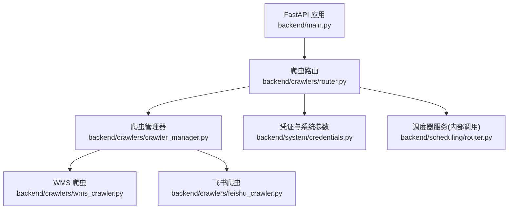
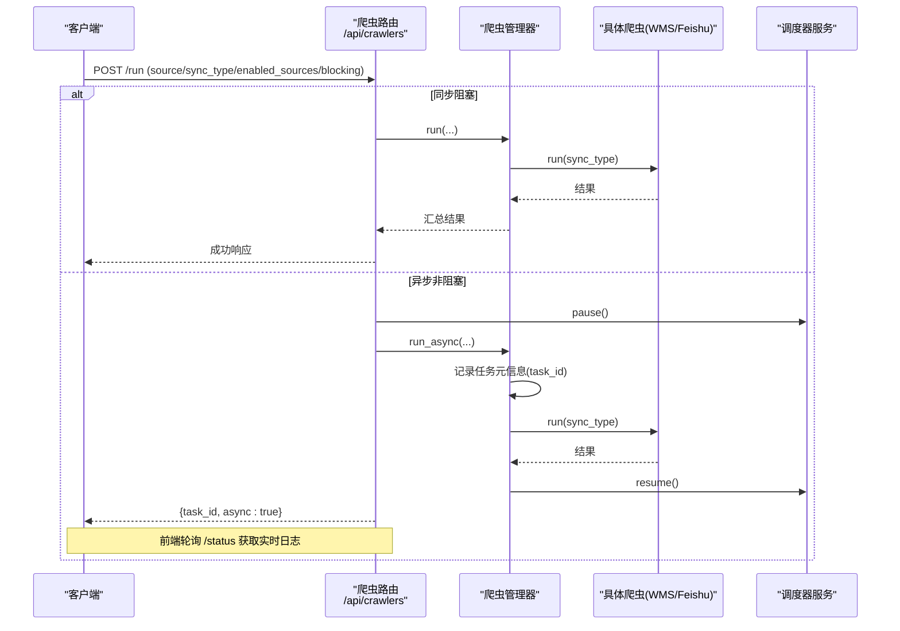
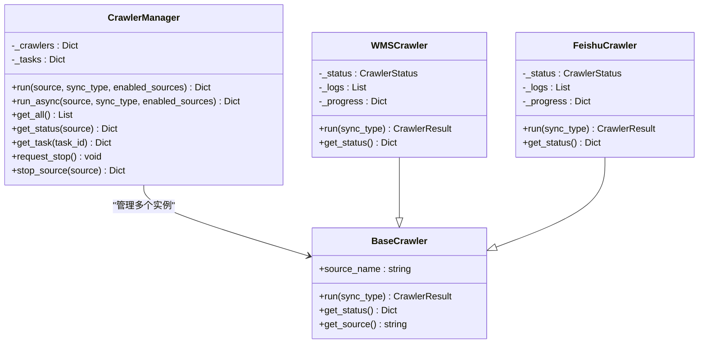

# 爬虫控制API

<cite>
**本文引用的文件**
- [backend/main.py](file://backend/main.py)
- [backend/crawlers/router.py](file://backend/crawlers/router.py)
- [backend/crawlers/crawler_manager.py](file://backend/crawlers/crawler_manager.py)
- [backend/crawlers/base.py](file://backend/crawlers/base.py)
- [backend/system/credentials.py](file://backend/system/credentials.py)
- [backend/scheduling/router.py](file://backend/scheduling/router.py)
- [backend/crawlers/wms_crawler.py](file://backend/crawlers/wms_crawler.py)
- [backend/crawlers/feishu_crawler.py](file://backend/crawlers/feishu_crawler.py)
</cite>

## 目录
1. [简介](#简介)
2. [项目结构](#项目结构)
3. [核心组件](#核心组件)
4. [架构总览](#架构总览)
5. [详细接口说明](#详细接口说明)
6. [依赖关系分析](#依赖关系分析)
7. [性能与并发特性](#性能与并发特性)
8. [故障排查指南](#故障排查指南)
9. [结论](#结论)
10. [附录：调用示例](#附录调用示例)

## 简介
本文件为“爬虫控制模块”的完整API接口文档，覆盖任务管理、执行控制、状态监控、配置更新、调度器启停、多源数据采集统一控制等能力。所有接口均基于FastAPI路由暴露，统一前缀为 /api/crawlers。系统支持同步阻塞与异步非阻塞两种执行模式，并提供实时日志轮询、错误处理与调度器协调机制。

## 项目结构
后端采用模块化路由组织：
- 应用入口负责注册各模块路由、全局异常处理、健康检查与静态资源托管
- 爬虫路由提供统一的爬虫控制API（配置、运行、停止、状态、摘要、调度器控制）
- 爬虫管理器集中管理多个数据源爬虫实例，封装同步/异步执行、任务元信息、停止标志与结果汇总
- 凭证与系统参数管理用于保存/读取爬虫配置、登录凭证、飞书Token等
- 调度器路由预留扩展点，当前由爬虫路由通过内部服务调用进行启停与重配

图表来源
- [backend/main.py:74-83](file://backend/main.py#L74-L83)
- [backend/crawlers/router.py:1-225](file://backend/crawlers/router.py#L1-L225)
- [backend/crawlers/crawler_manager.py:22-305](file://backend/crawlers/crawler_manager.py#L22-L305)
- [backend/crawlers/wms_crawler.py:44-125](file://backend/crawlers/wms_crawler.py#L44-L125)
- [backend/crawlers/feishu_crawler.py:55-82](file://backend/crawlers/feishu_crawler.py#L55-L82)
- [backend/system/credentials.py:295-418](file://backend/system/credentials.py#L295-L418)
- [backend/scheduling/router.py:1-14](file://backend/scheduling/router.py#L1-L14)

章节来源
- [backend/main.py:74-83](file://backend/main.py#L74-L83)

## 核心组件
- 爬虫基类与枚举：定义同步类型、状态、结果结构与抽象接口
- 爬虫管理器：统一调度、任务跟踪、停止控制、结果聚合
- 具体爬虫实现：WMS、飞书等数据源的具体抓取逻辑
- 凭证与系统参数：爬虫配置、自动登录、Token管理
- 调度器：按配置间隔自动执行增量/全量同步（通过内部服务调用）

章节来源
- [backend/crawlers/base.py:12-67](file://backend/crawlers/base.py#L12-L67)
- [backend/crawlers/crawler_manager.py:22-305](file://backend/crawlers/crawler_manager.py#L22-L305)
- [backend/system/credentials.py:295-418](file://backend/system/credentials.py#L295-L418)

## 架构总览
爬虫控制API通过路由层接收请求，交由爬虫管理器执行；管理器根据source或enabled_sources选择具体爬虫实例，支持同步阻塞或后台线程异步执行；执行过程中维护任务元信息与实时日志；完成后恢复调度器并返回结果。

图表来源
- [backend/crawlers/router.py:89-147](file://backend/crawlers/router.py#L89-L147)
- [backend/crawlers/crawler_manager.py:134-197](file://backend/crawlers/crawler_manager.py#L134-L197)
- [backend/crawlers/crawler_manager.py:200-301](file://backend/crawlers/crawler_manager.py#L200-L301)

## 详细接口说明

### 通用约定
- 基础路径：/api/crawlers
- 请求体字段兼容多种命名（如 source/crawler/name、sync_type/mode/type），以实际解析逻辑为准
- 响应格式：多数接口返回包含 success/data/message/error 的结构化JSON
- 错误处理：业务异常统一由全局处理器返回标准错误结构

### 配置管理
- GET /api/crawlers/config
  - 功能：读取爬虫同步配置（含启用数据源列表、模式、间隔、自动登录开关等）
  - 响应：{ success: true, data: <配置对象> }
- POST /api/crawlers/config
  - 功能：保存爬虫同步配置，并通知调度器重新加载
  - 请求体：可选字典，键包括 crawler_mode、crawler_incremental_interval_minutes、crawler_full_interval_hours、crawler_enabled_sources、crawler_auto_login、crawler_last_run_at、crawler_last_full_run_at、crawler_last_status
  - 响应：{ success: true, data: <已保存字段>, message: "配置已保存" }

章节来源
- [backend/crawlers/router.py:43-58](file://backend/crawlers/router.py#L43-L58)
- [backend/system/credentials.py:295-418](file://backend/system/credentials.py#L295-L418)

### 状态监控
- GET /api/crawlers/status
  - 功能：获取所有爬虫状态（含进度、日志）、当前配置、可用数据源列表
  - 响应：{ success: true, data: { crawlers: [...], config: {...}, sources: [...] } }
- GET /api/crawlers/status/{source}
  - 功能：获取指定数据源的爬虫状态
  - 响应：{ success: true, data: <该爬虫状态> }
- GET /api/crawlers/task/{task_id}
  - 功能：获取异步任务的元信息（running/result/end_time 等）
  - 响应：{ success: true/false, data: <任务元信息> }

章节来源
- [backend/crawlers/router.py:61-86](file://backend/crawlers/router.py#L61-L86)
- [backend/crawlers/crawler_manager.py:99-110](file://backend/crawlers/crawler_manager.py#L99-L110)

### 执行控制
- POST /api/crawlers/run
  - 功能：启动爬虫执行（支持单源或多源）
  - 请求体字段（可选）：
    - source/crawler/name：目标数据源名称（不传则全部执行）
    - sync_type/mode/type：auto/full/incremental（若 force_full=true 则强制 full）
    - enabled_sources：启用的数据源列表（优先级高于数据库配置；单源运行时忽略）
    - blocking：true 则同步阻塞（默认 false 异步）
  - 响应：
    - 同步：{ success: true, data: <执行结果>, message: "爬虫执行完成" }
    - 异步：{ success: true, async: true, task_id: "<id>", message: "已在后台启动..." }
  - 行为：
    - 异步模式下会暂停调度器避免冲突，任务完成后恢复调度器
    - 同步模式下会更新最近执行时间与全量执行时间
- POST /api/crawlers/start_scheduler
  - 功能：启动自动调度器（按配置间隔自动执行增量同步）
  - 响应：{ success: true, message: "自动调度器已启动" }
- POST /api/crawlers/stop_scheduler
  - 功能：停止自动调度器
  - 响应：{ success: true, message: "自动调度器已停止" }
- POST /api/crawlers/stop
  - 功能：停止正在运行的爬虫任务
  - 请求体字段（可选）：source（停止指定数据源；不传则停止全部）
  - 响应：{ success: true, data/message: <停止结果> }

章节来源
- [backend/crawlers/router.py:89-225](file://backend/crawlers/router.py#L89-L225)
- [backend/crawlers/crawler_manager.py:134-197](file://backend/crawlers/crawler_manager.py#L134-L197)
- [backend/crawlers/crawler_manager.py:200-301](file://backend/crawlers/crawler_manager.py#L200-L301)

### 摘要与统计
- GET /api/crawlers/summary
  - 功能：获取页面顶部信息栏所需的执行摘要（配置、各爬虫状态、总数、是否运行中、调度器状态）
  - 响应：{ success: true, data: { config, crawlers, source_count, total, is_running, scheduler } }

章节来源
- [backend/crawlers/router.py:150-177](file://backend/crawlers/router.py#L150-L177)

### 多源数据采集器统一控制
- 数据源列表：通过 /api/crawlers/status 的 data.sources 获取
- 统一执行：不传 source 且未指定 enabled_sources 时，默认执行所有已注册爬虫
- 选择性执行：传入 enabled_sources 可限定执行范围；传入 source 仅执行该源
- 同步/异步：blocking=true 同步阻塞；否则异步并返回 task_id

章节来源
- [backend/crawlers/crawler_manager.py:90-97](file://backend/crawlers/crawler_manager.py#L90-L97)
- [backend/crawlers/crawler_manager.py:200-301](file://backend/crawlers/crawler_manager.py#L200-L301)

### 执行日志查询
- 实时日志：通过轮询 /api/crawlers/status 获取每个爬虫的 logs 与 progress
- 任务元信息：通过 /api/crawlers/task/{task_id} 获取任务运行状态、开始/结束时间、最终结果
- 日志限制：单个爬虫日志缓冲区上限为500行，避免无限增长

章节来源
- [backend/crawlers/router.py:61-86](file://backend/crawlers/router.py#L61-L86)
- [backend/crawlers/wms_crawler.py:111-125](file://backend/crawlers/wms_crawler.py#L111-L125)
- [backend/crawlers/feishu_crawler.py:72-82](file://backend/crawlers/feishu_crawler.py#L72-L82)

### 错误处理
- 业务异常：全局处理器将 BusinessError 转换为 { error: message } 的JSON响应
- 执行异常：异步任务捕获异常并标记 status=failed，同时记录错误信息到任务元信息
- 停止流程：设置停止标志后，爬虫在循环检查点优雅退出

章节来源
- [backend/main.py:85-92](file://backend/main.py#L85-L92)
- [backend/crawlers/crawler_manager.py:168-187](file://backend/crawlers/crawler_manager.py#L168-L187)
- [backend/crawlers/crawler_manager.py:39-56](file://backend/crawlers/crawler_manager.py#L39-L56)

## 依赖关系分析
- 路由层依赖爬虫管理器与凭证/系统参数模块
- 管理器依赖具体爬虫实现（WMS、飞书、采购等）
- 爬虫实现依赖数据库访问、网络请求、配置与日志
- 调度器通过内部服务调用被路由层触发（暂停/恢复/重配）

图表来源
- [backend/crawlers/base.py:12-67](file://backend/crawlers/base.py#L12-L67)
- [backend/crawlers/wms_crawler.py:44-125](file://backend/crawlers/wms_crawler.py#L44-L125)
- [backend/crawlers/feishu_crawler.py:55-82](file://backend/crawlers/feishu_crawler.py#L55-L82)
- [backend/crawlers/crawler_manager.py:22-305](file://backend/crawlers/crawler_manager.py#L22-L305)

章节来源
- [backend/crawlers/crawler_manager.py:22-305](file://backend/crawlers/crawler_manager.py#L22-L305)

## 性能与并发特性
- 异步执行：默认非阻塞，使用后台线程执行，降低请求延迟，便于前端实时日志轮询
- 重试与退避：网络请求失败时采用指数退避重试，提升稳定性
- 日志缓冲：单爬虫日志上限500行，减少内存占用
- 连接复用：WMS爬虫使用 requests.Session 复用连接，减少握手开销
- 分页拉取：WMS与飞书均采用分页策略，避免单次请求过大

章节来源
- [backend/crawlers/wms_crawler.py:15-31](file://backend/crawlers/wms_crawler.py#L15-L31)
- [backend/crawlers/wms_crawler.py:180-200](file://backend/crawlers/wms_crawler.py#L180-L200)
- [backend/crawlers/feishu_crawler.py:132-200](file://backend/crawlers/feishu_crawler.py#L132-L200)
- [backend/crawlers/crawler_manager.py:134-197](file://backend/crawlers/crawler_manager.py#L134-L197)

## 故障排查指南
- 无法获取Token：
  - 检查系统设置中的凭证是否有效（Authorization/Cookie/用户名密码）
  - 使用 /api/system/login 或 /api/system/credentials/sync 更新凭证
- 爬虫执行失败：
  - 查看 /api/crawlers/status 中对应爬虫的 logs 与 progress
  - 通过 /api/crawlers/task/{task_id} 获取任务最终状态与错误信息
- 调度器未自动执行：
  - 确认已调用 /api/crawlers/start_scheduler
  - 检查配置中的 crawler_mode、crawler_incremental_interval_minutes、crawler_full_interval_hours
- 停止无效：
  - 确认爬虫是否处于 running 状态
  - 调用 /api/crawlers/stop 并检查 was_running 标志

章节来源
- [backend/system/credentials.py:25-118](file://backend/system/credentials.py#L25-L118)
- [backend/crawlers/router.py:61-86](file://backend/crawlers/router.py#L61-L86)
- [backend/crawlers/router.py:180-225](file://backend/crawlers/router.py#L180-L225)

## 结论
本爬虫控制API提供了完整的任务管理、执行控制、状态监控与配置更新能力，支持多源数据采集器的统一控制与异步实时日志轮询。通过合理的错误处理与调度器协调，确保系统在稳定与高效的前提下运行。

## 附录：调用示例
以下为典型调用场景的请求参数与响应要点（不展示具体代码内容）：

- 启动异步执行（全部数据源）
  - 方法：POST /api/crawlers/run
  - 请求体：{ "sync_type": "auto", "enabled_sources": ["wms","feishu"], "blocking": false }
  - 响应：{ "success": true, "async": true, "task_id": "...", "message": "..." }
  - 后续：轮询 /api/crawlers/status 获取实时日志；必要时通过 /api/crawlers/task/{task_id} 获取任务详情

- 启动同步执行（单源）
  - 方法：POST /api/crawlers/run
  - 请求体：{ "source": "wms", "sync_type": "full", "blocking": true }
  - 响应：{ "success": true, "data": { "status": "success", "total": ..., "inserted": ..., "updated": ... }, "message": "爬虫执行完成" }

- 停止指定数据源
  - 方法：POST /api/crawlers/stop
  - 请求体：{ "source": "feishu" }
  - 响应：{ "success": true, "data": { "was_running": true, "message": "已请求停止..." } }

- 启动/停止调度器
  - 方法：POST /api/crawlers/start_scheduler 或 /api/crawlers/stop_scheduler
  - 响应：{ "success": true, "message": "自动调度器已启动/停止" }

- 读取/更新配置
  - 方法：GET /api/crawlers.config 或 POST /api/crawlers/config
  - 请求体：包含 crawler_mode、crawler_incremental_interval_minutes、crawler_full_interval_hours、crawler_enabled_sources、crawler_auto_login 等
  - 响应：{ "success": true, "data": <已保存字段>, "message": "配置已保存" }

章节来源
- [backend/crawlers/router.py:43-225](file://backend/crawlers/router.py#L43-L225)
- [backend/system/credentials.py:295-418](file://backend/system/credentials.py#L295-L418)