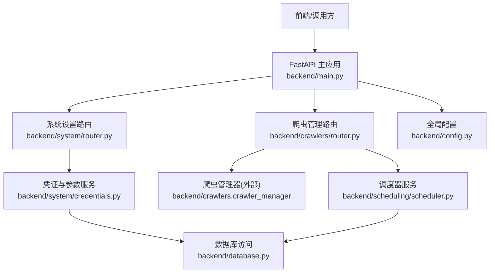
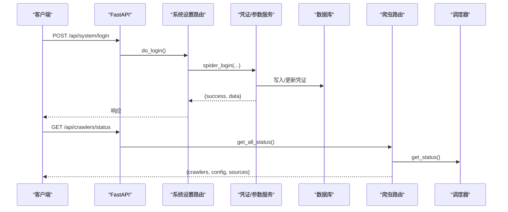
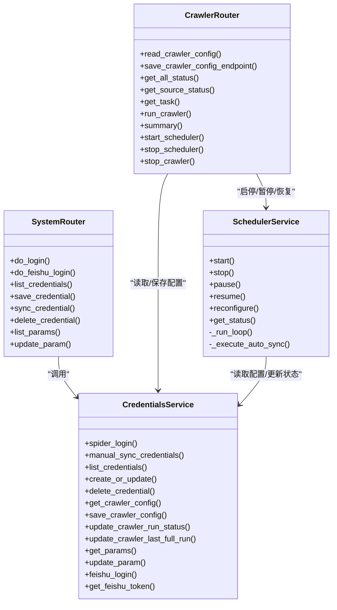

# 系统配置API

<cite>
**本文引用的文件**
- [backend/system/router.py](file://backend/system/router.py)
- [backend/system/credentials.py](file://backend/system/credentials.py)
- [backend/crawlers/router.py](file://backend/crawlers/router.py)
- [backend/scheduling/scheduler.py](file://backend/scheduling/scheduler.py)
- [backend/main.py](file://backend/main.py)
- [backend/config.py](file://backend/config.py)
- [backend/database.py](file://backend/database.py)
- [backend/scripts/init_db.py](file://backend/scripts/init_db.py)
</cite>

## 目录
1. [简介](#简介)
2. [项目结构](#项目结构)
3. [核心组件](#核心组件)
4. [架构总览](#架构总览)
5. [详细接口说明](#详细接口说明)
6. [依赖关系分析](#依赖关系分析)
7. [性能与可用性](#性能与可用性)
8. [故障排查指南](#故障排查指南)
9. [结论](#结论)
10. [附录：安全最佳实践](#附录：安全最佳实践)

## 简介
本文件为“系统配置模块”的完整API文档，覆盖以下能力：
- 系统参数管理：查询、更新系统参数（含爬虫运行相关参数）
- 凭据管理：多数据源凭证的增删改查、自动登录获取Token、手动同步Token/Cookie、飞书应用登录
- 爬虫控制：启动/停止调度器、执行爬虫任务、查看状态与摘要
- 运维监控：健康检查、调度器状态、爬虫运行状态

所有接口均基于FastAPI实现，统一前缀为 /api/system 或 /api/crawlers。

## 项目结构
系统配置相关的代码主要分布在以下模块：
- 路由层：system.router、crawlers.router
- 业务逻辑：system.credentials（凭证、参数、爬虫配置）、scheduling.scheduler（定时调度）
- 应用入口：main.py（注册路由、CORS、健康检查）
- 配置与环境：config.py（环境变量读取）
- 数据库：database.py（连接池与SQL封装）、scripts/init_db.py（表结构与默认参数初始化）

图表来源
- [backend/main.py:74-83](file://backend/main.py#L74-L83)
- [backend/system/router.py:1-109](file://backend/system/router.py#L1-L109)
- [backend/crawlers/router.py:1-225](file://backend/crawlers/router.py#L1-L225)
- [backend/system/credentials.py:1-573](file://backend/system/credentials.py#L1-L573)
- [backend/scheduling/scheduler.py:1-196](file://backend/scheduling/scheduler.py#L1-L196)
- [backend/database.py:1-116](file://backend/database.py#L1-L116)
- [backend/config.py:1-102](file://backend/config.py#L1-L102)

章节来源
- [backend/main.py:74-83](file://backend/main.py#L74-L83)
- [backend/system/router.py:1-109](file://backend/system/router.py#L1-L109)
- [backend/crawlers/router.py:1-225](file://backend/crawlers/router.py#L1-L225)

## 核心组件
- 系统设置路由：提供登录、凭证管理、系统参数等接口
- 凭证与参数服务：实现多源凭证存储、自动登录、飞书登录、爬虫配置读写、系统参数读写
- 爬虫管理路由：提供爬虫配置、运行、状态、摘要、调度器启停等接口
- 调度器服务：后台线程按配置周期执行增量同步，支持暂停/恢复/重配置
- 数据库访问：连接池、通用查询与执行方法
- 全局配置：从 .env 加载服务与第三方集成配置

章节来源
- [backend/system/router.py:1-109](file://backend/system/router.py#L1-L109)
- [backend/system/credentials.py:1-573](file://backend/system/credentials.py#L1-L573)
- [backend/crawlers/router.py:1-225](file://backend/crawlers/router.py#L1-L225)
- [backend/scheduling/scheduler.py:1-196](file://backend/scheduling/scheduler.py#L1-L196)
- [backend/database.py:1-116](file://backend/database.py#L1-L116)
- [backend/config.py:1-102](file://backend/config.py#L1-L102)

## 架构总览
系统通过FastAPI暴露REST API，系统设置与爬虫控制分别由不同路由处理，底层依赖统一的数据库访问与配置中心。调度器在应用启动时启动，关闭时停止；爬虫任务可异步执行并返回任务ID供轮询。

图表来源
- [backend/system/router.py:54-63](file://backend/system/router.py#L54-L63)
- [backend/system/credentials.py:25-118](file://backend/system/credentials.py#L25-L118)
- [backend/crawlers/router.py:61-71](file://backend/crawlers/router.py#L61-L71)
- [backend/scheduling/scheduler.py:67-74](file://backend/scheduling/scheduler.py#L67-L74)

## 详细接口说明

### 基础信息
- 基础路径
  - 系统设置：/api/system
  - 爬虫管理：/api/crawlers
- 认证方式：当前未内置鉴权中间件，建议在生产环境前置网关或添加鉴权中间件
- 请求/响应格式：JSON

章节来源
- [backend/main.py:74-83](file://backend/main.py#L74-L83)

### 系统设置模块（/api/system）

#### 登录获取Token
- 接口：POST /api/system/login
- 功能：模拟登录WMS(d360)获取JWT Token并保存凭证
- 请求体字段
  - source: 字符串，默认 wms
  - username: 字符串
  - password: 字符串
  - env: 字符串，默认 prod
- 响应
  - success: 布尔
  - message: 字符串
  - data: 包含 token、cookie、source
- 错误
  - 网络异常或登录失败时返回 success=false 及错误信息

章节来源
- [backend/system/router.py:54-57](file://backend/system/router.py#L54-L57)
- [backend/system/credentials.py:25-118](file://backend/system/credentials.py#L25-L118)

#### 飞书应用登录
- 接口：POST /api/system/login/feishu
- 功能：使用 app_id/app_secret 获取 tenant_access_token 并保存凭证
- 请求体字段
  - app_id: 字符串
  - app_secret: 字符串
- 响应
  - success: 布尔
  - message: 字符串
  - data: 包含 token、expire_at

章节来源
- [backend/system/router.py:60-63](file://backend/system/router.py#L60-L63)
- [backend/system/credentials.py:476-506](file://backend/system/credentials.py#L476-L506)

#### 凭证管理
- 列出凭证
  - 接口：GET /api/system/credentials
  - 响应：data 数组，每项包含 id、source、name、token_type、token（脱敏）、username、is_active、create_time
- 保存/更新凭证
  - 接口：POST /api/system/credentials
  - 请求体字段
    - source: 字符串
    - name: 字符串
    - config: 对象（兼容 V4/V5，可包含 authorization、cookie、username、password 等）
    - is_active: 整数，默认 1
  - 响应：data 表示创建或更新结果
- 删除凭证
  - 接口：DELETE /api/system/credentials/{source}
  - 响应：message 提示已删除

章节来源
- [backend/system/router.py:68-96](file://backend/system/router.py#L68-L96)
- [backend/system/credentials.py:174-286](file://backend/system/credentials.py#L174-L286)

#### 手动同步凭证
- 接口：POST /api/system/credentials/sync
- 功能：从浏览器复制 Token/Cookie 或用户名密码进行同步
- 请求体字段
  - source: 字符串
  - token_type: 字符串，默认 jwt
  - token: 字符串，优先使用
  - authorization: 字符串，备用
  - cookie: 字符串
  - username: 字符串
  - password: 字符串
- 响应
  - success: 布尔
  - message: 字符串
  - data: 包含 token、cookie、source（当提供Token/Cookie时）

章节来源
- [backend/system/router.py:79-90](file://backend/system/router.py#L79-L90)
- [backend/system/credentials.py:121-148](file://backend/system/credentials.py#L121-L148)

#### 系统参数
- 列出参数
  - 接口：GET /api/system/params
  - 响应：data 数组，每项包含 param_key、param_value、param_type、description
- 更新参数
  - 接口：POST /api/system/params
  - 请求体字段
    - param_key: 字符串
    - param_value: 字符串
  - 响应：message 提示更新成功

章节来源
- [backend/system/router.py:101-109](file://backend/system/router.py#L101-L109)
- [backend/system/credentials.py:420-441](file://backend/system/credentials.py#L420-L441)

### 爬虫控制模块（/api/crawlers）

#### 读取爬虫配置
- 接口：GET /api/crawlers/config
- 响应：success=true，data 包含爬虫模式、间隔、启用数据源列表、最近执行时间、状态等

章节来源
- [backend/crawlers/router.py:43-46](file://backend/crawlers/router.py#L43-L46)
- [backend/system/credentials.py:339-363](file://backend/system/credentials.py#L339-L363)

#### 保存爬虫配置
- 接口：POST /api/crawlers/config
- 请求体：键值对，支持 crawler_mode、crawler_incremental_interval_minutes、crawler_full_interval_hours、crawler_enabled_sources、crawler_auto_login 等
- 行为：保存后通知调度器重新读取配置
- 响应：success=true，data 为保存的键值映射

章节来源
- [backend/crawlers/router.py:49-58](file://backend/crawlers/router.py#L49-L58)
- [backend/system/credentials.py:366-401](file://backend/system/credentials.py#L366-L401)

#### 获取全部爬虫状态
- 接口：GET /api/crawlers/status
- 响应：包含 crawlers、config、sources

章节来源
- [backend/crawlers/router.py:61-71](file://backend/crawlers/router.py#L61-L71)

#### 获取指定爬虫状态
- 接口：GET /api/crawlers/status/{source}
- 响应：data 为该 source 的状态

章节来源
- [backend/crawlers/router.py:74-77](file://backend/crawlers/router.py#L74-L77)

#### 获取任务详情
- 接口：GET /api/crawlers/task/{task_id}
- 响应：data 包含 running/result/end_time 等元信息

章节来源
- [backend/crawlers/router.py:80-86](file://backend/crawlers/router.py#L80-L86)

#### 执行爬虫（异步/阻塞）
- 接口：POST /api/crawlers/run
- 请求体字段（可选）
  - source: 数据源名称
  - sync_type/mode/type: auto/full/incremental
  - enabled_sources: 启用数据源列表
  - force_full: true 则强制全量
  - blocking: true 则同步阻塞（默认 false 异步）
- 行为
  - 非阻塞：立即返回 task_id，前端轮询日志
  - 阻塞：等待执行完成并返回结果
  - 非阻塞模式下会暂停调度器避免冲突
- 响应
  - 异步：async=true，task_id
  - 阻塞：data=执行结果

章节来源
- [backend/crawlers/router.py:89-147](file://backend/crawlers/router.py#L89-L147)

#### 执行摘要
- 接口：GET /api/crawlers/summary
- 响应：包含 config、crawlers、source_count、total、is_running、scheduler 状态

章节来源
- [backend/crawlers/router.py:150-177](file://backend/crawlers/router.py#L150-L177)

#### 启动/停止自动调度器
- 启动：POST /api/crawlers/start_scheduler
- 停止：POST /api/crawlers/stop_scheduler
- 响应：success 与 message

章节来源
- [backend/crawlers/router.py:180-201](file://backend/crawlers/router.py#L180-L201)
- [backend/scheduling/scheduler.py:34-51](file://backend/scheduling/scheduler.py#L34-L51)

#### 停止正在运行的爬虫
- 接口：POST /api/crawlers/stop
- 请求体字段（可选）
  - source: 停止指定数据源的爬虫；不传则停止全部
- 行为：停止全部时会恢复调度器

章节来源
- [backend/crawlers/router.py:204-225](file://backend/crawlers/router.py#L204-L225)

### 健康检查
- 接口：GET /api/health
- 响应：status="ok"，message 提示系统运行中

章节来源
- [backend/main.py:94-97](file://backend/main.py#L94-L97)

## 依赖关系分析
- 路由到服务
  - system.router 依赖 system.credentials
  - crawlers.router 依赖 crawler_manager（外部模块）与 system.credentials（配置与状态）
- 调度器
  - scheduling.scheduler 周期性读取 system.credentials.get_crawler_config，并在自动模式下调用 crawler_manager.run
- 数据库
  - credentials.py 与 scheduler.py 通过 database.py 访问 MySQL
- 配置
  - config.py 提供全局配置项（如服务器端口、CORS、第三方服务地址等）

图表来源
- [backend/system/router.py:1-109](file://backend/system/router.py#L1-L109)
- [backend/system/credentials.py:1-573](file://backend/system/credentials.py#L1-L573)
- [backend/crawlers/router.py:1-225](file://backend/crawlers/router.py#L1-L225)
- [backend/scheduling/scheduler.py:1-196](file://backend/scheduling/scheduler.py#L1-L196)

章节来源
- [backend/system/router.py:1-109](file://backend/system/router.py#L1-L109)
- [backend/system/credentials.py:1-573](file://backend/system/credentials.py#L1-L573)
- [backend/crawlers/router.py:1-225](file://backend/crawlers/router.py#L1-L225)
- [backend/scheduling/scheduler.py:1-196](file://backend/scheduling/scheduler.py#L1-L196)

## 性能与可用性
- 数据库连接池：使用 PooledDB，最大连接数与缓存连接数可控，降低频繁建连开销
- 爬虫任务：默认异步执行，减少接口阻塞；支持阻塞模式用于兼容旧流程
- 调度器：后台线程独立运行，支持暂停/恢复/重配置，避免与手动任务冲突
- 超时与重试：登录与外部API调用设置了超时；调度器循环内捕获异常并延迟重试
- CORS：通过中间件允许跨域，生产环境建议限制允许的源

章节来源
- [backend/database.py:12-43](file://backend/database.py#L12-L43)
- [backend/crawlers/router.py:89-147](file://backend/crawlers/router.py#L89-L147)
- [backend/scheduling/scheduler.py:93-153](file://backend/scheduling/scheduler.py#L93-L153)
- [backend/main.py:66-72](file://backend/main.py#L66-L72)

## 故障排查指南
- 无法连接数据库
  - 检查 backend/.env 中的 DB_HOST/DB_PORT/DB_USER/DB_PASSWORD/DB_DATABASE
  - 查看数据库连接池初始化日志
- 登录失败或无Token
  - 确认目标系统可达（公司内网），否则仅保存凭证
  - 检查登录响应是否包含 token/authorization/access_token/tokenHead
- 飞书Token获取失败
  - 校验 app_id/app_secret 是否正确
  - 检查网络连通性与API返回码
- 调度器未执行
  - 确认爬虫配置 mode=auto 且 interval>0
  - 查看 summary 中的 scheduler 状态
- 爬虫任务卡住
  - 使用 stop 接口停止任务并恢复调度器
  - 通过 task/{task_id} 查看任务元信息

章节来源
- [backend/database.py:12-43](file://backend/database.py#L12-L43)
- [backend/system/credentials.py:25-118](file://backend/system/credentials.py#L25-L118)
- [backend/system/credentials.py:448-473](file://backend/system/credentials.py#L448-L473)
- [backend/crawlers/router.py:180-225](file://backend/crawlers/router.py#L180-L225)

## 结论
系统配置模块提供了完善的系统参数管理、凭据管理与爬虫控制能力，结合后台调度器实现了自动化运维。建议在生产环境中补充鉴权与审计机制，并对敏感配置进行加密与最小权限访问控制。

## 附录：安全最佳实践
- 传输安全
  - 使用HTTPS对外暴露API，避免明文传输Token与Cookie
- 访问控制
  - 增加鉴权中间件（如JWT校验、RBAC），限制系统设置与爬虫控制接口的访问
- 敏感数据保护
  - 对存储的敏感字段（如password、app_secret）进行加密存储
  - 日志中避免打印完整Token或Cookie
- 最小权限原则
  - 数据库账号仅授予必要权限
  - 限制CORS允许的源
- 操作审计
  - 记录关键操作的日志（登录、凭证变更、爬虫启停）
- 配置管理
  - 将敏感配置放入环境变量或密钥管理服务，避免硬编码

[本节为通用指导，不直接分析具体文件]