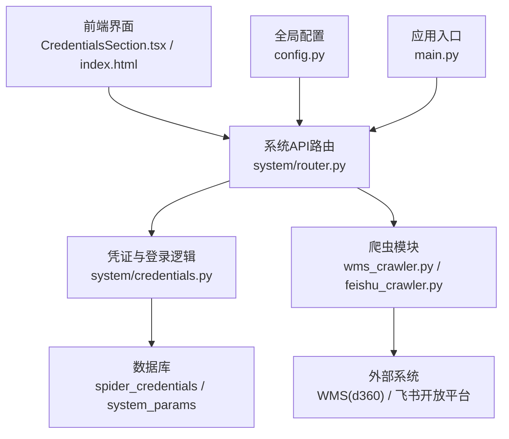
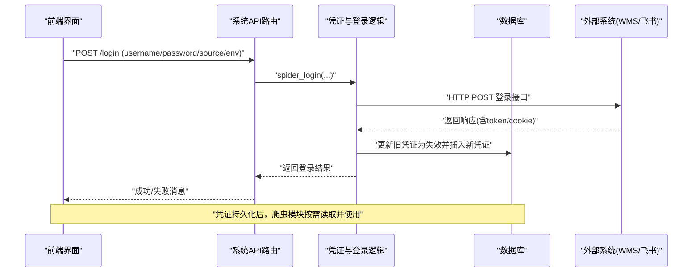
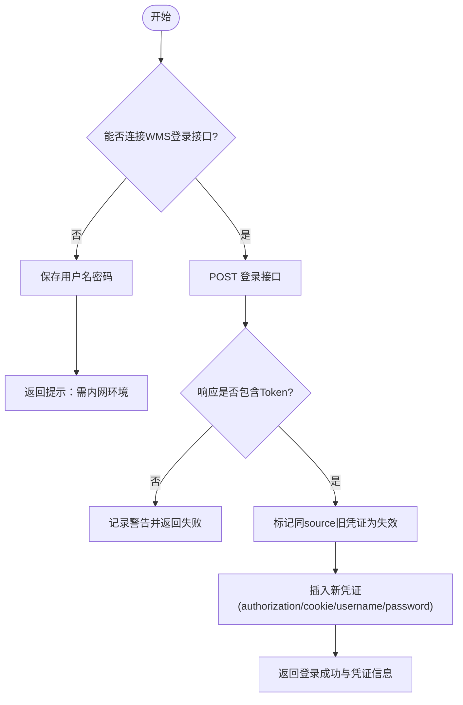
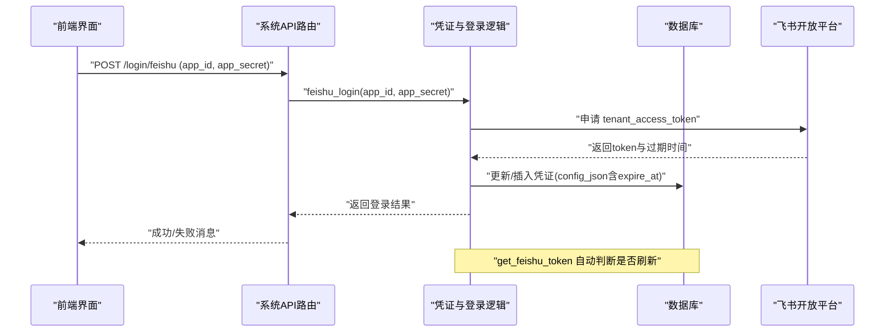
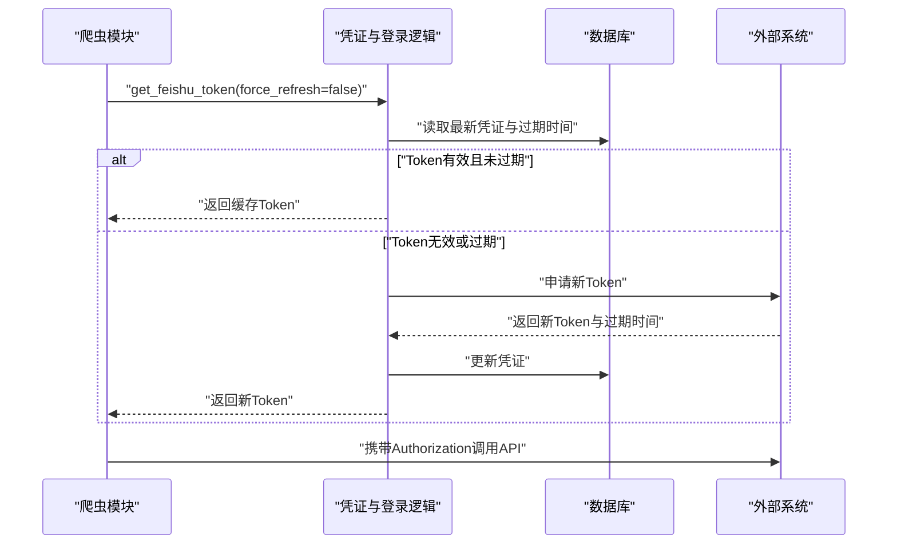
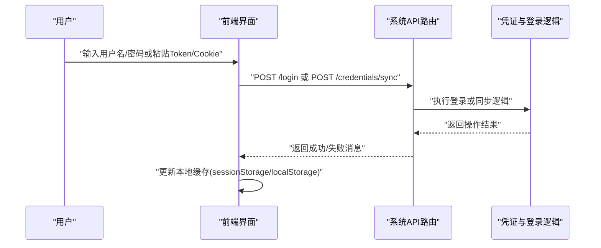
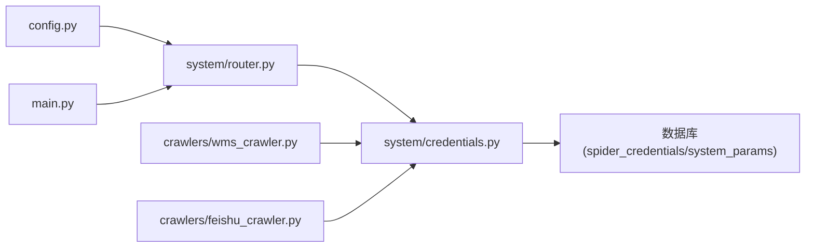

# 认证授权

<cite>
**本文引用的文件**
- [backend/system/router.py](file://backend/system/router.py)
- [backend/system/credentials.py](file://backend/system/credentials.py)
- [backend/config.py](file://backend/config.py)
- [backend/main.py](file://backend/main.py)
- [backend/crawlers/wms_crawler.py](file://backend/crawlers/wms_crawler.py)
- [backend/crawlers/feishu_crawler.py](file://backend/crawlers/feishu_crawler.py)
- [webui_ref/client/src/pages/SystemSettingsPage/CredentialsSection.tsx](file://webui_ref/client/src/pages/SystemSettingsPage/CredentialsSection.tsx)
- [index.html](file://index.html)
</cite>

## 目录
1. [简介](#简介)
2. [项目结构](#项目结构)
3. [核心组件](#核心组件)
4. [架构总览](#架构总览)
5. [详细组件分析](#详细组件分析)
6. [依赖关系分析](#依赖关系分析)
7. [性能与安全考量](#性能与安全考量)
8. [故障排查指南](#故障排查指南)
9. [结论](#结论)
10. [附录：客户端集成与最佳实践](#附录客户端集成与最佳实践)

## 简介
本文件系统化说明本项目的认证与授权机制，重点覆盖以下方面：
- 登录接口与令牌获取：支持 WMS（di360）自动登录获取 Token、飞书应用登录获取 tenant_access_token。
- 凭证管理：多数据源凭证的增删改查、激活状态管理、手动同步 Token/Cookie。
- 访问控制：当前系统未实现统一的 JWT 鉴权中间件；业务接口通过“外部系统 Token/Cookie”进行调用，由爬虫模块在请求头中携带相应凭证。
- 安全配置：密钥与凭据存储于数据库与 .env 环境变量；CORS 可配置；未启用统一会话管理。
- 角色权限：当前代码未实现基于角色的访问控制（RBAC），如需扩展可在路由层增加鉴权装饰器或中间件。

## 项目结构
与认证授权相关的后端主要位于 backend/system 与 backend/crawlers 两个子模块：
- backend/system/router.py：暴露系统设置相关 API（登录、凭证管理、参数管理）。
- backend/system/credentials.py：实现登录、凭证持久化、飞书 Token 获取与刷新等核心逻辑。
- backend/crawlers/*：使用已保存的凭证对外部系统进行数据采集，体现“以凭证驱动访问”的模式。
- backend/config.py：集中读取环境变量（如 FEISHU_APP_ID/SECRET、CORS_ORIGINS 等）。
- backend/main.py：应用启动时加载 CORS 中间件，并启动调度器。

**图表来源**
- [backend/system/router.py:52-109](file://backend/system/router.py#L52-L109)
- [backend/system/credentials.py:25-149](file://backend/system/credentials.py#L25-L149)
- [backend/crawlers/wms_crawler.py:80-85](file://backend/crawlers/wms_crawler.py#L80-L85)
- [backend/crawlers/feishu_crawler.py:263-296](file://backend/crawlers/feishu_crawler.py#L263-L296)
- [backend/config.py:48-85](file://backend/config.py#L48-L85)
- [backend/main.py:65-72](file://backend/main.py#L65-L72)

**章节来源**
- [backend/system/router.py:1-109](file://backend/system/router.py#L1-L109)
- [backend/system/credentials.py:1-573](file://backend/system/credentials.py#L1-L573)
- [backend/config.py:1-102](file://backend/config.py#L1-L102)
- [backend/main.py:36-72](file://backend/main.py#L36-L72)

## 核心组件
- 系统设置路由（system/router.py）
  - 提供登录、凭证管理、参数管理等 RESTful 接口。
  - 关键端点：POST /login、POST /login/feishu、GET/POST/DELETE /credentials、GET/POST /params。
- 凭证与登录逻辑（system/credentials.py）
  - spider_login：模拟登录 WMS（di360），提取 Token/Cookie 并持久化。
  - manual_sync_credentials：手动同步 Token/Cookie 或保存用户名密码。
  - list_credentials/get_credential/create_or_update/delete_credential：凭证 CRUD。
  - feishu_login/get_feishu_token：获取并刷新飞书 tenant_access_token。
- 爬虫模块（crawlers/*）
  - wms_crawler：初始化会话时使用数据库中保存的 Token/Cookie。
  - feishu_crawler：通过 get_feishu_token 获取有效 Token 并用于后续 API 调用。
- 配置与环境（config.py, main.py）
  - 从 .env 读取服务与第三方凭据（如 FEISHU_APP_ID/SECRET）。
  - 启动时注册 CORS 中间件，允许跨域访问。

**章节来源**
- [backend/system/router.py:15-109](file://backend/system/router.py#L15-L109)
- [backend/system/credentials.py:25-149](file://backend/system/credentials.py#L25-L149)
- [backend/system/credentials.py:174-287](file://backend/system/credentials.py#L174-L287)
- [backend/system/credentials.py:448-573](file://backend/system/credentials.py#L448-L573)
- [backend/crawlers/wms_crawler.py:80-85](file://backend/crawlers/wms_crawler.py#L80-L85)
- [backend/crawlers/feishu_crawler.py:263-296](file://backend/crawlers/feishu_crawler.py#L263-L296)
- [backend/config.py:48-85](file://backend/config.py#L48-L85)
- [backend/main.py:65-72](file://backend/main.py#L65-L72)

## 架构总览
整体流程围绕“凭证即访问能力”展开：前端通过系统设置页面触发登录或同步凭证，后端将凭证持久化到数据库；爬虫模块在需要访问外部系统时，从数据库取出最新凭证并在请求头中携带，完成鉴权。

**图表来源**
- [backend/system/router.py:54-63](file://backend/system/router.py#L54-L63)
- [backend/system/credentials.py:25-118](file://backend/system/credentials.py#L25-L118)

## 详细组件分析

### 登录与凭证管理（WMS/di360）
- 登录流程
  - 前端提交 username/password/source/env。
  - 后端调用 spider_login，向 WMS 登录接口发起请求。
  - 解析响应中的 token/authorization/access_token/tokenHead 字段，兼容多种命名。
  - 将同一 source 的旧凭证标记为失效，并插入新凭证（包含 authorization/cookie/username/password）。
  - 若连接失败（公司内网不可达），仅保存用户名密码供后续重试。
- 手动同步凭证
  - 支持直接粘贴浏览器中的 Authorization/Cookie，或保存用户名密码以便后续自动登录。
  - 写入 spider_credentials 表，并标记为新激活凭证。
- 凭证列表与查询
  - list_credentials 按 source 去重，返回最近一条记录，并计算是否有效（is_active + 实际凭证存在）。
  - get_credential 按 source 精确查询。

**图表来源**
- [backend/system/credentials.py:25-118](file://backend/system/credentials.py#L25-L118)
- [backend/system/credentials.py:121-149](file://backend/system/credentials.py#L121-L149)
- [backend/system/credentials.py:174-247](file://backend/system/credentials.py#L174-L247)

**章节来源**
- [backend/system/router.py:54-90](file://backend/system/router.py#L54-L90)
- [backend/system/credentials.py:25-149](file://backend/system/credentials.py#L25-L149)
- [backend/system/credentials.py:174-247](file://backend/system/credentials.py#L174-L247)

### 飞书应用登录与 Token 管理
- 登录流程
  - 前端提交 app_id/app_secret。
  - 后端调用 feishu_login，向飞书开放平台申请 tenant_access_token。
  - 将凭证与过期时间存入 spider_credentials（config_json 中保存 app_id/app_secret/expire_at）。
- Token 获取与刷新
  - get_feishu_token 优先从数据库读取有效 Token；若过期或未配置，则重新申请并更新数据库。
  - 支持强制刷新 force_refresh。
  - 若数据库未配置，回退到 .env 中的 FEISHU_APP_ID/FEISHU_APP_SECRET。

**图表来源**
- [backend/system/router.py:60-63](file://backend/system/router.py#L60-L63)
- [backend/system/credentials.py:476-506](file://backend/system/credentials.py#L476-L506)
- [backend/system/credentials.py:509-573](file://backend/system/credentials.py#L509-L573)

**章节来源**
- [backend/system/router.py:60-63](file://backend/system/router.py#L60-L63)
- [backend/system/credentials.py:448-573](file://backend/system/credentials.py#L448-L573)

### 爬虫模块如何使用凭证
- WMS 爬虫
  - 初始化会话时从数据库读取保存的 Token/Cookie，并在后续请求中携带。
- 飞书爬虫
  - 通过 get_feishu_token 获取有效 Token，并以 Authorization: Bearer {token} 方式调用飞书 API。

**图表来源**
- [backend/crawlers/feishu_crawler.py:263-296](file://backend/crawlers/feishu_crawler.py#L263-L296)
- [backend/system/credentials.py:509-573](file://backend/system/credentials.py#L509-L573)

**章节来源**
- [backend/crawlers/wms_crawler.py:80-85](file://backend/crawlers/wms_crawler.py#L80-L85)
- [backend/crawlers/feishu_crawler.py:263-296](file://backend/crawlers/feishu_crawler.py#L263-L296)
- [backend/system/credentials.py:509-573](file://backend/system/credentials.py#L509-L573)

### 前端集成与用户交互
- 前端凭证管理页面（CredentialsSection.tsx）
  - 提供登录表单与手动凭证输入框，支持显示/隐藏敏感字段。
  - 通过 sessionStorage 临时缓存凭证，便于页面内复用。
- 静态页面（index.html）
  - 提供登录缓存保存与凭证列表展示逻辑，调用 /system/credentials 接口。

**图表来源**
- [webui_ref/client/src/pages/SystemSettingsPage/CredentialsSection.tsx:45-82](file://webui_ref/client/src/pages/SystemSettingsPage/CredentialsSection.tsx#L45-L82)
- [webui_ref/client/src/pages/SystemSettingsPage/CredentialsSection.tsx:238-286](file://webui_ref/client/src/pages/SystemSettingsPage/CredentialsSection.tsx#L238-L286)
- [index.html:1473-1491](file://index.html#L1473-L1491)
- [backend/system/router.py:54-90](file://backend/system/router.py#L54-L90)

**章节来源**
- [webui_ref/client/src/pages/SystemSettingsPage/CredentialsSection.tsx:45-82](file://webui_ref/client/src/pages/SystemSettingsPage/CredentialsSection.tsx#L45-L82)
- [webui_ref/client/src/pages/SystemSettingsPage/CredentialsSection.tsx:238-286](file://webui_ref/client/src/pages/SystemSettingsPage/CredentialsSection.tsx#L238-L286)
- [index.html:1473-1491](file://index.html#L1473-L1491)
- [backend/system/router.py:54-90](file://backend/system/router.py#L54-L90)

## 依赖关系分析
- 路由层依赖 credentials 模块提供的登录与凭证管理能力。
- 爬虫模块依赖 credentials 提供的 Token 获取方法，确保对外部系统的访问具备有效凭证。
- 配置层提供环境变量读取，支撑飞书应用凭据与服务运行参数。
- 应用入口负责 CORS 配置与调度器生命周期管理。

**图表来源**
- [backend/system/router.py:1-109](file://backend/system/router.py#L1-L109)
- [backend/system/credentials.py:1-573](file://backend/system/credentials.py#L1-L573)
- [backend/crawlers/wms_crawler.py:80-85](file://backend/crawlers/wms_crawler.py#L80-L85)
- [backend/crawlers/feishu_crawler.py:263-296](file://backend/crawlers/feishu_crawler.py#L263-L296)
- [backend/config.py:48-85](file://backend/config.py#L48-L85)
- [backend/main.py:65-72](file://backend/main.py#L65-L72)

**章节来源**
- [backend/system/router.py:1-109](file://backend/system/router.py#L1-L109)
- [backend/system/credentials.py:1-573](file://backend/system/credentials.py#L1-L573)
- [backend/crawlers/wms_crawler.py:80-85](file://backend/crawlers/wms_crawler.py#L80-L85)
- [backend/crawlers/feishu_crawler.py:263-296](file://backend/crawlers/feishu_crawler.py#L263-L296)
- [backend/config.py:48-85](file://backend/config.py#L48-L85)
- [backend/main.py:65-72](file://backend/main.py#L65-L72)

## 性能与安全考量
- 性能
  - 飞书 Token 采用缓存策略，避免频繁申请；仅在过期或强制刷新时重新获取。
  - 凭证列表查询按 source 去重，减少冗余数据返回。
- 安全
  - 凭证存储于数据库，敏感字段（如 password、app_secret）建议加密存储（当前为明文，需在生产环境加固）。
  - 环境变量集中管理（.env），避免硬编码。
  - CORS 可配置，生产环境应限制允许的源。
  - 当前未实现统一 JWT 鉴权中间件；如需保护内部接口，建议引入基于 JWT 的认证中间件与 RBAC 权限模型。
  - 日志记录登录失败与异常，便于审计与排障。

[本节为通用指导，不直接分析具体文件]

## 故障排查指南
- 登录失败
  - 检查 WMS 登录接口可达性与响应格式；确认返回字段中包含 token/authorization/access_token/tokenHead。
  - 查看日志输出，定位网络错误或响应解析异常。
- 无法连接登录服务器
  - 若在公司外网环境，spider_login 会捕获连接错误并仅保存用户名密码；需在连接内网后重试。
- 飞书 Token 获取失败
  - 检查 app_id/app_secret 是否正确；确认应用具备共享表读取权限。
  - 若数据库未配置，检查 .env 中的 FEISHU_APP_ID/FEISHU_APP_SECRET。
- 凭证无效或过期
  - 使用 get_feishu_token(force_refresh=true) 强制刷新；或重新执行登录流程。
  - 检查 spider_credentials 表中 is_active 与实际凭证字段是否匹配。

**章节来源**
- [backend/system/credentials.py:25-118](file://backend/system/credentials.py#L25-L118)
- [backend/system/credentials.py:476-573](file://backend/system/credentials.py#L476-L573)

## 结论
本项目采用“凭证即访问能力”的设计，通过系统设置页面统一管理多数据源的登录与凭证，并由爬虫模块在访问外部系统时携带相应凭证。当前未实现统一的 JWT 鉴权中间件与 RBAC 权限模型；如需增强内部接口安全，建议引入标准 JWT 认证与基于角色的访问控制。同时，建议对敏感凭据进行加密存储，并严格限制 CORS 与网络访问范围。

[本节为总结性内容，不直接分析具体文件]

## 附录：客户端集成与最佳实践
- 前端集成示例
  - 使用 CredentialsSection.tsx 提供的表单进行登录或手动同步凭证。
  - 通过 sessionStorage 临时缓存凭证，提升用户体验。
  - 调用 /system/credentials 接口获取凭证列表，展示 Token 片段与状态。
- 最佳实践
  - 登录成功后，前端应妥善管理凭证生命周期，避免长时间驻留敏感信息。
  - 生产环境禁用调试模式，限制 CORS 源，启用 HTTPS。
  - 定期轮换凭证（尤其是外部系统 Token/Cookie），并记录变更审计日志。
  - 对内部接口增加统一鉴权中间件，结合 JWT 与 RBAC，实现细粒度权限控制。

[本节为通用指导，不直接分析具体文件]