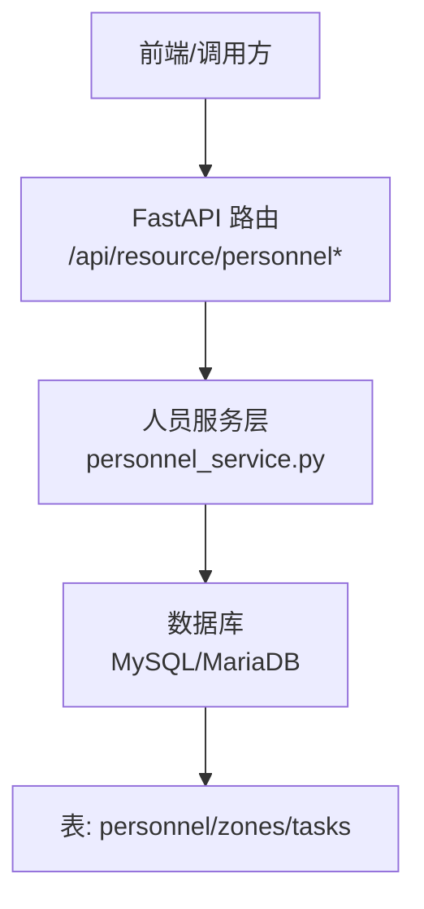
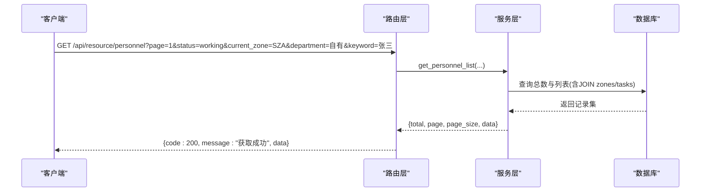
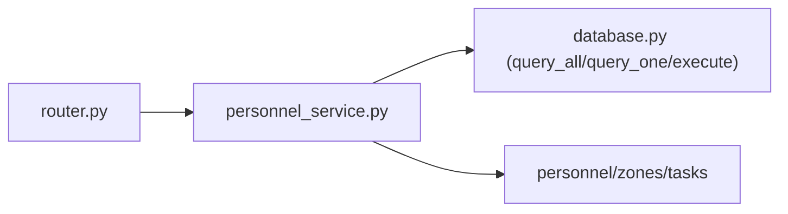

# 人员管理API

<cite>
**本文档引用的文件**
- [backend/modules/resource/router.py](file://backend/modules/resource/router.py)
- [backend/modules/resource/services/personnel_service.py](file://backend/modules/resource/services/personnel_service.py)
- [backend/modules/resource/schemas.py](file://backend/modules/resource/schemas.py)
- [backend/sql/resource_schema.sql](file://backend/sql/resource_schema.sql)
</cite>

## 目录
1. [简介](#简介)
2. [项目结构](#项目结构)
3. [核心组件](#核心组件)
4. [架构总览](#架构总览)
5. [详细接口说明](#详细接口说明)
6. [依赖关系分析](#依赖关系分析)
7. [性能与可用性](#性能与可用性)
8. [故障排查指南](#故障排查指南)
9. [结论](#结论)
10. [附录：业务规则与枚举](#附录：业务规则与枚举)

## 简介
本模块提供“人员管理”的完整API能力，覆盖人员信息管理、状态跟踪、位置定位、统计分析等场景。支持人员列表查询（按状态、区域、部门筛选）、人员详情获取、人员信息更新、状态快速切换、看板KPI统计、来源分布分析、园区地图覆盖层数据等。适用于试制资源数智化管理系统中的人员调度与可视化展示。

## 项目结构
- 路由层：FastAPI Router 定义REST端点，统一返回格式 {code, message, data}
- 服务层：personnel_service.py 实现人员CRUD、统计、来源分布、地图数据等业务逻辑
- 数据模型：schemas.py 定义Pydantic模型（用于请求/响应校验）
- 数据库：resource_schema.sql 定义 personnel、zones、tasks 等表结构及索引

图表来源
- [backend/modules/resource/router.py:333-557](file://backend/modules/resource/router.py#L333-L557)
- [backend/modules/resource/services/personnel_service.py:24-475](file://backend/modules/resource/services/personnel_service.py#L24-L475)
- [backend/sql/resource_schema.sql:47-109](file://backend/sql/resource_schema.sql#L47-L109)

章节来源
- [backend/modules/resource/router.py:333-557](file://backend/modules/resource/router.py#L333-L557)
- [backend/modules/resource/services/personnel_service.py:24-475](file://backend/modules/resource/services/personnel_service.py#L24-L475)
- [backend/sql/resource_schema.sql:47-109](file://backend/sql/resource_schema.sql#L47-L109)

## 核心组件
- 路由层：定义 /api/resource/personnel 系列接口，参数校验、异常处理、统一响应封装
- 服务层：实现人员分页查询、详情、新增、更新、删除、状态切换、看板统计、来源分布、地图数据
- 数据访问：通过数据库工具函数执行SQL，关联 zones、tasks 表进行数据组装
- 业务规则：装配区判定、有效来源集合、状态枚举校验、工时计算策略

章节来源
- [backend/modules/resource/router.py:333-557](file://backend/modules/resource/router.py#L333-L557)
- [backend/modules/resource/services/personnel_service.py:12-17](file://backend/modules/resource/services/personnel_service.py#L12-L17)
- [backend/modules/resource/services/personnel_service.py:286-323](file://backend/modules/resource/services/personnel_service.py#L286-L323)

## 架构总览
人员管理API采用分层架构：
- 路由层接收HTTP请求，解析Query/Path参数，调用服务层
- 服务层负责业务逻辑与数据聚合，构造结果并返回
- 数据层通过SQL查询 personnel、zones、tasks 表，完成过滤、统计、排序

图表来源
- [backend/modules/resource/router.py:356-385](file://backend/modules/resource/router.py#L356-L385)
- [backend/modules/resource/services/personnel_service.py:24-124](file://backend/modules/resource/services/personnel_service.py#L24-L124)

## 详细接口说明

### 通用约定
- 基础路径：/api/resource
- 统一响应体：{ code: number, message: string, data: any }
- 错误码：400 参数或业务校验失败；404 资源不存在；500 服务端异常

### 人员列表查询
- 方法：GET
- 路径：/api/resource/personnel
- 功能：分页查询人员列表，支持按状态、区域、部门筛选，关键词搜索姓名/工号
- 查询参数：
  - page: 页码，默认1，最小1
  - page_size: 每页数量，默认20，范围1-100
  - status: 人员状态筛选，可选 working/idle/offline
  - current_zone: 所在区域筛选，如 SZA/SZB/SZC/LH
  - department: 人员来源筛选，可选 自有/商用车/乘用车/柳汽/中智/外协/内调
  - keyword: 搜索关键词（姓名/工号），模糊匹配
- 返回字段（data.data[]）：
  - id, personnel_code, name, avatar_text, department, status, current_zone, current_task_id
  - entry_time, last_update_time, created_at
  - zone_name, current_task_name
  - today_work_hours: 当日工时（working为8小时，其他为0）
  - is_assembly_zone: 是否装配区（true/false）
- 业务规则：
  - 装配区：SZA/SZB/SZC/LH，显示来源列
  - 今日工时：working=8h，idle/offline=0h（简化计算）
- 示例请求：
  - GET /api/resource/personnel?page=1&page_size=20&status=working&current_zone=SZA&department=自有&keyword=张
- 示例响应：
  - { code: 200, message: "获取成功", data: { total: 120, page: 1, page_size: 20, data: [...] } }

章节来源
- [backend/modules/resource/router.py:356-385](file://backend/modules/resource/router.py#L356-L385)
- [backend/modules/resource/services/personnel_service.py:24-124](file://backend/modules/resource/services/personnel_service.py#L24-L124)

### 人员详情获取
- 方法：GET
- 路径：/api/resource/personnel/{personnel_code}
- 功能：根据工号获取人员详情，包含当前任务、区域名称、今日工时等
- 路径参数：
  - personnel_code: 工号（必填）
- 返回字段：同列表项，额外包含 project_code, vehicle_code, task_progress, completed_tasks, in_progress_tasks
- 示例请求：
  - GET /api/resource/personnel/P001
- 示例响应：
  - { code: 200, message: "获取成功", data: { ... } }

章节来源
- [backend/modules/resource/router.py:388-408](file://backend/modules/resource/router.py#L388-L408)
- [backend/modules/resource/services/personnel_service.py:127-167](file://backend/modules/resource/services/personnel_service.py#L127-L167)

### 新增人员
- 方法：POST
- 路径：/api/resource/personnel
- 功能：新增人员，校验工号唯一性与来源合法性
- 请求体：
  - personnel_code: 工号（必填，唯一）
  - name: 姓名（必填）
  - avatar_text: 头像文字（可选，默认取姓名首字）
  - department: 人员来源（可选，需属于有效集合）
  - status: 初始状态（可选，默认offline）
  - current_zone: 初始区域（可选）
- 返回：新创建的人员详情
- 示例请求：
  - POST /api/resource/personnel
  - Body: { personnel_code: "P002", name: "李四", department: "自有", status: "offline" }
- 示例响应：
  - { code: 200, message: "创建人员成功", data: { ... } }

章节来源
- [backend/modules/resource/router.py:411-428](file://backend/modules/resource/router.py#L411-L428)
- [backend/modules/resource/services/personnel_service.py:170-212](file://backend/modules/resource/services/personnel_service.py#L170-L212)

### 更新人员信息
- 方法：PUT
- 路径：/api/resource/personnel/{personnel_code}
- 功能：更新人员部分字段（name/avatar_text/department/status/current_zone/current_task_id）
- 路径参数：
  - personnel_code: 工号（必填）
- 请求体：仅传入需要更新的字段（None将被忽略）
- 校验：
  - department 必须属于有效来源集合
  - status 必须为 working/idle/offline
- 返回：更新后的人员详情
- 示例请求：
  - PUT /api/resource/personnel/P001
  - Body: { status: "working", current_zone: "SZA" }
- 示例响应：
  - { code: 200, message: "更新成功", data: { ... } }

章节来源
- [backend/modules/resource/router.py:431-455](file://backend/modules/resource/router.py#L431-L455)
- [backend/modules/resource/services/personnel_service.py:215-260](file://backend/modules/resource/services/personnel_service.py#L215-L260)

### 删除人员
- 方法：DELETE
- 路径：/api/resource/personnel/{personnel_code}
- 功能：根据工号删除人员
- 路径参数：
  - personnel_code: 工号（必填）
- 返回：{ code: 200, message: "删除成功", data: null }
- 示例请求：
  - DELETE /api/resource/personnel/P001

章节来源
- [backend/modules/resource/router.py:458-476](file://backend/modules/resource/router.py#L458-L476)
- [backend/modules/resource/services/personnel_service.py:263-283](file://backend/modules/resource/services/personnel_service.py#L263-L283)

### 状态快速切换
- 方法：PUT
- 路径：/api/resource/personnel/{personnel_code}/status
- 功能：快速更新人员状态，可同步更新所在区域
- 路径参数：
  - personnel_code: 工号（必填）
- 请求体：
  - status: 目标状态（working/idle/offline）
  - current_zone: 可选，更新状态时同时设置区域
- 返回：更新后的人员详情
- 示例请求：
  - PUT /api/resource/personnel/P001/status
  - Body: { status: "working", current_zone: "SZB" }
- 示例响应：
  - { code: 200, message: "状态更新成功", data: { ... } }

章节来源
- [backend/modules/resource/router.py:479-502](file://backend/modules/resource/router.py#L479-L502)
- [backend/modules/resource/services/personnel_service.py:286-323](file://backend/modules/resource/services/personnel_service.py#L286-L323)

### 人员看板KPI统计
- 方法：GET
- 路径：/api/resource/personnel/stats
- 功能：返回看板关键指标
- 返回字段：
  - total: 总人数
  - on_duty: 在岗人数（working + idle）
  - working: 工作中人数
  - idle: 空闲人数
  - offline: 离线人数
  - idle_available: 空闲可调配人数（等于idle）
  - today_abnormal: 今日异常（简化为offline人数）
  - status_distribution: 按状态分组统计 [{status, count}]
  - zone_distribution: 按区域分组统计 [{zone_code, zone_name, count}]
- 示例响应：
  - { code: 200, message: "获取成功", data: { total: 120, on_duty: 90, working: 60, idle: 30, offline: 30, ... } }

章节来源
- [backend/modules/resource/router.py:505-519](file://backend/modules/resource/router.py#L505-L519)
- [backend/modules/resource/services/personnel_service.py:325-379](file://backend/modules/resource/services/personnel_service.py#L325-L379)

### 来源分布分析
- 方法：GET
- 路径：/api/resource/personnel/source-distribution
- 功能：返回装配区与非装配区的来源分布数据，供饼图与柱状图使用
- 返回字段：
  - assembly_source_pie: 装配区来源分布 [{source, count, working_count}]
  - assembly_source_bar: 装配区来源+平均工时 [{source, personnel_count, avg_hours}]
  - non_assembly_distribution: 非装配区分布 [{zone, count}]
- 业务规则：
  - 装配区：SZA/SZB/SZC/LH
  - 来源类型：自有/商用车/乘用车/柳汽/中智/外协/内调
- 示例响应：
  - { code: 200, message: "获取成功", data: { assembly_source_pie: [...], assembly_source_bar: [...], non_assembly_distribution: [...] } }

章节来源
- [backend/modules/resource/router.py:522-539](file://backend/modules/resource/router.py#L522-L539)
- [backend/modules/resource/services/personnel_service.py:382-431](file://backend/modules/resource/services/personnel_service.py#L382-L431)

### 园区地图覆盖层数据
- 方法：GET
- 路径：/api/resource/personnel/map
- 功能：返回各区域人员数量及明细，用于地图覆盖层展示
- 返回字段：
  - zone_summary: 区域汇总 [{zone_code, zone_name, total_count, working_count, idle_count}]
  - personnel_positions: 人员明细列表 [{personnel_code, name, avatar_text, department, status, current_zone}]
- 示例响应：
  - { code: 200, message: "获取成功", data: { zone_summary: [...], personnel_positions: [...] } }

章节来源
- [backend/modules/resource/router.py:542-556](file://backend/modules/resource/router.py#L542-L556)
- [backend/modules/resource/services/personnel_service.py:434-474](file://backend/modules/resource/services/personnel_service.py#L434-L474)

## 依赖关系分析
- 路由层依赖服务层：每个人员相关端点均调用 personnel_service 对应函数
- 服务层依赖数据库：通过 query_all/query_one/execute 执行SQL，关联 zones 与 tasks 表
- 数据模型：schemas.py 定义了人员相关的 Pydantic 模型，但路由层未强制使用，主要依赖服务层返回字典
- 业务常量：装配区集合 ASSEMBLY_ZONES、有效来源 VALID_SOURCES 在服务层定义

图表来源
- [backend/modules/resource/router.py:333-557](file://backend/modules/resource/router.py#L333-L557)
- [backend/modules/resource/services/personnel_service.py:8-9](file://backend/modules/resource/services/personnel_service.py#L8-L9)
- [backend/sql/resource_schema.sql:47-109](file://backend/sql/resource_schema.sql#L47-L109)

章节来源
- [backend/modules/resource/router.py:333-557](file://backend/modules/resource/router.py#L333-L557)
- [backend/modules/resource/services/personnel_service.py:8-9](file://backend/modules/resource/services/personnel_service.py#L8-L9)
- [backend/sql/resource_schema.sql:47-109](file://backend/sql/resource_schema.sql#L47-L109)

## 性能与可用性
- 分页查询：支持 page/page_size，避免一次性加载大量数据
- 索引优化：personnel 表对 status、current_zone、department 建立索引，提升筛选性能
- 关联查询：LEFT JOIN zones 与 tasks，减少多次往返
- 简化计算：today_work_hours 基于状态简单估算，降低复杂计算开销
- 建议：
  - 对高频筛选条件增加复合索引（如 status + current_zone）
  - 对大数据量场景考虑缓存热点统计（如 stats、source-distribution）
  - 对地图数据可考虑增量更新或定时刷新

[本节为通用指导，不直接分析具体文件]

## 故障排查指南
- 400 参数或业务校验失败：
  - 检查 status 是否为 working/idle/offline
  - 检查 department 是否在有效来源集合
  - 检查 personnel_code 是否存在（更新/删除时）
- 404 资源不存在：
  - 确认 personnel_code 是否正确
- 500 服务端异常：
  - 检查数据库连接与SQL执行
  - 查看日志输出（logger.info/error）
- 常见问题：
  - 新增人员时报“工号已存在”：确保 personnel_code 唯一
  - 更新状态时报“无效的状态值”：确认 status 合法
  - 列表为空：检查筛选条件是否过严或数据未初始化

章节来源
- [backend/modules/resource/services/personnel_service.py:180-188](file://backend/modules/resource/services/personnel_service.py#L180-L188)
- [backend/modules/resource/services/personnel_service.py:226-239](file://backend/modules/resource/services/personnel_service.py#L226-L239)
- [backend/modules/resource/services/personnel_service.py:298-304](file://backend/modules/resource/services/personnel_service.py#L298-L304)

## 结论
人员管理API提供了完整的CRUD、状态切换、统计分析与地图数据能力，满足试制资源管理中的人员调度与可视化需求。通过清晰的分层架构与严格的业务规则校验，保证了接口的稳定性与可维护性。后续可结合缓存与索引优化进一步提升性能。

[本节为总结，不直接分析具体文件]

## 附录：业务规则与枚举
- 人员状态：
  - working: 工作中
  - idle: 空闲
  - offline: 离线
- 人员来源（部门）：
  - 自有、商用车、乘用车、柳汽、中智、外协、内调
- 装配区：
  - SZA、SZB、SZC、LH
- 区域类型：
  - assembly/island/prototype/external
- 任务类型：
  - A/B/C/sporadic
- 任务状态：
  - pending/in_progress/completed/overdue
- 优先级：
  - high/medium/low

章节来源
- [backend/modules/resource/services/personnel_service.py:12-17](file://backend/modules/resource/services/personnel_service.py#L12-L17)
- [backend/sql/resource_schema.sql:47-109](file://backend/sql/resource_schema.sql#L47-L109)