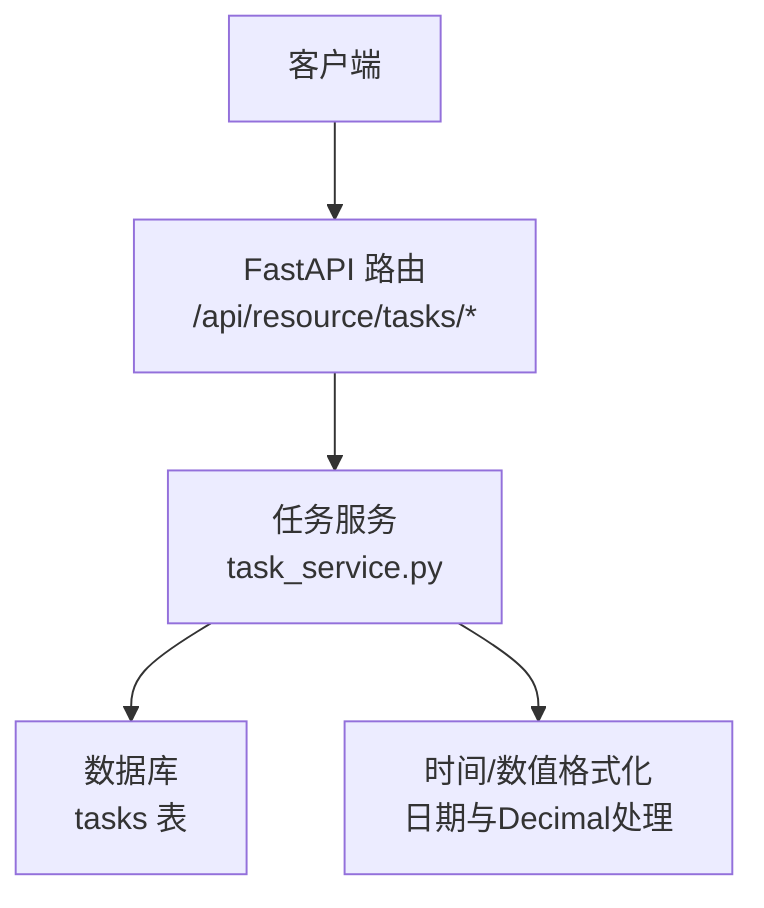
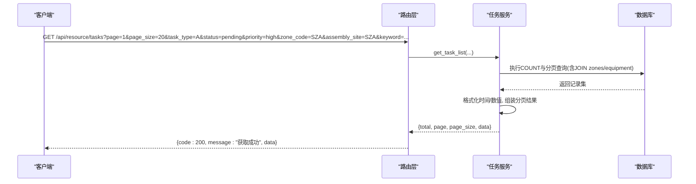
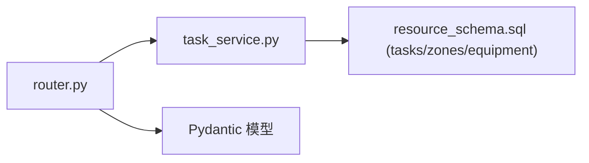
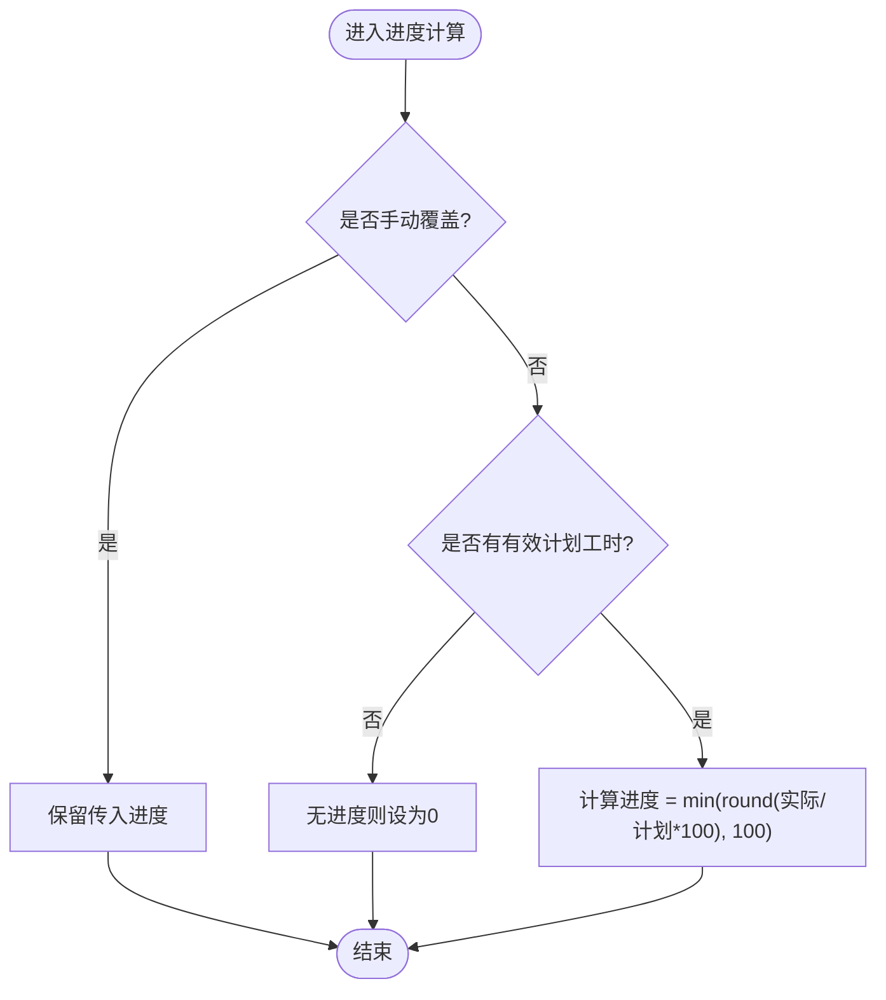

# 任务管理API

<cite>
**本文引用的文件**
- [backend/modules/resource/router.py](file://backend/modules/resource/router.py)
- [backend/modules/resource/services/task_service.py](file://backend/modules/resource/services/task_service.py)
- [backend/sql/resource_schema.sql](file://backend/sql/resource_schema.sql)
</cite>

## 目录
1. [简介](#简介)
2. [项目结构](#项目结构)
3. [核心组件](#核心组件)
4. [架构总览](#架构总览)
5. [详细接口说明](#详细接口说明)
6. [依赖关系分析](#依赖关系分析)
7. [性能与扩展性](#性能与扩展性)
8. [故障排查指南](#故障排查指南)
9. [结论](#结论)
10. [附录：业务枚举与状态流转](#附录：业务枚举与状态流转)

## 简介
本模块提供“任务管理”的完整API，覆盖任务全生命周期（创建、查询、更新、删除）、状态变更、进度计算、统计看板等能力。支持按任务类型、试制类别、状态、优先级、区域/装配场地筛选与关键词搜索；提供任务列表分页、详情获取、批量统计（KPI、状态分布、类型与进度对比、月度趋势）等接口。

## 项目结构
- 路由层：FastAPI 路由定义在资源模块下，统一前缀 /api/resource
- 服务层：任务相关的业务逻辑集中在 task_service.py
- 数据层：数据库表结构定义在 resource_schema.sql，任务主表为 tasks

图表来源
- [backend/modules/resource/router.py:646-831](file://backend/modules/resource/router.py#L646-L831)
- [backend/modules/resource/services/task_service.py:48-432](file://backend/modules/resource/services/task_service.py#L48-L432)
- [backend/sql/resource_schema.sql:69-109](file://backend/sql/resource_schema.sql#L69-L109)

章节来源
- [backend/modules/resource/router.py:646-831](file://backend/modules/resource/router.py#L646-L831)
- [backend/modules/resource/services/task_service.py:48-432](file://backend/modules/resource/services/task_service.py#L48-L432)
- [backend/sql/resource_schema.sql:69-109](file://backend/sql/resource_schema.sql#L69-L109)

## 核心组件
- 路由层：提供 RESTful 端点，负责参数校验、异常封装与响应包装
- 服务层：实现任务CRUD、筛选查询、进度自动计算、统计聚合
- 数据模型：Pydantic 请求/响应模型用于输入校验与输出结构约束
- 数据库：tasks 表承载任务主数据，包含类型、状态、优先级、工时、进度等字段

章节来源
- [backend/modules/resource/router.py:583-831](file://backend/modules/resource/router.py#L583-L831)
- [backend/modules/resource/services/task_service.py:13-432](file://backend/modules/resource/services/task_service.py#L13-L432)
- [backend/sql/resource_schema.sql:69-109](file://backend/sql/resource_schema.sql#L69-L109)

## 架构总览

图表来源
- [backend/modules/resource/router.py:646-678](file://backend/modules/resource/router.py#L646-L678)
- [backend/modules/resource/services/task_service.py:48-146](file://backend/modules/resource/services/task_service.py#L48-L146)
- [backend/sql/resource_schema.sql:69-109](file://backend/sql/resource_schema.sql#L69-L109)

## 详细接口说明

### 通用约定
- 基础路径：/api/resource
- 统一响应格式：{ code, message, data }
- 错误码：HTTP 400 表示参数或业务校验失败；404 表示资源不存在；500 表示服务端异常

### 任务列表查询
- 方法：GET
- 路径：/api/resource/tasks
- 查询参数
  - page: 页码，默认1
  - page_size: 每页数量，默认20，最大100
  - task_type: 任务类型，A/B/C/sporadic
  - trial_type: 试制类别，支持 MT 前缀模糊匹配（如 MT%），其他精确匹配
  - status: 任务状态，pending/in_progress/completed/overdue
  - priority: 优先级，high/medium/low
  - zone_code: 区域/装配场地筛选（同时匹配 zone_code 与 assembly_site）
  - assembly_site: 装配场地，SZA/SZB/SZC/JP1/JP2/LH/CX1/CX2/CX/HM
  - keyword: 关键词，支持任务编号/名称/项目编号/车号/项目群/负责人模糊匹配
- 响应 data 字段
  - total: 总数
  - page: 当前页
  - page_size: 每页大小
  - data: 任务列表数组，每条记录包含任务基本信息、计划/实际工时、进度、负责人、时间、关联区域/设备名等
- 示例
  - GET /api/resource/tasks?task_type=A&status=in_progress&priority=high&page=1&page_size=20

章节来源
- [backend/modules/resource/router.py:646-678](file://backend/modules/resource/router.py#L646-L678)
- [backend/modules/resource/services/task_service.py:48-146](file://backend/modules/resource/services/task_service.py#L48-L146)

### 任务详情获取
- 方法：GET
- 路径：/api/resource/tasks/{task_id}
- 路径参数
  - task_id: 任务ID
- 响应 data: 单个任务对象，包含所有任务字段及关联区域/设备名称
- 示例
  - GET /api/resource/tasks/123

章节来源
- [backend/modules/resource/router.py:681-699](file://backend/modules/resource/router.py#L681-L699)
- [backend/modules/resource/services/task_service.py:149-174](file://backend/modules/resource/services/task_service.py#L149-L174)

### 新增任务
- 方法：POST
- 路径：/api/resource/tasks
- 请求体字段（部分关键字段）
  - task_code: 任务编号（唯一）
  - task_name: 任务名称
  - task_type: A/B/C/sporadic
  - trial_type: 试制类别
  - project_group/project_code/vehicle_code/vehicle_model: 项目与车辆信息
  - priority: high/medium/low，默认 medium
  - status: pending/in_progress/completed/overdue，默认 pending
  - zone_code/assembly_site: 区域/装配场地
  - lift_count/equipment_code: 举升机数量/占用设备
  - planner/pm_name/cve_name/trial_supervisor/process_supervisor/assembly_supervisor: 相关责任人
  - plan_start_time/plan_end_time: 计划起止时间
  - plan_work_hours/actual_work_hours: 计划/实际工时
  - progress: 进度百分比，默认0；可受自动计算或手动覆盖影响
  - progress_manual_override: 是否手动覆盖进度，默认0
  - summer_target_count/summer_target_date: 夏标目标
  - source: 数据来源，operation/manual/mes，默认 manual
- 业务规则
  - 任务编号必须唯一
  - 任务类型、优先级、状态需符合枚举
  - 进度计算：若未开启手动覆盖且存在有效计划工时与实际工时，则自动计算进度 = min(round(实际/计划×100), 100)
- 响应 data: 创建后的任务对象
- 示例
  - POST /api/resource/tasks
  - 请求体包含上述字段

章节来源
- [backend/modules/resource/router.py:702-722](file://backend/modules/resource/router.py#L702-L722)
- [backend/modules/resource/services/task_service.py:177-237](file://backend/modules/resource/services/task_service.py#L177-L237)
- [backend/modules/resource/services/task_service.py:21-45](file://backend/modules/resource/services/task_service.py#L21-L45)

### 更新任务
- 方法：PUT
- 路径：/api/resource/tasks/{task_id}
- 路径参数
  - task_id: 任务ID
- 请求体：可更新的字段集合（同创建时字段的部分子集）
- 业务规则
  - 仅更新传入字段
  - 同样遵循枚举校验与进度自动计算规则
- 响应 data: 更新后的任务对象
- 示例
  - PUT /api/resource/tasks/123
  - 请求体例如 { "status": "in_progress", "progress": 30.5 }

章节来源
- [backend/modules/resource/router.py:725-752](file://backend/modules/resource/router.py#L725-L752)
- [backend/modules/resource/services/task_service.py:240-277](file://backend/modules/resource/services/task_service.py#L240-L277)

### 删除任务
- 方法：DELETE
- 路径：/api/resource/tasks/{task_id}
- 路径参数
  - task_id: 任务ID
- 响应 data: null
- 示例
  - DELETE /api/resource/tasks/123

章节来源
- [backend/modules/resource/router.py:755-771](file://backend/modules/resource/router.py#L755-L771)
- [backend/modules/resource/services/task_service.py:280-287](file://backend/modules/resource/services/task_service.py#L280-L287)

### 任务看板KPI统计
- 方法：GET
- 路径：/api/resource/tasks/stats
- 响应 data 主要字段
  - total: 任务总数
  - pending/in_progress/completed/overdue: 各状态数量
  - high_priority/medium_priority/low_priority: 各优先级数量
  - type_a/type_b/type_c/type_sporadic: 各类型数量
  - total_plan_hours/total_actual_hours/avg_progress: 计划/实际工时合计与平均进度
  - status_distribution/priority_distribution/type_distribution: 原始分布明细
- 示例
  - GET /api/resource/tasks/stats

章节来源
- [backend/modules/resource/router.py:774-786](file://backend/modules/resource/router.py#L774-L786)
- [backend/modules/resource/services/task_service.py:290-332](file://backend/modules/resource/services/task_service.py#L290-L332)

### 任务状态分布（饼图）
- 方法：GET
- 路径：/api/resource/tasks/status-distribution
- 响应 data.data: 数组，每项包含 name/value/color
- 示例
  - GET /api/resource/tasks/status-distribution

章节来源
- [backend/modules/resource/router.py:789-800](file://backend/modules/resource/router.py#L789-L800)
- [backend/modules/resource/services/task_service.py:335-353](file://backend/modules/resource/services/task_service.py#L335-L353)

### 任务类型与进度对比（柱状图）
- 方法：GET
- 路径：/api/resource/tasks/type-progress
- 响应 data.data: 数组，每项包含 type/type_code/count/avg_progress/total_plan_hours/total_actual_hours/color
- 示例
  - GET /api/resource/tasks/type-progress

章节来源
- [backend/modules/resource/router.py:804-816](file://backend/modules/resource/router.py#L804-L816)
- [backend/modules/resource/services/task_service.py:356-395](file://backend/modules/resource/services/task_service.py#L356-L395)

### 月度任务趋势
- 方法：GET
- 路径：/api/resource/tasks/monthly-trend
- 查询参数
  - year: 年份，默认当前年
- 响应 data
  - year: 年份
  - data: 12个月数组，每项包含 month/count/done_count
- 示例
  - GET /api/resource/tasks/monthly-trend?year=2026

章节来源
- [backend/modules/resource/router.py:819-831](file://backend/modules/resource/router.py#L819-L831)
- [backend/modules/resource/services/task_service.py:412-431](file://backend/modules/resource/services/task_service.py#L412-L431)

## 依赖关系分析
- 路由层依赖服务层：每个任务端点调用 task_service 对应函数
- 服务层依赖数据库：通过 query_all/query_one/execute 执行SQL
- 数据模型：Pydantic 模型用于请求体校验与响应结构约束
- 外部关联：任务列表查询 JOIN zones/equipment 以补充区域名称与设备名称

图表来源
- [backend/modules/resource/router.py:646-831](file://backend/modules/resource/router.py#L646-L831)
- [backend/modules/resource/services/task_service.py:48-432](file://backend/modules/resource/services/task_service.py#L48-L432)
- [backend/sql/resource_schema.sql:69-109](file://backend/sql/resource_schema.sql#L69-L109)

章节来源
- [backend/modules/resource/router.py:646-831](file://backend/modules/resource/router.py#L646-L831)
- [backend/modules/resource/services/task_service.py:48-432](file://backend/modules/resource/services/task_service.py#L48-L432)
- [backend/sql/resource_schema.sql:69-109](file://backend/sql/resource_schema.sql#L69-L109)

## 性能与扩展性
- 查询优化
  - 列表查询使用 COUNT + LIMIT/OFFSET 分页
  - 条件动态拼接，避免无效过滤
  - 对常用字段建立索引（任务类型、状态、优先级、项目编码、设备编码）
- 进度计算
  - 自动模式基于计划/实际工时计算，减少前端计算开销
  - 支持手动覆盖，便于特殊场景调整
- 可扩展点
  - 可在服务层增加缓存（如Redis）以提升高频统计接口性能
  - 可增加异步任务处理大批量统计或报表导出

[本节为通用指导，不直接分析具体文件]

## 故障排查指南
- 常见错误
  - 400：参数或业务校验失败（如任务编号重复、枚举值非法）
  - 404：任务不存在
  - 500：服务端异常（请查看日志）
- 定位建议
  - 检查请求参数是否符合枚举与必填要求
  - 确认任务ID是否存在
  - 查看后端日志中的 ValueError/HTTPException 堆栈
  - 核对数据库连接与SQL执行是否正常

章节来源
- [backend/modules/resource/router.py:702-771](file://backend/modules/resource/router.py#L702-L771)
- [backend/modules/resource/services/task_service.py:177-287](file://backend/modules/resource/services/task_service.py#L177-L287)

## 结论
本API提供了完整的任务管理能力，涵盖CRUD、筛选、进度计算与多维统计。通过清晰的枚举约束与自动进度计算，既保证了数据一致性，又提升了使用便捷性。建议在生产环境结合监控与日志完善问题定位，并根据业务增长考虑缓存与异步优化。

[本节为总结，不直接分析具体文件]

## 附录：业务枚举与状态流转

### 业务枚举
- 任务类型：A、B、C、sporadic
- 试制类别：骡子车、ET0、ET、软模车、FT0、MT1、MT2、MT3、MT4、MT5（支持 MT 前缀模糊匹配）
- 装配场地：SZA、SZB、SZC、JP1、JP2、LH、CX1、CX2、CX、HM
- 优先级：high、medium、low
- 任务状态：pending、in_progress、completed、overdue
- 数据来源：operation、manual、mes

章节来源
- [backend/modules/resource/services/task_service.py:13-18](file://backend/modules/resource/services/task_service.py#L13-L18)
- [backend/sql/resource_schema.sql:71-109](file://backend/sql/resource_schema.sql#L71-L109)

### 状态流转规则
- 初始状态：pending（待开始）
- 进行中：in_progress（任务开始执行）
- 已完成：completed（任务完成）
- 逾期：overdue（超过计划结束时间仍未完成）
- 说明：当前服务层未强制限制状态转换顺序，建议在业务层或前端进行状态机控制，确保流程合规

章节来源
- [backend/modules/resource/services/task_service.py:14](file://backend/modules/resource/services/task_service.py#L14)
- [backend/sql/resource_schema.sql:82](file://backend/sql/resource_schema.sql#L82)

### 进度计算逻辑
- 自动模式：当 progress_manual_override=0 且存在有效计划工时与实际工时时，进度 = min(round(实际工时/计划工时×100), 100)
- 手动模式：当 progress_manual_override=1 时，保留传入的进度值，不进行自动计算
- 默认值：新建任务时若无进度则默认为0

图表来源
- [backend/modules/resource/services/task_service.py:21-45](file://backend/modules/resource/services/task_service.py#L21-L45)

章节来源
- [backend/modules/resource/services/task_service.py:21-45](file://backend/modules/resource/services/task_service.py#L21-L45)