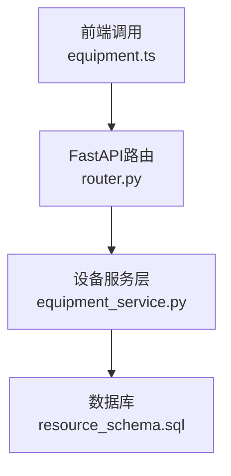
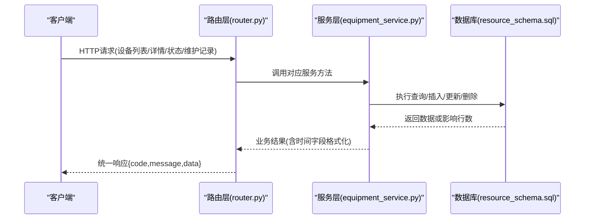
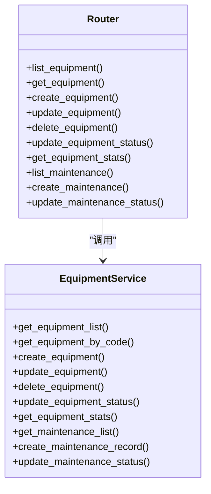

# 设备管理API

<cite>
**本文引用的文件**
- [backend/modules/resource/router.py](file://backend/modules/resource/router.py)
- [backend/modules/resource/services/equipment_service.py](file://backend/modules/resource/services/equipment_service.py)
- [backend/sql/resource_schema.sql](file://backend/sql/resource_schema.sql)
- [webui_ref/client/src/api/resource/equipment.ts](file://webui_ref/client/src/api/resource/equipment.ts)
</cite>

## 目录
1. [简介](#简介)
2. [项目结构](#项目结构)
3. [核心组件](#核心组件)
4. [架构总览](#架构总览)
5. [详细接口说明](#详细接口说明)
6. [依赖关系分析](#依赖关系分析)
7. [性能考虑](#性能考虑)
8. [故障排查指南](#故障排查指南)
9. [结论](#结论)
10. [附录：业务约束与枚举](#附录：业务约束与枚举)

## 简介
本文件为“设备管理模块”的完整API接口文档，覆盖设备CRUD（增删改查）、设备状态管理、维护记录管理等核心能力。所有接口统一前缀 /api/resource，采用REST风格，返回统一格式 {code, message, data}。支持分页、筛选、搜索；提供设备统计看板数据；维护记录支持创建、查询与状态更新。

## 项目结构
设备管理相关代码位于后端资源模块中，路由定义在 router.py，服务层逻辑在 equipment_service.py，数据库表结构在 resource_schema.sql，前端调用封装在 equipment.ts。

图表来源
- [backend/modules/resource/router.py:58-302](file://backend/modules/resource/router.py#L58-L302)
- [backend/modules/resource/services/equipment_service.py:11-495](file://backend/modules/resource/services/equipment_service.py#L11-L495)
- [backend/sql/resource_schema.sql:13-199](file://backend/sql/resource_schema.sql#L13-L199)

章节来源
- [backend/modules/resource/router.py:1-302](file://backend/modules/resource/router.py#L1-L302)
- [backend/modules/resource/services/equipment_service.py:1-495](file://backend/modules/resource/services/equipment_service.py#L1-L495)
- [backend/sql/resource_schema.sql:1-199](file://backend/sql/resource_schema.sql#L1-L199)
- [webui_ref/client/src/api/resource/equipment.ts:1-254](file://webui_ref/client/src/api/resource/equipment.ts#L1-L254)

## 核心组件
- 路由层：定义HTTP端点、参数校验、异常处理与统一响应包装。
- 服务层：实现设备与维护记录的查询、创建、更新、删除、状态切换等核心业务逻辑，包含数据校验、SQL拼装与结果转换。
- 数据层：基于MySQL/MariaDB的设备台账表 equipment 与维护记录表 equipment_maintenance。
- 前端封装：TypeScript类型定义与Axios调用封装，便于UI集成。

章节来源
- [backend/modules/resource/router.py:17-45](file://backend/modules/resource/router.py#L17-L45)
- [backend/modules/resource/services/equipment_service.py:11-495](file://backend/modules/resource/services/equipment_service.py#L11-L495)
- [backend/sql/resource_schema.sql:13-199](file://backend/sql/resource_schema.sql#L13-L199)
- [webui_ref/client/src/api/resource/equipment.ts:8-114](file://webui_ref/client/src/api/resource/equipment.ts#L8-L114)

## 架构总览
设备管理API遵循分层架构：请求进入FastAPI路由，路由将参数传递给服务层，服务层进行业务校验并执行SQL操作，最终返回统一JSON响应。

图表来源
- [backend/modules/resource/router.py:58-302](file://backend/modules/resource/router.py#L58-L302)
- [backend/modules/resource/services/equipment_service.py:11-495](file://backend/modules/resource/services/equipment_service.py#L11-L495)
- [backend/sql/resource_schema.sql:13-199](file://backend/sql/resource_schema.sql#L13-L199)

## 详细接口说明

### 通用约定
- 基础路径：/api/resource
- 成功响应格式：{"code": 200, "message": "...", "data": ...}
- 错误响应：抛出HTTPException，常见状态码 400/404/500
- 分页参数：page（页码，默认1），page_size（每页数量，默认20，最大100）
- 时间字段：服务端统一返回字符串格式 "YYYY-MM-DD HH:MM:SS"

章节来源
- [backend/modules/resource/router.py:58-302](file://backend/modules/resource/router.py#L58-L302)
- [backend/modules/resource/services/equipment_service.py:89-97](file://backend/modules/resource/services/equipment_service.py#L89-L97)

### 设备列表查询
- 方法：GET
- URL：/api/resource/equipment
- 查询参数：
  - page: int, 默认1
  - page_size: int, 默认20，范围1-100
  - status: string, 可选，过滤设备状态（idle/busy/error/maintenance）
  - zone_code: string, 可选，按区域编码筛选
  - equipment_type: string, 可选，按设备类型筛选（lift/island/station）
  - keyword: string, 默认""，模糊匹配设备编号或名称
- 响应 data：
  - total: int
  - page: int
  - page_size: int
  - data: Array<{id, equipment_code, equipment_name, equipment_type, zone_code, status, current_task_id, current_operator, last_update_time, created_at, updated_at, zone_name}>
- 示例请求：GET /api/resource/equipment?page=1&page_size=20&status=idle&keyword=SZC
- 示例响应：
  - code: 200
  - message: "获取成功"
  - data: {total: 120, page: 1, page_size: 20, data: [...]}

章节来源
- [backend/modules/resource/router.py:58-86](file://backend/modules/resource/router.py#L58-L86)
- [backend/modules/resource/services/equipment_service.py:11-103](file://backend/modules/resource/services/equipment_service.py#L11-L103)
- [backend/sql/resource_schema.sql:13-28](file://backend/sql/resource_schema.sql#L13-L28)

### 设备详情获取
- 方法：GET
- URL：/api/resource/equipment/{equipment_code}
- 路径参数：equipment_code: string
- 响应 data：设备详情对象（同列表项字段，额外包含当前任务名称）
- 示例请求：GET /api/resource/equipment/SZC-01
- 示例响应：
  - code: 200
  - message: "获取成功"
  - data: {...}

章节来源
- [backend/modules/resource/router.py:89-109](file://backend/modules/resource/router.py#L89-L109)
- [backend/modules/resource/services/equipment_service.py:106-137](file://backend/modules/resource/services/equipment_service.py#L106-L137)

### 新增设备
- 方法：POST
- URL：/api/resource/equipment
- 请求体：
  - equipment_code: string（唯一）
  - equipment_name: string
  - equipment_type: string（lift/island/station）
  - zone_code: string（需存在）
  - status: string（可选，默认idle）
- 响应 data：新创建的设备对象
- 示例请求：
  - POST /api/resource/equipment
  - body: {"equipment_code":"SZC-06","equipment_name":"举升机06","equipment_type":"lift","zone_code":"SZC"}
- 示例响应：
  - code: 200
  - message: "创建设备成功"
  - data: {...}

章节来源
- [backend/modules/resource/router.py:112-129](file://backend/modules/resource/router.py#L112-L129)
- [backend/modules/resource/services/equipment_service.py:140-178](file://backend/modules/resource/services/equipment_service.py#L140-L178)
- [backend/sql/resource_schema.sql:13-28](file://backend/sql/resource_schema.sql#L13-L28)

### 更新设备信息
- 方法：PUT
- URL：/api/resource/equipment/{equipment_code}
- 路径参数：equipment_code: string
- 请求体（部分更新，仅传需要更新的字段）：
  - equipment_name: string（可选）
  - equipment_type: string（可选）
  - zone_code: string（可选，需存在）
- 响应 data：更新后的设备对象
- 示例请求：
  - PUT /api/resource/equipment/SZC-06
  - body: {"equipment_name":"举升机06A"}
- 示例响应：
  - code: 200
  - message: "更新成功"
  - data: {...}

章节来源
- [backend/modules/resource/router.py:132-154](file://backend/modules/resource/router.py#L132-L154)
- [backend/modules/resource/services/equipment_service.py:181-228](file://backend/modules/resource/services/equipment_service.py#L181-L228)

### 删除设备
- 方法：DELETE
- URL：/api/resource/equipment/{equipment_code}
- 路径参数：equipment_code: string
- 行为：若该设备存在维护记录，会级联删除其维护记录后删除设备
- 响应 data：null
- 示例请求：DELETE /api/resource/equipment/SZC-06
- 示例响应：
  - code: 200
  - message: "删除成功"
  - data: null

章节来源
- [backend/modules/resource/router.py:157-175](file://backend/modules/resource/router.py#L157-L175)
- [backend/modules/resource/services/equipment_service.py:231-259](file://backend/modules/resource/services/equipment_service.py#L231-L259)

### 设备状态切换
- 方法：PUT
- URL：/api/resource/equipment/{equipment_code}/status
- 路径参数：equipment_code: string
- 请求体：
  - status: string（必需，合法值：idle/busy/error/maintenance）
  - operator: string（可选，记录操作员）
- 响应 data：更新后的设备对象
- 示例请求：
  - PUT /api/resource/equipment/SZC-06/status
  - body: {"status":"busy","operator":"张三"}
- 示例响应：
  - code: 200
  - message: "状态更新成功"
  - data: {...}

章节来源
- [backend/modules/resource/router.py:178-201](file://backend/modules/resource/router.py#L178-L201)
- [backend/modules/resource/services/equipment_service.py:262-301](file://backend/modules/resource/services/equipment_service.py#L262-L301)

### 设备统计数据（驾驶舱）
- 方法：GET
- URL：/api/resource/equipment/stats
- 响应 data：
  - total: int
  - idle/busy/error/maintenance: int
  - status_distribution: Array<{status, count}>
- 示例响应：
  - code: 200
  - message: "获取成功"
  - data: {total: 120, idle: 40, busy: 60, error: 5, maintenance: 15, status_distribution: [...]}

章节来源
- [backend/modules/resource/router.py:204-218](file://backend/modules/resource/router.py#L204-L218)
- [backend/modules/resource/services/equipment_service.py:304-335](file://backend/modules/resource/services/equipment_service.py#L304-L335)

### 设备维护记录列表
- 方法：GET
- URL：/api/resource/equipment/{equipment_code}/maintenance
- 路径参数：equipment_code: string
- 查询参数：
  - page: int, 默认1
  - page_size: int, 默认20，范围1-100
  - status: string, 可选，过滤维护状态（in_progress/completed/cancelled）
- 响应 data：
  - total: int
  - page: int
  - page_size: int
  - data: Array<{id, equipment_code, maintenance_type, start_time, end_time, operator, description, status, created_at}>
- 示例请求：GET /api/resource/equipment/SZC-05/maintenance?page=1&page_size=20&status=in_progress
- 示例响应：
  - code: 200
  - message: "获取成功"
  - data: {total: 10, page: 1, page_size: 20, data: [...]}

章节来源
- [backend/modules/resource/router.py:221-245](file://backend/modules/resource/router.py#L221-L245)
- [backend/modules/resource/services/equipment_service.py:338-393](file://backend/modules/resource/services/equipment_service.py#L338-L393)
- [backend/sql/resource_schema.sql:183-199](file://backend/sql/resource_schema.sql#L183-L199)

### 新增维护记录
- 方法：POST
- URL：/api/resource/equipment/{equipment_code}/maintenance
- 路径参数：equipment_code: string
- 请求体：
  - maintenance_type: string（routine/repair/inspection）
  - start_time: string（必需，格式 "YYYY-MM-DD HH:MM:SS"）
  - end_time: string（可选）
  - operator: string（可选）
  - description: string（可选）
  - status: string（可选，默认 in_progress）
- 响应 data：新创建的维护记录对象
- 示例请求：
  - POST /api/resource/equipment/SZC-05/maintenance
  - body: {"maintenance_type":"repair","start_time":"2026-07-31 08:00:00","operator":"维护组","description":"液压系统异常，正在维修","status":"in_progress"}
- 示例响应：
  - code: 200
  - message: "创建维护记录成功"
  - data: {...}

章节来源
- [backend/modules/resource/router.py:248-273](file://backend/modules/resource/router.py#L248-L273)
- [backend/modules/resource/services/equipment_service.py:396-439](file://backend/modules/resource/services/equipment_service.py#L396-L439)
- [backend/sql/resource_schema.sql:183-199](file://backend/sql/resource_schema.sql#L183-L199)

### 更新维护记录状态
- 方法：PUT
- URL：/api/resource/equipment/maintenance/{maintenance_id}/status
- 路径参数：maintenance_id: int
- 请求体：
  - status: string（必需，合法值：in_progress/completed/cancelled）
  - end_time: string（可选；当status为completed且未提供时，服务端自动填充当前时间）
- 响应 data：更新后的维护记录对象
- 示例请求：
  - PUT /api/resource/equipment/maintenance/123/status
  - body: {"status":"completed","end_time":"2026-07-31 17:00:00"}
- 示例响应：
  - code: 200
  - message: "更新成功"
  - data: {...}

章节来源
- [backend/modules/resource/router.py:276-302](file://backend/modules/resource/router.py#L276-L302)
- [backend/modules/resource/services/equipment_service.py:442-495](file://backend/modules/resource/services/equipment_service.py#L442-L495)

## 依赖关系分析
- 路由到服务：每个设备相关路由均调用 equipment_service 中的对应函数，保证职责分离。
- 服务到数据库：使用统一的数据库访问函数（query_all/query_one/execute/execute_last_id）执行SQL，避免硬编码连接。
- 数据模型一致性：前端 TypeScript 类型与后端Pydantic模型保持一致，减少前后端契约不一致风险。
- 外键与索引：equipment.zone_code 引用 zones.zone_code；equipment.status、equipment_type、equipment_maintenance.status 等字段建立索引以提升查询性能。

图表来源
- [backend/modules/resource/router.py:58-302](file://backend/modules/resource/router.py#L58-L302)
- [backend/modules/resource/services/equipment_service.py:11-495](file://backend/modules/resource/services/equipment_service.py#L11-L495)

章节来源
- [backend/modules/resource/router.py:58-302](file://backend/modules/resource/router.py#L58-L302)
- [backend/modules/resource/services/equipment_service.py:11-495](file://backend/modules/resource/services/equipment_service.py#L11-L495)
- [backend/sql/resource_schema.sql:13-199](file://backend/sql/resource_schema.sql#L13-L199)

## 性能考虑
- 分页与限制：列表接口通过 LIMIT/OFFSET 控制返回量，page_size 上限100，避免大结果集拖慢网络与渲染。
- 索引优化：equipment.status、equipment.zone_code、equipment.equipment_type、equipment_maintenance.status 等字段已建索引，提升筛选与排序效率。
- 时间字段格式化：在服务层统一将datetime转为字符串，减少前端解析成本。
- 建议：
  - 对高频查询可引入缓存（如Redis）以减轻数据库压力。
  - 对复杂筛选条件可考虑全文索引或搜索引擎（如Elasticsearch）。
  - 批量操作建议使用事务确保一致性。

[本节为通用指导，不直接分析具体文件]

## 故障排查指南
- 400 错误：通常由参数校验失败引起（如无效的状态值、缺少必填字段、重复的设备编号）。检查请求体字段是否符合枚举约束。
- 404 错误：设备或维护记录不存在。确认路径参数是否正确。
- 500 错误：服务器内部异常。查看后端日志定位具体堆栈。
- 常见问题：
  - 状态值非法：设备状态必须为 idle/busy/error/maintenance；维护状态必须为 in_progress/completed/cancelled。
  - 区域编码不存在：新增或更新设备时，zone_code 必须在 zones 表中存在。
  - 时间格式错误：start_time/end_time 应为 "YYYY-MM-DD HH:MM:SS"。

章节来源
- [backend/modules/resource/router.py:112-302](file://backend/modules/resource/router.py#L112-L302)
- [backend/modules/resource/services/equipment_service.py:140-495](file://backend/modules/resource/services/equipment_service.py#L140-L495)

## 结论
设备管理API提供了完整的设备生命周期管理与维护记录管理能力，接口设计清晰、参数校验严格、响应格式统一。结合数据库索引与服务层逻辑，能够满足日常设备台账、状态监控与维护跟踪的业务需求。建议在后续迭代中补充权限控制、审计日志与缓存策略，进一步提升安全性与性能。

[本节为总结性内容，不直接分析具体文件]

## 附录：业务约束与枚举
- 设备类型（equipment_type）：
  - lift：举升机
  - island：试制岛
  - station：工位
- 设备状态（status）：
  - idle：空闲
  - busy：占用
  - error：故障
  - maintenance：维护中
- 维护类型（maintenance_type）：
  - routine：例行维护
  - repair：维修
  - inspection：巡检
- 维护状态（status of maintenance）：
  - in_progress：进行中
  - completed：已完成
  - cancelled：已取消

章节来源
- [backend/sql/resource_schema.sql:13-28](file://backend/sql/resource_schema.sql#L13-L28)
- [backend/sql/resource_schema.sql:183-199](file://backend/sql/resource_schema.sql#L183-L199)
- [webui_ref/client/src/api/resource/equipment.ts:8-114](file://webui_ref/client/src/api/resource/equipment.ts#L8-L114)
- [backend/modules/resource/services/equipment_service.py:279-282](file://backend/modules/resource/services/equipment_service.py#L279-L282)
- [backend/modules/resource/services/equipment_service.py:460-463](file://backend/modules/resource/services/equipment_service.py#L460-L463)