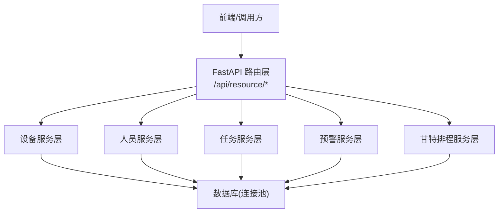
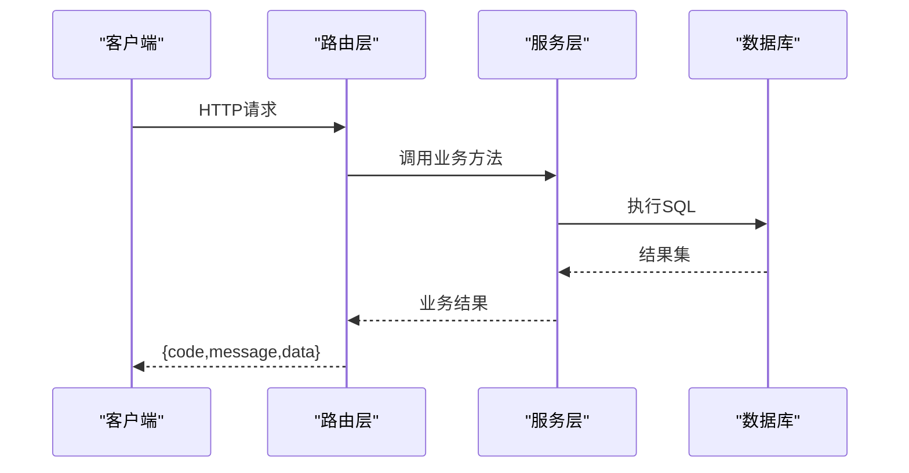
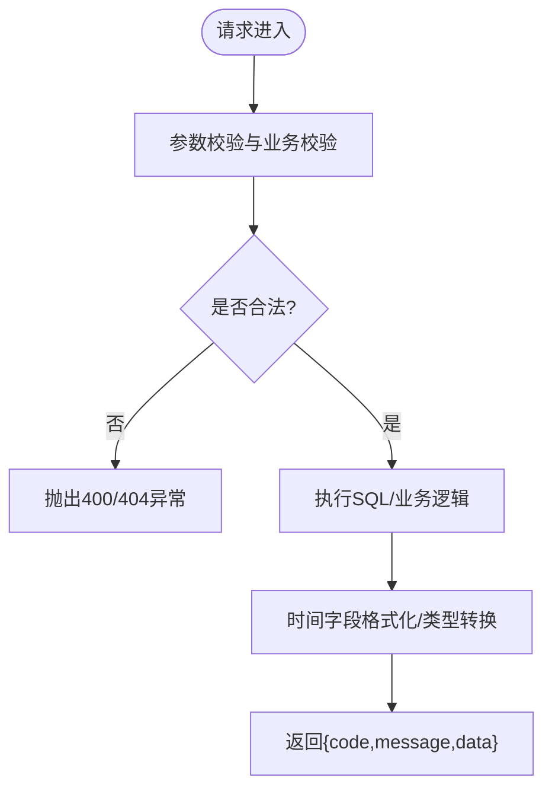

# 资源管理API

<cite>
**本文引用的文件**
- [backend/modules/resource/router.py](file://backend/modules/resource/router.py)
- [backend/modules/resource/services/equipment_service.py](file://backend/modules/resource/services/equipment_service.py)
- [backend/modules/resource/services/personnel_service.py](file://backend/modules/resource/services/personnel_service.py)
- [backend/modules/resource/services/task_service.py](file://backend/modules/resource/services/task_service.py)
- [backend/modules/resource/schemas.py](file://backend/modules/resource/schemas.py)
- [backend/sql/resource_schema.sql](file://backend/sql/resource_schema.sql)
- [backend/database.py](file://backend/database.py)
</cite>

## 目录
1. [简介](#简介)
2. [项目结构](#项目结构)
3. [核心组件](#核心组件)
4. [架构总览](#架构总览)
5. [详细接口文档](#详细接口文档)
6. [依赖关系分析](#依赖关系分析)
7. [性能与扩展性](#性能与扩展性)
8. [故障排查指南](#故障排查指南)
9. [结论](#结论)

## 简介
本文件为“试制资源数智化管理系统”的资源管理模块的完整RESTful API文档，覆盖设备管理、人员管理、任务管理三大域，以及预警与甘特排程相关能力。文档面向前后端开发与集成人员，提供每个接口的HTTP方法、URL模式、请求参数、响应格式、错误处理说明、调用示例与业务场景说明，帮助快速对接与联调。

## 项目结构
资源管理模块采用FastAPI路由+服务层分离的架构：
- 路由层（router.py）：定义HTTP端点、参数校验、统一响应包装、异常转换
- 服务层（services/*）：实现具体业务逻辑、数据访问、状态校验、统计计算
- 数据模型（schemas.py）：Pydantic模型定义，用于请求/响应结构约束
- 数据库（resource_schema.sql）：表结构与索引设计
- 数据库访问（database.py）：连接池封装、查询与执行工具函数

图表来源
- [backend/modules/resource/router.py:1-1454](file://backend/modules/resource/router.py#L1-L1454)
- [backend/database.py:1-116](file://backend/database.py#L1-L116)

章节来源
- [backend/modules/resource/router.py:1-1454](file://backend/modules/resource/router.py#L1-L1454)
- [backend/sql/resource_schema.sql:1-326](file://backend/sql/resource_schema.sql#L1-L326)
- [backend/database.py:1-116](file://backend/database.py#L1-L116)

## 核心组件
- 设备管理：设备台账CRUD、状态更新、维护记录管理、设备统计
- 人员管理：人员信息CRUD、状态跟踪、位置分布、来源分布、看板KPI
- 任务管理：任务CRUD、状态流转、优先级管理、进度自动/手动计算、统计与趋势
- 预警管理：预警创建、处理、升级、批量操作、SLA与超期过滤
- 甘特排程：排程计划CRUD、资源分配、冲突检测与解决、关键路径计算、批量状态更新

章节来源
- [backend/modules/resource/services/equipment_service.py:1-495](file://backend/modules/resource/services/equipment_service.py#L1-L495)
- [backend/modules/resource/services/personnel_service.py:1-475](file://backend/modules/resource/services/personnel_service.py#L1-L475)
- [backend/modules/resource/services/task_service.py:1-432](file://backend/modules/resource/services/task_service.py#L1-L432)
- [backend/modules/resource/router.py:855-1454](file://backend/modules/resource/router.py#L855-L1454)

## 架构总览
- 路由层负责接收请求、参数校验、调用服务层、统一返回格式{code, message, data}
- 服务层进行业务规则校验、SQL拼装与执行、时间字段格式化、统计聚合
- 数据库层通过连接池复用连接，提供query_all/query_one/execute等基础能力
- 错误处理：路由层捕获异常并转换为HTTPException；服务层抛出ValueError等业务异常

图表来源
- [backend/modules/resource/router.py:58-105](file://backend/modules/resource/router.py#L58-L105)
- [backend/modules/resource/services/equipment_service.py:11-103](file://backend/modules/resource/services/equipment_service.py#L11-L103)
- [backend/database.py:51-101](file://backend/database.py#L51-L101)

## 详细接口文档

### 通用约定
- 基础路径：/api/resource
- 统一响应体：
  - code: 数字状态码（成功通常为200）
  - message: 提示信息
  - data: 业务数据对象或列表
- 分页参数：page（页码，默认1）、page_size（每页数量，默认20，部分接口上限不同）
- 时间字段：服务端会按字符串格式返回（如“YYYY-MM-DD HH:MM:SS”或“YYYY-MM-DD”）

章节来源
- [backend/modules/resource/router.py:1-1454](file://backend/modules/resource/router.py#L1-L1454)

### 设备管理
- 健康检查
  - GET /api/resource/ping
  - 响应：模块就绪信息与版本
- 设备列表
  - GET /api/resource/equipment
  - 查询参数：page, page_size, status, zone_code, equipment_type, keyword
  - 响应：包含total/page/page_size/data的设备列表
- 设备详情
  - GET /api/resource/equipment/{equipment_code}
  - 路径参数：equipment_code
  - 响应：设备详情（含区域名称、当前任务名等）
- 创建设备
  - POST /api/resource/equipment
  - 请求体：equipment_code, equipment_name, equipment_type, zone_code, status(可选)
  - 响应：新设备信息
- 更新设备
  - PUT /api/resource/equipment/{equipment_code}
  - 请求体：可更新的字段集合（name/type/zone等）
  - 响应：更新后的设备信息
- 删除设备
  - DELETE /api/resource/equipment/{equipment_code}
  - 响应：删除成功
- 设备状态更新
  - PUT /api/resource/equipment/{equipment_code}/status
  - 请求体：status(可选operator)，有效值：idle/busy/error/maintenance
  - 响应：更新后的设备信息
- 设备统计
  - GET /api/resource/equipment/stats
  - 响应：各状态计数与总数
- 维护记录
  - 列表：GET /api/resource/equipment/{equipment_code}/maintenance?page&page_size&status
  - 新增：POST /api/resource/equipment/{equipment_code}/maintenance
  - 状态更新：PUT /api/resource/equipment/maintenance/{maintenance_id}/status

调用示例（设备列表）
- 请求：GET /api/resource/equipment?page=1&page_size=20&status=idle&keyword=SZC
- 响应示例：
  - {
      "code": 200,
      "message": "获取成功",
      "data": {
        "total": 120,
        "page": 1,
        "page_size": 20,
        "data": [
          {"id": 1, "equipment_code": "SZC-01", "equipment_name": "举升机01", "equipment_type": "lift", "zone_code": "SZC", "status": "idle", "current_task_id": null, "current_operator": null, "last_update_time": "2026-01-01 10:00:00", "created_at": "...", "updated_at": "..."}
        ]
      }
    }

错误处理
- 400：参数校验失败或业务校验失败（如无效状态、重复编号）
- 404：设备不存在
- 500：服务器内部错误

章节来源
- [backend/modules/resource/router.py:47-303](file://backend/modules/resource/router.py#L47-L303)
- [backend/modules/resource/services/equipment_service.py:11-495](file://backend/modules/resource/services/equipment_service.py#L11-L495)
- [backend/sql/resource_schema.sql:11-29](file://backend/sql/resource_schema.sql#L11-L29)
- [backend/sql/resource_schema.sql:183-199](file://backend/sql/resource_schema.sql#L183-L199)

### 人员管理
- 人员列表
  - GET /api/resource/personnel?page&page_size&status&current_zone&department&keyword
  - 支持装配区与非装配区显示差异（is_assembly_zone标记）
- 人员详情
  - GET /api/resource/personnel/{personnel_code}
- 创建人员
  - POST /api/resource/personnel
  - 请求体：personnel_code, name, department(可选), status(可选), current_zone(可选)
- 更新人员
  - PUT /api/resource/personnel/{personnel_code}
  - 请求体：可更新字段（name/department/status/current_zone/current_task_id等）
- 删除人员
  - DELETE /api/resource/personnel/{personnel_code}
- 人员状态快速更新
  - PUT /api/resource/personnel/{personnel_code}/status
  - 请求体：status(working/idle/offline), current_zone(可选)
- 人员看板KPI
  - GET /api/resource/personnel/stats
  - 响应：total/on_duty/working/idle/offline及分布
- 人员来源分布
  - GET /api/resource/personnel/source-distribution
  - 响应：装配区饼图数据、柱状图数据、非装配区分布
- 人员位置分布
  - GET /api/resource/personnel/map
  - 响应：区域汇总与人员明细
- 人效分析（占位）
  - GET /api/resource/personnel/efficiency?start_date&end_date&department

调用示例（人员状态更新）
- 请求：PUT /api/resource/personnel/P001/status
- 请求体：{"status": "working", "current_zone": "SZB"}
- 响应示例：
  - {
      "code": 200,
      "message": "状态更新成功",
      "data": {"personnel_code": "P001", "name": "张三", "status": "working", "current_zone": "SZB", ...}
    }

错误处理
- 400：无效状态或来源
- 404：工号不存在
- 500：服务器内部错误

章节来源
- [backend/modules/resource/router.py:333-579](file://backend/modules/resource/router.py#L333-L579)
- [backend/modules/resource/services/personnel_service.py:1-475](file://backend/modules/resource/services/personnel_service.py#L1-L475)
- [backend/sql/resource_schema.sql:47-66](file://backend/sql/resource_schema.sql#L47-L66)

### 任务管理
- 任务列表
  - GET /api/resource/tasks?page&page_size&task_type&trial_type&status&priority&zone_code&assembly_site&keyword
- 任务详情
  - GET /api/resource/tasks/{task_id}
- 创建任务
  - POST /api/resource/tasks
  - 请求体：task_code, task_name, task_type, priority(可选), status(可选), zone_code, assembly_site, plan_start_time, plan_end_time, plan_work_hours, actual_work_hours, progress_manual_override(可选), source(可选)
- 更新任务
  - PUT /api/resource/tasks/{task_id}
  - 请求体：可更新字段集合（名称、类型、状态、优先级、区域、工时、进度等）
- 删除任务
  - DELETE /api/resource/tasks/{task_id}
- 任务看板KPI
  - GET /api/resource/tasks/stats
- 任务状态分布
  - GET /api/resource/tasks/status-distribution
- 任务类型与进度对比
  - GET /api/resource/tasks/type-progress
- 月度趋势
  - GET /api/resource/tasks/monthly-trend?year
- 甘特图排程数据（占位）
  - GET /api/resource/tasks/gantt?start_date&end_date&task_type

进度计算规则
- 若progress_manual_override为真，则保留传入的progress
- 否则根据actual_work_hours与plan_work_hours自动计算进度百分比（上限100%）

调用示例（创建任务）
- 请求：POST /api/resource/tasks
- 请求体：
  - {
      "task_code": "T-2026-001",
      "task_name": "样车装配",
      "task_type": "B",
      "priority": "high",
      "status": "pending",
      "zone_code": "SZC",
      "assembly_site": "SZC",
      "plan_start_time": "2026-01-10 08:00:00",
      "plan_end_time": "2026-01-12 18:00:00",
      "plan_work_hours": 24,
      "actual_work_hours": 0,
      "source": "manual"
    }
- 响应示例：
  - {
      "code": 200,
      "message": "创建任务成功",
      "data": {"id": 1001, "task_code": "T-2026-001", "task_name": "样车装配", "status": "pending", "progress": 0, ...}
    }

错误处理
- 400：无效类型/优先级/状态、重复任务编号
- 404：任务ID不存在
- 500：服务器内部错误

章节来源
- [backend/modules/resource/router.py:581-853](file://backend/modules/resource/router.py#L581-L853)
- [backend/modules/resource/services/task_service.py:1-432](file://backend/modules/resource/services/task_service.py#L1-L432)
- [backend/sql/resource_schema.sql:68-109](file://backend/sql/resource_schema.sql#L68-L109)

### 预警管理
- 预警列表
  - GET /api/resource/alerts?page&page_size&alert_type&level&status&source&zone_code&assembly_site&handler&raised_start&raised_end&keyword&escalated_only&overdue_only
- 预警统计
  - GET /api/resource/alerts/stats
- 预警详情
  - GET /api/resource/alerts/{alert_id}
- 创建预警
  - POST /api/resource/alerts
  - 请求体：alert_type, level, title, description, source, related_* 等
- 更新预警
  - PUT /api/resource/alerts/{alert_id}
- 处理预警
  - POST /api/resource/alerts/{alert_id}/handle
  - 请求体：handler, handler_department, processing_scheme, corrective_action, preventive_measure, result_verification, status(默认processing)
- 升级上报
  - POST /api/resource/alerts/{alert_id}/escalate
  - 请求体：escalated_to, reason(可选)
- 批量状态更新
  - POST /api/resource/alerts/batch
  - 请求体：ids, status, operator(可选)

调用示例（处理预警）
- 请求：POST /api/resource/alerts/100/handle
- 请求体：{"handler": "李四", "status": "processing", "processing_scheme": "临时措施..."}
- 响应示例：
  - {
      "code": 200,
      "message": "处理成功",
      "data": {"id": 100, "status": "processing", "handler": "李四", ...}
    }

错误处理
- 400：参数校验失败
- 404：预警ID不存在
- 500：服务器内部错误

章节来源
- [backend/modules/resource/router.py:855-1076](file://backend/modules/resource/router.py#L855-L1076)
- [backend/sql/resource_schema.sql:111-163](file://backend/sql/resource_schema.sql#L111-L163)

### 甘特排程
- 排程数据列表
  - GET /api/resource/gantt/data?page&page_size&task_type&status&priority&assembly_site&keyword&only_critical&only_conflict&date_from&date_to
- 排程统计
  - GET /api/resource/gantt/stats
- 排程详情
  - GET /api/resource/gantt/schedules/{schedule_id_or_code}
- 新建排程
  - POST /api/resource/gantt/schedules
  - 请求体：ScheduleCreateRequest字段
- 更新排程
  - PUT /api/resource/gantt/schedules/{schedule_id_or_code}
  - 请求体：ScheduleUpdateRequest字段
- 删除排程
  - DELETE /api/resource/gantt/schedules/{schedule_id_or_code}
- 设置前置依赖
  - PUT /api/resource/gantt/schedules/{schedule_id_or_code}/dependencies
  - 请求体：predecessor_ids
- 资源分配
  - 列表：GET /api/resource/gantt/allocations?schedule_id_or_code&resource_type&resource_code&status
  - 新增：POST /api/resource/gantt/allocations
  - 删除：DELETE /api/resource/gantt/allocations/{allocation_id}
  - 批量分配：POST /api/resource/gantt/allocations/batch
- 冲突检测
  - POST /api/resource/gantt/check-conflicts
  - 请求体：assembly_site(可选), auto_save(可选)
- 冲突列表
  - GET /api/resource/gantt/conflicts?conflict_type&severity&status&assembly_site&schedule_id&page&page_size
- 解决/忽略冲突
  - PUT /api/resource/gantt/conflicts/{conflict_id_or_code}/resolve
  - PUT /api/resource/gantt/conflicts/{conflict_id_or_code}/ignore
- 关键路径计算
  - POST /api/resource/gantt/compute-critical
- 批量状态更新
  - POST /api/resource/gantt/batch-status
  - 请求体：schedule_ids, status, by(可选)

调用示例（冲突检测）
- 请求：POST /api/resource/gantt/check-conflicts
- 请求体：{"assembly_site": "SZC", "auto_save": true}
- 响应示例：
  - {
      "code": 200,
      "message": "检测完成",
      "data": {"count": 2, "conflicts": [...]}
    }

错误处理
- 400：参数校验失败或环检测失败
- 404：排程不存在
- 500：服务器内部错误

章节来源
- [backend/modules/resource/router.py:1078-1454](file://backend/modules/resource/router.py#L1078-L1454)
- [backend/sql/resource_schema.sql:201-326](file://backend/sql/resource_schema.sql#L201-L326)

### 驾驶舱
- KPI汇总
  - GET /api/resource/dashboard/kpi
  - 响应：设备状态分布、设备总数、忙碌/空闲/故障/维护计数等

章节来源
- [backend/modules/resource/router.py:1422-1454](file://backend/modules/resource/router.py#L1422-L1454)

## 依赖关系分析
- 路由与服务层解耦：路由仅做参数绑定与异常转换，服务层专注业务逻辑
- 服务层依赖数据库访问工具：query_all/query_one/execute/execute_last_id
- 数据一致性：写操作使用事务提交，失败回滚；时间字段在服务层统一格式化
- 枚举与校验：服务层对状态、类型、优先级等进行白名单校验，避免非法值写入

图表来源
- [backend/modules/resource/services/equipment_service.py:140-229](file://backend/modules/resource/services/equipment_service.py#L140-L229)
- [backend/modules/resource/services/personnel_service.py:170-261](file://backend/modules/resource/services/personnel_service.py#L170-L261)
- [backend/modules/resource/services/task_service.py:177-278](file://backend/modules/resource/services/task_service.py#L177-L278)
- [backend/database.py:73-101](file://backend/database.py#L73-L101)

章节来源
- [backend/modules/resource/router.py:1-1454](file://backend/modules/resource/router.py#L1-L1454)
- [backend/database.py:1-116](file://backend/database.py#L1-L116)

## 性能与扩展性
- 分页查询：所有列表接口支持分页，减少单次响应体积
- 索引优化：数据库表针对常用筛选字段建立索引（如status、zone_code、priority等）
- 连接池：数据库连接池复用连接，降低开销
- 统计接口：按状态/类型/区域聚合查询，适合看板展示
- 可扩展点：
  - 增加新的筛选维度时，在路由层添加Query参数并在服务层拼接WHERE条件
  - 新增枚举值需在服务层白名单中补充
  - 复杂统计可通过视图或物化表提升性能

[本节为通用指导，不直接分析具体文件]

## 故障排查指南
- 数据库连接失败
  - 现象：启动时报错或接口返回500
  - 排查：检查.env配置DB_HOST/DB_PORT/DB_USER/DB_PASSWORD/DB_DATABASE是否正确
  - 参考：连接池初始化日志
- 参数校验失败
  - 现象：返回400，detail提示无效状态或类型
  - 排查：核对请求体字段是否符合枚举范围
- 资源不存在
  - 现象：返回404，detail提示ID或编码不存在
  - 排查：确认路径参数与数据库记录一致
- 时间字段格式问题
  - 现象：前端解析时间异常
  - 排查：确认服务端返回的时间字符串格式（日期或日期时间）

章节来源
- [backend/database.py:12-43](file://backend/database.py#L12-L43)
- [backend/modules/resource/router.py:85-109](file://backend/modules/resource/router.py#L85-L109)
- [backend/modules/resource/services/equipment_service.py:262-301](file://backend/modules/resource/services/equipment_service.py#L262-L301)
- [backend/modules/resource/services/personnel_service.py:286-323](file://backend/modules/resource/services/personnel_service.py#L286-L323)
- [backend/modules/resource/services/task_service.py:240-278](file://backend/modules/resource/services/task_service.py#L240-L278)

## 结论
本API文档覆盖了资源管理模块的核心能力：设备、人员、任务的CRUD与状态管理，以及预警与甘特排程的配套功能。通过统一响应格式、严格的数据校验与完善的错误处理，便于前后端高效协作。建议在实际对接中结合本文件的调用示例与错误处理说明，逐步完善前端交互与后端扩展。