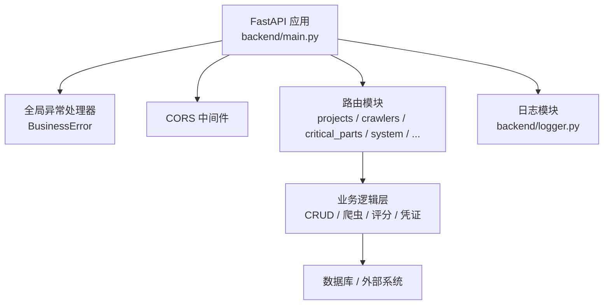
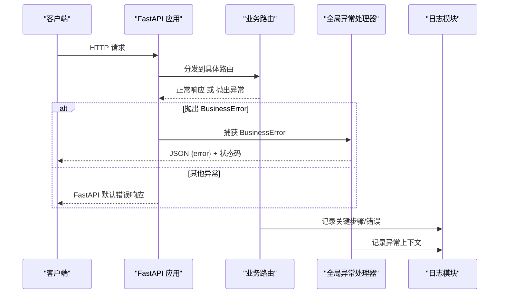
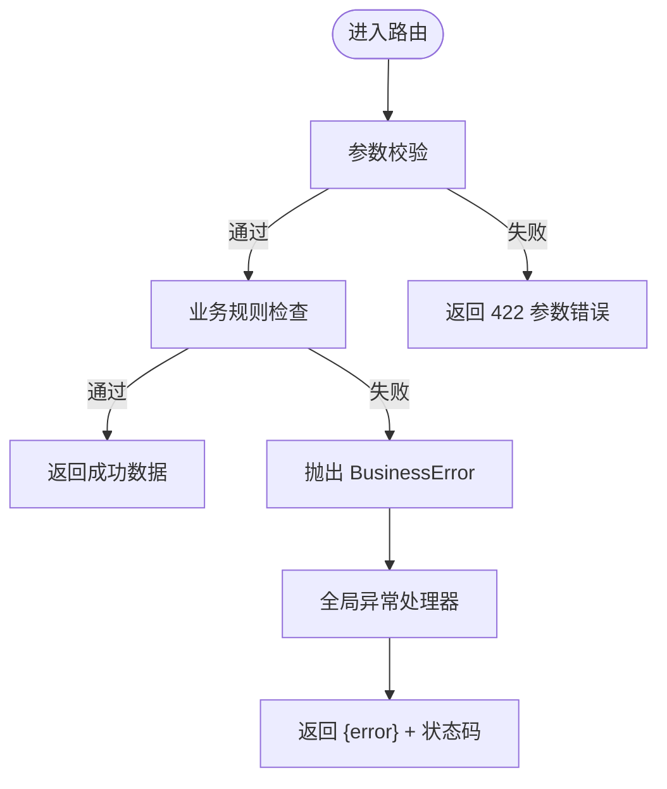
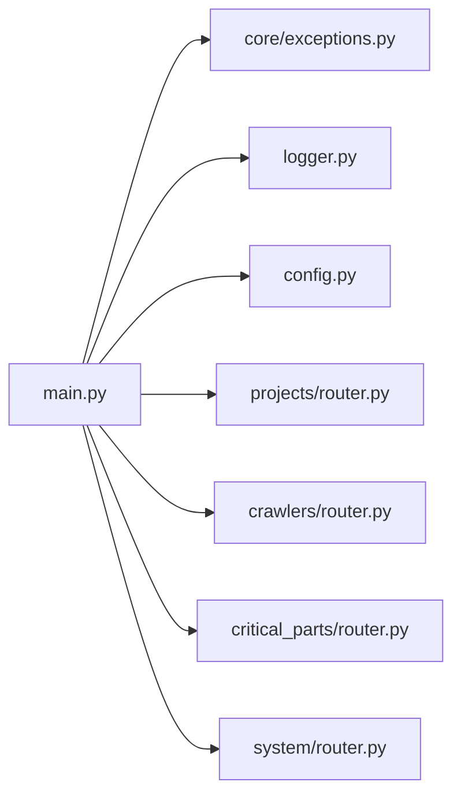

# 错误处理规范

<cite>
**本文引用的文件**
- [backend/main.py](file://backend/main.py)
- [backend/core/exceptions.py](file://backend/core/exceptions.py)
- [backend/logger.py](file://backend/logger.py)
- [backend/config.py](file://backend/config.py)
- [backend/projects/router.py](file://backend/projects/router.py)
- [backend/critical_parts/router.py](file://backend/critical_parts/router.py)
- [backend/system/router.py](file://backend/system/router.py)
- [backend/crawlers/router.py](file://backend/crawlers/router.py)
</cite>

## 目录
1. [简介](#简介)
2. [项目结构](#项目结构)
3. [核心组件](#核心组件)
4. [架构总览](#架构总览)
5. [详细组件分析](#详细组件分析)
6. [依赖关系分析](#依赖关系分析)
7. [性能考虑](#性能考虑)
8. [故障排查指南](#故障排查指南)
9. [结论](#结论)
10. [附录](#附录)

## 简介
本规范面向后端 FastAPI 服务，统一 API 的错误码、异常类型、响应格式与日志记录策略，覆盖业务异常、系统异常、参数验证异常等常见场景；同时给出前端错误处理与用户友好提示建议，确保前后端一致的错误体验与可观测性。

## 项目结构
本项目采用模块化路由组织，错误处理集中在应用入口进行全局注册，配合统一的日志模块输出结构化日志，便于问题定位与追踪。

**图示来源**
- [backend/main.py:29-83](file://backend/main.py#L29-L83)
- [backend/logger.py:14-38](file://backend/logger.py#L14-L38)

**章节来源**
- [backend/main.py:29-83](file://backend/main.py#L29-L83)
- [backend/logger.py:14-38](file://backend/logger.py#L14-L38)

## 核心组件
- 统一业务异常：定义业务异常基类，携带消息与状态码，便于上层抛出并在全局处理器中统一返回。
- 全局异常处理：在应用启动时注册 BusinessError 处理器，将业务异常转换为 JSON 响应。
- 日志体系：集中式 logger，按环境切换级别，支持文件轮转与控制台输出。
- 配置中心：通过环境变量加载运行参数（如调试模式、CORS、端口等），影响日志级别与行为。

**章节来源**
- [backend/core/exceptions.py:2-8](file://backend/core/exceptions.py#L2-L8)
- [backend/main.py:85-92](file://backend/main.py#L85-L92)
- [backend/logger.py:14-38](file://backend/logger.py#L14-L38)
- [backend/config.py:48-102](file://backend/config.py#L48-L102)

## 架构总览
下图展示请求进入 FastAPI 后的错误处理路径：路由层抛出异常或返回数据，全局异常处理器捕获业务异常并格式化响应；未捕获的系统异常由 FastAPI 默认机制处理；所有关键路径均通过日志记录上下文信息。

**图示来源**
- [backend/main.py:85-92](file://backend/main.py#L85-L92)
- [backend/logger.py:14-38](file://backend/logger.py#L14-L38)

## 详细组件分析

### 统一异常与响应格式
- 业务异常：使用自定义异常类承载 message 与 code，便于语义化表达错误原因。
- 全局处理器：将 BusinessError 映射为 JSON 响应，字段包含 error 与对应 HTTP 状态码。
- 参数校验异常：由 Pydantic/FastAPI 自动校验失败时返回标准 422 响应，建议在路由层补充可读提示。
- 系统异常：未捕获的异常由框架默认处理，建议结合日志记录堆栈以便排查。

**图示来源**
- [backend/core/exceptions.py:2-8](file://backend/core/exceptions.py#L2-L8)
- [backend/main.py:85-92](file://backend/main.py#L85-L92)

**章节来源**
- [backend/core/exceptions.py:2-8](file://backend/core/exceptions.py#L2-L8)
- [backend/main.py:85-92](file://backend/main.py#L85-L92)

### 路由层错误处理实践
- 资源不存在：使用 HTTPException 返回 404，detail 提供清晰说明。
- 参数非法：使用 HTTPException 返回 400，detail 指出缺失列或格式问题。
- 上传与解析：对文件格式、大小、必填列进行检查，失败时返回 400 并附带原因。
- 异步任务：对于耗时操作（如爬虫执行）采用异步返回 task_id，并在异常时记录日志并返回失败信息。

示例参考路径：
- 项目模块：[backend/projects/router.py:20-231](file://backend/projects/router.py#L20-L231)
- 关键件模块：[backend/critical_parts/router.py:23-95](file://backend/critical_parts/router.py#L23-L95)
- 系统设置模块：[backend/system/router.py:54-109](file://backend/system/router.py#L54-L109)
- 爬虫管理模块：[backend/crawlers/router.py:43-225](file://backend/crawlers/router.py#L43-L225)

**章节来源**
- [backend/projects/router.py:20-231](file://backend/projects/router.py#L20-L231)
- [backend/critical_parts/router.py:23-95](file://backend/critical_parts/router.py#L23-L95)
- [backend/system/router.py:54-109](file://backend/system/router.py#L54-L109)
- [backend/crawlers/router.py:43-225](file://backend/crawlers/router.py#L43-L225)

### 日志记录与调试
- 日志级别：DEBUG 模式下输出更详细日志，生产模式默认 INFO。
- 文件轮转：单文件最大 10MB，保留 7 个历史文件，避免磁盘占用过大。
- 控制台输出：便于本地开发与容器化部署查看实时日志。
- 建议：在关键路径（如文件上传、爬虫执行、调度器控制）记录入参摘要与结果，异常时使用 exception 级别记录堆栈。

**章节来源**
- [backend/logger.py:14-38](file://backend/logger.py#L14-L38)
- [backend/config.py:81-85](file://backend/config.py#L81-L85)

### 配置与环境
- DEBUG：控制日志级别与是否热重载。
- CORS_ORIGINS：限制跨域来源，避免安全漏洞。
- SERVER_HOST/PORT：服务监听地址与端口。
- UPLOAD_DIR：上传文件存储目录，需确保存在且权限正确。

**章节来源**
- [backend/config.py:48-102](file://backend/config.py#L48-L102)

## 依赖关系分析
- 应用入口依赖：FastAPI、CORS、各模块路由、日志、配置、业务异常。
- 路由层依赖：各自模块的 CRUD、服务、外部系统（数据库、爬虫、LLM）。
- 日志依赖：配置中的 DEBUG 决定日志级别；文件处理器基于 RotatingFileHandler。

**图示来源**
- [backend/main.py:18-27](file://backend/main.py#L18-L27)
- [backend/main.py:85-92](file://backend/main.py#L85-L92)
- [backend/logger.py:14-38](file://backend/logger.py#L14-L38)
- [backend/config.py:48-102](file://backend/config.py#L48-L102)

**章节来源**
- [backend/main.py:18-27](file://backend/main.py#L18-L27)
- [backend/main.py:85-92](file://backend/main.py#L85-L92)

## 性能考虑
- 日志写入：生产环境建议仅记录必要信息，避免高频 I/O 影响接口延迟。
- 文件上传：流式读取与及时清理临时文件，防止磁盘占满。
- 异步任务：长耗时操作应异步执行并返回任务 ID，前端轮询状态，避免阻塞请求。
- 数据库查询：分页与过滤条件应在服务端实现，减少不必要的数据传输。

## 故障排查指南
- 常见问题
  - 模板文件不存在：检查静态目录与路径配置，返回 404 并提示管理员。
  - 上传文件格式不支持：限制扩展名，返回 400 并说明支持的格式。
  - 表格缺少必填列：解析阶段检测并返回 400，列出缺失列名。
  - 爬虫执行失败：记录异常堆栈，返回 success=false 与错误信息，前端轮询获取最新状态。
- 定位方法
  - 查看 logs 目录下应用日志，关注 ERROR/EXCEPTION 级别。
  - 核对环境变量配置（DEBUG、CORS、端口、上传目录）。
  - 复现最小用例，逐步缩小问题范围。

**章节来源**
- [backend/projects/router.py:20-231](file://backend/projects/router.py#L20-L231)
- [backend/crawlers/router.py:43-225](file://backend/crawlers/router.py#L43-L225)
- [backend/logger.py:14-38](file://backend/logger.py#L14-L38)

## 结论
通过统一业务异常、全局异常处理器与集中式日志，本项目实现了清晰的错误分类、一致的响应格式与良好的可观测性。建议在各路由层遵循本规范，持续完善错误提示与日志上下文，提升用户体验与运维效率。

## 附录

### 统一错误码与响应格式建议
- 业务异常：HTTP 4xx（如 400、404），响应体包含 error 字段，message 对用户友好。
- 参数校验异常：HTTP 422，响应体包含字段级错误详情。
- 系统异常：HTTP 5xx，响应体包含通用错误提示，详细堆栈仅落盘日志。
- 成功响应：建议统一包含 success、data/message 等字段，便于前端统一处理。

### 前端错误处理与用户提示策略
- 区分错误类型：参数错误提示表单字段；业务错误提示明确原因；系统错误提示“服务暂时不可用，请稍后重试”。
- 统一拦截：在 HTTP 客户端层统一捕获异常，根据状态码与响应体显示不同提示。
- 可重试机制：对网络抖动或临时服务不可用进行有限次重试，避免频繁失败。
- 日志上报：前端可上报关键错误上下文（如接口、参数摘要、时间戳），辅助后端定位问题。