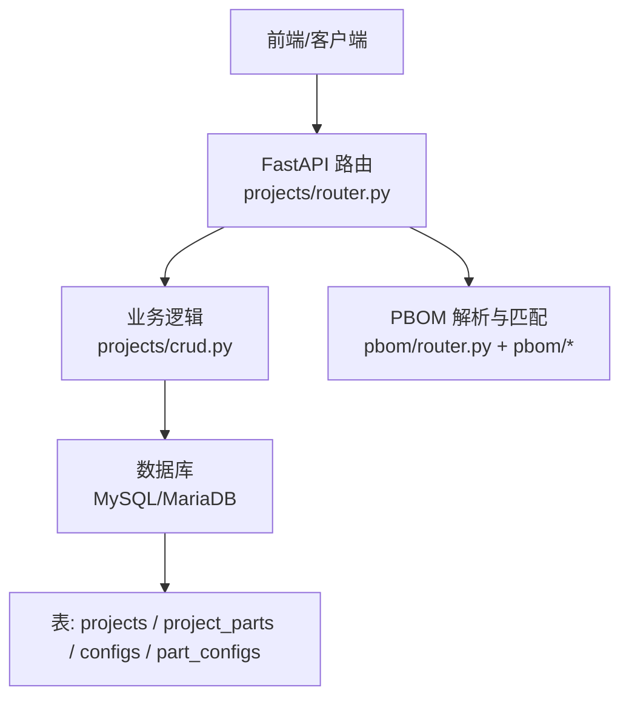
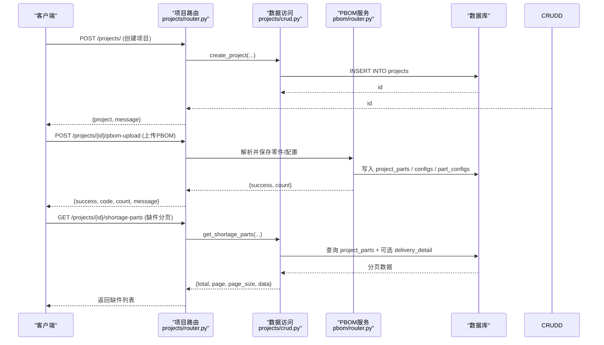
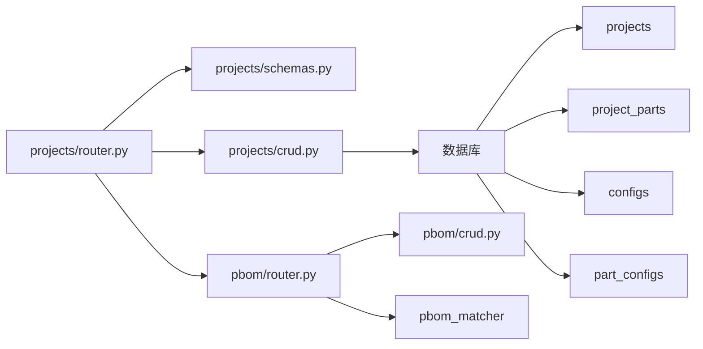

# 项目管理API

<cite>
**本文引用的文件**
- [backend/projects/router.py](file://backend/projects/router.py)
- [backend/projects/crud.py](file://backend/projects/crud.py)
- [backend/projects/schemas.py](file://backend/projects/schemas.py)
- [backend/pbom/router.py](file://backend/pbom/router.py)
- [backend/scripts/init_db.py](file://backend/scripts/init_db.py)
</cite>

## 目录
1. [简介](#简介)
2. [项目结构](#项目结构)
3. [核心组件](#核心组件)
4. [架构总览](#架构总览)
5. [详细接口说明](#详细接口说明)
6. [依赖关系分析](#依赖关系分析)
7. [性能与扩展建议](#性能与扩展建议)
8. [故障排查指南](#故障排查指南)
9. [结论](#结论)

## 简介
本文件为“项目管理模块”的完整API文档，覆盖项目的CRUD、状态管理、PBOM导入与匹配、缺件查询与统计等RESTful端点。文档包含请求参数、响应格式、分页与筛选、搜索能力，以及与任务、设备、人员关联数据的查询方式与调用示例、错误处理说明。

## 项目结构
后端采用FastAPI模块化路由组织：
- 项目路由：backend/projects/router.py
- 数据访问层：backend/projects/crud.py
- 数据模型校验：backend/projects/schemas.py
- PBOM解析与匹配：backend/pbom/router.py（与项目强相关）
- 数据库表结构初始化：backend/scripts/init_db.py（定义projects、project_parts、configs、part_configs等）

图表来源
- [backend/projects/router.py:1-231](file://backend/projects/router.py#L1-L231)
- [backend/projects/crud.py:1-311](file://backend/projects/crud.py#L1-L311)
- [backend/pbom/router.py:1-166](file://backend/pbom/router.py#L1-L166)
- [backend/scripts/init_db.py:20-97](file://backend/scripts/init_db.py#L20-L97)

章节来源
- [backend/projects/router.py:1-231](file://backend/projects/router.py#L1-L231)
- [backend/projects/crud.py:1-311](file://backend/projects/crud.py#L1-L311)
- [backend/scripts/init_db.py:20-97](file://backend/scripts/init_db.py#L20-L97)

## 核心组件
- 路由层：提供HTTP端点，负责参数校验、异常抛出、结果封装。
- 数据访问层：封装SQL查询与更新，实现分页、筛选、聚合统计。
- 数据模型：使用Pydantic模型对创建/更新请求进行结构化校验。
- PBOM模块：支持Excel模板下载、上传解析、列检测、零件提取、配置保存与匹配。

章节来源
- [backend/projects/router.py:1-231](file://backend/projects/router.py#L1-L231)
- [backend/projects/schemas.py:1-26](file://backend/projects/schemas.py#L1-L26)
- [backend/projects/crud.py:1-311](file://backend/projects/crud.py#L1-L311)
- [backend/pbom/router.py:1-166](file://backend/pbom/router.py#L1-L166)

## 架构总览
下图展示从请求到响应的关键流程，包括项目CRUD、PBOM导入与匹配、缺件查询与分布统计。

图表来源
- [backend/projects/router.py:32-131](file://backend/projects/router.py#L32-L131)
- [backend/projects/crud.py:5-168](file://backend/projects/crud.py#L5-L168)
- [backend/pbom/router.py:88-166](file://backend/pbom/router.py#L88-L166)
- [backend/scripts/init_db.py:20-97](file://backend/scripts/init_db.py#L20-L97)

## 详细接口说明

### 基础信息
- 基础路径：/projects
- 认证：当前路由未启用鉴权中间件，请结合网关或统一鉴权策略使用
- 通用响应：除特别说明外，成功响应均为JSON对象；失败通过HTTPException抛出，包含status_code与detail

### 项目CRUD

#### 获取项目列表（分页）
- 方法：GET
- 路径：/projects/
- 查询参数：
  - page: 页码，默认1，最小1
  - page_size: 每页数量，默认20，范围1-100
- 响应字段：
  - projects: 项目数组
  - total: 总数
- 备注：列表会附带每个项目的部件数、需求总量、到货量、线边量、交付率、齐套率等聚合指标

章节来源
- [backend/projects/router.py:32-38](file://backend/projects/router.py#L32-L38)
- [backend/projects/crud.py:5-49](file://backend/projects/crud.py#L5-L49)

#### 获取项目详情
- 方法：GET
- 路径：/projects/{project_id}
- 路径参数：project_id: 整数
- 响应字段：
  - project: 项目对象，包含基本信息与聚合指标（如parts_count、delivery_rate、matched_rate等）
- 错误：
  - 404：项目不存在

章节来源
- [backend/projects/router.py:41-46](file://backend/projects/router.py#L41-L46)
- [backend/projects/crud.py:52-99](file://backend/projects/crud.py#L52-L99)

#### 创建项目
- 方法：POST
- 路径：/projects/
- 请求体（ProjectCreate）：
  - name: 字符串，必填
  - project_code: 字符串，必填
  - apply_code: 字符串，必填
  - apply_code2: 字符串，可选，默认空串
  - status: 字符串，可选，默认“进行中”
  - trial_leader: 字符串，可选，默认空串
  - process_leader: 字符串，可选，默认空串
  - assembly_leader: 字符串，可选，默认空串
- 响应字段：
  - project: 创建后的项目对象
  - message: 成功消息
- 错误：
  - 422：请求体验证失败（由Pydantic自动处理）

章节来源
- [backend/projects/router.py:49-62](file://backend/projects/router.py#L49-L62)
- [backend/projects/schemas.py:5-14](file://backend/projects/schemas.py#L5-L14)
- [backend/projects/crud.py:102-110](file://backend/projects/crud.py#L102-L110)

#### 更新项目
- 方法：PUT
- 路径：/projects/{project_id}
- 路径参数：project_id: 整数
- 请求体（ProjectUpdate）：所有字段可选，仅提交需要更新的字段
- 响应字段：
  - message: 成功消息
- 错误：
  - 404：项目不存在
  - 422：请求体验证失败

章节来源
- [backend/projects/router.py:65-72](file://backend/projects/router.py#L65-L72)
- [backend/projects/schemas.py:17-26](file://backend/projects/schemas.py#L17-L26)
- [backend/projects/crud.py:113-122](file://backend/projects/crud.py#L113-L122)

#### 删除项目
- 方法：DELETE
- 路径：/projects/{project_id}
- 路径参数：project_id: 整数
- 响应字段：
  - message: 成功消息
- 错误：
  - 404：项目不存在

章节来源
- [backend/projects/router.py:75-81](file://backend/projects/router.py#L75-L81)
- [backend/projects/crud.py:125-126](file://backend/projects/crud.py#L125-L126)

### 项目关联数据

#### 获取项目零件清单
- 方法：GET
- 路径：/projects/{project_id}/parts
- 路径参数：project_id: 整数
- 响应字段：
  - parts: 零件数组（含需求、到货、线边、来源、缺件备注等）

章节来源
- [backend/projects/router.py:84-87](file://backend/projects/router.py#L84-L87)
- [backend/projects/crud.py:129-135](file://backend/projects/crud.py#L129-L135)

#### 获取项目统计
- 方法：GET
- 路径：/projects/{project_id}/stats
- 路径参数：project_id: 整数
- 响应字段：
  - total_parts: 零件种类数
  - total_demand: 总需求量
  - total_received: 总到货量
  - total_line_side: 总线边量
  - matched_rate: 齐套率（百分比）
  - critical_count: 关键件计数（当前固定为0）

章节来源
- [backend/projects/router.py:90-105](file://backend/projects/router.py#L90-L105)
- [backend/projects/crud.py:138-168](file://backend/projects/crud.py#L138-L168)

#### 获取缺件零件（分页+筛选+搜索）
- 方法：GET
- 路径：/projects/{project_id}/shortage-parts
- 路径参数：project_id: 整数
- 查询参数：
  - page: 页码，默认1，最小1
  - page_size: 每页数量，默认20，最大200
  - keyword: 关键词，支持按零件号/零件名/专业师模糊搜索
  - doc_state_filter: 单据状态筛选，all表示不过滤
  - warehouse_filter: 仓库筛选，all表示不过滤
- 响应字段：
  - total: 符合条件的零件种类总数
  - page: 当前页
  - page_size: 每页数量
  - data: 缺件零件列表（去重后）
- 业务规则：
  - 缺件定义：仓库未到货 或 线边未齐套
  - 当存在apply_code/apply_code2时，会尝试关联delivery_detail获取最新单据状态

章节来源
- [backend/projects/router.py:108-131](file://backend/projects/router.py#L108-L131)
- [backend/projects/crud.py:171-232](file://backend/projects/crud.py#L171-L232)

#### 获取未到仓库缺件的单据状态分布
- 方法：GET
- 路径：/projects/{project_id}/doc-state-distribution
- 路径参数：project_id: 整数
- 响应字段：
  - total_shortage_types: 缺件种类总数
  - distribution: 按单据状态的分布（类型计数）

章节来源
- [backend/projects/router.py:134-140](file://backend/projects/router.py#L134-L140)
- [backend/projects/crud.py:235-311](file://backend/projects/crud.py#L235-L311)

### PBOM导入与匹配

#### 下载PBOM导入模板
- 方法：GET
- 路径：/projects/pbom-template
- 响应：二进制文件（.xlsx），若模板不存在返回404

章节来源
- [backend/projects/router.py:20-29](file://backend/projects/router.py#L20-L29)

#### 清除项目PBOM零件清单
- 方法：DELETE
- 路径：/projects/{project_id}/pbom-clear
- 路径参数：project_id: 整数
- 响应字段：
  - success: true
  - message: 成功消息
- 错误：
  - 404：项目不存在

章节来源
- [backend/projects/router.py:143-149](file://backend/projects/router.py#L143-L149)
- [backend/pbom/router.py:147-156](file://backend/pbom/router.py#L147-L156)

#### 上传PBOM并解析导入
- 方法：POST
- 路径：/projects/{project_id}/pbom-upload
- 路径参数：project_id: 整数
- 请求体：multipart/form-data，字段 file（必填）
- 支持格式：.xlsx / .xls / .csv
- 处理流程：
  - 校验文件格式与大小
  - 解析Excel，检查必填列
  - 自动识别配置列（三层列检测）
  - 提取零件与配置数量，保存到数据库
  - 执行PBOM匹配（匹配到货数据）
  - 清理临时文件
- 响应字段：
  - success: true
  - code: 0
  - count: 保存的零件数量
  - message: 成功消息
- 错误：
  - 400：不支持的文件格式或缺少必填列/未提取到有效数据
  - 404：项目不存在

章节来源
- [backend/projects/router.py:152-231](file://backend/projects/router.py#L152-L231)
- [backend/pbom/router.py:88-144](file://backend/pbom/router.py#L88-L144)

#### 获取项目PBOM零件与配置
- 方法：GET
- 路径：/pbom/{project_id}/parts
- 路径参数：project_id: 整数
- 响应字段：
  - project_id: 项目ID
  - parts: 零件清单
  - configs: 配置清单

章节来源
- [backend/pbom/router.py:147-156](file://backend/pbom/router.py#L147-L156)

#### 执行PBOM匹配
- 方法：POST
- 路径：/pbom/{project_id}/match
- 路径参数：project_id: 整数
- 响应字段：
  - data: 匹配结果
- 错误：
  - 400：匹配过程中出现业务错误

章节来源
- [backend/pbom/router.py:159-166](file://backend/pbom/router.py#L159-L166)

### 与任务、设备、人员的关联查询
- 任务与项目：任务表tasks包含project_code字段，可通过资源管理模块的任务接口按项目编号筛选与查询
  - 参考：任务列表接口支持project_code筛选（见资源模块路由）
- 设备与项目：设备台账equipment无直接项目关联字段，但可通过任务占用设备间接关联
- 人员与项目：人员personnel无直接项目关联字段，但可通过当前任务current_task_id间接关联

章节来源
- [backend/modules/resource/router.py:646-678](file://backend/modules/resource/router.py#L646-L678)
- [backend/sql/resource_schema.sql:71-109](file://backend/sql/resource_schema.sql#L71-L109)

## 依赖关系分析
- 路由依赖：
  - projects/router.py 依赖 schemas 与 crud
  - projects/crud.py 依赖 database 工具函数
  - pbom/router.py 依赖 excel_parser、column_detector、pbom_matcher、crud
- 数据依赖：
  - projects、project_parts、configs、part_configs 等表由 init_db.py 创建与维护
  - shortage-parts 在特定条件下会关联 delivery_detail 表以获取最新单据状态

图表来源
- [backend/projects/router.py:1-231](file://backend/projects/router.py#L1-L231)
- [backend/projects/crud.py:1-311](file://backend/projects/crud.py#L1-L311)
- [backend/pbom/router.py:1-166](file://backend/pbom/router.py#L1-L166)
- [backend/scripts/init_db.py:20-97](file://backend/scripts/init_db.py#L20-L97)

章节来源
- [backend/projects/router.py:1-231](file://backend/projects/router.py#L1-L231)
- [backend/projects/crud.py:1-311](file://backend/projects/crud.py#L1-L311)
- [backend/pbom/router.py:1-166](file://backend/pbom/router.py#L1-L166)
- [backend/scripts/init_db.py:20-97](file://backend/scripts/init_db.py#L20-L97)

## 性能与扩展建议
- 分页与索引：
  - 列表接口已使用LIMIT/OFFSET分页，建议在projects.created_at、project_parts.project_id、project_parts.part_code上建立索引以提升查询性能
- 聚合计算：
  - 列表与详情中多次聚合计算（需求、到货、线边、齐套率），可考虑物化视图或缓存热点项目统计
- 大文件上传：
  - PBOM上传采用流式写入，注意限制文件大小与并发度，避免内存峰值过高
- 搜索与筛选：
  - shortage-parts支持keyword与doc_state_filter、warehouse_filter，建议在part_code、part_name、professional、doc_state、warehouse建立合适索引
- 扩展性：
  - 可在路由层增加统一的鉴权与限流中间件
  - 将PBOM解析与匹配过程异步化，提升响应速度

[本节为通用建议，不直接分析具体文件]

## 故障排查指南
- 常见错误与处理：
  - 404 项目不存在：检查project_id是否正确，确认项目已创建
  - 400 文件格式不支持或缺少必填列：确认上传的是.xlsx/.xls/.csv，且包含必需列
  - 400 未提取到有效数据：检查表格内容是否包含有效的零件号与名称
  - 422 请求体验证失败：根据Pydantic提示修正字段类型与必填项
- 日志定位：
  - 路由层记录PBOM上传与解析日志，便于追踪问题
- 数据一致性：
  - 若缺件分布与预期不符，检查apply_code/apply_code2是否存在，以及delivery_detail是否有最新状态

章节来源
- [backend/projects/router.py:20-29](file://backend/projects/router.py#L20-L29)
- [backend/projects/router.py:152-231](file://backend/projects/router.py#L152-L231)
- [backend/projects/crud.py:171-232](file://backend/projects/crud.py#L171-L232)
- [backend/projects/crud.py:235-311](file://backend/projects/crud.py#L235-L311)

## 结论
本项目模块提供了完善的项目CRUD、PBOM导入与匹配、缺件查询与统计等能力，并通过清晰的分层设计（路由、数据访问、模型校验）保证了可扩展性与可维护性。建议在生产环境补充鉴权、限流与监控，并对高频查询建立合适的索引与缓存策略，以提升整体性能与稳定性。