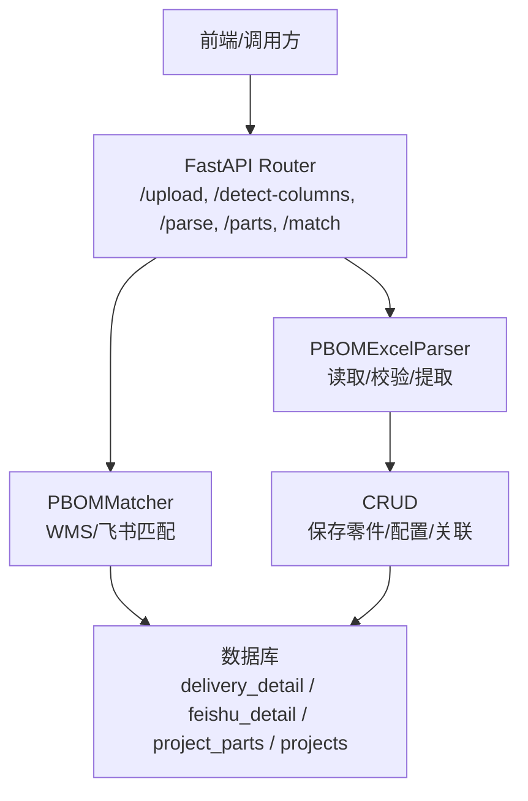
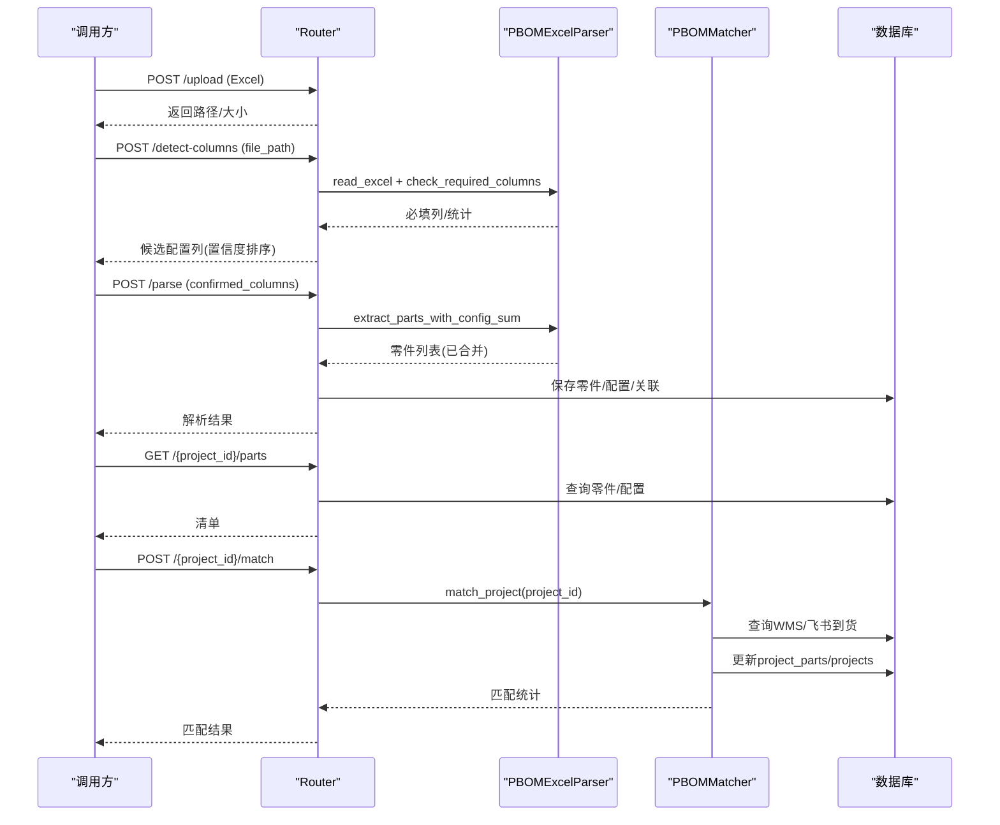
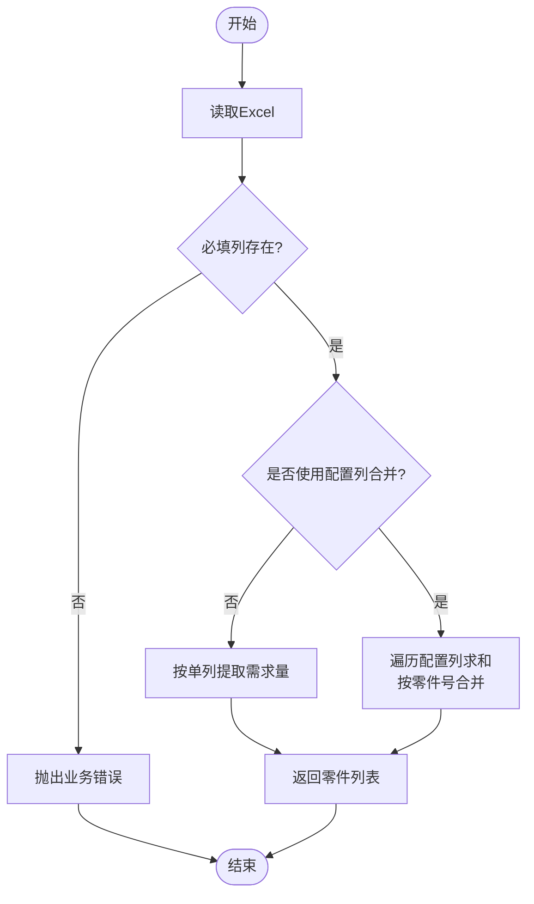
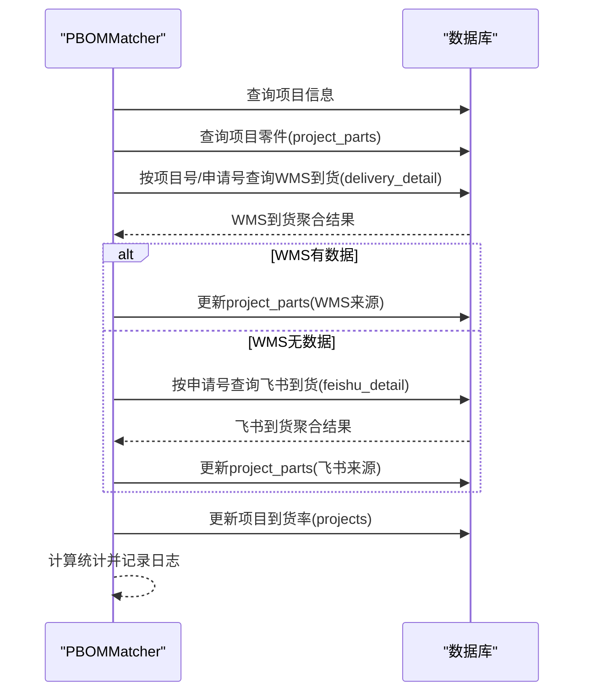
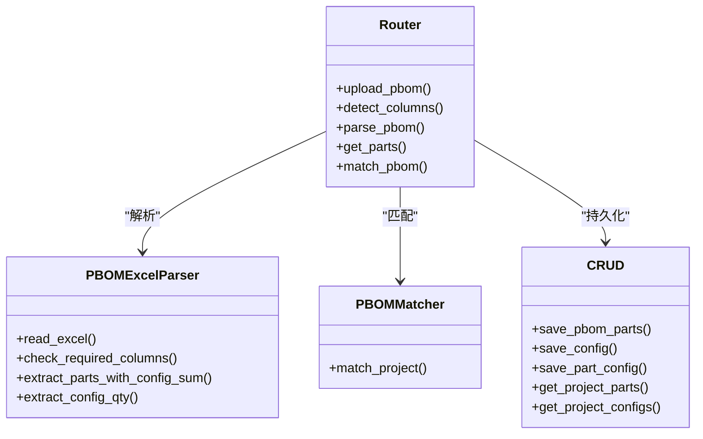
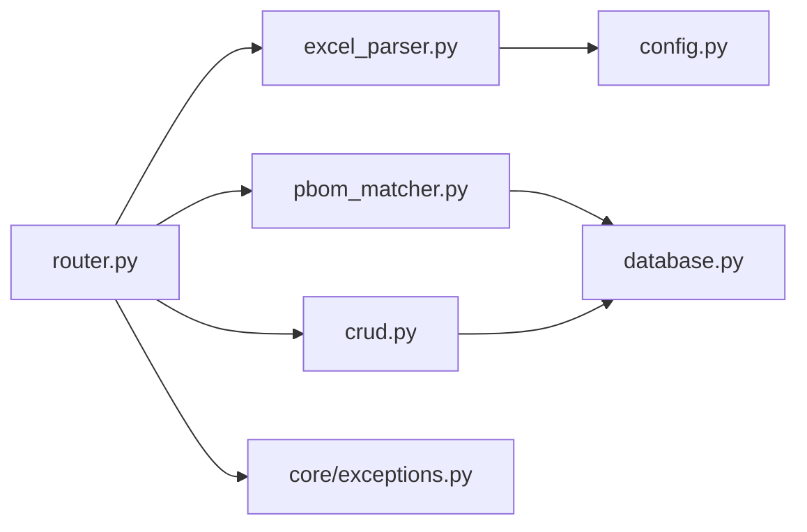

# PBOM解析模块

<cite>
**本文引用的文件**
- [excel_parser.py](file://backend/pbom/excel_parser.py)
- [pbom_matcher.py](file://backend/pbom/pbom_matcher.py)
- [router.py](file://backend/pbom/router.py)
- [schemas.py](file://backend/pbom/schemas.py)
- [crud.py](file://backend/pbom/crud.py)
- [config.py](file://backend/config.py)
- [database.py](file://backend/database.py)
- [exceptions.py](file://backend/core/exceptions.py)
- [init_db.py](file://backend/scripts/init_db.py)
</cite>

## 目录
1. [简介](#简介)
2. [项目结构](#项目结构)
3. [核心组件](#核心组件)
4. [架构总览](#架构总览)
5. [详细组件分析](#详细组件分析)
6. [依赖关系分析](#依赖关系分析)
7. [性能考虑](#性能考虑)
8. [故障排除指南](#故障排除指南)
9. [结论](#结论)
10. [附录：API接口规范与调用示例](#附录api接口规范与调用示例)

## 简介
本模块为试制资源数智化管理系统的PBOM（产品BOM）解析与匹配能力，聚焦于试制阶段的物料需求与到货协同。其核心价值在于：
- 将Excel格式的PBOM自动识别、清洗并入库，支撑多配置车型的需求合并与统计。
- 基于零件号与试制单号，将PBOM与WMS到货数据及飞书共享表数据进行匹配，计算到货率与缺料情况。
- 提供上传、列头检测、解析入库、匹配执行等完整API，便于前端或外部系统集成。

## 项目结构
PBOM模块位于 backend/pbom 目录下，主要包含：
- Excel解析器：负责读取、校验、提取与合并配置列需求量。
- 匹配器：按项目维度从WMS和飞书数据中汇总到货数量，更新项目零件与统计。
- API路由：暴露上传、列头检测、解析入库、获取清单、执行匹配等接口。
- 数据模型：Pydantic请求/响应结构定义。
- 数据库操作：对project_parts、configs、part_configs等表的读写封装。

图表来源
- [router.py:23-166](file://backend/pbom/router.py#L23-L166)
- [excel_parser.py:14-203](file://backend/pbom/excel_parser.py#L14-L203)
- [pbom_matcher.py:18-240](file://backend/pbom/pbom_matcher.py#L18-L240)
- [crud.py:10-91](file://backend/pbom/crud.py#L10-L91)

章节来源
- [router.py:23-166](file://backend/pbom/router.py#L23-L166)
- [excel_parser.py:14-203](file://backend/pbom/excel_parser.py#L14-L203)
- [pbom_matcher.py:18-240](file://backend/pbom/pbom_matcher.py#L18-L240)
- [crud.py:10-91](file://backend/pbom/crud.py#L10-L91)

## 核心组件
- PBOMExcelParser：支持.xlsx/.xls读取、必填列识别、列统计、基础提取与配置列求和合并。
- PBOMMatcher：按项目执行“WMS优先，未匹配再查飞书”的匹配策略，汇总到货并更新统计。
- Router：提供REST接口，串联上传、检测、解析、查询、匹配流程。
- CRUD：封装project_parts、configs、part_configs等表的增删改查。
- Schemas：统一API输入输出结构。
- Database/Config：连接池、环境变量与上传目录管理。

章节来源
- [excel_parser.py:14-203](file://backend/pbom/excel_parser.py#L14-L203)
- [pbom_matcher.py:18-240](file://backend/pbom/pbom_matcher.py#L18-L240)
- [router.py:23-166](file://backend/pbom/router.py#L23-L166)
- [crud.py:10-91](file://backend/pbom/crud.py#L10-L91)
- [schemas.py:1-48](file://backend/pbom/schemas.py#L1-L48)
- [database.py:1-116](file://backend/database.py#L1-L116)
- [config.py:48-102](file://backend/config.py#L48-L102)

## 架构总览
PBOM解析与匹配的整体流程如下：
- 上传阶段：接收Excel文件，校验扩展名，分块写入到配置的上传目录。
- 列头检测：读取表头，识别必填列（零件号、零件名称），可选列（需求量）；通过统计信息辅助判断配置列候选。
- 解析入库：根据用户确认的配置列，合并同行数值作为需求量，去重合并相同零件号后入库，并建立配置与零件的关联。
- 匹配执行：按项目从WMS到货明细聚合到货量，若未匹配则尝试飞书共享表；更新project_parts与项目到货率。

图表来源
- [router.py:23-166](file://backend/pbom/router.py#L23-L166)
- [excel_parser.py:24-187](file://backend/pbom/excel_parser.py#L24-L187)
- [pbom_matcher.py:21-240](file://backend/pbom/pbom_matcher.py#L21-L240)
- [crud.py:10-91](file://backend/pbom/crud.py#L10-L91)

## 详细组件分析

### Excel解析器（PBOMExcelParser）
- 文件格式处理：
  - 支持.xlsx（openpyxl引擎）与.xls（xlrd引擎）。
  - 读取失败时记录日志并抛出异常。
- 列头识别：
  - 必填列：零件号、零件名称（缺失会报错）；需求量列为可选，缺失时默认0。
  - 关键字匹配规则覆盖常见中文/英文列名变体。
- 数据提取：
  - 基础提取：按单一需求量列提取，空值转0，跳过无零件号的行。
  - 配置列合并：对多个配置列同行数值求和，并按零件号去重合并，提升多车型场景下的需求汇总准确性。
  - 配置列粒度提取：按配置列生成“零件号→需求量”映射，用于后续持久化关联。
- 列统计：
  - 非空计数、非空比例、数值范围与均值，辅助前端展示与置信度评估。

图表来源
- [excel_parser.py:24-187](file://backend/pbom/excel_parser.py#L24-L187)

章节来源
- [excel_parser.py:14-203](file://backend/pbom/excel_parser.py#L14-L203)

### 匹配器（PBOMMatcher）
- 匹配策略：
  - 第一步：从WMS到货明细（delivery_detail）按项目号与试制申请号聚合到货量，取最新状态信息。
  - 第二步：若WMS未匹配到，则按试制申请号在飞书共享表（feishu_detail）中查找并汇总。
  - 第三步：逐零件更新project_parts的到货量、来源、仓库、专业负责人、短缺备注等字段。
- 统计更新：
  - 计算项目级到货率（匹配到的零件数/总零件数），回写projects表。
  - 同时触发项目统计刷新（get_project_stats）。
- 容错与日志：
  - WMS无数据时记录警告；飞书无数据时记录信息；最终输出匹配摘要。

图表来源
- [pbom_matcher.py:21-240](file://backend/pbom/pbom_matcher.py#L21-L240)

章节来源
- [pbom_matcher.py:18-240](file://backend/pbom/pbom_matcher.py#L18-L240)

### API路由（router）
- 上传接口：限制仅xlsx/xls，分块写入，返回文件路径与大小。
- 列头检测：读取Excel，检查必填列，返回候选配置列（含置信度），供前端确认。
- 解析接口：依据用户确认的配置列进行合并提取，保存零件、配置与关联，返回统计。
- 查询接口：获取项目零件清单与配置列表。
- 匹配接口：执行匹配并返回统计结果。

图表来源
- [router.py:23-166](file://backend/pbom/router.py#L23-L166)
- [excel_parser.py:14-203](file://backend/pbom/excel_parser.py#L14-L203)
- [pbom_matcher.py:18-240](file://backend/pbom/pbom_matcher.py#L18-L240)
- [crud.py:10-91](file://backend/pbom/crud.py#L10-L91)

章节来源
- [router.py:23-166](file://backend/pbom/router.py#L23-L166)

### 数据模型（schemas）
- UploadResponse：上传响应结构。
- ColumnCandidate/DetectColumnsResponse：列检测候选项与响应结构。
- ParseResult：解析结果结构。
- MatchRequest/MatchResult：匹配请求与结果结构。

章节来源
- [schemas.py:1-48](file://backend/pbom/schemas.py#L1-L48)

### 数据库操作（crud）
- 保存零件：先清空项目下历史数据，再批量插入project_parts。
- 保存配置与关联：写入configs与part_configs，建立配置与零件的多对多关系。
- 查询：提供项目零件、配置、到货记录的查询方法。
- 更新：支持更新零件到货数量。

章节来源
- [crud.py:10-91](file://backend/pbom/crud.py#L10-L91)

## 依赖关系分析
- 外部依赖：
  - pandas/openpyxl/xlrd：Excel读取与数据处理。
  - pymysql/dbutils：MySQL连接池与查询执行。
- 内部依赖：
  - config：读取环境变量（数据库、上传目录等）。
  - database：统一的查询/执行封装。
  - logger：日志记录。
  - core.exceptions：业务异常类型。

图表来源
- [router.py:23-166](file://backend/pbom/router.py#L23-L166)
- [excel_parser.py:14-203](file://backend/pbom/excel_parser.py#L14-L203)
- [pbom_matcher.py:18-240](file://backend/pbom/pbom_matcher.py#L18-L240)
- [crud.py:10-91](file://backend/pbom/crud.py#L10-L91)
- [database.py:1-116](file://backend/database.py#L1-L116)
- [config.py:48-102](file://backend/config.py#L48-L102)
- [exceptions.py:1-8](file://backend/core/exceptions.py#L1-L8)

章节来源
- [database.py:1-116](file://backend/database.py#L1-L116)
- [config.py:48-102](file://backend/config.py#L48-L102)
- [exceptions.py:1-8](file://backend/core/exceptions.py#L1-L8)

## 性能考虑
- 文件上传：采用分块写入，避免大文件一次性加载导致内存峰值。
- Excel解析：
  - 使用pandas高效读取与迭代；配置列合并使用有序字典减少重复键开销。
  - 对数值列进行coerce转换，避免异常中断。
- 数据库访问：
  - 使用连接池减少连接创建开销。
  - 解析前清空历史数据，避免脏数据累积。
  - 匹配阶段按项目过滤条件查询，减少全表扫描。
- 可扩展点：
  - 可引入批量插入（executemany）进一步提升入库性能。
  - 对大文件可考虑流式解析或分页处理。

[本节为通用性能建议，不直接分析具体代码文件]

## 故障排除指南
- 上传失败：
  - 检查文件扩展名是否为xlsx/xls。
  - 检查上传目录是否存在且可写（由配置UPLOAD_DIR控制）。
- 列头检测失败：
  - 确保表格包含必填列（零件号、零件名称）。
  - 若缺少需求量列，系统将提示并默认需求量为0。
- 解析失败：
  - 确认用户已确认配置列；若无有效配置列或未提取到零件，将返回业务错误。
- 匹配失败：
  - 检查项目是否存在PBOM零件数据。
  - 检查WMS与飞书数据是否按项目号/试制申请号正确关联。
  - 查看日志中的警告与信息，定位数据来源问题。
- 数据库连接失败：
  - 检查.env中DB_HOST/DB_PORT/DB_USER/DB_PASSWORD/DB_DATABASE是否正确。
  - 连接池初始化失败时会记录详细错误信息。

章节来源
- [router.py:23-166](file://backend/pbom/router.py#L23-L166)
- [excel_parser.py:24-100](file://backend/pbom/excel_parser.py#L24-L100)
- [pbom_matcher.py:21-80](file://backend/pbom/pbom_matcher.py#L21-L80)
- [database.py:12-43](file://backend/database.py#L12-L43)
- [config.py:48-102](file://backend/config.py#L48-L102)

## 结论
PBOM解析模块以“上传—检测—解析—匹配”为主线，实现了试制阶段BOM数据的自动化处理与到货协同。通过灵活的列头识别与配置列合并机制，适配多车型、多配置场景；通过WMS优先、飞书兜底的匹配策略，保障到货统计的准确性与完整性。结合清晰的API与健壮的错误处理，便于前后端集成与持续扩展。

[本节为总结性内容，不直接分析具体代码文件]

## 附录：API接口规范与调用示例

- 上传PBOM Excel
  - 方法：POST
  - 路径：/pbom/upload
  - 请求：multipart/form-data，字段file
  - 响应：filename、size、path、message
  - 说明：仅支持.xlsx/.xls；文件保存在配置的上传目录

- 检测配置列
  - 方法：POST
  - 路径：/pbom/detect-columns
  - 请求参数：file_path（字符串）
  - 响应：need_confirm、candidates（column、confidence、stats、is_numeric）
  - 说明：返回候选配置列并按置信度排序，低于阈值需人工确认

- 解析PBOM并入库
  - 方法：POST
  - 路径：/pbom/parse
  - 请求体：project_id、file_path、confirmed_columns、display_names（可选）
  - 响应：ParseResult（project_id、parts_count、config_count、message）
  - 说明：按确认的配置列合并需求量，保存零件、配置与关联

- 获取项目零件清单
  - 方法：GET
  - 路径：/pbom/{project_id}/parts
  - 响应：project_id、parts、configs

- 执行PBOM匹配
  - 方法：POST
  - 路径：/pbom/{project_id}/match
  - 响应：MatchResult（project_id、parts_matched、delivery_rate、total_demand、total_received、missing_parts）
  - 说明：按WMS优先、飞书兜底策略汇总到货并更新统计

章节来源
- [router.py:23-166](file://backend/pbom/router.py#L23-L166)
- [schemas.py:1-48](file://backend/pbom/schemas.py#L1-L48)

## 附录：配置文件说明与自定义规则扩展

- 环境变量（.env）关键项
  - DB_HOST、DB_PORT、DB_USER、DB_PASSWORD、DB_DATABASE：数据库连接配置
  - UPLOAD_DIR：上传目录路径
  - SERVER_HOST、SERVER_PORT、DEBUG、CORS_ORIGINS：服务运行配置
  - FEISHU_APP_ID、FEISHU_APP_SECRET、FEISHU_SHEET_URL：飞书相关配置（预留）
  - DEEPSEEK_API_KEY、DEEPSEEK_BASE_URL、DEEPSEEK_MODEL：LLM相关配置（预留）

- 列头识别规则扩展
  - 可在PBOMExcelParser的关键字列表中增加新的列名变体，以增强识别能力。
  - 可通过get_column_stats返回的统计信息辅助前端展示与置信度调整。

- 匹配规则扩展
  - 可在PBOMMatcher中扩展匹配优先级或新增数据源（如采购系统）。
  - 可调整WMS与飞书的聚合逻辑与状态选择策略。

章节来源
- [config.py:48-102](file://backend/config.py#L48-L102)
- [excel_parser.py:40-124](file://backend/pbom/excel_parser.py#L40-L124)
- [pbom_matcher.py:21-240](file://backend/pbom/pbom_matcher.py#L21-L240)

## 附录：数据库表结构与索引要点
- project_parts：存储项目零件、需求量、到货量、评分与状态等，含项目ID与零件号索引，唯一约束保证同一项目下零件号唯一。
- configs/part_configs：存储配置与零件的关联关系，支持多配置维度统计。
- delivery_detail/feishu_detail：WMS与飞书到货明细，按项目号/申请号关联。

章节来源
- [init_db.py:40-63](file://backend/scripts/init_db.py#L40-L63)