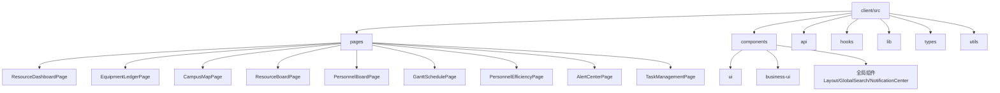
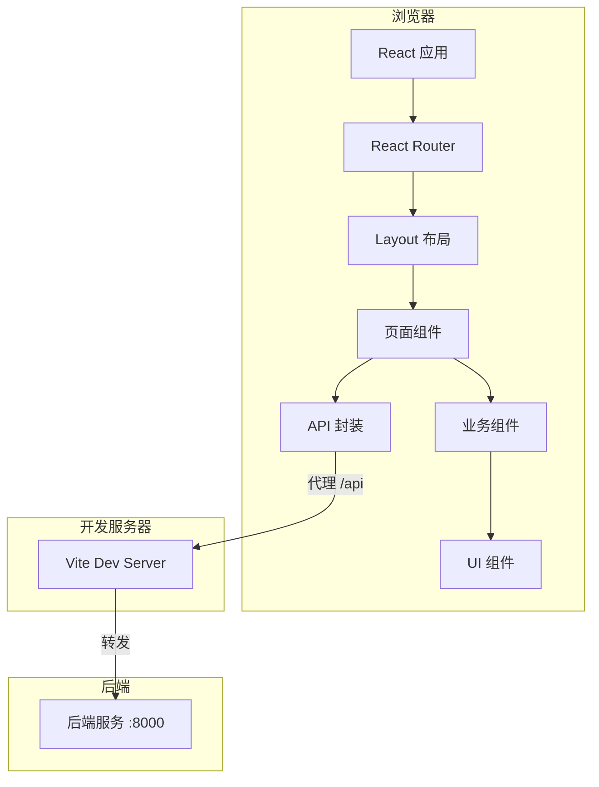
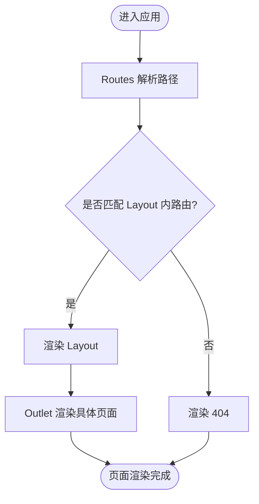
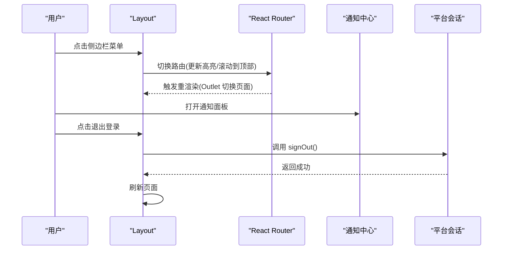
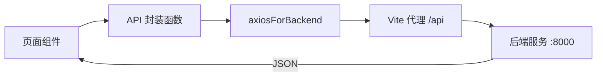
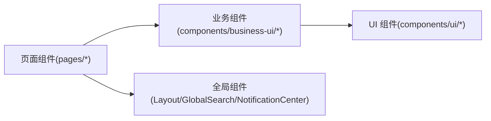
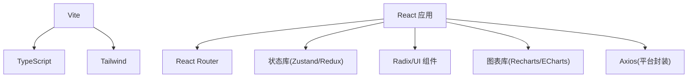

# 前端架构设计

<cite>
**本文引用的文件**
- [package.json](file://webui_ref/package.json)
- [vite.config.ts](file://webui_ref/vite.config.ts)
- [tsconfig.app.json](file://webui_ref/tsconfig.app.json)
- [tailwind.config.ts](file://webui_ref/tailwind.config.ts)
- [index.tsx](file://webui_ref/client/src/index.tsx)
- [app.tsx](file://webui_ref/client/src/app.tsx)
- [Layout.tsx](file://webui_ref/client/src/components/Layout.tsx)
- [api/index.ts](file://webui_ref/client/src/api/index.ts)
</cite>

## 目录
1. [简介](#简介)
2. [项目结构](#项目结构)
3. [核心组件](#核心组件)
4. [架构总览](#架构总览)
5. [详细组件分析](#详细组件分析)
6. [依赖分析](#依赖分析)
7. [性能考虑](#性能考虑)
8. [故障排查指南](#故障排查指南)
9. [结论](#结论)
10. [附录](#附录)

## 简介
本文件面向“试制资源数智化管理系统”的前端架构设计，基于 React + TypeScript 技术栈，采用 Vite 构建工具、React Router 路由管理、以及企业级 UI 与状态生态。文档重点说明：
- 技术选型与工程化配置（Vite、TypeScript、Tailwind）
- 路由与页面组织（含 Layout 布局模式）
- 组件分层（页面组件、业务组件、UI 组件）
- API 封装与数据流策略
- 开发环境与构建优化
- 代码组织规范与最佳实践

## 项目结构
前端位于 webui_ref/client/src，采用按功能域划分的目录结构：
- pages：页面级组件，每个模块一个目录，包含独立页面与子区块
- components：可复用组件，分为 ui（基础 UI）、business-ui（业务复合组件）、以及全局组件（如 Layout、GlobalSearch、NotificationCenter）
- api：接口封装层，统一使用后端代理的 axios 实例发起请求
- hooks：自定义 Hook
- lib：通用工具与库
- types：类型定义
- utils：工具函数与资源

**章节来源**
- [index.tsx:1-37](file://webui_ref/client/src/index.tsx#L1-L37)
- [app.tsx:1-56](file://webui_ref/client/src/app.tsx#L1-L56)
- [Layout.tsx:1-399](file://webui_ref/client/src/components/Layout.tsx#L1-L399)

## 核心组件
- 应用入口与错误边界：在 index.tsx 中通过 createRoot 挂载应用，使用 ErrorBoundary 包裹路由，提供统一的错误渲染与恢复能力；同时注入 Toaster 通知容器。
- 路由与布局：app.tsx 集中声明所有页面路由，并以 Layout 作为外层壳组件；Layout 提供侧边栏导航、面包屑、用户信息、全局搜索与通知中心。
- 导航与分组：Layout 将“主菜单”和“试制资源模块”分两组展示，支持折叠与高亮当前路由。
- 主题与样式：通过 Tailwind 预设与自定义主题 CSS，实现浅色/深色主题与品牌色。

**章节来源**
- [index.tsx:1-37](file://webui_ref/client/src/index.tsx#L1-L37)
- [app.tsx:1-56](file://webui_ref/client/src/app.tsx#L1-L56)
- [Layout.tsx:1-399](file://webui_ref/client/src/components/Layout.tsx#L1-L399)

## 架构总览
整体采用“单页应用 + 模块化路由 + 组件分层 + 统一 API 封装”的架构。Vite 负责开发与构建，React Router 负责路由，Layout 提供一致的页面外壳，页面组件组合业务与 UI 组件完成交互，API 层统一封装网络请求。

**图表来源**
- [vite.config.ts:1-20](file://webui_ref/vite.config.ts#L1-L20)
- [index.tsx:1-37](file://webui_ref/client/src/index.tsx#L1-L37)
- [app.tsx:1-56](file://webui_ref/client/src/app.tsx#L1-L56)
- [Layout.tsx:1-399](file://webui_ref/client/src/components/Layout.tsx#L1-L399)
- [api/index.ts:1-20](file://webui_ref/client/src/api/index.ts#L1-L20)

## 详细组件分析

### 路由与页面组织
- 路由入口：app.tsx 使用 Routes/Routes 注册所有页面路由，并通过 element={<Layout />} 为所有页面提供统一外壳。
- 页面分组：
  - 项目相关：首页、项目详情、待检明细、不合格待判定、装配计划、全部零件、审计日志、系统设置等
  - 试制资源模块：综合驾驶舱、设备台账、园区地图、资源占用、人员看板、甘特排程、人效分析、异常预警、任务管理等
- 404 兜底：未匹配路由指向 NotFound 页面

**图表来源**
- [app.tsx:1-56](file://webui_ref/client/src/app.tsx#L1-L56)

**章节来源**
- [app.tsx:1-56](file://webui_ref/client/src/app.tsx#L1-L56)

### Layout 布局组件
- 侧边栏：使用 SidebarProvider/Sidebar 实现可折叠导航，包含“主菜单”和“试制资源”两个分组，支持 active 高亮与图标展示。
- 顶部栏：包含面包屑、全局搜索按钮、通知中心、用户信息。
- 面包屑：根据当前路由动态生成，支持项目详情页与试制资源模块的多级显示。
- 用户操作：集成登出逻辑，调用平台会话接口并刷新页面。
- 主题适配：通过 Tailwind 预设与自定义样式，支持浅色/深色主题与品牌强调色。

**图表来源**
- [Layout.tsx:1-399](file://webui_ref/client/src/components/Layout.tsx#L1-L399)

**章节来源**
- [Layout.tsx:1-399](file://webui_ref/client/src/components/Layout.tsx#L1-L399)

### API 接口封装与数据流
- 统一实例：使用平台提供的 axios 实例进行后端通信，便于统一拦截、鉴权与日志记录。
- 封装方式：在 api/index.ts 中按模块导出函数，遵循“函数即接口”的模式，便于测试与复用。
- 数据流：页面组件通过 API 层获取数据，结合本地状态或状态管理库（如 Zustand/Redux Toolkit）驱动 UI 更新；异步请求可通过 React Query 等方案进行缓存与重试（项目已引入相关依赖）。

**图表来源**
- [api/index.ts:1-20](file://webui_ref/client/src/api/index.ts#L1-L20)
- [vite.config.ts:1-20](file://webui_ref/vite.config.ts#L1-L20)

**章节来源**
- [api/index.ts:1-20](file://webui_ref/client/src/api/index.ts#L1-L20)
- [vite.config.ts:1-20](file://webui_ref/vite.config.ts#L1-L20)

### 组件分层与复用策略
- UI 组件：基础原子组件（按钮、输入、表格、弹窗等），位于 components/ui，关注样式与交互细节。
- 业务组件：面向领域场景的组合型组件（如选择器、表单控件、编辑器等），位于 components/business-ui，封装复杂交互与数据绑定。
- 页面组件：位于 pages，聚合业务组件与 UI 组件，承载路由与页面级状态。
- 全局组件：如 Layout、GlobalSearch、NotificationCenter，提供跨页面一致体验。

[本节为概念性说明，不直接引用具体文件]

## 依赖分析
- 构建与开发：Vite、TypeScript、PostCSS/Tailwind
- 运行时：React、React Router DOM
- 状态与数据：Zustand、Redux Toolkit、React Query（已引入）
- UI 与交互：Radix UI、Headless UI、Lucide 图标、Recharts/ECharts
- 工具与质量：ESLint、Stylelint、Prettier、Jest

**图表来源**
- [package.json:1-211](file://webui_ref/package.json#L1-L211)
- [vite.config.ts:1-20](file://webui_ref/vite.config.ts#L1-L20)
- [tailwind.config.ts:1-9](file://webui_ref/tailwind.config.ts#L1-L9)

**章节来源**
- [package.json:1-211](file://webui_ref/package.json#L1-L211)
- [vite.config.ts:1-20](file://webui_ref/vite.config.ts#L1-L20)
- [tailwind.config.ts:1-9](file://webui_ref/tailwind.config.ts#L1-L9)

## 性能考虑
- 构建优化
  - 使用 Vite 快速冷启动与增量编译
  - 按需引入 UI 组件与图标，减少包体积
  - 开启 Tree-shaking 与生产压缩
- 运行时优化
  - 路由懒加载：对大页面可按需拆分（可在现有路由基础上扩展）
  - 列表虚拟化：大数据表格建议使用虚拟滚动
  - 图表按需渲染：仅在可见时初始化图表实例
  - 图片与静态资源：使用 CDN 与合适的缓存策略
- 网络优化
  - 统一 API 封装增加重试与超时控制
  - 合理使用缓存（React Query/Zustand）减少重复请求
  - 合并请求与分页拉取

[本节为通用建议，不直接引用具体文件]

## 故障排查指南
- 应用启动失败
  - 检查 Node 版本与依赖安装是否完整
  - 确认端口未被占用（默认 5173）
- 路由不生效
  - 检查 BrowserRouter basename 配置是否正确
  - 核对 app.tsx 中的路由路径与 Layout 嵌套关系
- 页面空白或报错
  - 使用 ErrorBoundary 捕获的错误信息进行定位
  - 检查页面组件是否存在循环依赖或未定义的变量
- 网络请求失败
  - 确认 Vite 代理配置与后端地址可达
  - 查看 API 封装层的错误日志与响应码
- 样式错乱
  - 检查 Tailwind 内容路径是否覆盖到新增文件
  - 清理缓存后重新构建

**章节来源**
- [index.tsx:1-37](file://webui_ref/client/src/index.tsx#L1-L37)
- [vite.config.ts:1-20](file://webui_ref/vite.config.ts#L1-L20)
- [tailwind.config.ts:1-9](file://webui_ref/tailwind.config.ts#L1-L9)

## 结论
本项目采用 React + TypeScript + Vite 的现代前端架构，以 React Router 进行路由管理，Layout 提供统一外壳，组件分层清晰，API 封装统一。通过 Tailwind 与 Radix UI 构建高质量界面，借助状态管理与图表库支撑复杂业务场景。建议在后续迭代中继续完善路由懒加载、数据缓存与性能监控，持续提升用户体验与可维护性。

[本节为总结性内容，不直接引用具体文件]

## 附录

### 开发环境配置
- 开发服务器
  - 端口：5173
  - 代理：/api → http://localhost:8000
- 路径别名
  - @ → client/src
- TypeScript
  - 启用严格模式与增量编译
  - 路径映射：@client/*、@shared/*、@/*

**章节来源**
- [vite.config.ts:1-20](file://webui_ref/vite.config.ts#L1-L20)
- [tsconfig.app.json:1-24](file://webui_ref/tsconfig.app.json#L1-L24)

### 构建与发布
- 构建命令
  - 客户端构建：vite build
  - 服务端构建：nest build
- 产物输出
  - 由 Vite 生成静态资源，供后端或静态托管服务部署

**章节来源**
- [package.json:1-211](file://webui_ref/package.json#L1-L211)

### 代码组织规范与最佳实践
- 目录组织
  - 页面按功能域划分，每个页面独立目录
  - 组件按层级划分：ui、business-ui、全局组件
  - API 按模块划分，函数式导出
- 命名约定
  - 组件 PascalCase，文件与文件夹语义化命名
  - 常量 UPPER_SNAKE_CASE，变量 camelCase
- 类型优先
  - 使用 TypeScript 定义接口与类型，避免 any
- 可访问性与主题
  - 遵循无障碍规范，支持键盘操作
  - 通过 Tailwind 预设与主题变量保持一致视觉风格

[本节为通用规范，不直接引用具体文件]