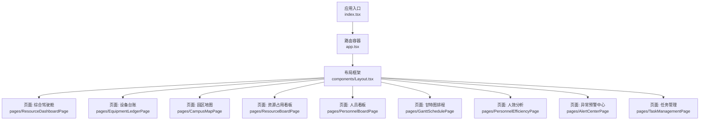
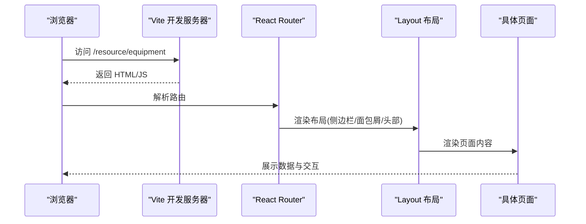
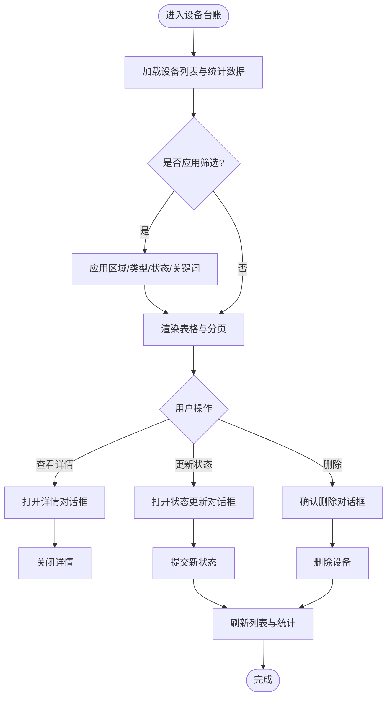
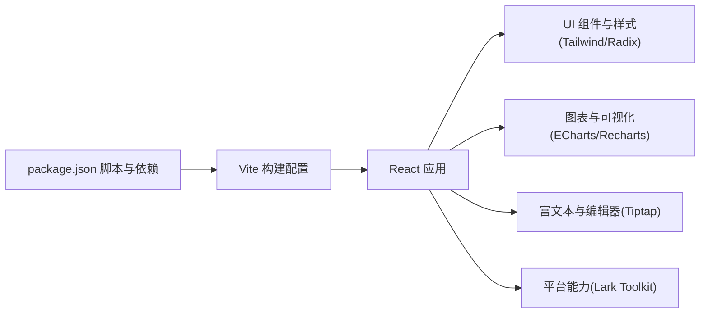

# 前端界面

<cite>
**本文引用的文件**
- [index.tsx](file://webui_ref/client/src/index.tsx)
- [app.tsx](file://webui_ref/client/src/app.tsx)
- [Layout.tsx](file://webui_ref/client/src/components/Layout.tsx)
- [vite.config.ts](file://webui_ref/vite.config.ts)
- [tailwind.config.ts](file://webui_ref/tailwind.config.ts)
- [package.json](file://webui_ref/package.json)
- [EquipmentLedgerPage.tsx](file://webui_ref/client/src/pages/EquipmentLedgerPage/EquipmentLedgerPage.tsx)
- [ResourceDashboardPage.tsx](file://webui_ref/client/src/pages/ResourceDashboardPage/ResourceDashboardPage.tsx)
- [CampusMapPage.tsx](file://webui_ref/client/src/pages/CampusMapPage/CampusMapPage.tsx)
- [ResourceBoardPage.tsx](file://webui_ref/client/src/pages/ResourceBoardPage/ResourceBoardPage.tsx)
- [PersonnelBoardPage.tsx](file://webui_ref/client/src/pages/PersonnelBoardPage/PersonnelBoardPage.tsx)
- [GanttSchedulePage.tsx](file://webui_ref/client/src/pages/GanttSchedulePage/GanttSchedulePage.tsx)
- [PersonnelEfficiencyPage.tsx](file://webui_ref/client/src/pages/PersonnelEfficiencyPage/PersonnelEfficiencyPage.tsx)
- [AlertCenterPage.tsx](file://webui_ref/client/src/pages/AlertCenterPage/AlertCenterPage.tsx)
- [TaskManagementPage.tsx](file://webui_ref/client/src/pages/TaskManagementPage/TaskManagementPage.tsx)
</cite>

## 目录
1. [简介](#简介)
2. [项目结构](#项目结构)
3. [核心组件](#核心组件)
4. [架构总览](#架构总览)
5. [详细组件分析](#详细组件分析)
6. [依赖关系分析](#依赖关系分析)
7. [性能考虑](#性能考虑)
8. [故障排查指南](#故障排查指南)
9. [结论](#结论)
10. [附录](#附录)

## 简介
本文件面向“试制资源数智化管理系统”的前端界面，基于 React + TypeScript 技术栈，围绕组件化开发、状态管理、路由配置与 UI 主题进行系统化说明。文档覆盖 9 大功能模块的界面设计与交互逻辑：综合驾驶舱、设备台账、园区地图、资源占用看板、人员看板、甘特图排程、人效分析、异常预警中心、任务管理。同时提供构建部署、生产环境配置、样式主题定制、响应式实现、开发调试技巧与性能优化建议。

## 项目结构
前端工程位于 webui_ref/client 目录，采用 Vite 构建、React Router 路由、Tailwind CSS 样式体系，并通过 Lark 全栈预设工具链集成。入口文件负责应用初始化、错误边界、全局通知与路由容器；路由集中注册各页面；布局组件提供侧边导航、面包屑、用户信息与全局搜索；业务页面按模块拆分到 pages 目录。

图表来源
- [index.tsx:1-37](file://webui_ref/client/src/index.tsx#L1-L37)
- [app.tsx:1-56](file://webui_ref/client/src/app.tsx#L1-L56)
- [Layout.tsx:1-399](file://webui_ref/client/src/components/Layout.tsx#L1-L399)

章节来源
- [index.tsx:1-37](file://webui_ref/client/src/index.tsx#L1-L37)
- [app.tsx:1-56](file://webui_ref/client/src/app.tsx#L1-L56)
- [Layout.tsx:1-399](file://webui_ref/client/src/components/Layout.tsx#L1-L399)

## 核心组件
- 应用容器与错误边界：在入口文件中通过 ErrorBoundary 包裹路由，统一捕获渲染期错误并展示恢复能力；使用 AppContainer 提供主题上下文；Toaster 全局消息提示挂载于 body。
- 路由与页面注册：集中定义所有页面路由，包含“试制资源”模块下的 9 个页面路由，便于统一维护与权限扩展。
- 布局与导航：侧边栏分组展示主菜单与“试制资源”子菜单；面包屑根据当前路由动态生成；顶部栏集成全局搜索、通知中心与用户信息；支持折叠与深色模式适配。
- 样式与主题：基于 Tailwind 预设与自定义主题变量，支持明暗主题切换与品牌色（荧光绿）点缀。

章节来源
- [index.tsx:1-37](file://webui_ref/client/src/index.tsx#L1-L37)
- [app.tsx:1-56](file://webui_ref/client/src/app.tsx#L1-L56)
- [Layout.tsx:1-399](file://webui_ref/client/src/components/Layout.tsx#L1-L399)
- [tailwind.config.ts:1-9](file://webui_ref/tailwind.config.ts#L1-L9)

## 架构总览
前端采用“入口 → 路由 → 布局 → 页面”的分层结构。入口负责初始化与全局能力注入；路由负责页面级导航；布局提供统一的导航、头部与内容区；页面组件聚焦业务呈现与交互。构建与代理由 Vite 配置统一管理，开发时通过代理转发 API 请求至后端服务。

图表来源
- [vite.config.ts:1-20](file://webui_ref/vite.config.ts#L1-L20)
- [app.tsx:1-56](file://webui_ref/client/src/app.tsx#L1-L56)
- [Layout.tsx:1-399](file://webui_ref/client/src/components/Layout.tsx#L1-L399)

## 详细组件分析

### 应用入口与全局能力
- 错误边界：捕获组件渲染异常并提供重置能力，避免白屏。
- 主题与通知：AppContainer 提供主题上下文；Toaster 以 Portal 形式挂载，确保层级正确。
- 基础路径：通过环境变量控制客户端基础路径，便于多环境部署。

章节来源
- [index.tsx:1-37](file://webui_ref/client/src/index.tsx#L1-L37)

### 路由配置与页面组织
- 路由集中注册：将“试制资源”模块的 9 个页面统一挂载到 /resource/* 路径下，便于权限与菜单联动。
- 占位页面：多数页面目前为占位视图，预留标题、描述与图标，后续可替换为真实业务组件。

章节来源
- [app.tsx:1-56](file://webui_ref/client/src/app.tsx#L1-L56)
- [ResourceDashboardPage.tsx:1-16](file://webui_ref/client/src/pages/ResourceDashboardPage/ResourceDashboardPage.tsx#L1-L16)
- [CampusMapPage.tsx:1-16](file://webui_ref/client/src/pages/CampusMapPage/CampusMapPage.tsx#L1-L16)
- [ResourceBoardPage.tsx:1-16](file://webui_ref/client/src/pages/ResourceBoardPage/ResourceBoardPage.tsx#L1-L16)
- [PersonnelBoardPage.tsx:1-16](file://webui_ref/client/src/pages/PersonnelBoardPage/PersonnelBoardPage.tsx#L1-L16)
- [GanttSchedulePage.tsx:1-16](file://webui_ref/client/src/pages/GanttSchedulePage/GanttSchedulePage.tsx#L1-L16)
- [PersonnelEfficiencyPage.tsx:1-16](file://webui_ref/client/src/pages/PersonnelEfficiencyPage/PersonnelEfficiencyPage.tsx#L1-L16)
- [AlertCenterPage.tsx:1-16](file://webui_ref/client/src/pages/AlertCenterPage/AlertCenterPage.tsx#L1-L16)
- [TaskManagementPage.tsx:1-16](file://webui_ref/client/src/pages/TaskManagementPage/TaskManagementPage.tsx#L1-L16)

### 布局与导航
- 侧边栏：分组展示“主菜单”和“试制资源”两个模块，支持高亮当前项与折叠。
- 面包屑：根据路由自动推导层级，对“试制资源”模块提供二级面包屑（首页 > 试制资源 > 当前页）。
- 顶部栏：集成全局搜索、通知中心与用户信息；支持滚动到顶部等体验优化。
- 主题：内置浅色/深色样式覆盖，品牌强调色用于激活态与装饰线。

章节来源
- [Layout.tsx:1-399](file://webui_ref/client/src/components/Layout.tsx#L1-L399)

### 设备台账（已实现）
- 功能概览：设备列表分页、筛选（区域/类型/状态）、关键词搜索、统计卡片、详情弹窗、删除确认、状态更新。
- 数据流：页面调用设备相关 API 获取列表与统计，本地维护加载状态与分页参数，操作成功后刷新数据。
- 交互流程：点击行操作触发下拉菜单，选择不同动作打开对应对话框，确认后执行更新或删除并刷新。

图表来源
- [EquipmentLedgerPage.tsx:1-626](file://webui_ref/client/src/pages/EquipmentLedgerPage/EquipmentLedgerPage.tsx#L1-L626)

章节来源
- [EquipmentLedgerPage.tsx:1-626](file://webui_ref/client/src/pages/EquipmentLedgerPage/EquipmentLedgerPage.tsx#L1-L626)

### 其他页面（占位）
- 综合驾驶舱：预留全局概览仪表盘入口，后续可接入关键指标卡片与趋势图。
- 园区地图：预留车间平面图与设备位置可视化入口，可结合地图或 SVG 图层实现。
- 资源占用看板：预留实时占用率与利用率趋势入口，可接入时序图表。
- 人员看板：预留人员位置、状态、技能与工作负载入口，可结合热力图或列表。
- 甘特图排程：预留任务时间线与资源冲突检测入口，可接入甘特库。
- 人效分析：预留效率统计、工时分析与绩效报表入口，可接入多维图表。
- 异常预警中心：预留告警列表与处理入口，可接入消息推送与工单流转。
- 任务管理：预留任务 CRUD 与状态追踪入口，可接入表单与审批流。

章节来源
- [ResourceDashboardPage.tsx:1-16](file://webui_ref/client/src/pages/ResourceDashboardPage/ResourceDashboardPage.tsx#L1-L16)
- [CampusMapPage.tsx:1-16](file://webui_ref/client/src/pages/CampusMapPage/CampusMapPage.tsx#L1-L16)
- [ResourceBoardPage.tsx:1-16](file://webui_ref/client/src/pages/ResourceBoardPage/ResourceBoardPage.tsx#L1-L16)
- [PersonnelBoardPage.tsx:1-16](file://webui_ref/client/src/pages/PersonnelBoardPage/PersonnelBoardPage.tsx#L1-L16)
- [GanttSchedulePage.tsx:1-16](file://webui_ref/client/src/pages/GanttSchedulePage/GanttSchedulePage.tsx#L1-L16)
- [PersonnelEfficiencyPage.tsx:1-16](file://webui_ref/client/src/pages/PersonnelEfficiencyPage/PersonnelEfficiencyPage.tsx#L1-L16)
- [AlertCenterPage.tsx:1-16](file://webui_ref/client/src/pages/AlertCenterPage/AlertCenterPage.tsx#L1-L16)
- [TaskManagementPage.tsx:1-16](file://webui_ref/client/src/pages/TaskManagementPage/TaskManagementPage.tsx#L1-L16)

## 依赖关系分析
- 构建与开发：Vite 作为构建工具，提供别名与开发代理；TypeScript 提供类型检查；ESLint/Prettier/Stylelint 保障代码质量。
- 运行时依赖：React 生态（Router、Hooks）、UI 组件库（Radix/Tailwind）、图表库（ECharts/Recharts）、富文本（Tiptap）、动画（Framer Motion/GSAP）等。
- 平台集成：Lark 全栈预设与 Client Toolkit 提供 AppContainer、错误渲染、用户信息等能力。

图表来源
- [package.json:1-211](file://webui_ref/package.json#L1-L211)
- [vite.config.ts:1-20](file://webui_ref/vite.config.ts#L1-L20)

章节来源
- [package.json:1-211](file://webui_ref/package.json#L1-L211)
- [vite.config.ts:1-20](file://webui_ref/vite.config.ts#L1-L20)

## 性能考虑
- 路由与页面懒加载：建议对非首屏页面使用动态导入，减少初始包体积。
- 列表与表格：对大数据量表格启用虚拟滚动或分页加载，避免一次性渲染过多节点。
- 图表渲染：按需引入图表库与主题，避免全量打包；对频繁更新的数据使用增量更新策略。
- 网络请求：合理缓存与去重，必要时引入请求拦截与重试机制；开发阶段利用代理减少跨域问题。
- 样式与主题：使用 Tailwind 原子类与按需编译，减少冗余 CSS；主题变量集中管理，便于维护。

[本节为通用指导，不直接分析具体文件]

## 故障排查指南
- 启动失败：检查 Node 版本与依赖安装；确认端口未被占用；查看 Vite 代理配置是否正确指向后端。
- 路由跳转异常：确认 BrowserRouter basename 与环境变量设置；核对 app.tsx 中路由注册是否与 Layout 导航一致。
- 页面空白：检查 ErrorBoundary 是否捕获错误；查看控制台报错定位组件初始化问题。
- 样式错乱：确认 Tailwind 配置与主题变量生效；检查暗黑模式媒体查询与全局样式覆盖。
- 接口请求失败：检查代理规则与后端服务状态；在浏览器 Network 面板查看请求与响应。

章节来源
- [index.tsx:1-37](file://webui_ref/client/src/index.tsx#L1-L37)
- [vite.config.ts:1-20](file://webui_ref/vite.config.ts#L1-L20)
- [app.tsx:1-56](file://webui_ref/client/src/app.tsx#L1-L56)

## 结论
本项目前端采用清晰的层次化架构与模块化设计，路由与布局解耦，便于扩展与维护。设备台账页面已具备完整的数据加载、筛选、分页与交互闭环，其余模块预留了清晰的占位与扩展点。通过 Vite 与 Tailwind 的组合，实现了高效的开发与主题定制能力。后续可按需逐步完善各模块的业务实现，并结合图表与可视化提升数据表达效果。

[本节为总结性内容，不直接分析具体文件]

## 附录

### 9 大功能模块界面与交互要点
- 综合驾驶舱：聚合关键指标与趋势，支持钻取到明细页面。
- 设备台账：列表+筛选+统计+详情+状态更新+删除，已实现。
- 园区地图：平面布局与设备点位可视化，支持缩放与标注。
- 资源占用看板：实时占用率与利用率趋势，支持时间范围选择。
- 人员看板：人员位置、状态、技能与工作负载，支持筛选与排序。
- 甘特图排程：任务时间线、资源分配与冲突检测，支持拖拽调整。
- 人效分析：效率统计、工时分析与绩效报表，支持导出。
- 异常预警中心：告警列表、分类与处理流程，支持通知与升级。
- 任务管理：任务 CRUD、状态追踪与关联资源，支持批量操作。

[本节为概念性说明，不直接分析具体文件]

### 构建、部署与生产环境配置
- 开发环境：运行 dev 脚本启动 Vite 开发服务器，端口默认 5173，API 代理至 localhost:8000。
- 生产构建：执行 build 或 build:prod 分别构建服务端与客户端；产物由服务端静态托管。
- 环境变量：通过 CLIENT_BASE_PATH 控制前端基础路径，便于多环境部署。
- 依赖与脚本：package.json 中定义了开发、构建、测试、类型检查与格式化脚本，便于团队协作。

章节来源
- [package.json:1-211](file://webui_ref/package.json#L1-L211)
- [vite.config.ts:1-20](file://webui_ref/vite.config.ts#L1-L20)
- [index.tsx:1-37](file://webui_ref/client/src/index.tsx#L1-L37)

### 样式主题定制与响应式设计
- 主题系统：基于 Tailwind 预设与自定义变量，支持明暗主题切换；品牌强调色用于激活态与装饰。
- 响应式：布局与组件使用 Tailwind 断点与弹性布局，适配桌面与移动端；侧边栏支持折叠。
- 全局样式：通过 index.css 与 tailwind-theme.css 统一管理主题变量与排版风格。

章节来源
- [tailwind.config.ts:1-9](file://webui_ref/tailwind.config.ts#L1-L9)
- [Layout.tsx:1-399](file://webui_ref/client/src/components/Layout.tsx#L1-L399)

### 开发调试技巧
- 使用浏览器开发者工具查看网络请求与组件树，快速定位问题。
- 利用 Vite 热重载提升开发效率；在代理模式下验证前后端联调。
- 通过 ESLint/Prettier/Stylelint 保持代码规范，减少返工。

[本节为通用指导，不直接分析具体文件]