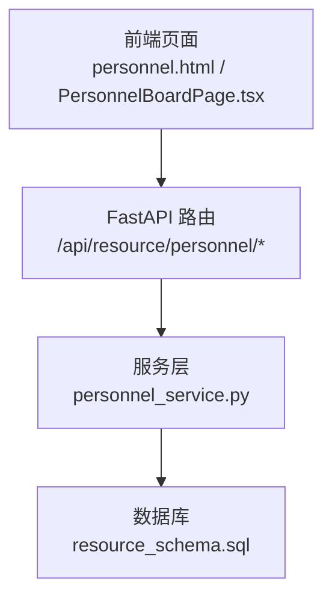
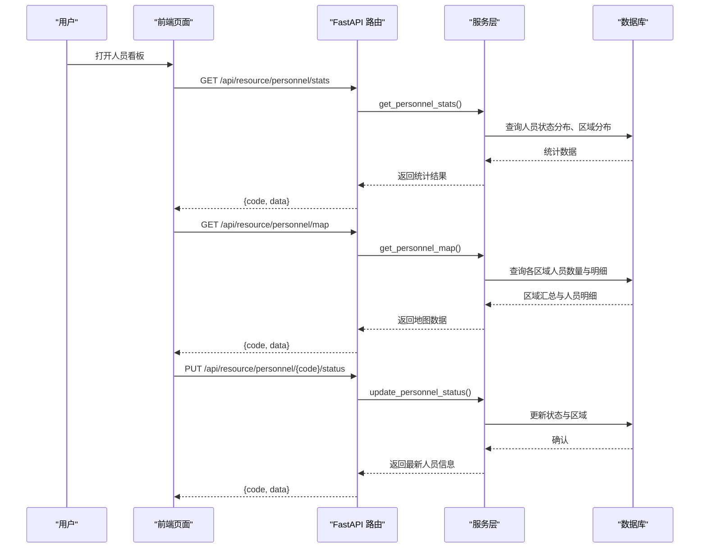
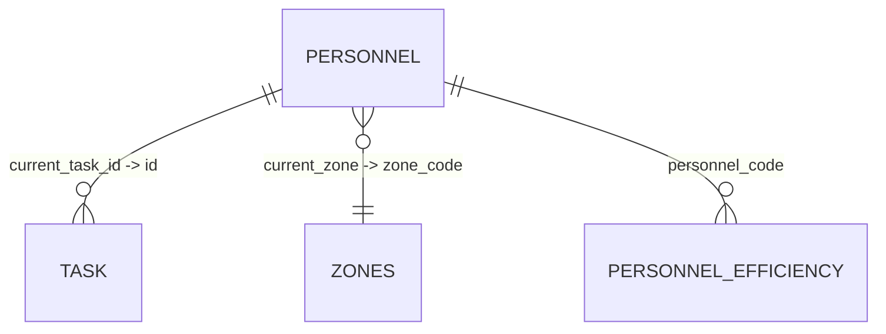
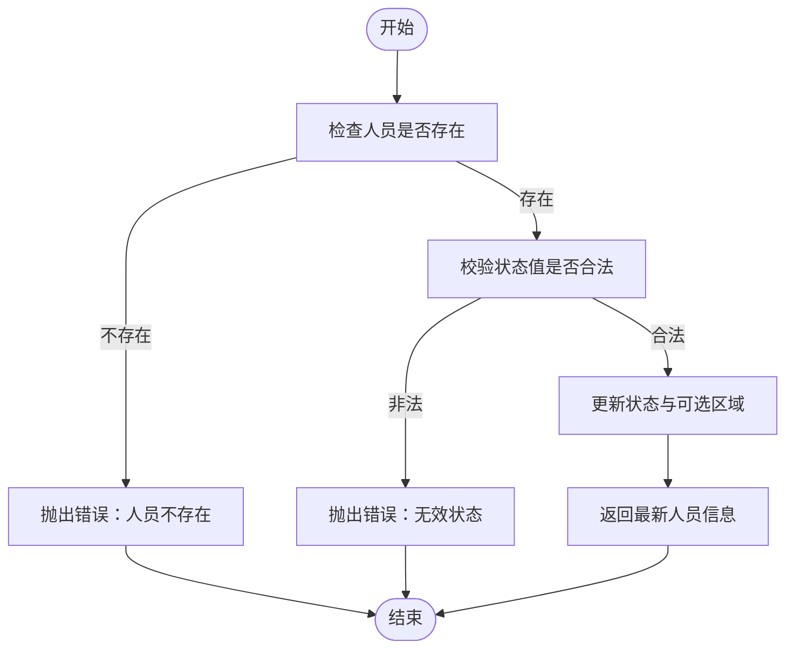
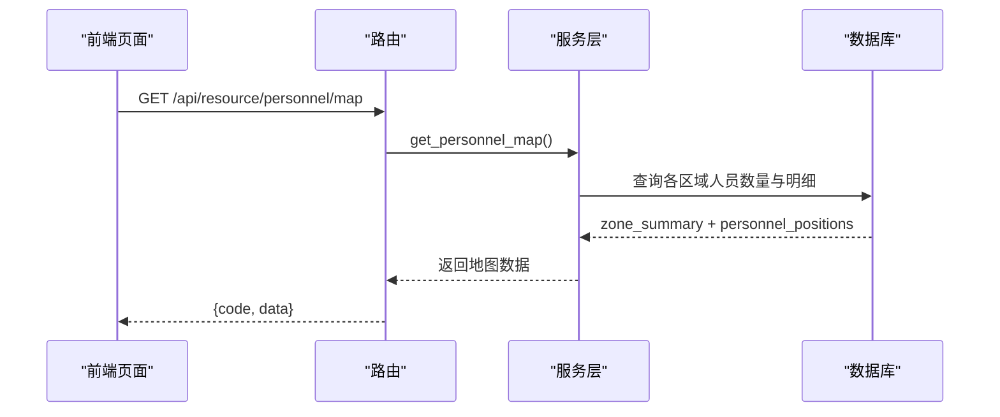
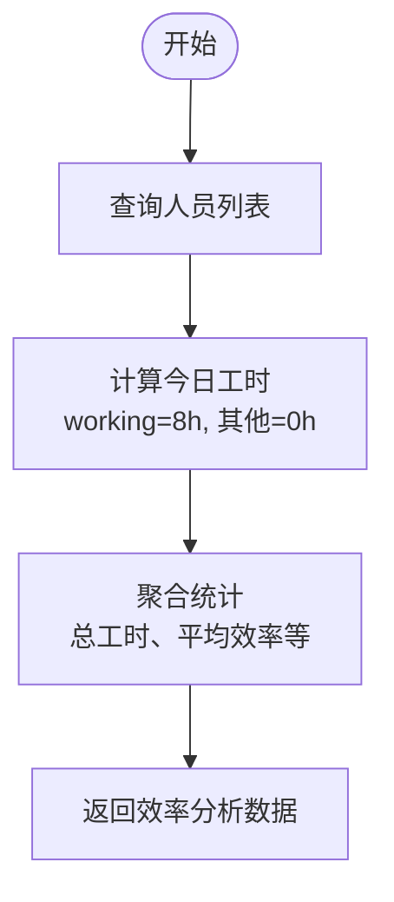
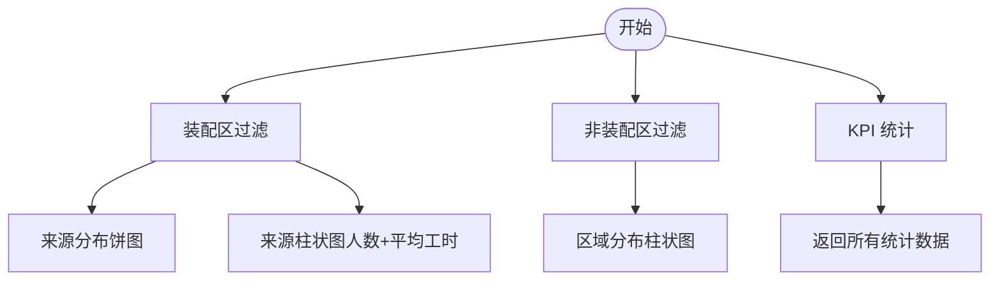
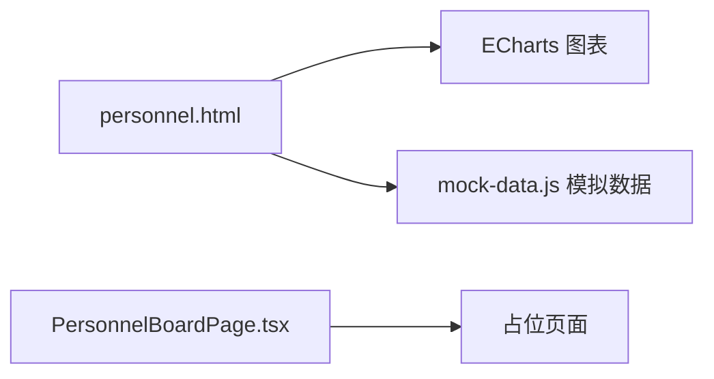
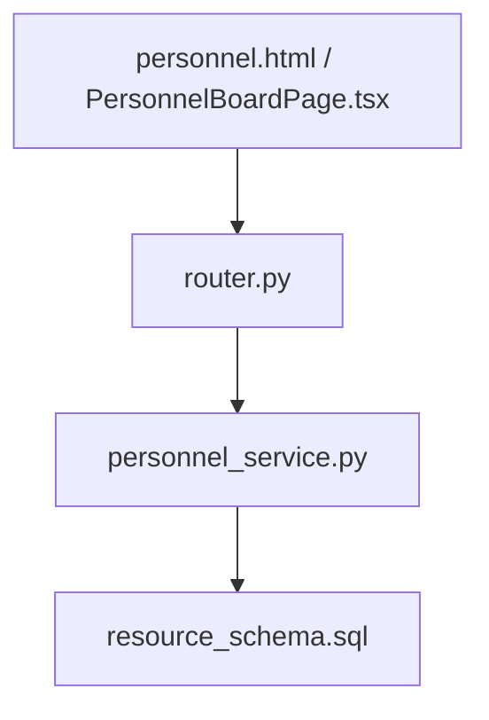

# 人员看板

<cite>
**本文引用的文件**
- [personnel_service.py](file://backend/modules/resource/services/personnel_service.py)
- [router.py](file://backend/modules/resource/router.py)
- [schemas.py](file://backend/modules/resource/schemas.py)
- [resource_schema.sql](file://backend/sql/resource_schema.sql)
- [PersonnelBoardPage.tsx](file://webui_ref/client/src/pages/PersonnelBoardPage/PersonnelBoardPage.tsx)
- [personnel.html](file://demo/personnel.html)
- [mock-data.js](file://demo/assets/js/mock-data.js)
</cite>

## 目录
1. [简介](#简介)
2. [项目结构](#项目结构)
3. [核心组件](#核心组件)
4. [架构总览](#架构总览)
5. [详细组件分析](#详细组件分析)
6. [依赖关系分析](#依赖关系分析)
7. [性能考虑](#性能考虑)
8. [故障排查指南](#故障排查指南)
9. [结论](#结论)
10. [附录](#附录)

## 简介
本模块为“人员看板”，提供人员位置跟踪、工作状态监控、来源分析与负载统计等能力。后端通过 FastAPI 暴露 REST 接口，服务层封装人员数据的查询、更新与统计逻辑；前端页面用于可视化展示人员状态分布、来源分布、地图覆盖层及效率分析图表。

## 项目结构
- 后端
  - 路由层：定义 /api/resource/personnel/* 系列接口，负责参数校验与调用服务层
  - 服务层：实现人员列表、详情、CRUD、状态切换、KPI 统计、来源分布、地图数据等
  - 数据模型：Pydantic 模型定义人员、任务、区域等数据结构
  - 数据库：MySQL/MariaDB 表结构（人员表、任务表、区域表、效率统计表等）
- 前端
  - WebUI 参考页：占位页面 PersonnelBoardPage.tsx
  - Demo 页面：完整的人员看板 HTML + ECharts 图表 + 模拟数据

**图示来源**
- [router.py:356-556](file://backend/modules/resource/router.py#L356-L556)
- [personnel_service.py:24-475](file://backend/modules/resource/services/personnel_service.py#L24-L475)
- [resource_schema.sql:47-181](file://backend/sql/resource_schema.sql#L47-L181)

**章节来源**
- [router.py:356-556](file://backend/modules/resource/router.py#L356-L556)
- [personnel_service.py:24-475](file://backend/modules/resource/services/personnel_service.py#L24-L475)
- [resource_schema.sql:47-181](file://backend/sql/resource_schema.sql#L47-L181)

## 核心组件
- 人员数据模型
  - 人员表 personnel：工号、姓名、头像文字、部门（来源）、状态、当前区域、当前任务、上班时间、更新时间等
  - 区域表 zones：区域编码、名称、类型、坐标、网格等
  - 任务表 tasks：任务编号、名称、类型、优先级、状态、计划工时、实际工时、进度等
  - 效率统计表 personnel_efficiency：按日统计人员总工时、有效工时、完成任务数、设备使用率等
- 状态管理机制
  - 状态枚举：working（工作中）、idle（空闲）、offline（离线）
  - 状态切换接口：PUT /api/resource/personnel/{personnel_code}/status
- 实时位置更新
  - 通过 current_zone 字段维护人员所在区域
  - 地图覆盖层接口：GET /api/resource/personnel/map
- 工作负载计算与统计分析
  - KPI 统计：总数、在岗、工作中、空闲、离线、异常人数等
  - 来源分布：装配区与非装配区的来源统计
  - 人效分析接口：GET /api/resource/personnel/efficiency（当前为占位实现）

**章节来源**
- [resource_schema.sql:47-181](file://backend/sql/resource_schema.sql#L47-L181)
- [personnel_service.py:325-431](file://backend/modules/resource/services/personnel_service.py#L325-L431)
- [router.py:479-578](file://backend/modules/resource/router.py#L479-L578)

## 架构总览
人员看板采用分层架构：
- 表现层：Demo 页面与 WebUI 参考页，负责交互与图表渲染
- 接口层：FastAPI 路由，统一入口与错误处理
- 业务层：服务层封装复杂查询、统计与业务规则
- 数据层：MySQL/MariaDB 存储人员、任务、区域、效率统计等

**图示来源**
- [router.py:505-556](file://backend/modules/resource/router.py#L505-L556)
- [personnel_service.py:325-475](file://backend/modules/resource/services/personnel_service.py#L325-L475)

## 详细组件分析

### 人员数据模型与数据库设计
- 人员表 personnel
  - 关键字段：personnel_code（唯一）、name、department（来源）、status（working/idle/offline）、current_zone、current_task_id、entry_time、last_update_time
  - 索引：status、current_zone、department
- 区域表 zones
  - 关键字段：zone_code（唯一）、zone_name、zone_type、position_x/y、grid_columns/rows
- 任务表 tasks
  - 关键字段：task_code（唯一）、task_name、task_type、priority、status、plan_work_hours、actual_work_hours、progress
- 效率统计表 personnel_efficiency
  - 关键字段：personnel_code、stat_date、total_work_hours、effective_work_hours、task_count、equipment_usage_rate、zone_code

**图示来源**
- [resource_schema.sql:47-181](file://backend/sql/resource_schema.sql#L47-L181)

**章节来源**
- [resource_schema.sql:47-181](file://backend/sql/resource_schema.sql#L47-L181)

### 状态管理与状态切换
- 状态枚举：working、idle、offline
- 状态切换接口：PUT /api/resource/personnel/{personnel_code}/status
- 服务层校验：
  - 校验人员是否存在
  - 校验状态值是否合法
  - 可选更新 current_zone
- 返回最新人员信息

**图示来源**
- [personnel_service.py:286-322](file://backend/modules/resource/services/personnel_service.py#L286-L322)
- [router.py:479-502](file://backend/modules/resource/router.py#L479-L502)

**章节来源**
- [personnel_service.py:286-322](file://backend/modules/resource/services/personnel_service.py#L286-L322)
- [router.py:479-502](file://backend/modules/resource/router.py#L479-L502)

### 实时位置更新与地图覆盖层
- 位置字段：current_zone
- 地图数据接口：GET /api/resource/personnel/map
- 服务层返回：
  - 各区域人员数量汇总（含 working/idle 计数）
  - 人员明细（工号、姓名、头像文字、来源、状态、区域）

**图示来源**
- [personnel_service.py:434-475](file://backend/modules/resource/services/personnel_service.py#L434-L475)
- [router.py:542-556](file://backend/modules/resource/router.py#L542-L556)

**章节来源**
- [personnel_service.py:434-475](file://backend/modules/resource/services/personnel_service.py#L434-L475)
- [router.py:542-556](file://backend/modules/resource/router.py#L542-L556)

### 工作时长统计与效率分析
- 今日工时计算（简化策略）：
  - 若状态为 working，则计为 8 小时；否则为 0 小时
- 效率统计接口：GET /api/resource/personnel/efficiency（当前为占位实现）
- 未来可扩展：
  - 基于 personnel_efficiency 表进行按日统计
  - 结合任务实际工时与进度计算有效工时与效率

**图示来源**
- [personnel_service.py:24-124](file://backend/modules/resource/services/personnel_service.py#L24-L124)
- [router.py:559-578](file://backend/modules/resource/router.py#L559-L578)

**章节来源**
- [personnel_service.py:24-124](file://backend/modules/resource/services/personnel_service.py#L24-L124)
- [router.py:559-578](file://backend/modules/resource/router.py#L559-L578)

### 来源分析与负载统计
- 装配区来源分布（饼图）：
  - 筛选 current_zone IN ('SZA','SZB','SZC','LH')
  - 按 department 分组统计人数与 working 人数
- 非装配区分布：
  - 筛选未分配或非装配区
  - 按 current_zone 分组统计人数
- 负载统计（KPI）：
  - 总数、在岗（working+idle）、工作中、空闲、离线、异常（offline）
  - 区域分布统计

**图示来源**
- [personnel_service.py:382-431](file://backend/modules/resource/services/personnel_service.py#L382-L431)
- [personnel_service.py:325-379](file://backend/modules/resource/services/personnel_service.py#L325-L379)
- [router.py:522-539](file://backend/modules/resource/router.py#L522-L539)

**章节来源**
- [personnel_service.py:325-431](file://backend/modules/resource/services/personnel_service.py#L325-L431)
- [router.py:522-539](file://backend/modules/resource/router.py#L522-L539)

### 前端可视化与示例
- Demo 页面 personnel.html：
  - 使用 ECharts 渲染状态分布、来源统计等图表
  - 提供人员卡片、筛选工具栏、KPI 卡片等 UI
  - 通过 mock-data.js 提供模拟数据
- WebUI 参考页 PersonnelBoardPage.tsx：
  - 占位页面，提示“页面开发中...”

**图示来源**
- [personnel.html:1-800](file://demo/personnel.html#L1-L800)
- [mock-data.js:1-200](file://demo/assets/js/mock-data.js#L1-L200)
- [PersonnelBoardPage.tsx:1-16](file://webui_ref/client/src/pages/PersonnelBoardPage/PersonnelBoardPage.tsx#L1-L16)

**章节来源**
- [personnel.html:1-800](file://demo/personnel.html#L1-L800)
- [mock-data.js:1-200](file://demo/assets/js/mock-data.js#L1-L200)
- [PersonnelBoardPage.tsx:1-16](file://webui_ref/client/src/pages/PersonnelBoardPage/PersonnelBoardPage.tsx#L1-L16)

## 依赖关系分析
- 路由依赖服务层：
  - 人员列表、详情、CRUD、状态切换、统计、来源分布、地图数据均通过路由调用服务层方法
- 服务层依赖数据库：
  - 使用 query_all/query_one/execute 执行 SQL
  - 关联 zones 与 tasks 表获取名称与任务信息
- 前端依赖后端接口：
  - 图表与地图数据由后端接口提供
  - Demo 页面使用模拟数据演示效果

**图示来源**
- [router.py:356-578](file://backend/modules/resource/router.py#L356-L578)
- [personnel_service.py:24-475](file://backend/modules/resource/services/personnel_service.py#L24-L475)
- [resource_schema.sql:47-181](file://backend/sql/resource_schema.sql#L47-L181)

**章节来源**
- [router.py:356-578](file://backend/modules/resource/router.py#L356-L578)
- [personnel_service.py:24-475](file://backend/modules/resource/services/personnel_service.py#L24-L475)
- [resource_schema.sql:47-181](file://backend/sql/resource_schema.sql#L47-L181)

## 性能考虑
- 查询优化
  - 使用索引：status、current_zone、department
  - 分页查询：LIMIT/OFFSET 控制列表加载量
- 统计查询
  - GROUP BY 聚合减少前端计算压力
  - 装配区与非装配区分组查询，避免全表扫描
- 前端渲染
  - ECharts 按需渲染图表，避免过多 DOM 操作
  - 模拟数据用于快速验证，生产环境替换为真实接口

[本节为通用指导，不直接分析具体文件]

## 故障排查指南
- 常见错误
  - 人员不存在：更新或删除时抛出“人员不存在”
  - 无效状态：状态值不在允许集合内
  - 无效来源：department 不在有效来源集合
- 排查步骤
  - 检查路由参数是否正确传递
  - 检查服务层校验逻辑与数据库约束
  - 查看日志输出（服务层记录关键操作）

**章节来源**
- [personnel_service.py:170-213](file://backend/modules/resource/services/personnel_service.py#L170-L213)
- [personnel_service.py:215-261](file://backend/modules/resource/services/personnel_service.py#L215-L261)
- [personnel_service.py:263-322](file://backend/modules/resource/services/personnel_service.py#L263-L322)

## 结论
人员看板模块通过清晰的分层架构实现了人员位置跟踪、状态监控、来源分析与负载统计。后端提供稳定的 REST 接口，服务层封装复杂查询与业务规则，前端通过 ECharts 可视化呈现。未来可进一步扩展效率统计与实时推送能力，提升看板的数据时效性与分析深度。

[本节为总结性内容，不直接分析具体文件]

## 附录
- 接口清单（人员相关）
  - GET /api/resource/personnel：人员列表（支持筛选、分页、搜索）
  - GET /api/resource/personnel/{personnel_code}：人员详情
  - POST /api/resource/personnel：新增人员
  - PUT /api/resource/personnel/{personnel_code}：更新人员信息
  - DELETE /api/resource/personnel/{personnel_code}：删除人员
  - PUT /api/resource/personnel/{personnel_code}/status：状态切换
  - GET /api/resource/personnel/stats：KPI 统计
  - GET /api/resource/personnel/source-distribution：来源分布
  - GET /api/resource/personnel/map：地图覆盖层数据
  - GET /api/resource/personnel/efficiency：效率分析（占位）

**章节来源**
- [router.py:356-578](file://backend/modules/resource/router.py#L356-L578)