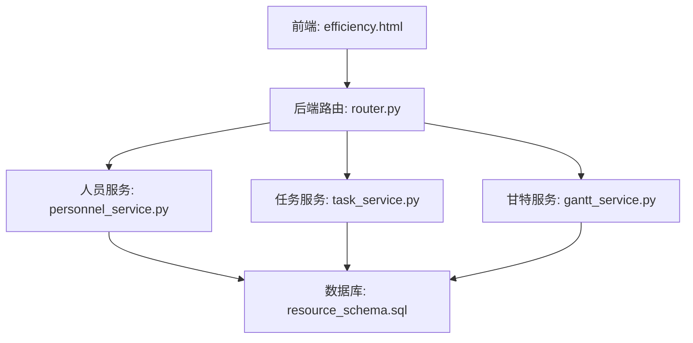
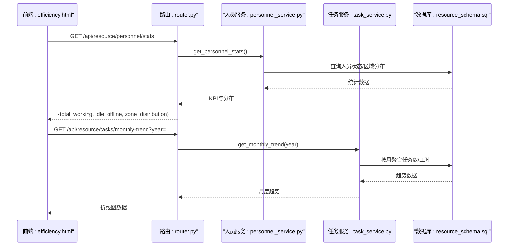
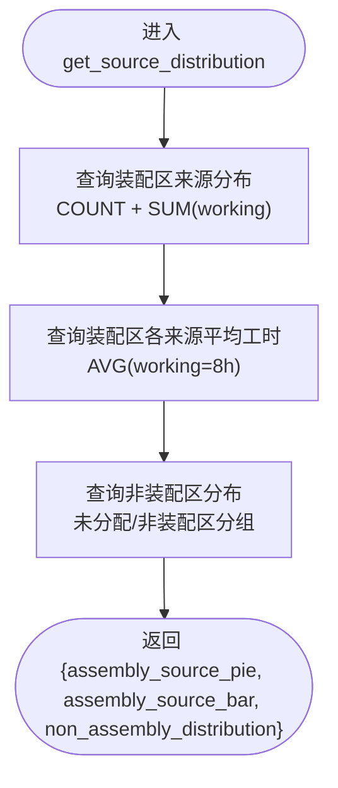
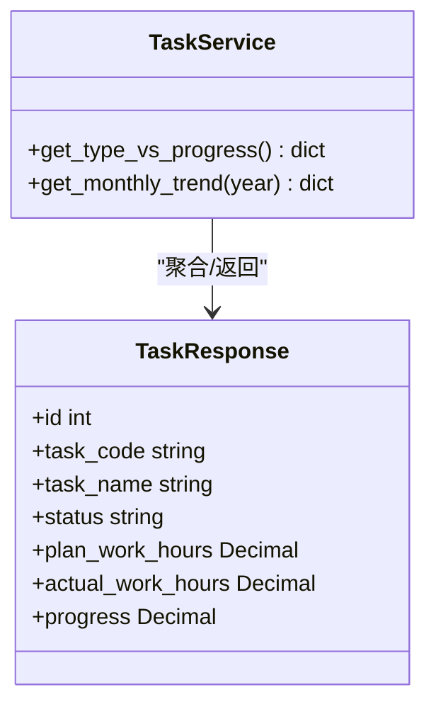
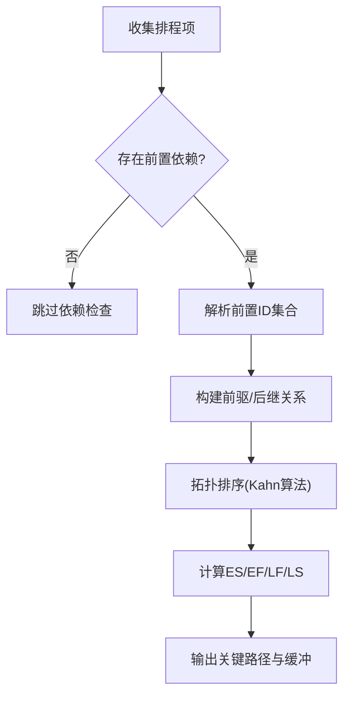
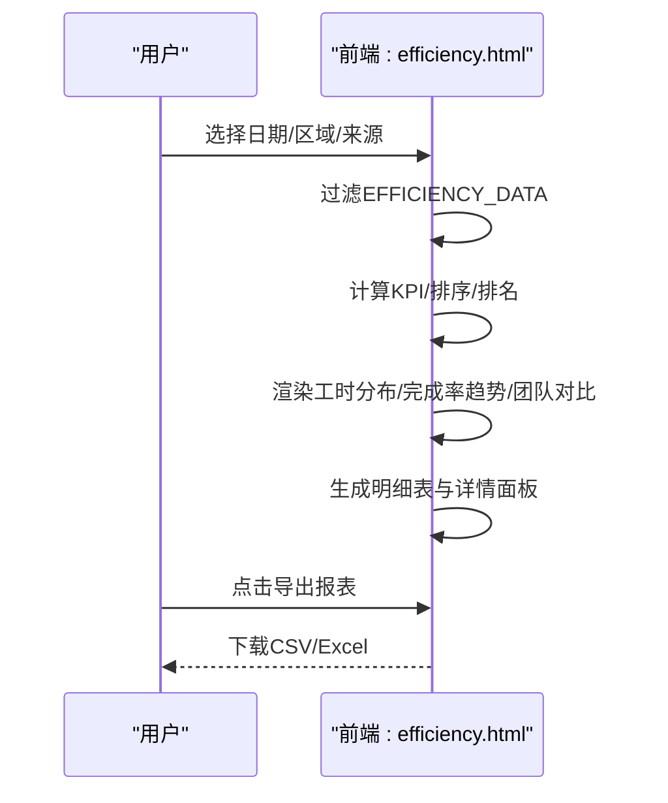
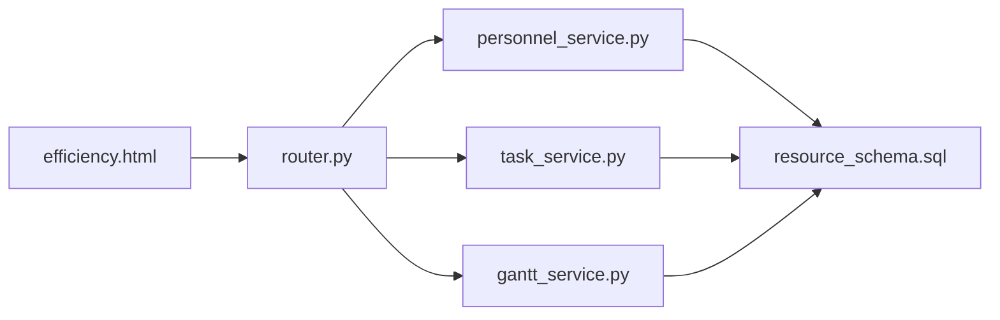

# 人效分析

<cite>
**本文引用的文件**
- [personnel_service.py](file://backend/modules/resource/services/personnel_service.py)
- [router.py](file://backend/modules/resource/router.py)
- [schemas.py](file://backend/modules/resource/schemas.py)
- [resource_schema.sql](file://backend/sql/resource_schema.sql)
- [efficiency.html](file://demo/efficiency.html)
- [task_service.py](file://backend/modules/resource/services/task_service.py)
- [gantt_service.py](file://backend/modules/resource/services/gantt_service.py)
</cite>

## 目录
1. [简介](#简介)
2. [项目结构](#项目结构)
3. [核心组件](#核心组件)
4. [架构总览](#架构总览)
5. [详细组件分析](#详细组件分析)
6. [依赖关系分析](#依赖关系分析)
7. [性能与扩展性](#性能与扩展性)
8. [故障排查指南](#故障排查指南)
9. [结论](#结论)
10. [附录：指标定义与计算示例](#附录指标定义与计算示例)

## 简介
本模块聚焦“人效分析”，围绕效率统计、工时分析、来源对比、趋势预测四大能力，提供从数据模型、服务层到前端展示的一体化方案。后端通过人员服务与任务服务聚合数据，暴露统一API；前端以可视化图表和明细表格呈现关键指标，支持按区域、来源、时间范围筛选与导出。

## 项目结构
- 后端资源模块（FastAPI）
  - 路由层：统一对外接口，封装参数校验与异常处理
  - 服务层：人员看板、任务统计、甘特排程等核心业务逻辑
  - 数据模型：Pydantic 模型定义请求/响应结构
  - 数据库：人员效率统计表等DDL
- 前端演示页
  - 人效分析页面：KPI、工时分布、完成率趋势、团队对比、明细表、详情面板与导出

**图示来源**
- [router.py:356-578](file://backend/modules/resource/router.py#L356-L578)
- [personnel_service.py:24-124](file://backend/modules/resource/services/personnel_service.py#L24-L124)
- [task_service.py:1-18](file://backend/modules/resource/services/task_service.py#L1-L18)
- [gantt_service.py:894-1016](file://backend/modules/resource/services/gantt_service.py#L894-L1016)
- [resource_schema.sql:165-181](file://backend/sql/resource_schema.sql#L165-L181)

**章节来源**
- [router.py:356-578](file://backend/modules/resource/router.py#L356-L578)
- [personnel_service.py:24-124](file://backend/modules/resource/services/personnel_service.py#L24-L124)
- [schemas.py:76-118](file://backend/modules/resource/schemas.py#L76-L118)
- [resource_schema.sql:165-181](file://backend/sql/resource_schema.sql#L165-L181)
- [efficiency.html:477-573](file://demo/efficiency.html#L477-L573)

## 核心组件
- 人员服务（personnel_service.py）
  - 人员列表、详情、状态更新、KPI统计、来源分布、位置分布
  - 装配区判定与来源列显示策略
- 任务服务（task_service.py）
  - 任务类型进度对比、月度趋势等统计
- 甘特服务（gantt_service.py）
  - 冲突检测、拓扑排序、关键路径计算，支撑排程与瓶颈识别
- 路由（router.py）
  - 人员相关API、任务统计API、甘特图API、人效分析占位API
- 数据模型（schemas.py）
  - 人员、任务、预警、驾驶舱等数据结构
- 数据库（resource_schema.sql）
  - 人员效率统计表字段设计

**章节来源**
- [personnel_service.py:325-475](file://backend/modules/resource/services/personnel_service.py#L325-L475)
- [task_service.py:381-395](file://backend/modules/resource/services/task_service.py#L381-L395)
- [gantt_service.py:1285-1316](file://backend/modules/resource/services/gantt_service.py#L1285-L1316)
- [router.py:505-578](file://backend/modules/resource/router.py#L505-L578)
- [schemas.py:76-118](file://backend/modules/resource/schemas.py#L76-L118)
- [resource_schema.sql:165-181](file://backend/sql/resource_schema.sql#L165-L181)

## 架构总览
人效分析的数据流：
- 前端发起筛选条件（日期范围、区域、来源）
- 路由层接收并转发至服务层
- 服务层聚合人员、任务、排程数据，计算指标
- 返回结构化数据供前端渲染图表与表格

**图示来源**
- [router.py:505-578](file://backend/modules/resource/router.py#L505-L578)
- [personnel_service.py:325-379](file://backend/modules/resource/services/personnel_service.py#L325-L379)
- [task_service.py:381-395](file://backend/modules/resource/services/task_service.py#L381-L395)
- [resource_schema.sql:165-181](file://backend/sql/resource_schema.sql#L165-L181)

## 详细组件分析

### 人员服务：效率统计与来源对比
- 装配区判定：仅装配区显示“来源”列，非装配区留白
- 人员列表：支持分页、状态、区域、来源、关键词搜索
- 今日工时：基于状态简单估算（工作中8小时，其他0小时）
- KPI统计：在岗人数、空闲可调配、异常离线数、区域分布
- 来源分布：装配区饼图（来源占比）、柱状图（人数+平均工时）、非装配区分布

**图示来源**
- [personnel_service.py:382-431](file://backend/modules/resource/services/personnel_service.py#L382-L431)

**章节来源**
- [personnel_service.py:19-21](file://backend/modules/resource/services/personnel_service.py#L19-L21)
- [personnel_service.py:24-124](file://backend/modules/resource/services/personnel_service.py#L24-L124)
- [personnel_service.py:325-379](file://backend/modules/resource/services/personnel_service.py#L325-L379)
- [personnel_service.py:382-431](file://backend/modules/resource/services/personnel_service.py#L382-L431)

### 任务服务：类型进度与月度趋势
- 类型进度：A/B/C/sporadic 四类任务的完成数量、平均进度、计划与实际工时汇总
- 月度趋势：按年维度统计任务量变化，用于趋势分析与预测输入

**图示来源**
- [task_service.py:381-395](file://backend/modules/resource/services/task_service.py#L381-L395)
- [schemas.py:123-177](file://backend/modules/resource/schemas.py#L123-L177)

**章节来源**
- [task_service.py:381-395](file://backend/modules/resource/services/task_service.py#L381-L395)
- [schemas.py:123-177](file://backend/modules/resource/schemas.py#L123-L177)

### 甘特服务：冲突检测与关键路径
- 冲突检测：前置依赖错过、时间重叠、场地重叠等
- 拓扑排序：基于前置依赖构建有向无环图，计算最早/最晚开始结束时间，定位关键路径

**图示来源**
- [gantt_service.py:1285-1316](file://backend/modules/resource/services/gantt_service.py#L1285-L1316)
- [gantt_service.py:894-1016](file://backend/modules/resource/services/gantt_service.py#L894-L1016)

**章节来源**
- [gantt_service.py:894-1016](file://backend/modules/resource/services/gantt_service.py#L894-L1016)
- [gantt_service.py:1285-1316](file://backend/modules/resource/services/gantt_service.py#L1285-L1316)

### 前端：效率指标、图表与导出
- KPI卡片：人均产出、平均工时、任务完成率、返工率、综合效率指数
- 图表：工时分布（按区域/来源）、任务完成率趋势（近7天）、团队效率对比
- 明细表：姓名、工号、来源、区域、今日工时、完成任务、进行中、完成率、效率评分、排名
- 详情面板：个人效率指标环形图、任务明细、导出报表

**图示来源**
- [efficiency.html:624-727](file://demo/efficiency.html#L624-L727)
- [efficiency.html:729-800](file://demo/efficiency.html#L729-L800)
- [efficiency.html:1188-1208](file://demo/efficiency.html#L1188-L1208)

**章节来源**
- [efficiency.html:477-573](file://demo/efficiency.html#L477-L573)
- [efficiency.html:624-727](file://demo/efficiency.html#L624-L727)
- [efficiency.html:729-800](file://demo/efficiency.html#L729-L800)
- [efficiency.html:1188-1208](file://demo/efficiency.html#L1188-L1208)

## 依赖关系分析
- 路由对服务的依赖：人员、任务、甘特三大服务
- 服务对数据库的依赖：人员效率表、任务表、排程表
- 前端对后端API的依赖：人员统计、任务趋势、甘特数据
- 数据一致性：人员状态与任务进度联动影响效率指标

**图示来源**
- [router.py:356-578](file://backend/modules/resource/router.py#L356-L578)
- [personnel_service.py:24-124](file://backend/modules/resource/services/personnel_service.py#L24-L124)
- [task_service.py:381-395](file://backend/modules/resource/services/task_service.py#L381-L395)
- [gantt_service.py:894-1016](file://backend/modules/resource/services/gantt_service.py#L894-L1016)
- [resource_schema.sql:165-181](file://backend/sql/resource_schema.sql#L165-L181)

**章节来源**
- [router.py:356-578](file://backend/modules/resource/router.py#L356-L578)
- [personnel_service.py:24-124](file://backend/modules/resource/services/personnel_service.py#L24-L124)
- [task_service.py:381-395](file://backend/modules/resource/services/task_service.py#L381-L395)
- [gantt_service.py:894-1016](file://backend/modules/resource/services/gantt_service.py#L894-L1016)
- [resource_schema.sql:165-181](file://backend/sql/resource_schema.sql#L165-L181)

## 性能与扩展性
- 查询优化：使用索引（人员效率表的工号与日期索引）提升聚合速度
- 分页与筛选：减少数据传输量，提高前端渲染性能
- 缓存建议：对高频KPI与趋势数据增加短期缓存（如Redis），降低数据库压力
- 扩展点：
  - 新增效率指标：在人员服务中扩展SQL聚合逻辑
  - 预测模型：接入时间序列模型（如ARIMA/Prophet）对月度趋势进行预测
  - 多源数据融合：结合设备利用率、物料齐套率等多维数据增强人效评估

[本节为通用指导，不直接分析具体文件]

## 故障排查指南
- 人员状态异常
  - 现象：今日工时始终为0或固定值
  - 排查：确认人员状态是否为working；检查get_personnel_list中的工时计算逻辑
- 来源分布为空
  - 现象：装配区来源饼图为空
  - 排查：确认current_zone是否在装配区集合；检查get_source_distribution的WHERE条件
- 任务趋势缺失
  - 现象：月度趋势无数据
  - 排查：确认任务表是否有计划/实际工时；检查get_monthly_trend的聚合字段
- 甘特冲突误报
  - 现象：频繁提示时间重叠或依赖错过
  - 排查：检查predecessor_ids是否正确；验证时间区间计算与重叠阈值

**章节来源**
- [personnel_service.py:94-98](file://backend/modules/resource/services/personnel_service.py#L94-L98)
- [personnel_service.py:382-431](file://backend/modules/resource/services/personnel_service.py#L382-L431)
- [task_service.py:381-395](file://backend/modules/resource/services/task_service.py#L381-L395)
- [gantt_service.py:894-1016](file://backend/modules/resource/services/gantt_service.py#L894-L1016)

## 结论
本模块通过人员服务、任务服务与甘特服务协同，构建了完整的人效分析闭环：从数据采集、指标计算、可视化展示到趋势分析与排程优化。当前实现已覆盖效率统计、工时分析、来源对比与基础趋势展示；后续可引入预测模型与多源数据融合，进一步提升决策支持能力。

[本节为总结，不直接分析具体文件]

## 附录：指标定义与计算示例

### 效率指标定义
- 人均产出：完成任务数 × 单位产出 ÷ 人数
- 平均工时：当日工作时长合计 ÷ 人数
- 任务完成率：已完成任务数 ÷ (已完成 + 进行中)
- 返工率：返工任务占比（模拟数据）
- 综合效率指数：基于完成率与返工率的加权评分

**章节来源**
- [efficiency.html:705-727](file://demo/efficiency.html#L705-L727)

### 数据统计算法
- 人员KPI：按状态与区域聚合计数与均值
- 来源分布：装配区与非装配区分组统计
- 任务趋势：按月聚合任务量与工时

**章节来源**
- [personnel_service.py:325-431](file://backend/modules/resource/services/personnel_service.py#L325-L431)
- [task_service.py:381-395](file://backend/modules/resource/services/task_service.py#L381-L395)

### 图表展示逻辑
- 工时分布：按区域/来源分组，展示人数与平均工时
- 完成率趋势：近7天折线图，反映效率变化
- 团队对比：不同来源的效率评分对比

**章节来源**
- [efficiency.html:525-573](file://demo/efficiency.html#L525-L573)
- [efficiency.html:624-727](file://demo/efficiency.html#L624-L727)

### 对比分析方法
- 区域对比：装配区 vs 非装配区
- 来源对比：自有/商用车/乘用车/柳汽/中智/外协/内调
- 时间对比：近7天/30天/90天

**章节来源**
- [personnel_service.py:382-431](file://backend/modules/resource/services/personnel_service.py#L382-L431)
- [efficiency.html:729-800](file://demo/efficiency.html#L729-L800)

### 预测模型应用
- 输入：月度任务趋势、人员效率指数
- 方法：时间序列预测（ARIMA/Prophet）
- 输出：未来N周效率预测与置信区间

[本节为概念性说明，不直接分析具体文件]

### 代码示例路径（不展示代码内容）
- 计算人员效率：参考 [personnel_service.py:325-379](file://backend/modules/resource/services/personnel_service.py#L325-L379)
- 生成对比图表：参考 [efficiency.html:705-727](file://demo/efficiency.html#L705-L727)
- 时间序列分析：参考 [task_service.py:381-395](file://backend/modules/resource/services/task_service.py#L381-L395)
- 导出分析报告：参考 [efficiency.html:466-473](file://demo/efficiency.html#L466-L473)

**章节来源**
- [personnel_service.py:325-379](file://backend/modules/resource/services/personnel_service.py#L325-L379)
- [efficiency.html:466-473](file://demo/efficiency.html#L466-L473)
- [efficiency.html:705-727](file://demo/efficiency.html#L705-L727)
- [task_service.py:381-395](file://backend/modules/resource/services/task_service.py#L381-L395)