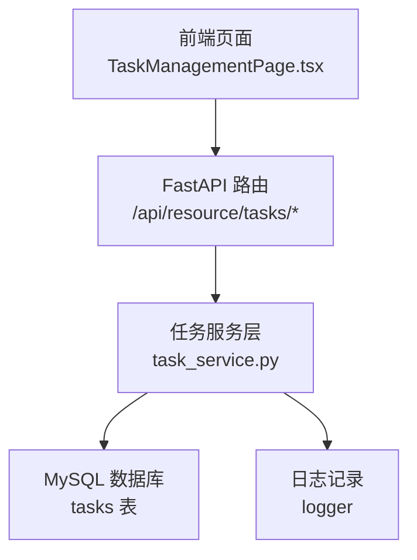
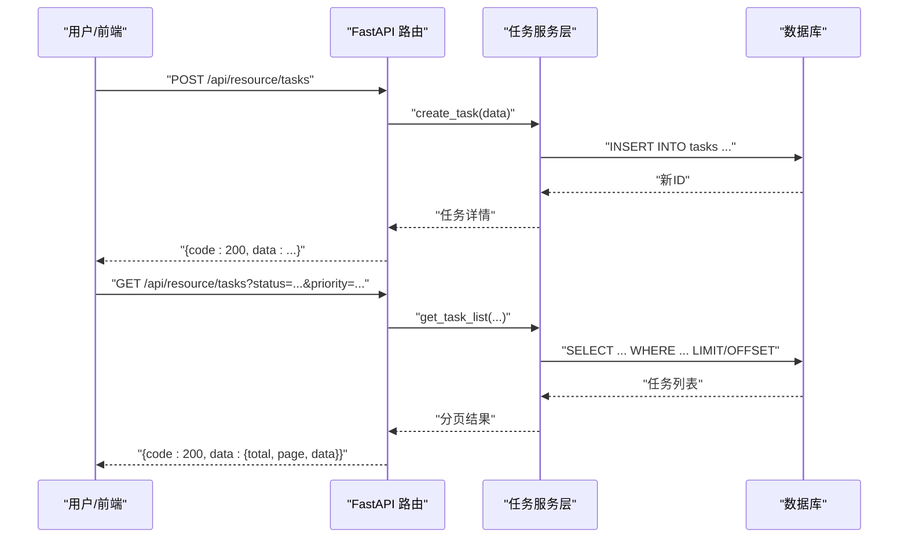
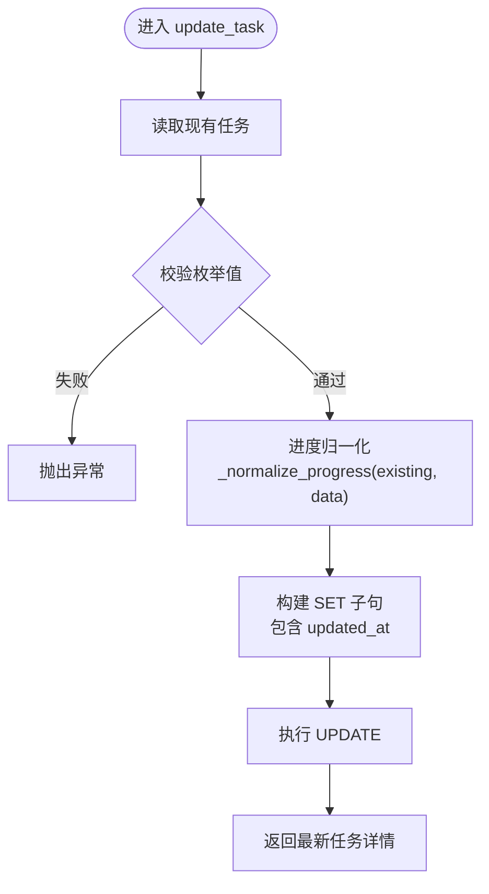
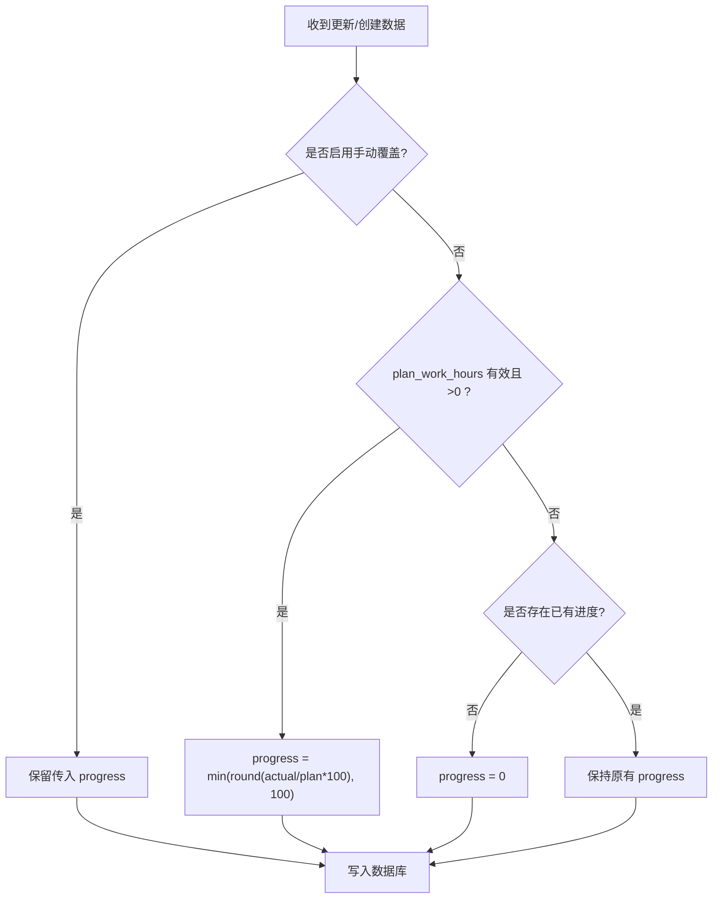
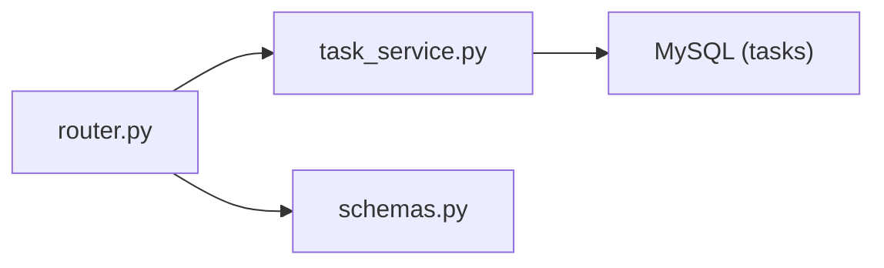

# 任务管理

<cite>
**本文引用的文件**
- [task_service.py](file://backend/modules/resource/services/task_service.py)
- [router.py](file://backend/modules/resource/router.py)
- [schemas.py](file://backend/modules/resource/schemas.py)
- [resource_schema.sql](file://backend/sql/resource_schema.sql)
- [TaskManagementPage.tsx](file://webui_ref/client/src/pages/TaskManagementPage/TaskManagementPage.tsx)
</cite>

## 目录
1. [简介](#简介)
2. [项目结构](#项目结构)
3. [核心组件](#核心组件)
4. [架构总览](#架构总览)
5. [详细组件分析](#详细组件分析)
6. [依赖关系分析](#依赖关系分析)
7. [性能考虑](#性能考虑)
8. [故障排查指南](#故障排查指南)
9. [结论](#结论)
10. [附录](#附录)

## 简介
本模块提供试制资源系统中的“任务管理”能力，覆盖任务的创建、查询、更新、删除（CRUD），以及状态追踪、优先级管理、进度监控、搜索筛选与统计看板等。后端基于 FastAPI 路由 + 服务层 + MySQL 数据访问；前端页面占位待完善。

## 项目结构
任务管理相关代码主要位于 backend/modules/resource 下：
- router.py：定义 /api/resource/tasks 系列接口，负责参数校验、调用服务层、统一返回格式。
- services/task_service.py：实现任务的业务逻辑（CRUD、进度计算、统计、趋势）。
- schemas.py：Pydantic 模型，用于请求/响应数据建模。
- sql/resource_schema.sql：数据库表结构定义，包含 tasks 表及索引。
- webui_ref/client/.../TaskManagementPage.tsx：前端任务管理页面占位。

图表来源
- [router.py:646-831](file://backend/modules/resource/router.py#L646-L831)
- [task_service.py:48-432](file://backend/modules/resource/services/task_service.py#L48-L432)
- [resource_schema.sql:71-109](file://backend/sql/resource_schema.sql#L71-L109)

章节来源
- [router.py:646-831](file://backend/modules/resource/router.py#L646-L831)
- [task_service.py:48-432](file://backend/modules/resource/services/task_service.py#L48-L432)
- [resource_schema.sql:71-109](file://backend/sql/resource_schema.sql#L71-L109)

## 核心组件
- 路由层（router.py）
  - GET /api/resource/tasks：分页、多条件筛选、关键词搜索。
  - GET /api/resource/tasks/{id}：获取单个任务详情。
  - POST /api/resource/tasks：创建任务。
  - PUT /api/resource/tasks/{id}：更新任务。
  - DELETE /api/resource/tasks/{id}：删除任务。
  - GET /api/resource/tasks/stats：KPI 统计。
  - GET /api/resource/tasks/status-distribution：状态分布。
  - GET /api/resource/tasks/type-progress：类型与进度对比。
  - GET /api/resource/tasks/monthly-trend：月度趋势。
- 服务层（task_service.py）
  - 列表查询：支持 task_type、trial_type、status、priority、zone_code、assembly_site、keyword 等多维筛选与分页。
  - 进度计算：根据 plan_work_hours 与 actual_work_hours 自动计算 progress，支持手动覆盖标记 progress_manual_override。
  - 统计：按状态、优先级、类型汇总，计划/实际工时合计与平均进度。
  - 趋势：按月统计任务数量与完成数。
- 数据模型（schemas.py）
  - TaskCreate/TaskUpdate/TaskResponse：约束任务字段类型与默认值。
- 数据库（resource_schema.sql）
  - tasks 表：任务主数据，含枚举字段（类型、优先级、状态、来源）、时间、工时、进度、装配场地、设备关联等，并建立常用索引。

章节来源
- [router.py:646-831](file://backend/modules/resource/router.py#L646-L831)
- [task_service.py:21-432](file://backend/modules/resource/services/task_service.py#L21-L432)
- [schemas.py:123-178](file://backend/modules/resource/schemas.py#L123-L178)
- [resource_schema.sql:71-109](file://backend/sql/resource_schema.sql#L71-L109)

## 架构总览
任务管理的请求-处理-存储流程如下：

图表来源
- [router.py:702-771](file://backend/modules/resource/router.py#L702-L771)
- [task_service.py:177-287](file://backend/modules/resource/services/task_service.py#L177-L287)
- [task_service.py:48-146](file://backend/modules/resource/services/task_service.py#L48-L146)

## 详细组件分析

### 数据模型与持久化
- 任务实体（tasks 表）关键字段
  - 标识与基础信息：id、task_code（唯一）、task_name、task_type（A/B/C/sporadic）、trial_type、project_group、project_code、vehicle_code、vehicle_model
  - 计划与执行：plan_start_time、plan_end_time、plan_work_hours、actual_work_hours、progress、progress_manual_override
  - 组织与资源：zone_code、assembly_site、lift_count、equipment_code
  - 人员角色：planner、pm_name、cve_name、trial_supervisor、process_supervisor、assembly_supervisor
  - 业务目标：summer_target_count、summer_target_date
  - 数据来源：source（operation/manual/mes）
  - 审计字段：created_at、updated_at
- 索引优化
  - idx_task_type、idx_task_status、idx_task_priority、idx_task_project、idx_task_equipment

章节来源
- [resource_schema.sql:71-109](file://backend/sql/resource_schema.sql#L71-L109)

### CRUD 操作
- 创建任务
  - 路由接收 TaskCreateRequest，转换日期字段后调用服务层 create_task。
  - 服务层校验枚举值（类型、优先级、状态、来源），去重检查 task_code，自动计算进度，插入数据库并返回详情。
- 查询任务
  - 列表：支持多维筛选与关键词模糊匹配，组装动态 WHERE，COUNT+LIMIT 分页。
  - 详情：按 id 查询并格式化时间与数值类型。
- 更新任务
  - 仅更新传入的字段，自动计算进度（可被手动覆盖标记阻止），写入 updated_at。
- 删除任务
  - 校验存在性后删除，记录日志。

图表来源
- [task_service.py:240-277](file://backend/modules/resource/services/task_service.py#L240-L277)
- [task_service.py:21-45](file://backend/modules/resource/services/task_service.py#L21-L45)

章节来源
- [router.py:702-771](file://backend/modules/resource/router.py#L702-L771)
- [task_service.py:177-287](file://backend/modules/resource/services/task_service.py#L177-L287)

### 状态追踪与状态机设计
- 状态集合：pending、in_progress、completed、overdue
- 当前实现说明
  - 允许在更新时设置任意合法状态；未内置强制的状态流转规则（如不允许从 completed 回到 pending）。
  - overdue 通常由外部定时或业务逻辑触发，当前服务层未提供自动逾期判定方法。
- 建议扩展
  - 在服务层增加状态机校验函数，限制非法跳转。
  - 增加状态变更历史表，记录每次状态切换的时间、操作人、原因。

章节来源
- [task_service.py:13-15](file://backend/modules/resource/services/task_service.py#L13-L15)
- [resource_schema.sql:82](file://backend/sql/resource_schema.sql#L82)

### 优先级管理与排序
- 优先级集合：high、medium、low
- 列表排序
  - 默认按 created_at DESC、id DESC 排序；如需按优先级排序，可在 SQL 中追加 ORDER BY priority 自定义顺序。
- 使用场景
  - 看板展示高优先级任务置顶；甘特排程中结合优先级进行冲突检测与调度。

章节来源
- [task_service.py:15](file://backend/modules/resource/services/task_service.py#L15)
- [task_service.py:109-125](file://backend/modules/resource/services/task_service.py#L109-L125)

### 进度监控与自动计算
- 自动计算逻辑
  - 若 progress_manual_override 为 0，则根据 actual_work_hours / plan_work_hours * 100 计算 progress，上限 100%。
  - 若 plan_work_hours 为空或非正数，或 actual_work_hours 为空，则保持原值或置 0。
- 手动覆盖
  - 当 progress_manual_override 为 1 时，保留前端传入的 progress 值，不自动覆盖。
- 数据规范化
  - 返回时将 Decimal 转为 float，时间字段格式化为字符串，便于前端渲染。

图表来源
- [task_service.py:21-45](file://backend/modules/resource/services/task_service.py#L21-L45)

章节来源
- [task_service.py:21-45](file://backend/modules/resource/services/task_service.py#L21-L45)

### 权限控制
- 当前实现
  - 路由与服务层未实现基于角色的访问控制（RBAC）或登录鉴权。
- 建议方案
  - 在路由层引入中间件进行 JWT 校验与角色/权限判断。
  - 对写操作（创建/更新/删除）增加最小权限校验，例如仅允许“任务管理员”或“装配主管”修改关键状态。

[本节为通用建议，不涉及具体文件]

### 搜索与筛选
- 支持维度
  - 任务类型、试制类别、状态、优先级、区域/装配场地、关键词（任务编号/名称/项目编号/车号/项目群/负责人）。
- 实现方式
  - 动态拼接 WHERE 条件，使用 LIKE 进行关键词模糊匹配。
  - 分页：page/page_size + LIMIT/OFFSET。
- 示例路径
  - 列表查询：GET /api/resource/tasks
  - 关键词与筛选参数传递见路由定义。

章节来源
- [router.py:646-678](file://backend/modules/resource/router.py#L646-L678)
- [task_service.py:48-146](file://backend/modules/resource/services/task_service.py#L48-L146)

### 批量操作
- 当前实现
  - 任务模块未提供批量更新/删除接口。
- 建议扩展
  - 新增批量更新接口：PUT /api/resource/tasks/batch-update，支持 ids + 字段映射。
  - 新增批量删除接口：DELETE /api/resource/tasks/batch-delete，支持 ids 列表。
  - 在事务中执行，保证一致性并返回成功/失败明细。

[本节为通用建议，不涉及具体文件]

### 任务分配逻辑
- 当前实现
  - 任务可关联 equipment_code、zone_code、assembly_site、planner 等，但未实现“分配给某人”的专用字段与分配工作流。
- 建议扩展
  - 增加 assignee_ids 或 assignee_code 字段，配合人员表实现任务指派。
  - 在更新任务时校验资源占用冲突（设备/场地/人员），避免重复分配。

[本节为通用建议，不涉及具体文件]

## 依赖关系分析
- 路由依赖服务层
  - router.py 中的任务接口均调用 task_service.py 对应函数。
- 服务层依赖数据库
  - 通过 query_all/query_one/execute/execute_last_id 直接执行 SQL。
- 数据模型
  - schemas.py 定义 Pydantic 模型，用于请求体校验与响应结构。

图表来源
- [router.py:646-831](file://backend/modules/resource/router.py#L646-L831)
- [task_service.py:48-432](file://backend/modules/resource/services/task_service.py#L48-L432)
- [schemas.py:123-178](file://backend/modules/resource/schemas.py#L123-L178)

章节来源
- [router.py:646-831](file://backend/modules/resource/router.py#L646-L831)
- [task_service.py:48-432](file://backend/modules/resource/services/task_service.py#L48-L432)
- [schemas.py:123-178](file://backend/modules/resource/schemas.py#L123-L178)

## 性能考虑
- 查询优化
  - 使用索引字段进行筛选（task_type、status、priority、project_code、equipment_code）。
  - 关键词搜索采用 LIKE，建议在高频字段上建立全文索引或使用搜索引擎。
- 分页
  - 合理设置 page_size，避免一次性拉取过多数据。
- 进度计算
  - 自动计算仅在必要时执行，减少不必要的浮点运算。
- 统计接口
  - 使用 GROUP BY 聚合，注意大表时的性能，可考虑物化视图或定时汇总表。

[本节为通用指导，不涉及具体文件]

## 故障排查指南
- 常见错误
  - 任务编号已存在：创建时重复 task_code。
  - 无效枚举值：task_type、priority、status、source 不在允许集合内。
  - 任务不存在：更新/删除时 ID 无效。
- 定位方法
  - 查看路由层的异常捕获与 HTTPException。
  - 检查服务层抛出的 ValueError 消息。
  - 核对数据库任务记录与索引使用情况。

章节来源
- [router.py:702-771](file://backend/modules/resource/router.py#L702-L771)
- [task_service.py:177-287](file://backend/modules/resource/services/task_service.py#L177-L287)

## 结论
任务管理模块提供了完整的 CRUD 与丰富的筛选、统计能力，进度自动计算与手动覆盖机制满足日常跟踪需求。后续建议补充状态机校验、权限控制、批量操作与任务分配工作流，以提升系统的安全性与易用性。

## 附录

### API 参考（任务）
- 列表查询
  - GET /api/resource/tasks?page=&page_size=&task_type=&trial_type=&status=&priority=&zone_code=&assembly_site=&keyword=
- 详情
  - GET /api/resource/tasks/{task_id}
- 创建
  - POST /api/resource/tasks
- 更新
  - PUT /api/resource/tasks/{task_id}
- 删除
  - DELETE /api/resource/tasks/{task_id}
- 统计
  - GET /api/resource/tasks/stats
- 状态分布
  - GET /api/resource/tasks/status-distribution
- 类型与进度
  - GET /api/resource/tasks/type-progress
- 月度趋势
  - GET /api/resource/tasks/monthly-trend?year=

章节来源
- [router.py:646-831](file://backend/modules/resource/router.py#L646-L831)

### 前端页面
- 任务管理页面目前为占位实现，后续可对接上述 API 完成交互。

章节来源
- [TaskManagementPage.tsx:1-16](file://webui_ref/client/src/pages/TaskManagementPage/TaskManagementPage.tsx#L1-L16)