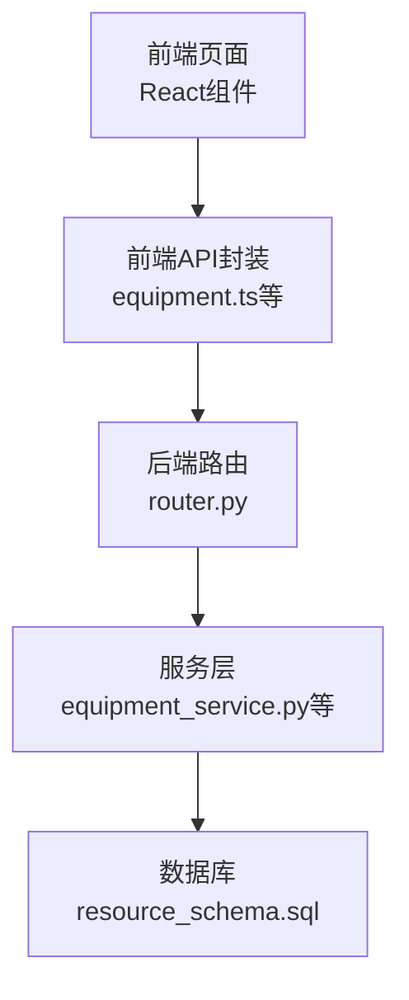
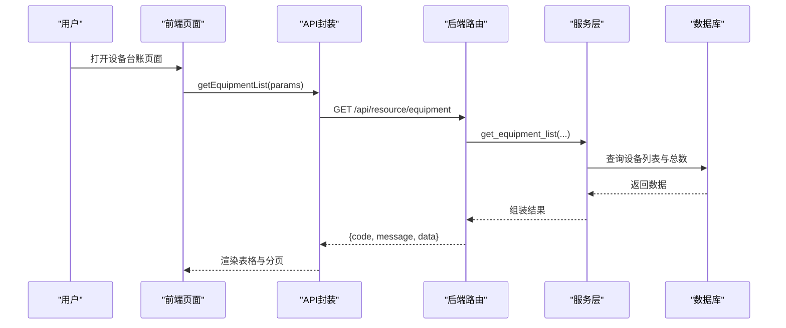
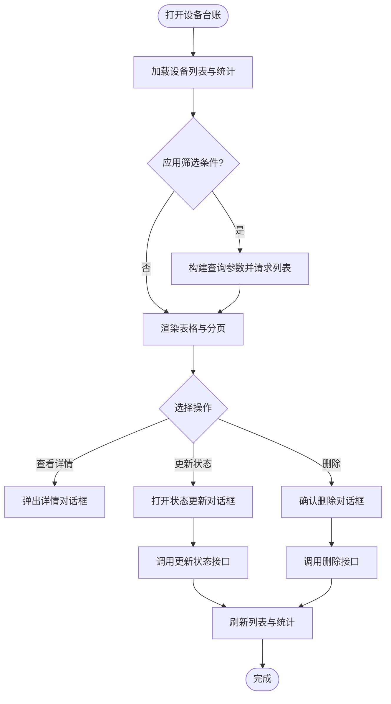
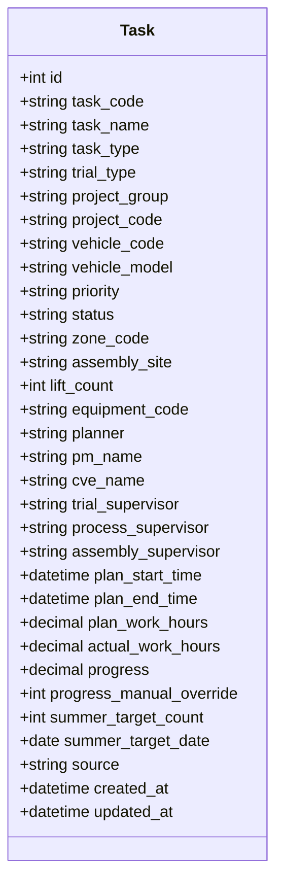
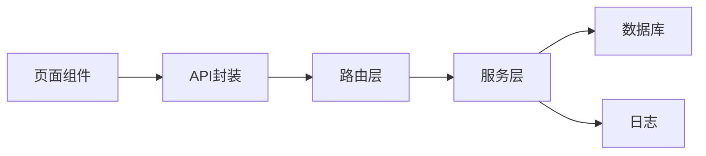

# 功能模块界面

<cite>
**本文引用的文件**
- [ResourceDashboardPage.tsx](file://webui_ref/client/src/pages/ResourceDashboardPage/ResourceDashboardPage.tsx)
- [EquipmentLedgerPage.tsx](file://webui_ref/client/src/pages/EquipmentLedgerPage/EquipmentLedgerPage.tsx)
- [CampusMapPage.tsx](file://webui_ref/client/src/pages/CampusMapPage/CampusMapPage.tsx)
- [ResourceBoardPage.tsx](file://webui_ref/client/src/pages/ResourceBoardPage/ResourceBoardPage.tsx)
- [PersonnelBoardPage.tsx](file://webui_ref/client/src/pages/PersonnelBoardPage/PersonnelBoardPage.tsx)
- [GanttSchedulePage.tsx](file://webui_ref/client/src/pages/GanttSchedulePage/GanttSchedulePage.tsx)
- [PersonnelEfficiencyPage.tsx](file://webui_ref/client/src/pages/PersonnelEfficiencyPage/PersonnelEfficiencyPage.tsx)
- [AlertCenterPage.tsx](file://webui_ref/client/src/pages/AlertCenterPage/AlertCenterPage.tsx)
- [TaskManagementPage.tsx](file://webui_ref/client/src/pages/TaskManagementPage/TaskManagementPage.tsx)
- [equipment.ts](file://webui_ref/client/src/api/resource/equipment.ts)
- [router.py](file://backend/modules/resource/router.py)
- [schemas.py](file://backend/modules/resource/schemas.py)
- [resource_schema.sql](file://backend/sql/resource_schema.sql)
- [equipment_service.py](file://backend/modules/resource/services/equipment_service.py)
- [task_service.py](file://backend/modules/resource/services/task_service.py)
- [personnel_service.py](file://backend/modules/resource/services/personnel_service.py)
</cite>

## 目录
1. [简介](#简介)
2. [项目结构](#项目结构)
3. [核心组件](#核心组件)
4. [架构总览](#架构总览)
5. [详细组件分析](#详细组件分析)
6. [依赖关系分析](#依赖关系分析)
7. [性能考虑](#性能考虑)
8. [故障排查指南](#故障排查指南)
9. [结论](#结论)
10. [附录](#附录)

## 简介
本文件面向“试制资源数智化管理系统”的9大功能模块界面，聚焦每个页面的用户交互流程、数据展示逻辑与业务处理机制。系统采用前后端分离架构：前端以React页面为主（部分页面为占位），后端基于FastAPI提供REST接口，数据库使用MariaDB/MySQL兼容引擎，并通过Pydantic模型进行数据校验与序列化。

## 项目结构
- 前端页面位于 webui_ref/client/src/pages，按功能划分独立页面组件；设备台账等已实现完整交互，其余多为占位页。
- 前端API封装位于 webui_ref/client/src/api/resource，统一调用后端 /api/resource 前缀接口。
- 后端路由集中在 backend/modules/resource/router.py，服务层在 services 子目录中实现具体业务逻辑。
- 数据模型定义在 backend/modules/resource/schemas.py，数据库表结构在 backend/sql/resource_schema.sql。

图表来源
- [router.py:58-218](file://backend/modules/resource/router.py#L58-L218)
- [equipment.ts:119-178](file://webui_ref/client/src/api/resource/equipment.ts#L119-L178)
- [resource_schema.sql:13-28](file://backend/sql/resource_schema.sql#L13-L28)

章节来源
- [router.py:1-800](file://backend/modules/resource/router.py#L1-L800)
- [equipment.ts:1-254](file://webui_ref/client/src/api/resource/equipment.ts#L1-L254)
- [resource_schema.sql:1-326](file://backend/sql/resource_schema.sql#L1-L326)

## 核心组件
- 综合驾驶舱：全局KPI概览（设备、人员、任务、预警）。当前为占位页面，后续可对接 /api/resource 统计接口。
- 设备台账：设备信息CRUD、状态监控、维护记录管理。已实现列表、筛选、分页、详情、删除、状态更新。
- 园区地图：可视化布局与位置跟踪。当前为占位页面，后端提供 /zones/map 占位接口。
- 资源占用看板：实时利用率与趋势。当前为占位页面，可复用设备/任务统计数据。
- 人员看板：人员状态与工作负载分析。后端提供人员列表、统计、来源分布、地图覆盖层接口。
- 甘特图排程：任务时间线可视化与冲突检测。后端提供相关表结构与排程字段，前端页面为占位。
- 人效分析：效率统计与对比。后端提供占位接口，可结合 personnel_efficiency 表扩展。
- 异常预警中心：分级告警与处理。后端提供 alerts 表结构与相关接口，前端页面为占位。
- 任务管理：CRUD与状态流转。后端提供完整任务接口与服务层逻辑。

章节来源
- [ResourceDashboardPage.tsx:1-16](file://webui_ref/client/src/pages/ResourceDashboardPage/ResourceDashboardPage.tsx#L1-L16)
- [EquipmentLedgerPage.tsx:1-626](file://webui_ref/client/src/pages/EquipmentLedgerPage/EquipmentLedgerPage.tsx#L1-L626)
- [CampusMapPage.tsx:1-16](file://webui_ref/client/src/pages/CampusMapPage/CampusMapPage.tsx#L1-L16)
- [ResourceBoardPage.tsx:1-16](file://webui_ref/client/src/pages/ResourceBoardPage/ResourceBoardPage.tsx#L1-L16)
- [PersonnelBoardPage.tsx:1-16](file://webui_ref/client/src/pages/PersonnelBoardPage/PersonnelBoardPage.tsx#L1-L16)
- [GanttSchedulePage.tsx:1-16](file://webui_ref/client/src/pages/GanttSchedulePage/GanttSchedulePage.tsx#L1-L16)
- [PersonnelEfficiencyPage.tsx:1-16](file://webui_ref/client/src/pages/PersonnelEfficiencyPage/PersonnelEfficiencyPage.tsx#L1-L16)
- [AlertCenterPage.tsx:1-16](file://webui_ref/client/src/pages/AlertCenterPage/AlertCenterPage.tsx#L1-L16)
- [TaskManagementPage.tsx:1-16](file://webui_ref/client/src/pages/TaskManagementPage/TaskManagementPage.tsx#L1-L16)

## 架构总览
系统通过前端页面发起请求，经由API封装调用后端路由，路由将请求分发至服务层执行具体业务逻辑，最终读写数据库。各模块共享统一的错误处理与日志记录机制。

图表来源
- [EquipmentLedgerPage.tsx:303-345](file://webui_ref/client/src/pages/EquipmentLedgerPage/EquipmentLedgerPage.tsx#L303-L345)
- [equipment.ts:119-130](file://webui_ref/client/src/api/resource/equipment.ts#L119-L130)
- [router.py:58-86](file://backend/modules/resource/router.py#L58-L86)
- [equipment_service.py:11-103](file://backend/modules/resource/services/equipment_service.py#L11-L103)
- [resource_schema.sql:13-28](file://backend/sql/resource_schema.sql#L13-L28)

## 详细组件分析

### 综合驾驶舱（KPI监控与图表）
- 交互流程：进入页面后加载全局KPI卡片与图表（待实现）。
- 数据展示：设备总数/空闲/占用/故障、人员总数/在岗/空闲、任务进行中/待开始、预警待处理等。
- 业务机制：聚合设备、人员、任务、预警多源数据，计算关键指标并展示。
- 截图说明：当前为占位页面，显示标题与图标。
- 字段定义：参考 schemas.py 中的 DashboardKPI 与 DashboardResponse。

章节来源
- [ResourceDashboardPage.tsx:1-16](file://webui_ref/client/src/pages/ResourceDashboardPage/ResourceDashboardPage.tsx#L1-L16)
- [schemas.py:206-224](file://backend/modules/resource/schemas.py#L206-L224)

### 设备台账（设备信息与状态监控）
- 交互流程：
  - 列表页支持区域、类型、状态筛选与关键词搜索，分页浏览。
  - 查看详情弹窗展示设备编号、名称、类型、区域、状态、操作员、更新时间等。
  - 操作菜单支持更新状态、删除确认。
- 数据展示：KPI卡片（总数、空闲、占用、故障、维护中）、设备表格、状态徽章。
- 业务机制：
  - 列表查询支持多条件过滤与分页。
  - 状态更新通过PUT接口变更设备状态并刷新列表与统计。
  - 删除操作二次确认后移除设备并刷新。
- 截图说明：页面包含KPI卡片、筛选区、表格与分页。
- 字段定义：设备实体、状态枚举、类型映射见 equipment.ts 与 resource_schema.sql。

图表来源
- [EquipmentLedgerPage.tsx:303-406](file://webui_ref/client/src/pages/EquipmentLedgerPage/EquipmentLedgerPage.tsx#L303-L406)
- [equipment.ts:119-178](file://webui_ref/client/src/api/resource/equipment.ts#L119-L178)
- [router.py:58-218](file://backend/modules/resource/router.py#L58-L218)
- [equipment_service.py:11-103](file://backend/modules/resource/services/equipment_service.py#L11-L103)

章节来源
- [EquipmentLedgerPage.tsx:1-626](file://webui_ref/client/src/pages/EquipmentLedgerPage/EquipmentLedgerPage.tsx#L1-L626)
- [equipment.ts:1-254](file://webui_ref/client/src/api/resource/equipment.ts#L1-L254)
- [router.py:58-218](file://backend/modules/resource/router.py#L58-L218)
- [equipment_service.py:11-200](file://backend/modules/resource/services/equipment_service.py#L11-L200)
- [resource_schema.sql:13-28](file://backend/sql/resource_schema.sql#L13-L28)

### 园区地图（可视化布局与位置跟踪）
- 交互流程：加载地图数据并在画布上展示区域与设备位置（待实现）。
- 数据展示：区域网格、设备点位、状态颜色标记。
- 业务机制：从 /api/resource/zones/map 获取地图数据，结合设备位置进行渲染。
- 截图说明：当前为占位页面。
- 字段定义：区域表 zones 包含坐标与网格配置。

章节来源
- [CampusMapPage.tsx:1-16](file://webui_ref/client/src/pages/CampusMapPage/CampusMapPage.tsx#L1-L16)
- [router.py:307-330](file://backend/modules/resource/router.py#L307-L330)
- [resource_schema.sql:33-45](file://backend/sql/resource_schema.sql#L33-L45)

### 资源占用看板（实时利用率展示）
- 交互流程：展示设备与人员的实时利用率与趋势（待实现）。
- 数据展示：利用率曲线、占比饼图、趋势柱状图。
- 业务机制：聚合设备状态与任务占用时长，计算利用率并更新图表。
- 截图说明：当前为占位页面。

章节来源
- [ResourceBoardPage.tsx:1-16](file://webui_ref/client/src/pages/ResourceBoardPage/ResourceBoardPage.tsx#L1-L16)

### 人员看板（人员状态与工作负载分析）
- 交互流程：查看人员列表、状态、所在区域、工作负载（待实现）。
- 数据展示：人员状态分布、来源分布、地图覆盖层。
- 业务机制：调用人员列表、统计、来源分布、地图接口，计算今日工时与负载。
- 截图说明：当前为占位页面。
- 字段定义：人员实体、状态枚举、装配区判断逻辑见 personnel_service.py。

章节来源
- [PersonnelBoardPage.tsx:1-16](file://webui_ref/client/src/pages/PersonnelBoardPage/PersonnelBoardPage.tsx#L1-L16)
- [router.py:356-557](file://backend/modules/resource/router.py#L356-L557)
- [personnel_service.py:1-200](file://backend/modules/resource/services/personnel_service.py#L1-L200)
- [resource_schema.sql:50-66](file://backend/sql/resource_schema.sql#L50-L66)

### 甘特图排程（任务时间线可视化）
- 交互流程：展示任务时间线、资源冲突检测（待实现）。
- 数据展示：甘特条、阶段、优先级、冲突标记。
- 业务机制：读取 gantt_schedules 与 gantt_conflicts 表，计算关键路径与松弛时差。
- 截图说明：当前为占位页面。
- 字段定义：排程表与冲突表结构见 resource_schema.sql。

章节来源
- [GanttSchedulePage.tsx:1-16](file://webui_ref/client/src/pages/GanttSchedulePage/GanttSchedulePage.tsx#L1-L16)
- [resource_schema.sql:204-326](file://backend/sql/resource_schema.sql#L204-L326)

### 人效分析（效率统计与对比）
- 交互流程：选择日期范围与部门，查看效率统计（待实现）。
- 数据展示：总工时、有效工时、完成任务数、设备使用率。
- 业务机制：调用 /api/resource/personnel/efficiency 接口，结合 personnel_efficiency 表汇总。
- 截图说明：当前为占位页面。

章节来源
- [PersonnelEfficiencyPage.tsx:1-16](file://webui_ref/client/src/pages/PersonnelEfficiencyPage/PersonnelEfficiencyPage.tsx#L1-L16)
- [router.py:559-578](file://backend/modules/resource/router.py#L559-L578)
- [resource_schema.sql:168-181](file://backend/sql/resource_schema.sql#L168-L181)

### 异常预警中心（分级告警与处理）
- 交互流程：查看预警列表、级别、处理状态（待实现）。
- 数据展示：预警编号、类型、级别、标题、描述、关联对象、处理人、SLA。
- 业务机制：读取 alerts 表，支持按级别与状态筛选，记录处理方案与整改措施。
- 截图说明：当前为占位页面。
- 字段定义：预警表结构见 resource_schema.sql。

章节来源
- [AlertCenterPage.tsx:1-16](file://webui_ref/client/src/pages/AlertCenterPage/AlertCenterPage.tsx#L1-L16)
- [resource_schema.sql:114-163](file://backend/sql/resource_schema.sql#L114-L163)

### 任务管理（CRUD与状态流转）
- 交互流程：创建、编辑、删除任务，调整状态与进度（待实现）。
- 数据展示：任务列表、详细信息、计划与实际工时、进度、优先级、装配场地。
- 业务机制：
  - 列表查询支持任务类型、试制类别、状态、优先级、区域/场地、关键词筛选。
  - 进度自动计算：当未手动覆盖时，根据实际工时与计划工时计算百分比。
  - 状态流转：pending → in_progress → completed/overdue。
- 截图说明：当前为占位页面。
- 字段定义：任务实体、枚举值、来源与装配场地见 task_service.py 与 resource_schema.sql。

图表来源
- [resource_schema.sql:71-109](file://backend/sql/resource_schema.sql#L71-L109)

章节来源
- [TaskManagementPage.tsx:1-16](file://webui_ref/client/src/pages/TaskManagementPage/TaskManagementPage.tsx#L1-L16)
- [router.py:646-800](file://backend/modules/resource/router.py#L646-L800)
- [task_service.py:1-200](file://backend/modules/resource/services/task_service.py#L1-L200)
- [resource_schema.sql:71-109](file://backend/sql/resource_schema.sql#L71-L109)

## 依赖关系分析
- 前端页面依赖API封装，API封装依赖后端路由。
- 后端路由依赖服务层，服务层依赖数据库访问与日志模块。
- 数据模型由Pydantic定义，确保请求与响应的一致性。
- 数据库表结构定义了实体关系与索引，提升查询性能。

图表来源
- [EquipmentLedgerPage.tsx:1-12](file://webui_ref/client/src/pages/EquipmentLedgerPage/EquipmentLedgerPage.tsx#L1-L12)
- [equipment.ts:1-10](file://webui_ref/client/src/api/resource/equipment.ts#L1-L10)
- [router.py:1-14](file://backend/modules/resource/router.py#L1-L14)
- [equipment_service.py:1-9](file://backend/modules/resource/services/equipment_service.py#L1-L9)

章节来源
- [EquipmentLedgerPage.tsx:1-626](file://webui_ref/client/src/pages/EquipmentLedgerPage/EquipmentLedgerPage.tsx#L1-L626)
- [equipment.ts:1-254](file://webui_ref/client/src/api/resource/equipment.ts#L1-L254)
- [router.py:1-800](file://backend/modules/resource/router.py#L1-L800)
- [equipment_service.py:1-200](file://backend/modules/resource/services/equipment_service.py#L1-L200)

## 性能考虑
- 列表查询使用分页与索引优化，减少全表扫描。
- 动态条件拼接避免不必要的JOIN与过滤。
- 前端按需加载与缓存，减少重复请求。
- 对大数据量场景建议增加复合索引与查询优化。

## 故障排查指南
- 设备列表加载失败：检查网络请求与后端路由是否正常，查看服务层SQL是否正确。
- 状态更新失败：确认状态枚举值合法，检查数据库约束与事务。
- 任务进度异常：验证计划工时与实际工时的数值类型，检查手动覆盖标志。
- 人员看板数据为空：确认人员状态与区域筛选条件，检查装配区判断逻辑。

章节来源
- [equipment_service.py:11-103](file://backend/modules/resource/services/equipment_service.py#L11-L103)
- [task_service.py:21-46](file://backend/modules/resource/services/task_service.py#L21-L46)
- [personnel_service.py:19-22](file://backend/modules/resource/services/personnel_service.py#L19-L22)

## 结论
本系统围绕试制资源管理构建了9大功能模块，其中设备台账已具备完整的交互与数据处理能力，其他模块多为占位或接口就绪。后续应优先完善综合驾驶舱、园区地图、资源占用看板、人员看板、甘特图排程、人效分析与异常预警中心的页面实现，并与现有后端接口打通，形成端到端的闭环管理。

## 附录
- 设备状态枚举：空闲、占用、故障、维护中。
- 任务类型枚举：A类、B类、C类、零星试制。
- 人员状态枚举：工作中、空闲、离线。
- 预警级别：严重、高、中、低。
- 装配场地：SZA、SZB、SZC、JP1、JP2、LH、CX1、CX2、CX、HM。