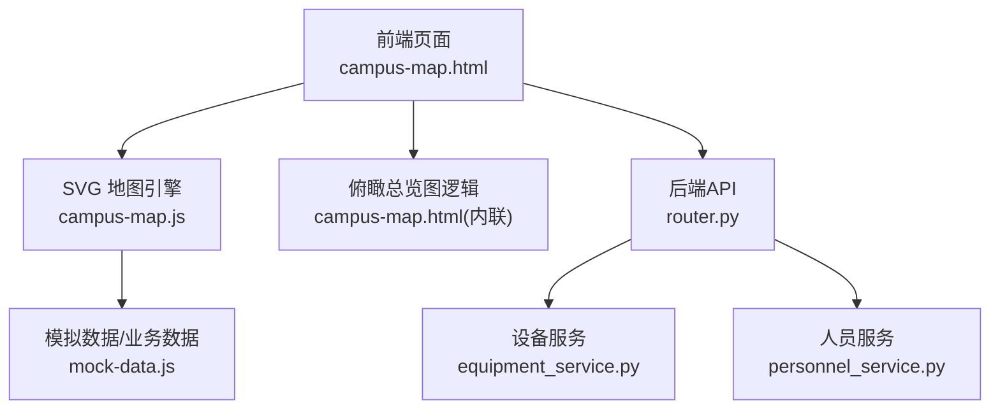
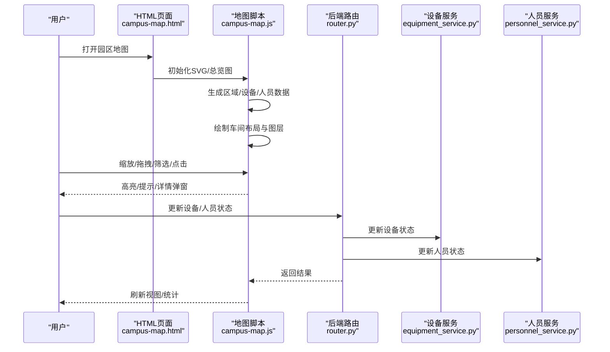
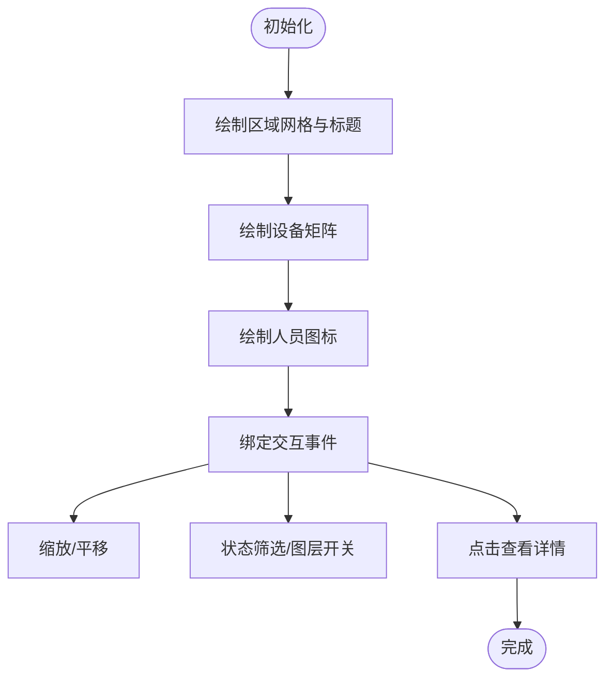
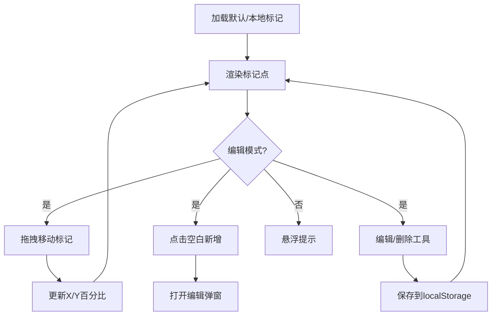
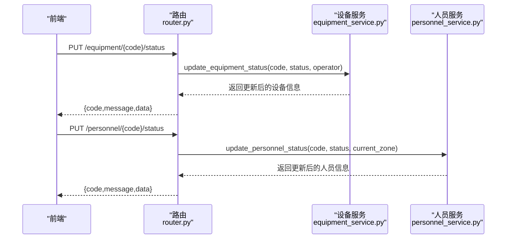
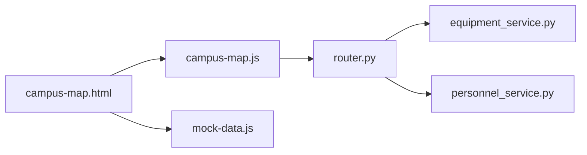

# 园区地图可视化

<cite>
**本文引用的文件**
- [campus-map.html](file://demo/campus-map.html)
- [campus-map.js](file://demo/assets/js/campus-map.js)
- [mock-data.js](file://demo/assets/js/mock-data.js)
- [CampusMapPage.tsx](file://webui_ref/client/src/pages/CampusMapPage/CampusMapPage.tsx)
- [equipment_service.py](file://backend/modules/resource/services/equipment_service.py)
- [personnel_service.py](file://backend/modules/resource/services/personnel_service.py)
- [router.py](file://backend/modules/resource/router.py)
</cite>

## 目录
1. [简介](#简介)
2. [项目结构](#项目结构)
3. [核心组件](#核心组件)
4. [架构总览](#架构总览)
5. [详细组件分析](#详细组件分析)
6. [依赖关系分析](#依赖关系分析)
7. [性能考量](#性能考量)
8. [故障排查指南](#故障排查指南)
9. [结论](#结论)
10. [附录：示例与最佳实践](#附录示例与最佳实践)

## 简介
本模块提供园区地图可视化能力，覆盖车间平面图展示、区域分布标记、设备位置标注、人员定位跟踪等核心功能。前端通过 SVG 绘制车间布局，叠加设备与人员图层，支持缩放、拖拽、筛选与详情弹窗；同时提供“资源俯瞰总览图”以卫星图为底图，支持标记点编辑、拖拽移动、保存配置到浏览器本地存储。后端提供设备与人员的查询、状态更新与统计接口，便于与地图联动实现实时更新。

## 项目结构
- 前端演示页面与脚本
  - HTML 入口：[campus-map.html](file://demo/campus-map.html)
  - SVG 地图逻辑：[campus-map.js](file://demo/assets/js/campus-map.js)
  - 模拟数据：[mock-data.js](file://demo/assets/js/mock-data.js)
- React 占位页面（后续可替换为真实实现）
  - [CampusMapPage.tsx](file://webui_ref/client/src/pages/CampusMapPage/CampusMapPage.tsx)
- 后端服务层与路由
  - 设备服务：[equipment_service.py](file://backend/modules/resource/services/equipment_service.py)
  - 人员服务：[personnel_service.py](file://backend/modules/resource/services/personnel_service.py)
  - 资源路由：[router.py](file://backend/modules/resource/router.py)

**图表来源**
- [campus-map.html:214-323](file://demo/campus-map.html#L214-L323)
- [campus-map.js:84-111](file://demo/assets/js/campus-map.js#L84-L111)
- [router.py:178-219](file://backend/modules/resource/router.py#L178-L219)
- [router.py:479-519](file://backend/modules/resource/router.py#L479-L519)

**章节来源**
- [campus-map.html:1-148](file://demo/campus-map.html#L1-L148)
- [campus-map.js:1-47](file://demo/assets/js/campus-map.js#L1-L47)
- [router.py:178-219](file://backend/modules/resource/router.py#L178-L219)
- [router.py:479-519](file://backend/modules/resource/router.py#L479-L519)

## 核心组件
- SVG 车间平面图渲染器
  - 负责绘制区域网格、标题、设备矩阵、人员图标与图例，支持缩放、平移、高亮选中区域、悬浮提示与详情弹窗。
- 俯瞰总览图（卫星图）
  - 基于图片容器与绝对定位的标记点，支持编辑模式、拖拽移动、新增/删除标记、保存/恢复配置到 localStorage。
- 图层与筛选控制
  - 设备层/人员层开关、状态筛选按钮、侧边栏图例与快速统计。
- 数据与交互
  - 模拟数据生成与刷新；后端设备/人员状态更新与统计接口预留。

**章节来源**
- [campus-map.js:113-231](file://demo/assets/js/campus-map.js#L113-L231)
- [campus-map.js:233-377](file://demo/assets/js/campus-map.js#L233-L377)
- [campus-map.html:214-323](file://demo/campus-map.html#L214-L323)
- [mock-data.js:1-315](file://demo/assets/js/mock-data.js#L1-L315)

## 架构总览
前端通过 SVG 与 DOM 组合实现地图渲染，使用事件监听处理拖拽、缩放、点击与悬浮；数据层由 mock-data.js 提供演示数据，并可对接后端 API 获取实时设备与人员信息。后端提供设备与人员状态更新及统计接口，供前端在需要时拉取或推送数据。

**图表来源**
- [campus-map.js:84-111](file://demo/assets/js/campus-map.js#L84-L111)
- [campus-map.js:439-483](file://demo/assets/js/campus-map.js#L439-L483)
- [router.py:178-219](file://backend/modules/resource/router.py#L178-L219)
- [router.py:479-519](file://backend/modules/resource/router.py#L479-L519)

## 详细组件分析

### SVG 车间平面图渲染器
- 区域网格与标题
  - 计算行列与间距，绘制区域矩形、标题背景与名称、计数文本。
- 设备矩阵
  - 根据可见设备数量动态计算列数与行高，按状态着色并绑定悬浮提示与点击事件。
- 人员图标
  - 在区域底部绘制人员小图标，显示状态颜色与“更多”计数。
- 交互
  - 鼠标按下/移动/抬起实现画布平移；滚轮实现缩放；工具栏按钮控制缩放与重置；状态筛选与图层开关触发重绘。
- 详情弹窗
  - 点击设备/人员/区域弹出详情面板，展示基本信息与列表。

**图表来源**
- [campus-map.js:113-231](file://demo/assets/js/campus-map.js#L113-L231)
- [campus-map.js:233-377](file://demo/assets/js/campus-map.js#L233-L377)
- [campus-map.js:439-483](file://demo/assets/js/campus-map.js#L439-L483)
- [campus-map.js:485-527](file://demo/assets/js/campus-map.js#L485-L527)

**章节来源**
- [campus-map.js:113-231](file://demo/assets/js/campus-map.js#L113-L231)
- [campus-map.js:233-377](file://demo/assets/js/campus-map.js#L233-L377)
- [campus-map.js:439-483](file://demo/assets/js/campus-map.js#L439-L483)
- [campus-map.js:485-527](file://demo/assets/js/campus-map.js#L485-L527)

### 俯瞰总览图（卫星图）与标记点管理
- 标记点数据结构
  - 每个标记包含 id、name、type、x、y（百分比坐标），默认集合定义于页面内联脚本。
- 持久化
  - 使用 localStorage 键保存自定义标记，支持恢复默认配置。
- 编辑模式
  - 开启后支持拖拽标记点移动、点击空白处新增、工具栏编辑/删除。
- 视图变换
  - 对图片与标记层统一应用 translate/scale 变换，保持同步缩放与平移。
- KPI 与图例
  - 顶部 KPI 条展示区域数、设备总数、在岗人员、异常车间；右下角图例说明状态含义。

**图表来源**
- [campus-map.html:429-445](file://demo/campus-map.html#L429-L445)
- [campus-map.html:556-577](file://demo/campus-map.html#L556-L577)
- [campus-map.html:579-617](file://demo/campus-map.html#L579-L617)
- [campus-map.html:619-718](file://demo/campus-map.html#L619-L718)
- [campus-map.html:720-800](file://demo/campus-map.html#L720-L800)

**章节来源**
- [campus-map.html:429-445](file://demo/campus-map.html#L429-L445)
- [campus-map.html:556-577](file://demo/campus-map.html#L556-L577)
- [campus-map.html:579-617](file://demo/campus-map.html#L579-L617)
- [campus-map.html:619-718](file://demo/campus-map.html#L619-L718)
- [campus-map.html:720-800](file://demo/campus-map.html#L720-L800)

### 图层管理与筛选
- 图层开关
  - 设备层/人员层独立开关，切换后触发重绘。
- 状态筛选
  - 全部/运行中/空闲/预警/故障/维护等按钮，点击后过滤设备与人员显示。
- 侧边栏图例与统计
  - 区域列表显示设备与人员数量；快速统计卡片汇总设备与预警情况；最新预警列表展示异常项。

**章节来源**
- [campus-map.js:497-527](file://demo/assets/js/campus-map.js#L497-L527)
- [campus-map.js:529-608](file://demo/assets/js/campus-map.js#L529-L608)
- [campus-map.html:223-244](file://demo/campus-map.html#L223-L244)

### 坐标系统与转换
- SVG 坐标系
  - viewBox 固定尺寸，preserveAspectRatio 居中适配；所有绘制基于该坐标系。
- 屏幕坐标到视图坐标
  - 缩放时根据鼠标位置计算视图坐标，确保缩放到光标位置。
- 百分比坐标
  - 俯瞰总览图的标记点使用相对于图片宽高百分比的 x/y，拖拽时按当前缩放比例换算位移为百分比增量。

**章节来源**
- [campus-map.js:84-111](file://demo/assets/js/campus-map.js#L84-L111)
- [campus-map.js:469-483](file://demo/assets/js/campus-map.js#L469-L483)
- [campus-map.html:556-577](file://demo/campus-map.html#L556-L577)
- [campus-map.html:579-617](file://demo/campus-map.html#L579-L617)

### 交互事件处理
- 平移与缩放
  - mousedown/mousemove/mouseup 实现平移；wheel 实现缩放，限制范围并更新标签。
- 悬浮与详情
  - mouseenter/mouseleave 控制 tooltip；click 打开详情弹窗。
- 工具栏与筛选
  - 按钮点击触发缩放/重置/筛选/图层切换。
- 总览图编辑
  - 编辑模式下禁用默认拖拽，启用标记点拖拽与新增。

**章节来源**
- [campus-map.js:439-483](file://demo/assets/js/campus-map.js#L439-L483)
- [campus-map.js:485-527](file://demo/assets/js/campus-map.js#L485-L527)
- [campus-map.html:404-427](file://demo/campus-map.html#L404-L427)
- [campus-map.html:579-617](file://demo/campus-map.html#L579-L617)

### 响应式适配
- SVG 自适应
  - 使用 viewBox 与 preserveAspectRatio 保证在不同容器尺寸下正确缩放。
- 全屏模式
  - 提供全屏按钮切换，提升大屏查看体验。
- 移动端友好
  - 样式采用相对单位与弹性布局，避免固定宽度导致溢出。

**章节来源**
- [campus-map.js:84-111](file://demo/assets/js/campus-map.js#L84-L111)
- [campus-map.html:417-427](file://demo/campus-map.html#L417-L427)

### 与后端集成（设备与人员）
- 设备状态更新
  - 路由 PUT /api/resource/equipment/{code}/status，调用设备服务更新状态。
- 人员状态更新
  - 路由 PUT /api/resource/personnel/{code}/status，调用人员服务更新状态与所在区域。
- 统计数据
  - 设备与人员统计接口用于看板与地图聚合展示。

**图表来源**
- [router.py:178-219](file://backend/modules/resource/router.py#L178-L219)
- [router.py:479-519](file://backend/modules/resource/router.py#L479-L519)
- [equipment_service.py:262-301](file://backend/modules/resource/services/equipment_service.py#L262-L301)
- [personnel_service.py:286-322](file://backend/modules/resource/services/personnel_service.py#L286-L322)

**章节来源**
- [router.py:178-219](file://backend/modules/resource/router.py#L178-L219)
- [router.py:479-519](file://backend/modules/resource/router.py#L479-L519)
- [equipment_service.py:262-301](file://backend/modules/resource/services/equipment_service.py#L262-L301)
- [personnel_service.py:286-322](file://backend/modules/resource/services/personnel_service.py#L286-L322)

## 依赖关系分析
- 前端内部依赖
  - campus-map.html 引入 campus-map.js 与 mock-data.js，并在内联脚本中实现俯瞰总览图逻辑。
  - campus-map.js 依赖 SVG API、DOM 操作与事件系统。
- 前后端耦合点
  - 前端可通过 router.py 暴露的设备/人员接口与后端服务层对接，实现数据同步与状态更新。
- 潜在循环依赖
  - 当前前端脚本无相互引用循环；后端路由与服务层单向依赖，无循环。

**图表来源**
- [campus-map.html:401-403](file://demo/campus-map.html#L401-L403)
- [router.py:178-219](file://backend/modules/resource/router.py#L178-L219)
- [router.py:479-519](file://backend/modules/resource/router.py#L479-L519)

**章节来源**
- [campus-map.html:401-403](file://demo/campus-map.html#L401-L403)
- [router.py:178-219](file://backend/modules/resource/router.py#L178-L219)
- [router.py:479-519](file://backend/modules/resource/router.py#L479-L519)

## 性能考量
- 渲染优化
  - 设备矩阵按可视数量计算行列，避免过多节点；人员图标限制最大显示数量，超出以“+N”表示。
- 事件节流
  - wheel 事件使用 passive:false 阻止默认滚动，减少抖动；拖拽过程中仅更新必要属性。
- 数据刷新
  - 提供 CampusMap.refresh 方法，批量重新生成数据并重绘，适合定时刷新场景。
- 内存管理
  - 重绘前清空容器 innerHTML，避免残留节点；tooltip 复用单一元素，减少 DOM 创建。

**章节来源**
- [campus-map.js:233-377](file://demo/assets/js/campus-map.js#L233-L377)
- [campus-map.js:469-483](file://demo/assets/js/campus-map.js#L469-L483)
- [campus-map.js:84-111](file://demo/assets/js/campus-map.js#L84-L111)

## 故障排查指南
- 地图不显示
  - 检查容器 ID 是否存在；确认 SVG 已创建并插入 DOM。
- 缩放/平移异常
  - 确认事件绑定是否生效；检查 transform 计算逻辑与边界限制。
- 标记点无法拖拽
  - 确认编辑模式已开启；检查事件冒泡与目标判断。
- 数据不同步
  - 核对后端接口路径与参数；检查状态枚举值是否合法。
- 本地存储失败
  - 检查浏览器 localStorage 权限；捕获异常并提示用户。

**章节来源**
- [campus-map.js:84-111](file://demo/assets/js/campus-map.js#L84-L111)
- [campus-map.js:439-483](file://demo/assets/js/campus-map.js#L439-L483)
- [campus-map.html:579-617](file://demo/campus-map.html#L579-L617)
- [router.py:178-219](file://backend/modules/resource/router.py#L178-L219)
- [router.py:479-519](file://backend/modules/resource/router.py#L479-L519)

## 结论
本模块通过 SVG 与 DOM 的组合实现了灵活的园区地图可视化，支持车间布局绘制、设备与人员图层管理、缩放拖拽交互、筛选与详情展示，并提供俯瞰总览图的标记点编辑与持久化。后端接口为设备与人员状态更新与统计提供了支撑，便于与前端联动实现实时更新。整体架构清晰、扩展性强，适合在生产环境中接入真实数据源并持续迭代。

## 附录：示例与最佳实践
- 绘制车间布局
  - 参考区域网格绘制与标题渲染流程，调整行列与间距以适应实际车间尺寸。
  - 参考路径：[绘制区域与标题:113-231](file://demo/assets/js/campus-map.js#L113-L231)
- 添加设备标记
  - 在设备矩阵中按状态着色，并绑定悬浮提示与点击事件。
  - 参考路径：[设备矩阵绘制:233-296](file://demo/assets/js/campus-map.js#L233-L296)
- 实现拖拽操作
  - 在俯瞰总览图中开启编辑模式，绑定 mousedown/mousemove/mouseup 实现拖拽移动。
  - 参考路径：[拖拽实现:579-617](file://demo/campus-map.html#L579-L617)
- 实时更新位置信息
  - 通过后端接口更新设备/人员状态，前端调用 CampusMap.refresh 或局部重绘。
  - 参考路径：[刷新接口:105-111](file://demo/assets/js/campus-map.js#L105-L111)、[状态更新路由:178-219](file://backend/modules/resource/router.py#L178-L219)、[人员状态更新路由:479-519](file://backend/modules/resource/router.py#L479-L519)

**章节来源**
- [campus-map.js:113-231](file://demo/assets/js/campus-map.js#L113-L231)
- [campus-map.js:233-296](file://demo/assets/js/campus-map.js#L233-L296)
- [campus-map.html:579-617](file://demo/campus-map.html#L579-L617)
- [campus-map.js:105-111](file://demo/assets/js/campus-map.js#L105-L111)
- [router.py:178-219](file://backend/modules/resource/router.py#L178-L219)
- [router.py:479-519](file://backend/modules/resource/router.py#L479-L519)