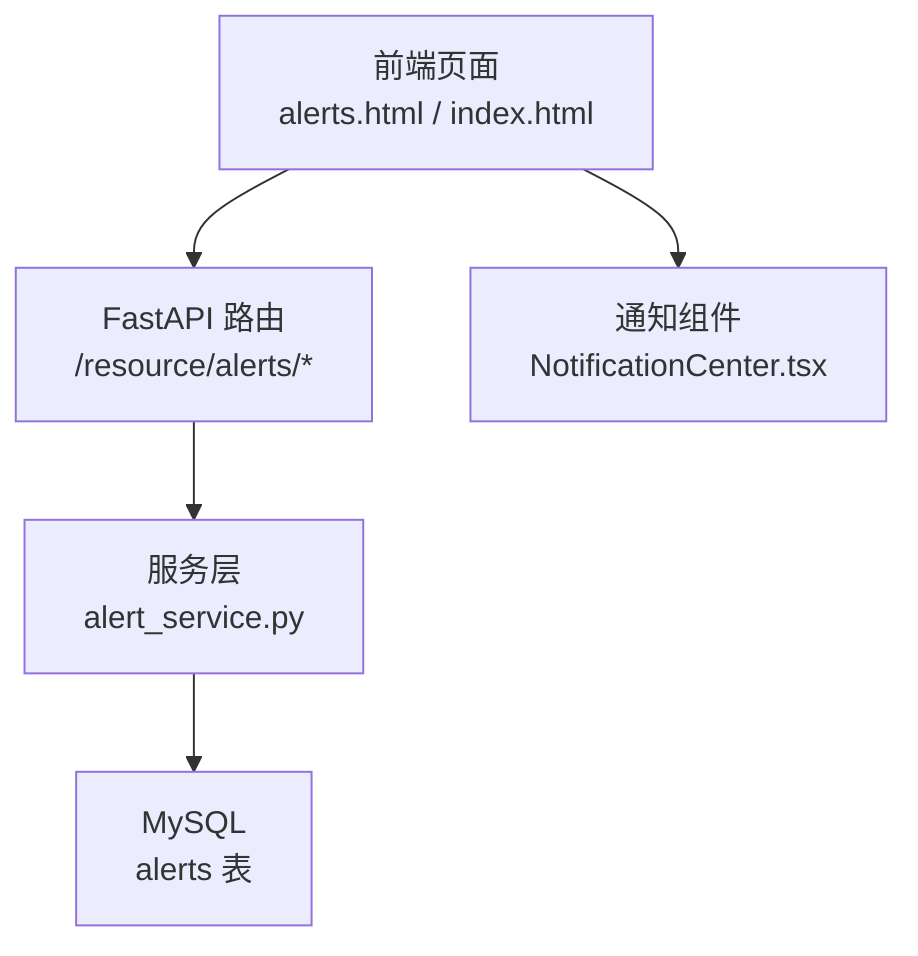
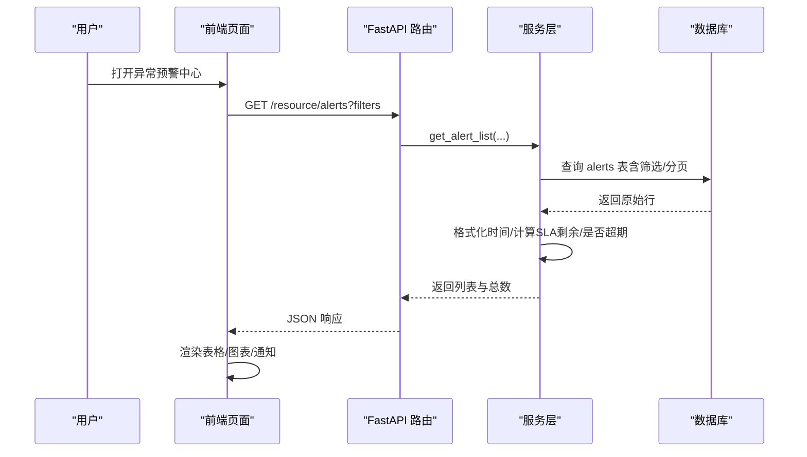
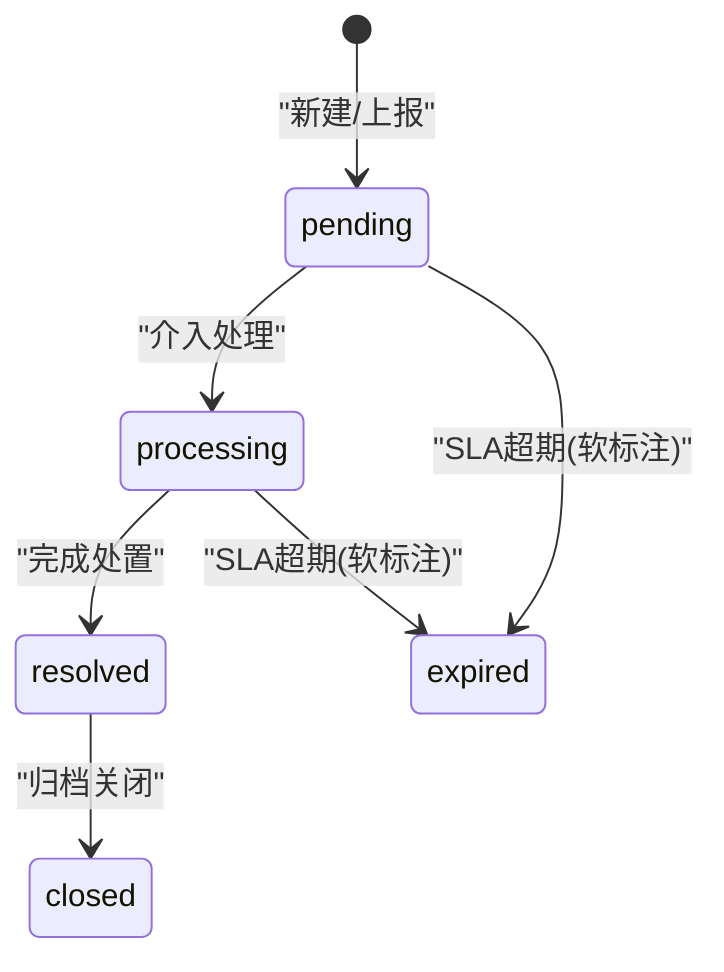
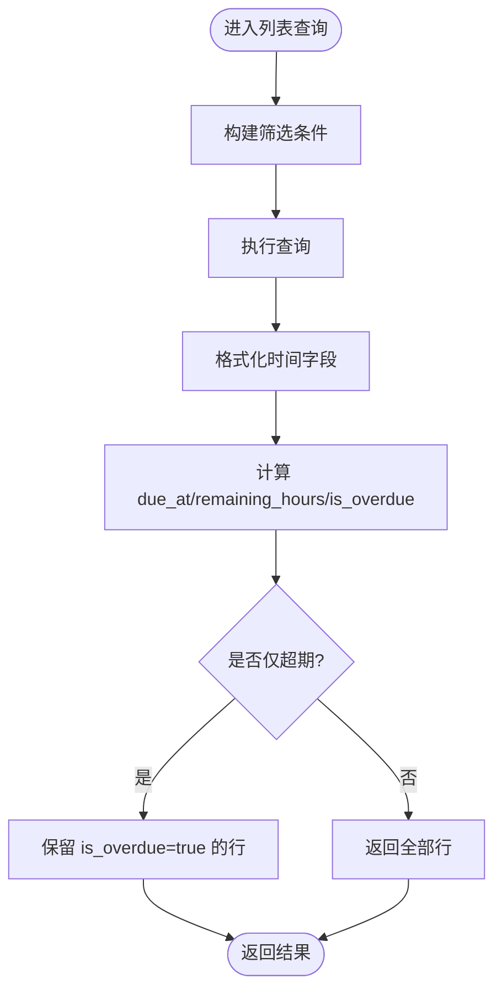

# 异常预警中心

<cite>
**本文引用的文件**
- [alert_service.py](file://backend/modules/resource/services/alert_service.py)
- [router.py](file://backend/modules/resource/router.py)
- [schemas.py](file://backend/modules/resource/schemas.py)
- [resource_schema.sql](file://backend/sql/resource_schema.sql)
- [AlertCenterPage.tsx](file://webui_ref/client/src/pages/AlertCenterPage/AlertCenterPage.tsx)
- [NotificationCenter.tsx](file://webui_ref/client/src/components/NotificationCenter.tsx)
- [alerts.html](file://demo/alerts.html)
- [index.html](file://static/index.html)
</cite>

## 目录
1. [简介](#简介)
2. [项目结构](#项目结构)
3. [核心组件](#核心组件)
4. [架构总览](#架构总览)
5. [详细组件分析](#详细组件分析)
6. [依赖关系分析](#依赖关系分析)
7. [性能考虑](#性能考虑)
8. [故障排查指南](#故障排查指南)
9. [结论](#结论)
10. [附录：API与数据模型速查](#附录api与数据模型速查)

## 简介
本模块为“异常预警中心”，提供分级告警展示、SLA管理、处理流程跟踪、统计分析等能力。支持预警规则配置（类型、级别、来源、关联对象）、告警级别定义（严重/高/中/低）、处理状态流转（待处理→处理中→已解决→已关闭/超期）、通知机制（前端通知与页面提示）以及报表生成（KPI、分布图、趋势）。后端通过 FastAPI 暴露 RESTful API，服务层封装业务逻辑与数据库访问；前端包含占位页面与演示页，用于交互与可视化。

## 项目结构
- 后端服务层：位于 backend/modules/resource/services/alert_service.py，负责预警的创建、查询、更新、升级、批量操作与统计。
- 路由层：位于 backend/modules/resource/router.py，定义 /resource/alerts 系列接口，统一入参校验与异常处理。
- 数据模型：backend/modules/resource/schemas.py 定义了 AlertResponse 等响应结构；数据库表结构在 backend/sql/resource_schema.sql。
- 前端：webui_ref/client 中的 AlertCenterPage 为占位页面；demo/alerts.html 与 static/index.html 提供完整的演示界面与交互逻辑。

图表来源
- [router.py:949-1075](file://backend/modules/resource/router.py#L949-L1075)
- [alert_service.py:47-399](file://backend/modules/resource/services/alert_service.py#L47-L399)
- [resource_schema.sql:120-163](file://backend/sql/resource_schema.sql#L120-L163)
- [NotificationCenter.tsx:79-129](file://webui_ref/client/src/components/NotificationCenter.tsx#L79-L129)

章节来源
- [router.py:855-1075](file://backend/modules/resource/router.py#L855-L1075)
- [alert_service.py:1-399](file://backend/modules/resource/services/alert_service.py#L1-L399)
- [resource_schema.sql:120-163](file://backend/sql/resource_schema.sql#L120-L163)

## 核心组件
- 服务层（alert_service.py）
  - 列表查询：支持分页、多条件筛选、关键词搜索、软超期过滤。
  - 详情获取：按 ID 查询并格式化时间字段与 SLA 剩余时间。
  - 创建/更新：自动填充默认 SLA、校验枚举值、状态变更时自动补齐时间戳。
  - 升级上报：记录升级目标与原因到备注。
  - 批量处理：批量更新状态，并在特定状态变更时写入时间戳。
  - 统计分析：KPI、级别/状态/类型分布、交叉分布、近7天趋势、升级数量。
- 路由层（router.py）
  - GET /resource/alerts：列表与筛选。
  - GET /resource/alerts/stats：统计数据。
  - GET /resource/alerts/{id}：详情。
  - POST /resource/alerts：新增。
  - PUT /resource/alerts/{id}：更新。
  - POST /resource/alerts/{id}/handle：处理（介入/处置/验证）。
  - POST /resource/alerts/{id}/escalate：升级上报。
  - POST /resource/alerts/batch：批量状态更新。
- 数据模型（schemas.py）
  - AlertResponse、AlertListResponse 用于统一返回结构。
- 数据库（resource_schema.sql）
  - alerts 表：包含预警编号、类型、级别、标题、描述、来源、关联对象、区域/场地、发现人/时间、SLA、升级信息、状态、处理人/部门、各阶段时间戳、处置方案、整改措施、预防措施、效果验证、损失金额、影响工时、附件数、备注等。

章节来源
- [alert_service.py:47-399](file://backend/modules/resource/services/alert_service.py#L47-L399)
- [router.py:855-1075](file://backend/modules/resource/router.py#L855-L1075)
- [schemas.py:180-202](file://backend/modules/resource/schemas.py#L180-L202)
- [resource_schema.sql:120-163](file://backend/sql/resource_schema.sql#L120-L163)

## 架构总览
系统采用前后端分离架构。前端通过 HTTP 调用后端路由，路由将请求转发至服务层进行业务处理与数据持久化。服务层对数据进行校验、计算（如 SLA 剩余时间、是否超期），并返回结构化结果给前端。前端使用 ECharts 等库进行可视化展示，并通过通知组件提醒用户。

图表来源
- [router.py:949-978](file://backend/modules/resource/router.py#L949-L978)
- [alert_service.py:47-140](file://backend/modules/resource/services/alert_service.py#L47-L140)
- [resource_schema.sql:120-163](file://backend/sql/resource_schema.sql#L120-L163)

## 详细组件分析

### 预警规则配置与级别定义
- 预警类型：任务延迟、质量缺陷、设备故障、物料缺件、人员缺口、安全隐患、计划超期、工艺违规、外部协调、其他。
- 级别：critical（严重）、high（高）、medium（中）、low（低）。
- 来源：系统自动、人工上报、设备报警、运营巡检、质量巡检、其他。
- 关联对象：任务、设备、人员、物料、项目、车间、无。
- 默认 SLA：根据级别自动填充（严重4小时、高8小时、中24小时、低72小时）。

章节来源
- [alert_service.py:12-30](file://backend/modules/resource/services/alert_service.py#L12-L30)
- [resource_schema.sql:120-138](file://backend/sql/resource_schema.sql#L120-L138)

### 处理状态流转
- 状态：pending（待处理）、processing（处理中）、resolved（已解决）、closed（已关闭）、expired（已超期，软标注）。
- 状态变更时自动补齐时间戳：
  - processing：记录 processing_started_at。
  - resolved：记录 resolved_at。
  - closed：记录 closed_at。
- 升级上报：设置 escalated=1，记录 escalated_to 与原因到 remark。

图表来源
- [alert_service.py:257-314](file://backend/modules/resource/services/alert_service.py#L257-L314)
- [resource_schema.sql:139-148](file://backend/sql/resource_schema.sql#L139-L148)

### SLA管理与超期计算
- 默认 SLA 由级别决定，可在创建/更新时覆盖。
- 超期判断：raised_at + sla_hours < NOW() 且状态为 pending/processing 时标记 is_overdue=true。
- 列表查询支持 overdue_only 过滤，仅显示软超期的预警。

图表来源
- [alert_service.py:47-140](file://backend/modules/resource/services/alert_service.py#L47-L140)
- [alert_service.py:143-172](file://backend/modules/resource/services/alert_service.py#L143-L172)

### 通知机制
- 前端通知组件 NotificationCenter.tsx 提供未读计数、标记已读等功能，用于展示系统通知。
- 演示页面 alerts.html 与 static/index.html 提供完整的预警列表、筛选、分页、处理、关闭等操作，并在操作后刷新列表或弹出提示。

章节来源
- [NotificationCenter.tsx:79-129](file://webui_ref/client/src/components/NotificationCenter.tsx#L79-L129)
- [alerts.html:1-200](file://demo/alerts.html#L1-L200)
- [index.html:9518-9532](file://static/index.html#L9518-L9532)

### 报表生成与统计分析
- KPI：总数、严重数、高+严重数、未解决数、待处理/处理中/已解决/已关闭、超期数、升级数。
- 分布：级别分布、状态分布、类型分布、类型×状态交叉分布。
- 趋势：近7天新增趋势。
- 接口：GET /resource/alerts/stats。

章节来源
- [alert_service.py:337-399](file://backend/modules/resource/services/alert_service.py#L337-L399)
- [router.py:981-988](file://backend/modules/resource/router.py#L981-L988)

### 代码示例路径（接收预警消息、分级处理、跟踪进度、生成报告）
- 接收预警消息（新增）：POST /resource/alerts
  - 参考：[router.py:1006-1016](file://backend/modules/resource/router.py#L1006-L1016)
  - 服务实现：[alert_service.py:188-254](file://backend/modules/resource/services/alert_service.py#L188-L254)
- 分级处理（处理/验证）：POST /resource/alerts/{id}/handle
  - 参考：[router.py:1035-1051](file://backend/modules/resource/router.py#L1035-L1051)
  - 服务实现：[alert_service.py:257-302](file://backend/modules/resource/services/alert_service.py#L257-L302)
- 跟踪处理进度（详情/列表）：GET /resource/alerts/{id} 与 GET /resource/alerts
  - 参考：[router.py:991-1003](file://backend/modules/resource/router.py#L991-L1003)
  - 服务实现：[alert_service.py:175-185](file://backend/modules/resource/services/alert_service.py#L175-L185)、[alert_service.py:47-140](file://backend/modules/resource/services/alert_service.py#L47-L140)
- 生成预警分析报告（统计）：GET /resource/alerts/stats
  - 参考：[router.py:981-988](file://backend/modules/resource/router.py#L981-L988)
  - 服务实现：[alert_service.py:337-399](file://backend/modules/resource/services/alert_service.py#L337-L399)

## 依赖关系分析
- 路由层依赖服务层：所有 /resource/alerts 接口均调用 alert_service.py 中的函数。
- 服务层依赖数据库：通过 query_all/query_one/execute/execute_last_id 访问 MySQL。
- 前端依赖路由：alerts.html 与 index.html 通过 fetch 调用后端接口。
- 通知组件独立于预警中心，但可复用同一套通知样式与交互模式。

图表来源
- [router.py:949-1075](file://backend/modules/resource/router.py#L949-L1075)
- [alert_service.py:47-399](file://backend/modules/resource/services/alert_service.py#L47-L399)
- [resource_schema.sql:120-163](file://backend/sql/resource_schema.sql#L120-L163)
- [NotificationCenter.tsx:79-129](file://webui_ref/client/src/components/NotificationCenter.tsx#L79-L129)

章节来源
- [router.py:949-1075](file://backend/modules/resource/router.py#L949-L1075)
- [alert_service.py:47-399](file://backend/modules/resource/services/alert_service.py#L47-L399)

## 性能考虑
- 列表查询使用索引：level、status、raised_at、related_type+related_id、zone_code、related_equipment、handler 等字段建有索引，提升筛选与排序性能。
- 分页与限制：LIMIT/OFFSET 控制每页数据量，避免一次性加载过多数据。
- 软超期计算在服务层进行，不写库，减少数据库压力。
- 批量更新使用 IN 子句与事务性语句，提高批量操作效率。

章节来源
- [resource_schema.sql:155-163](file://backend/sql/resource_schema.sql#L155-L163)
- [alert_service.py:108-123](file://backend/modules/resource/services/alert_service.py#L108-L123)
- [alert_service.py:317-334](file://backend/modules/resource/services/alert_service.py#L317-L334)

## 故障排查指南
- 常见错误：
  - 无效预警类型/级别/状态：服务层会抛出 ValueError，路由层转换为 400 错误。
  - 预警不存在：更新/详情时若未找到记录，返回 404。
  - 批量更新失败：捕获异常并记录日志，返回 0 表示未更新。
- 排查步骤：
  - 检查请求参数是否符合枚举值。
  - 确认预警 ID 是否存在。
  - 查看后端日志输出（logger.error）定位具体错误。
  - 核对数据库表结构与索引是否正确初始化。

章节来源
- [alert_service.py:198-203](file://backend/modules/resource/services/alert_service.py#L198-L203)
- [alert_service.py:257-302](file://backend/modules/resource/services/alert_service.py#L257-L302)
- [alert_service.py:329-334](file://backend/modules/resource/services/alert_service.py#L329-L334)
- [router.py:1019-1032](file://backend/modules/resource/router.py#L1019-L1032)

## 结论
异常预警中心模块提供了完整的预警生命周期管理能力，涵盖规则配置、级别定义、状态流转、SLA 管理、通知与报表。后端通过清晰的分层设计与严格的参数校验，确保数据一致性与可维护性；前端提供直观的交互与可视化，便于用户快速定位与处理异常。建议在生产环境中结合定时任务或事件驱动机制，实现自动升级与通知推送，进一步提升响应效率。

## 附录：API与数据模型速查
- 列表与筛选：GET /resource/alerts
  - 参数：page、page_size、alert_type、level、status、source、zone_code、assembly_site、handler、raised_start、raised_end、keyword、escalated_only、overdue_only
  - 参考：[router.py:949-978](file://backend/modules/resource/router.py#L949-L978)
- 统计：GET /resource/alerts/stats
  - 返回：KPI、分布、趋势等
  - 参考：[router.py:981-988](file://backend/modules/resource/router.py#L981-L988)
- 详情：GET /resource/alerts/{id}
  - 参考：[router.py:991-1003](file://backend/modules/resource/router.py#L991-L1003)
- 新增：POST /resource/alerts
  - 参考：[router.py:1006-1016](file://backend/modules/resource/router.py#L1006-L1016)
- 更新：PUT /resource/alerts/{id}
  - 参考：[router.py:1019-1032](file://backend/modules/resource/router.py#L1019-L1032)
- 处理：POST /resource/alerts/{id}/handle
  - 参考：[router.py:1035-1051](file://backend/modules/resource/router.py#L1035-L1051)
- 升级：POST /resource/alerts/{id}/escalate
  - 参考：[router.py:1054-1064](file://backend/modules/resource/router.py#L1054-L1064)
- 批量：POST /resource/alerts/batch
  - 参考：[router.py:1067-1075](file://backend/modules/resource/router.py#L1067-L1075)

章节来源
- [router.py:949-1075](file://backend/modules/resource/router.py#L949-L1075)
- [schemas.py:180-202](file://backend/modules/resource/schemas.py#L180-L202)