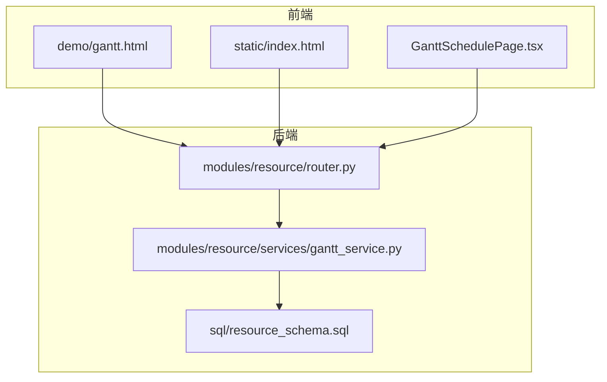
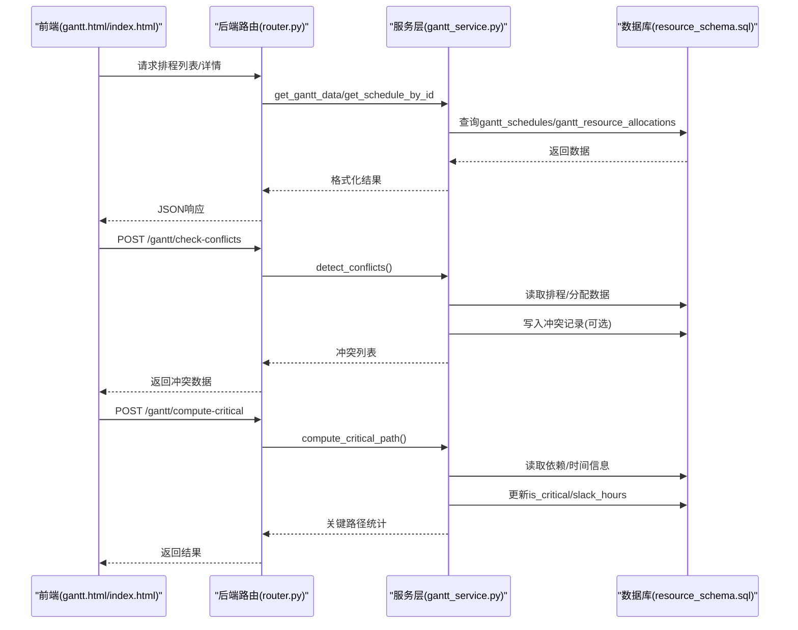
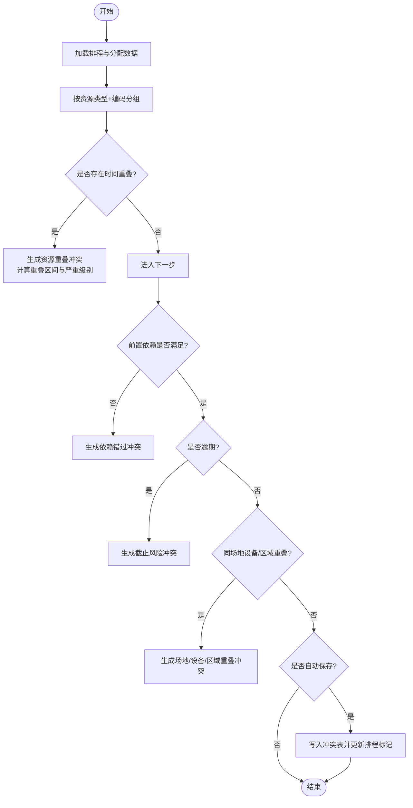
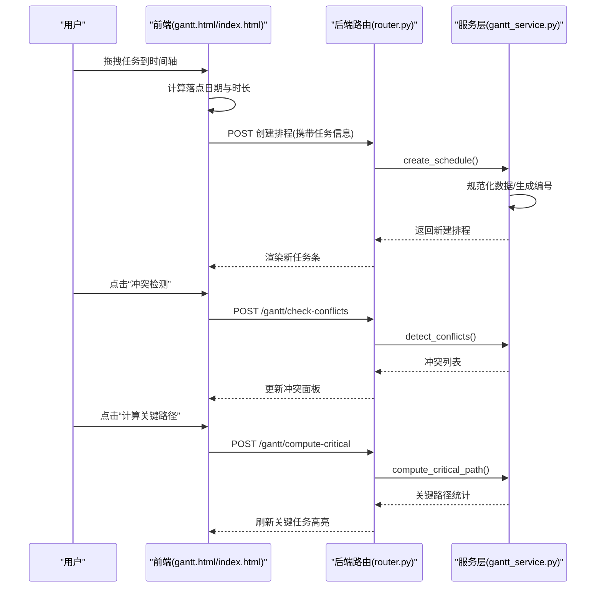
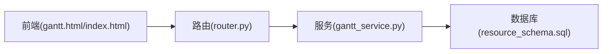

# 甘特图排程

<cite>
**本文引用的文件**
- [gantt_service.py](file://backend/modules/resource/services/gantt_service.py)
- [router.py](file://backend/modules/resource/router.py)
- [resource_schema.sql](file://backend/sql/resource_schema.sql)
- [gantt.html](file://demo/gantt.html)
- [index.html](file://static/index.html)
- [GanttSchedulePage.tsx](file://webui_ref/client/src/pages/GanttSchedulePage/GanttSchedulePage.tsx)
</cite>

## 目录
1. [简介](#简介)
2. [项目结构](#项目结构)
3. [核心组件](#核心组件)
4. [架构总览](#架构总览)
5. [详细组件分析](#详细组件分析)
6. [依赖关系分析](#依赖关系分析)
7. [性能考虑](#性能考虑)
8. [故障排查指南](#故障排查指南)
9. [结论](#结论)
10. [附录：API与数据模型](#附录api与数据模型)

## 简介
本模块为“试制资源数智化管理系统”的甘特图排程能力，提供任务时间线可视化、拖拽调度、资源冲突检测、关键路径分析与状态批量更新等核心功能。后端通过服务层实现排程CRUD、冲突检测、关键路径计算；前端在静态页面与示例页面中提供时间轴渲染、拖拽创建/调整、冲突面板与统计看板。

## 项目结构
- 后端服务层
  - 甘特图服务：负责排程数据读写、冲突检测、关键路径计算、资源分配管理、状态批量更新等。
  - 路由层：暴露REST接口供前端调用（如创建/更新排程、冲突检测、关键路径计算、冲突列表与处理）。
  - 数据库Schema：定义排程、资源分配、冲突等表结构。
- 前端展示与交互
  - demo/gantt.html：完整的甘特图演示页，包含工具栏、筛选、时间轴、任务条、详情弹窗、冲突面板、统计卡片等。
  - static/index.html：集成到主站点的甘特图引擎，含拖拽创建、本地冲突检测、关键路径计算等逻辑。
  - webui_ref/client/.../GanttSchedulePage.tsx：占位页面，预留后续集成入口。

**图表来源**
- [router.py:1300-1454](file://backend/modules/resource/router.py#L1300-L1454)
- [gantt_service.py:176-335](file://backend/modules/resource/services/gantt_service.py#L176-L335)
- [resource_schema.sql:288-308](file://backend/sql/resource_schema.sql#L288-L308)

**章节来源**
- [gantt_service.py:176-335](file://backend/modules/resource/services/gantt_service.py#L176-L335)
- [router.py:1300-1454](file://backend/modules/resource/router.py#L1300-L1454)
- [resource_schema.sql:288-308](file://backend/sql/resource_schema.sql#L288-L308)

## 核心组件
- 排程服务（gantt_service.py）
  - 排程CRUD：创建、查询、更新、删除，支持分页与多条件筛选。
  - 资源分配：增删查与批量分配。
  - 冲突检测：资源重叠、时间重叠、依赖错过、截止风险、同场地设备/区域重叠。
  - 关键路径：拓扑排序+ES/EF/LF/LS计算，标记关键任务与浮动时间。
  - 状态批量更新：自动填充实际开始/结束时间与进度。
- 路由层（router.py）
  - 暴露REST API：排程列表/详情、资源分配、冲突检测与处理、关键路径计算、批量状态更新等。
- 前端（gantt.html / index.html）
  - 时间轴渲染、缩放、日期范围选择、筛选过滤。
  - 拖拽创建任务、拖拽调整任务起止时间。
  - 冲突面板展示与忽略操作。
  - 统计卡片与趋势图。

**章节来源**
- [gantt_service.py:396-550](file://backend/modules/resource/services/gantt_service.py#L396-L550)
- [gantt_service.py:608-724](file://backend/modules/resource/services/gantt_service.py#L608-L724)
- [gantt_service.py:775-1076](file://backend/modules/resource/services/gantt_service.py#L775-L1076)
- [gantt_service.py:1255-1372](file://backend/modules/resource/services/gantt_service.py#L1255-L1372)
- [router.py:1300-1454](file://backend/modules/resource/router.py#L1300-L1454)
- [gantt.html:1-800](file://demo/gantt.html#L1-L800)
- [index.html:10844-11346](file://static/index.html#L10844-L11346)

## 架构总览
整体采用前后端分离架构：前端通过HTTP调用后端REST接口获取排程数据、执行冲突检测与关键路径计算；后端服务层封装业务逻辑并持久化至数据库。

**图表来源**
- [router.py:1347-1408](file://backend/modules/resource/router.py#L1347-L1408)
- [gantt_service.py:176-335](file://backend/modules/resource/services/gantt_service.py#L176-L335)
- [gantt_service.py:775-1076](file://backend/modules/resource/services/gantt_service.py#L775-L1076)
- [gantt_service.py:1255-1372](file://backend/modules/resource/services/gantt_service.py#L1255-L1372)

## 详细组件分析

### 排程服务（gantt_service.py）
- 数据规范化与格式化
  - 自动计算计划工时与进度（可手动覆盖）。
  - 统一时间字段格式与数值类型转换。
- 排程CRUD
  - 创建时生成唯一编号、校验枚举值、序列化前置依赖。
  - 更新时校验并仅更新传入字段，维护更新时间戳。
  - 删除时级联清理资源分配与冲突记录。
- 资源分配
  - 单条/批量新增、按排程或资源维度查询、删除。
- 冲突检测
  - 资源重叠：按资源类型+编码分组，两两比较时间段，计算重叠小时数与严重级别。
  - 依赖错过：检查前置任务结束时间是否晚于当前任务开始时间。
  - 截止风险：对未完成的过期任务进行预警。
  - 同场地设备/区域重叠：按装配场地与设备/区域分组，检测时间重叠。
  - 可选自动保存冲突记录，并回写排程的冲突计数与标记。
- 关键路径计算
  - 构建DAG（前驱/后继），Kahn拓扑排序。
  - 正向计算最早开始/结束（ES/EF），反向计算最晚开始/结束（LS/LF）。
  - 根据松弛时间（slack）标记关键任务，并持久化更新。
- 状态批量更新
  - 批量切换状态，自动设置实际开始/结束时间，必要时将进度置为100%。

**图表来源**
- [gantt_service.py:775-1076](file://backend/modules/resource/services/gantt_service.py#L775-L1076)

**章节来源**
- [gantt_service.py:100-173](file://backend/modules/resource/services/gantt_service.py#L100-L173)
- [gantt_service.py:396-550](file://backend/modules/resource/services/gantt_service.py#L396-L550)
- [gantt_service.py:608-724](file://backend/modules/resource/services/gantt_service.py#L608-L724)
- [gantt_service.py:775-1076](file://backend/modules/resource/services/gantt_service.py#L775-L1076)
- [gantt_service.py:1255-1372](file://backend/modules/resource/services/gantt_service.py#L1255-L1372)
- [gantt_service.py:1375-1427](file://backend/modules/resource/services/gantt_service.py#L1375-L1427)

### 路由层（router.py）
- 提供REST接口：
  - 资源分配：列表、新增、删除、批量分配。
  - 冲突检测：触发检测并返回结果。
  - 冲突列表：分页查询，支持类型、严重级别、状态、装配场地、关联排程过滤。
  - 冲突处理：解决与忽略。
  - 关键路径：计算并更新关键任务标记。
  - 批量状态更新：批量切换排程状态。

**章节来源**
- [router.py:1300-1454](file://backend/modules/resource/router.py#L1300-L1454)

### 前端交互（gantt.html / index.html）
- 时间轴与工具栏
  - 缩放切换（日/周/月）、日期范围选择、今日定位。
  - 筛选器：任务类别、状态、优先级、图例。
- 任务条渲染
  - 显示任务名称、阶段、颜色标签、进度条、冲突角标。
  - 悬停提示：详细信息与进度。
- 拖拽调度
  - 从任务库拖拽创建新排程，落点映射到时间列，自动生成起止时间与基础属性。
  - 支持锁定/解锁某任务的拖拽行为。
- 冲突面板
  - 展示未解决的冲突，支持忽略操作。
- 关键路径
  - 前端本地计算关键路径（基于依赖与持续时间），用于高亮关键任务。

**图表来源**
- [gantt.html:1564-1603](file://demo/gantt.html#L1564-L1603)
- [index.html:10844-11346](file://static/index.html#L10844-L11346)
- [router.py:1347-1408](file://backend/modules/resource/router.py#L1347-L1408)
- [gantt_service.py:396-550](file://backend/modules/resource/services/gantt_service.py#L396-L550)
- [gantt_service.py:775-1076](file://backend/modules/resource/services/gantt_service.py#L775-L1076)
- [gantt_service.py:1255-1372](file://backend/modules/resource/services/gantt_service.py#L1255-L1372)

**章节来源**
- [gantt.html:1-800](file://demo/gantt.html#L1-L800)
- [index.html:10844-11346](file://static/index.html#L10844-L11346)

### 数据库设计（resource_schema.sql）
- gantt_conflicts表
  - 关键字段：冲突编号、类型、严重级别、关联排程A/B、资源信息、重叠起止时间、重叠小时数、建议、状态、装配场地、检测时间等。
  - 用于持久化冲突记录，支持后续审计与报表。

**章节来源**
- [resource_schema.sql:288-308](file://backend/sql/resource_schema.sql#L288-L308)

## 依赖关系分析
- 服务层依赖
  - 数据库访问：query_all/query_one/execute/execute_last_id。
  - 日志：logger。
- 路由层依赖
  - 服务层函数：get_gantt_data、create/update/delete、list_allocations、add/remove/batch_allocate、detect_conflicts、list_conflicts、resolve/ignore_conflict、compute_critical_path、batch_update_status。
- 前端依赖
  - 样式与图标：Tailwind、Lucide。
  - 交互：原生Drag&Drop API、DOM操作、事件监听。

**图表来源**
- [router.py:1300-1454](file://backend/modules/resource/router.py#L1300-L1454)
- [gantt_service.py:176-335](file://backend/modules/resource/services/gantt_service.py#L176-L335)
- [resource_schema.sql:288-308](file://backend/sql/resource_schema.sql#L288-L308)

**章节来源**
- [router.py:1300-1454](file://backend/modules/resource/router.py#L1300-L1454)
- [gantt_service.py:176-335](file://backend/modules/resource/services/gantt_service.py#L176-L335)

## 性能考虑
- 冲突检测
  - 资源重叠：按资源类型+编码分组后两两比较，复杂度O(N^2)，建议在大数据量时增加索引与分批处理。
  - 依赖错过与截止风险：线性扫描，开销较低。
  - 同场地设备/区域重叠：分组后两两比较，注意排除父子任务关系。
- 关键路径计算
  - 拓扑排序与ES/EF/LF/LS计算为线性复杂度O(V+E)，适合大规模任务图。
- 前端渲染
  - 时间轴滚动与缩放需避免频繁重绘；建议使用虚拟滚动或按需渲染。
  - 拖拽过程中减少DOM操作，合并更新。

[本节为通用指导，不直接分析具体文件]

## 故障排查指南
- 冲突检测失败
  - 检查数据库连接与权限；查看服务层日志输出。
  - 确认排程与资源分配的时间字段有效且可解析。
- 关键路径计算异常
  - 检查依赖关系是否存在环；服务层在更新依赖时会进行环检测并回滚。
  - 确认任务持续时间与起止时间一致。
- 前端拖拽无效
  - 检查dragover/drop事件绑定与数据传递；确保时间轴容器可接收drop。
  - 确认日期解析函数与列宽计算正确。

**章节来源**
- [gantt_service.py:553-605](file://backend/modules/resource/services/gantt_service.py#L553-L605)
- [gantt_service.py:775-1076](file://backend/modules/resource/services/gantt_service.py#L775-L1076)
- [gantt_service.py:1255-1372](file://backend/modules/resource/services/gantt_service.py#L1255-L1372)
- [index.html:11317-11331](file://static/index.html#L11317-L11331)

## 结论
本模块提供了完整的甘特图排程能力：从任务时间线可视化、拖拽调度，到资源冲突检测与关键路径分析，形成闭环的排程优化流程。后端服务层实现了稳健的冲突检测算法与关键路径计算，前端提供了直观的交互界面与实时反馈。建议在生产环境中结合数据库索引与分页策略，进一步优化大数据量下的性能表现。

[本节为总结性内容，不直接分析具体文件]

## 附录：API与数据模型
- 主要API
  - 资源分配
    - GET /gantt/allocations：查询资源分配列表
    - POST /gantt/allocations：新增资源分配
    - DELETE /gantt/allocations/{allocation_id}：删除资源分配
    - POST /gantt/allocations/batch：批量资源分配
  - 冲突检测与处理
    - POST /gantt/check-conflicts：触发冲突检测
    - GET /gantt/conflicts：分页查询冲突列表
    - PUT /gantt/conflicts/{conflict_id_or_code}/resolve：标记冲突已解决
    - PUT /gantt/conflicts/{conflict_id_or_code}/ignore：忽略冲突
  - 关键路径与状态
    - POST /gantt/compute-critical：计算关键路径
    - POST /gantt/batch-status：批量更新排程状态

**章节来源**
- [router.py:1300-1454](file://backend/modules/resource/router.py#L1300-L1454)

- 数据模型（部分）
  - 排程：schedule_code、task_code、task_name、task_type、phase、priority、status、assembly_site、plan_start_time、plan_end_time、plan_work_hours、actual_work_hours、progress、predecessor_ids、is_critical、slack_hours、has_conflict、conflict_count等。
  - 资源分配：allocation_code、schedule_id、resource_type、resource_code、resource_name、start_time、end_time、hours_allocated、quantity、status等。
  - 冲突：conflict_code、conflict_type、severity、schedule_a_id、schedule_b_id、resource_type、resource_code、resource_name、overlap_start、overlap_end、overlap_hours、suggestion、status、assembly_site、detected_at等。

**章节来源**
- [gantt_service.py:176-335](file://backend/modules/resource/services/gantt_service.py#L176-L335)
- [gantt_service.py:608-724](file://backend/modules/resource/services/gantt_service.py#L608-L724)
- [resource_schema.sql:288-308](file://backend/sql/resource_schema.sql#L288-L308)