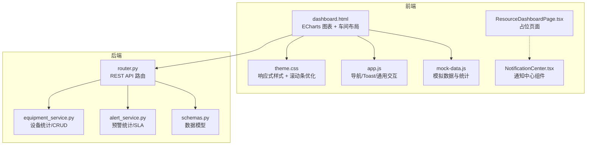
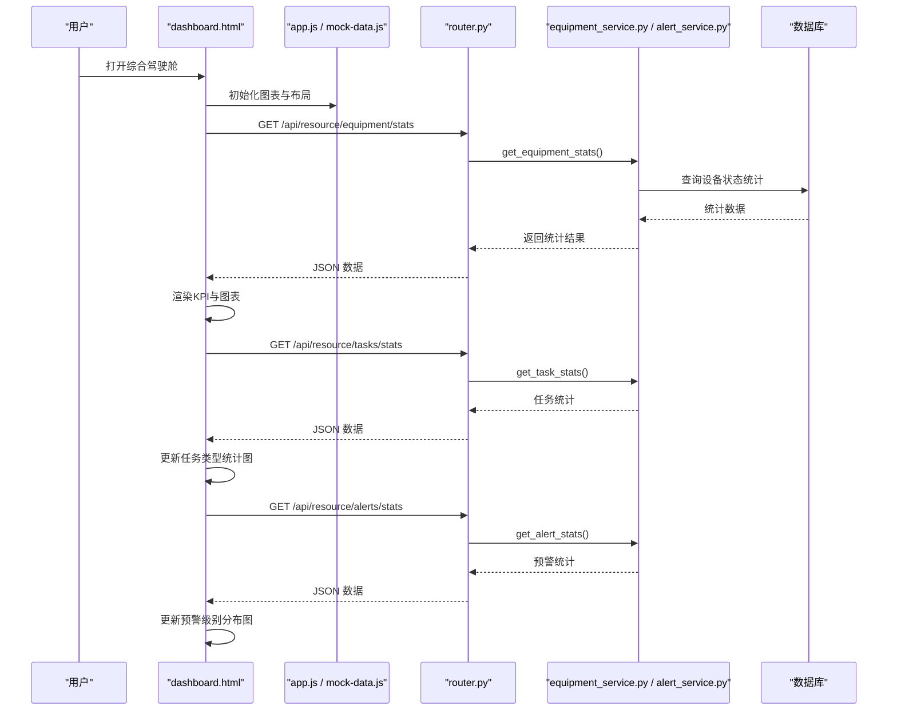
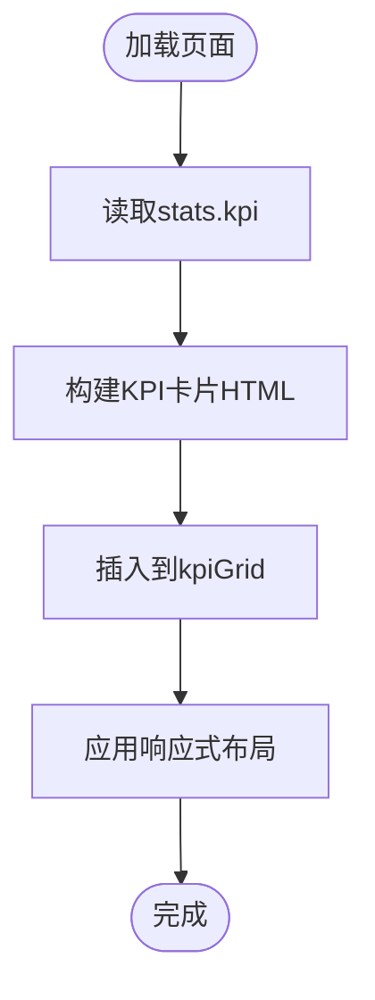
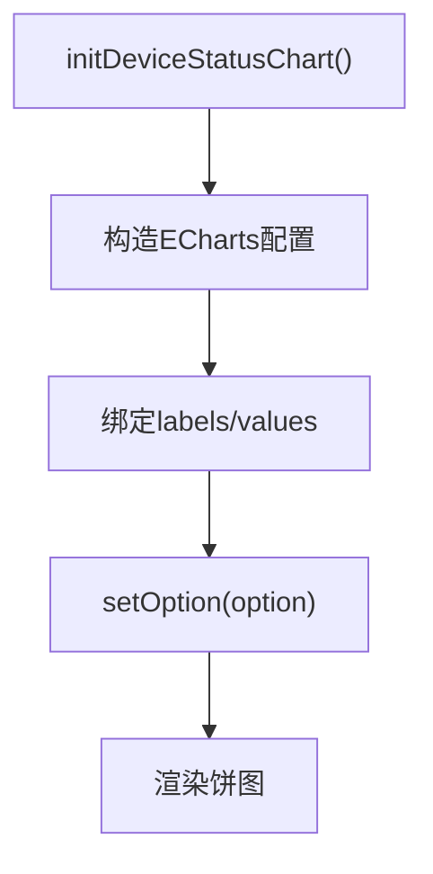
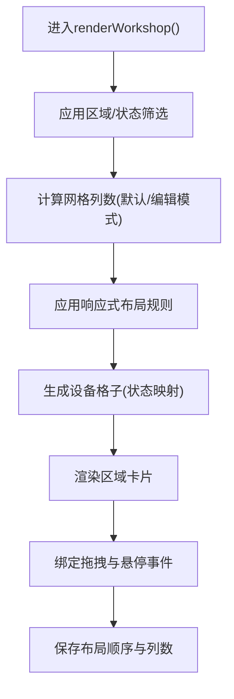
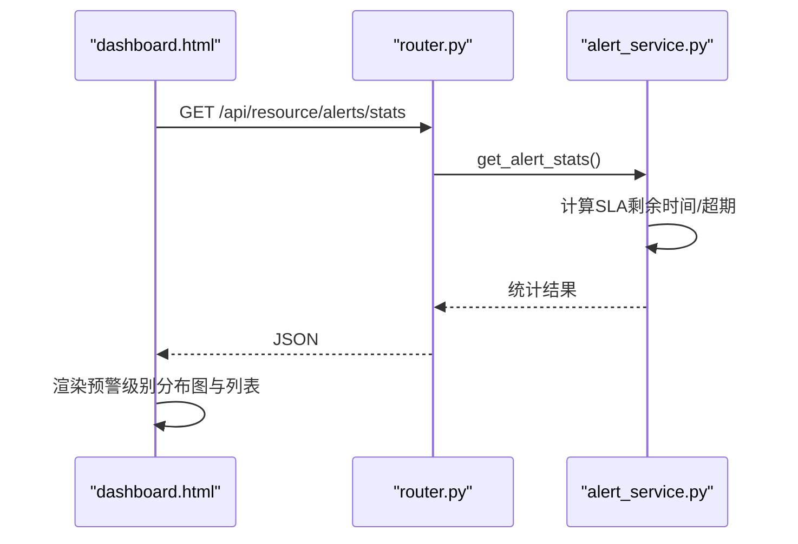
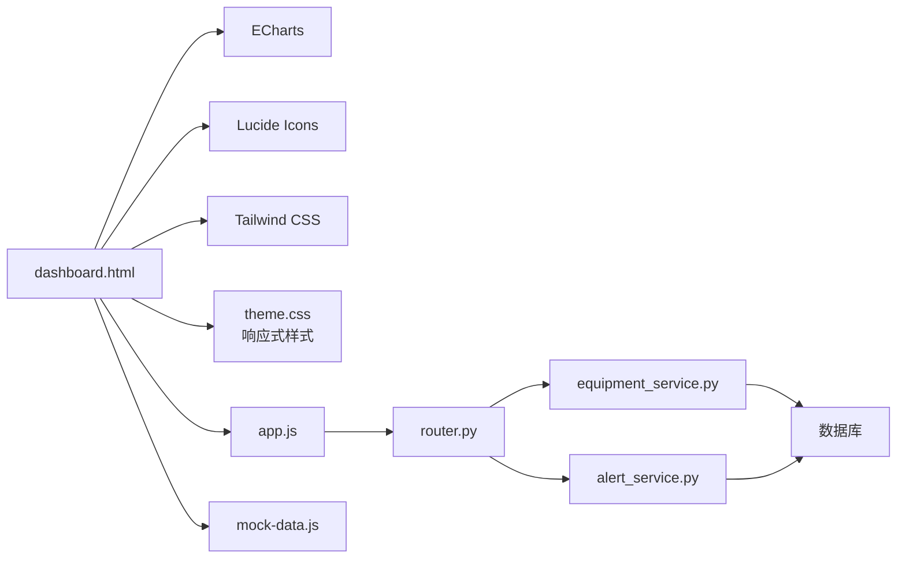

# 综合驾驶舱

<cite>
**本文引用的文件**
- [demo/dashboard.html](file://demo/dashboard.html)
- [demo/assets/css/theme.css](file://demo/assets/css/theme.css)
- [demo/assets/js/app.js](file://demo/assets/js/app.js)
- [demo/assets/js/mock-data.js](file://demo/assets/js/mock-data.js)
- [backend/modules/resource/router.py](file://backend/modules/resource/router.py)
- [backend/modules/resource/schemas.py](file://backend/modules/resource/schemas.py)
- [backend/modules/resource/services/equipment_service.py](file://backend/modules/resource/services/equipment_service.py)
- [backend/modules/resource/services/alert_service.py](file://backend/modules/resource/services/alert_service.py)
- [webui_ref/client/src/pages/ResourceDashboardPage/ResourceDashboardPage.tsx](file://webui_ref/client/src/pages/ResourceDashboardPage/ResourceDashboardPage.tsx)
- [webui_ref/client/src/components/NotificationCenter.tsx](file://webui_ref/client/src/components/NotificationCenter.tsx)
</cite>

## 更新摘要
**所做更改**
- 更新了响应式网格系统以提供更好的跨设备适配
- 增强了单卡片列处理功能，使用`:only-child`伪类优化布局
- 优化了滚动条样式，提升不同屏幕尺寸下的用户体验
- 改进了车间布局的自适应显示逻辑

## 目录
1. [简介](#简介)
2. [项目结构](#项目结构)
3. [核心组件](#核心组件)
4. [架构总览](#架构总览)
5. [详细组件分析](#详细组件分析)
6. [依赖关系分析](#依赖关系分析)
7. [性能考虑](#性能考虑)
8. [故障排查指南](#故障排查指南)
9. [结论](#结论)
10. [附录](#附录)

## 简介
本文件面向"综合驾驶舱"模块，系统性说明全局KPI监控面板的设计与实现，包括设备状态分布图表、车间实时布局展示、异常告警中心集成等核心能力。文档覆盖页面布局结构、数据可视化组件使用、实时数据更新机制、图表配置选项与用户交互流程，并提供代码级示例路径，便于快速定位实现细节。

**最新更新**：本次更新重点改进了仪表板的响应式设计，通过优化的网格系统和增强的单卡片处理能力，确保在不同屏幕尺寸下都能提供一致且优秀的用户体验。

## 项目结构
综合驾驶舱由前端演示页（HTML+JS）与后端资源管理API组成：
- 前端演示层：基于 ECharts 的图表渲染、响应式网格布局、拖拽编辑车间布局、侧边筛选与统计概览、KPI卡片与任务进度列表。
- 后端服务层：提供设备、人员、任务、预警等数据的查询与统计接口，支撑驾驶舱的数据聚合与展示。
- WebUI参考实现：React 占位页面与通知中心组件，用于后续工程化落地。

**图示来源**
- [demo/dashboard.html:212-317](file://demo/dashboard.html#L212-L317)
- [demo/assets/css/theme.css:266-778](file://demo/assets/css/theme.css#L266-L778)
- [demo/assets/js/app.js:1-202](file://demo/assets/js/app.js#L1-L202)
- [demo/assets/js/mock-data.js:231-297](file://demo/assets/js/mock-data.js#L231-L297)
- [backend/modules/resource/router.py:204-218](file://backend/modules/resource/router.py#L204-L218)
- [backend/modules/resource/services/equipment_service.py:304-335](file://backend/modules/resource/services/equipment_service.py#L304-L335)
- [backend/modules/resource/services/alert_service.py:337-399](file://backend/modules/resource/services/alert_service.py#L337-L399)
- [backend/modules/resource/schemas.py:206-224](file://backend/modules/resource/schemas.py#L206-L224)

**章节来源**
- [demo/dashboard.html:197-317](file://demo/dashboard.html#L197-L317)
- [demo/assets/css/theme.css:266-778](file://demo/assets/css/theme.css#L266-L778)
- [backend/modules/resource/router.py:204-218](file://backend/modules/resource/router.py#L204-L218)

## 核心组件
- KPI指标卡：设备总数、运行中设备、总任务数、进行中任务、在线人员、未处理预警等关键指标，支持趋势标识与子信息。
- 设备状态分布图：饼图展示各状态设备数量及占比，支持悬浮提示与高亮。
- 任务类型统计图：柱状图展示A/B/C类任务数量，支持渐变配色与顶部数值标签。
- 预警级别分布图：柱状图按严重/高/中/低分级统计，支持颜色映射与数值标签。
- 车间实时布局：区域卡片网格，显示设备占用情况；支持编辑模式拖拽排序、列数设置与本地持久化。
- 异常告警列表：按状态过滤（全部/未处理/处理中），支持等级样式与时间线。
- 侧边栏：车间区域筛选、设备状态筛选、统计概览（利用率、已完成任务、预警总数）。
- 通知中心：WebUI参考中的通知下拉面板，支持未读计数、标记已读、动画展开收起。

**最新更新**：所有组件现在都具备更好的响应式特性，能够自动适应不同的屏幕尺寸和方向变化。

**章节来源**
- [demo/dashboard.html:212-317](file://demo/dashboard.html#L212-L317)
- [demo/assets/css/theme.css:266-778](file://demo/assets/css/theme.css#L266-L778)
- [demo/assets/js/mock-data.js:231-297](file://demo/assets/js/mock-data.js#L231-L297)
- [webui_ref/client/src/components/NotificationCenter.tsx:111-281](file://webui_ref/client/src/components/NotificationCenter.tsx#L111-L281)

## 架构总览
驾驶舱采用前后端分离架构：
- 前端通过 ECharts 渲染图表，使用原生 DOM 操作与 CSS Grid 实现响应式布局。
- 后端以 FastAPI 暴露 RESTful 接口，服务层负责数据聚合与业务校验，返回统一格式。
- 数据流：前端发起请求 -> 路由分发 -> 服务层计算 -> 数据库查询 -> 返回JSON -> 前端渲染。

**图示来源**
- [backend/modules/resource/router.py:204-218](file://backend/modules/resource/router.py#L204-L218)
- [backend/modules/resource/services/equipment_service.py:304-335](file://backend/modules/resource/services/equipment_service.py#L304-L335)
- [backend/modules/resource/services/alert_service.py:337-399](file://backend/modules/resource/services/alert_service.py#L337-L399)

## 详细组件分析

### 全局KPI监控面板
- 指标项：设备总数、运行中设备、总任务数、进行中任务、在线人员、未处理预警。
- 数据来源：前端模拟数据或后端统计接口；当前演示页使用 mock-data.js 生成 stats.kpi。
- 渲染逻辑：遍历指标数组，动态生成卡片DOM并插入到kpiGrid容器。
- 交互：点击可联动筛选或跳转详情页（可扩展）。

**最新更新**：KPI网格现在具有更好的响应式行为，在较小屏幕上会自动调整列数以保持最佳可读性。

**图示来源**
- [demo/assets/js/mock-data.js:231-251](file://demo/assets/js/mock-data.js#L231-L251)
- [demo/dashboard.html:415-444](file://demo/dashboard.html#L415-L444)
- [demo/assets/css/theme.css:266-271](file://demo/assets/css/theme.css#L266-L271)

**章节来源**
- [demo/dashboard.html:415-444](file://demo/dashboard.html#L415-L444)
- [demo/assets/js/mock-data.js:231-251](file://demo/assets/js/mock-data.js#L231-L251)
- [demo/assets/css/theme.css:266-271](file://demo/assets/css/theme.css#L266-L271)

### 设备状态分布图表
- 图表类型：ECharts 饼图。
- 配置要点：tooltip、legend、color、series.pie、radius、center、label、emphasis。
- 数据源：stats.deviceStatus.labels/values。
- 交互：悬浮显示名称、数量与百分比；高亮选中扇区。

**图示来源**
- [demo/dashboard.html:510-554](file://demo/dashboard.html#L510-L554)
- [demo/assets/js/mock-data.js:258-261](file://demo/assets/js/mock-data.js#L258-L261)

**章节来源**
- [demo/dashboard.html:510-554](file://demo/dashboard.html#L510-L554)
- [demo/assets/js/mock-data.js:258-261](file://demo/assets/js/mock-data.js#L258-L261)

### 任务类型统计图
- 图表类型：ECharts 柱状图。
- 配置要点：grid、xAxis.category、yAxis.value、series.bar、渐变色、顶部标签。
- 数据源：stats.taskType.labels/values。

**章节来源**
- [demo/dashboard.html:556-600](file://demo/dashboard.html#L556-L600)
- [demo/assets/js/mock-data.js:262-265](file://demo/assets/js/mock-data.js#L262-L265)

### 预警级别分布图
- 图表类型：ECharts 柱状图。
- 配置要点：按级别映射不同渐变色，顶部数值标签。
- 数据源：stats.alertLevel.labels/values。

**章节来源**
- [demo/dashboard.html:602-650](file://demo/dashboard.html#L602-L650)
- [demo/assets/js/mock-data.js:266-269](file://demo/assets/js/mock-data.js#L266-L269)

### 车间实时布局展示
- 布局结构：区域卡片网格，每个区域包含若干设备格子，格子根据设备状态着色。
- 筛选联动：侧边栏区域/状态筛选影响当前渲染的区域与设备集合。
- 编辑模式：支持拖拽调整区域顺序、设置网格列数，并将顺序与列数保存到localStorage。
- 交互事件：dragstart/dragover/drop 实现拖拽重排；hover 显示设备详情提示。

**最新更新**：车间布局现在具有更智能的响应式行为，能够根据可用空间自动调整网格列数和布局策略。

**图示来源**
- [demo/dashboard.html:652-709](file://demo/dashboard.html#L652-L709)
- [demo/dashboard.html:711-800](file://demo/dashboard.html#L711-L800)
- [demo/assets/css/theme.css:423-427](file://demo/assets/css/theme.css#L423-L427)

**章节来源**
- [demo/dashboard.html:652-709](file://demo/dashboard.html#L652-L709)
- [demo/dashboard.html:711-800](file://demo/dashboard.html#L711-L800)
- [demo/assets/css/theme.css:423-427](file://demo/assets/css/theme.css#L423-L427)

### 异常告警中心集成
- 列表展示：按状态过滤（全部/未处理/处理中），等级样式区分。
- 后端统计：get_alert_stats() 提供总量、级别分布、状态分布、超期数量、周趋势等。
- SLA计算：根据raised_at与sla_hours计算剩余时间与是否超期。
- 前端联动：点击告警可查看详情或跳转到异常预警中心页面。

**图示来源**
- [backend/modules/resource/services/alert_service.py:337-399](file://backend/modules/resource/services/alert_service.py#L337-L399)
- [backend/modules/resource/router.py:774-800](file://backend/modules/resource/router.py#L774-L800)

**章节来源**
- [backend/modules/resource/services/alert_service.py:337-399](file://backend/modules/resource/services/alert_service.py#L337-L399)
- [backend/modules/resource/router.py:774-800](file://backend/modules/resource/router.py#L774-L800)

### 通知中心组件（WebUI参考）
- 功能：铃铛按钮触发下拉面板，显示通知列表，支持未读计数、全部已读、单条已读。
- 交互：点击外部关闭、动画展开收起、类型图标与背景色映射。
- 扩展：可与后端通知API对接，替换Mock数据为真实数据。

**章节来源**
- [webui_ref/client/src/components/NotificationCenter.tsx:111-281](file://webui_ref/client/src/components/NotificationCenter.tsx#L111-L281)

## 依赖关系分析
- 前端依赖：
  - ECharts：图表渲染。
  - Lucide Icons：图标库。
  - Tailwind CSS（CDN）：样式基础。
  - app.js：导航、Toast、模态框、选择器等通用交互。
  - mock-data.js：模拟数据与统计。
- 后端依赖：
  - FastAPI：路由与HTTP响应。
  - Pydantic：请求/响应模型。
  - 数据库访问：query_all/query_one/execute/execute_last_id。
  - 日志：logger。

**图示来源**
- [demo/dashboard.html:1-10](file://demo/dashboard.html#L1-L10)
- [demo/assets/css/theme.css:1-20](file://demo/assets/css/theme.css#L1-L20)
- [demo/assets/js/app.js:1-202](file://demo/assets/js/app.js#L1-L202)
- [backend/modules/resource/router.py:1-14](file://backend/modules/resource/router.py#L1-L14)

**章节来源**
- [demo/dashboard.html:1-10](file://demo/dashboard.html#L1-L10)
- [demo/assets/css/theme.css:1-20](file://demo/assets/css/theme.css#L1-L20)
- [demo/assets/js/app.js:1-202](file://demo/assets/js/app.js#L1-L202)
- [backend/modules/resource/router.py:1-14](file://backend/modules/resource/router.py#L1-L14)

## 性能考虑
- 图表渲染：ECharts 实例复用与按需更新，避免频繁销毁重建。
- 数据获取：分页与筛选减少数据传输量；统计接口集中聚合，降低前端计算成本。
- 布局编辑：拖拽重排仅更新DOM顺序与本地存储，不触发全量刷新。
- 实时性：可通过定时轮询或WebSocket推送更新KPI与图表；当前演示页使用静态数据。
- 内存管理：及时移除事件监听与定时器，防止泄漏。
- **新增**：响应式优化减少了不必要的重绘和重排，提升了整体性能。

## 故障排查指南
- 图表不显示：检查ECharts CDN加载与容器尺寸；确认init时容器存在且可见。
- 数据为空：核对后端接口返回结构与字段名；检查数据库连接与表结构。
- 拖拽失效：确保在编辑模式下启用drag属性；检查事件绑定与阻止默认行为。
- 通知中心无数据：替换Mock数据为真实API；确认未读计数逻辑正确。
- 状态映射错误：核对设备状态到样式的映射表；确认前端与后端状态枚举一致。
- **新增**：响应式问题：检查媒体查询断点设置；验证CSS Grid布局在不同屏幕尺寸下的表现。

**章节来源**
- [demo/dashboard.html:510-554](file://demo/dashboard.html#L510-L554)
- [demo/assets/css/theme.css:749-778](file://demo/assets/css/theme.css#L749-L778)
- [backend/modules/resource/services/equipment_service.py:304-335](file://backend/modules/resource/services/equipment_service.py#L304-L335)
- [webui_ref/client/src/components/NotificationCenter.tsx:111-281](file://webui_ref/client/src/components/NotificationCenter.tsx#L111-L281)

## 结论
综合驾驶舱通过清晰的页面布局、丰富的数据可视化与灵活的交互设计，实现了全局KPI监控、设备状态分布、车间实时布局与异常告警中心的集成。后端提供稳定的数据服务与统计能力，前端以ECharts为核心进行图表渲染，结合响应式网格与拖拽编辑提升用户体验。

**最新更新**：本次改进显著提升了系统的响应式能力，通过优化的网格系统、增强的单卡片处理和改进的滚动条样式，确保了在各种设备和屏幕尺寸下的一致用户体验。未来可引入实时数据推送与更完善的权限控制，进一步提升系统的实时性与安全性。

## 附录

### 页面布局结构
- 顶部导航：系统标题、模块导航、同步状态、系统状态、时间、用户信息。
- 侧边栏：车间区域筛选、设备状态筛选、统计概览。
- 主内容区：KPI卡片、三列图表（设备状态分布、任务类型统计、预警级别分布）、车间布局与告警列表、今日任务进度。
- 底部状态栏：系统运行状态、数据同步状态、数据库与存储状态、最后更新时间。

**最新更新**：布局现在具有更好的响应式行为，能够自动适应不同的屏幕尺寸。

**章节来源**
- [demo/dashboard.html:159-345](file://demo/dashboard.html#L159-L345)
- [demo/assets/css/theme.css:56-66](file://demo/assets/css/theme.css#L56-L66)

### 数据可视化组件使用
- ECharts：饼图、柱状图配置与主题定制。
- 图标：Lucide图标库用于KPI与标题图标。
- 样式：Tailwind CSS与自定义CSS变量实现深色主题与卡片风格。

**章节来源**
- [demo/dashboard.html:1-10](file://demo/dashboard.html#L1-L10)
- [demo/dashboard.html:215-243](file://demo/dashboard.html#L215-L243)

### 实时数据更新机制
- 当前演示页使用静态模拟数据，可通过定时轮询或WebSocket实现实时更新。
- 后端统计接口支持分页与筛选，适合增量更新场景。
- 建议：对KPI与图表采用防抖与节流策略，避免频繁重绘。

**章节来源**
- [demo/assets/js/mock-data.js:231-297](file://demo/assets/js/mock-data.js#L231-L297)
- [backend/modules/resource/services/equipment_service.py:304-335](file://backend/modules/resource/services/equipment_service.py#L304-L335)

### 图表配置选项
- 饼图：radius、center、label、emphasis、tooltip、legend。
- 柱状图：grid、xAxis、yAxis、series.bar、itemStyle渐变、label位置与样式。
- 主题：深色背景、边框颜色、文字颜色、阴影效果。

**章节来源**
- [demo/dashboard.html:510-650](file://demo/dashboard.html#L510-L650)

### 用户交互流程
- 区域/状态筛选：点击侧边栏项切换active状态，重新渲染车间布局。
- 布局编辑：进入编辑模式后，拖拽区域卡片调整顺序，设置网格列数并保存至本地存储。
- 告警过滤：点击状态标签切换过滤条件，更新告警列表。
- 通知中心：点击铃铛展开面板，标记已读，显示未读计数。

**章节来源**
- [demo/dashboard.html:446-508](file://demo/dashboard.html#L446-L508)
- [demo/dashboard.html:652-800](file://demo/dashboard.html#L652-L800)
- [webui_ref/client/src/components/NotificationCenter.tsx:111-281](file://webui_ref/client/src/components/NotificationCenter.tsx#L111-L281)

### 代码示例路径
- KPI指标计算：[demo/dashboard.html:415-444](file://demo/dashboard.html#L415-L444)
- 设备状态分布图表：[demo/dashboard.html:510-554](file://demo/dashboard.html#L510-L554)
- 任务类型统计图：[demo/dashboard.html:556-600](file://demo/dashboard.html#L556-L600)
- 预警级别分布图：[demo/dashboard.html:602-650](file://demo/dashboard.html#L602-L650)
- 车间布局渲染与编辑：[demo/dashboard.html:652-800](file://demo/dashboard.html#L652-L800)
- 设备统计接口：[backend/modules/resource/services/equipment_service.py:304-335](file://backend/modules/resource/services/equipment_service.py#L304-L335)
- 预警统计接口：[backend/modules/resource/services/alert_service.py:337-399](file://backend/modules/resource/services/alert_service.py#L337-L399)
- 通知中心组件：[webui_ref/client/src/components/NotificationCenter.tsx:111-281](file://webui_ref/client/src/components/NotificationCenter.tsx#L111-L281)
- **新增**：响应式样式：[demo/assets/css/theme.css:749-778](file://demo/assets/css/theme.css#L749-L778)

### 响应式设计改进详解
**最新更新**：本次更新重点改进了以下响应式特性：

1. **网格系统优化**：
   - KPI网格在1400px以下屏幕自动调整为3列布局
   - 图表行在中等屏幕下变为2列布局
   - 小屏幕下所有元素垂直堆叠显示

2. **单卡片列处理**：
   - 使用`:only-child`伪类确保单卡片列能够填满整个高度
   - 优化了任务列表和告警列表的高度对齐

3. **滚动条样式优化**：
   - 统一的6px宽度滚动条
   - 半透明轨道背景
   - 圆角拇指样式
   - 悬停时颜色变化反馈

4. **媒体查询断点**：
   - 1400px：调整KPI网格和图表布局
   - 1024px：移动端适配，隐藏侧边栏，垂直布局
   - 900px：完全响应式布局

**章节来源**
- [demo/assets/css/theme.css:749-778](file://demo/assets/css/theme.css#L749-L778)
- [static/index.html:513-515](file://static/index.html#L513-L515)
- [static/index.html:542-545](file://static/index.html#L542-L545)
- [static/index.html:593-596](file://static/index.html#L593-L596)