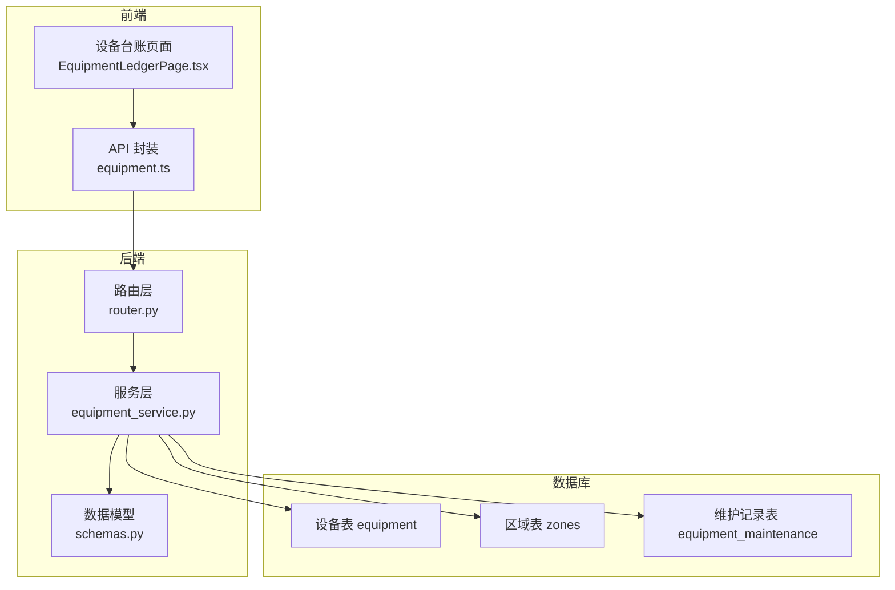
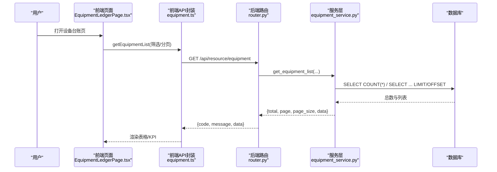
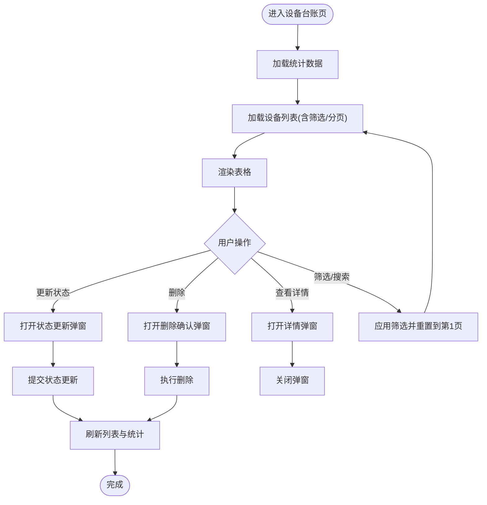
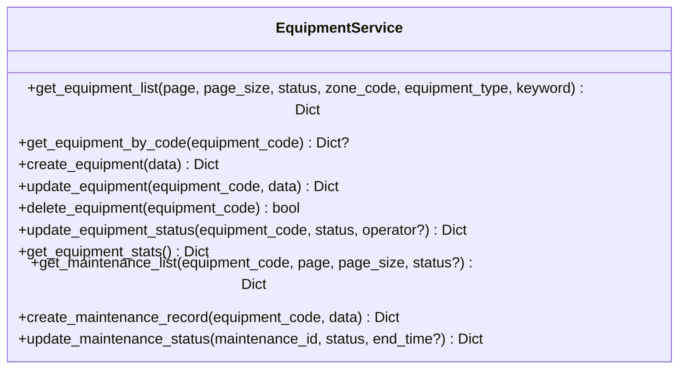
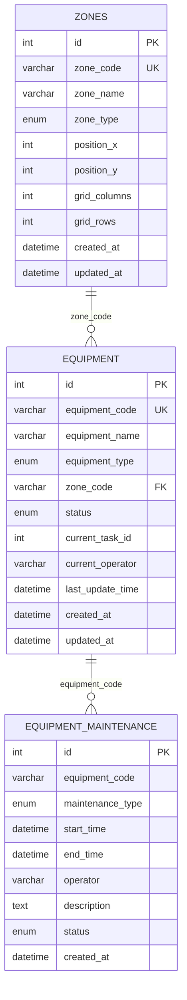
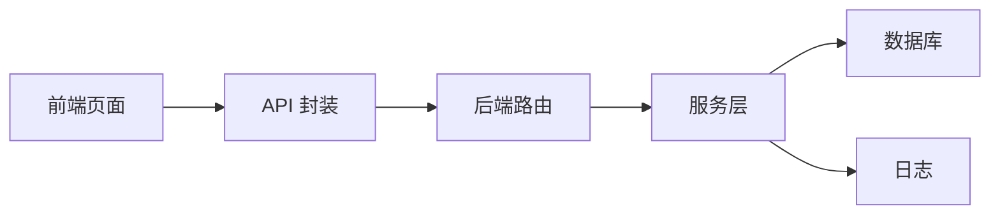

# 设备台账管理

<cite>
**本文引用的文件**
- [EquipmentLedgerPage.tsx](file://webui_ref/client/src/pages/EquipmentLedgerPage/EquipmentLedgerPage.tsx)
- [equipment.ts](file://webui_ref/client/src/api/resource/equipment.ts)
- [router.py](file://backend/modules/resource/router.py)
- [equipment_service.py](file://backend/modules/resource/services/equipment_service.py)
- [schemas.py](file://backend/modules/resource/schemas.py)
- [resource_schema.sql](file://backend/sql/resource_schema.sql)
</cite>

## 目录
1. [简介](#简介)
2. [项目结构](#项目结构)
3. [核心组件](#核心组件)
4. [架构总览](#架构总览)
5. [详细组件分析](#详细组件分析)
6. [依赖关系分析](#依赖关系分析)
7. [性能考虑](#性能考虑)
8. [故障排查指南](#故障排查指南)
9. [结论](#结论)
10. [附录](#附录)

## 简介
本模块提供设备台账的完整管理能力，覆盖设备信息的增删改查、状态监控与维护记录关联。前端以 React + TypeScript 实现列表展示、筛选搜索、分页与弹窗交互；后端基于 FastAPI 提供 RESTful API，服务层封装数据库查询与业务校验，数据模型使用 Pydantic 进行结构化约束。

## 项目结构
围绕“设备台账”的前后端关键路径如下：
- 前端页面：设备台账页面组件负责 UI 渲染、用户交互与本地状态管理
- 前端 API 封装：统一调用后端 /api/resource 下的设备相关接口
- 后端路由：定义设备 CRUD、状态更新、统计与维护记录的 HTTP 端点
- 服务层：实现设备列表查询（支持筛选、分页、关键词）、详情获取、创建/更新/删除、状态变更、维护记录管理等
- 数据模型：Pydantic 模型定义请求/响应结构
- 数据库：设备表、区域表、维护记录表等

图表来源
- [EquipmentLedgerPage.tsx:1-626](file://webui_ref/client/src/pages/EquipmentLedgerPage/EquipmentLedgerPage.tsx#L1-L626)
- [equipment.ts:1-254](file://webui_ref/client/src/api/resource/equipment.ts#L1-L254)
- [router.py:58-302](file://backend/modules/resource/router.py#L58-L302)
- [equipment_service.py:11-495](file://backend/modules/resource/services/equipment_service.py#L11-L495)
- [schemas.py:14-47](file://backend/modules/resource/schemas.py#L14-L47)
- [resource_schema.sql:13-28](file://backend/sql/resource_schema.sql#L13-L28)
- [resource_schema.sql:33-45](file://backend/sql/resource_schema.sql#L33-L45)
- [resource_schema.sql:186-199](file://backend/sql/resource_schema.sql#L186-L199)

章节来源
- [EquipmentLedgerPage.tsx:1-626](file://webui_ref/client/src/pages/EquipmentLedgerPage/EquipmentLedgerPage.tsx#L1-L626)
- [equipment.ts:1-254](file://webui_ref/client/src/api/resource/equipment.ts#L1-L254)
- [router.py:58-302](file://backend/modules/resource/router.py#L58-L302)
- [equipment_service.py:11-495](file://backend/modules/resource/services/equipment_service.py#L11-L495)
- [schemas.py:14-47](file://backend/modules/resource/schemas.py#L14-L47)
- [resource_schema.sql:13-28](file://backend/sql/resource_schema.sql#L13-L28)
- [resource_schema.sql:33-45](file://backend/sql/resource_schema.sql#L33-L45)
- [resource_schema.sql:186-199](file://backend/sql/resource_schema.sql#L186-L199)

## 核心组件
- 前端页面组件：设备列表、KPI 卡片、筛选器、表格、分页、详情/删除/状态更新对话框
- 前端 API 封装：设备列表、详情、新增、更新、删除、状态更新、统计、维护记录操作
- 后端路由：RESTful 接口，参数校验与异常处理
- 服务层：SQL 构建、分页、筛选、时间字段格式化、业务校验（如状态枚举）
- 数据模型：Pydantic 模型用于前后端契约
- 数据库：设备、区域、维护记录表及索引

章节来源
- [EquipmentLedgerPage.tsx:83-125](file://webui_ref/client/src/pages/EquipmentLedgerPage/EquipmentLedgerPage.tsx#L83-L125)
- [equipment.ts:119-216](file://webui_ref/client/src/api/resource/equipment.ts#L119-L216)
- [router.py:58-302](file://backend/modules/resource/router.py#L58-L302)
- [equipment_service.py:11-495](file://backend/modules/resource/services/equipment_service.py#L11-L495)
- [schemas.py:14-47](file://backend/modules/resource/schemas.py#L14-L47)
- [resource_schema.sql:13-28](file://backend/sql/resource_schema.sql#L13-L28)
- [resource_schema.sql:186-199](file://backend/sql/resource_schema.sql#L186-L199)

## 架构总览
设备台账的数据流遵循“前端页面 -> API 封装 -> 后端路由 -> 服务层 -> 数据库”的分层模式。前端通过类型化接口与后端约定数据结构，服务层负责 SQL 拼装与业务规则校验，返回统一格式结果。

图表来源
- [EquipmentLedgerPage.tsx:303-345](file://webui_ref/client/src/pages/EquipmentLedgerPage/EquipmentLedgerPage.tsx#L303-L345)
- [equipment.ts:119-130](file://webui_ref/client/src/api/resource/equipment.ts#L119-L130)
- [router.py:58-86](file://backend/modules/resource/router.py#L58-L86)
- [equipment_service.py:11-103](file://backend/modules/resource/services/equipment_service.py#L11-L103)
- [resource_schema.sql:13-28](file://backend/sql/resource_schema.sql#L13-L28)

## 详细组件分析

### 前端页面：设备台账
- 列表展示：表格列包含设备编号、名称、类型、区域、状态、操作员、最后更新时间；支持加载态与空态
- KPI 统计：顶部展示设备总数、空闲、占用、故障、维护中数量
- 筛选与搜索：支持按区域、类型、状态筛选，以及关键词搜索（设备编号或名称）
- 分页：页码与每页条数控制，切换时重新拉取数据
- 详情查看：弹窗显示设备详细信息（编号、名称、类型、区域、状态、操作员、时间戳）
- 状态更新：弹窗选择新状态并确认提交
- 删除确认：二次确认后执行删除，成功后刷新列表与统计

图表来源
- [EquipmentLedgerPage.tsx:280-626](file://webui_ref/client/src/pages/EquipmentLedgerPage/EquipmentLedgerPage.tsx#L280-L626)

章节来源
- [EquipmentLedgerPage.tsx:83-125](file://webui_ref/client/src/pages/EquipmentLedgerPage/EquipmentLedgerPage.tsx#L83-L125)
- [EquipmentLedgerPage.tsx:127-277](file://webui_ref/client/src/pages/EquipmentLedgerPage/EquipmentLedgerPage.tsx#L127-L277)
- [EquipmentLedgerPage.tsx:280-626](file://webui_ref/client/src/pages/EquipmentLedgerPage/EquipmentLedgerPage.tsx#L280-L626)

### 前端 API 封装
- 设备列表：支持 page、page_size、status、zone_code、equipment_type、keyword 参数
- 设备详情：按设备编号获取
- 新增/更新/删除：对应 POST/PUT/DELETE
- 状态更新：PUT 更新设备状态，可选操作员
- 统计：GET 获取设备状态分布与总数
- 维护记录：列表、新增、状态更新

章节来源
- [equipment.ts:8-114](file://webui_ref/client/src/api/resource/equipment.ts#L8-L114)
- [equipment.ts:119-216](file://webui_ref/client/src/api/resource/equipment.ts#L119-L216)
- [equipment.ts:219-254](file://webui_ref/client/src/api/resource/equipment.ts#L219-L254)

### 后端路由
- GET /api/resource/equipment：设备列表（分页、筛选、搜索）
- GET /api/resource/equipment/{equipment_code}：设备详情
- POST /api/resource/equipment：新增设备
- PUT /api/resource/equipment/{equipment_code}：更新设备信息
- DELETE /api/resource/equipment/{equipment_code}：删除设备
- PUT /api/resource/equipment/{equipment_code}/status：更新设备状态
- GET /api/resource/equipment/stats：设备统计
- GET /api/resource/equipment/{equipment_code}/maintenance：维护记录列表
- POST /api/resource/equipment/{equipment_code}/maintenance：新增维护记录
- PUT /api/resource/equipment/maintenance/{maintenance_id}/status：更新维护记录状态

章节来源
- [router.py:58-302](file://backend/modules/resource/router.py#L58-L302)

### 服务层：设备与维保全链路
- 列表查询：动态 WHERE 条件拼接，支持 status、zone_code、equipment_type、keyword（模糊匹配编号/名称），LIMIT/OFFSET 分页，时间字段格式化
- 详情查询：JOIN 区域与任务表，返回当前任务名
- 新增设备：校验设备编号唯一性、区域存在性，插入后返回详情
- 更新设备：校验存在性，选择性更新字段，区域变更时校验区域存在性
- 删除设备：校验存在性，级联删除维护记录后删除设备
- 状态更新：校验设备存在性与状态枚举，可同步更新操作员
- 统计：按状态分组计数，计算总数
- 维护记录：列表分页、新增、状态更新（完成时自动补全结束时间）

图表来源
- [equipment_service.py:11-495](file://backend/modules/resource/services/equipment_service.py#L11-L495)

章节来源
- [equipment_service.py:11-103](file://backend/modules/resource/services/equipment_service.py#L11-L103)
- [equipment_service.py:106-179](file://backend/modules/resource/services/equipment_service.py#L106-L179)
- [equipment_service.py:181-260](file://backend/modules/resource/services/equipment_service.py#L181-L260)
- [equipment_service.py:262-335](file://backend/modules/resource/services/equipment_service.py#L262-L335)
- [equipment_service.py:338-495](file://backend/modules/resource/services/equipment_service.py#L338-L495)

### 数据模型与数据库
- Pydantic 模型：设备基础/创建/更新/响应、列表响应、区域、人员、任务、预警、驾驶舱等
- 设备表：主键自增，设备编号唯一，类型与状态为枚举，带索引优化查询
- 区域表：区域编码唯一，类型枚举，网格坐标与行列配置
- 维护记录表：设备编号、维护类型、起止时间、操作员、描述、状态，带索引

图表来源
- [resource_schema.sql:13-28](file://backend/sql/resource_schema.sql#L13-L28)
- [resource_schema.sql:33-45](file://backend/sql/resource_schema.sql#L33-L45)
- [resource_schema.sql:186-199](file://backend/sql/resource_schema.sql#L186-L199)

章节来源
- [schemas.py:14-47](file://backend/modules/resource/schemas.py#L14-L47)
- [resource_schema.sql:13-28](file://backend/sql/resource_schema.sql#L13-L28)
- [resource_schema.sql:33-45](file://backend/sql/resource_schema.sql#L33-L45)
- [resource_schema.sql:186-199](file://backend/sql/resource_schema.sql#L186-L199)

## 依赖关系分析
- 前端页面依赖 API 封装函数，通过类型化接口传递参数与接收响应
- API 封装依赖统一的 axios 实例，将请求转发至后端路由
- 后端路由依赖服务层方法，进行参数解析与异常转换
- 服务层依赖数据库工具函数与日志记录，直接构造 SQL 并执行
- 数据模型在路由与服务层之间作为契约，保证数据结构一致性

图表来源
- [EquipmentLedgerPage.tsx:1-11](file://webui_ref/client/src/pages/EquipmentLedgerPage/EquipmentLedgerPage.tsx#L1-L11)
- [equipment.ts:1-6](file://webui_ref/client/src/api/resource/equipment.ts#L1-L6)
- [router.py:1-14](file://backend/modules/resource/router.py#L1-L14)
- [equipment_service.py:1-9](file://backend/modules/resource/services/equipment_service.py#L1-L9)

章节来源
- [EquipmentLedgerPage.tsx:1-11](file://webui_ref/client/src/pages/EquipmentLedgerPage/EquipmentLedgerPage.tsx#L1-L11)
- [equipment.ts:1-6](file://webui_ref/client/src/api/resource/equipment.ts#L1-L6)
- [router.py:1-14](file://backend/modules/resource/router.py#L1-L14)
- [equipment_service.py:1-9](file://backend/modules/resource/services/equipment_service.py#L1-L9)

## 性能考虑
- 列表查询采用分页与索引优化：设备表对 status、zone_code、equipment_type 建立索引，减少全表扫描
- 关键词搜索使用 LIKE 模糊匹配，建议在大数据量场景下结合全文索引或搜索引擎
- 时间字段在服务层统一格式化为字符串，避免前端重复转换
- 统计接口按状态分组计数，适合仪表盘快速展示
- 前端分页与筛选联动，避免一次性加载过多数据

[本节为通用性能建议，不直接分析具体文件]

## 故障排查指南
- 新增设备失败：检查设备编号是否已存在、区域编码是否存在；错误由服务层抛出 ValueError，路由转换为 400
- 更新设备失败：确认设备存在且至少一个字段需要更新；区域变更时需校验区域存在性
- 删除设备失败：若存在维护记录，会先级联删除维护记录再删除设备；确保无外部强引用
- 状态更新失败：校验状态枚举值；无效状态将返回 400
- 维护记录状态更新：完成状态未提供结束时间时会自动设置当前时间；无效状态将返回 400

章节来源
- [equipment_service.py:150-179](file://backend/modules/resource/services/equipment_service.py#L150-L179)
- [equipment_service.py:181-229](file://backend/modules/resource/services/equipment_service.py#L181-L229)
- [equipment_service.py:231-260](file://backend/modules/resource/services/equipment_service.py#L231-L260)
- [equipment_service.py:262-302](file://backend/modules/resource/services/equipment_service.py#L262-L302)
- [equipment_service.py:442-495](file://backend/modules/resource/services/equipment_service.py#L442-L495)
- [router.py:112-175](file://backend/modules/resource/router.py#L112-L175)
- [router.py:178-302](file://backend/modules/resource/router.py#L178-L302)

## 结论
设备台账模块实现了从前端到后端的完整闭环：界面友好、功能完备、数据一致性强。通过分层架构与严格的数据模型约束，保障了系统的可维护性与扩展性。后续可在搜索性能、批量操作、审计日志等方面持续优化。

[本节为总结性内容，不直接分析具体文件]

## 附录

### 典型操作流程示例（代码片段路径）
- 设备列表加载与筛选：[EquipmentLedgerPage.tsx:303-345](file://webui_ref/client/src/pages/EquipmentLedgerPage/EquipmentLedgerPage.tsx#L303-L345)
- 前端 API 调用列表接口：[equipment.ts:119-130](file://webui_ref/client/src/api/resource/equipment.ts#L119-L130)
- 后端路由列表接口：[router.py:58-86](file://backend/modules/resource/router.py#L58-L86)
- 服务层列表查询逻辑：[equipment_service.py:11-103](file://backend/modules/resource/services/equipment_service.py#L11-L103)
- 设备详情获取：[equipment_service.py:106-137](file://backend/modules/resource/services/equipment_service.py#L106-L137)
- 新增设备：[router.py:112-129](file://backend/modules/resource/router.py#L112-L129), [equipment_service.py:140-179](file://backend/modules/resource/services/equipment_service.py#L140-L179)
- 更新设备信息：[router.py:132-154](file://backend/modules/resource/router.py#L132-L154), [equipment_service.py:181-229](file://backend/modules/resource/services/equipment_service.py#L181-L229)
- 删除设备：[router.py:157-175](file://backend/modules/resource/router.py#L157-L175), [equipment_service.py:231-260](file://backend/modules/resource/services/equipment_service.py#L231-L260)
- 更新设备状态：[router.py:178-201](file://backend/modules/resource/router.py#L178-L201), [equipment_service.py:262-302](file://backend/modules/resource/services/equipment_service.py#L262-L302)
- 设备统计：[router.py:204-218](file://backend/modules/resource/router.py#L204-L218), [equipment_service.py:304-335](file://backend/modules/resource/services/equipment_service.py#L304-L335)
- 维护记录列表：[router.py:221-245](file://backend/modules/resource/router.py#L221-L245), [equipment_service.py:338-393](file://backend/modules/resource/services/equipment_service.py#L338-L393)
- 新增维护记录：[router.py:248-273](file://backend/modules/resource/router.py#L248-L273), [equipment_service.py:396-439](file://backend/modules/resource/services/equipment_service.py#L396-L439)
- 更新维护记录状态：[router.py:276-302](file://backend/modules/resource/router.py#L276-L302), [equipment_service.py:442-495](file://backend/modules/resource/services/equipment_service.py#L442-L495)