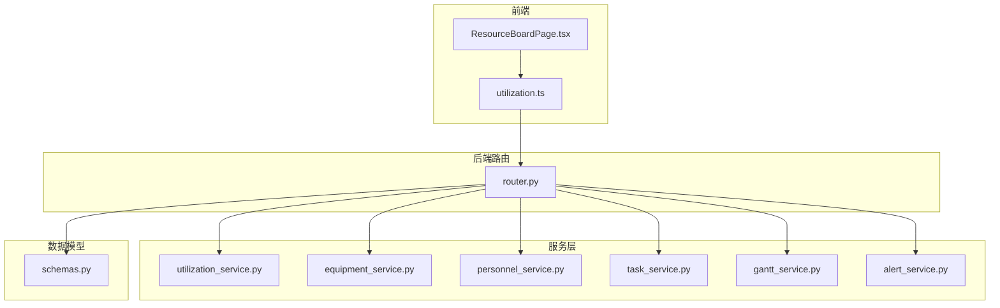
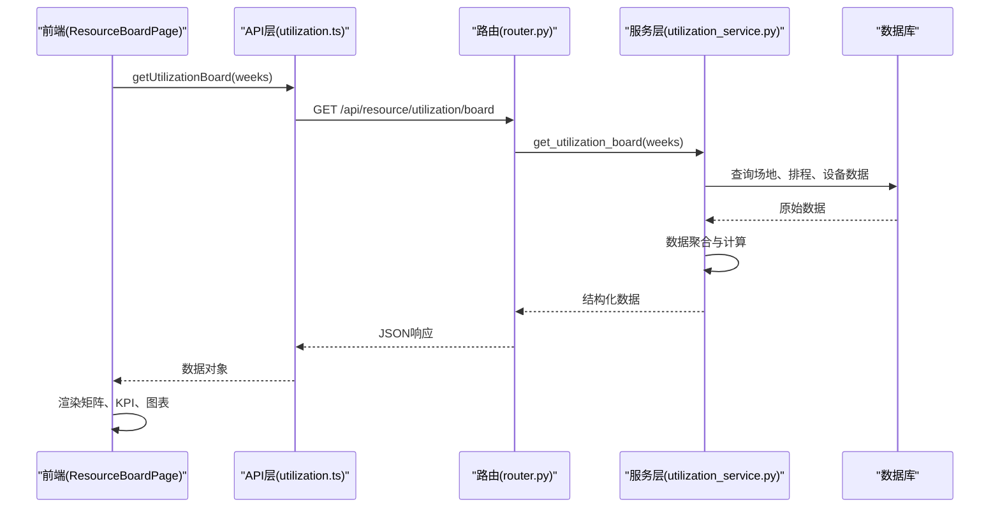
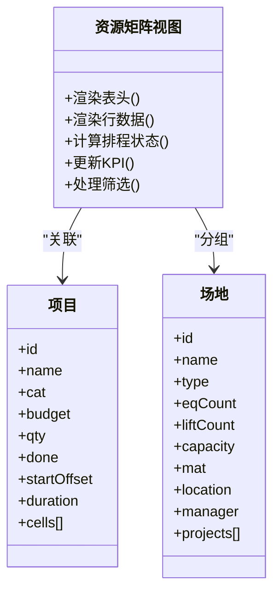
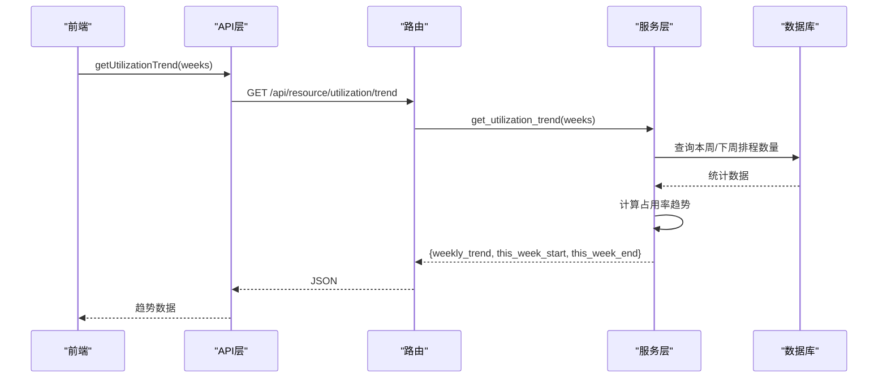
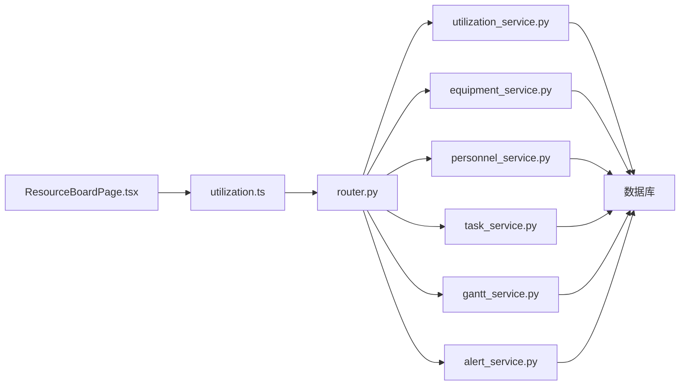

# 资源占用看板

<cite>
**本文引用的文件**
- [backend/modules/resource/router.py](file://backend/modules/resource/router.py)
- [backend/modules/resource/services/utilization_service.py](file://backend/modules/resource/services/utilization_service.py)
- [webui_ref/client/src/pages/ResourceBoardPage/ResourceBoardPage.tsx](file://webui_ref/client/src/pages/ResourceBoardPage/ResourceBoardPage.tsx)
- [webui_ref/client/src/api/resource/utilization.ts](file://webui_ref/client/src/api/resource/utilization.ts)
- [demo/resource-board.html](file://demo/resource-board.html)
</cite>

## 更新摘要
**变更内容**
- ResourceBoardPage.tsx从占位符完全重构为功能完整的生产级仪表板
- 实现了复杂的场地×项目×周度甘特矩阵视图
- 添加了KPI卡片、交互式筛选器和响应式布局
- 集成了ECharts图表展示利用率趋势和设备排名
- 完善了前后端数据交互和状态管理

## 目录
1. [简介](#简介)
2. [项目结构](#项目结构)
3. [核心组件](#核心组件)
4. [架构总览](#架构总览)
5. [详细组件分析](#详细组件分析)
6. [依赖关系分析](#依赖关系分析)
7. [性能考量](#性能考量)
8. [故障排查指南](#故障排查指南)
9. [结论](#结论)
10. [附录](#附录)

## 简介
本模块为"资源占用看板"，面向试制资源数智化管理系统，提供：
- **实时资源利用率展示**（设备、人员、场地）
- **排程矩阵视图**（按周维度呈现项目与资源占用）
- **利用率趋势分析**（周度/月度趋势、关键路径与冲突预警）
并配套数据聚合计算、图表类型选择、实时更新机制、颜色编码策略与性能优化方案。

**更新** ResourceBoardPage.tsx现已完全实现为生产级仪表板，支持复杂的数据可视化、交互式筛选和响应式布局。

## 项目结构
前端采用React + TypeScript构建，后端使用FastAPI提供服务。核心文件组织如下：
- **前端页面**：ResourceBoardPage.tsx - 主仪表板页面，包含矩阵视图、KPI卡片、图表展示
- **API封装**：utilization.ts - 资源占用相关API接口定义和数据类型
- **后端服务**：utilization_service.py - 资源占用数据聚合计算逻辑
- **路由层**：router.py - API路由定义和请求处理
- **演示页面**：resource-board.html - 静态演示原型

**图示来源**
- [webui_ref/client/src/pages/ResourceBoardPage/ResourceBoardPage.tsx:1-660](file://webui_ref/client/src/pages/ResourceBoardPage/ResourceBoardPage.tsx#L1-L660)
- [webui_ref/client/src/api/resource/utilization.ts:1-183](file://webui_ref/client/src/api/resource/utilization.ts#L1-L183)
- [backend/modules/resource/router.py:1427-1475](file://backend/modules/resource/router.py#L1427-L1475)
- [backend/modules/resource/services/utilization_service.py:1-429](file://backend/modules/resource/services/utilization_service.py#L1-L429)

**章节来源**
- [webui_ref/client/src/pages/ResourceBoardPage/ResourceBoardPage.tsx:1-660](file://webui_ref/client/src/pages/ResourceBoardPage/ResourceBoardPage.tsx#L1-L660)
- [webui_ref/client/src/api/resource/utilization.ts:1-183](file://webui_ref/client/src/api/resource/utilization.ts#L1-L183)
- [backend/modules/resource/router.py:1427-1475](file://backend/modules/resource/router.py#L1427-L1475)

## 核心组件
- **矩阵视图组件**：场地×项目×周度的三维矩阵展示，支持粘性列和滚动
- **KPI卡片组件**：显示关键指标如场地总数、项目排程、设备数等
- **筛选器组件**：支持按场地类型、项目类别、排程状态进行多维度筛选
- **图表组件**：ECharts集成的利用率趋势图和设备利用率排名图
- **工具栏组件**：提供刷新、导出、新增排程等操作按钮

**更新** 所有组件均已实现为功能完整的React组件，具备完整的状态管理和事件处理。

**章节来源**
- [webui_ref/client/src/pages/ResourceBoardPage/ResourceBoardPage.tsx:94-146](file://webui_ref/client/src/pages/ResourceBoardPage/ResourceBoardPage.tsx#L94-L146)
- [webui_ref/client/src/pages/ResourceBoardPage/ResourceBoardPage.tsx:314-659](file://webui_ref/client/src/pages/ResourceBoardPage/ResourceBoardPage.tsx#L314-L659)

## 架构总览
资源占用看板的数据流从前端发起请求，经API层调用后端服务，服务层通过数据库查询与计算返回结构化数据，前端渲染矩阵、KPI与图表。

**图示来源**
- [webui_ref/client/src/pages/ResourceBoardPage/ResourceBoardPage.tsx:162-183](file://webui_ref/client/src/pages/ResourceBoardPage/ResourceBoardPage.tsx#L162-L183)
- [webui_ref/client/src/api/resource/utilization.ts:122-129](file://webui_ref/client/src/api/resource/utilization.ts#L122-L129)
- [backend/modules/resource/router.py:1429-1445](file://backend/modules/resource/router.py#L1429-L1445)
- [backend/modules/resource/services/utilization_service.py:235-334](file://backend/modules/resource/services/utilization_service.py#L235-L334)

## 详细组件分析

### 实时资源利用率展示
- **设备利用率**：基于设备状态分布（idle/busy/error/maintenance）计算占用率
- **人员利用率**：基于人员状态（working/idle/offline）与在岗人数计算
- **场地利用率**：结合设备数量与举升机配置，按周计算占用比例
- **趋势分析**：周度新增/结束排程数量、月度任务趋势

**更新** 现在通过utilization_service.py中的get_equipment_utilization_rank函数实现设备利用率排名，支持自定义时间窗口和限制条数。

**章节来源**
- [backend/modules/resource/services/utilization_service.py:372-429](file://backend/modules/resource/services/utilization_service.py#L372-L429)
- [backend/modules/resource/services/equipment_service.py:304-335](file://backend/modules/resource/services/equipment_service.py#L304-L335)

### 排程矩阵视图
- **矩阵维度**：左侧固定列显示场地/设备/能力/项目信息，右侧按周展示排程状态
- **状态分类**：已完成(done)/进行中(doing)/待排(wait)/排定中(plan)，不同状态使用不同颜色
- **过滤与交互**：支持按场地类型、项目类别、排程状态筛选，快速切换与全宽显示
- **粘性列**：前8列在水平滚动时保持固定，便于查看上下文信息

**更新** 矩阵视图现已完全实现，支持rowSpan合并单元格、多项目并行显示、动态列宽和响应式布局。

**图示来源**
- [webui_ref/client/src/pages/ResourceBoardPage/ResourceBoardPage.tsx:518-618](file://webui_ref/client/src/pages/ResourceBoardPage/ResourceBoardPage.tsx#L518-L618)
- [webui_ref/client/src/api/resource/utilization.ts:26-58](file://webui_ref/client/src/api/resource/utilization.ts#L26-L58)

**章节来源**
- [webui_ref/client/src/pages/ResourceBoardPage/ResourceBoardPage.tsx:186-220](file://webui_ref/client/src/pages/ResourceBoardPage/ResourceBoardPage.tsx#L186-L220)
- [webui_ref/client/src/pages/ResourceBoardPage/ResourceBoardPage.tsx:494-620](file://webui_ref/client/src/pages/ResourceBoardPage/ResourceBoardPage.tsx#L494-L620)

### 利用率趋势分析
- **周度趋势**：统计每周新增与结束的排程数量，形成时间序列
- **月度趋势**：按月统计任务数量与完成数量
- **关键路径与冲突**：识别关键任务与资源冲突，辅助排程优化

**更新** 趋势分析现通过get_utilization_trend函数实现，支持自定义周数和当前周高亮显示。

**图示来源**
- [webui_ref/client/src/pages/ResourceBoardPage/ResourceBoardPage.tsx:223-253](file://webui_ref/client/src/pages/ResourceBoardPage/ResourceBoardPage.tsx#L223-L253)
- [backend/modules/resource/services/utilization_service.py:337-369](file://backend/modules/resource/services/utilization_service.py#L337-L369)

**章节来源**
- [backend/modules/resource/services/utilization_service.py:337-369](file://backend/modules/resource/services/utilization_service.py#L337-L369)

### 数据聚合计算
- **设备统计**：按状态分组计数，计算总数与各状态占比
- **人员统计**：按状态与区域分组，计算在岗、空闲、离线人数
- **任务统计**：按状态、优先级、类型分组，计算计划与实际工时、平均进度
- **甘特图统计**：按阶段、场地、类型分组，计算周度趋势与关键路径数量

**更新** 数据聚合现集中在utilization_service.py中，支持从gantt_schedules或tasks表自动回退获取数据。

**章节来源**
- [backend/modules/resource/services/utilization_service.py:119-165](file://backend/modules/resource/services/utilization_service.py#L119-L165)
- [backend/modules/resource/services/utilization_service.py:235-334](file://backend/modules/resource/services/utilization_service.py#L235-L334)

### 图表类型选择
- **饼图**：任务状态分布、人员来源分布
- **柱状图**：任务类型与进度对比、人员来源平均工时、设备利用率排名
- **折线图**：周度/月度趋势、场地占用率变化
- **矩阵视图**：排程矩阵（表格形式）

**更新** 图表配置现通过ReactECharts组件实现，支持主题切换和响应式布局。

**章节来源**
- [webui_ref/client/src/pages/ResourceBoardPage/ResourceBoardPage.tsx:223-285](file://webui_ref/client/src/pages/ResourceBoardPage/ResourceBoardPage.tsx#L223-L285)

### 实时更新机制
- **前端定时刷新**：按钮触发数据刷新，更新时间戳
- **后端缓存建议**：对高频统计接口增加缓存层（如 Redis），减少数据库压力
- **WebSocket 推送**：可选方案，用于实时状态变更通知

**更新** 现在通过Promise.all并发请求多个API，提升加载性能和用户体验。

**章节来源**
- [webui_ref/client/src/pages/ResourceBoardPage/ResourceBoardPage.tsx:162-183](file://webui_ref/client/src/pages/ResourceBoardPage/ResourceBoardPage.tsx#L162-L183)
- [webui_ref/client/src/pages/ResourceBoardPage/ResourceBoardPage.tsx:417-420](file://webui_ref/client/src/pages/ResourceBoardPage/ResourceBoardPage.tsx#L417-L420)

### 颜色编码策略
- **任务类型**：A/B/C/零星试制，分别映射不同颜色
- **排程状态**：已完成/进行中/待排/排定中，使用不同背景色与边框
- **预警级别**：critical/high/medium/low，影响 SLA 与展示样式
- **场地类型**：装配区/竞品区/外委区，使用不同的标签颜色

**更新** 颜色编码现通过CSS类和TypeScript常量统一管理，支持深色模式适配。

**章节来源**
- [webui_ref/client/src/pages/ResourceBoardPage/ResourceBoardPage.tsx:59-78](file://webui_ref/client/src/pages/ResourceBoardPage/ResourceBoardPage.tsx#L59-L78)
- [webui_ref/client/src/api/resource/utilization.ts:159-182](file://webui_ref/client/src/api/resource/utilization.ts#L159-L182)

### 性能优化方案
- **分页与筛选**：所有列表接口支持分页与多维度筛选，减少数据传输
- **SQL 优化**：使用 GROUP BY 与索引字段进行聚合查询
- **前端虚拟化**：大数据量表格使用虚拟滚动或分页加载
- **缓存策略**：对统计接口增加短期缓存，降低数据库负载
- **并发请求**：使用Promise.all同时加载多个数据源，提升加载速度

**更新** 性能优化包括粘性列优化、条件渲染、useMemo缓存和响应式设计。

**章节来源**
- [webui_ref/client/src/pages/ResourceBoardPage/ResourceBoardPage.tsx:186-220](file://webui_ref/client/src/pages/ResourceBoardPage/ResourceBoardPage.tsx#L186-L220)
- [backend/modules/resource/services/utilization_service.py:235-334](file://backend/modules/resource/services/utilization_service.py#L235-L334)

## 依赖关系分析
- **前端依赖**：ResourceBoardPage.tsx依赖utilization.ts API封装，以及UI组件库
- **后端依赖**：路由层依赖各服务层，服务层依赖数据库与日志模块
- **数据模型**：在各服务间复用，保证接口一致性

**图示来源**
- [webui_ref/client/src/pages/ResourceBoardPage/ResourceBoardPage.tsx:1-33](file://webui_ref/client/src/pages/ResourceBoardPage/ResourceBoardPage.tsx#L1-L33)
- [webui_ref/client/src/api/resource/utilization.ts:1-22](file://webui_ref/client/src/api/resource/utilization.ts#L1-L22)
- [backend/modules/resource/router.py:1427-1475](file://backend/modules/resource/router.py#L1427-L1475)

**章节来源**
- [webui_ref/client/src/pages/ResourceBoardPage/ResourceBoardPage.tsx:1-660](file://webui_ref/client/src/pages/ResourceBoardPage/ResourceBoardPage.tsx#L1-L660)
- [backend/modules/resource/router.py:1427-1475](file://backend/modules/resource/router.py#L1427-L1475)

## 性能考量
- **数据库查询**：避免 N+1 查询，使用 JOIN 与聚合函数
- **前端渲染**：大表格使用虚拟滚动，图表按需加载
- **接口限流**：对高频统计接口设置合理限流策略
- **错误处理**：统一异常捕获与日志记录，便于问题定位
- **内存管理**：合理使用React hooks和useMemo优化重渲染

**更新** 重点关注粘性列的性能影响和大数据量矩阵的渲染优化。

## 故障排查指南
- **接口报错**：检查路由层异常捕获与服务层返回值
- **数据不一致**：核对数据库状态与服务层计算逻辑
- **性能问题**：监控慢查询与前端渲染耗时
- **预警超时**：检查 SLA 配置与状态流转
- **渲染异常**：检查矩阵数据结构与CSS样式冲突

**更新** 新增前端状态管理和API调用的错误处理指导。

**章节来源**
- [backend/modules/resource/router.py:1429-1445](file://backend/modules/resource/router.py#L1429-L1445)
- [webui_ref/client/src/pages/ResourceBoardPage/ResourceBoardPage.tsx:162-183](file://webui_ref/client/src/pages/ResourceBoardPage/ResourceBoardPage.tsx#L162-L183)

## 结论
资源占用看板通过清晰的分层架构与丰富的可视化手段，实现了设备、人员、任务的实时监控与排程管理。ResourceBoardPage.tsx的完全重构使其成为功能完整的生产级仪表板，结合趋势分析与冲突检测，为生产调度提供了有力支撑。后续可进一步增强缓存与实时推送能力，提升用户体验与系统性能。

**更新** 新版本已具备完整的用户交互、数据可视化和响应式设计，满足生产环境需求。

## 附录
- **代码示例路径**：
  - 计算资源占用率：[backend/modules/resource/services/utilization_service.py:372-429](file://backend/modules/resource/services/utilization_service.py#L372-L429)
  - 生成排程矩阵图：[webui_ref/client/src/pages/ResourceBoardPage/ResourceBoardPage.tsx:494-620](file://webui_ref/client/src/pages/ResourceBoardPage/ResourceBoardPage.tsx#L494-L620)
  - 实现数据刷新：[webui_ref/client/src/pages/ResourceBoardPage/ResourceBoardPage.tsx:162-183](file://webui_ref/client/src/pages/ResourceBoardPage/ResourceBoardPage.tsx#L162-L183)
  - 响应式布局：[webui_ref/client/src/pages/ResourceBoardPage/ResourceBoardPage.tsx:314-659](file://webui_ref/client/src/pages/ResourceBoardPage/ResourceBoardPage.tsx#L314-L659)
  - API接口定义：[webui_ref/client/src/api/resource/utilization.ts:122-154](file://webui_ref/client/src/api/resource/utilization.ts#L122-L154)