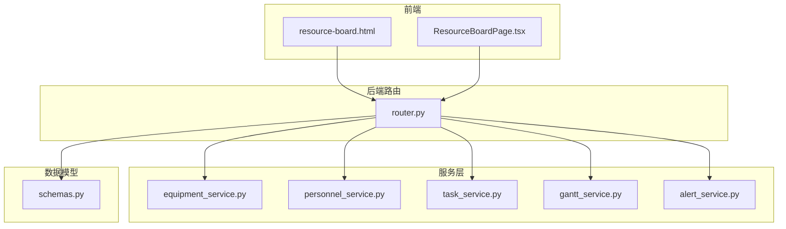
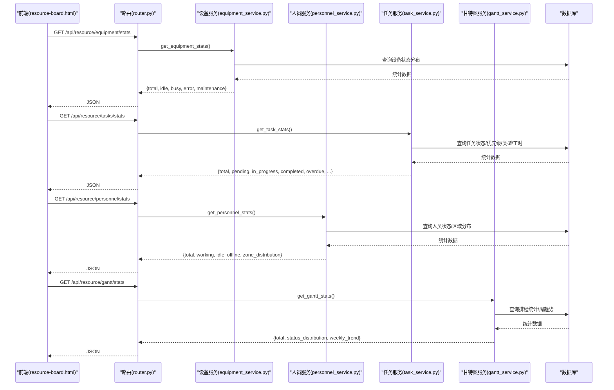
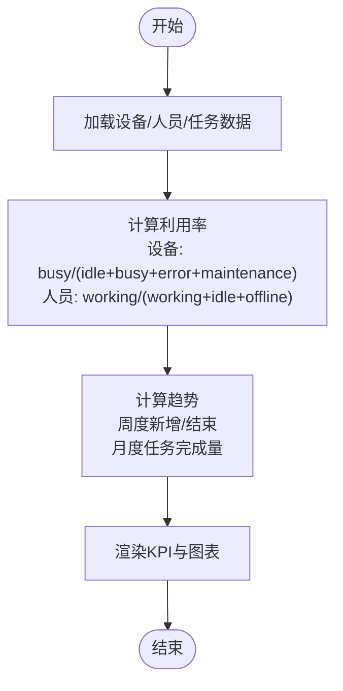
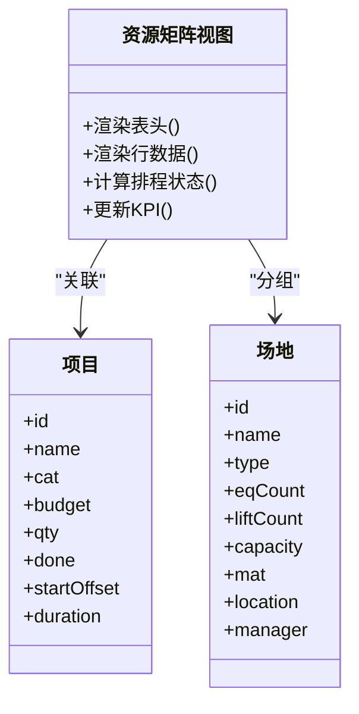
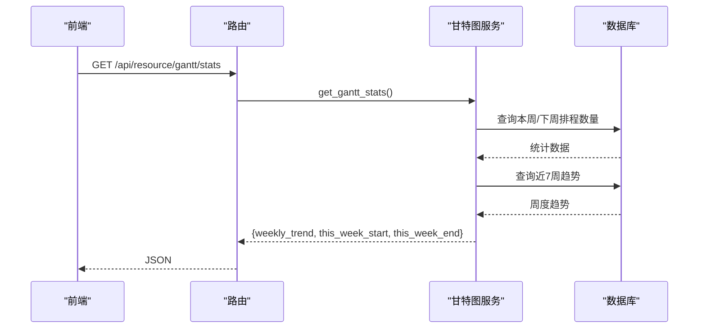
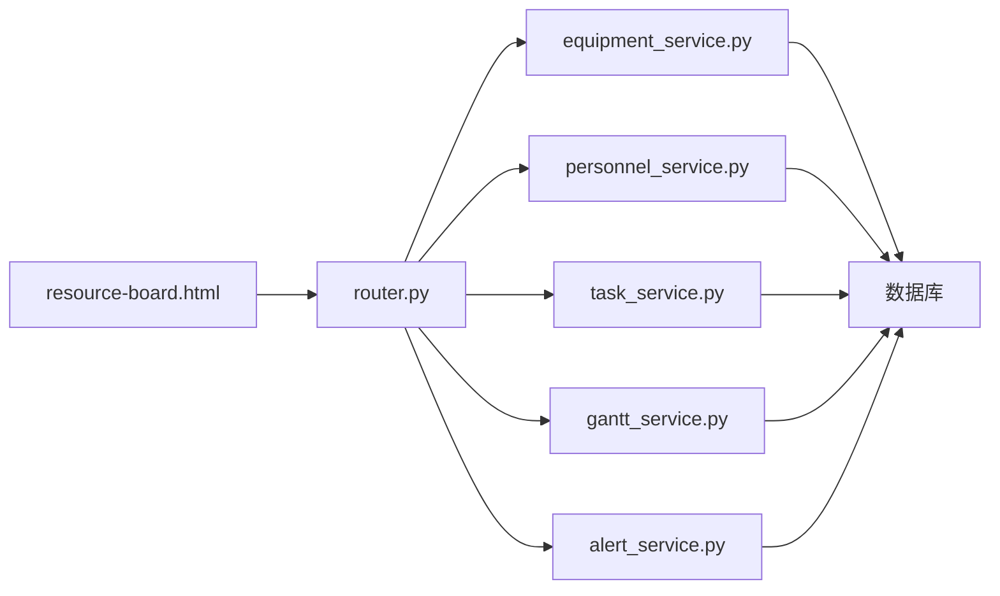

# 资源占用看板

<cite>
**本文引用的文件**
- [backend/modules/resource/router.py](file://backend/modules/resource/router.py)
- [backend/modules/resource/schemas.py](file://backend/modules/resource/schemas.py)
- [backend/modules/resource/services/equipment_service.py](file://backend/modules/resource/services/equipment_service.py)
- [backend/modules/resource/services/personnel_service.py](file://backend/modules/resource/services/personnel_service.py)
- [backend/modules/resource/services/task_service.py](file://backend/modules/resource/services/task_service.py)
- [backend/modules/resource/services/gantt_service.py](file://backend/modules/resource/services/gantt_service.py)
- [backend/modules/resource/services/alert_service.py](file://backend/modules/resource/services/alert_service.py)
- [demo/resource-board.html](file://demo/resource-board.html)
- [webui_ref/client/src/pages/ResourceBoardPage/ResourceBoardPage.tsx](file://webui_ref/client/src/pages/ResourceBoardPage/ResourceBoardPage.tsx)
</cite>

## 目录
1. [简介](#简介)
2. [项目结构](#项目结构)
3. [核心组件](#核心组件)
4. [架构总览](#架构总览)
5. [详细组件分析](#详细组件分析)
6. [依赖关系分析](#依赖关系分析)
7. [性能考量](#性能考量)
8. [故障排查指南](#故障排查指南)
9. [结论](#结论)
10. [附录](#附录)

## 简介
本模块为“资源占用看板”，面向试制资源数智化管理系统，提供：
- 实时资源利用率展示（设备、人员、场地）
- 排程矩阵视图（按周维度呈现项目与资源占用）
- 利用率趋势分析（周度/月度趋势、关键路径与冲突预警）
并配套数据聚合计算、图表类型选择、实时更新机制、颜色编码策略与性能优化方案。文档同时给出具体代码示例路径，便于快速定位实现。

## 项目结构
后端采用 FastAPI 路由 + 服务层分层设计；前端包含静态演示页与 React 页面占位。核心文件组织如下：
- 路由层：统一对外暴露 /api/resource 接口，负责参数校验与调用服务层
- 服务层：设备、人员、任务、甘特图、预警等独立服务，封装业务逻辑与数据库访问
- 数据模型：Pydantic 模型定义请求/响应结构
- 前端：demo/resource-board.html 提供排程矩阵与 KPI 的完整交互原型；React 页面 ResourceBoardPage.tsx 作为占位

**图示来源**
- [backend/modules/resource/router.py:1-120](file://backend/modules/resource/router.py#L1-L120)
- [backend/modules/resource/services/equipment_service.py:1-120](file://backend/modules/resource/services/equipment_service.py#L1-L120)
- [backend/modules/resource/services/personnel_service.py:1-120](file://backend/modules/resource/services/personnel_service.py#L1-L120)
- [backend/modules/resource/services/task_service.py:1-120](file://backend/modules/resource/services/task_service.py#L1-L120)
- [backend/modules/resource/services/gantt_service.py:1-120](file://backend/modules/resource/services/gantt_service.py#L1-L120)
- [backend/modules/resource/services/alert_service.py:1-120](file://backend/modules/resource/services/alert_service.py#L1-L120)
- [backend/modules/resource/schemas.py:1-120](file://backend/modules/resource/schemas.py#L1-L120)
- [demo/resource-board.html:267-390](file://demo/resource-board.html#L267-L390)
- [webui_ref/client/src/pages/ResourceBoardPage/ResourceBoardPage.tsx:1-16](file://webui_ref/client/src/pages/ResourceBoardPage/ResourceBoardPage.tsx#L1-L16)

**章节来源**
- [backend/modules/resource/router.py:1-120](file://backend/modules/resource/router.py#L1-L120)
- [demo/resource-board.html:267-390](file://demo/resource-board.html#L267-L390)
- [webui_ref/client/src/pages/ResourceBoardPage/ResourceBoardPage.tsx:1-16](file://webui_ref/client/src/pages/ResourceBoardPage/ResourceBoardPage.tsx#L1-L16)

## 核心组件
- 设备服务：设备台账、状态管理、维护记录、统计汇总
- 人员服务：人员列表、状态统计、来源分布、地图覆盖层数据
- 任务服务：任务 CRUD、进度自动计算、KPI 与趋势
- 甘特图服务：排程 CRUD、冲突检测、关键路径、周度趋势
- 预警服务：SLA 升级、超期判定、统计与批量处理
- 路由层：统一 API 入口，支持筛选、分页、搜索
- 数据模型：统一的 Pydantic 模型约束前后端数据结构

**章节来源**
- [backend/modules/resource/services/equipment_service.py:1-495](file://backend/modules/resource/services/equipment_service.py#L1-L495)
- [backend/modules/resource/services/personnel_service.py:1-475](file://backend/modules/resource/services/personnel_service.py#L1-L475)
- [backend/modules/resource/services/task_service.py:1-432](file://backend/modules/resource/services/task_service.py#L1-L432)
- [backend/modules/resource/services/gantt_service.py:1-800](file://backend/modules/resource/services/gantt_service.py#L1-L800)
- [backend/modules/resource/services/alert_service.py:1-399](file://backend/modules/resource/services/alert_service.py#L1-L399)
- [backend/modules/resource/schemas.py:1-224](file://backend/modules/resource/schemas.py#L1-L224)

## 架构总览
资源占用看板的数据流从前端发起请求，经路由层分发到对应服务层，服务层通过数据库查询与计算返回结构化数据，前端渲染 KPI、矩阵与图表。

**图示来源**
- [backend/modules/resource/router.py:204-218](file://backend/modules/resource/router.py#L204-L218)
- [backend/modules/resource/services/equipment_service.py:304-335](file://backend/modules/resource/services/equipment_service.py#L304-L335)
- [backend/modules/resource/services/task_service.py:290-332](file://backend/modules/resource/services/task_service.py#L290-L332)
- [backend/modules/resource/services/personnel_service.py:325-379](file://backend/modules/resource/services/personnel_service.py#L325-L379)
- [backend/modules/resource/services/gantt_service.py:269-335](file://backend/modules/resource/services/gantt_service.py#L269-L335)

## 详细组件分析

### 实时资源利用率展示
- 设备利用率：基于设备状态分布（idle/busy/error/maintenance）计算占用率
- 人员利用率：基于人员状态（working/idle/offline）与在岗人数计算
- 场地/机台利用率：结合设备数量与举升机配置，按周计算占用比例
- 趋势分析：周度新增/结束排程数量、月度任务趋势

**章节来源**
- [backend/modules/resource/services/equipment_service.py:304-335](file://backend/modules/resource/services/equipment_service.py#L304-L335)
- [backend/modules/resource/services/personnel_service.py:325-379](file://backend/modules/resource/services/personnel_service.py#L325-L379)
- [backend/modules/resource/services/task_service.py:290-332](file://backend/modules/resource/services/task_service.py#L290-L332)
- [backend/modules/resource/services/gantt_service.py:269-335](file://backend/modules/resource/services/gantt_service.py#L269-L335)

### 排程矩阵视图
- 矩阵维度：左侧固定列显示场地/设备/能力/项目信息，右侧按周展示排程状态
- 状态分类：已完成/进行中/待排/排定中，不同状态使用不同颜色
- 过滤与交互：支持按场地类型、项目类别、排程状态筛选，快速切换与全宽显示
- 数据源：前端 demo 使用本地 Mock 数据生成矩阵；后端可通过甘特图服务获取排程数据

**图示来源**
- [demo/resource-board.html:410-455](file://demo/resource-board.html#L410-L455)
- [demo/resource-board.html:480-508](file://demo/resource-board.html#L480-L508)
- [demo/resource-board.html:540-566](file://demo/resource-board.html#L540-L566)
- [demo/resource-board.html:568-655](file://demo/resource-board.html#L568-L655)

**章节来源**
- [demo/resource-board.html:382-390](file://demo/resource-board.html#L382-L390)
- [demo/resource-board.html:410-455](file://demo/resource-board.html#L410-L455)
- [demo/resource-board.html:480-508](file://demo/resource-board.html#L480-L508)
- [demo/resource-board.html:540-566](file://demo/resource-board.html#L540-L566)
- [demo/resource-board.html:568-655](file://demo/resource-board.html#L568-L655)

### 利用率趋势分析
- 周度趋势：统计每周新增与结束的排程数量，形成时间序列
- 月度趋势：按月统计任务数量与完成数量
- 关键路径与冲突：识别关键任务与资源冲突，辅助排程优化

**图示来源**
- [backend/modules/resource/services/gantt_service.py:269-335](file://backend/modules/resource/services/gantt_service.py#L269-L335)

**章节来源**
- [backend/modules/resource/services/gantt_service.py:269-335](file://backend/modules/resource/services/gantt_service.py#L269-L335)

### 数据聚合计算
- 设备统计：按状态分组计数，计算总数与各状态占比
- 人员统计：按状态与区域分组，计算在岗、空闲、离线人数
- 任务统计：按状态、优先级、类型分组，计算计划与实际工时、平均进度
- 甘特图统计：按阶段、场地、类型分组，计算周度趋势与关键路径数量

**章节来源**
- [backend/modules/resource/services/equipment_service.py:304-335](file://backend/modules/resource/services/equipment_service.py#L304-L335)
- [backend/modules/resource/services/personnel_service.py:325-379](file://backend/modules/resource/services/personnel_service.py#L325-L379)
- [backend/modules/resource/services/task_service.py:290-332](file://backend/modules/resource/services/task_service.py#L290-L332)
- [backend/modules/resource/services/gantt_service.py:269-335](file://backend/modules/resource/services/gantt_service.py#L269-L335)

### 图表类型选择
- 饼图：任务状态分布、人员来源分布
- 柱状图：任务类型与进度对比、人员来源平均工时
- 折线图：周度/月度趋势
- 矩阵视图：排程矩阵（表格形式）

**章节来源**
- [backend/modules/resource/services/task_service.py:335-395](file://backend/modules/resource/services/task_service.py#L335-L395)
- [backend/modules/resource/services/personnel_service.py:382-431](file://backend/modules/resource/services/personnel_service.py#L382-L431)
- [backend/modules/resource/services/gantt_service.py:269-335](file://backend/modules/resource/services/gantt_service.py#L269-L335)

### 实时更新机制
- 前端定时刷新：按钮触发数据刷新，更新时间戳
- 后端缓存建议：对高频统计接口增加缓存层（如 Redis），减少数据库压力
- WebSocket 推送：可选方案，用于实时状态变更通知

**章节来源**
- [demo/resource-board.html:795-797](file://demo/resource-board.html#L795-L797)
- [demo/resource-board.html:783-793](file://demo/resource-board.html#L783-L793)

### 颜色编码策略
- 任务类型：A/B/C/零星试制，分别映射不同颜色
- 排程状态：已完成/进行中/待排/排定中，使用不同背景色与边框
- 预警级别：critical/high/medium/low，影响 SLA 与展示样式

**章节来源**
- [backend/modules/resource/services/gantt_service.py:24-31](file://backend/modules/resource/services/gantt_service.py#L24-L31)
- [backend/modules/resource/services/task_service.py:335-395](file://backend/modules/resource/services/task_service.py#L335-L395)
- [backend/modules/resource/services/alert_service.py:12-30](file://backend/modules/resource/services/alert_service.py#L12-L30)
- [demo/resource-board.html:138-142](file://demo/resource-board.html#L138-L142)

### 性能优化方案
- 分页与筛选：所有列表接口支持分页与多维度筛选，减少数据传输
- SQL 优化：使用 GROUP BY 与索引字段进行聚合查询
- 前端虚拟化：大数据量表格使用虚拟滚动或分页加载
- 缓存策略：对统计接口增加短期缓存，降低数据库负载

**章节来源**
- [backend/modules/resource/services/equipment_service.py:11-103](file://backend/modules/resource/services/equipment_service.py#L11-L103)
- [backend/modules/resource/services/personnel_service.py:24-124](file://backend/modules/resource/services/personnel_service.py#L24-L124)
- [backend/modules/resource/services/task_service.py:48-146](file://backend/modules/resource/services/task_service.py#L48-L146)
- [backend/modules/resource/services/gantt_service.py:176-258](file://backend/modules/resource/services/gantt_service.py#L176-L258)

## 依赖关系分析
- 路由层依赖各服务层，服务层依赖数据库与日志模块
- 前端依赖路由层提供的 API，以及本地 Mock 数据（演示场景）
- 数据模型在各服务间复用，保证接口一致性

**图示来源**
- [backend/modules/resource/router.py:1-120](file://backend/modules/resource/router.py#L1-L120)
- [backend/modules/resource/services/equipment_service.py:1-120](file://backend/modules/resource/services/equipment_service.py#L1-L120)
- [backend/modules/resource/services/personnel_service.py:1-120](file://backend/modules/resource/services/personnel_service.py#L1-L120)
- [backend/modules/resource/services/task_service.py:1-120](file://backend/modules/resource/services/task_service.py#L1-L120)
- [backend/modules/resource/services/gantt_service.py:1-120](file://backend/modules/resource/services/gantt_service.py#L1-L120)
- [backend/modules/resource/services/alert_service.py:1-120](file://backend/modules/resource/services/alert_service.py#L1-L120)

**章节来源**
- [backend/modules/resource/router.py:1-120](file://backend/modules/resource/router.py#L1-L120)

## 性能考量
- 数据库查询：避免 N+1 查询，使用 JOIN 与聚合函数
- 前端渲染：大表格使用虚拟滚动，图表按需加载
- 接口限流：对高频统计接口设置合理限流策略
- 错误处理：统一异常捕获与日志记录，便于问题定位

[本节为通用指导，不直接分析具体文件]

## 故障排查指南
- 接口报错：检查路由层异常捕获与服务层返回值
- 数据不一致：核对数据库状态与服务层计算逻辑
- 性能问题：监控慢查询与前端渲染耗时
- 预警超时：检查 SLA 配置与状态流转

**章节来源**
- [backend/modules/resource/router.py:85-86](file://backend/modules/resource/router.py#L85-L86)
- [backend/modules/resource/services/alert_service.py:337-399](file://backend/modules/resource/services/alert_service.py#L337-L399)

## 结论
资源占用看板通过清晰的分层架构与丰富的可视化手段，实现了设备、人员、任务的实时监控与排程管理。结合趋势分析与冲突检测，为生产调度提供了有力支撑。后续可进一步增强缓存与实时推送能力，提升用户体验与系统性能。

[本节为总结性内容，不直接分析具体文件]

## 附录
- 代码示例路径：
  - 计算资源占用率：[backend/modules/resource/services/equipment_service.py:304-335](file://backend/modules/resource/services/equipment_service.py#L304-L335)
  - 生成排程矩阵图：[demo/resource-board.html:568-655](file://demo/resource-board.html#L568-L655)
  - 实现数据刷新：[demo/resource-board.html:795-797](file://demo/resource-board.html#L795-L797)
  - 响应式布局：[demo/resource-board.html:267-390](file://demo/resource-board.html#L267-L390)