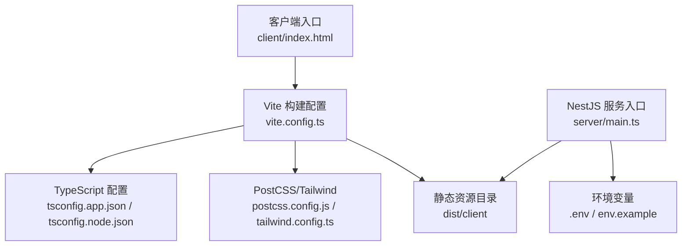
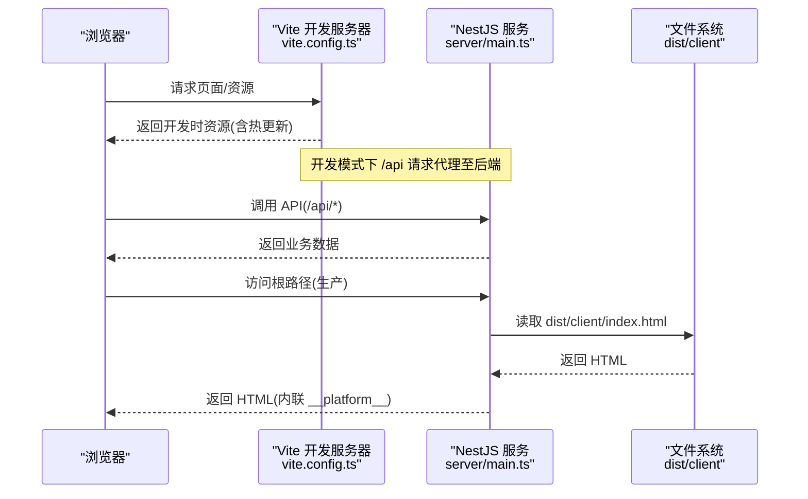
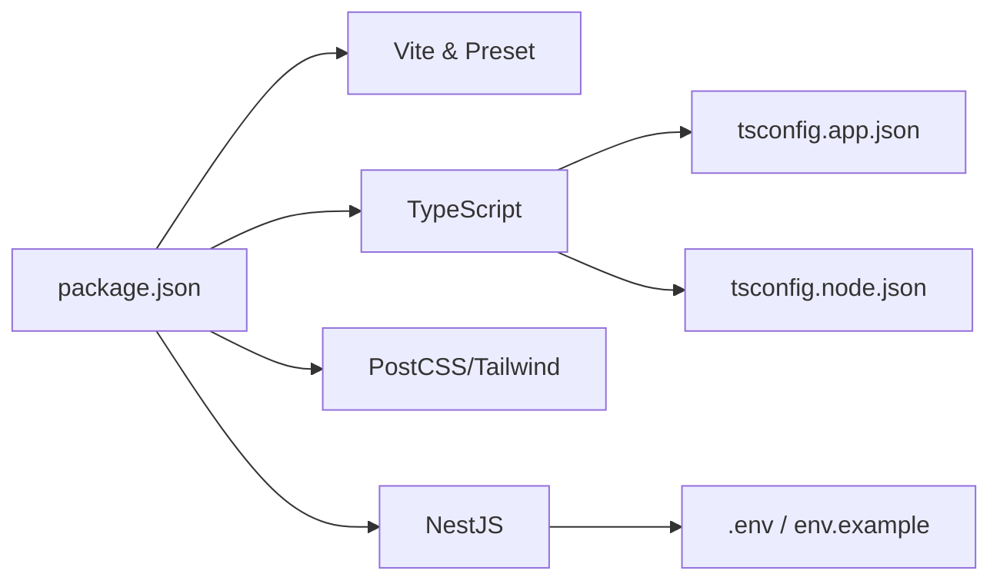

# 构建与部署

<cite>
**本文引用的文件**
- [package.json](file://webui_ref/package.json)
- [vite.config.ts](file://webui_ref/vite.config.ts)
- [tsconfig.app.json](file://webui_ref/tsconfig.app.json)
- [tsconfig.node.json](file://webui_ref/tsconfig.node.json)
- [.npmrc](file://webui_ref/.npmrc)
- [postcss.config.js](file://webui_ref/postcss.config.js)
- [tailwind.config.ts](file://webui_ref/tailwind.config.ts)
- [client/index.html](file://webui_ref/client/index.html)
- [server/main.ts](file://webui_ref/server/main.ts)
- [env.example](file://backend/env.example)
</cite>

## 目录
1. [简介](#简介)
2. [项目结构](#项目结构)
3. [核心组件](#核心组件)
4. [架构总览](#架构总览)
5. [详细组件分析](#详细组件分析)
6. [依赖分析](#依赖分析)
7. [性能考虑](#性能考虑)
8. [故障排查指南](#故障排查指南)
9. [结论](#结论)
10. [附录](#附录)

## 简介
本文件面向前端项目的构建与部署，覆盖开发环境搭建、构建配置与优化策略、生产环境部署、CI/CD 集成、性能监控与错误追踪、日志收集以及常见问题排查。项目采用 Vite 作为前端构建工具，NestJS 作为服务端渲染入口，通过环境变量控制运行行为，并支持在本地与生产环境中进行开发与发布。

## 项目结构
前端工程位于 webui_ref 目录，包含：
- 客户端代码：client/src（React + TypeScript）
- 服务端入口：server/main.ts（NestJS 应用，负责启动服务与静态资源托管）
- 构建与样式：vite.config.ts、postcss.config.js、tailwind.config.ts
- 类型与路径：tsconfig.app.json、tsconfig.node.json
- 包管理与脚本：package.json、.npmrc

图表来源
- [vite.config.ts:1-20](file://webui_ref/vite.config.ts#L1-L20)
- [tsconfig.app.json:1-24](file://webui_ref/tsconfig.app.json#L1-L24)
- [tsconfig.node.json:1-17](file://webui_ref/tsconfig.node.json#L1-L17)
- [postcss.config.js:1-11](file://webui_ref/postcss.config.js#L1-L11)
- [tailwind.config.ts:1-9](file://webui_ref/tailwind.config.ts#L1-L9)
- [client/index.html:1-23](file://webui_ref/client/index.html#L1-L23)
- [server/main.ts:1-32](file://webui_ref/server/main.ts#L1-L32)

章节来源
- [package.json:11-34](file://webui_ref/package.json#L11-L34)
- [vite.config.ts:1-20](file://webui_ref/vite.config.ts#L1-L20)
- [tsconfig.app.json:1-24](file://webui_ref/tsconfig.app.json#L1-L24)
- [tsconfig.node.json:1-17](file://webui_ref/tsconfig.node.json#L1-L17)
- [postcss.config.js:1-11](file://webui_ref/postcss.config.js#L1-L11)
- [tailwind.config.ts:1-9](file://webui_ref/tailwind.config.ts#L1-L9)
- [client/index.html:1-23](file://webui_ref/client/index.html#L1-L23)
- [server/main.ts:10-32](file://webui_ref/server/main.ts#L10-L32)

## 核心组件
- 构建系统：Vite 配合 @lark-apaas/fullstack-vite-preset，提供开发服务器、代理、别名等能力。
- 类型与路径：通过 tsconfig 定义 client/server/shared 的路径映射与编译选项。
- 样式管线：PostCSS + Tailwind，启用按需生成与自动前缀。
- 服务端：NestJS 应用加载 dist/client 下的静态资源，并通过 HBS 引擎渲染 HTML。
- 环境变量：通过 .env 或进程环境变量注入后端服务与运行时参数。

章节来源
- [package.json:11-34](file://webui_ref/package.json#L11-L34)
- [vite.config.ts:1-20](file://webui_ref/vite.config.ts#L1-L20)
- [tsconfig.app.json:1-24](file://webui_ref/tsconfig.app.json#L1-L24)
- [postcss.config.js:1-11](file://webui_ref/postcss.config.js#L1-L11)
- [tailwind.config.ts:1-9](file://webui_ref/tailwind.config.ts#L1-L9)
- [server/main.ts:10-32](file://webui_ref/server/main.ts#L10-L32)

## 架构总览
下图展示了从浏览器到服务端渲染的完整链路，包括开发模式下的代理转发与生产模式的静态资源托管。

图表来源
- [vite.config.ts:10-18](file://webui_ref/vite.config.ts#L10-L18)
- [server/main.ts:21-28](file://webui_ref/server/main.ts#L21-L28)
- [client/index.html:9-15](file://webui_ref/client/index.html#L9-L15)

## 详细组件分析

### 开发环境搭建
- Node.js 版本要求
  - 使用 package.json 中 engines 字段声明的最小版本，确保 Node.js 与 npm 版本满足要求。
- 依赖安装
  - 使用 .npmrc 指定镜像源与缓存目录，提升下载速度并稳定构建。
  - 执行安装命令后，可通过 scripts 中的 dev 命令启动开发流程。
- 环境变量配置
  - 后端服务端口与主机由 server/main.ts 读取 SERVER_HOST 与 SERVER_PORT。
  - 其他后端相关变量参考 backend/env.example，如数据库、跨域、爬虫、飞书、采购接口、LLM 等。
- 开发服务器与代理
  - Vite 默认监听 5173 端口，并将 /api 请求代理到 http://localhost:8000，便于前后端联调。

章节来源
- [package.json:202-205](file://webui_ref/package.json#L202-L205)
- [.npmrc:1-2](file://webui_ref/.npmrc#L1-L2)
- [package.json:11-15](file://webui_ref/package.json#L11-L15)
- [server/main.ts:18-20](file://webui_ref/server/main.ts#L18-L20)
- [env.example:7-49](file://backend/env.example#L7-L49)
- [vite.config.ts:10-18](file://webui_ref/vite.config.ts#L10-L18)

### 构建配置与优化策略
- 构建脚本
  - 使用 package.json 中的 build 与 build:prod 脚本，分别用于通用构建与生产构建（同时构建服务端与客户端）。
- Vite 配置
  - 使用 @lark-apaas/fullstack-vite-preset 提供的 defineConfig，简化配置复杂度。
  - 设置 @ 别名指向 client/src，统一模块导入路径。
  - 开发服务器开启代理，将 /api 转发至后端。
- TypeScript 配置
  - tsconfig.app.json 与 tsconfig.node.json 分别管理客户端与服务端编译选项与路径映射，启用增量编译以提升构建速度。
- 样式处理
  - PostCSS 插件链包含 postcss-import、@tailwindcss/postcss、autoprefixer，结合 Tailwind 预设实现高效样式生成与前缀兼容。
- 资源与模板
  - 客户端入口为 client/index.html，通过脚本注入 __platform__ 平台信息，供运行时使用。

章节来源
- [package.json:17-20](file://webui_ref/package.json#L17-L20)
- [vite.config.ts:1-18](file://webui_ref/vite.config.ts#L1-L18)
- [tsconfig.app.json:1-24](file://webui_ref/tsconfig.app.json#L1-L24)
- [tsconfig.node.json:1-17](file://webui_ref/tsconfig.node.json#L1-L17)
- [postcss.config.js:1-11](file://webui_ref/postcss.config.js#L1-L11)
- [tailwind.config.ts:1-9](file://webui_ref/tailwind.config.ts#L1-L9)
- [client/index.html:9-15](file://webui_ref/client/index.html#L9-L15)

### 生产环境部署
- 构建产物
  - 构建后客户端资源输出至 dist/client，服务端会将其作为静态资源目录托管。
- 服务端渲染
  - NestJS 应用通过 setBaseViewsDir 指向 dist/client，并使用 hbs 引擎渲染 HTML，同时将 __platform__ 注入页面。
- 环境变量
  - 通过 SERVER_HOST 与 SERVER_PORT 控制服务监听地址与端口；其他后端变量按 backend/env.example 配置。
- 静态资源托管与 CDN
  - 可将 dist/client 目录部署至任意静态资源服务器或 CDN，并在 Nginx/Apache 中将根路径指向该目录。
- 域名与反向代理
  - 建议通过反向代理将域名绑定到服务端口，并开启 HTTPS。若使用独立静态托管，需确保 API 域名与前端域名一致或通过 CORS 允许跨域。

章节来源
- [server/main.ts:21-28](file://webui_ref/server/main.ts#L21-L28)
- [server/main.ts:18-20](file://webui_ref/server/main.ts#L18-L20)
- [env.example:14-20](file://backend/env.example#L14-L20)

### CI/CD 流水线集成与自动化部署
- 推荐步骤
  - 安装依赖：基于 .npmrc 镜像源拉取依赖。
  - 类型检查：执行 type:check 校验客户端与服务端类型。
  - 构建：执行 build:prod 生成 dist/client 与服务端产物。
  - 部署：将 dist/client 上传至静态托管或容器镜像，并启动 NestJS 服务。
- 缓存策略
  - 缓存 node_modules 与 npm cache，加速后续构建。
- 环境变量注入
  - 在 CI 中注入 SERVER_HOST、SERVER_PORT 及其他后端所需变量，避免硬编码。
- 回滚策略
  - 保留历史构建产物与配置文件，支持快速回滚到上一稳定版本。

章节来源
- [.npmrc:1-2](file://webui_ref/.npmrc#L1-L2)
- [package.json:27-30](file://webui_ref/package.json#L27-L30)
- [package.json:17-20](file://webui_ref/package.json#L17-L20)
- [server/main.ts:18-20](file://webui_ref/server/main.ts#L18-L20)

### 性能监控、错误追踪与日志收集
- 性能监控
  - 可在 client/index.html 中注入第三方监控 SDK，采集首屏时间、资源加载耗时与用户行为指标。
- 错误追踪
  - 在前端捕获未处理异常与 Promise 拒绝，上报至错误追踪平台；在后端可记录关键错误日志。
- 日志收集
  - 后端服务启动时会输出运行信息，建议将日志输出到标准输出以便集中收集；生产环境可接入日志聚合服务。

章节来源
- [client/index.html:9-15](file://webui_ref/client/index.html#L9-L15)
- [server/main.ts:17-28](file://webui_ref/server/main.ts#L17-L28)

## 依赖分析
- 构建与运行时依赖
  - Vite 与 Preset：提供构建、开发服务器与代理能力。
  - TypeScript：客户端与服务端类型检查与编译。
  - PostCSS/Tailwind：样式处理与原子化 CSS。
  - NestJS：服务端应用框架，负责静态资源托管与视图渲染。
- 路径与别名
  - 通过 tsconfig 定义 @、@client、@server、@shared 等路径映射，减少相对路径耦合。
- 外部服务
  - 后端依赖数据库、爬虫、飞书、采购接口、LLM 等，通过环境变量注入。

图表来源
- [package.json:36-189](file://webui_ref/package.json#L36-L189)
- [tsconfig.app.json:1-24](file://webui_ref/tsconfig.app.json#L1-L24)
- [tsconfig.node.json:1-17](file://webui_ref/tsconfig.node.json#L1-L17)
- [env.example:7-49](file://backend/env.example#L7-L49)

章节来源
- [package.json:36-189](file://webui_ref/package.json#L36-L189)
- [tsconfig.app.json:1-24](file://webui_ref/tsconfig.app.json#L1-L24)
- [tsconfig.node.json:1-17](file://webui_ref/tsconfig.node.json#L1-L17)
- [env.example:7-49](file://backend/env.example#L7-L49)

## 性能考虑
- 构建优化
  - 使用增量编译（tsconfig 已启用 incremental），缩短二次构建时间。
  - 利用 Vite 预构建与依赖缓存，加快冷启动与热更新。
- 资源优化
  - 通过 Tailwind 按需生成样式，减少 CSS 体积。
  - 图片与静态资源建议使用合适的格式与尺寸，必要时引入懒加载。
- 网络优化
  - 生产环境启用 Gzip/Brotli 压缩（由 Web 服务器或 CDN 提供）。
  - 合理设置缓存头，对静态资源启用长期缓存与版本号。
- 运行时优化
  - 在 client/index.html 中注入的平台信息可用于条件加载资源，减少无关逻辑。

章节来源
- [tsconfig.app.json:11-12](file://webui_ref/tsconfig.app.json#L11-L12)
- [postcss.config.js:5-9](file://webui_ref/postcss.config.js#L5-L9)
- [tailwind.config.ts:3-8](file://webui_ref/tailwind.config.ts#L3-L8)
- [client/index.html:9-15](file://webui_ref/client/index.html#L9-L15)

## 故障排查指南
- 开发服务器无法启动
  - 检查 Node.js 与 npm 版本是否符合 engines 要求。
  - 确认 .npmrc 镜像源可达，必要时切换回官方源。
  - 查看端口占用情况，调整 vite.config.ts 中的端口或后端端口。
- API 请求失败
  - 开发模式下确认 /api 代理目标是否正确（默认 http://localhost:8000）。
  - 生产模式下检查 CORS 配置与域名一致性。
- 构建失败
  - 执行 type:check 定位类型错误。
  - 清理 node_modules 与缓存后重试安装与构建。
- 生产环境白屏或资源 404
  - 确认 dist/client 目录存在且被正确托管。
  - 检查 server/main.ts 中视图目录设置与 HTML 模板是否可用。
- 环境变量问题
  - 核对 SERVER_HOST、SERVER_PORT 与其他后端变量是否按 env.example 配置。
  - 在 CI/CD 中确保环境变量已注入且未被覆盖。

章节来源
- [package.json:202-205](file://webui_ref/package.json#L202-L205)
- [.npmrc:1-2](file://webui_ref/.npmrc#L1-L2)
- [vite.config.ts:10-18](file://webui_ref/vite.config.ts#L10-L18)
- [server/main.ts:21-28](file://webui_ref/server/main.ts#L21-L28)
- [env.example:7-49](file://backend/env.example#L7-L49)

## 结论
本项目以 Vite 为核心构建工具，结合 NestJS 提供服务端渲染与静态资源托管，通过环境变量实现灵活的环境配置。遵循本文的开发、构建、部署与排障指引，可快速搭建稳定的开发环境与生产发布流程，并具备良好的可扩展性与可维护性。

## 附录
- 常用命令
  - 开发：npm run dev
  - 开发服务端：npm run dev:server
  - 开发客户端：npm run dev:client
  - 构建：npm run build
  - 生产构建：npm run build:prod
  - 类型检查：npm run type:check
- 关键配置位置
  - 构建与脚本：package.json
  - Vite 配置：vite.config.ts
  - 类型配置：tsconfig.app.json、tsconfig.node.json
  - 样式配置：postcss.config.js、tailwind.config.ts
  - 服务端入口：server/main.ts
  - 环境变量示例：backend/env.example

章节来源
- [package.json:11-34](file://webui_ref/package.json#L11-L34)
- [vite.config.ts:1-20](file://webui_ref/vite.config.ts#L1-L20)
- [tsconfig.app.json:1-24](file://webui_ref/tsconfig.app.json#L1-L24)
- [tsconfig.node.json:1-17](file://webui_ref/tsconfig.node.json#L1-L17)
- [postcss.config.js:1-11](file://webui_ref/postcss.config.js#L1-L11)
- [tailwind.config.ts:1-9](file://webui_ref/tailwind.config.ts#L1-L9)
- [server/main.ts:10-32](file://webui_ref/server/main.ts#L10-L32)
- [env.example:7-49](file://backend/env.example#L7-L49)