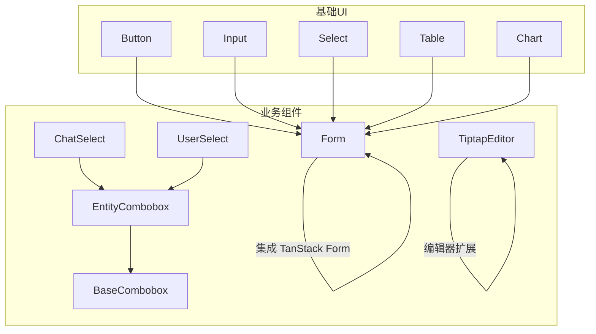
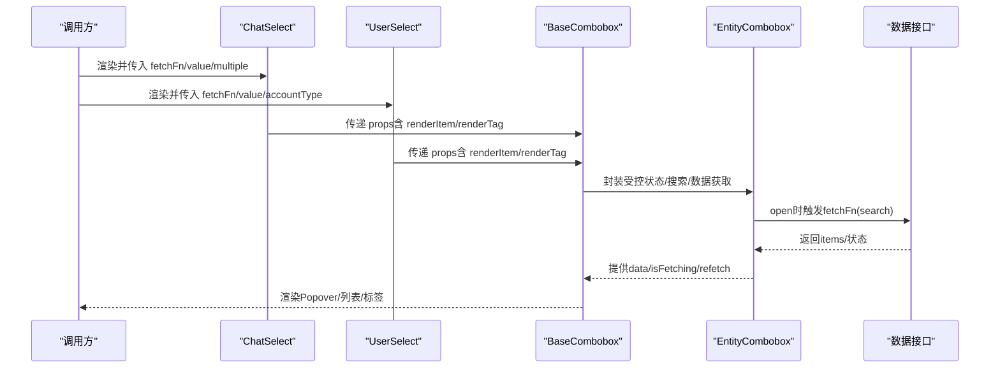
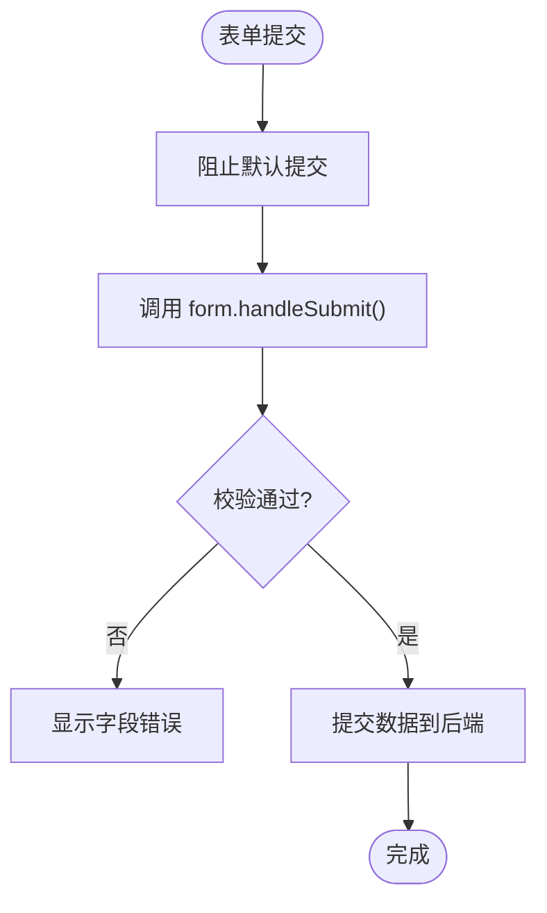
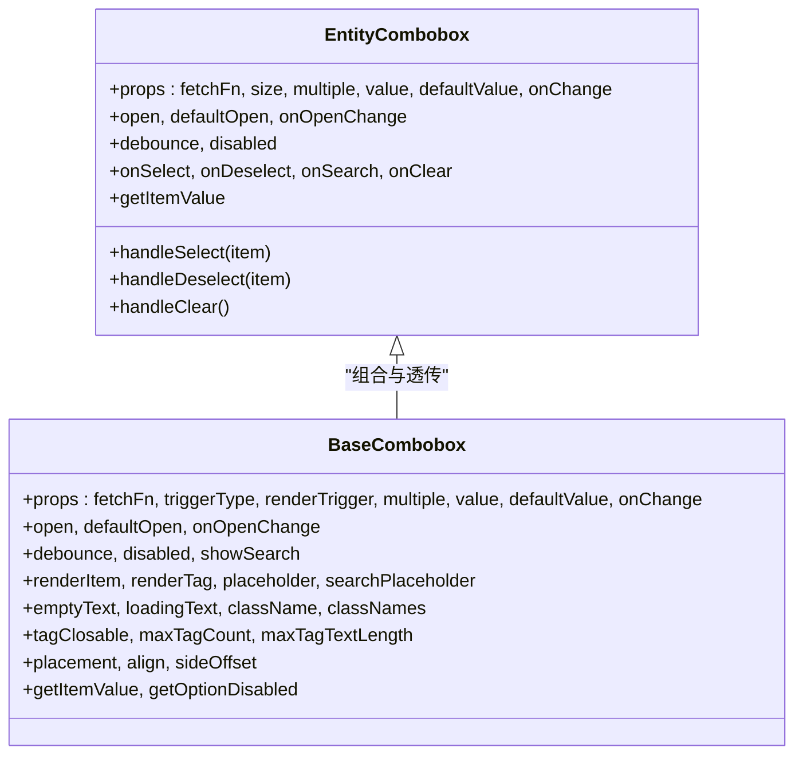
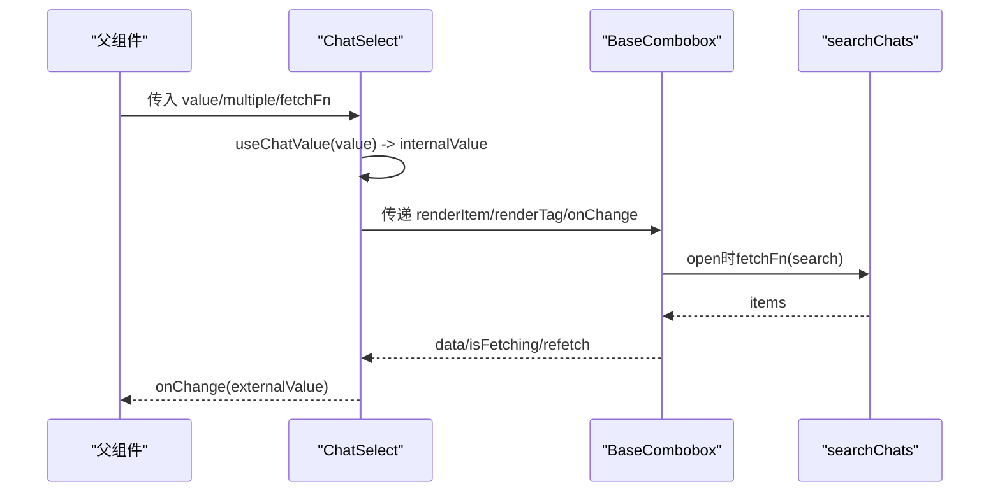
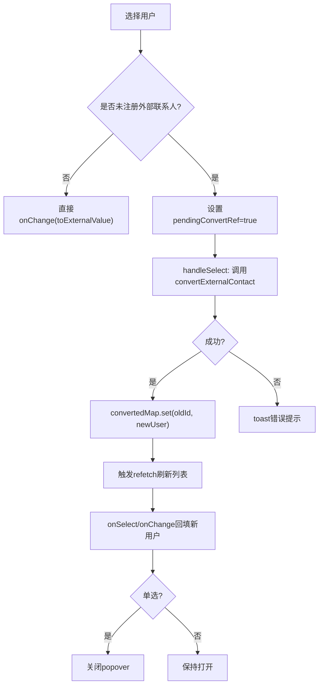
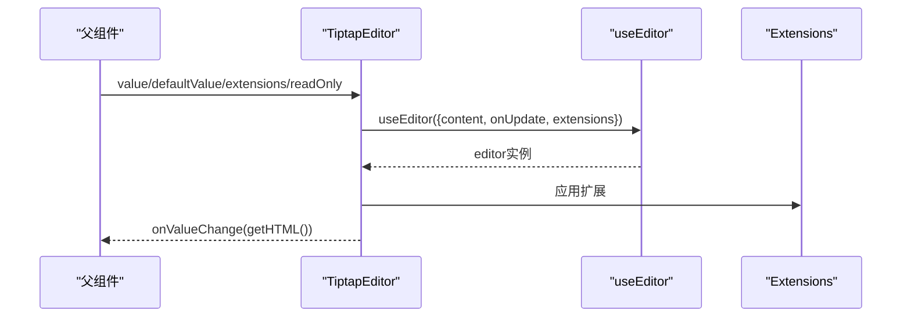
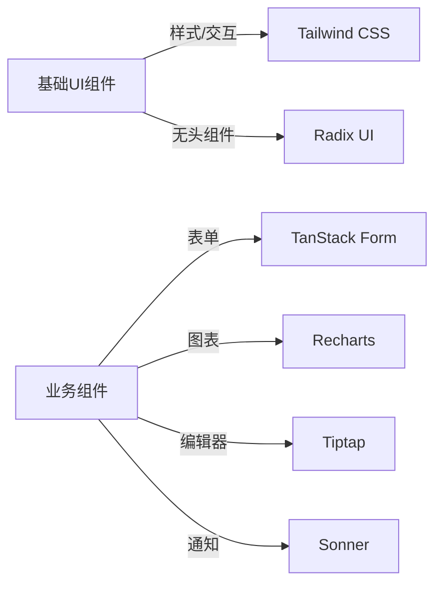

# 组件开发指南

<cite>
**本文档引用的文件**
- [package.json](file://webui_ref/package.json)
- [components.json](file://webui_ref/components.json)
- [button.tsx](file://webui_ref/client/src/components/ui/button.tsx)
- [input.tsx](file://webui_ref/client/src/components/ui/input.tsx)
- [select.tsx](file://webui_ref/client/src/components/ui/select.tsx)
- [table.tsx](file://webui_ref/client/src/components/ui/table.tsx)
- [chart.tsx](file://webui_ref/client/src/components/ui/chart.tsx)
- [form.tsx](file://webui_ref/client/src/components/business-ui/form/form.tsx)
- [form.tsx（hooks）](file://webui_ref/client/src/components/business-ui/form/hooks/form.tsx)
- [entity-combobox.tsx](file://webui_ref/client/src/components/business-ui/entity-combobox/entity-combobox.tsx)
- [base-combobox.tsx](file://webui_ref/client/src/components/business-ui/entity-combobox/base-combobox.tsx)
- [chat-select.tsx](file://webui_ref/client/src/components/business-ui/chat-select/chat-select.tsx)
- [user-select.tsx](file://webui_ref/client/src/components/business-ui/user-select/user-select.tsx)
- [tiptap-editor.tsx](file://webui_ref/client/src/components/business-ui/tiptap-editor/tiptap-editor.tsx)
</cite>

## 目录
1. [简介](#简介)
2. [项目结构](#项目结构)
3. [核心组件](#核心组件)
4. [架构总览](#架构总览)
5. [详细组件分析](#详细组件分析)
6. [依赖关系分析](#依赖关系分析)
7. [性能考量](#性能考量)
8. [故障排查指南](#故障排查指南)
9. [结论](#结论)
10. [附录](#附录)

## 简介
本指南面向前端组件库的使用与二次开发，覆盖基础 UI 组件（按钮、输入、选择器、表格、图表等）与业务流程组件（搜索框、选择器、富文本编辑器等）的开发模式。文档重点说明：
- Props 设计与事件处理约定
- 状态管理（受控/非受控、上下文、表单集成）
- 样式定制（主题变量、变体、尺寸）
- Hooks 封装与使用模式（数据获取、防抖、本地存储、用户交互）
- 组件测试策略与性能优化技巧
- 组件文档生成与版本管理最佳实践

## 项目结构
本项目采用“基础 UI + 业务组件”的分层组织方式：
- 基础 UI 组件位于 client/src/components/ui，提供原子化、可组合的 UI 能力（如 Button、Input、Select、Table、Chart）。
- 业务组件位于 client/src/components/business-ui，基于基础 UI 与通用逻辑封装领域级能力（如 EntityCombobox、ChatSelect、UserSelect、Form、TiptapEditor）。
- 配置与工具：
  - components.json 定义 shadcn 风格、别名与图标库。
  - package.json 声明依赖与脚本，包含 React、Radix、Recharts、Tailwind、TanStack Form、Zustand 等。

图示来源
- [components.json:1-21](file://webui_ref/components.json#L1-L21)
- [package.json:36-189](file://webui_ref/package.json#L36-L189)

章节来源
- [components.json:1-21](file://webui_ref/components.json#L1-L21)
- [package.json:1-211](file://webui_ref/package.json#L1-L211)

## 核心组件
本节概述各组件的职责与关键设计点，便于快速上手与规范落地。

- 按钮（Button）
  - 通过 class-variance-authority 管理 variant 与 size 变体，支持 asChild 透传。
  - 统一焦点环、禁用态与层级提升效果。
  - 适用场景：主操作、次操作、危险操作、幽灵按钮等。

- 输入（Input）
  - 标准原生 input 封装，统一边框、占位符、禁用态、无效态样式。
  - 适合表单字段、搜索框、过滤条件等。

- 选择器（Select）
  - 基于 Radix Select，提供 Trigger/Content/Item/Label/Separator 等子组件。
  - 支持大小尺寸、滚动、无障碍与键盘导航。

- 表格（Table）
  - 将 table 语义拆分为 Table/TableHeader/TableBody/TableFooter/TableRow/TableHead/TableCell/Caption。
  - 支持悬停高亮、选中态、底部边框与 caption。

- 图表（Chart）
  - 基于 Recharts 封装 ChartContainer/Tooltip/Legend，支持主题色与动态样式注入。
  - 提供统一的 Tooltip 与 Legend 渲染策略，便于多系列展示。

- 表单（Form）
  - 基于 TanStack Form 的 AppForm 包装，提供 FieldGroup 布局与提交拦截。
  - 通过 createAppFormHook 注册常用字段组件（Input、Switch、RadioGroup、Checkbox、Select、Textarea）。

- 实体选择器（EntityCombobox/BaseCombobox）
  - 提供受控/非受控值、多选、搜索防抖、下拉打开关闭、数据获取与错误状态。
  - BaseCombobox 聚合 PopoverWrapper 与列表/空态/加载态子组件，统一交互体验。

- 聊天选择器（ChatSelect）
  - 基于 BaseCombobox，内置聊天数据获取与标签渲染，支持多种 value 类型转换。

- 用户选择器（UserSelect）
  - 基于 BaseCombobox，支持外部联系人开户流程、已开户用户回写、禁用态控制与提示。

- 富文本编辑器（TiptapEditor）
  - 基于 Tiptap，提供受控 HTML 值、只读模式、扩展注入、工具栏与悬浮链接工具条。

章节来源
- [button.tsx:1-70](file://webui_ref/client/src/components/ui/button.tsx#L1-L70)
- [input.tsx:1-22](file://webui_ref/client/src/components/ui/input.tsx#L1-L22)
- [select.tsx:1-244](file://webui_ref/client/src/components/ui/select.tsx#L1-L244)
- [table.tsx:1-117](file://webui_ref/client/src/components/ui/table.tsx#L1-L117)
- [chart.tsx:1-358](file://webui_ref/client/src/components/ui/chart.tsx#L1-L358)
- [form.tsx:1-55](file://webui_ref/client/src/components/business-ui/form/form.tsx#L1-L55)
- [form.tsx（hooks）:1-41](file://webui_ref/client/src/components/business-ui/form/hooks/form.tsx#L1-L41)
- [entity-combobox.tsx:1-146](file://webui_ref/client/src/components/business-ui/entity-combobox/entity-combobox.tsx#L1-L146)
- [base-combobox.tsx:1-133](file://webui_ref/client/src/components/business-ui/entity-combobox/base-combobox.tsx#L1-L133)
- [chat-select.tsx:1-198](file://webui_ref/client/src/components/business-ui/chat-select/chat-select.tsx#L1-L198)
- [user-select.tsx:1-360](file://webui_ref/client/src/components/business-ui/user-select/user-select.tsx#L1-L360)
- [tiptap-editor.tsx:1-170](file://webui_ref/client/src/components/business-ui/tiptap-editor/tiptap-editor.tsx#L1-L170)

## 架构总览
下图展示了业务选择器的典型调用链：上层业务组件（ChatSelect/UserSelect）通过 BaseCombobox 复用通用交互，底层 EntityCombobox 负责受控状态、搜索与数据获取，再结合 Popover 与列表/空态/加载态子组件完成渲染。

图示来源
- [chat-select.tsx:17-23](file://webui_ref/client/src/components/business-ui/chat-select/chat-select.tsx#L17-L23)
- [user-select.tsx:25-36](file://webui_ref/client/src/components/business-ui/user-select/user-select.tsx#L25-L36)
- [base-combobox.tsx:16-133](file://webui_ref/client/src/components/business-ui/entity-combobox/base-combobox.tsx#L16-L133)
- [entity-combobox.tsx:14-146](file://webui_ref/client/src/components/business-ui/entity-combobox/entity-combobox.tsx#L14-L146)

## 详细组件分析

### 基础 UI 组件
- Button
  - 设计要点：variant/size 变体、asChild 透传、焦点环与禁用态。
  - 样式定制：通过 Tailwind 类名与 CSS 变量组合实现主题适配。
  - 事件处理：透传原生事件，避免重复绑定。

- Input
  - 设计要点：统一边框、占位符、无效态、禁用态；兼容 file 上传样式。
  - 事件处理：原生 onChange/onFocus/onBlur 透传。

- Select
  - 设计要点：基于 Radix，提供 Trigger/Content/Item/Label/Separator；支持 popper 定位与滚动。
  - 事件处理：onValueChange 映射空字符串边界值，保证受控一致性。

- Table
  - 设计要点：语义化拆分，hover/selected 状态，caption 描述。
  - 事件处理：行点击、单元格内容自定义插槽。

- Chart
  - 设计要点：ChartContainer 注入主题色，Tooltip/Legend 统一渲染；支持 nameKey/labelKey 映射。
  - 事件处理：tooltip 回调、legend 点击联动。

章节来源
- [button.tsx:7-69](file://webui_ref/client/src/components/ui/button.tsx#L7-L69)
- [input.tsx:5-19](file://webui_ref/client/src/components/ui/input.tsx#L5-L19)
- [select.tsx:10-29](file://webui_ref/client/src/components/ui/select.tsx#L10-L29)
- [table.tsx:7-116](file://webui_ref/client/src/components/ui/table.tsx#L7-L116)
- [chart.tsx:11-69](file://webui_ref/client/src/components/ui/chart.tsx#L11-L69)

### 表单系统（TanStack Form 集成）
- 表单容器（Form）
  - 职责：包裹 form 元素，阻止默认提交，调用 form.handleSubmit；提供 FieldGroup 布局与 layout 模式。
  - 事件处理：submit 拦截，确保与 TanStack Form 生命周期一致。

- 字段注册（createAppFormHook）
  - 职责：注册常用字段组件（Input、Switch、RadioGroup、Checkbox、Select、Textarea），并提供 fieldContext 与 formContext。
  - 扩展性：允许传入自定义 fieldComponents 与 formComponents 进行替换。

图示来源
- [form.tsx:30-50](file://webui_ref/client/src/components/business-ui/form/form.tsx#L30-L50)
- [form.tsx（hooks）:19-40](file://webui_ref/client/src/components/business-ui/form/hooks/form.tsx#L19-L40)

章节来源
- [form.tsx:1-55](file://webui_ref/client/src/components/business-ui/form/form.tsx#L1-L55)
- [form.tsx（hooks）:1-41](file://webui_ref/client/src/components/business-ui/form/hooks/form.tsx#L1-L41)

### 实体选择器（EntityCombobox / BaseCombobox）
- 受控状态
  - 使用 useControllableState 管理 value/open，支持 defaultValue/defaultOpen 与 onChange/onOpenChange。
  - 多选模式下，value 为数组；单选模式下为对象或 null。

- 搜索与数据获取
  - 搜索词防抖（debounce），open 时启用请求；提供 refetch 能力。
  - 通过 getItemValue 标准化 item 结构（id/name/avatar/raw）。

- 选择与清除
  - handleSelect/handleDeselect/handleClear 统一更新 selectedValue 并触发 onSelect/onDeselect/onClear。

- 组合式 API
  - BaseCombobox 聚合 PopoverWrapper 与列表/空态/加载态子组件，对外暴露 Content/Search/List/Item/Empty/Loading 以支持深度定制。

图示来源
- [entity-combobox.tsx:14-146](file://webui_ref/client/src/components/business-ui/entity-combobox/entity-combobox.tsx#L14-L146)
- [base-combobox.tsx:16-133](file://webui_ref/client/src/components/business-ui/entity-combobox/base-combobox.tsx#L16-L133)

章节来源
- [entity-combobox.tsx:1-146](file://webui_ref/client/src/components/business-ui/entity-combobox/entity-combobox.tsx#L1-L146)
- [base-combobox.tsx:1-133](file://webui_ref/client/src/components/business-ui/entity-combobox/base-combobox.tsx#L1-L133)

### 聊天选择器（ChatSelect）
- 数据获取
  - 内部 createChatsFetcher 封装 searchChats 调用，返回 items 列表。
- 值转换
  - 通过 useChatValue 将外部 value（字符串/对象/数组）转换为内部 Chat 结构，并在 onChange 时转回外部格式。
- 渲染
  - renderItem 使用 ChatItemWrapper 读取 context 中的 size 与 searchKeyword；renderTag 使用 ChatSelectTagWrapper 支持关闭与加载态。

图示来源
- [chat-select.tsx:17-23](file://webui_ref/client/src/components/business-ui/chat-select/chat-select.tsx#L17-L23)
- [chat-select.tsx:76-198](file://webui_ref/client/src/components/business-ui/chat-select/chat-select.tsx#L76-L198)
- [base-combobox.tsx:16-133](file://webui_ref/client/src/components/business-ui/entity-combobox/base-combobox.tsx#L16-L133)

章节来源
- [chat-select.tsx:1-198](file://webui_ref/client/src/components/business-ui/chat-select/chat-select.tsx#L1-L198)

### 用户选择器（UserSelect）
- 特殊流程：外部联系人开户
  - handleChange 中检测未注册用户，设置 pendingConvertRef 阻止 popover 关闭。
  - handleSelect 中触发 convertExternalContact，成功后将转换后的用户写入 convertedMap，触发列表刷新。
  - 开户进行中标记 convertingSet，禁用重复点击。
- 值转换
  - useUserValue 将外部 value（字符串/对象/数组）转换为内部 UserSelectItemValue，并在 onChange 时转回外部格式。
- 渲染
  - renderItem 使用 UserItemWrapper 读取 context 中的 size 与 searchKeyword；renderTag 使用 UserSelectTagWrapper 支持关闭与加载态。

图示来源
- [user-select.tsx:196-288](file://webui_ref/client/src/components/business-ui/user-select/user-select.tsx#L196-L288)
- [user-select.tsx:25-36](file://webui_ref/client/src/components/business-ui/user-select/user-select.tsx#L25-L36)

章节来源
- [user-select.tsx:1-360](file://webui_ref/client/src/components/business-ui/user-select/user-select.tsx#L1-L360)

### 富文本编辑器（TiptapEditor）
- 受控值与只读
  - 通过 value/defaultValue 初始化 content，readOnly 控制 editable。
  - onUpdate 回调输出最新 HTML。
- 扩展与工具栏
  - 默认注入 CompleteKit 扩展；支持自定义 extensions。
  - 提供 EditorToolbar/ToolbarSeparator 等工具栏组件。
- 上下文
  - EditorContext 暴露 editor 实例供子组件使用（如 LinkHoverToolbar）。

图示来源
- [tiptap-editor.tsx:19-111](file://webui_ref/client/src/components/business-ui/tiptap-editor/tiptap-editor.tsx#L19-L111)

章节来源
- [tiptap-editor.tsx:1-170](file://webui_ref/client/src/components/business-ui/tiptap-editor/tiptap-editor.tsx#L1-L170)

## 依赖关系分析
- 基础 UI 依赖
  - Radix UI（Select、Dialog、Popover 等）、Tailwind CSS、Lucide 图标、class-variance-authority。
- 业务组件依赖
  - TanStack Form（表单体系）、Recharts（图表）、Tiptap（富文本）、Sonner（通知）。
- 构建与配置
  - Vite、TypeScript、ESLint、Stylelint、Prettier。

图示来源
- [package.json:36-189](file://webui_ref/package.json#L36-L189)
- [components.json:1-21](file://webui_ref/components.json#L1-L21)

章节来源
- [package.json:1-211](file://webui_ref/package.json#L1-L211)
- [components.json:1-21](file://webui_ref/components.json#L1-L21)

## 性能考量
- 数据获取与缓存
  - 使用防抖减少频繁请求；仅在 open 时启用 fetch；提供 refetch 以便主动刷新。
  - 对搜索结果进行分页与去重，避免重复渲染。
- 渲染优化
  - 使用 memo/useMemo/useCallback 稳定引用，减少不必要的重渲染。
  - 列表项使用 key 稳定标识（id），避免全量重排。
- 样式与主题
  - 通过 CSS 变量与 Tailwind 类名组合，避免内联样式过多导致的性能损耗。
- 编辑器性能
  - 延迟 setContent 到微任务队列，避免与 Tiptap 内部 flushSync 冲突。
- 表单性能
  - 合理拆分字段组件，避免整表重算；利用 TanStack Form 的局部校验与提交。

[本节为通用指导，不直接分析具体文件]

## 故障排查指南
- 选择器无法关闭
  - 检查是否有正在进行的异步操作（如用户开户），pendingConvertRef 会阻止关闭；确认异步完成后清理标记。
- 值不一致
  - 确认 valueType 与 toExternalValue 的映射是否正确；受控与非受控模式不要混用。
- 表单提交无效
  - 确认 Form 的 submit 拦截与 form.handleSubmit 调用；检查字段校验与错误提示。
- 图表样式异常
  - 检查 ChartConfig 的 theme/color 配置；确认 ChartContainer 的 data-chart id 唯一。
- 编辑器内容不同步
  - 确认 readOnly 与 aria-disabled 的设置；检查 onUpdate 回调与 value 同步逻辑。

章节来源
- [user-select.tsx:170-180](file://webui_ref/client/src/components/business-ui/user-select/user-select.tsx#L170-L180)
- [chat-select.tsx:106-133](file://webui_ref/client/src/components/business-ui/chat-select/chat-select.tsx#L106-L133)
- [form.tsx:30-50](file://webui_ref/client/src/components/business-ui/form/form.tsx#L30-L50)
- [chart.tsx:72-103](file://webui_ref/client/src/components/ui/chart.tsx#L72-L103)
- [tiptap-editor.tsx:55-91](file://webui_ref/client/src/components/business-ui/tiptap-editor/tiptap-editor.tsx#L55-L91)

## 结论
本组件库以“基础 UI + 业务组件”分层组织，强调可组合、可扩展与主题化。通过统一的 Props 约定、事件处理与状态管理模式，配合 TanStack Form、Recharts、Tiptap 等生态，能够快速构建高质量的业务界面。建议在开发中遵循本文档的规范，并结合测试与性能优化策略，持续提升组件质量与可维护性。

[本节为总结性内容，不直接分析具体文件]

## 附录
- 组件文档生成建议
  - 使用 JSDoc/TSDoc 标注 Props、Events、Methods；结合 Storybook 或自建文档站点生成可视化示例。
  - 在组件文件中保留 README.md（如 chat-select、tiptap-editor 已有示例），说明用法与注意事项。
- 版本管理最佳实践
  - 使用语义化版本（SemVer）；变更日志按 Breaking/Feature/Fix 分类。
  - 发布前执行类型检查、单元测试与端到端测试；确保依赖升级安全。
- 测试策略
  - 单元层面：测试组件 Props 行为、事件回调、状态变化。
  - 集成层面：测试表单提交、选择器数据流、编辑器内容同步。
  - 视觉回归：对复杂 UI（图表、表格）进行截图对比。

[本节为通用指导，不直接分析具体文件]