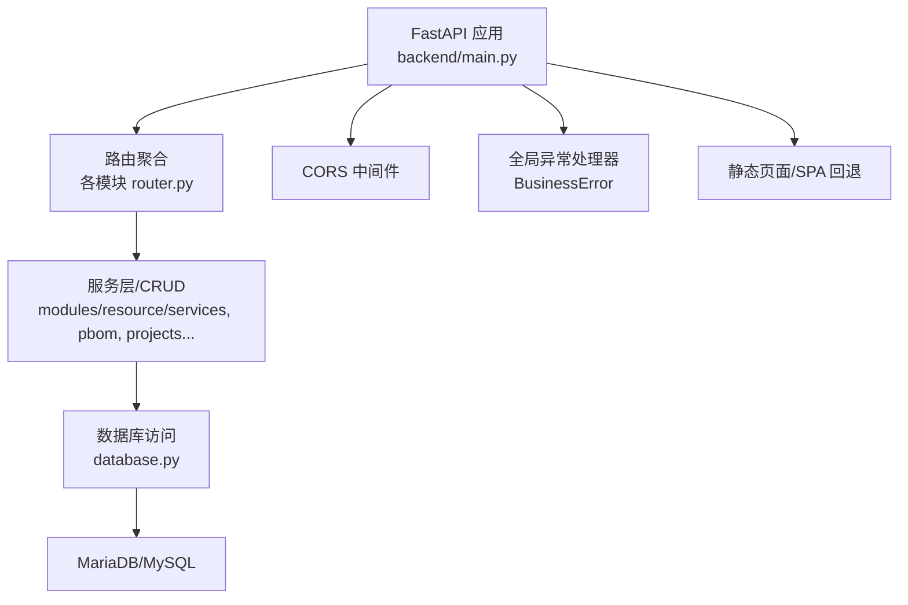
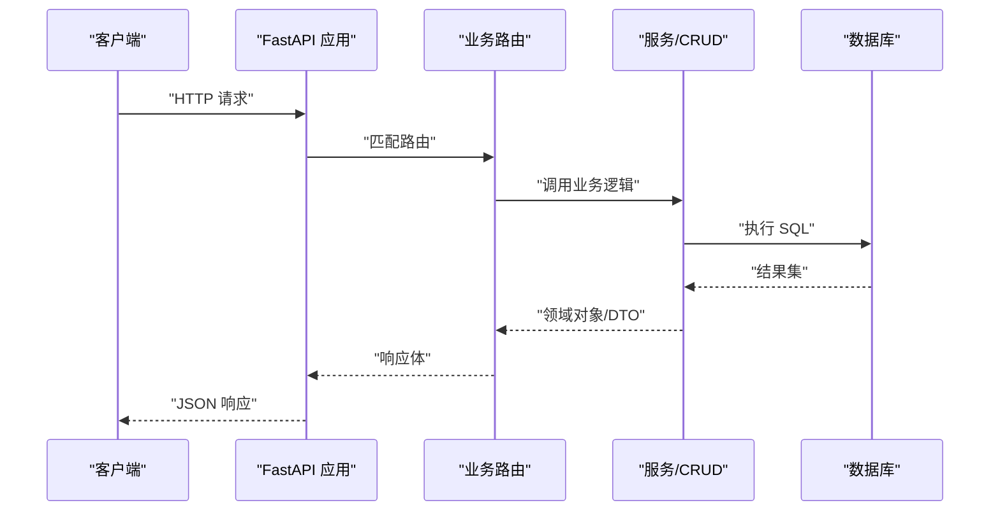
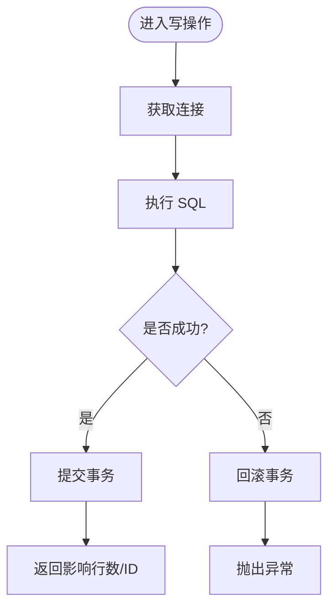
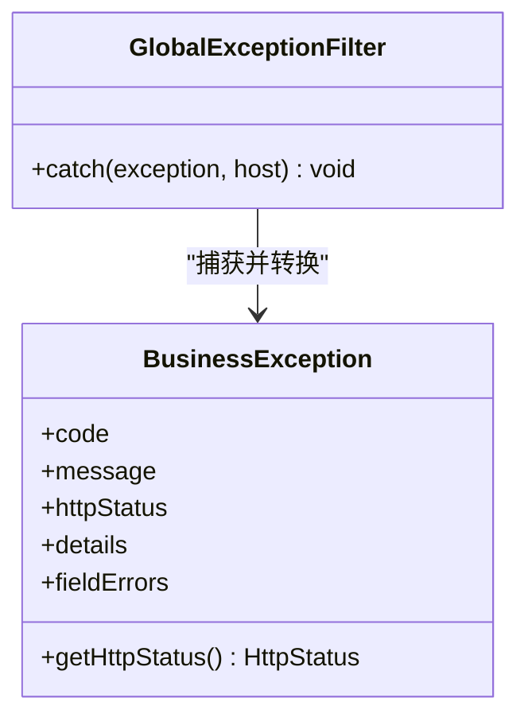
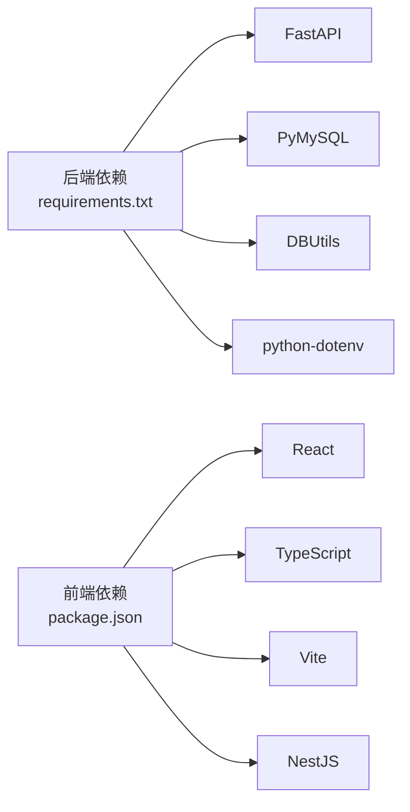

# 代码规范

<cite>
**本文引用的文件**
- [backend/main.py](file://backend/main.py)
- [backend/config.py](file://backend/config.py)
- [backend/logger.py](file://backend/logger.py)
- [backend/core/exceptions.py](file://backend/core/exceptions.py)
- [backend/database.py](file://backend/database.py)
- [backend/crawlers/base.py](file://backend/crawlers/base.py)
- [backend/requirements.txt](file://backend/requirements.txt)
- [webui_ref/eslint.config.js](file://webui_ref/eslint.config.js)
- [webui_ref/.prettierrc](file://webui_ref/.prettierrc)
- [webui_ref/package.json](file://webui_ref/package.json)
- [webui_ref/tsconfig.json](file://webui_ref/tsconfig.json)
- [webui_ref/server/common/filters/exception.filter.ts](file://webui_ref/server/common/filters/exception.filter.ts)
- [webui_ref/server/common/interfaces/exception.interface.ts](file://webui_ref/server/common/interfaces/exception.interface.ts)
- [webui_ref/.gitignore](file://webui_ref/.gitignore)
- [README.md](file://README.md)
</cite>

## 目录
1. [简介](#简介)
2. [项目结构](#项目结构)
3. [核心组件](#核心组件)
4. [架构总览](#架构总览)
5. [详细组件分析](#详细组件分析)
6. [依赖关系分析](#依赖关系分析)
7. [性能与可维护性建议](#性能与可维护性建议)
8. [故障排查指南](#故障排查指南)
9. [结论](#结论)
10. [附录](#附录)

## 简介
本规范面向 spiderV5_optimized 项目的后端（Python/FastAPI）与前端（TypeScript/React/NestJS 参考工程），统一模块组织、命名约定、异常处理、日志记录、配置管理、SQL 与数据库变更、Git 工作流、代码质量工具链以及重构与设计模式实践，确保团队协作一致性与长期可维护性。

## 项目结构
- 后端采用 FastAPI 模块化路由：每个业务域一个子包，包含 router、schemas、services/crud 等；入口 main.py 集中注册路由、CORS、全局异常处理与静态资源托管。
- 前端参考工程位于 webui_ref，使用 Vite + React + TypeScript，NestJS 作为服务端参考实现；ESLint/Prettier/Stylelint 等工具链已配置。
- 数据库为 MariaDB/MySQL，通过连接池访问；建表与初始化脚本集中在 backend/sql。

**图表来源**
- [backend/main.py:29-83](file://backend/main.py#L29-L83)
- [backend/database.py:12-43](file://backend/database.py#L12-L43)

**章节来源**
- [README.md:16-54](file://README.md#L16-L54)
- [backend/main.py:29-83](file://backend/main.py#L29-L83)

## 核心组件
- 应用启动与生命周期：main.py 中定义 FastAPI 实例、启动/关闭事件、CORS、路由注册、健康检查与 SPA 回退。
- 配置中心：config.py 提供 Settings 类，统一从 .env 读取并类型化；默认值与解析函数保证健壮性。
- 日志系统：logger.py 提供 RotatingFileHandler 与控制台输出，按 DEBUG/INFO 切换级别。
- 异常体系：core/exceptions.py 定义 BusinessError，main.py 中统一捕获并返回 JSON。
- 数据访问：database.py 封装连接池、查询与写操作，失败时回滚并抛出异常。
- 爬虫基类：crawlers/base.py 定义抽象接口与结果模型，便于新增数据源。

**章节来源**
- [backend/main.py:29-120](file://backend/main.py#L29-L120)
- [backend/config.py:48-98](file://backend/config.py#L48-L98)
- [backend/logger.py:14-42](file://backend/logger.py#L14-L42)
- [backend/core/exceptions.py:1-8](file://backend/core/exceptions.py#L1-L8)
- [backend/database.py:12-116](file://backend/database.py#L12-L116)
- [backend/crawlers/base.py:12-67](file://backend/crawlers/base.py#L12-L67)

## 架构总览
后端以 FastAPI 为中心，通过路由将请求分发到各业务模块；模块内部遵循“路由 -> 服务/CRUD -> 数据库”的分层。前端参考工程采用 React + TypeScript 页面与 NestJS 服务端，统一 ESLint/Prettier 风格，并通过 API 与后端交互。

**图表来源**
- [backend/main.py:74-83](file://backend/main.py#L74-L83)
- [backend/database.py:51-116](file://backend/database.py#L51-L116)

## 详细组件分析

### 后端 Python 代码规范
- 模块组织
  - 每个业务域独立子包，包含 router.py、schemas.py、services/ 或 crud.py；在 main.py 中集中 include_router。
  - 公共能力（配置、日志、异常、数据库）放在顶层或 core 目录，避免重复实现。
- 命名约定
  - 模块与包使用小写下划线；类名使用大驼峰；常量全大写；环境变量键名全大写。
  - 路由前缀统一 /api/<domain>，标签 tags 用于分组文档。
- 异常处理
  - 业务异常继承 BusinessError，携带 code 与 message；在 main.py 中统一处理为 JSON。
  - 数据库写操作失败时自动回滚，避免脏数据。
- 日志记录
  - 使用 logger.get_logger(name) 获取实例；DEBUG 模式下输出调试信息，生产模式输出 INFO。
  - 文件日志轮转：单文件最大 10MB，保留 7 个历史文件。
- 配置管理
  - 所有外部配置通过 .env 注入，Settings 类提供强类型访问；未找到 .env 时给出明确警告。
  - 敏感信息（数据库密码、第三方密钥）不得硬编码，必须通过环境变量管理。
- 数据库访问
  - 统一通过 database.py 的 query_all/query_one/execute/execute_last_id/execute_all 访问；禁止直接拼接 SQL。
  - 连接池延迟初始化，首次使用时创建；失败时记录错误并提示检查 .env。

**图表来源**
- [backend/database.py:73-116](file://backend/database.py#L73-L116)

**章节来源**
- [backend/main.py:85-92](file://backend/main.py#L85-L92)
- [backend/logger.py:20-36](file://backend/logger.py#L20-L36)
- [backend/config.py:15-22](file://backend/config.py#L15-L22)
- [backend/database.py:12-43](file://backend/database.py#L12-L43)

### 前端 TypeScript/React 代码规范
- 组件设计
  - 页面级组件位于 client/src/pages/*，通用 UI 组件位于 client/src/components/ui/*，业务组件位于 business-ui/*。
  - 组件职责单一，尽量使用组合而非继承；样式使用 Tailwind 与 CSS 变量，保持主题一致性。
- 状态管理
  - 页面状态优先使用 React 本地状态与表单库；跨页共享状态通过 URL 参数或轻量上下文；复杂全局状态可使用 Zustand/Redux Toolkit。
- API 调用
  - 统一通过 api/index.ts 或 domain-specific service 封装；错误由全局过滤器或拦截器统一处理。
  - 响应格式遵循 { code, message, data }，时间格式 ISO 8601。
- 代码质量
  - ESLint 基于 @lark-apaas/fullstack-presets，区分 client/server/shared 规则；Prettier 统一格式化。
  - 脚本命令：npm run lint、npm run format、npm run type:check。

**图表来源**
- [webui_ref/server/common/filters/exception.filter.ts:1-78](file://webui_ref/server/common/filters/exception.filter.ts#L1-L78)
- [webui_ref/server/common/interfaces/exception.interface.ts:1-19](file://webui_ref/server/common/interfaces/exception.interface.ts#L1-L19)

**章节来源**
- [webui_ref/eslint.config.js:1-46](file://webui_ref/eslint.config.js#L1-L46)
- [webui_ref/.prettierrc:1-8](file://webui_ref/.prettierrc#L1-L8)
- [webui_ref/package.json:11-34](file://webui_ref/package.json#L11-L34)
- [webui_ref/tsconfig.json:1-8](file://webui_ref/tsconfig.json#L1-L8)

### Git 工作流规范
- 分支策略
  - main：稳定发布分支；develop：集成开发分支；feature/*：功能分支；hotfix/*：紧急修复；release/*：预发布。
- 提交信息格式
  - 类型: 描述（feat|fix|docs|style|refactor|test|chore）
  - 示例：feat: 新增设备台账列表页
- 代码审查流程
  - 所有变更需通过 Pull Request，至少一名 reviewer 批准；CI 通过后方可合并。
  - 合并后自动触发构建与部署流水线。

[本节为通用流程说明，不直接分析具体文件]

### 代码质量工具配置
- ESLint
  - 使用 typescript-eslint 与 @lark-apaas/fullstack-presets，分别针对 client/server/shared 设置别名与规则。
- Prettier
  - 统一分号、尾逗号、单引号、行宽 80、缩进 2 空格。
- Stylelint
  - 对 CSS/SCSS 进行样式检查，配合 Tailwind 使用。
- 脚本命令
  - npm run lint、npm run stylelint、npm run format、npm run type:check。

**章节来源**
- [webui_ref/eslint.config.js:1-46](file://webui_ref/eslint.config.js#L1-L46)
- [webui_ref/.prettierrc:1-8](file://webui_ref/.prettierrc#L1-L8)
- [webui_ref/package.json:25-34](file://webui_ref/package.json#L25-L34)

### SQL 编写规范与数据库变更管理
- SQL 编写
  - 使用参数化查询，禁止字符串拼接；字段命名清晰，注释完整；索引设计考虑查询模式。
- 变更管理
  - 所有变更脚本置于 backend/sql，命名遵循语义化（如 resource_schema.sql、resource_init_data.sql）。
  - 变更需附带回滚脚本与验证步骤；上线前在测试环境验证。
- 初始化与迁移
  - 通过 init_resource_db.py 执行建表与初始化数据；生产环境谨慎执行，先备份再迁移。

**章节来源**
- [README.md:102-116](file://README.md#L102-L116)

### 配置文件管理与敏感信息保护
- 环境变量
  - 所有敏感信息（数据库密码、第三方密钥）通过 .env 管理；.env.example 提供模板。
  - config.py 加载 .env 并提供 Settings 类；未找到 .env 时输出警告。
- 忽略文件
  - .gitignore 排除 .env、node_modules、dist、logs 等；避免敏感信息泄露。
- 最佳实践
  - 不在代码中硬编码密钥；使用 CI/CD 注入环境变量；定期轮换密钥。

**章节来源**
- [backend/config.py:15-22](file://backend/config.py#L15-L22)
- [webui_ref/.gitignore:11-15](file://webui_ref/.gitignore#L11-L15)

### 代码重构与设计模式指导
- 分层与解耦
  - 路由仅负责参数校验与转发；业务逻辑下沉至 services/crud；数据访问统一封装。
- 设计模式
  - 工厂模式：用于创建不同爬虫实例；策略模式：根据配置选择不同同步策略；观察者模式：事件驱动的任务调度。
- 重构原则
  - 单一职责：每个模块只做一件事；开闭原则：对扩展开放，对修改封闭；依赖倒置：面向接口编程。

[本节为通用指导，不直接分析具体文件]

## 依赖关系分析
后端依赖 FastAPI、pymysql、DBUtils、python-dotenv 等；前端依赖 React、TypeScript、Vite、NestJS 等。依赖版本锁定于 requirements.txt 与 package.json。

**图表来源**
- [backend/requirements.txt:1-21](file://backend/requirements.txt#L1-L21)
- [webui_ref/package.json:36-189](file://webui_ref/package.json#L36-L189)

**章节来源**
- [backend/requirements.txt:1-21](file://backend/requirements.txt#L1-L21)
- [webui_ref/package.json:36-189](file://webui_ref/package.json#L36-L189)

## 性能与可维护性建议
- 后端
  - 使用连接池减少数据库连接开销；批量写入使用 executemany。
  - 日志轮转避免磁盘占满；关键路径添加性能监控。
- 前端
  - 组件懒加载与代码分割；避免不必要的重渲染。
  - 使用缓存策略减少重复请求；错误边界提升稳定性。
- 通用
  - 持续集成自动化测试与代码质量检查；定期依赖更新与安全扫描。

[本节为通用建议，不直接分析具体文件]

## 故障排查指南
- 后端
  - 数据库连接失败：检查 .env 中的 DB_HOST、DB_PORT、DB_USER、DB_PASSWORD、DB_DATABASE；查看 logs/*.log。
  - 业务异常：确认 BusinessError 的 code 与 message；检查路由与服务层逻辑。
- 前端
  - 全局异常过滤器：确认 HTTP 状态码与响应码映射；检查 API 响应格式。
  - 构建与类型检查：运行 npm run build 与 npm run type:check 定位问题。

**章节来源**
- [backend/database.py:34-42](file://backend/database.py#L34-L42)
- [backend/logger.py:20-36](file://backend/logger.py#L20-L36)
- [webui_ref/server/common/filters/exception.filter.ts:1-78](file://webui_ref/server/common/filters/exception.filter.ts#L1-L78)

## 结论
本规范统一了后端与前端的技术栈实践，明确了模块组织、命名、异常、日志、配置、SQL、Git 与工具链标准。遵循这些规范可显著提升代码质量、协作效率与系统可维护性。建议在团队内推广并纳入代码审查清单。

## 附录
- 快速开始
  - 后端：安装依赖、配置 .env、初始化数据库、启动服务。
  - 前端：安装依赖、启动开发服务器、构建生产包。
- 参考文档
  - README.md 提供整体架构与运行指南；webui_ref 提供前端参考实现与工具链配置。

**章节来源**
- [README.md:72-126](file://README.md#L72-L126)