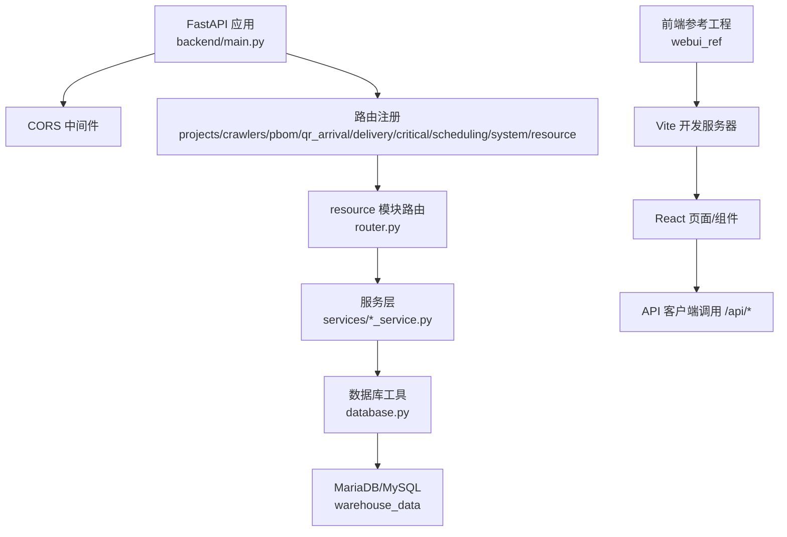
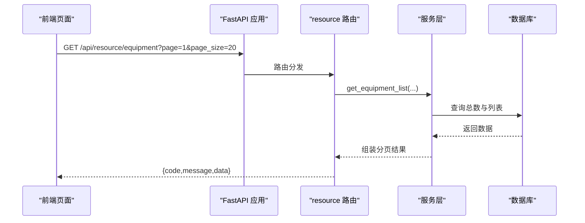
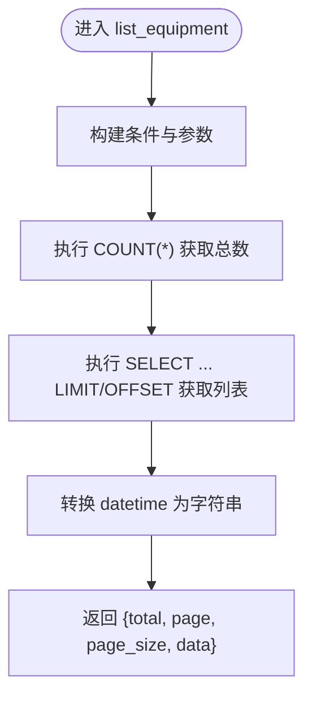
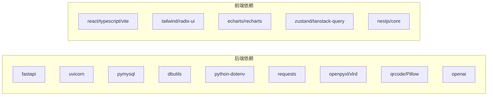

# 开发指南

<cite>
**本文引用的文件**
- [backend/main.py](file://backend/main.py)
- [backend/config.py](file://backend/config.py)
- [backend/database.py](file://backend/database.py)
- [backend/requirements.txt](file://backend/requirements.txt)
- [backend/env.example](file://backend/env.example)
- [backend/modules/resource/router.py](file://backend/modules/resource/router.py)
- [backend/modules/resource/schemas.py](file://backend/modules/resource/schemas.py)
- [backend/modules/resource/services/equipment_service.py](file://backend/modules/resource/services/equipment_service.py)
- [backend/sql/resource_schema.sql](file://backend/sql/resource_schema.sql)
- [README.md](file://README.md)
- [webui_ref/package.json](file://webui_ref/package.json)
</cite>

## 目录
1. [简介](#简介)
2. [项目结构](#项目结构)
3. [核心组件](#核心组件)
4. [架构总览](#架构总览)
5. [详细组件分析](#详细组件分析)
6. [依赖关系分析](#依赖关系分析)
7. [性能与可扩展性](#性能与可扩展性)
8. [测试策略与单元测试](#测试策略与单元测试)
9. [调试与常见问题排查](#调试与常见问题排查)
10. [代码审查标准与质量保证](#代码审查标准与质量保证)
11. [新功能开发与模块扩展流程](#新功能开发与模块扩展流程)
12. [结论](#结论)

## 简介
本指南面向“试制资源数智化管理系统”的后端与前端参考工程，覆盖开发环境搭建、IDE 配置、代码规范、Git 工作流、代码结构与命名约定、数据库设计规范、新功能开发全流程、测试策略、调试技巧、问题排查、代码审查标准以及扩展现有功能与新增业务模块的方法。目标是帮助开发者快速上手并高质量地迭代系统。

## 项目结构
- 后端采用 FastAPI 模块化路由组织，按业务域划分 modules（如 resource），并通过 main.py 统一注册路由、中间件、异常处理与生命周期事件。
- 数据库使用 MariaDB/MySQL，通过连接池访问；资源模块的建表脚本集中在 backend/sql。
- 前端参考工程位于 webui_ref，基于 React + TypeScript + Vite，提供页面、组件、API 调用与样式体系。
- 静态演示页位于 demo，可直接浏览器打开预览原型。

图表来源
- [backend/main.py:29-83](file://backend/main.py#L29-L83)
- [backend/modules/resource/router.py:1-14](file://backend/modules/resource/router.py#L1-L14)
- [backend/database.py:12-43](file://backend/database.py#L12-L43)
- [webui_ref/package.json:11-21](file://webui_ref/package.json#L11-L21)

章节来源
- [README.md:16-54](file://README.md#L16-L54)
- [backend/main.py:29-83](file://backend/main.py#L29-L83)

## 核心组件
- 应用入口与生命周期：main.py 负责创建 FastAPI 实例、注册路由、添加 CORS、全局异常处理、健康检查、SPA 回退、启动/关闭时调度器启停。
- 配置管理：config.py 从 .env 加载配置，提供 Settings 类集中管理数据库、爬虫、WMS、飞书、LLM、服务端口等参数。
- 数据库访问：database.py 封装连接池、查询与执行方法，统一事务提交/回滚与错误日志。
- 资源模块：modules/resource 包含设备、人员、任务、预警、排程等 API，路由在 router.py，数据模型在 schemas.py，业务逻辑在服务层 *_service.py。
- 数据库设计：sql/resource_schema.sql 定义设备、区域、人员、任务、预警、效率统计、维护记录、甘特计划、资源分配、冲突检测等表结构。

章节来源
- [backend/main.py:29-120](file://backend/main.py#L29-L120)
- [backend/config.py:48-98](file://backend/config.py#L48-L98)
- [backend/database.py:12-116](file://backend/database.py#L12-L116)
- [backend/modules/resource/router.py:1-800](file://backend/modules/resource/router.py#L1-L800)
- [backend/modules/resource/schemas.py:1-224](file://backend/modules/resource/schemas.py#L1-L224)
- [backend/sql/resource_schema.sql:1-326](file://backend/sql/resource_schema.sql#L1-L326)

## 架构总览
系统采用前后端分离架构：
- 后端：FastAPI 提供 RESTful API，模块按业务域拆分，服务层封装业务规则，数据库层通过连接池访问 MySQL/MariaDB。
- 前端：React + TypeScript + Vite，页面与组件化开发，通过 API 客户端调用后端接口。
- 部署：生产模式由 FastAPI 托管静态首页，支持 SPA 路由回退；开发模式通过 Vite 代理转发 /api 到后端。

图表来源
- [backend/main.py:74-83](file://backend/main.py#L74-L83)
- [backend/modules/resource/router.py:58-86](file://backend/modules/resource/router.py#L58-L86)
- [backend/modules/resource/services/equipment_service.py:11-103](file://backend/modules/resource/services/equipment_service.py#L11-L103)
- [backend/database.py:51-85](file://backend/database.py#L51-L85)

## 详细组件分析

### 后端应用与路由
- 应用初始化：设置标题、描述、版本，注册各模块路由，启用 CORS，定义全局 BusinessError 处理器，提供健康检查与健康探针。
- SPA 支持：当存在 static/index.html 时，根路径与任意路径回退到 index.html，便于前端路由。
- 生命周期：启动时开启调度器，关闭时停止调度器；进程退出信号处理确保后台线程安全停止。

章节来源
- [backend/main.py:29-120](file://backend/main.py#L29-L120)

### 配置与环境变量
- 环境变量加载：优先读取 backend/.env，若不存在则输出警告并使用默认值。
- 配置项分类：数据库、爬虫、WMS、飞书、采购、DeepSeek LLM、服务端口、跨域、QR 码地址、上传目录。
- 类型安全：提供 _get_int/_get_bool/_get_list 辅助函数解析配置，避免非法值导致崩溃。

章节来源
- [backend/config.py:1-102](file://backend/config.py#L1-L102)
- [backend/env.example:1-49](file://backend/env.example#L1-L49)

### 数据库访问层
- 连接池：延迟初始化 PooledDB，最大连接数与缓存可控，失败时记录明确错误信息并提示检查 .env。
- 查询封装：query_all/query_one 返回字典游标结果；execute/execute_last_id/execute_all 封装写操作与事务提交/回滚。
- 最佳实践：所有写操作均 commit，异常时 rollback，避免脏数据。

章节来源
- [backend/database.py:12-116](file://backend/database.py#L12-L116)

### 资源模块路由与服务
- 路由职责：接收请求参数，校验输入，调用对应服务方法，统一返回 {code,message,data} 格式。
- 服务层职责：实现具体业务逻辑（筛选、分页、搜索、状态流转、关联查询），构造 SQL 并调用 database 层。
- 示例：设备列表接口支持分页、状态/区域/类型筛选与关键词搜索，返回 total/page/page_size/data。

图表来源
- [backend/modules/resource/router.py:58-86](file://backend/modules/resource/router.py#L58-L86)
- [backend/modules/resource/services/equipment_service.py:11-103](file://backend/modules/resource/services/equipment_service.py#L11-L103)

章节来源
- [backend/modules/resource/router.py:1-800](file://backend/modules/resource/router.py#L1-L800)
- [backend/modules/resource/services/equipment_service.py:11-200](file://backend/modules/resource/services/equipment_service.py#L11-L200)

### 数据模型与响应规范
- Pydantic 模型：schemas.py 定义了设备、区域、人员、任务、预警、驾驶舱等基础模型与列表响应模型，保证请求/响应结构一致。
- 时间字段：datetime/date 类型用于计划时间、统计日期等；响应中通常转换为字符串以便前端展示。
- 枚举约束：任务类型、优先级、状态等使用枚举限制，增强数据一致性。

章节来源
- [backend/modules/resource/schemas.py:1-224](file://backend/modules/resource/schemas.py#L1-L224)

### 数据库设计与规范
- 表结构：equipment/zones/personnel/tasks/alerts/personnel_efficiency/equipment_maintenance/gantt_schedules/gantt_resource_allocations/gantt_conflicts。
- 索引策略：对常用筛选字段建立索引（status、zone_code、task_type、priority、raised_at、handler 等）。
- 字符集：utf8mb4，兼容多语言与表情符号。
- 外键与冗余：部分字段冗余（如 task_code、schedule_code）以提升查询性能与展示便利性。

章节来源
- [backend/sql/resource_schema.sql:1-326](file://backend/sql/resource_schema.sql#L1-L326)

### 前端参考工程
- 技术栈：React + TypeScript + Vite + Tailwind + Radix UI + ECharts，提供丰富的业务组件与表单控件。
- 开发命令：dev/dev:client/dev:server/build/build:prod/test/lint/format/type:check 等。
- 代理与集成：默认将 /api 转发至后端服务，便于本地联调。

章节来源
- [webui_ref/package.json:11-34](file://webui_ref/package.json#L11-L34)
- [webui_ref/package.json:36-205](file://webui_ref/package.json#L36-L205)

## 依赖关系分析
- 后端依赖：FastAPI、Uvicorn、PyMySQL、DBUtils、python-dotenv、requests、openpyxl、xlrd、qrcode、Pillow、openai（可选）。
- 前端依赖：NestJS 模板库、Radix UI、Tailwind、ECharts、Zustand、TanStack Query、Formik/HookForm 等。
- 运行时：Python 3.9+、Node.js 22+、MariaDB/MySQL。

图表来源
- [backend/requirements.txt:1-21](file://backend/requirements.txt#L1-L21)
- [webui_ref/package.json:36-205](file://webui_ref/package.json#L36-L205)

章节来源
- [backend/requirements.txt:1-21](file://backend/requirements.txt#L1-L21)
- [webui_ref/package.json:36-205](file://webui_ref/package.json#L36-L205)

## 性能与可扩展性
- 连接池优化：合理设置 maxconnections/mincached/maxcached，避免连接泄漏与过多预创建导致的启动失败。
- 查询优化：为高频筛选字段建立索引；分页查询使用 LIMIT/OFFSET；复杂查询考虑物化视图或汇总表。
- 异步与并发：FastAPI 天然支持异步，I/O 密集场景可使用 async/await；CPU 密集计算可考虑任务队列。
- 扩展性：新增模块遵循 modules/<domain>/router.py + services/*.py + schemas.py 的结构，并在 main.py 注册路由。

[本节为通用指导，不直接分析具体文件]

## 测试策略与单元测试
- 后端测试建议：
  - 使用 pytest 对服务层进行单元测试，模拟数据库查询与外部依赖。
  - 对路由层进行集成测试，验证请求/响应结构与状态码。
  - 对数据库操作使用内存数据库或测试库隔离数据。
- 前端测试建议：
  - 使用 Jest + ts-jest 对服务与工具函数进行测试。
  - 对组件使用 React Testing Library 进行交互测试。
  - 对 API 调用进行 Mock，确保页面逻辑稳定。
- 质量门禁：
  - 在 pre-commit 钩子中运行 lint、format、type:check。
  - CI 流水线执行 test、build，阻断不合格提交。

[本节为通用指导，不直接分析具体文件]

## 调试与常见问题排查
- 数据库连接失败：
  - 检查 backend/.env 中的 DB_HOST/DB_PORT/DB_USER/DB_PASSWORD/DB_DATABASE。
  - 确认数据库服务已启动且权限正确。
  - 查看 database.py 的错误日志，定位连接池初始化失败原因。
- 路由未生效：
  - 确认 main.py 中已 include_router 并设置正确的 prefix/tags。
  - 检查路由文件中是否存在重复或冲突的路径。
- 前端无法调用后端：
  - 确认 Vite 代理配置将 /api 转发到 http://localhost:8000。
  - 检查 CORS_ORIGINS 是否包含前端域名。
- 调度器/爬虫异常：
  - 查看 main.py 的启动/关闭事件日志。
  - 检查 scheduler_service 与 crawler_manager 的异常捕获与清理逻辑。

章节来源
- [backend/database.py:12-43](file://backend/database.py#L12-L43)
- [backend/main.py:36-55](file://backend/main.py#L36-L55)
- [backend/config.py:48-98](file://backend/config.py#L48-L98)

## 代码审查标准与质量保证
- 代码风格：
  - Python：遵循 PEP8，使用 black/isort 格式化。
  - TypeScript/React：使用 ESLint + Prettier + Stylelint，保持统一风格。
- 命名约定：
  - 模块名小写下划线，路由前缀清晰，服务层以领域命名。
  - 数据库表名复数形式，字段名下划线，枚举值小写。
- 文档与注释：
  - 关键函数与类提供 docstring，说明参数、返回值与异常。
  - API 路由使用 OpenAPI 注解，自动生成文档。
- 安全与健壮性：
  - 输入校验使用 Pydantic，防止非法数据入库。
  - 敏感配置通过环境变量注入，禁止硬编码。
  - 对外部依赖调用增加超时与重试机制。

[本节为通用指导，不直接分析具体文件]

## 新功能开发与模块扩展流程
- 需求分析与设计：
  - 明确业务目标、用户故事、数据模型与接口契约。
  - 评估是否需要新增数据库表或扩展现有表。
- 后端实现：
  - 在 backend/modules/ 下新建模块目录，创建 router.py、schemas.py、services/*.py。
  - 在 main.py 中注册路由，设置 prefix 与 tags。
  - 编写服务层逻辑，复用 database.py 的查询与执行方法。
- 数据库变更：
  - 在 backend/sql/ 下编写建表/迁移脚本，保持与现有风格一致。
  - 提供初始化数据脚本，便于本地与测试环境快速搭建。
- 前端实现：
  - 在 webui_ref/client/src/pages/ 下新建页面目录，实现页面与组件。
  - 在 api/ 目录下新增接口调用封装，统一错误处理与数据转换。
- 测试与验收：
  - 编写单元测试与集成测试，覆盖核心逻辑与边界条件。
  - 进行端到端测试，验证页面与后端接口的联动。
- 发布与回滚：
  - 更新 README 与 API 文档，标注版本变更。
  - 准备回滚脚本与数据备份方案。

章节来源
- [backend/main.py:74-83](file://backend/main.py#L74-L83)
- [backend/modules/resource/router.py:1-800](file://backend/modules/resource/router.py#L1-L800)
- [backend/sql/resource_schema.sql:1-326](file://backend/sql/resource_schema.sql#L1-L326)
- [webui_ref/package.json:11-34](file://webui_ref/package.json#L11-L34)

## 结论
本指南系统化梳理了试制资源数智化管理系统的开发环境与架构，明确了后端模块组织、前端组件设计、数据库设计规范与开发流程。通过遵循统一的代码规范、测试策略与代码审查标准，可有效提升交付质量与团队协作效率。建议在后续迭代中持续完善自动化测试、监控告警与性能优化，确保系统稳定可靠地支撑试制车间的资源管理与智能调度。