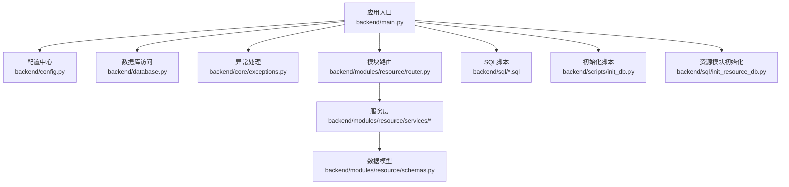
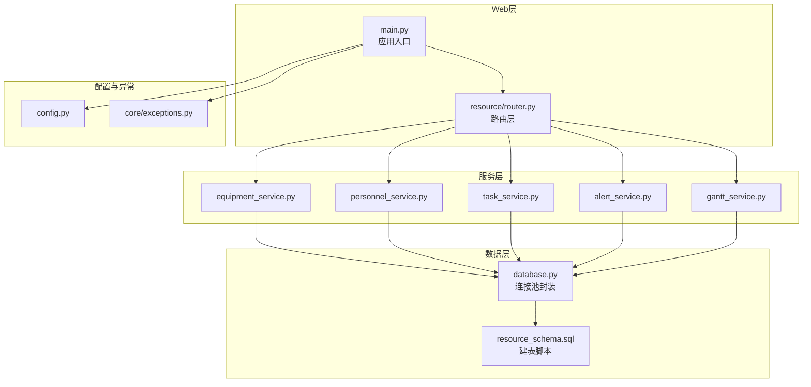
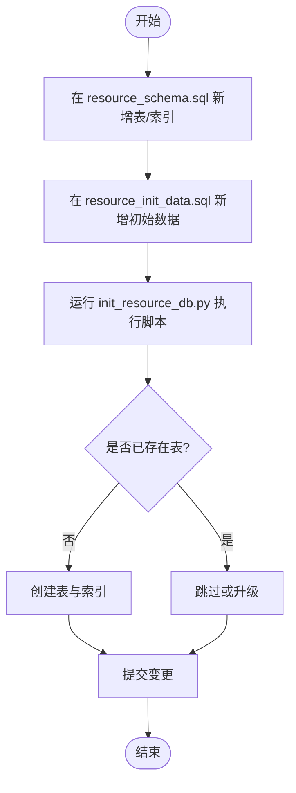
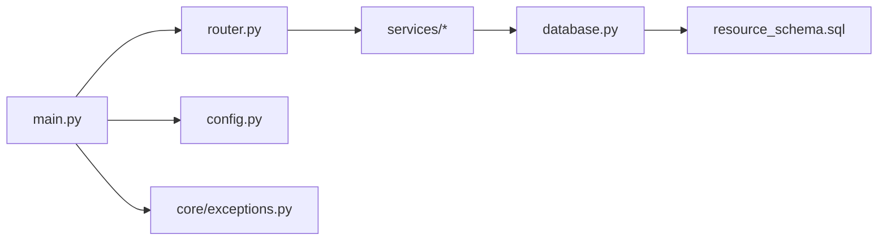

# 开发流程

<cite>
**本文引用的文件**
- [backend/main.py](file://backend/main.py)
- [backend/config.py](file://backend/config.py)
- [backend/database.py](file://backend/database.py)
- [backend/core/exceptions.py](file://backend/core/exceptions.py)
- [backend/modules/resource/router.py](file://backend/modules/resource/router.py)
- [backend/modules/resource/schemas.py](file://backend/modules/resource/schemas.py)
- [backend/sql/resource_schema.sql](file://backend/sql/resource_schema.sql)
- [backend/sql/init_resource_db.py](file://backend/sql/init_resource_db.py)
- [backend/scripts/init_db.py](file://backend/scripts/init_db.py)
- [README.md](file://README.md)
- [需求文档_V6_试制资源数智化管理系统.md](file://需求文档_V6_试制资源数智化管理系统.md)
</cite>

## 目录
1. [引言](#引言)
2. [项目结构](#项目结构)
3. [核心组件](#核心组件)
4. [架构总览](#架构总览)
5. [详细组件分析](#详细组件分析)
6. [依赖关系分析](#依赖关系分析)
7. [性能考量](#性能考量)
8. [故障排查指南](#故障排查指南)
9. [结论](#结论)
10. [附录](#附录)

## 引言
本指南面向新功能开发，覆盖从需求评审到上线的完整生命周期：需求评审、技术方案设计、编码实现、测试验证、部署上线与回滚策略。结合仓库现有工程实践，重点说明模块化开发方法（路由设计、服务层实现、数据模型定义）、API接口规范（RESTful原则、请求响应格式、错误处理）、数据库变更管理（表结构修改、迁移脚本）、前后端联调与接口文档维护、版本发布流程与协作机制。

## 项目结构
后端采用 FastAPI 模块化组织：应用入口统一注册各业务模块路由；配置集中管理；数据库通过连接池封装；SQL脚本集中存放并支持一键初始化。前端参考工程位于 webui_ref，静态演示页位于 demo。

图表来源
- [backend/main.py:29-83](file://backend/main.py#L29-L83)
- [backend/config.py:48-98](file://backend/config.py#L48-L98)
- [backend/database.py:12-43](file://backend/database.py#L12-L43)
- [backend/modules/resource/router.py:1-14](file://backend/modules/resource/router.py#L1-L14)
- [backend/sql/init_resource_db.py:47-68](file://backend/sql/init_resource_db.py#L47-L68)
- [backend/scripts/init_db.py:17-33](file://backend/scripts/init_db.py#L17-L33)

章节来源
- [backend/main.py:29-83](file://backend/main.py#L29-L83)
- [backend/config.py:48-98](file://backend/config.py#L48-L98)
- [backend/database.py:12-43](file://backend/database.py#L12-L43)
- [README.md:16-54](file://README.md#L16-L54)

## 核心组件
- 应用入口与生命周期：启动时加载调度器，关闭时停止调度器；提供健康检查与SPA回退；统一注册各模块路由。
- 配置管理：集中读取环境变量，提供类型安全的配置项（数据库、爬虫、服务端口、CORS等）。
- 数据库访问：基于连接池的查询与写操作封装，包含事务回滚与批量执行能力。
- 异常处理：业务异常基类，全局处理器统一返回错误码与消息。
- 模块路由与服务层：以“路由+服务+模型”分层组织，便于扩展与维护。
- SQL与初始化：建表脚本与初始化数据脚本分离，提供独立初始化入口。

章节来源
- [backend/main.py:36-55](file://backend/main.py#L36-L55)
- [backend/main.py:85-97](file://backend/main.py#L85-L97)
- [backend/config.py:48-98](file://backend/config.py#L48-L98)
- [backend/database.py:51-116](file://backend/database.py#L51-L116)
- [backend/core/exceptions.py:1-8](file://backend/core/exceptions.py#L1-L8)
- [backend/modules/resource/router.py:58-86](file://backend/modules/resource/router.py#L58-L86)
- [backend/sql/init_resource_db.py:47-68](file://backend/sql/init_resource_db.py#L47-L68)

## 架构总览
系统采用分层架构：FastAPI 作为Web框架，按模块划分路由；服务层承载业务逻辑；数据模型使用 Pydantic 进行校验；数据库通过连接池访问；SQL脚本集中管理。

图表来源
- [backend/main.py:74-83](file://backend/main.py#L74-L83)
- [backend/modules/resource/router.py:1-14](file://backend/modules/resource/router.py#L1-L14)
- [backend/database.py:12-43](file://backend/database.py#L12-L43)
- [backend/sql/resource_schema.sql:13-28](file://backend/sql/resource_schema.sql#L13-L28)
- [backend/config.py:48-98](file://backend/config.py#L48-L98)
- [backend/core/exceptions.py:1-8](file://backend/core/exceptions.py#L1-L8)

## 详细组件分析

### 路由设计与API规范
- 路由前缀：所有资源模块接口统一以 /api/resource 为前缀，便于分组与权限控制。
- RESTful风格：遵循资源命名与HTTP动词语义（GET/POST/PUT/DELETE），对状态更新提供专用路径（如设备状态、任务进度）。
- 请求参数：分页、筛选、关键词搜索通过 Query 参数传递；路径参数用于标识具体资源。
- 响应格式：统一返回 { code, message, data }，成功与失败均遵循该结构。
- 时间格式：ISO 8601（YYYY-MM-DDTHH:mm:ss）。
- 认证方式：复用现有 API Key 机制（在后续鉴权中间件中集成）。

示例接口（节选）
- 设备：列表、详情、新增、更新、删除、状态更新、维护记录、统计
- 人员：列表、详情、新增、更新、删除、状态更新、来源分布、地图数据、效率
- 任务：列表、详情、新增、更新、删除、状态更新、进度更新、统计、甘特数据、冲突检测、同步
- 预警：列表、详情、创建、处理、解决、统计、触发检测
- 驾驶舱：KPI、设备状态分布、人员状态分布、利用率、最近预警

章节来源
- [backend/modules/resource/router.py:58-86](file://backend/modules/resource/router.py#L58-L86)
- [backend/modules/resource/router.py:356-578](file://backend/modules/resource/router.py#L356-L578)
- [backend/modules/resource/router.py:646-800](file://backend/modules/resource/router.py#L646-L800)
- [需求文档_V6_试制资源数智化管理系统.md:644-732](file://需求文档_V6_试制资源数智化管理系统.md#L644-L732)
- [README.md:132-144](file://README.md#L132-L144)

### 服务层实现模式
- 职责单一：每个服务负责一个领域（设备、人员、任务、预警、排程），对外暴露清晰的方法。
- 参数校验：入参由路由层的 Pydantic 模型或 Query/Path 参数完成基础校验，服务层进行业务校验。
- 数据访问：通过 database.py 提供的查询与写操作方法，保证连接复用与事务一致性。
- 错误处理：业务异常通过 BusinessError 抛出，由全局异常处理器统一转换为标准响应。

章节来源
- [backend/database.py:51-116](file://backend/database.py#L51-L116)
- [backend/core/exceptions.py:1-8](file://backend/core/exceptions.py#L1-L8)
- [backend/modules/resource/router.py:112-154](file://backend/modules/resource/router.py#L112-L154)

### 数据模型定义
- 使用 Pydantic 定义请求与响应模型，确保字段类型与必填约束。
- 模型分层：Base/Create/Update/Response/ListResponse，便于复用与扩展。
- 枚举值：状态、类型等使用字符串枚举，配合路由参数校验。

章节来源
- [backend/modules/resource/schemas.py:14-47](file://backend/modules/resource/schemas.py#L14-L47)
- [backend/modules/resource/schemas.py:78-118](file://backend/modules/resource/schemas.py#L78-L118)
- [backend/modules/resource/schemas.py:123-178](file://backend/modules/resource/schemas.py#L123-L178)
- [backend/modules/resource/schemas.py:182-224](file://backend/modules/resource/schemas.py#L182-L224)

### 数据库变更管理流程
- 新建表：在 backend/sql/resource_schema.sql 中新增表结构与索引。
- 初始化数据：在 backend/sql/resource_init_data.sql 中准备初始数据。
- 执行脚本：运行 backend/sql/init_resource_db.py 自动执行建表与初始化数据。
- 兼容旧库：对于已有库，可在 backend/scripts/init_db.py 中添加增量 ALTER 语句，确保幂等执行。
- 版本化建议：为每次变更添加注释与版本号，便于追踪与回滚。

图表来源
- [backend/sql/resource_schema.sql:13-28](file://backend/sql/resource_schema.sql#L13-L28)
- [backend/sql/init_resource_db.py:47-68](file://backend/sql/init_resource_db.py#L47-L68)
- [backend/scripts/init_db.py:234-262](file://backend/scripts/init_db.py#L234-L262)

章节来源
- [backend/sql/resource_schema.sql:13-28](file://backend/sql/resource_schema.sql#L13-L28)
- [backend/sql/init_resource_db.py:47-68](file://backend/sql/init_resource_db.py#L47-L68)
- [backend/scripts/init_db.py:234-262](file://backend/scripts/init_db.py#L234-L262)

### 前后端联调流程
- 后端启动：运行 backend/main.py，默认监听 http://localhost:8000，Swagger 文档地址 /docs。
- 前端代理：webui_ref 默认将 /api 转发至后端，便于本地联调。
- 接口契约：双方依据 schemas.py 与 router.py 定义的请求/响应结构进行对接。
- 联调步骤：
  - 先跑通健康检查与模块 ping 接口。
  - 逐项验证CRUD与统计接口，关注分页、筛选与错误码。
  - 使用 Swagger UI 快速构造请求与查看响应。
  - 前端页面调用接口后，核对数据展示与交互行为。

章节来源
- [backend/main.py:94-97](file://backend/main.py#L94-L97)
- [backend/modules/resource/router.py:47-55](file://backend/modules/resource/router.py#L47-L55)
- [README.md:118-134](file://README.md#L118-L134)

### 版本发布流程与回滚策略
- 发布前检查：
  - 确认 .env 配置正确（数据库、端口、CORS、第三方密钥）。
  - 执行数据库初始化/升级脚本，确保表结构一致。
  - 运行接口冒烟测试（健康检查、关键CRUD）。
- 发布步骤：
  - 构建前端（如需），部署静态资源到 static 目录。
  - 启动后端服务，观察日志与调度器状态。
  - 开放外部访问，监控错误率与性能指标。
- 回滚策略：
  - 代码回滚：回退到上一个稳定版本分支。
  - 数据回滚：若涉及DDL/DML变更，需准备反向脚本并在维护窗口执行。
  - 配置回滚：恢复 .env 与系统参数至上一版本。

章节来源
- [backend/config.py:48-98](file://backend/config.py#L48-L98)
- [backend/sql/init_resource_db.py:47-68](file://backend/sql/init_resource_db.py#L47-L68)
- [backend/scripts/init_db.py:271-291](file://backend/scripts/init_db.py#L271-L291)
- [README.md:79-100](file://README.md#L79-L100)

### 协作工具与沟通机制
- 代码协作：Git 分支策略（功能分支->主分支合并），Pull Request 评审。
- 接口文档：使用 Swagger /docs 自动生成与维护，随代码变更同步更新。
- 问题跟踪：缺陷与需求在项目管理平台登记，关联相关分支与提交。
- 发布沟通：发布前通知相关方，发布后反馈结果与风险点。

章节来源
- [README.md:132-134](file://README.md#L132-L134)

## 依赖关系分析
- 模块耦合：路由层依赖服务层，服务层依赖数据库访问；配置与异常贯穿全链路。
- 外部依赖：MariaDB/MySQL、Uvicorn、PyMySQL、DBUtils。
- 潜在循环：避免服务层直接导入路由；保持单向依赖。

图表来源
- [backend/main.py:74-83](file://backend/main.py#L74-L83)
- [backend/modules/resource/router.py:1-14](file://backend/modules/resource/router.py#L1-L14)
- [backend/database.py:12-43](file://backend/database.py#L12-L43)
- [backend/sql/resource_schema.sql:13-28](file://backend/sql/resource_schema.sql#L13-L28)
- [backend/config.py:48-98](file://backend/config.py#L48-L98)
- [backend/core/exceptions.py:1-8](file://backend/core/exceptions.py#L1-L8)

章节来源
- [backend/main.py:74-83](file://backend/main.py#L74-L83)
- [backend/modules/resource/router.py:1-14](file://backend/modules/resource/router.py#L1-L14)
- [backend/database.py:12-43](file://backend/database.py#L12-L43)
- [backend/sql/resource_schema.sql:13-28](file://backend/sql/resource_schema.sql#L13-L28)
- [backend/config.py:48-98](file://backend/config.py#L48-L98)
- [backend/core/exceptions.py:1-8](file://backend/core/exceptions.py#L1-L8)

## 性能考量
- 数据库连接池：使用 PooledDB 减少连接开销，合理设置最大连接数。
- 查询优化：为常用字段建立索引（状态、区域、类型等），避免全表扫描。
- 分页与筛选：路由层提供分页与筛选参数，降低单次数据量。
- 缓存策略：对高频只读数据（如区域、设备状态分布）可引入缓存层（后续扩展）。
- 异步任务：调度器与爬虫任务应异步执行，避免阻塞请求线程。

章节来源
- [backend/database.py:12-43](file://backend/database.py#L12-L43)
- [backend/sql/resource_schema.sql:25-27](file://backend/sql/resource_schema.sql#L25-L27)
- [backend/modules/resource/router.py:58-86](file://backend/modules/resource/router.py#L58-L86)

## 故障排查指南
- 数据库连接失败：检查 .env 中的 DB_HOST、DB_PORT、DB_USER、DB_PASSWORD、DB_DATABASE；查看连接池初始化日志。
- 路由未生效：确认 main.py 中是否正确 include_router，且 prefix/tags 配置无误。
- 接口报错：查看 HTTPException 与 BusinessError 的处理逻辑，定位错误码与消息。
- 调度器异常：启动/关闭事件捕获异常，检查 scheduler_service 的 start/stop 方法。

章节来源
- [backend/database.py:12-43](file://backend/database.py#L12-L43)
- [backend/main.py:36-55](file://backend/main.py#L36-L55)
- [backend/main.py:85-92](file://backend/main.py#L85-L92)
- [backend/core/exceptions.py:1-8](file://backend/core/exceptions.py#L1-L8)

## 结论
本指南基于仓库现有工程实践，提供了新功能开发的标准化流程与方法论。通过模块化路由、服务层实现、数据模型定义与SQL脚本管理，确保代码可维护性与可扩展性。统一的API规范与错误处理提升了前后端协作效率。完善的数据库变更管理与发布回滚策略保障了系统稳定性。建议在团队内推广此流程，并结合实际项目持续优化。

## 附录
- 环境要求与运行步骤参见 README。
- 接口文档通过 Swagger /docs 获取。
- 前端参考工程与静态演示页便于快速原型验证。

章节来源
- [README.md:72-100](file://README.md#L72-L100)
- [README.md:118-134](file://README.md#L118-L134)