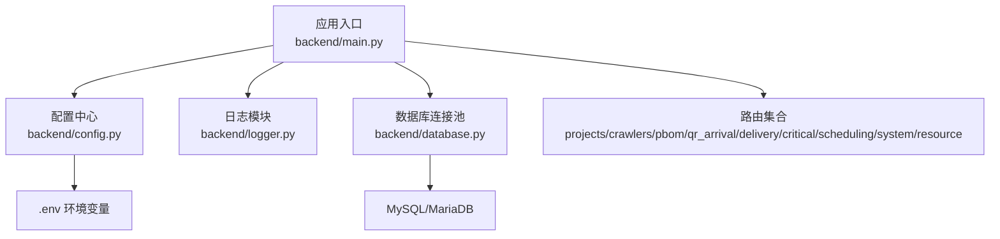
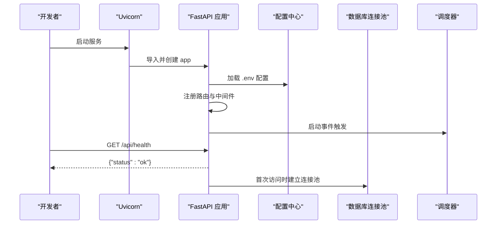
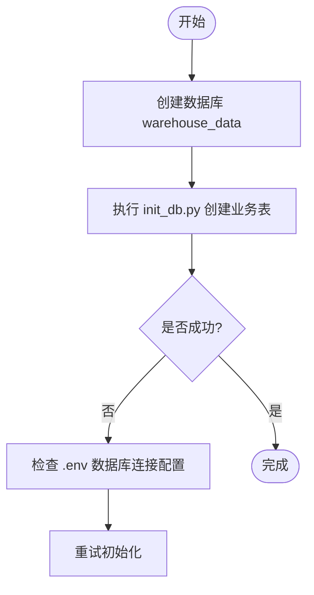
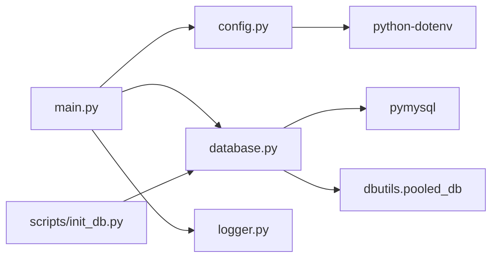

# 开发环境搭建

<cite>
**本文引用的文件**
- [backend/requirements.txt](file://backend/requirements.txt)
- [backend/env.example](file://backend/env.example)
- [backend/config.py](file://backend/config.py)
- [backend/database.py](file://backend/database.py)
- [backend/main.py](file://backend/main.py)
- [backend/logger.py](file://backend/logger.py)
- [backend/scripts/init_db.py](file://backend/scripts/init_db.py)
- [windows_setup/README_WINDOWS.txt](file://windows_setup/README_WINDOWS.txt)
- [windows_setup/sql/create_database.sql](file://windows_setup/sql/create_database.sql)
- [windows_setup/0_一键部署.bat](file://windows_setup/0_一键部署.bat)
- [start_server.py](file://start_server.py)
</cite>

## 目录
1. [简介](#简介)
2. [项目结构](#项目结构)
3. [核心组件](#核心组件)
4. [架构总览](#架构总览)
5. [详细组件分析](#详细组件分析)
6. [依赖关系分析](#依赖关系分析)
7. [性能注意事项](#性能注意事项)
8. [故障排查指南](#故障排查指南)
9. [结论](#结论)
10. [附录](#附录)

## 简介
本指南面向首次在本仓库中搭建“试制资源数智化管理系统”后端开发环境的工程师，目标是帮助你在 Windows 与 Linux 环境下快速完成 Python 环境、MySQL/MariaDB 数据库、环境变量配置、IDE 调试配置、服务启动与环境验证，并给出常见问题定位方法。

## 项目结构
本项目后端基于 FastAPI + Uvicorn，使用 PyMySQL + DBUtils 连接 MySQL/MariaDB，通过 .env 管理环境变量，提供多模块路由（项目管理、爬虫、PBOM、到件、交付合并、关键件评分、排程、系统设置、试制资源等）。Windows 侧提供一键部署脚本与建库 SQL；Linux 侧可通过标准命令执行相同流程。

图表来源
- [backend/main.py:29-83](file://backend/main.py#L29-L83)
- [backend/config.py:48-98](file://backend/config.py#L48-L98)
- [backend/database.py:12-43](file://backend/database.py#L12-L43)
- [backend/logger.py:14-42](file://backend/logger.py#L14-L42)

章节来源
- [backend/main.py:1-159](file://backend/main.py#L1-L159)
- [backend/config.py:1-102](file://backend/config.py#L1-L102)
- [backend/database.py:1-116](file://backend/database.py#L1-L116)
- [backend/logger.py:1-43](file://backend/logger.py#L1-L43)

## 核心组件
- 应用入口与生命周期：FastAPI 应用初始化、CORS、路由注册、健康检查、前后端静态资源托管、优雅关闭。
- 配置中心：从 .env 加载数据库、服务、爬虫、第三方服务等配置，并提供类型安全的读取方法。
- 数据库层：基于 PyMySQL + DBUtils 的连接池封装，提供查询与写操作工具函数。
- 日志：按级别输出到控制台与滚动日志文件，便于问题定位。
- 数据库初始化：创建业务表、默认参数与兼容字段扩展。

章节来源
- [backend/main.py:29-120](file://backend/main.py#L29-L120)
- [backend/config.py:25-98](file://backend/config.py#L25-L98)
- [backend/database.py:12-116](file://backend/database.py#L12-L116)
- [backend/logger.py:14-42](file://backend/logger.py#L14-L42)
- [backend/scripts/init_db.py:17-293](file://backend/scripts/init_db.py#L17-L293)

## 架构总览
下图展示了开发服务器启动时的关键调用链：Uvicorn 启动 FastAPI 应用，应用加载配置与路由，并在启动事件中拉起调度器；数据库访问通过连接池进行。

图表来源
- [backend/main.py:29-83](file://backend/main.py#L29-L83)
- [backend/config.py:48-98](file://backend/config.py#L48-L98)
- [backend/database.py:12-43](file://backend/database.py#L12-L43)

## 详细组件分析

### Python 环境与依赖安装
- Python 版本要求：建议使用 Python 3.8–3.11（推荐 3.10），确保 pip 已加入 PATH。
- 依赖清单：FastAPI、Uvicorn、PyMySQL、DBUtils、python-dotenv、requests、openpyxl、xlrd、python-multipart、aiofiles、qrcode[pil]、Pillow、openai（可选）、ortools（Phase 3 可选）。
- 安装方式：在项目根目录或 backend 目录执行 pip 安装 requirements.txt。Windows 可使用内置脚本自动安装。

章节来源
- [backend/requirements.txt:1-21](file://backend/requirements.txt#L1-L21)
- [windows_setup/README_WINDOWS.txt:58-66](file://windows_setup/README_WINDOWS.txt#L58-L66)

### 数据库环境配置（MySQL/MariaDB）
- 数据库要求：MySQL 5.7/8.0 或 MariaDB 10.5+，端口默认 3306，字符集 utf8mb4。
- 建库脚本：Windows 提供 create_database.sql，可手动或在脚本中执行以创建 warehouse_data 数据库与专用用户（可选）。
- 初始化表结构：运行 init_db.py 创建所有业务表、默认系统参数与兼容字段扩展。

图表来源
- [windows_setup/sql/create_database.sql:9-19](file://windows_setup/sql/create_database.sql#L9-L19)
- [backend/scripts/init_db.py:17-293](file://backend/scripts/init_db.py#L17-L293)

章节来源
- [windows_setup/sql/create_database.sql:1-36](file://windows_setup/sql/create_database.sql#L1-L36)
- [backend/scripts/init_db.py:17-293](file://backend/scripts/init_db.py#L17-L293)

### 环境变量配置
- 配置文件位置：backend/.env（由 .env.example 复制而来）。
- 关键字段：
  - 数据库：DB_HOST、DB_PORT、DB_USER、DB_PASSWORD、DB_DATABASE
  - 服务：SERVER_HOST、SERVER_PORT、DEBUG、CORS_ORIGINS
  - 爬虫：SPIDER_INTERVAL_MINUTES、SPIDER_TIMEOUT_SECONDS
  - WMS：LOGIN_URL、QUERY_URL
  - 飞书：FEISHU_APP_ID、FEISHU_APP_SECRET、FEISHU_SHEET_URL
  - 采购：PURCHASE_API_URL、PURCHASE_API_KEY
  - DeepSeek LLM：DEEPSEEK_API_KEY、DEEPSEEK_BASE_URL、DEEPSEEK_MODEL
  - QR 码基址：QR_BASE_URL
  - 上传目录：UPLOAD_DIR（可选）
- 配置加载：config.py 在应用启动时加载 .env，并提供类型安全读取方法。

章节来源
- [backend/env.example:1-49](file://backend/env.example#L1-L49)
- [backend/config.py:15-22](file://backend/config.py#L15-L22)
- [backend/config.py:48-98](file://backend/config.py#L48-L98)

### Windows 环境差异化步骤
- 一键部署：双击 windows_setup/0_一键部署.bat，依次执行建库、生成 .env、安装依赖、初始化表、启动服务。
- 分步执行：
  - 建库：windows_setup/1_install_mysql.bat 或手动执行 create_database.sql
  - 配置：windows_setup/2_config.bat 生成 .env 并提示编辑
  - 依赖：windows_setup/3_install_python_deps.bat
  - 初始化：windows_setup/4_init_database.bat
  - 启动：windows_setup/5_start_server.bat
- 常见问题：端口占用、pip 镜像源、中文乱码、后台运行等参考 README_WINDOWS.txt。

章节来源
- [windows_setup/0_一键部署.bat:1-38](file://windows_setup/0_一键部署.bat#L1-L38)
- [windows_setup/README_WINDOWS.txt:22-88](file://windows_setup/README_WINDOWS.txt#L22-L88)
- [windows_setup/README_WINDOWS.txt:91-114](file://windows_setup/README_WINDOWS.txt#L91-L114)

### Linux 环境差异化步骤
- 前置条件：安装 Python 3.8+、pip、MySQL/MariaDB 并确保 127.0.0.1:3306 可达。
- 建库：在 MySQL 客户端执行 create_database.sql 或使用命令行创建 warehouse_data 数据库。
- 配置：复制 backend/.env.example 为 backend/.env，填写数据库与服务配置。
- 依赖：pip install -r backend/requirements.txt（可配置国内镜像加速）。
- 初始化：python backend/scripts/init_db.py
- 启动：uvicorn backend.main:app --host 0.0.0.0 --port 8000 --reload（开发模式）

说明：上述步骤与 Windows 一致，仅命令形式不同。

[本节为通用指导，不直接分析具体文件]

### IDE 推荐与调试配置
- VS Code：
  - 安装 Python 扩展、Flask/FastAPI 相关插件（可选）
  - 设置解释器指向项目虚拟环境中的 python
  - 启动配置示例：
    - type: python
      program: "${workspaceFolder}/backend/main.py"
      console: integratedTerminal
      envFile: "${workspaceFolder}/backend/.env"
- PyCharm：
  - 设置 Project Interpreter 为项目虚拟环境
  - Run/Debug Configurations 添加 Python 脚本，指向 backend/main.py
  - 添加 Environment variables 或直接使用 .env 文件
- 通用建议：
  - 使用虚拟环境隔离依赖
  - 开启 DEBUG=true 以便更详细的日志输出
  - 将 logs 目录纳入版本忽略（如 .gitignore）

[本节为通用指导，不直接分析具体文件]

### 启动开发服务器与验证
- 启动方式：
  - Windows：双击 5_start_server.bat 或运行 start_server.py（跨平台管理器）
  - Linux：uvicorn backend.main:app --host 0.0.0.0 --port 8000 --reload
- 健康检查：浏览器访问 http://localhost:8000/api/health，应返回状态 ok
- 前端页面：若存在 static/index.html，则访问 http://localhost:8000 可加载 SPA 首页

章节来源
- [backend/main.py:94-118](file://backend/main.py#L94-L118)
- [start_server.py:23-48](file://start_server.py#L23-L48)

## 依赖关系分析
- 应用入口 main.py 依赖 config.py 获取配置，依赖 database.py 进行数据访问，依赖 logger.py 记录日志，并注册各功能模块路由。
- database.py 依赖 pymysql 与 dbutils.pooled_db，使用 settings 提供的数据库连接参数。
- config.py 依赖 python-dotenv 加载 .env，提供类型安全的配置读取。
- 初始化脚本 init_db.py 依赖 database.py 的 execute/query_all 工具函数。

图表来源
- [backend/main.py:14-27](file://backend/main.py#L14-L27)
- [backend/config.py:6-22](file://backend/config.py#L6-L22)
- [backend/database.py:1-6](file://backend/database.py#L1-L6)
- [backend/scripts/init_db.py:7-14](file://backend/scripts/init_db.py#L7-L14)

章节来源
- [backend/main.py:14-27](file://backend/main.py#L14-L27)
- [backend/config.py:6-22](file://backend/config.py#L6-L22)
- [backend/database.py:1-6](file://backend/database.py#L1-L6)
- [backend/scripts/init_db.py:7-14](file://backend/scripts/init_db.py#L7-L14)

## 性能注意事项
- 数据库连接池：默认最大连接数 10，最小缓存 0，按需创建连接，避免启动时因配置错误导致崩溃。
- 日志轮转：单文件最大 10MB，保留 7 个历史文件，避免磁盘占用过大。
- 开发模式：DEBUG=true 时启用 uvicorn reload，便于热重载；生产环境请关闭并合理配置 CORS。
- 外部依赖：OpenAI、ortools 等为可选依赖，按需安装以减少初始依赖体积。

章节来源
- [backend/database.py:20-33](file://backend/database.py#L20-L33)
- [backend/logger.py:23-31](file://backend/logger.py#L23-L31)
- [backend/config.py:82-85](file://backend/config.py#L82-L85)
- [backend/requirements.txt:17-21](file://backend/requirements.txt#L17-L21)

## 故障排查指南
- 数据库连接失败：
  - 检查 backend/.env 中的 DB_HOST、DB_PORT、DB_USER、DB_PASSWORD、DB_DATABASE 是否正确
  - 确认数据库已创建且服务可连接
  - 查看日志输出中的连接池初始化错误信息
- 端口被占用：
  - 修改 SERVER_PORT 为其他端口（如 8080）
- 依赖安装失败/速度慢：
  - 使用国内镜像源（如清华源）重新安装
- 中文乱码：
  - 确保数据库、表、连接均使用 utf8mb4
- 停止服务：
  - Windows：Ctrl+C 或关闭终端；也可使用任务管理器结束进程
  - Linux：Ctrl+C 终止 uvicorn 进程

章节来源
- [backend/database.py:34-42](file://backend/database.py#L34-L42)
- [windows_setup/README_WINDOWS.txt:94-114](file://windows_setup/README_WINDOWS.txt#L94-L114)

## 结论
按照本指南完成 Python 环境、数据库、环境变量、IDE 配置后，即可在 Windows 或 Linux 上快速启动后端服务并通过健康检查验证环境正确性。建议在开发阶段保持 DEBUG=true 并使用日志定位问题；在生产环境关闭热重载并合理配置 CORS 与安全策略。

## 附录
- 常用命令速查：
  - 安装依赖：pip install -r backend/requirements.txt
  - 初始化数据库：python backend/scripts/init_db.py
  - 启动服务（Linux）：uvicorn backend.main:app --host 0.0.0.0 --port 8000 --reload
  - 启动服务（Windows）：双击 5_start_server.bat 或运行 start_server.py
- 健康检查：http://localhost:8000/api/health

[本节为通用指导，不直接分析具体文件]