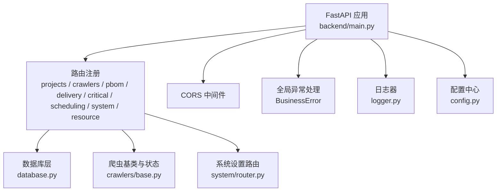
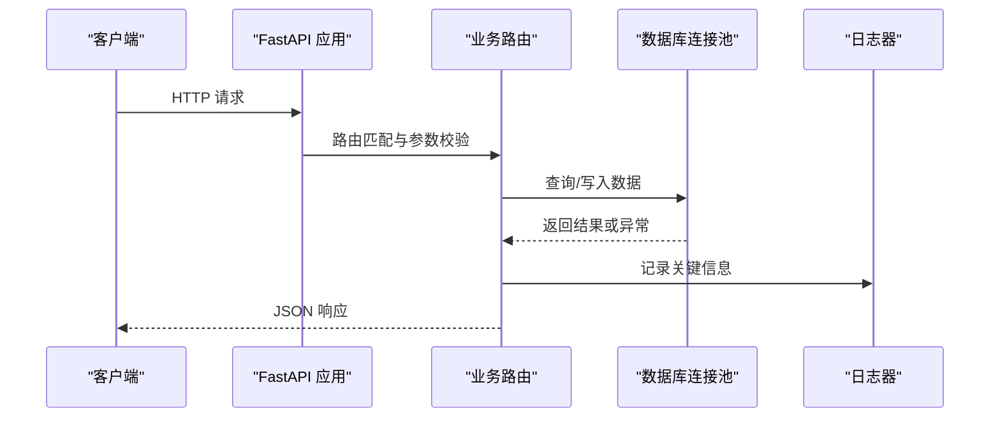
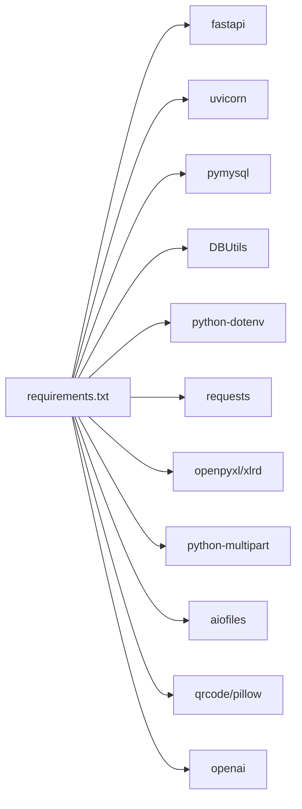

# 测试与调试

<cite>
**本文引用的文件**
- [backend/main.py](file://backend/main.py)
- [backend/config.py](file://backend/config.py)
- [backend/logger.py](file://backend/logger.py)
- [backend/database.py](file://backend/database.py)
- [backend/core/exceptions.py](file://backend/core/exceptions.py)
- [backend/crawlers/base.py](file://backend/crawlers/base.py)
- [backend/system/router.py](file://backend/system/router.py)
- [backend/projects/router.py](file://backend/projects/router.py)
- [backend/scripts/test_config_api.py](file://backend/scripts/test_config_api.py)
- [backend/scripts/test_feishu_sync.py](file://backend/scripts/test_feishu_sync.py)
- [backend/requirements.txt](file://backend/requirements.txt)
</cite>

## 目录
1. [简介](#简介)
2. [项目结构](#项目结构)
3. [核心组件](#核心组件)
4. [架构总览](#架构总览)
5. [详细组件分析](#详细组件分析)
6. [依赖分析](#依赖分析)
7. [性能考虑](#性能考虑)
8. [故障排查指南](#故障排查指南)
9. [结论](#结论)
10. [附录](#附录)

## 简介
本指南面向 spiderV5 PBOM 智能装配系统的测试与调试实践，覆盖单元测试、集成测试、测试数据管理、调试技巧、日志与性能监控、常见问题排查、生产环境日志收集与分析、性能与压力测试，以及自动化持续集成的落地建议。文档基于仓库现有代码与脚本进行梳理，确保可操作且与当前实现一致。

## 项目结构
后端采用 FastAPI 应用，模块化路由组织业务功能；数据库通过连接池访问；爬虫模块提供统一抽象；系统设置模块负责凭证与参数管理；日志采用滚动文件+控制台输出；配置通过环境变量加载。

**图表来源**
- [backend/main.py:29-83](file://backend/main.py#L29-L83)
- [backend/database.py:12-43](file://backend/database.py#L12-L43)
- [backend/crawlers/base.py:12-67](file://backend/crawlers/base.py#L12-L67)
- [backend/system/router.py:52-109](file://backend/system/router.py#L52-L109)
- [backend/logger.py:14-42](file://backend/logger.py#L14-L42)
- [backend/config.py:48-98](file://backend/config.py#L48-L98)

**章节来源**
- [backend/main.py:29-83](file://backend/main.py#L29-L83)
- [backend/config.py:48-98](file://backend/config.py#L48-L98)
- [backend/logger.py:14-42](file://backend/logger.py#L14-L42)
- [backend/database.py:12-43](file://backend/database.py#L12-L43)

## 核心组件
- 应用入口与生命周期：启动时初始化调度器，关闭时停止调度器与爬虫管理器；提供健康检查接口。
- 配置管理：从 .env 加载数据库、服务、爬虫、外部系统等配置，提供类型安全的读取方法。
- 日志系统：按级别输出到文件与控制台，支持滚动保留历史日志。
- 数据库访问：连接池单例，封装查询与写操作，失败时回滚并记录错误。
- 爬虫抽象：统一同步类型、执行结果与状态枚举，便于扩展新数据源。
- 系统设置：登录获取 Token、凭证增删改查、手动同步凭证、系统参数更新。

**章节来源**
- [backend/main.py:36-55](file://backend/main.py#L36-L55)
- [backend/config.py:25-98](file://backend/config.py#L25-L98)
- [backend/logger.py:14-42](file://backend/logger.py#L14-L42)
- [backend/database.py:12-116](file://backend/database.py#L12-L116)
- [backend/crawlers/base.py:12-67](file://backend/crawlers/base.py#L12-L67)
- [backend/system/router.py:52-109](file://backend/system/router.py#L52-L109)

## 架构总览
下图展示请求从客户端进入 FastAPI，经路由分发到具体业务模块，调用数据库或外部系统，并通过日志记录关键步骤。

**图表来源**
- [backend/main.py:74-83](file://backend/main.py#L74-L83)
- [backend/database.py:51-116](file://backend/database.py#L51-L116)
- [backend/logger.py:14-42](file://backend/logger.py#L14-L42)

## 详细组件分析

### 单元测试编写方法与 pytest 使用
- 目标范围
  - 配置读取：验证整数、布尔、列表配置的默认值与解析逻辑。
  - 数据库封装：验证查询与写操作的返回值、异常路径与回滚行为。
  - 爬虫基类：验证同步类型枚举、结果对象字段与序列化。
  - 路由输入校验：验证 Pydantic 模型约束与错误响应。
- 推荐结构
  - tests/unit/test_config.py：断言 Settings 的读取与转换。
  - tests/unit/test_database.py：使用内存或测试库实例化连接（如 SQLite），验证 CRUD。
  - tests/unit/test_crawler_base.py：断言 CrawlerResult.to_dict() 与枚举值。
  - tests/unit/test_routes.py：使用 TestClient 调用路由，断言状态码与响应体。
- pytest 配置要点
  - 在根目录添加 pytest.ini 或 pyproject.toml 中的 [tool.pytest] 段，指定测试发现规则。
  - 使用 fixtures 管理测试数据库会话与临时上传目录。
  - 使用 monkeypatch 替换环境变量，隔离不同环境的配置影响。
- 示例思路（不直接贴代码）
  - 测试配置：注入 DB_HOST、DB_PORT、DEBUG 等环境变量，断言 Settings 属性。
  - 测试数据库：构造最小 SQL 表结构，插入测试数据，断言 query_one/query_all/execute 的行为。
  - 测试路由：发送合法/非法请求，断言 200/400/404 及错误消息。

[本节为通用实践指导，未直接分析具体文件，故无“章节来源”]

### 集成测试策略
- API 接口测试
  - 使用 TestClient 启动应用，覆盖项目、PBOM 导入、系统设置等关键路由。
  - 重点断言：状态码、JSON 结构、分页字段、错误消息。
- 数据库测试
  - 使用独立测试库或事务回滚策略，保证用例间隔离。
  - 覆盖批量写入、异常回滚、自增 ID 返回等场景。
- 外部系统集成测试
  - 爬虫与 WMS/飞书：通过 mock 网络请求或本地代理，模拟成功/失败/超时。
  - 凭证登录与 Token 获取：断言登录流程与凭证保存。
- 端到端流程
  - 上传 PBOM -> 解析 -> 匹配 -> 统计，串联多个路由与数据库操作。

**章节来源**
- [backend/projects/router.py:152-231](file://backend/projects/router.py#L152-L231)
- [backend/system/router.py:52-109](file://backend/system/router.py#L52-L109)
- [backend/database.py:51-116](file://backend/database.py#L51-L116)

### 测试数据准备与管理
- 静态数据
  - 使用 fixtures 生成项目、零件、配置列等基础数据。
  - 模板文件：复用 static/PBOM导入模板.xlsx 作为导入测试素材。
- 动态数据
  - 每个用例开始前创建必要资源，结束后清理或回滚。
  - 对外部系统：使用 responses/vcr.py 录制或 Mock 网络响应。
- 数据版本化
  - SQL 脚本与 Python 初始化脚本配合，保证测试环境一致性。
  - 对敏感数据脱敏，避免泄露真实凭证。

**章节来源**
- [backend/projects/router.py:17-29](file://backend/projects/router.py#L17-L29)
- [backend/scripts/init_db.py](file://backend/scripts/init_db.py)
- [backend/sql/resource_schema.sql](file://backend/sql/resource_schema.sql)

### 调试技巧与工具
- Python 调试器
  - 使用 pdb 或 IDE 调试器在关键函数处设置断点，观察变量与调用栈。
  - 针对爬虫与网络请求，打印请求头与响应体以定位问题。
- 日志分析
  - 查看 logs/spider_v5.log，过滤 ERROR/WARNING 级别。
  - 结合时间戳与模块名快速定位异常来源。
- 性能监控
  - 使用 uvicorn 的 --log-level 调整日志粒度。
  - 对热点接口增加耗时日志，识别慢查询与阻塞点。
- 配置与环境
  - 确认 backend/.env 已正确复制并填写数据库与服务端口。
  - 使用 DEBUG=True 开启更详细的日志输出。

**章节来源**
- [backend/logger.py:14-42](file://backend/logger.py#L14-L42)
- [backend/config.py:15-22](file://backend/config.py#L15-L22)
- [backend/main.py:122-159](file://backend/main.py#L122-L159)

### 常见问题排查
- 数据库连接问题
  - 现象：服务启动后无法查询或写入。
  - 排查：检查 .env 中 DB_HOST/PORT/USER/PASSWORD/DATABASE；查看日志中连接池初始化错误。
  - 修复：修正配置或重启服务；必要时重建数据库与表结构。
- 爬虫抓取失败
  - 现象：飞书/WMS 同步结果为 FAILED。
  - 排查：检查凭证是否有效、网络连通性、超时配置；查看爬虫日志与错误消息。
  - 修复：更新凭证、调整超时、重试机制。
- API 调用异常
  - 现象：400/404/500 响应。
  - 排查：核对请求参数与路由定义；查看 BusinessError 与 HTTPException 抛出位置。
  - 修复：修正前端传参或服务端校验逻辑。

**章节来源**
- [backend/database.py:12-43](file://backend/database.py#L12-L43)
- [backend/core/exceptions.py:1-8](file://backend/core/exceptions.py#L1-L8)
- [backend/system/router.py:52-109](file://backend/system/router.py#L52-L109)

### 生产环境日志收集与分析
- 日志轮转：文件大小上限与保留数量已在日志器中配置，避免磁盘占满。
- 集中采集：将 logs 目录挂载至日志收集系统（如 ELK/Loki），按模块与级别索引。
- 告警策略：对 ERROR 级别与特定关键字（如“连接池初始化失败”）设置告警。
- 审计追踪：关键操作（登录、凭证更新、PBOM 导入）需记录用户与时间戳。

**章节来源**
- [backend/logger.py:23-36](file://backend/logger.py#L23-L36)

### 性能测试与压力测试
- 目标接口
  - 项目列表、缺件查询、PBOM 导入、凭证登录。
- 工具与方法
  - 使用 locust/k6 构建并发场景，模拟多用户同时导入与查询。
  - 关注数据库连接池大小与慢查询，优化 SQL 与索引。
- 指标与阈值
  - P95/P99 延迟、吞吐量、错误率、CPU/内存占用。
  - 设定 SLA 阈值，超过则触发告警与回滚。

[本节为通用实践指导，未直接分析具体文件，故无“章节来源”]

### 自动化测试与持续集成
- 本地运行
  - 安装依赖后，执行 pytest 运行单元与集成测试。
  - 使用脚本 test_config_api.py 与 test_feishu_sync.py 进行快速验证。
- CI 流水线
  - 阶段：安装依赖 -> 初始化测试数据库 -> 运行测试 -> 生成报告。
  - 缓存：缓存 pip 包与下载物，缩短构建时间。
  - 并行：按模块并行执行测试用例，提升效率。
- 质量门禁
  - 覆盖率阈值、lint 检查、安全扫描。
  - 失败阻断合并，确保主干稳定。

**章节来源**
- [backend/scripts/test_config_api.py:1-17](file://backend/scripts/test_config_api.py#L1-L17)
- [backend/scripts/test_feishu_sync.py:1-57](file://backend/scripts/test_feishu_sync.py#L1-L57)
- [backend/requirements.txt:1-21](file://backend/requirements.txt#L1-L21)

## 依赖分析
后端依赖包括 Web 框架、数据库驱动、HTTP 客户端、Excel 处理、异步文件 IO、二维码生成与 LLM 客户端。这些依赖支撑了路由、数据访问、爬虫、文件处理与外部集成。

**图表来源**
- [backend/requirements.txt:1-21](file://backend/requirements.txt#L1-L21)

**章节来源**
- [backend/requirements.txt:1-21](file://backend/requirements.txt#L1-L21)

## 性能考虑
- 数据库
  - 合理设置连接池大小，避免过多连接导致资源竞争。
  - 对高频查询建立索引，减少全表扫描。
- 爬虫
  - 控制并发与超时，避免对上游系统造成压力。
  - 增量同步优先，减少重复抓取。
- 文件处理
  - 大文件分块读写，避免内存峰值过高。
  - 及时清理临时文件，防止磁盘占用。
- 日志
  - 生产环境降低日志级别，减少 I/O 开销。
  - 定期归档与压缩日志文件。

[本节为通用实践指导，未直接分析具体文件，故无“章节来源”]

## 故障排查指南
- 数据库连接失败
  - 检查 .env 配置与 MySQL 服务状态。
  - 查看日志中连接池初始化错误信息。
- 爬虫同步失败
  - 验证凭证有效性，检查网络连通性与超时。
  - 使用探针脚本逐步定位问题（如飞书表格探测）。
- API 异常
  - 核对请求参数与路由定义。
  - 查看 BusinessError 与 HTTPException 的抛出位置。
- 性能瓶颈
  - 使用慢查询日志定位数据库热点。
  - 对 CPU 密集型任务进行拆分与异步化。

**章节来源**
- [backend/database.py:12-43](file://backend/database.py#L12-L43)
- [backend/core/exceptions.py:1-8](file://backend/core/exceptions.py#L1-L8)
- [backend/system/router.py:52-109](file://backend/system/router.py#L52-L109)

## 结论
通过规范的单元测试、全面的集成测试、完善的测试数据管理与调试手段，结合生产环境的日志收集与性能监控，可以显著提升 spiderV5 的稳定性和可维护性。建议在团队内推广本指南的实践，并在 CI 中固化质量门禁，确保每次变更都经过充分验证。

[本节为总结性内容，未直接分析具体文件，故无“章节来源”]

## 附录
- 常用命令
  - 启动服务：参考 main.py 的 uvicorn 运行方式。
  - 运行脚本：test_config_api.py、test_feishu_sync.py 用于快速验证配置与同步。
- 配置文件
  - .env 示例与说明：确保数据库、服务端口、CORS 等配置正确。
- 数据库初始化
  - 使用 sql 脚本与 init_db.py 初始化表结构与基础数据。

**章节来源**
- [backend/main.py:122-159](file://backend/main.py#L122-L159)
- [backend/scripts/test_config_api.py:1-17](file://backend/scripts/test_config_api.py#L1-L17)
- [backend/scripts/test_feishu_sync.py:1-57](file://backend/scripts/test_feishu_sync.py#L1-L57)
- [backend/config.py:15-22](file://backend/config.py#L15-L22)
- [backend/sql/resource_schema.sql](file://backend/sql/resource_schema.sql)