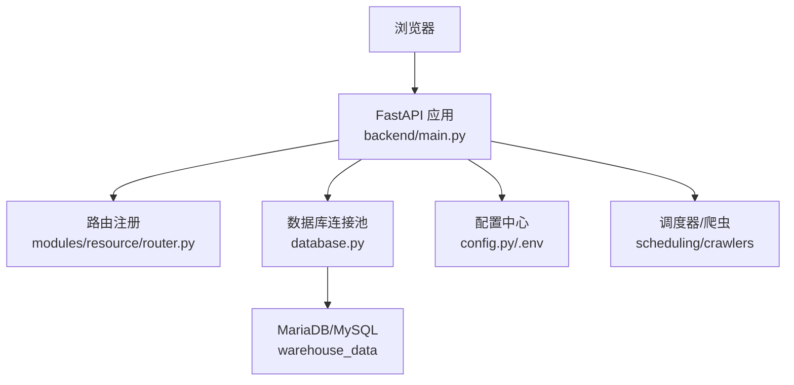
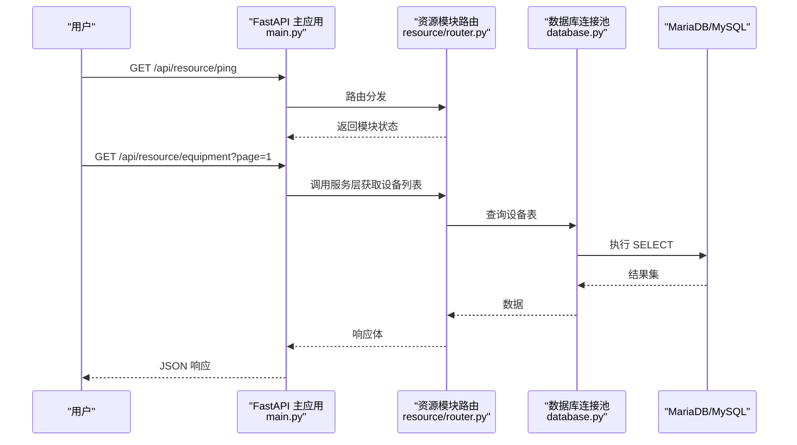
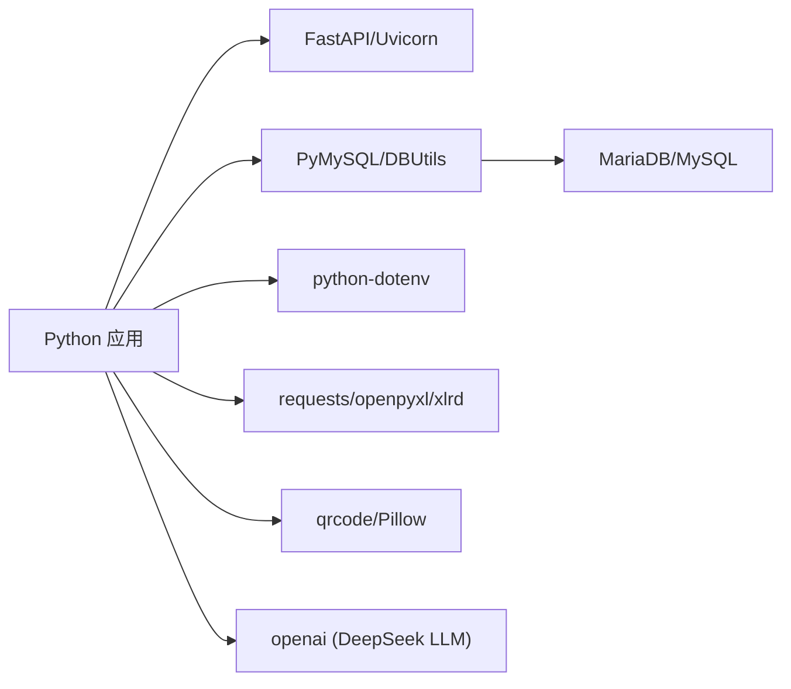
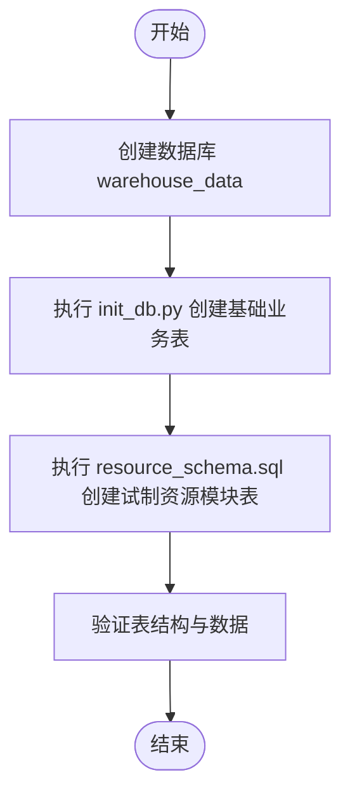

# 快速开始

<cite>
**本文引用的文件**
- [backend/env.example](file://backend/env.example)
- [backend/config.py](file://backend/config.py)
- [backend/database.py](file://backend/database.py)
- [backend/main.py](file://backend/main.py)
- [backend/requirements.txt](file://backend/requirements.txt)
- [backend/scripts/init_db.py](file://backend/scripts/init_db.py)
- [backend/sql/resource_schema.sql](file://backend/sql/resource_schema.sql)
- [windows_setup/README_WINDOWS.txt](file://windows_setup/README_WINDOWS.txt)
- [windows_setup/sql/create_database.sql](file://windows_setup/sql/create_database.sql)
- [start_server.py](file://start_server.py)
- [backend/modules/resource/router.py](file://backend/modules/resource/router.py)
</cite>

## 目录
1. [简介](#简介)
2. [项目结构](#项目结构)
3. [核心组件](#核心组件)
4. [架构总览](#架构总览)
5. [详细组件分析](#详细组件分析)
6. [依赖关系分析](#依赖关系分析)
7. [性能注意事项](#性能注意事项)
8. [故障排查指南](#故障排查指南)
9. [结论](#结论)
10. [附录](#附录)

## 简介
本快速开始指南面向首次接触“试制资源数智化管理系统”的新用户，目标是帮助你在最短时间内完成环境搭建、数据库初始化、后端服务启动与验证，并了解前端参考工程的运行方式。你将获得：
- Python 3.9+ 与 MariaDB/MySQL 的安装与配置要点
- 完整的环境变量说明（数据库连接、第三方服务密钥等）
- 数据库初始化步骤（基础业务表 + 试制资源模块表）
- 后端服务的启动方法与健康检查验证
- 前端参考工程运行方式
- 常见环境问题定位与解决方案

## 项目结构
仓库采用前后端分离的模块化设计：
- 后端基于 FastAPI，提供 RESTful API；通过环境变量加载配置，使用 MySQL/MariaDB 持久化数据
- 试制资源管理作为独立模块挂载在 /api/resource 下，包含设备、人员、任务、预警、排程等能力
- Windows 一键部署脚本覆盖建库、安装依赖、初始化表、启动服务等全流程
- 前端参考工程位于 webui_ref，使用 NestJS + Vite + React 技术栈

图表来源
- [backend/main.py:29-83](file://backend/main.py#L29-L83)
- [backend/modules/resource/router.py:1-14](file://backend/modules/resource/router.py#L1-L14)
- [backend/database.py:12-43](file://backend/database.py#L12-L43)
- [backend/config.py:48-101](file://backend/config.py#L48-L101)

章节来源
- [backend/main.py:29-83](file://backend/main.py#L29-L83)
- [backend/config.py:48-101](file://backend/config.py#L48-L101)
- [backend/database.py:12-43](file://backend/database.py#L12-L43)
- [backend/modules/resource/router.py:1-14](file://backend/modules/resource/router.py#L1-L14)

## 核心组件
- 配置管理：从 .env 读取数据库、服务端口、CORS、第三方服务密钥等，并提供类型安全的访问接口
- 数据库层：封装连接池、查询与执行方法，统一事务提交与回滚
- 应用入口：注册路由、中间件、全局异常处理、静态页面托管与健康检查
- 试制资源模块：设备、区域、人员、任务、预警、效率统计、维护记录、甘特排程与冲突检测等 API
- Windows 部署脚本：一键创建数据库、安装依赖、初始化表、启动服务

章节来源
- [backend/config.py:48-101](file://backend/config.py#L48-L101)
- [backend/database.py:12-116](file://backend/database.py#L12-L116)
- [backend/main.py:29-120](file://backend/main.py#L29-L120)
- [backend/modules/resource/router.py:47-800](file://backend/modules/resource/router.py#L47-L800)

## 架构总览
后端以 FastAPI 为核心，按功能划分多个路由模块；数据库通过连接池复用连接；配置集中管理；Windows 脚本简化本地部署流程。

图表来源
- [backend/main.py:74-83](file://backend/main.py#L74-L83)
- [backend/modules/resource/router.py:47-86](file://backend/modules/resource/router.py#L47-L86)
- [backend/database.py:51-85](file://backend/database.py#L51-L85)

## 详细组件分析

### 环境与配置
- 环境变量文件：复制 backend/.env.example 为 backend/.env，按需修改
- 关键配置项：
  - 数据库：DB_HOST、DB_PORT、DB_USER、DB_PASSWORD、DB_DATABASE
  - 服务：SERVER_HOST、SERVER_PORT、DEBUG、CORS_ORIGINS
  - 爬虫：SPIDER_INTERVAL_MINUTES、SPIDER_TIMEOUT_SECONDS
  - WMS：LOGIN_URL、QUERY_URL
  - 飞书：FEISHU_APP_ID、FEISHU_APP_SECRET、FEISHU_SHEET_URL
  - 采购系统：PURCHASE_API_URL、PURCHASE_API_KEY
  - DeepSeek LLM：DEEPSEEK_API_KEY、DEEPSEEK_BASE_URL、DEEPSEEK_MODEL
  - QR码到件地址：QR_BASE_URL
  - 上传目录：UPLOAD_DIR（可选）
- 配置加载：应用启动时自动加载 .env，未找到时会输出警告并使用默认值

章节来源
- [backend/env.example:1-49](file://backend/env.example#L1-L49)
- [backend/config.py:15-22](file://backend/config.py#L15-L22)
- [backend/config.py:48-101](file://backend/config.py#L48-L101)

### 数据库初始化
- 基础业务表：由 backend/scripts/init_db.py 创建，包括项目、零件、配置、交付记录、凭证、系统参数等
- 试制资源模块表：由 backend/sql/resource_schema.sql 创建，包括设备、区域、人员、任务、预警、效率统计、维护记录、甘特排程与冲突检测等
- Windows 建库脚本：windows_setup/sql/create_database.sql 用于创建 warehouse_data 数据库与可选专用用户

建议顺序：
1) 创建数据库（可手动或执行 Windows 脚本）
2) 执行 init_db.py 创建基础业务表与默认系统参数
3) 执行 resource_schema.sql 创建试制资源模块表

章节来源
- [backend/scripts/init_db.py:17-293](file://backend/scripts/init_db.py#L17-L293)
- [backend/sql/resource_schema.sql:1-326](file://backend/sql/resource_schema.sql#L1-L326)
- [windows_setup/sql/create_database.sql:1-36](file://windows_setup/sql/create_database.sql#L1-L36)

### 后端服务启动与验证
- 启动方式：
  - 直接运行：python backend/main.py（开发模式支持热重载）
  - 使用启动脚本：python start_server.py（Windows 上更友好的进程管理与优雅退出）
  - Windows 一键启动：双击 windows_setup\5_start_server.bat
- 健康检查：GET http://localhost:8000/api/health
- 资源模块健康检查：GET http://localhost:8000/api/resource/ping

章节来源
- [backend/main.py:122-159](file://backend/main.py#L122-L159)
- [start_server.py:31-48](file://start_server.py#L31-L48)
- [windows_setup/README_WINDOWS.txt:75-82](file://windows_setup/README_WINDOWS.txt#L75-L82)

### 前端参考工程运行
- 技术栈：NestJS + Vite + React
- 安装与运行：
  - 进入 webui_ref 目录
  - 安装依赖：npm install
  - 开发模式：npm run dev（同时启动客户端与服务端）
  - 生产构建：npm run build:prod
- 注意：前端参考工程是独立的演示工程，可与后端 API 对接进行联调

章节来源
- [webui_ref/package.json:11-34](file://webui_ref/package.json#L11-L34)
- [webui_ref/package.json:202-205](file://webui_ref/package.json#L202-L205)

## 依赖关系分析
- Python 依赖：FastAPI、Uvicorn、PyMySQL、DBUtils、python-dotenv、requests、openpyxl、xlrd、qrcode、Pillow、openai 等
- 数据库驱动：pymysql 通过 DBUtils 连接池访问 MariaDB/MySQL
- 配置依赖：python-dotenv 加载 .env 文件
- 前端依赖：NestJS、Vite、React、Tailwind、ECharts 等

图表来源
- [backend/requirements.txt:1-21](file://backend/requirements.txt#L1-L21)
- [backend/database.py:1-6](file://backend/database.py#L1-L6)
- [backend/config.py:6-22](file://backend/config.py#L6-L22)

章节来源
- [backend/requirements.txt:1-21](file://backend/requirements.txt#L1-L21)

## 性能注意事项
- 数据库连接池：默认最大连接数 10，最小缓存 0，避免启动时预建连接导致配置错误崩溃
- 字符集：数据库与连接均使用 utf8mb4，确保中文显示正确
- CORS：可通过 CORS_ORIGINS 控制跨域来源，开发阶段可使用 *，生产环境建议限制具体域名
- 调试模式：DEBUG=true 时启用热重载，便于开发；生产环境建议关闭
- 上传目录：UPLOAD_DIR 自动创建，确保路径存在且具备写入权限

章节来源
- [backend/database.py:12-43](file://backend/database.py#L12-L43)
- [backend/config.py:81-101](file://backend/config.py#L81-L101)

## 故障排查指南
- 数据库连接失败
  - 检查 backend/.env 中的 DB_HOST、DB_PORT、DB_USER、DB_PASSWORD、DB_DATABASE 是否与本地实例一致
  - 确认 warehouse_data 数据库已存在
  - 查看日志中关于连接池初始化的错误提示
- pip 安装依赖失败或速度慢
  - 使用国内镜像源：python -m pip install -r backend/requirements.txt -i https://pypi.tuna.tsinghua.edu.cn/simple
- 端口 8000 被占用
  - 修改 backend/.env 中的 SERVER_PORT 为其他端口（如 8080）
- 中文字段乱码
  - 确保数据库、表、连接均使用 utf8mb4
- 停止服务
  - 直接关闭窗口或使用 Ctrl+C；Windows 也可通过 taskkill 终止进程
- 后台运行与开机自启
  - 可使用 NSSM 将 Python 进程注册为 Windows 服务，或使用任务计划程序

章节来源
- [windows_setup/README_WINDOWS.txt:91-114](file://windows_setup/README_WINDOWS.txt#L91-L114)
- [backend/database.py:34-42](file://backend/database.py#L34-L42)

## 结论
通过本指南，你可以在本地快速完成试制资源数智化管理系统的搭建与运行。重点在于：
- 正确配置 .env 环境变量
- 依次执行数据库初始化脚本（基础表 + 资源模块表）
- 启动后端服务并通过健康检查验证
- 根据需要运行前端参考工程进行联调

## 附录

### 环境变量清单与说明
- 数据库
  - DB_HOST：数据库主机地址，默认 127.0.0.1
  - DB_PORT：数据库端口，默认 3306
  - DB_USER：数据库用户名，默认 root
  - DB_PASSWORD：数据库密码，需填写真实密码
  - DB_DATABASE：数据库名，默认 warehouse_data
- 服务
  - SERVER_HOST：监听地址，默认 0.0.0.0
  - SERVER_PORT：监听端口，默认 8000
  - DEBUG：是否开启调试与热重载，默认 true
  - CORS_ORIGINS：允许的跨域来源，多个用逗号分隔，* 表示全部允许
- 爬虫
  - SPIDER_INTERVAL_MINUTES：爬虫间隔分钟数，默认 30
  - SPIDER_TIMEOUT_SECONDS：爬虫超时秒数，默认 30
- WMS 仓库接口
  - LOGIN_URL：登录接口地址
  - QUERY_URL：查询接口地址
- 飞书共享表
  - FEISHU_APP_ID：应用 ID
  - FEISHU_APP_SECRET：应用密钥
  - FEISHU_SHEET_URL：共享表 URL
- 采购系统
  - PURCHASE_API_URL：采购系统 API 地址
  - PURCHASE_API_KEY：采购系统 API 密钥
- DeepSeek LLM
  - DEEPSEEK_API_KEY：LLM API 密钥
  - DEEPSEEK_BASE_URL：LLM 服务基地址
  - DEEPSEEK_MODEL：模型名称
- QR码到件
  - QR_BASE_URL：二维码中生成的到件页面地址
- 上传目录
  - UPLOAD_DIR：可选，上传文件存储目录

章节来源
- [backend/env.example:7-49](file://backend/env.example#L7-L49)
- [backend/config.py:51-95](file://backend/config.py#L51-L95)

### 数据库初始化流程图

图表来源
- [windows_setup/sql/create_database.sql:9-19](file://windows_setup/sql/create_database.sql#L9-L19)
- [backend/scripts/init_db.py:17-293](file://backend/scripts/init_db.py#L17-L293)
- [backend/sql/resource_schema.sql:1-326](file://backend/sql/resource_schema.sql#L1-L326)