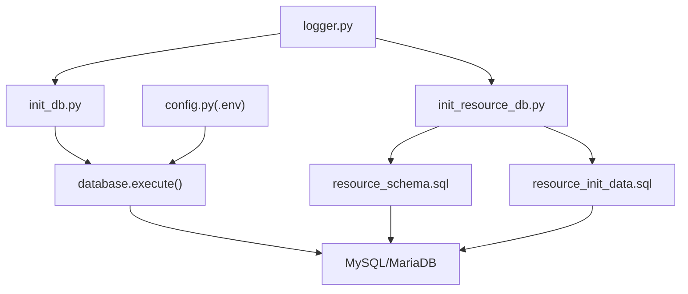
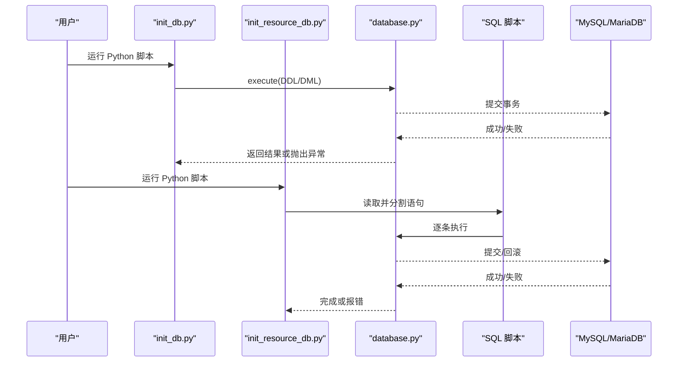
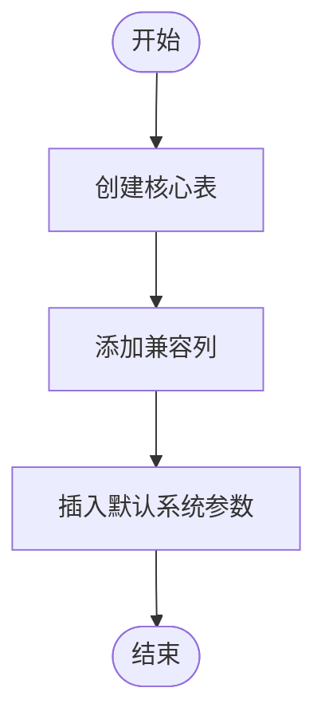
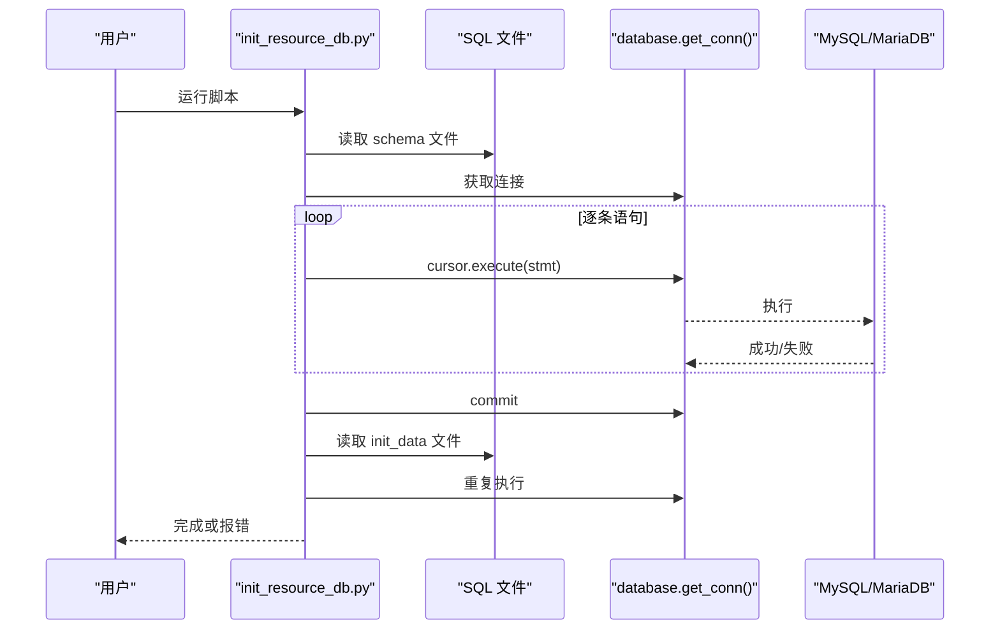
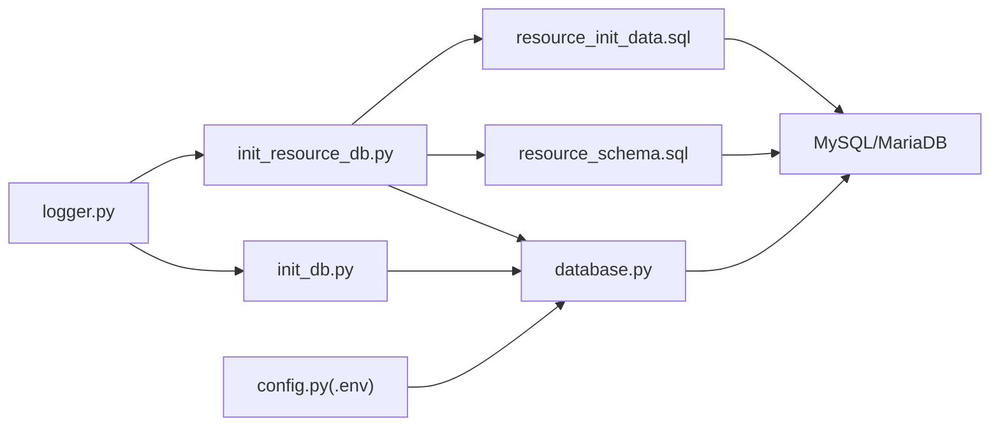

# 数据初始化流程

<cite>
**本文引用的文件**
- [backend/scripts/init_db.py](file://backend/scripts/init_db.py)
- [backend/sql/init_resource_db.py](file://backend/sql/init_resource_db.py)
- [backend/sql/resource_schema.sql](file://backend/sql/resource_schema.sql)
- [backend/sql/resource_init_data.sql](file://backend/sql/resource_init_data.sql)
- [backend/database.py](file://backend/database.py)
- [backend/config.py](file://backend/config.py)
- [backend/env.example](file://backend/env.example)
- [backend/logger.py](file://backend/logger.py)
- [windows_setup/4_init_database.bat](file://windows_setup/4_init_database.bat)
- [windows_setup/step4_init_db_tables.bat](file://windows_setup/step4_init_db_tables.bat)
</cite>

## 目录
1. [简介](#简介)
2. [项目结构](#项目结构)
3. [核心组件](#核心组件)
4. [架构总览](#架构总览)
5. [详细组件分析](#详细组件分析)
6. [依赖关系分析](#依赖关系分析)
7. [性能考虑](#性能考虑)
8. [故障排除指南](#故障排除指南)
9. [结论](#结论)
10. [附录：初始化操作指南与环境策略](#附录初始化操作指南与环境策略)

## 简介
本文件面向“试制资源数智化管理系统”的数据初始化流程，聚焦于数据库表结构创建、基础与示例数据导入、脚本执行方式、错误处理与回滚机制，以及不同环境的部署策略。文档同时覆盖两套初始化路径：
- Python 脚本直连数据库建表并写入默认参数（后端内置）
- SQL 脚本批量执行（资源域专用）

## 项目结构
与数据初始化直接相关的代码与脚本分布如下：
- backend/scripts/init_db.py：Python 脚本，负责创建 V5 所需的核心表结构，并插入默认系统参数
- backend/sql/init_resource_db.py：Python 编排器，顺序执行 resource_schema.sql 与 resource_init_data.sql
- backend/sql/resource_schema.sql：资源域数据库表结构定义（设备、区域、人员、任务、预警、排程等）
- backend/sql/resource_init_data.sql：资源域示例数据（区域、设备、人员、任务、预警、维护记录）
- backend/database.py：数据库连接池与通用执行方法（含事务回滚）
- backend/config.py：从 .env 加载配置（DB_HOST、DB_PORT、DB_USER、DB_PASSWORD、DB_DATABASE 等）
- backend/env.example：环境配置模板
- backend/logger.py：日志输出（控制台与滚动文件）
- windows_setup/*.bat：Windows 一键部署步骤，包含初始化数据库的批处理入口

图表来源
- [backend/scripts/init_db.py:17-297](file://backend/scripts/init_db.py#L17-L297)
- [backend/sql/init_resource_db.py:21-68](file://backend/sql/init_resource_db.py#L21-L68)
- [backend/database.py:12-116](file://backend/database.py#L12-L116)
- [backend/config.py:48-98](file://backend/config.py#L48-L98)
- [backend/logger.py:14-43](file://backend/logger.py#L14-L43)

章节来源
- [backend/scripts/init_db.py:17-297](file://backend/scripts/init_db.py#L17-L297)
- [backend/sql/init_resource_db.py:21-68](file://backend/sql/init_resource_db.py#L21-L68)
- [backend/sql/resource_schema.sql:1-326](file://backend/sql/resource_schema.sql#L1-L326)
- [backend/sql/resource_init_data.sql:1-127](file://backend/sql/resource_init_data.sql#L1-L127)
- [backend/database.py:12-116](file://backend/database.py#L12-L116)
- [backend/config.py:48-98](file://backend/config.py#L48-L98)
- [backend/env.example:7-12](file://backend/env.example#L7-L12)
- [backend/logger.py:14-43](file://backend/logger.py#L14-L43)
- [windows_setup/4_init_database.bat:16-47](file://windows_setup/4_init_database.bat#L16-L47)
- [windows_setup/step4_init_db_tables.bat:16-46](file://windows_setup/step4_init_db_tables.bat#L16-L46)

## 核心组件
- 数据库连接与执行层
  - 连接池：通过 PooledDB 管理连接，避免频繁创建销毁
  - 执行封装：execute/query_all/query_one/execute_last_id/execute_all，统一异常捕获与事务回滚
- 配置加载
  - 从 backend/.env 读取 DB_* 相关配置；缺失时给出明确警告
- 日志记录
  - 控制台 + 滚动文件，便于定位初始化失败原因
- 初始化脚本
  - init_db.py：创建 V5 核心表并写入默认系统参数
  - init_resource_db.py：按序执行资源域建表与示例数据脚本

章节来源
- [backend/database.py:12-116](file://backend/database.py#L12-L116)
- [backend/config.py:48-98](file://backend/config.py#L48-L98)
- [backend/logger.py:14-43](file://backend/logger.py#L14-L43)
- [backend/scripts/init_db.py:17-297](file://backend/scripts/init_db.py#L17-L297)
- [backend/sql/init_resource_db.py:21-68](file://backend/sql/init_resource_db.py#L21-L68)

## 架构总览
下图展示两种初始化路径及其与数据库交互的关系：

图表来源
- [backend/scripts/init_db.py:17-297](file://backend/scripts/init_db.py#L17-L297)
- [backend/sql/init_resource_db.py:21-68](file://backend/sql/init_resource_db.py#L21-L68)
- [backend/database.py:73-116](file://backend/database.py#L73-L116)

## 详细组件分析

### 组件A：init_db.py（V5 核心表与默认参数）
- 功能要点
  - 创建 projects、project_parts、configs、part_configs、qr_arrival_records、critical_scores、spider_credentials、delivery_records、feishu_detail、system_params 等表
  - 对历史兼容字段进行 ALTER TABLE 添加列（如 project_parts.critical_reason、line_side_qty/status，configs 扩展列，delivery_detail.unqualified_qty）
  - 初始化 system_params 默认参数（权重、阈值、求解超时等）
- 执行流程
  - 使用 database.execute 执行每条 DDL/DML
  - 遇到已存在列时捕获异常并记录日志，保证幂等性
  - 最后输出“数据库初始化完成！”
- 错误处理
  - 单条语句失败会触发数据库层回滚并抛出异常
  - 兼容列添加采用 try/except 包裹，避免中断整体流程

图表来源
- [backend/scripts/init_db.py:17-297](file://backend/scripts/init_db.py#L17-L297)

章节来源
- [backend/scripts/init_db.py:17-297](file://backend/scripts/init_db.py#L17-L297)

### 组件B：init_resource_db.py（资源域脚本编排）
- 功能要点
  - 切换工作目录至 backend，确保 .env 可被正确加载
  - 读取并执行 resource_schema.sql（建表）
  - 读取并执行 resource_init_data.sql（示例数据）
  - 每步执行均记录日志，失败时回滚并终止
- 执行流程
  - 打开 SQL 文件，按分号拆分语句
  - 逐条执行，捕获异常并记录警告
  - 全部成功后提交事务

图表来源
- [backend/sql/init_resource_db.py:21-68](file://backend/sql/init_resource_db.py#L21-L68)
- [backend/database.py:46-49](file://backend/database.py#L46-L49)

章节来源
- [backend/sql/init_resource_db.py:21-68](file://backend/sql/init_resource_db.py#L21-L68)

### 组件C：resource_schema.sql（资源域表结构）
- 关键表
  - equipment（设备台账）、zones（区域/车间）、personnel（人员信息）、tasks（任务管理）
  - alerts（异常预警，含 SLA 与升级机制）
  - personnel_efficiency（人员效率统计）、equipment_maintenance（设备维护记录）
  - gantt_schedules（甘特排程计划）、gantt_resource_allocations（资源分配）、gantt_conflicts（冲突检测）
- 设计要点
  - 大量索引优化查询（状态、时间、关联键）
  - 枚举约束规范数据取值
  - 冗余字段提升展示与检索效率（如任务名称、区域编码等）

章节来源
- [backend/sql/resource_schema.sql:1-326](file://backend/sql/resource_schema.sql#L1-L326)

### 组件D：resource_init_data.sql（示例数据）
- 内容范围
  - 区域、设备、人员、任务、预警、维护记录的初始样例数据
- 用途
  - 快速验证界面与业务流程
  - 演示不同状态与场景（进行中、逾期、故障、无人作业等）

章节来源
- [backend/sql/resource_init_data.sql:1-127](file://backend/sql/resource_init_data.sql#L1-L127)

### 组件E：database.py（连接与事务）
- 连接池
  - 延迟初始化，避免启动即崩溃
  - 失败时输出清晰提示（检查 .env 中的 DB_* 配置）
- 事务与回滚
  - execute/query_all 等方法在异常时自动回滚
  - 提供批量执行接口以提高性能

章节来源
- [backend/database.py:12-116](file://backend/database.py#L12-L116)

### 组件F：config.py 与 env.example（环境配置）
- 配置项
  - DB_HOST、DB_PORT、DB_USER、DB_PASSWORD、DB_DATABASE
  - SERVER_HOST、SERVER_PORT、DEBUG、CORS_ORIGINS
  - 爬虫、WMS、飞书、采购、LLM 等可选配置
- 行为
  - 未找到 .env 时输出警告
  - 提供类型安全的读取函数（整数、布尔、列表）

章节来源
- [backend/config.py:48-98](file://backend/config.py#L48-L98)
- [backend/env.example:7-12](file://backend/env.example#L7-L12)

## 依赖关系分析
- init_db.py 依赖 database.execute 与 logger
- init_resource_db.py 依赖 database.get_conn 与 logger，并驱动 SQL 脚本执行
- SQL 脚本依赖 MySQL/MariaDB 引擎与 utf8mb4 字符集
- Windows 批处理脚本作为入口，调用 Python 脚本执行初始化

图表来源
- [backend/scripts/init_db.py:17-297](file://backend/scripts/init_db.py#L17-L297)
- [backend/sql/init_resource_db.py:21-68](file://backend/sql/init_resource_db.py#L21-L68)
- [backend/database.py:12-116](file://backend/database.py#L12-L116)
- [backend/config.py:48-98](file://backend/config.py#L48-L98)
- [backend/logger.py:14-43](file://backend/logger.py#L14-L43)

章节来源
- [backend/scripts/init_db.py:17-297](file://backend/scripts/init_db.py#L17-L297)
- [backend/sql/init_resource_db.py:21-68](file://backend/sql/init_resource_db.py#L21-L68)
- [backend/database.py:12-116](file://backend/database.py#L12-L116)
- [backend/config.py:48-98](file://backend/config.py#L48-L98)
- [backend/logger.py:14-43](file://backend/logger.py#L14-L43)

## 性能考虑
- 连接池复用：减少连接建立开销，提高并发稳定性
- 批量执行：execute_all 适用于大批量写入（如示例数据）
- 索引设计：SQL 中为常用查询字段建立索引，降低查询成本
- 幂等建表：使用 IF NOT EXISTS 与兼容列添加，避免重复执行失败
- 日志轮转：限制文件大小与保留数量，避免磁盘占用过大

[本节为通用指导，不直接分析具体文件]

## 故障排除指南
- 常见错误与排查
  - 数据库连接失败：检查 backend/.env 中 DB_HOST、DB_PORT、DB_USER、DB_PASSWORD、DB_DATABASE 是否正确
  - 权限不足：确认数据库用户具备 CREATE/INSERT/ALTER 权限
  - 字符集问题：确保数据库与表使用 utf8mb4
  - 端口不通：确认 MySQL/MariaDB 服务运行且端口可达
- 日志定位
  - 查看 logs 目录下对应日志文件（由 logger.py 生成）
  - 关注“数据库连接池初始化失败”“执行失败”等关键字
- 回滚与重试
  - 写操作失败会自动回滚，修正后重新执行脚本即可
  - 对于幂等脚本（IF NOT EXISTS），可安全重复执行

章节来源
- [backend/database.py:12-43](file://backend/database.py#L12-L43)
- [backend/database.py:73-116](file://backend/database.py#L73-L116)
- [backend/logger.py:14-43](file://backend/logger.py#L14-L43)
- [backend/config.py:15-22](file://backend/config.py#L15-L22)

## 结论
本项目提供了两条互补的数据初始化路径：Python 脚本用于快速构建 V5 核心表与默认参数；SQL 脚本用于资源域的完整表结构与示例数据。通过统一的数据库连接层与日志体系，保证了初始化过程的可观测性与可恢复性。结合 Windows 批处理脚本，可在本地快速完成环境准备与初始化。

[本节为总结性内容，不直接分析具体文件]

## 附录：初始化操作指南与环境策略

### 初始化步骤概览
- 准备环境
  - 安装并启动 MySQL/MariaDB
  - 复制 backend/.env.example 为 backend/.env，填写数据库连接信息
- 执行初始化
  - 方式一：运行 backend/scripts/init_db.py（创建 V5 核心表与默认参数）
  - 方式二：运行 backend/sql/init_resource_db.py（执行资源域建表与示例数据）
- 验证
  - 检查数据库表是否创建成功
  - 检查 system_params 是否写入默认值
  - 检查资源域示例数据是否导入

章节来源
- [backend/env.example:7-12](file://backend/env.example#L7-L12)
- [backend/scripts/init_db.py:17-297](file://backend/scripts/init_db.py#L17-L297)
- [backend/sql/init_resource_db.py:21-68](file://backend/sql/init_resource_db.py#L21-L68)

### 不同环境的初始化策略
- 开发环境
  - 使用本地 MySQL，DEBUG=true，允许跨域 *
  - 优先执行 init_db.py，再执行资源域脚本以快速验证
- 测试环境
  - 独立数据库实例，关闭 DEBUG，严格 CORS 配置
  - 建议先清空库或使用备份恢复，再执行初始化
- 生产环境
  - 使用专用数据库账号，最小权限原则
  - 建议在低峰期执行，提前备份数据库
  - 建议将 SQL 脚本纳入版本化发布流程，配合变更审批

章节来源
- [backend/config.py:48-98](file://backend/config.py#L48-L98)
- [backend/env.example:14-20](file://backend/env.example#L14-L20)

### 数据版本管理与迁移机制
- 现状
  - 当前仓库未发现专门的迁移框架或版本化迁移脚本
  - 初始化逻辑集中在 init_db.py 与 SQL 脚本中
- 建议
  - 将 DDL 与 DML 脚本纳入版本控制，命名遵循 vX_Y_Z 规范
  - 引入幂等脚本（IF NOT EXISTS、IGNORE INSERT）以避免重复执行
  - 建立变更记录与回滚脚本，便于紧急修复

[本节为通用建议，不直接分析具体文件]

### 初始化过程中的错误处理与回滚策略
- 错误处理
  - database.execute 在异常时自动回滚并抛出异常
  - init_resource_db.py 对每条 SQL 语句捕获异常并记录警告
  - init_db.py 对兼容列添加使用 try/except 保证健壮性
- 回滚策略
  - 基于数据库事务的回滚，保证一致性
  - 建议在执行前备份数据库，或在沙箱环境中先行验证

章节来源
- [backend/database.py:73-116](file://backend/database.py#L73-L116)
- [backend/sql/init_resource_db.py:21-45](file://backend/sql/init_resource_db.py#L21-L45)
- [backend/scripts/init_db.py:234-269](file://backend/scripts/init_db.py#L234-L269)

### Windows 一键初始化
- 使用批处理脚本
  - windows_setup/4_init_database.bat
  - windows_setup/step4_init_db_tables.bat
- 流程
  - 检查 Python 环境
  - 若缺少 .env 则自动调用配置步骤
  - 执行 backend/scripts/init_db.py
  - 失败时输出常见原因并暂停等待处理

章节来源
- [windows_setup/4_init_database.bat:16-47](file://windows_setup/4_init_database.bat#L16-L47)
- [windows_setup/step4_init_db_tables.bat:16-46](file://windows_setup/step4_init_db_tables.bat#L16-L46)