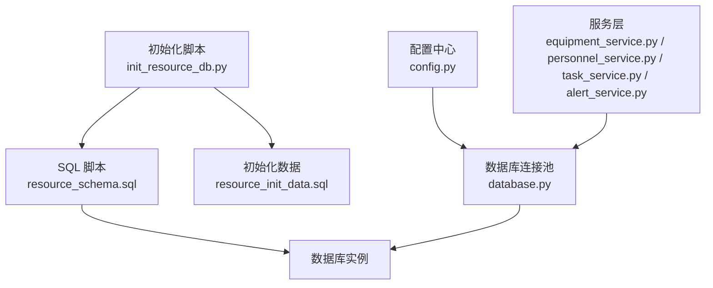
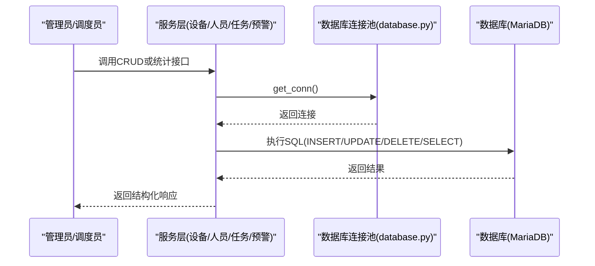
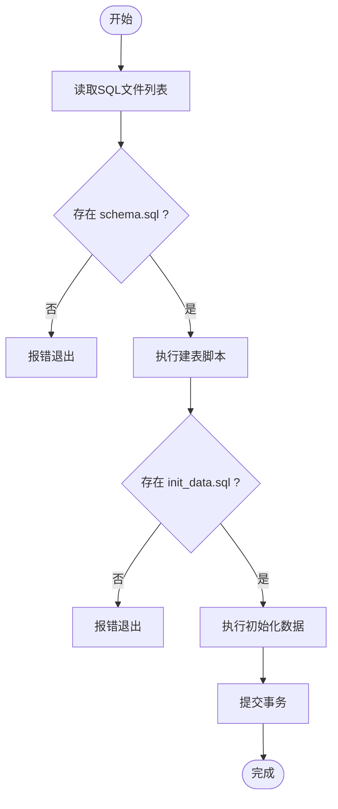
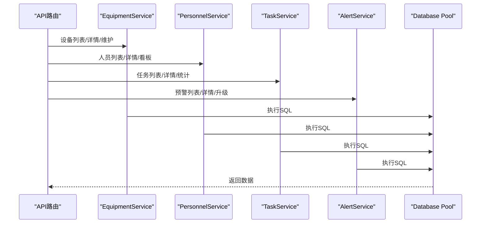
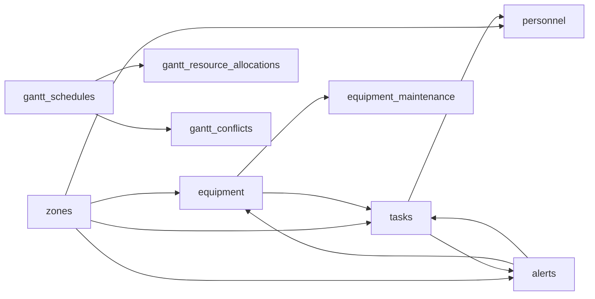

# 数据库设计

<cite>
**本文引用的文件**
- [backend/sql/resource_schema.sql](file://backend/sql/resource_schema.sql)
- [backend/sql/init_resource_db.py](file://backend/sql/init_resource_db.py)
- [backend/sql/resource_init_data.sql](file://backend/sql/resource_init_data.sql)
- [backend/database.py](file://backend/database.py)
- [backend/config.py](file://backend/config.py)
- [backend/modules/resource/services/equipment_service.py](file://backend/modules/resource/services/equipment_service.py)
- [backend/modules/resource/services/personnel_service.py](file://backend/modules/resource/services/personnel_service.py)
- [backend/modules/resource/services/task_service.py](file://backend/modules/resource/services/task_service.py)
- [backend/modules/resource/services/alert_service.py](file://backend/modules/resource/services/alert_service.py)
</cite>

## 目录
1. [引言](#引言)
2. [项目结构](#项目结构)
3. [核心组件](#核心组件)
4. [架构总览](#架构总览)
5. [详细组件分析](#详细组件分析)
6. [依赖关系分析](#依赖关系分析)
7. [性能考虑](#性能考虑)
8. [故障排查指南](#故障排查指南)
9. [结论](#结论)
10. [附录](#附录)

## 引言
本文件面向“试制资源数智化管理系统”的数据库设计与使用，覆盖设备台账、车间区域、人员、任务、异常预警、人员效率统计、设备维护记录等核心表的结构设计、字段含义、约束与索引、表间关系、数据初始化流程、版本管理策略、访问模式与性能优化建议，并提供常用SQL查询示例与最佳实践。文档同时给出ER图与表关系图，帮助读者快速理解整体数据模型与业务流转。

## 项目结构
后端通过Python脚本执行SQL建表与初始化数据，数据库连接由统一模块提供，服务层按领域拆分（设备、人员、任务、预警），并基于Pydantic进行请求/响应校验。

图表来源
- [backend/sql/resource_schema.sql:1-326](file://backend/sql/resource_schema.sql#L1-L326)
- [backend/sql/init_resource_db.py:1-72](file://backend/sql/init_resource_db.py#L1-L72)
- [backend/sql/resource_init_data.sql:1-127](file://backend/sql/resource_init_data.sql#L1-L127)
- [backend/database.py:1-116](file://backend/database.py#L1-L116)
- [backend/config.py:1-102](file://backend/config.py#L1-L102)

章节来源
- [backend/sql/resource_schema.sql:1-326](file://backend/sql/resource_schema.sql#L1-L326)
- [backend/sql/init_resource_db.py:1-72](file://backend/sql/init_resource_db.py#L1-L72)
- [backend/sql/resource_init_data.sql:1-127](file://backend/sql/resource_init_data.sql#L1-L127)
- [backend/database.py:1-116](file://backend/database.py#L1-L116)
- [backend/config.py:1-102](file://backend/config.py#L1-L102)

## 核心组件
- 设备台账 equipment：记录设备编号、名称、类型、所属区域、状态、当前占用任务与操作员等。
- 车间区域 zones：定义装配区、试制岛、原型区、外委区等，支持地图坐标与网格布局。
- 人员 personnel：工号、姓名、部门来源、状态、当前位置、当前任务、上下班时间等。
- 任务 tasks：任务编号、名称、类型、试制类别、项目群/项目编号、车号/车型、优先级、状态、所在区域/场地、计划与实际工时、进度、数据来源等。
- 异常预警 alerts：预警编号、类型、级别、标题、描述、来源、关联对象、发生区域/场地、SLA、升级、处理状态、处置方案、损失与影响工时等。
- 人员效率统计 personnel_efficiency：按日统计人员总工时、有效工时、完成任务数、设备使用率、主要工作区域等。
- 设备维护记录 equipment_maintenance：设备编号、维护类型、起止时间、维护人、描述、状态。
- 甘特排程 gantt_schedules：排程编号、关联任务、阶段、优先级、状态、场地/区域、占用设备/举升机数量、计划/实际起止时间、工时、进度、层级、约束、关键路径、冲突标记等。
- 甘特资源分配 gantt_resource_allocations：排程ID、资源类型/编码/名称、占用起止时间、分配工时、数量、优先级、状态等。
- 甘特资源冲突 gantt_conflicts：冲突编号、类型、严重级别、关联排程A/B、冲突资源、重叠时段、建议、处理状态、解决信息等。

章节来源
- [backend/sql/resource_schema.sql:11-326](file://backend/sql/resource_schema.sql#L11-L326)

## 架构总览
系统采用“脚本化DDL + 初始化数据 + 服务层封装 + 连接池”的分层架构。数据库为MariaDB/MySQL兼容，字符集utf8mb4；连接池默认最大连接10，最小缓存0，阻塞获取；所有写操作均带事务提交与回滚保护。

图表来源
- [backend/database.py:12-48](file://backend/database.py#L12-L48)
- [backend/modules/resource/services/equipment_service.py:11-103](file://backend/modules/resource/services/equipment_service.py#L11-L103)
- [backend/modules/resource/services/personnel_service.py:24-124](file://backend/modules/resource/services/personnel_service.py#L24-L124)
- [backend/modules/resource/services/task_service.py:48-146](file://backend/modules/resource/services/task_service.py#L48-L146)
- [backend/modules/resource/services/alert_service.py:47-140](file://backend/modules/resource/services/alert_service.py#L47-L140)

## 详细组件分析

### ER图与表关系

```mermaid
erDiagram
ZONES {
int id PK
varchar zone_code UK
varchar zone_name
enum zone_type
int position_x
int position_y
int grid_columns
int grid_rows
datetime created_at
datetime updated_at
}
EQUIPMENT {
int id PK
varchar equipment_code UK
varchar equipment_name
enum equipment_type
varchar zone_code FK
enum status
int current_task_id
varchar current_operator
datetime last_update_time
datetime created_at
datetime updated_at
}
PERSONNEL {
int id PK
varchar personnel_code UK
varchar name
varchar avatar_text
varchar department
enum status
varchar current_zone
int current_task_id
datetime entry_time
datetime last_update_time
datetime created_at
datetime updated_at
}
TASKS {
int id PK
varchar task_code UK
varchar task_name
enum task_type
varchar trial_type
varchar project_group
varchar project_code
varchar vehicle_code
varchar vehicle_model
enum priority
enum status
varchar zone_code
varchar assembly_site
int lift_count
varchar equipment_code
varchar planner
varchar pm_name
varchar cve_name
varchar trial_supervisor
varchar process_supervisor
varchar assembly_supervisor
datetime plan_start_time
datetime plan_end_time
decimal plan_work_hours
decimal actual_work_hours
decimal progress
tinyint progress_manual_override
int summer_target_count
date summer_target_date
enum source
datetime created_at
datetime updated_at
}
ALERTS {
int id PK
varchar alert_code UK
enum alert_type
enum level
varchar title
text description
enum source
enum related_type
varchar related_id
varchar related_name
varchar related_equipment
int related_task
varchar related_personnel
varchar zone_code
varchar assembly_site
varchar raised_by
datetime raised_at
int sla_hours
tinyint escalated
varchar escalated_to
enum status
varchar handler
varchar handler_department
datetime processing_started_at
datetime resolved_at
datetime closed_at
text processing_scheme
text corrective_action
text preventive_measure
text result_verification
decimal loss_amount
decimal impact_hours
int attachment_count
text remark
datetime created_at
datetime updated_at
}
PERSONNEL_EFFICIENCY {
int id PK
varchar personnel_code
date stat_date UK
decimal total_work_hours
decimal effective_work_hours
int task_count
decimal equipment_usage_rate
varchar zone_code
datetime created_at
}
EQUIPMENT_MAINTENANCE {
int id PK
varchar equipment_code
enum maintenance_type
datetime start_time
datetime end_time
varchar operator
text description
enum status
datetime created_at
}
GANTT_SCHEDULES {
int id PK
varchar schedule_code UK
int task_id
varchar task_code
varchar task_name
enum task_type
varchar trial_type
varchar project_group
varchar project_code
varchar vehicle_code
varchar vehicle_model
enum phase
enum priority
enum status
varchar color_tag
varchar assembly_site
varchar zone_code
int lift_count
varchar equipment_code
varchar planner
varchar pm_name
varchar cve_name
varchar trial_supervisor
datetime plan_start_time
datetime plan_end_time
datetime actual_start_time
datetime actual_end_time
decimal plan_work_hours
decimal actual_work_hours
decimal progress
tinyint progress_manual_override
int parent_id
int sort_order
enum constraint_type
datetime constraint_date
varchar predecessor_ids
tinyint is_critical
decimal slack_hours
tinyint has_conflict
int conflict_count
text remark
varchar created_by
datetime created_at
datetime updated_at
}
GANTT_RESOURCE_ALLOCATIONS {
int id PK
varchar allocation_code UK
int schedule_id
varchar schedule_code
enum resource_type
varchar resource_code
varchar resource_name
datetime start_time
datetime end_time
decimal hours_allocated
int quantity
int priority
enum status
varchar remark
datetime created_at
datetime updated_at
}
GANTT_CONFLICTS {
int id PK
varchar conflict_code UK
enum conflict_type
enum severity
int schedule_a_id
varchar schedule_a_code
varchar schedule_a_name
int schedule_b_id
varchar schedule_b_code
varchar schedule_b_name
varchar resource_type
varchar resource_code
varchar resource_name
datetime overlap_start
datetime overlap_end
decimal overlap_hours
text suggestion
enum status
text resolution
varchar resolved_by
datetime resolved_at
datetime detected_at
varchar assembly_site
datetime created_at
datetime updated_at
}
ZONES ||--o{ EQUIPMENT : "zone_code"
ZONES ||--o{ PERSONNEL : "current_zone"
ZONES ||--o{ TASKS : "zone_code"
ZONES ||--o{ ALERTS : "zone_code"
TASKS ||--o{ EQUIPMENT : "equipment_code"
TASKS ||--o{ PERSONNEL : "current_task_id"
ALERTS ||--o{ TASKS : "related_task"
ALERTS ||--o{ EQUIPMENT : "related_equipment"
PERSONNEL ||--o{ PERSONNEL_EFFICIENCY : "personnel_code"
EQUIPMENT ||--o{ EQUIPMENT_MAINTENANCE : "equipment_code"
GANTT_SCHEDULES ||--o{ GANTT_RESOURCE_ALLOCATIONS : "schedule_id"
GANTT_SCHEDULES ||--o{ GANTT_CONFLICTS : "schedule_a_id/schedule_b_id"
```

图表来源
- [backend/sql/resource_schema.sql:11-326](file://backend/sql/resource_schema.sql#L11-L326)

### 表结构与字段说明（节选）
- equipment
  - 主键：id（自增）
  - 唯一键：equipment_code
  - 关键字段：equipment_type（lift/island/station）、status（idle/busy/error/maintenance）、zone_code（外键逻辑指向zones.zone_code）、current_task_id（逻辑外键指向tasks.id）
  - 索引：status、zone_code、equipment_type
- zones
  - 主键：id（自增）
  - 唯一键：zone_code
  - 关键字段：zone_type（assembly/island/prototype/external）、position_x/y、grid_columns/rows
  - 索引：zone_type
- personnel
  - 主键：id（自增）
  - 唯一键：personnel_code
  - 关键字段：department（来源/部门）、status（working/idle/offline）、current_zone（逻辑外键）、current_task_id（逻辑外键）
  - 索引：status、current_zone、department
- tasks
  - 主键：id（自增）
  - 唯一键：task_code
  - 关键字段：task_type（A/B/C/sporadic）、priority、status、zone_code、assembly_site、equipment_code（逻辑外键）、plan/actual工时、progress、source
  - 索引：task_type、status、priority、project_code、equipment_code
- alerts
  - 主键：id（自增）
  - 唯一键：alert_code
  - 关键字段：alert_type、level、source、related_type/id/name、zone_code、assembly_site、sla_hours、escalated、status、handler、处理时间戳、处置与预防措施、损失与影响工时
  - 索引：alert_type、level、status、raised_at、related组合、zone_code、related_equipment、handler
- personnel_efficiency
  - 主键：id（自增）
  - 唯一键：(personnel_code, stat_date)
  - 关键字段：total/effective工时、task_count、equipment_usage_rate、zone_code
  - 索引：personnel_code、stat_date
- equipment_maintenance
  - 主键：id（自增）
  - 关键字段：equipment_code（逻辑外键）、maintenance_type、start/end_time、operator、description、status
  - 索引：equipment_code、maintenance_type、status
- gantt_schedules
  - 主键：id（自增）
  - 唯一键：schedule_code
  - 关键字段：task_id/code、phase、priority/status、assembly_site/zone_code、lift_count/equipment_code、计划/实际起止、工时/进度、parent_id/sort_order、constraint_type/date、predecessor_ids、is_critical/slack_hours、has_conflict/conflict_count
  - 索引：task组合、type、status、priority、site、is_critical、has_conflict、plan_start/end、parent_id
- gantt_resource_allocations
  - 主键：id（自增）
  - 唯一键：allocation_code
  - 关键字段：schedule_id/code、resource_type/code/name、start/end_time、hours_allocated、quantity、priority、status
  - 索引：schedule组合、resource组合、status、start/end
- gantt_conflicts
  - 主键：id（自增）
  - 唯一键：conflict_code
  - 关键字段：conflict_type、severity、schedule_a/b、resource_type/code/name、overlap时段、suggestion、status/resolution、detected_at、assembly_site
  - 索引：conflict_type、severity、status、schedule_a/b、resource组合、assembly_site、detected_at

章节来源
- [backend/sql/resource_schema.sql:11-326](file://backend/sql/resource_schema.sql#L11-L326)

### 数据初始化流程
- 执行顺序
  1) 运行 init_resource_db.py，读取 SQL 目录
  2) 执行 resource_schema.sql 创建所有表与索引
  3) 执行 resource_init_data.sql 插入基础区域、设备、人员、任务、预警与维护记录
- 错误处理
  - 逐条语句执行，失败时记录警告并继续后续语句
  - 全部完成后提交事务；若异常则回滚并抛出错误
- 日志输出
  - 记录每条执行的SQL片段与成功/失败信息

图表来源
- [backend/sql/init_resource_db.py:21-68](file://backend/sql/init_resource_db.py#L21-L68)

章节来源
- [backend/sql/init_resource_db.py:1-72](file://backend/sql/init_resource_db.py#L1-L72)
- [backend/sql/resource_schema.sql:1-326](file://backend/sql/resource_schema.sql#L1-L326)
- [backend/sql/resource_init_data.sql:1-127](file://backend/sql/resource_init_data.sql#L1-L127)

### 版本管理策略
- 脚本化DDL与数据变更集中存放于 backend/sql/ 目录，便于重复执行与环境一致性保障
- 建议在后续引入迁移工具（如Alembic或自建版本号表）以追踪每次DDL/DML变更
- 当前实现通过init_resource_db.py顺序执行schema与init data，适合开发/测试环境；生产环境应结合发布流程控制执行时机

章节来源
- [backend/sql/init_resource_db.py:47-68](file://backend/sql/init_resource_db.py#L47-L68)

### 数据访问模式与服务层交互
- 连接池与工具函数
  - get_pool/get_conn：延迟初始化连接池，失败时打印明确配置提示
  - query_all/query_one/execute/execute_last_id/execute_all：统一封装查询与写操作，自动commit/rollback
- 服务层
  - equipment_service：设备分页查询、详情、创建/更新/删除、状态更新、维护记录CRUD、统计
  - personnel_service：人员分页查询、详情、创建/更新/删除、状态更新、看板KPI、来源分布、位置分布
  - task_service：任务分页查询、详情、创建/更新/删除、统计、趋势、类型对比
  - alert_service：预警分页查询、详情、创建/更新/升级、批量状态更新、SLA超期计算、统计

图表来源
- [backend/database.py:51-116](file://backend/database.py#L51-L116)
- [backend/modules/resource/services/equipment_service.py:11-495](file://backend/modules/resource/services/equipment_service.py#L11-L495)
- [backend/modules/resource/services/personnel_service.py:24-475](file://backend/modules/resource/services/personnel_service.py#L24-L475)
- [backend/modules/resource/services/task_service.py:48-432](file://backend/modules/resource/services/task_service.py#L48-L432)
- [backend/modules/resource/services/alert_service.py:47-399](file://backend/modules/resource/services/alert_service.py#L47-L399)

章节来源
- [backend/database.py:1-116](file://backend/database.py#L1-L116)
- [backend/modules/resource/services/equipment_service.py:11-495](file://backend/modules/resource/services/equipment_service.py#L11-L495)
- [backend/modules/resource/services/personnel_service.py:24-475](file://backend/modules/resource/services/personnel_service.py#L24-L475)
- [backend/modules/resource/services/task_service.py:48-432](file://backend/modules/resource/services/task_service.py#L48-L432)
- [backend/modules/resource/services/alert_service.py:47-399](file://backend/modules/resource/services/alert_service.py#L47-L399)

## 依赖关系分析
- 表间逻辑外键
  - equipment.zone_code → zones.zone_code
  - personnel.current_zone → zones.zone_code
  - tasks.zone_code → zones.zone_code
  - alerts.zone_code → zones.zone_code
  - tasks.equipment_code → equipment.equipment_code
  - alerts.related_equipment → equipment.equipment_code
  - alerts.related_task → tasks.id
  - personnel.current_task_id → tasks.id
  - gantt_schedules.task_id → tasks.id
  - gantt_resource_allocations.schedule_id → gantt_schedules.id
  - gantt_conflicts.schedule_a_id/schedule_b_id → gantt_schedules.id
- 服务层对表的耦合
  - equipment_service 强依赖 equipment、equipment_maintenance、zones、tasks
  - personnel_service 强依赖 personnel、zones、tasks
  - task_service 强依赖 tasks、zones、equipment
  - alert_service 强依赖 alerts、zones

图表来源
- [backend/sql/resource_schema.sql:11-326](file://backend/sql/resource_schema.sql#L11-L326)

章节来源
- [backend/sql/resource_schema.sql:11-326](file://backend/sql/resource_schema.sql#L11-L326)

## 性能考虑
- 索引设计
  - 高频筛选字段已建立索引：equipment.status/type/zone_code、personnel.status/current_zone/department、tasks.type/status/priority/project_code/equipment_code、alerts.type/level/status/raised_at/related组合/zone_code/equipment/handler、gantt相关字段（status/priority/site/start/end/parent/critical/conflict）
  - personnel_efficiency 使用复合唯一键(personnel_code, stat_date)，并建立单列索引提升查询效率
- 连接池
  - 最大连接10，最小缓存0，避免启动即连接失败导致服务崩溃；阻塞获取确保并发安全
- 查询优化
  - 分页查询使用LIMIT/OFFSET，减少单次返回量
  - 复杂统计尽量在数据库层聚合（GROUP BY、SUM、AVG），减少应用层计算
- 写入优化
  - 批量写入使用executemany，降低往返开销
  - 写操作统一事务提交，异常回滚保证一致性
- 建议
  - 对大表增加覆盖索引以减少回表
  - 对时间范围查询使用范围索引（如plan_start_time/plan_end_time）
  - 定期分析慢查询日志，调整索引与SQL

章节来源
- [backend/database.py:12-48](file://backend/database.py#L12-L48)
- [backend/sql/resource_schema.sql:11-326](file://backend/sql/resource_schema.sql#L11-L326)

## 故障排查指南
- 数据库连接失败
  - 检查 backend/.env 中的 DB_HOST/DB_PORT/DB_USER/DB_PASSWORD/DB_DATABASE 是否正确
  - 确认 .env 文件存在且被加载；未找到时会输出警告并使用默认值
- 建表/初始化失败
  - 查看 init_resource_db.py 执行日志，定位具体失败的SQL语句
  - 确认数据库权限与字符集设置（utf8mb4）
- 服务层异常
  - 参数校验失败（如枚举值非法）会抛出ValueError，检查传入值是否在允许范围内
  - 外键逻辑校验失败（如区域不存在）会抛出错误，先确保基础数据完整
- 预警SLA超期
  - 服务层根据raised_at与sla_hours计算剩余时间与是否超期，可在告警列表中过滤overdue_only查看

章节来源
- [backend/config.py:15-22](file://backend/config.py#L15-L22)
- [backend/database.py:12-43](file://backend/database.py#L12-L43)
- [backend/sql/init_resource_db.py:21-68](file://backend/sql/init_resource_db.py#L21-L68)
- [backend/modules/resource/services/alert_service.py:143-172](file://backend/modules/resource/services/alert_service.py#L143-L172)

## 结论
本数据库设计围绕试制资源管理的核心实体展开，涵盖设备、区域、人员、任务、预警、效率统计、维护记录以及甘特排程与资源分配、冲突检测。通过合理的索引与连接池配置，满足日常读写与统计需求。建议在生产环境中引入版本化迁移工具，完善审计与监控，持续优化慢查询与索引策略。

## 附录

### 常用SQL查询示例（路径引用）
- 设备列表分页查询（含筛选与搜索）
  - 参考路径：[equipment_service.py:55-87](file://backend/modules/resource/services/equipment_service.py#L55-L87)
- 人员列表分页查询（含筛选与搜索）
  - 参考路径：[personnel_service.py:68-107](file://backend/modules/resource/services/personnel_service.py#L68-L107)
- 任务列表分页查询（含多条件筛选）
  - 参考路径：[task_service.py:104-127](file://backend/modules/resource/services/task_service.py#L104-L127)
- 预警列表分页查询（含SLA超期过滤）
  - 参考路径：[alert_service.py:108-123](file://backend/modules/resource/services/alert_service.py#L108-L123)
- 创建任务（含进度自动计算）
  - 参考路径：[task_service.py:177-237](file://backend/modules/resource/services/task_service.py#L177-L237)
- 创建设备维护记录
  - 参考路径：[equipment_service.py:396-439](file://backend/modules/resource/services/equipment_service.py#L396-L439)
- 升级预警（记录备注）
  - 参考路径：[alert_service.py:305-314](file://backend/modules/resource/services/alert_service.py#L305-L314)

### 最佳实践
- 使用参数化查询防止SQL注入
- 分页查询始终携带LIMIT/OFFSET，避免全表扫描
- 对频繁筛选字段建立合适索引，避免过度索引影响写入性能
- 写操作统一事务提交，异常时回滚保证一致性
- 初始化脚本幂等设计（如IF NOT EXISTS），便于重复执行
- 对时间字段使用范围查询，配合索引提升性能