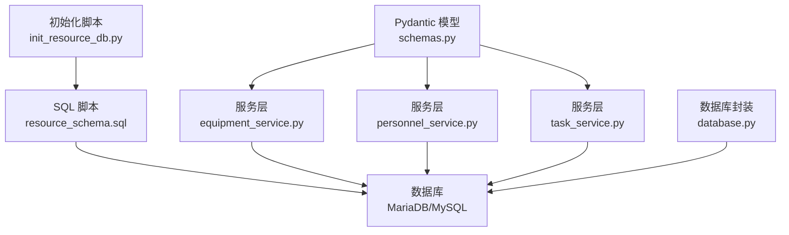
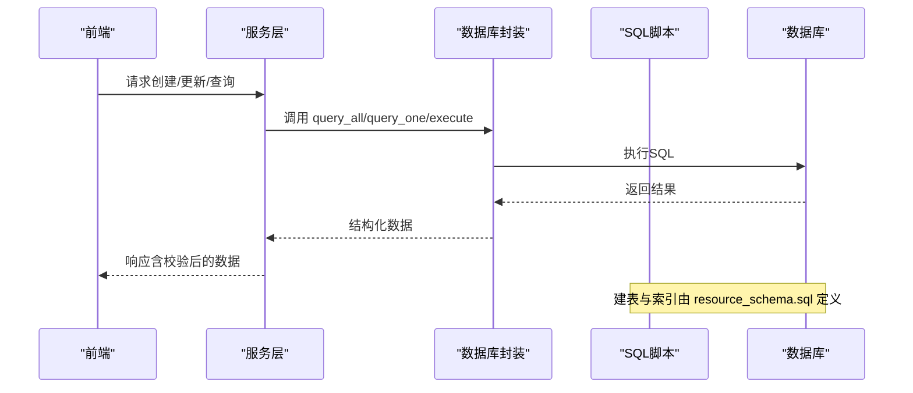
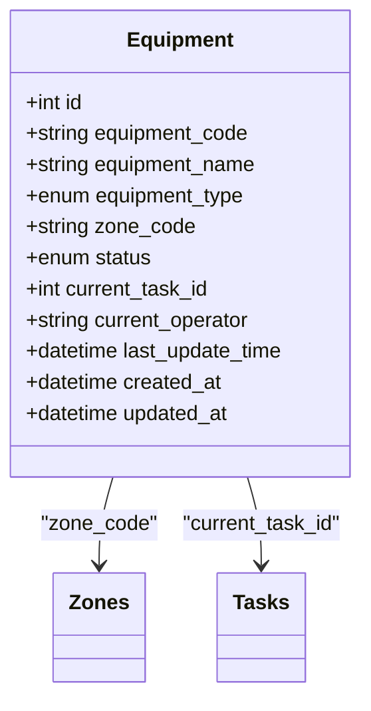
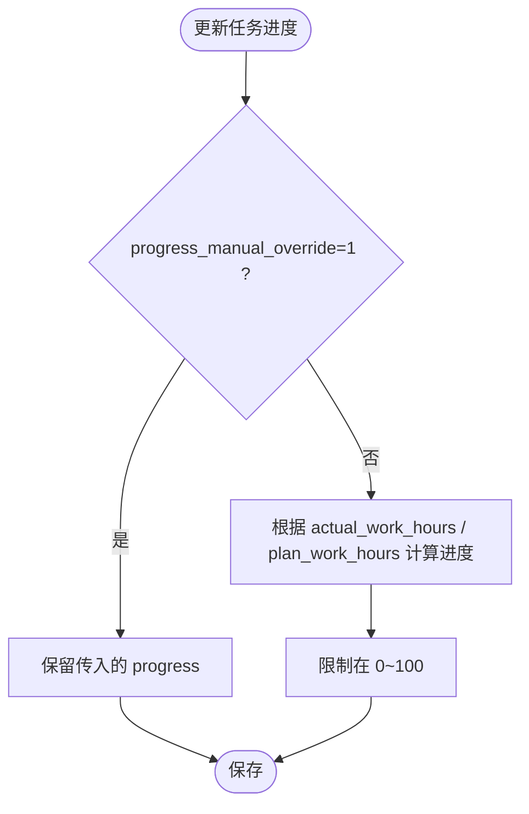
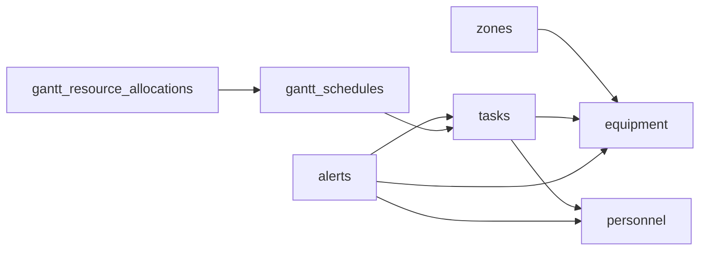

# 核心表结构

<cite>
**本文引用的文件**
- [resource_schema.sql](file://backend/sql/resource_schema.sql)
- [equipment_service.py](file://backend/modules/resource/services/equipment_service.py)
- [personnel_service.py](file://backend/modules/resource/services/personnel_service.py)
- [task_service.py](file://backend/modules/resource/services/task_service.py)
- [schemas.py](file://backend/modules/resource/schemas.py)
- [database.py](file://backend/database.py)
- [init_resource_db.py](file://backend/sql/init_resource_db.py)
</cite>

## 目录
1. [简介](#简介)
2. [项目结构](#项目结构)
3. [核心组件](#核心组件)
4. [架构总览](#架构总览)
5. [详细组件分析](#详细组件分析)
6. [依赖关系分析](#依赖关系分析)
7. [性能考虑](#性能考虑)
8. [故障排查指南](#故障排查指南)
9. [结论](#结论)
10. [附录：建表语句与字段注释](#附录建表语句与字段注释)

## 简介
本文件聚焦于“试制资源数智化管理系统”的核心数据模型，围绕设备台账、车间区域、人员、任务等基础业务表进行系统化说明。文档涵盖字段定义、数据类型选择、约束条件、枚举含义、时间字段策略、默认值设置、数据验证规则与业务约束，并提供完整的建表语句与字段注释路径，帮助读者快速理解并正确维护数据库结构。

## 项目结构
- 数据库脚本位于 backend/sql/resource_schema.sql，集中定义了所有核心表结构与索引。
- 服务层位于 backend/modules/resource/services/，实现各实体的CRUD、状态流转、统计与看板数据。
- Pydantic 数据模型位于 backend/modules/resource/schemas.py，用于接口输入输出校验与类型提示。
- 数据库连接与执行封装在 backend/database.py，提供连接池与统一查询方法。
- 初始化入口在 backend/sql/init_resource_db.py，负责执行建表与初始化数据脚本。

图表来源
- [resource_schema.sql:1-326](file://backend/sql/resource_schema.sql#L1-L326)
- [equipment_service.py:1-495](file://backend/modules/resource/services/equipment_service.py#L1-L495)
- [personnel_service.py:1-475](file://backend/modules/resource/services/personnel_service.py#L1-L475)
- [task_service.py:1-432](file://backend/modules/resource/services/task_service.py#L1-L432)
- [schemas.py:1-224](file://backend/modules/resource/schemas.py#L1-L224)
- [database.py:1-116](file://backend/database.py#L1-L116)
- [init_resource_db.py:1-72](file://backend/sql/init_resource_db.py#L1-L72)

章节来源
- [resource_schema.sql:1-326](file://backend/sql/resource_schema.sql#L1-L326)
- [init_resource_db.py:1-72](file://backend/sql/init_resource_db.py#L1-L72)

## 核心组件
- 设备台账（equipment）：记录设备编号、名称、类型、所属区域、当前状态、占用任务与操作员等。
- 车间区域（zones）：定义区域编码、名称、类型及地图网格信息。
- 人员（personnel）：记录工号、姓名、部门、状态、当前位置、当前任务、上班时间等。
- 任务（tasks）：记录任务编号、名称、类型、优先级、计划与实际工时、进度、装配场地、关联设备与人员等。
- 预警（alerts）：异常事件记录，含级别、SLA、处理流程与影响评估。
- 设备维护（equipment_maintenance）：设备维护记录，支持例行、维修、巡检。
- 甘特排程（gantt_schedules）：排程计划，包含阶段、约束、关键路径、冲突标记等。
- 甘特资源分配（gantt_resource_allocations）：对排程的资源占用明细。
- 甘特冲突（gantt_conflicts）：检测到的资源或时间冲突记录。

章节来源
- [resource_schema.sql:11-326](file://backend/sql/resource_schema.sql#L11-L326)

## 架构总览
系统通过服务层调用数据库封装函数，执行SQL完成数据的增删改查；Pydantic 模型在前端与服务层之间做参数校验；SQL脚本集中管理表结构，便于版本化与初始化。

图表来源
- [database.py:51-116](file://backend/database.py#L51-L116)
- [resource_schema.sql:1-326](file://backend/sql/resource_schema.sql#L1-L326)

## 详细组件分析

### 设备台账表 equipment
- 主键：id（自增）
- 唯一键：equipment_code（设备编号）
- 关键字段：
  - equipment_name：设备名称
  - equipment_type：设备类型（举升机/试制岛/工位）
  - zone_code：所属区域编码（外键语义指向 zones.zone_code）
  - status：设备状态（空闲/占用/故障/维护），默认 idle
  - current_task_id：当前占用任务ID（可空）
  - current_operator：当前操作员姓名（可空）
  - last_update_time：最后更新时间（自动更新）
  - created_at/updated_at：创建与更新时间（默认当前时间）
- 索引：status、zone_code、equipment_type
- 业务含义：
  - 设备状态驱动资源占用与看板展示；
  - current_task_id 与 tasks.id 形成逻辑关联，体现设备被哪个任务占用；
  - current_operator 记录当前操作者，便于追溯。

图表来源
- [resource_schema.sql:11-28](file://backend/sql/resource_schema.sql#L11-L28)

章节来源
- [resource_schema.sql:11-28](file://backend/sql/resource_schema.sql#L11-L28)
- [equipment_service.py:11-137](file://backend/modules/resource/services/equipment_service.py#L11-L137)
- [equipment_service.py:140-301](file://backend/modules/resource/services/equipment_service.py#L140-L301)

### 车间区域表 zones
- 主键：id（自增）
- 唯一键：zone_code（区域编码）
- 关键字段：
  - zone_name：区域名称
  - zone_type：区域类型（装配/试制岛/原型/外部）
  - position_x/position_y：地图坐标（可空）
  - grid_columns/grid_rows：网格行列数（默认1）
  - created_at/updated_at：时间戳
- 索引：zone_type
- 业务含义：
  - 作为设备与任务的地理/组织归属维度；
  - 为地图可视化与资源分布提供基础。

章节来源
- [resource_schema.sql:30-45](file://backend/sql/resource_schema.sql#L30-L45)

### 人员表 personnel
- 主键：id（自增）
- 唯一键：personnel_code（工号）
- 关键字段：
  - name：姓名
  - avatar_text：头像文字（姓氏，可空）
  - department：人力来源/部门（可空）
  - status：状态（工作中/空闲/离线），默认 offline
  - current_zone：当前所在区域（可空）
  - current_task_id：当前任务ID（可空）
  - entry_time：上班时间（可空）
  - last_update_time：最后更新时间（自动更新）
  - created_at/updated_at：时间戳
- 索引：status、current_zone、department
- 业务含义：
  - 人员状态与位置用于看板与调度；
  - current_task_id 与 tasks.id 关联，体现人员参与的任务。

章节来源
- [resource_schema.sql:47-66](file://backend/sql/resource_schema.sql#L47-L66)
- [personnel_service.py:24-124](file://backend/modules/resource/services/personnel_service.py#L24-L124)
- [personnel_service.py:170-260](file://backend/modules/resource/services/personnel_service.py#L170-L260)

### 任务表 tasks
- 主键：id（自增）
- 唯一键：task_code（任务编号）
- 关键字段：
  - task_name：任务名称
  - task_type：任务类型（A/B/C/零星试制）
  - trial_type：试制类别（骡子车/ET0/ET/软模车/FT0 等）
  - project_group/project_code：项目群与项目编号
  - vehicle_code/vehicle_model：车号与车型
  - priority：优先级（高/中/低），默认 medium
  - status：状态（待开始/进行中/已完成/逾期），默认 pending
  - zone_code/assembl y_site：区域与装配场地
  - lift_count：占用举升机数量
  - equipment_code：占用设备编号
  - planner/pm_name/cve_name/trial_supervisor/process_supervisor/assembly_supervisor：负责人与主管
  - plan_start_time/plan_end_time：计划起止时间
  - plan_work_hours/actual_work_hours：计划与实际工时
  - progress：进度百分比（自动=实际/计划×100，可手动覆盖）
  - progress_manual_override：是否手动覆盖进度（0自动/1手动）
  - summer_target_count/summer_target_date：夏标车目标与交付日期
  - source：数据来源（运营表/手工/MES），默认 manual
  - created_at/updated_at：时间戳
- 索引：task_type、status、priority、project_code、equipment_code
- 业务含义：
  - 任务为核心业务实体，关联设备、区域、人员与项目；
  - 进度计算支持自动与手动两种模式；
  - 多角色协同字段支撑跨部门协作。

图表来源
- [task_service.py:21-45](file://backend/modules/resource/services/task_service.py#L21-L45)

章节来源
- [resource_schema.sql:68-109](file://backend/sql/resource_schema.sql#L68-L109)
- [task_service.py:48-146](file://backend/modules/resource/services/task_service.py#L48-L146)
- [task_service.py:177-277](file://backend/modules/resource/services/task_service.py#L177-L277)

### 预警表 alerts
- 主键：id（自增）
- 唯一键：alert_code（预警编号）
- 关键字段：
  - alert_type：预警类型（进度滞后/质量缺陷/设备故障/物料缺件/人员缺口/安全隐患/计划超期/工艺违规/外部协调/其他）
  - level：级别（严重/高/中/低），默认 medium
  - title/description：标题与描述
  - source：来源（系统自动/人工上报/设备报警/运营巡检/质量巡检/其他），默认 system_auto
  - related_type/related_id/related_name：关联对象类型、ID与名称（冗余便于展示）
  - related_equipment/related_task/related_personnel：兼容字段
  - zone_code/assembly_site：发生区域与装配场地
  - raised_by/raised_at：发现人与触发时间
  - sla_hours：响应SLA（小时）
  - escalated/escalated_to：升级标记与对象
  - status：处理状态（待处理/处理中/已解决/已关闭/已超期）
  - handler/handler_department：责任人与部门
  - processing_started_at/resolved_at/closed_at：处理时间线
  - processing_scheme/corrective_action/preventive_measure/result_verification：处置与改善措施
  - loss_amount/impact_hours：损失金额与影响工时
  - attachment_count：附件数量
  - remark：备注
  - created_at/updated_at：时间戳
- 索引：alert_type、level、status、raised_at、related_type+related_id、zone_code、related_equipment、handler
- 业务含义：
  - 全量异常事件追踪，支持SLA与升级机制；
  - 多维度关联与冗余字段提升查询与展示效率。

章节来源
- [resource_schema.sql:111-163](file://backend/sql/resource_schema.sql#L111-L163)

### 设备维护记录表 equipment_maintenance
- 主键：id（自增）
- 关键字段：
  - equipment_code：设备编号
  - maintenance_type：维护类型（例行/维修/巡检）
  - start_time/end_time：维护起止时间
  - operator：维护人员
  - description：维护描述
  - status：状态（进行中/已完成/已取消），默认 in_progress
- 索引：equipment_code、maintenance_type、status
- 业务含义：
  - 记录设备维护历史，支持状态跟踪与统计。

章节来源
- [resource_schema.sql:183-199](file://backend/sql/resource_schema.sql#L183-L199)
- [equipment_service.py:338-495](file://backend/modules/resource/services/equipment_service.py#L338-L495)

### 甘特排程计划表 gantt_schedules
- 主键：id（自增）
- 唯一键：schedule_code（排程编号）
- 关键字段：
  - task_id/task_code/task_name：关联任务与名称
  - task_type/trial_type/project_group/project_code/vehicle_code/vehicle_model：任务与项目信息
  - phase：阶段（装配/下线/调试/夏标验证/整改/终检/交付）
  - priority/status：优先级与状态
  - color_tag：自定义颜色标签
  - assembly_site/zone_code：装配场地与区域
  - lift_count/equipment_code：占用资源
  - planner/pm_name/cve_name/trial_supervisor：负责人与主管
  - plan_start_time/plan_end_time/actual_start_time/actual_end_time：计划与实际时间
  - plan_work_hours/actual_work_hours/progress：工时与进度
  - progress_manual_override：手动覆盖进度标记
  - parent_id/sort_order：层级与排序
  - constraint_type/constraint_date：约束类型与日期
  - predecessor_ids：前置依赖
  - is_critical/slack_hours：关键路径与浮动时差
  - has_conflict/conflict_count：冲突标记与次数
  - remark/created_by/created_at/updated_at：备注与审计字段
- 索引：task_id+task_code、task_type、status、priority、assembly_site、is_critical、has_conflict、plan_start_time、plan_end_time、parent_id
- 业务含义：
  - 支持复杂排程、依赖与约束、冲突检测与关键路径分析。

章节来源
- [resource_schema.sql:201-259](file://backend/sql/resource_schema.sql#L201-L259)

### 甘特资源分配表 gantt_resource_allocations
- 主键：id（自增）
- 唯一键：allocation_code（分配编号）
- 关键字段：
  - schedule_id/schedule_code：关联排程
  - resource_type/resource_code/resource_name：资源类型、编码与名称
  - start_time/end_time：占用时间
  - hours_allocated/quantity：分配工时与数量
  - priority/status：优先级与状态
  - remark/created_at/updated_at：备注与时间戳
- 索引：schedule_id+schedule_code、resource_type+resource_code、status、start_time、end_time
- 业务含义：
  - 细化排程对资源的占用，支持资源冲突检测。

章节来源
- [resource_schema.sql:261-286](file://backend/sql/resource_schema.sql#L261-L286)

### 甘特资源冲突表 gantt_conflicts
- 主键：id（自增）
- 唯一键：conflict_code（冲突编号）
- 关键字段：
  - conflict_type/severity：冲突类型与严重级别
  - schedule_a/b：关联排程A与B
  - resource_type/resource_code/resource_name：冲突资源
  - overlap_start/overlap_end/overlap_hours：重叠时间与时长
  - suggestion/status/resolution/resolved_by/resolved_at：建议、状态与解决信息
  - detected_at/assembly_site/created_at/updated_at：检测时间与审计字段
- 索引：conflict_type、severity、status、schedule_a_id、schedule_b_id、resource_type+resource_code、assembly_site、detected_at
- 业务含义：
  - 记录并跟踪资源冲突，辅助排程优化。

章节来源
- [resource_schema.sql:288-325](file://backend/sql/resource_schema.sql#L288-L325)

## 依赖关系分析
- 设备与区域：equipment.zone_code 引用 zones.zone_code（逻辑外键）。
- 设备与任务：equipment.current_task_id 引用 tasks.id（逻辑外键）。
- 人员与任务：personnel.current_task_id 引用 tasks.id（逻辑外键）。
- 任务与区域/设备：tasks.zone_code 引用 zones.zone_code；tasks.equipment_code 引用 equipment.equipment_code（逻辑外键）。
- 甘特排程与任务：gantt_schedules.task_id 引用 tasks.id（逻辑外键）。
- 甘特资源分配与排程：gantt_resource_allocations.schedule_id 引用 gantt_schedules.id（逻辑外键）。
- 预警与多实体：alerts.related_type/related_id 泛化关联任务、设备、人员、物料、项目、车间等。

图表来源
- [resource_schema.sql:11-326](file://backend/sql/resource_schema.sql#L11-L326)

章节来源
- [resource_schema.sql:11-326](file://backend/sql/resource_schema.sql#L11-L326)

## 性能考虑
- 索引设计：
  - 高频筛选字段均建立索引（如 status、task_type、priority、zone_code、equipment_code、raised_at 等）。
  - 复合索引用于常见查询组合（如 alerts.related_type+related_id）。
- 时间字段：
  - created_at/updated_at 使用 CURRENT_TIMESTAMP 与 ON UPDATE 自动维护，减少应用层负担。
  - last_update_time 用于特定实体的最后变更时间，便于缓存失效与增量同步。
- 数值精度：
  - 工时与进度使用 DECIMAL(8,2)/DECIMAL(5,2)，避免浮点误差。
- 分页与搜索：
  - 服务层采用 LIMIT/OFFSET 分页，结合 WHERE 条件与 LIKE 模糊搜索，注意大表场景下的性能优化。
- 连接池：
  - database.py 使用 PooledDB，配置 maxconnections/mincached/maxcached，提高并发能力与稳定性。

章节来源
- [resource_schema.sql:11-326](file://backend/sql/resource_schema.sql#L11-L326)
- [database.py:12-43](file://backend/database.py#L12-L43)
- [task_service.py:48-146](file://backend/modules/resource/services/task_service.py#L48-L146)

## 故障排查指南
- 数据库连接失败：
  - 检查 backend/.env 中的 DB_HOST/DB_PORT/DB_USER/DB_PASSWORD/DB_DATABASE 配置是否正确。
  - 若缺少 .env 文件，请先复制 backend/.env.example 并填写。
- 建表失败：
  - 确认 MariaDB/MySQL 版本兼容（10.11+），字符集 utf8mb4。
  - 使用 init_resource_db.py 执行 resource_schema.sql 与 resource_init_data.sql。
- 枚举值错误：
  - 服务层对状态、类型等进行严格校验，如设备状态、任务类型、优先级、来源等，确保只允许合法值。
- 进度计算异常：
  - 当 progress_manual_override=0 时，进度按 actual_work_hours/plan_work_hours 自动计算；若 plan_work_hours=0 或为空，则保持原值或置0。

章节来源
- [database.py:12-43](file://backend/database.py#L12-L43)
- [init_resource_db.py:47-72](file://backend/sql/init_resource_db.py#L47-L72)
- [equipment_service.py:262-301](file://backend/modules/resource/services/equipment_service.py#L262-L301)
- [task_service.py:21-45](file://backend/modules/resource/services/task_service.py#L21-L45)

## 结论
本系统的核心表结构以设备、区域、人员、任务为中心，辅以预警、维护与甘特排程相关表，形成完整的资源管理与调度闭环。通过严格的枚举约束、时间字段自动化、合理的索引设计与服务层校验，保障了数据一致性与查询性能。建议在后续迭代中持续优化大表查询、完善外键约束与审计日志，进一步提升系统的可维护性与扩展性。

## 附录：建表语句与字段注释
以下为完整建表语句与字段注释的路径引用，便于查阅与维护：

- 设备台账表 equipment
  - 建表语句与注释：[resource_schema.sql:11-28](file://backend/sql/resource_schema.sql#L11-L28)
  - 服务层校验与状态更新：[equipment_service.py:262-301](file://backend/modules/resource/services/equipment_service.py#L262-L301)

- 车间区域表 zones
  - 建表语句与注释：[resource_schema.sql:30-45](file://backend/sql/resource_schema.sql#L30-L45)

- 人员表 personnel
  - 建表语句与注释：[resource_schema.sql:47-66](file://backend/sql/resource_schema.sql#L47-L66)
  - 服务层列表与详情：[personnel_service.py:24-124](file://backend/modules/resource/services/personnel_service.py#L24-L124)

- 任务表 tasks
  - 建表语句与注释：[resource_schema.sql:68-109](file://backend/sql/resource_schema.sql#L68-L109)
  - 服务层列表与创建更新：[task_service.py:48-146](file://backend/modules/resource/services/task_service.py#L48-L146)
  - 进度计算逻辑：[task_service.py:21-45](file://backend/modules/resource/services/task_service.py#L21-L45)

- 预警表 alerts
  - 建表语句与注释：[resource_schema.sql:111-163](file://backend/sql/resource_schema.sql#L111-L163)

- 设备维护记录表 equipment_maintenance
  - 建表语句与注释：[resource_schema.sql:183-199](file://backend/sql/resource_schema.sql#L183-L199)
  - 服务层维护记录管理：[equipment_service.py:338-495](file://backend/modules/resource/services/equipment_service.py#L338-L495)

- 甘特排程计划表 gantt_schedules
  - 建表语句与注释：[resource_schema.sql:201-259](file://backend/sql/resource_schema.sql#L201-L259)

- 甘特资源分配表 gantt_resource_allocations
  - 建表语句与注释：[resource_schema.sql:261-286](file://backend/sql/resource_schema.sql#L261-L286)

- 甘特资源冲突表 gantt_conflicts
  - 建表语句与注释：[resource_schema.sql:288-325](file://backend/sql/resource_schema.sql#L288-L325)

- 初始化脚本
  - 执行建表与初始化数据：[init_resource_db.py:47-72](file://backend/sql/init_resource_db.py#L47-L72)

- 数据库封装
  - 连接池与查询方法：[database.py:12-116](file://backend/database.py#L12-L116)

- Pydantic 数据模型（接口校验）
  - 设备/区域/人员/任务/预警模型：[schemas.py:12-224](file://backend/modules/resource/schemas.py#L12-L224)