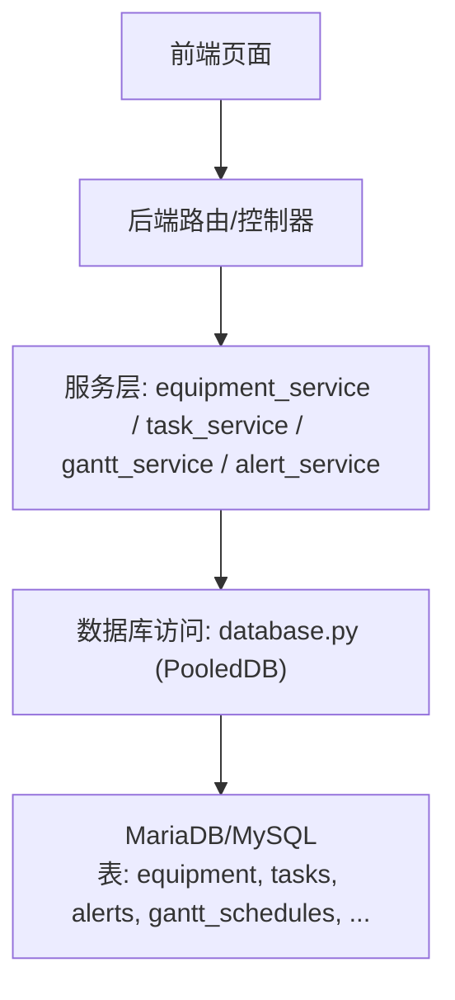
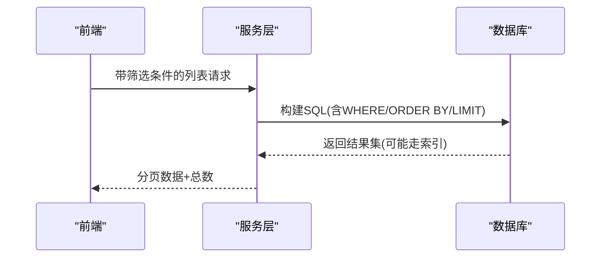
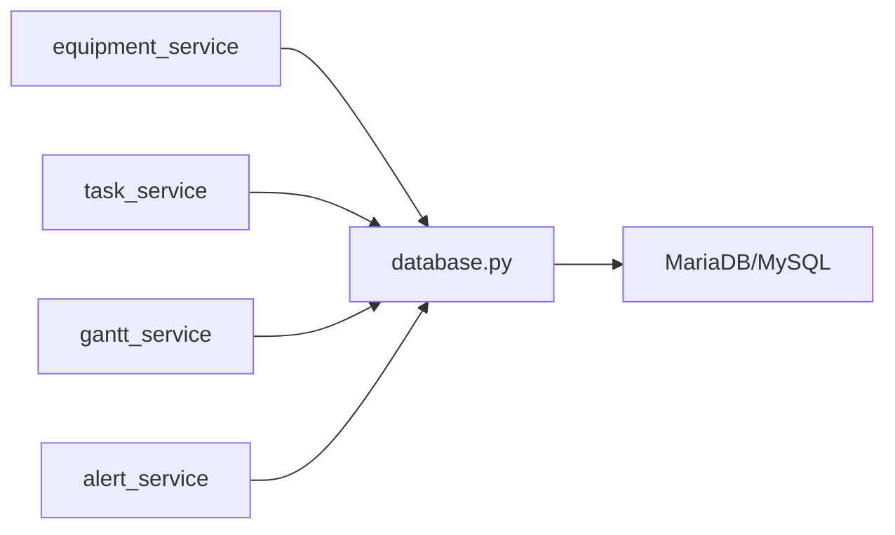

# 索引优化策略

<cite>
**本文引用的文件**
- [resource_schema.sql](file://backend/sql/resource_schema.sql)
- [database.py](file://backend/database.py)
- [equipment_service.py](file://backend/modules/resource/services/equipment_service.py)
- [task_service.py](file://backend/modules/resource/services/task_service.py)
- [gantt_service.py](file://backend/modules/resource/services/gantt_service.py)
- [alert_service.py](file://backend/modules/resource/services/alert_service.py)
</cite>

## 目录
1. [引言](#引言)
2. [项目结构](#项目结构)
3. [核心组件](#核心组件)
4. [架构总览](#架构总览)
5. [详细组件分析](#详细组件分析)
6. [依赖关系分析](#依赖关系分析)
7. [性能考量](#性能考量)
8. [故障排查指南](#故障排查指南)
9. [结论](#结论)
10. [附录](#附录)

## 引言
本文件面向“试制资源数智化管理系统”的数据库索引优化，目标是：
- 为每个表设计并说明单列索引、复合索引、唯一索引的使用场景与依据
- 聚焦查询热点：按状态筛选、按时间范围查询、按区域/设备检索、按优先级/类型/场地等常见模式
- 给出索引选择原则、对读写性能的影响、使用建议与查询优化技巧
- 提供索引维护策略与性能监控方法
- 针对大数据量场景提出扩展优化方案

## 项目结构
系统后端采用 Python + PyMySQL + 连接池访问 MariaDB/MySQL。数据模型集中在 SQL 脚本中定义，服务层通过动态 SQL 进行分页、筛选与统计。关键路径包括：
- 设备台账与状态统计
- 任务管理与多维筛选
- 甘特排程与冲突检测
- 异常预警与 SLA 超期计算

图表来源
- [database.py:1-116](file://backend/database.py#L1-L116)
- [equipment_service.py:11-103](file://backend/modules/resource/services/equipment_service.py#L11-L103)
- [task_service.py:48-146](file://backend/modules/resource/services/task_service.py#L48-L146)
- [gantt_service.py:176-258](file://backend/modules/resource/services/gantt_service.py#L176-L258)
- [alert_service.py:47-140](file://backend/modules/resource/services/alert_service.py#L47-L140)

章节来源
- [database.py:1-116](file://backend/database.py#L1-L116)
- [resource_schema.sql:1-326](file://backend/sql/resource_schema.sql#L1-L326)

## 核心组件
- 设备服务：支持按状态、区域、类型、关键词筛选与分页；统计按状态分组
- 任务服务：支持按类型、试验类别、状态、优先级、区域/场地、关键词筛选与分页；统计包含工时与进度聚合
- 甘特服务：支持按类型、状态、优先级、场地、关键字、时间范围筛选；统计含周趋势、阶段分布；冲突检测依赖时间与资源分配
- 预警服务：支持按类型、级别、状态、来源、区域/场地、处理人、时间范围筛选；SLA 超期软计算；统计含近7天趋势

章节来源
- [equipment_service.py:11-103](file://backend/modules/resource/services/equipment_service.py#L11-L103)
- [task_service.py:48-146](file://backend/modules/resource/services/task_service.py#L48-L146)
- [gantt_service.py:176-258](file://backend/modules/resource/services/gantt_service.py#L176-L258)
- [alert_service.py:47-140](file://backend/modules/resource/services/alert_service.py#L47-L140)

## 架构总览
从查询到索引利用的关键链路：
- 前端发起筛选请求（状态、时间、区域、设备等）
- 服务层拼接 WHERE 条件与 ORDER BY/LIMIT
- 数据库执行计划受索引影响，命中索引可显著降低扫描行数
- 统计类查询（GROUP BY、COUNT、SUM、AVG）同样受益于合适索引

图表来源
- [equipment_service.py:33-87](file://backend/modules/resource/services/equipment_service.py#L33-L87)
- [task_service.py:62-127](file://backend/modules/resource/services/task_service.py#L62-L127)
- [gantt_service.py:190-239](file://backend/modules/resource/services/gantt_service.py#L190-L239)
- [alert_service.py:63-123](file://backend/modules/resource/services/alert_service.py#L63-L123)

## 详细组件分析

### 设备表 equipment
- 现有索引
  - 单列：status、zone_code、equipment_type
  - 唯一：equipment_code
- 典型查询
  - 按状态筛选：SELECT ... WHERE status = ?
  - 按区域筛选：SELECT ... WHERE zone_code = ?
  - 组合筛选：status + zone_code、status + type
  - 统计：GROUP BY status
- 索引建议
  - 复合索引 idx_eq_status_zone(status, zone_code)：覆盖高频“状态+区域”筛选
  - 复合索引 idx_eq_status_type(status, equipment_type)：覆盖“状态+类型”筛选
  - 复合索引 idx_eq_zone_type(zone_code, equipment_type)：覆盖“区域+类型”筛选
  - 若频繁按 last_update_time 排序或范围过滤，考虑添加 idx_eq_last_update(last_update_time)
- 性能影响
  - 复合索引可减少回表次数，提升筛选与排序效率
  - 过多索引会增加写入开销，需权衡读多写少场景

章节来源
- [resource_schema.sql:13-28](file://backend/sql/resource_schema.sql#L13-L28)
- [equipment_service.py:33-87](file://backend/modules/resource/services/equipment_service.py#L33-L87)
- [equipment_service.py:304-335](file://backend/modules/resource/services/equipment_service.py#L304-L335)

### 区域表 zones
- 现有索引
  - 唯一：zone_code
  - 单列：zone_type
- 典型查询
  - 按类型筛选：WHERE zone_type = ?
  - 关联查询：JOIN ON zone_code
- 索引建议
  - 当前已满足常见需求；如需按名称模糊搜索，可考虑全文索引或应用层缓存

章节来源
- [resource_schema.sql:33-45](file://backend/sql/resource_schema.sql#L33-L45)

### 人员表 personnel
- 现有索引
  - 单列：status、current_zone、department
  - 唯一：personnel_code
- 典型查询
  - 按状态/部门/区域筛选
  - 统计：GROUP BY status/department
- 索引建议
  - 复合索引 idx_per_status_dept(status, department)：覆盖“状态+部门”筛选
  - 复合索引 idx_per_status_zone(status, current_zone)：覆盖“状态+区域”筛选

章节来源
- [resource_schema.sql:50-66](file://backend/sql/resource_schema.sql#L50-L66)

### 任务表 tasks
- 现有索引
  - 单列：task_type、status、priority、project_code、equipment_code
  - 唯一：task_code
- 典型查询
  - 按状态/优先级/类型/项目/设备筛选
  - 按区域/场地筛选：zone_code 或 assembly_site
  - 关键词搜索：多个字段 LIKE
  - 统计：GROUP BY status/priority/type；汇总 plan_work_hours/actual_work_hours/progress
- 索引建议
  - 复合索引 idx_task_status_priority(status, priority)：高优待办/进行中优先展示
  - 复合索引 idx_task_project_status(project_code, status)：项目维度看板
  - 复合索引 idx_task_equipment_status(equipment_code, status)：设备占用任务快速定位
  - 复合索引 idx_task_assembly_site(assembly_site, status)：装配场地维度的任务筛选
  - 若频繁按 created_at 排序，可考虑 idx_task_created(created_at)
- 性能影响
  - 复合索引能同时满足多条件筛选与排序，减少临时表与 filesort

章节来源
- [resource_schema.sql:71-109](file://backend/sql/resource_schema.sql#L71-L109)
- [task_service.py:62-127](file://backend/modules/resource/services/task_service.py#L62-L127)
- [task_service.py:290-332](file://backend/modules/resource/services/task_service.py#L290-L332)

### 异常预警表 alerts
- 现有索引
  - 单列：alert_type、level、status、raised_at、handler
  - 复合：related_type, related_id
  - 单列：zone_code、related_equipment
  - 唯一：alert_code
- 典型查询
  - 按类型/级别/状态/来源/区域/场地/处理人筛选
  - 时间范围：raised_at BETWEEN ? AND ?
  - 关键词：alert_code/title/description/related_id/related_name/handler
  - 统计：GROUP BY level/status/type；近7天趋势；SLA 超期计数
- 索引建议
  - 复合索引 idx_alert_level_status(level, status)：高优未处理优先
  - 复合索引 idx_alert_raised_status(raised_at, status)：时间范围+状态筛选
  - 复合索引 idx_alert_handler_status(handler, status)：处理人工作区
  - 复合索引 idx_alert_zone_status(zone_code, status)：区域维度看板
  - 复合索引 idx_alert_related_type_id(related_type, related_id)：对象维度追踪
- 性能影响
  - raised_at 范围查询配合 status 复合索引可避免全表扫描
  - 关键词 LIKE 前缀匹配可利用索引，但前后模糊仍会退化为扫描

章节来源
- [resource_schema.sql:114-163](file://backend/sql/resource_schema.sql#L114-L163)
- [alert_service.py:63-123](file://backend/modules/resource/services/alert_service.py#L63-L123)
- [alert_service.py:337-399](file://backend/modules/resource/services/alert_service.py#L337-L399)

### 人员效率统计表 personnel_efficiency
- 现有索引
  - 唯一：personnel_code, stat_date
  - 单列：personnel_code、stat_date
- 典型查询
  - 按人员/日期范围统计工时、任务数、设备使用率
- 索引建议
  - 复合索引 idx_eff_personnel_date(personnel_code, stat_date)：覆盖“人员+日期”范围查询
  - 复合索引 idx_eff_date_stat(stat_date, personnel_code)：日期维度汇总

章节来源
- [resource_schema.sql:168-181](file://backend/sql/resource_schema.sql#L168-L181)

### 设备维护记录表 equipment_maintenance
- 现有索引
  - 单列：equipment_code、maintenance_type、status
- 典型查询
  - 按设备/类型/状态筛选与维护历史
- 索引建议
  - 复合索引 idx_maint_equipment_status(equipment_code, status)：设备维护状态快速筛选
  - 复合索引 idx_maint_type_status(maintenance_type, status)：维护类型统计

章节来源
- [resource_schema.sql:186-199](file://backend/sql/resource_schema.sql#L186-L199)
- [equipment_service.py:338-393](file://backend/modules/resource/services/equipment_service.py#L338-L393)

### 甘特排程计划表 gantt_schedules
- 现有索引
  - 复合：task_id, task_code
  - 单列：task_type、status、priority、assembly_site、is_critical、has_conflict、plan_start_time、plan_end_time、parent_id
  - 唯一：schedule_code
- 典型查询
  - 按类型/状态/优先级/场地/关键字/时间范围筛选
  - 统计：周新增/结束、阶段分布、站点分布
  - 排序：sort_order, plan_start_time, id
- 索引建议
  - 复合索引 idx_sch_status_priority(status, priority)：看板常用
  - 复合索引 idx_sch_site_status(assembly_site, status)：场地维度看板
  - 复合索引 idx_sch_time_range(plan_start_time, plan_end_time)：时间窗口查询
  - 复合索引 idx_sch_critical_status(is_critical, status)：关键路径任务筛选
  - 复合索引 idx_sch_parent_sort(parent_id, sort_order)：层级展开排序
- 性能影响
  - 时间范围查询命中 start/end 复合索引可大幅减少扫描
  - 排序字段与索引顺序一致可避免 filesort

章节来源
- [resource_schema.sql:204-259](file://backend/sql/resource_schema.sql#L204-L259)
- [gantt_service.py:190-239](file://backend/modules/resource/services/gantt_service.py#L190-L239)
- [gantt_service.py:269-332](file://backend/modules/resource/services/gantt_service.py#L269-L332)

### 甘特资源分配表 gantt_resource_allocations
- 现有索引
  - 复合：schedule_id, schedule_code
  - 复合：resource_type, resource_code
  - 单列：status、start_time、end_time
- 典型查询
  - 按排程/资源类型/编码/状态筛选
  - 时间范围：start_time/end_time 重叠检测
- 索引建议
  - 复合索引 idx_alloc_resource_status(resource_type, resource_code, status)：资源占用状态查询
  - 复合索引 idx_alloc_time_range(start_time, end_time)：时间重叠检测
  - 复合索引 idx_alloc_schedule_status(schedule_id, status)：排程资源视图

章节来源
- [resource_schema.sql:264-286](file://backend/sql/resource_schema.sql#L264-L286)
- [gantt_service.py:608-645](file://backend/modules/resource/services/gantt_service.py#L608-L645)

### 甘特资源冲突表 gantt_conflicts
- 现有索引
  - 单列：conflict_type、severity、status、detected_at
  - 复合：schedule_a_id、schedule_b_id、resource_type, resource_code、assembly_site
- 典型查询
  - 按类型/严重级别/状态/检测时间筛选
  - 按排程A/B、资源、场地筛选
- 索引建议
  - 复合索引 idx_cfl_severity_status(severity, status)：高优冲突优先处理
  - 复合索引 idx_cfl_detected_status(detected_at, status)：新冲突列表
  - 复合索引 idx_cfl_ab_status(schedule_a_id, schedule_b_id, status)：排程冲突详情

章节来源
- [resource_schema.sql:291-325](file://backend/sql/resource_schema.sql#L291-L325)

## 依赖关系分析
- 服务层依赖数据库访问模块获取连接与执行 SQL
- 各服务层根据业务筛选条件动态构建 WHERE/ORDER BY/LIMIT
- 索引命中情况直接影响执行计划与响应时间

图表来源
- [database.py:1-116](file://backend/database.py#L1-L116)
- [equipment_service.py:11-103](file://backend/modules/resource/services/equipment_service.py#L11-L103)
- [task_service.py:48-146](file://backend/modules/resource/services/task_service.py#L48-L146)
- [gantt_service.py:176-258](file://backend/modules/resource/services/gantt_service.py#L176-L258)
- [alert_service.py:47-140](file://backend/modules/resource/services/alert_service.py#L47-L140)

章节来源
- [database.py:1-116](file://backend/database.py#L1-L116)

## 性能考量
- 查询热点与索引匹配
  - 按状态筛选：为 status 建立单列或复合索引（如 status+priority、status+zone_code）
  - 按时间范围查询：为 plan_start_time/plan_end_time/raised_at 建立范围索引或复合索引
  - 按区域/设备检索：为 zone_code/equipment_code 建立单列或复合索引
- 排序与分页
  - ORDER BY 字段与索引顺序一致可避免 filesort
  - LIMIT/OFFSET 在大偏移时性能下降，建议结合游标或基于上次 ID 的分页
- 统计查询
  - GROUP BY 字段建立索引可加速聚合
  - COUNT/SUM/AVG 在合适索引下更高效
- 写入代价
  - 每增加一个索引都会增加 INSERT/UPDATE/DELETE 的开销
  - 建议在读多写少的报表/看板场景优先优化索引

[本节为通用指导，不直接分析具体文件]

## 故障排查指南
- 连接池与配置
  - 连接池初始化失败会抛出明确错误，检查 .env 中的 DB_HOST/PORT/USER/PASSWORD/DATABASE
- 慢查询定位
  - 使用 EXPLAIN 分析关键查询的执行计划，确认是否命中预期索引
  - 关注 LIKE '%...%' 导致的索引失效
- 常见问题
  - 大偏移分页导致性能退化：改用基于 ID 的分页或限制 page_size
  - 多条件筛选未命中复合索引：调整索引列顺序以匹配 WHERE 最左前缀
  - 时间范围查询未命中索引：确保对时间字段有索引且查询条件为范围而非函数包裹

章节来源
- [database.py:12-43](file://backend/database.py#L12-L43)

## 结论
- 当前 schema 已为多数热点查询提供了基础索引，但在复合筛选与时间范围方面仍有优化空间
- 建议优先为高频组合条件创建复合索引，并保证 ORDER BY 与索引顺序一致
- 对统计与看板类查询，应围绕 GROUP BY 与时间范围建立针对性索引
- 在大数据量场景下，结合分区、归档、物化视图与缓存策略进一步提升性能

[本节为总结性内容，不直接分析具体文件]

## 附录

### 索引使用建议清单
- 单列索引
  - 用于等值筛选或排序的高频字段：status、priority、type、site、handler、raised_at
- 复合索引
  - 将最常出现在 WHERE 左侧的列放前面，例如：
    - status + priority（任务看板）
    - assembly_site + status（场地看板）
    - raised_at + status（预警列表）
    - equipment_code + status（设备占用任务）
    - project_code + status（项目看板）
- 唯一索引
  - 保持业务主键或自然键的唯一性：equipment_code、task_code、alert_code、schedule_code、uk_personnel_date

### 查询优化技巧
- 尽量使用等值与范围条件，避免对索引列使用函数
- 关键词搜索尽量使用前缀匹配（LIKE 'prefix%'）
- 分页使用 LIMIT/OFFSET 时控制 page_size，或改用基于 ID 的游标分页
- 统计查询尽量让 GROUP BY 字段具备索引

### 索引维护策略
- 定期收集统计信息，确保优化器选择正确索引
- 监控慢查询日志，识别未命中索引的查询
- 删除长期未使用的冗余索引，降低写入开销
- 对超大表考虑分区（如按月份对 gantt_schedules、alerts 分区）

### 大数据量优化方案
- 表分区：按时间字段（plan_start_time、raised_at）进行范围分区
- 归档策略：将历史数据迁移至归档表，保持热表规模可控
- 读写分离：报表与看板查询走只读副本
- 缓存层：对热点统计结果（如设备状态分布、任务看板）引入缓存
- 物化视图：预计算复杂聚合，缩短查询时间

[本节为通用指导，不直接分析具体文件]