# 表关系设计

<cite>
**本文引用的文件**
- [resource_schema.sql](file://backend/sql/resource_schema.sql)
- [schemas.py](file://backend/modules/resource/schemas.py)
- [equipment_service.py](file://backend/modules/resource/services/equipment_service.py)
- [task_service.py](file://backend/modules/resource/services/task_service.py)
- [alert_service.py](file://backend/modules/resource/services/alert_service.py)
- [gantt_service.py](file://backend/modules/resource/services/gantt_service.py)
- [router.py](file://backend/modules/resource/router.py)
</cite>

## 目录
1. [引言](#引言)
2. [项目结构](#项目结构)
3. [核心组件](#核心组件)
4. [架构总览](#架构总览)
5. [详细组件分析](#详细组件分析)
6. [依赖关系分析](#依赖关系分析)
7. [性能考虑](#性能考虑)
8. [故障排查指南](#故障排查指南)
9. [结论](#结论)
10. [附录](#附录)

## 引言
本文件面向试制资源数智化管理系统的数据库表关系设计，聚焦以下目标：
- 明确各表之间的关联关系与约束（主外键、一对一/一对多/多对多）
- 重点说明 equipment 与 zones 的归属关系、tasks 与 equipment 的资源占用关系、alerts 与各类实体的关联关系、gantt_schedules 与 tasks 的映射关系
- 解释冗余字段的设计原因与数据一致性保证机制
- 提供完整的 ER 图与关系图，说明数据流向与依赖关系
- 给出级联更新和删除的处理策略

## 项目结构
系统后端采用“路由层 + 服务层 + 数据库”的分层组织。资源模块包含设备、区域、人员、任务、预警、甘特排程等能力；SQL 脚本集中定义数据库表结构与索引。

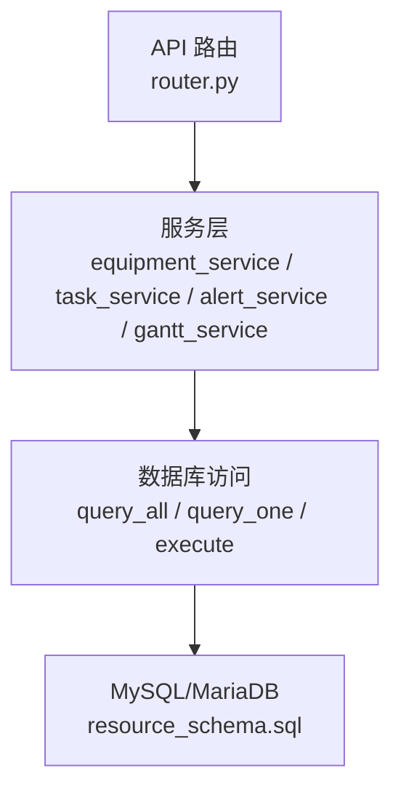

图表来源
- [router.py:58-86](file://backend/modules/resource/router.py#L58-L86)
- [equipment_service.py:11-103](file://backend/modules/resource/services/equipment_service.py#L11-L103)
- [task_service.py:48-146](file://backend/modules/resource/services/task_service.py#L48-L146)
- [alert_service.py:47-140](file://backend/modules/resource/services/alert_service.py#L47-L140)
- [gantt_service.py:176-258](file://backend/modules/resource/services/gantt_service.py#L176-L258)
- [resource_schema.sql:13-326](file://backend/sql/resource_schema.sql#L13-L326)

章节来源
- [resource_schema.sql:13-326](file://backend/sql/resource_schema.sql#L13-L326)
- [router.py:58-86](file://backend/modules/resource/router.py#L58-L86)

## 核心组件
- 设备台账 equipment：记录设备编号、名称、类型、状态、当前任务、当前操作员、所属区域等
- 区域 zones：记录区域编码、名称、类型、地图坐标、网格行列等
- 人员 personnel：记录工号、姓名、状态、当前区域、当前任务等
- 任务 tasks：记录任务编号、名称、类型、优先级、状态、所在区域/装配场地、占用举升机数量、占用设备编号、计划与实际工时、进度等
- 预警 alerts：记录预警类型、级别、标题、描述、来源、关联对象、发生区域、SLA、处理流程等
- 甘特排程 gantt_schedules：记录排程编号、关联任务、阶段、时间、工时、进度、前置依赖、关键路径、冲突标记等
- 甘特资源分配 gantt_resource_allocations：记录每个排程对资源的占用明细（设备、人员、区域、举升机等）
- 甘特冲突 gantt_conflicts：记录排程间资源或时间冲突的检测与处置结果
- 设备维护 equipment_maintenance：记录设备的例行/维修/巡检维护过程
- 人员效率 personnel_efficiency：统计人员每日有效工时、任务完成数、设备使用率等

章节来源
- [resource_schema.sql:13-326](file://backend/sql/resource_schema.sql#L13-L326)

## 架构总览
下图展示核心实体间的关系与数据流向，包括设备与区域的归属、任务与设备的占用、预警的多实体关联、甘特排程与任务的映射及资源分配。

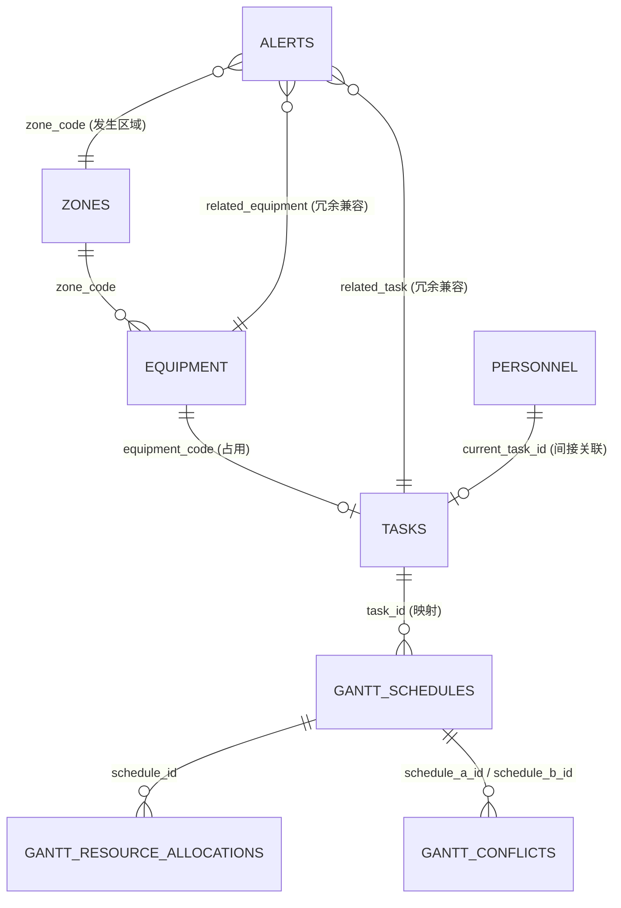

图表来源
- [resource_schema.sql:13-326](file://backend/sql/resource_schema.sql#L13-L326)

## 详细组件分析

### 1) 设备与区域：equipment 与 zones 的归属关系
- 关系类型：一对多（一个 zone 对应多个 equipment）
- 实现方式：
  - equipment.zone_code 引用 zones.zone_code
  - 查询时通过 LEFT JOIN zones 获取 zone_name
- 业务含义：设备按区域划分管理，便于看板与地图展示

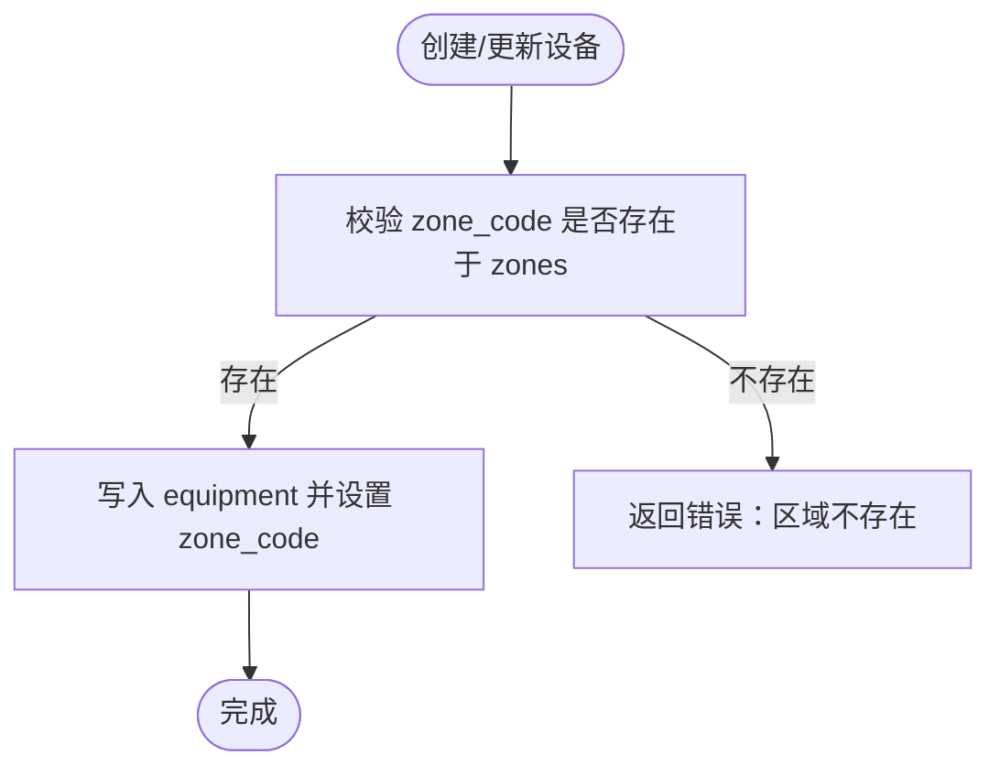

图表来源
- [equipment_service.py:140-178](file://backend/modules/resource/services/equipment_service.py#L140-L178)
- [resource_schema.sql:13-28](file://backend/sql/resource_schema.sql#L13-L28)
- [resource_schema.sql:33-45](file://backend/sql/resource_schema.sql#L33-L45)

章节来源
- [resource_schema.sql:13-45](file://backend/sql/resource_schema.sql#L13-L45)
- [equipment_service.py:140-178](file://backend/modules/resource/services/equipment_service.py#L140-L178)

### 2) 任务与设备：tasks 与 equipment 的资源占用关系
- 关系类型：多对一（多个任务可引用同一设备作为占用），同时设备表也反向记录 current_task_id
- 实现方式：
  - tasks.equipment_code 引用 equipment.equipment_code
  - equipment.current_task_id 指向 tasks.id（当前占用任务）
- 业务含义：体现“任务占用设备”的双向视图，便于快速定位设备当前任务与任务占用设备

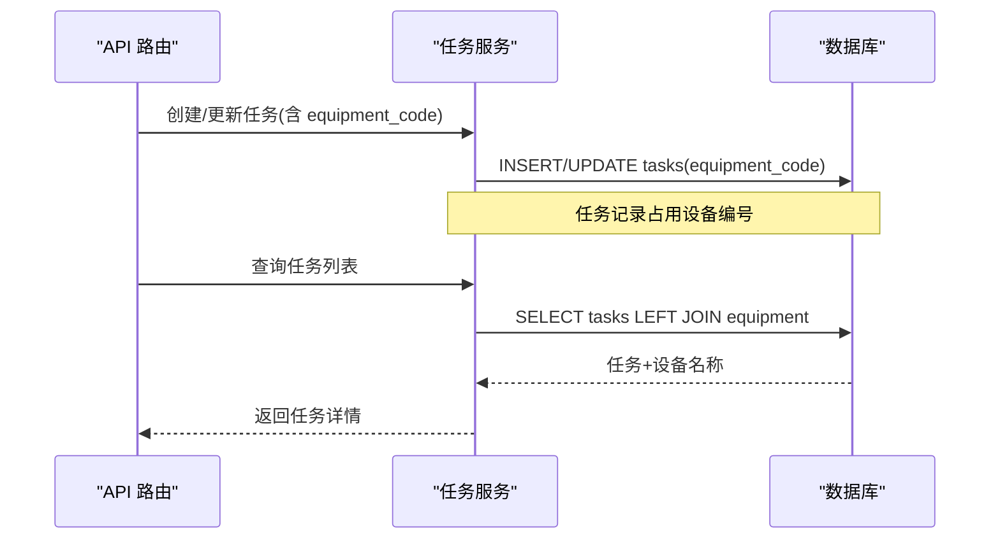

图表来源
- [task_service.py:48-146](file://backend/modules/resource/services/task_service.py#L48-L146)
- [resource_schema.sql:71-109](file://backend/sql/resource_schema.sql#L71-L109)
- [resource_schema.sql:13-28](file://backend/sql/resource_schema.sql#L13-L28)

章节来源
- [resource_schema.sql:13-28](file://backend/sql/resource_schema.sql#L13-L28)
- [resource_schema.sql:71-109](file://backend/sql/resource_schema.sql#L71-L109)
- [task_service.py:48-146](file://backend/modules/resource/services/task_service.py#L48-L146)

### 3) 预警与多类实体：alerts 的关联关系
- 关系类型：弱关联（通过相关类型与ID/编码进行软关联）
- 实现方式：
  - related_type 指定关联对象类型（task/equipment/personnel/material/project/workshop/none）
  - related_id 存储关联对象的 ID 或编号
  - related_name 冗余存储名称以便展示
  - related_equipment、related_task、related_personnel 为兼容字段
  - zone_code 表示发生区域
- 业务含义：支持跨域预警聚合与展示，避免强外键带来的耦合

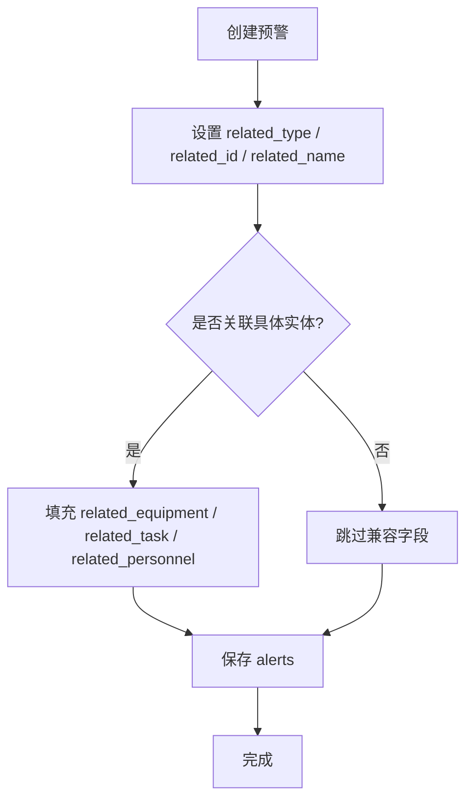

图表来源
- [alert_service.py:188-254](file://backend/modules/resource/services/alert_service.py#L188-L254)
- [resource_schema.sql:114-163](file://backend/sql/resource_schema.sql#L114-L163)

章节来源
- [resource_schema.sql:114-163](file://backend/sql/resource_schema.sql#L114-L163)
- [alert_service.py:188-254](file://backend/modules/resource/services/alert_service.py#L188-L254)

### 4) 甘特排程与任务：gantt_schedules 与 tasks 的映射关系
- 关系类型：一对多（一个任务可对应多条排程，用于分阶段或多时段安排）
- 实现方式：
  - gantt_schedules.task_id 指向 tasks.id
  - gantt_schedules.task_code、task_name 冗余字段，便于排程视图直接显示任务信息
- 业务含义：将任务拆解为可排程的工序/阶段，支持前置依赖、关键路径、冲突检测

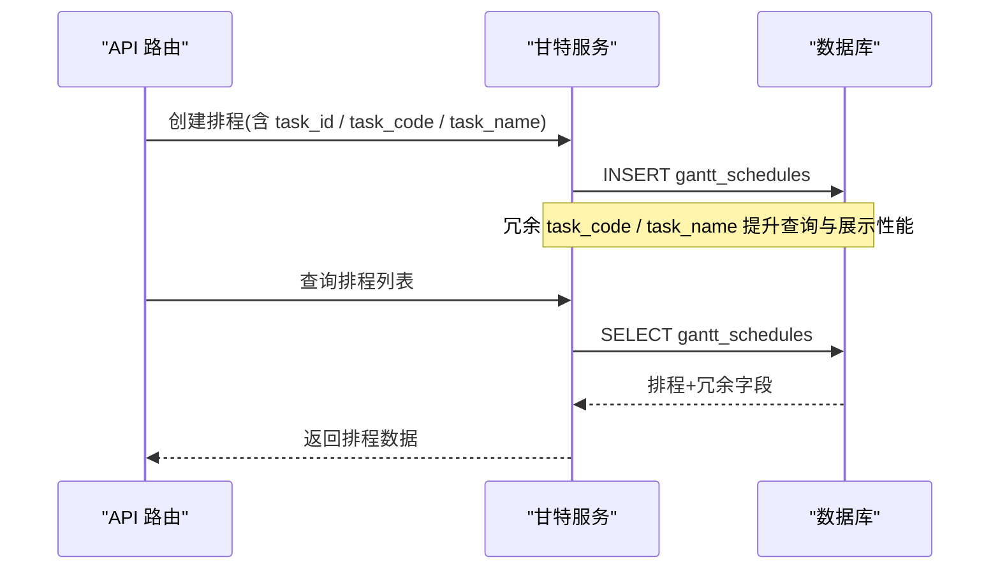

图表来源
- [gantt_service.py:396-465](file://backend/modules/resource/services/gantt_service.py#L396-L465)
- [resource_schema.sql:204-259](file://backend/sql/resource_schema.sql#L204-L259)

章节来源
- [resource_schema.sql:204-259](file://backend/sql/resource_schema.sql#L204-L259)
- [gantt_service.py:396-465](file://backend/modules/resource/services/gantt_service.py#L396-L465)

### 5) 甘特资源分配：gantt_resource_allocations
- 关系类型：一对多（一个排程可有多条资源分配记录）
- 实现方式：
  - schedule_id 指向 gantt_schedules.id
  - resource_type 区分设备、人员、区域、举升机、物料等
  - resource_code / resource_name 冗余存储资源标识与名称
- 业务含义：精细化记录每个排程占用的资源与时段，支撑冲突检测与可视化

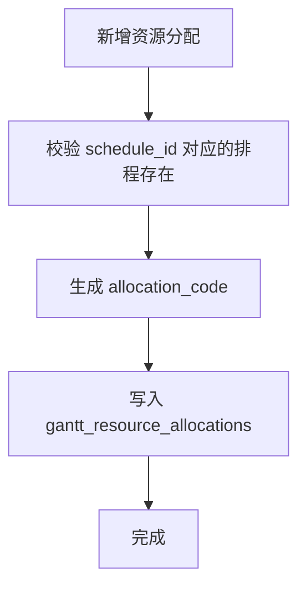

图表来源
- [gantt_service.py:651-696](file://backend/modules/resource/services/gantt_service.py#L651-L696)
- [resource_schema.sql:264-286](file://backend/sql/resource_schema.sql#L264-L286)

章节来源
- [resource_schema.sql:264-286](file://backend/sql/resource_schema.sql#L264-L286)
- [gantt_service.py:651-696](file://backend/modules/resource/services/gantt_service.py#L651-L696)

### 6) 甘特冲突检测与处理：gantt_conflicts
- 关系类型：多对多（两个排程之间可能产生冲突）
- 实现方式：
  - schedule_a_id / schedule_b_id 分别指向参与冲突的两个排程
  - conflict_type、severity、overlap_*、suggestion、status 等字段记录冲突详情与处置
- 业务含义：自动检测资源/时间重叠、依赖缺失、超期风险等，辅助调度优化

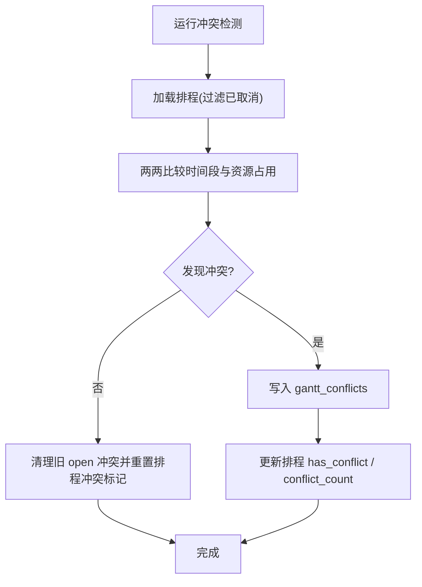

图表来源
- [gantt_service.py:775-806](file://backend/modules/resource/services/gantt_service.py#L775-L806)
- [resource_schema.sql:291-325](file://backend/sql/resource_schema.sql#L291-L325)

章节来源
- [resource_schema.sql:291-325](file://backend/sql/resource_schema.sql#L291-L325)
- [gantt_service.py:775-806](file://backend/modules/resource/services/gantt_service.py#L775-L806)

### 7) 设备维护：equipment_maintenance
- 关系类型：一对多（一个设备有多条维护记录）
- 实现方式：
  - equipment_code 指向 equipment.equipment_code
- 业务含义：记录设备维护过程，支持删除设备时级联清理维护记录

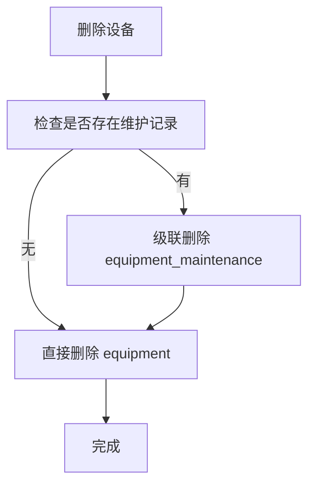

图表来源
- [equipment_service.py:231-259](file://backend/modules/resource/services/equipment_service.py#L231-L259)
- [resource_schema.sql:186-199](file://backend/sql/resource_schema.sql#L186-L199)

章节来源
- [resource_schema.sql:186-199](file://backend/sql/resource_schema.sql#L186-L199)
- [equipment_service.py:231-259](file://backend/modules/resource/services/equipment_service.py#L231-L259)

## 依赖关系分析
- 设备与区域：equipment.zone_code → zones.zone_code（一对多）
- 任务与设备：tasks.equipment_code → equipment.equipment_code（多对一），equipment.current_task_id → tasks.id（一对一/可选）
- 预警与实体：alerts.related_type + related_id（弱关联），以及 zone_code（发生区域）
- 甘特与任务：gantt_schedules.task_id → tasks.id（一对多）
- 甘特与资源分配：gantt_resource_allocations.schedule_id → gantt_schedules.id（一对多）
- 甘特冲突：gantt_conflicts.schedule_a_id / schedule_b_id → gantt_schedules.id（多对多）

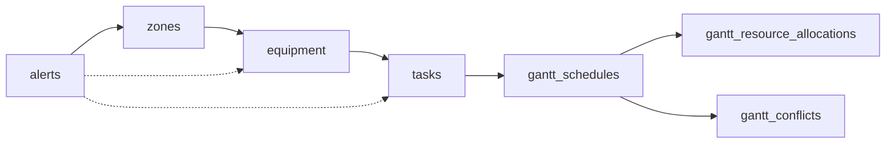

图表来源
- [resource_schema.sql:13-326](file://backend/sql/resource_schema.sql#L13-L326)

章节来源
- [resource_schema.sql:13-326](file://backend/sql/resource_schema.sql#L13-L326)

## 性能考虑
- 索引设计：
  - equipment：status、zone_code、equipment_type
  - tasks：task_type、status、priority、project_code、equipment_code
  - alerts：alert_type、level、status、raised_at、related_type+related_id、zone_code、related_equipment、handler
  - gantt_schedules：task_id+task_code、task_type、status、priority、assembly_site、is_critical、has_conflict、plan_start_time、plan_end_time、parent_id
  - gantt_resource_allocations：schedule_id+schedule_code、resource_type+resource_code、status、start_time、end_time
  - gantt_conflicts：conflict_type、severity、status、schedule_a_id、schedule_b_id、resource_type+resource_code、assembly_site、detected_at
- 查询优化：
  - 列表接口普遍使用分页与条件拼接，减少不必要的数据传输
  - 冗余字段（如 zone_name、equipment_name、task_name）在 JOIN 中复用，减少多次查询
- 计算开销：
  - 进度自动计算仅在非手动覆盖模式下执行，避免频繁重算
  - 冲突检测按需触发，支持按装配场地范围清理与更新

章节来源
- [resource_schema.sql:13-326](file://backend/sql/resource_schema.sql#L13-L326)
- [task_service.py:21-45](file://backend/modules/resource/services/task_service.py#L21-L45)
- [gantt_service.py:100-141](file://backend/modules/resource/services/gantt_service.py#L100-L141)
- [gantt_service.py:775-806](file://backend/modules/resource/services/gantt_service.py#L775-L806)

## 故障排查指南
- 常见错误与处理：
  - 区域不存在：创建设备时校验 zone_code，若不存在则抛出错误
  - 任务编号重复：创建任务前检查唯一性
  - 预警编号重复：创建预警前检查唯一性
  - 无效枚举值：任务类型、优先级、状态、预警类型/级别/状态等均有白名单校验
- 日志与追踪：
  - 服务层统一记录关键操作日志（创建、更新、删除、状态变更）
  - 异常捕获后记录错误上下文，便于定位问题

章节来源
- [equipment_service.py:140-178](file://backend/modules/resource/services/equipment_service.py#L140-L178)
- [task_service.py:177-237](file://backend/modules/resource/services/task_service.py#L177-L237)
- [alert_service.py:188-254](file://backend/modules/resource/services/alert_service.py#L188-L254)

## 结论
本设计通过合理的表结构与冗余字段，实现了设备与区域归属、任务与设备占用、预警多实体关联、甘特排程与任务映射及资源分配的清晰关系。通过服务层的校验与日志、索引优化与计算控制，保障了数据一致性与系统性能。建议在后续演进中：
- 逐步引入数据库外键约束以强化一致性（需评估迁移成本）
- 完善冲突检测的自动化闭环（自动建议与一键调整）
- 扩展预警升级与通知机制（邮件/飞书/短信）

## 附录

### ER 图（完整）
```mermaid
erDiagram
ZONES {
int id PK
varchar zone_code UK
varchar zone_name
enum zone_type
int position_x
int position_y
int grid_columns
int grid_rows
datetime created_at
datetime updated_at
}
EQUIPMENT {
int id PK
varchar equipment_code UK
varchar equipment_name
enum equipment_type
varchar zone_code FK
enum status
int current_task_id
varchar current_operator
datetime last_update_time
datetime created_at
datetime updated_at
}
PERSONNEL {
int id PK
varchar personnel_code UK
varchar name
varchar avatar_text
varchar department
enum status
varchar current_zone
int current_task_id
datetime entry_time
datetime last_update_time
datetime created_at
datetime updated_at
}
TASKS {
int id PK
varchar task_code UK
varchar task_name
enum task_type
varchar trial_type
varchar project_group
varchar project_code
varchar vehicle_code
varchar vehicle_model
enum priority
enum status
varchar zone_code
varchar assembly_site
int lift_count
varchar equipment_code
varchar planner
varchar pm_name
varchar cve_name
varchar trial_supervisor
varchar process_supervisor
varchar assembly_supervisor
datetime plan_start_time
datetime plan_end_time
decimal plan_work_hours
decimal actual_work_hours
decimal progress
tinyint progress_manual_override
int summer_target_count
date summer_target_date
enum source
datetime created_at
datetime updated_at
}
ALERTS {
int id PK
varchar alert_code UK
enum alert_type
enum level
varchar title
text description
enum source
enum related_type
varchar related_id
varchar related_name
varchar related_equipment
int related_task
varchar related_personnel
varchar zone_code
varchar assembly_site
varchar raised_by
datetime raised_at
int sla_hours
tinyint escalated
varchar escalated_to
enum status
varchar handler
varchar handler_department
datetime processing_started_at
datetime resolved_at
datetime closed_at
text processing_scheme
text corrective_action
text preventive_measure
text result_verification
decimal loss_amount
decimal impact_hours
int attachment_count
text remark
datetime created_at
datetime updated_at
}
PERSONNEL_EFFICIENCY {
int id PK
varchar personnel_code
date stat_date
decimal total_work_hours
decimal effective_work_hours
int task_count
decimal equipment_usage_rate
varchar zone_code
datetime created_at
}
EQUIPMENT_MAINTENANCE {
int id PK
varchar equipment_code
enum maintenance_type
datetime start_time
datetime end_time
varchar operator
text description
enum status
datetime created_at
}
GANTT_SCHEDULES {
int id PK
varchar schedule_code UK
int task_id
varchar task_code
varchar task_name
enum task_type
varchar trial_type
varchar project_group
varchar project_code
varchar vehicle_code
varchar vehicle_model
enum phase
enum priority
enum status
varchar color_tag
varchar assembly_site
varchar zone_code
int lift_count
varchar equipment_code
varchar planner
varchar pm_name
varchar cve_name
varchar trial_supervisor
datetime plan_start_time
datetime plan_end_time
datetime actual_start_time
datetime actual_end_time
decimal plan_work_hours
decimal actual_work_hours
decimal progress
tinyint progress_manual_override
int parent_id
int sort_order
enum constraint_type
datetime constraint_date
varchar predecessor_ids
tinyint is_critical
decimal slack_hours
tinyint has_conflict
int conflict_count
text remark
varchar created_by
datetime created_at
datetime updated_at
}
GANTT_RESOURCE_ALLOCATIONS {
int id PK
varchar allocation_code UK
int schedule_id
varchar schedule_code
enum resource_type
varchar resource_code
varchar resource_name
datetime start_time
datetime end_time
decimal hours_allocated
int quantity
int priority
enum status
varchar remark
datetime created_at
datetime updated_at
}
GANTT_CONFLICTS {
int id PK
varchar conflict_code UK
enum conflict_type
enum severity
int schedule_a_id
varchar schedule_a_code
varchar schedule_a_name
int schedule_b_id
varchar schedule_b_code
varchar schedule_b_name
varchar resource_type
varchar resource_code
varchar resource_name
datetime overlap_start
datetime overlap_end
decimal overlap_hours
text suggestion
enum status
text resolution
varchar resolved_by
datetime resolved_at
datetime detected_at
varchar assembly_site
datetime created_at
datetime updated_at
}
ZONES ||--o{ EQUIPMENT : "zone_code"
EQUIPMENT ||--o| TASKS : "equipment_code"
TASKS ||--o{ GANTT_SCHEDULES : "task_id"
GANTT_SCHEDULES ||--o{ GANTT_RESOURCE_ALLOCATIONS : "schedule_id"
GANTT_SCHEDULES ||--o{ GANTT_CONFLICTS : "schedule_a_id / schedule_b_id"
ALERTS }o--|| ZONES : "zone_code"
ALERTS }o--|| EQUIPMENT : "related_equipment"
ALERTS }o--|| TASKS : "related_task"
```

图表来源
- [resource_schema.sql:13-326](file://backend/sql/resource_schema.sql#L13-L326)

### 数据流向与依赖关系图
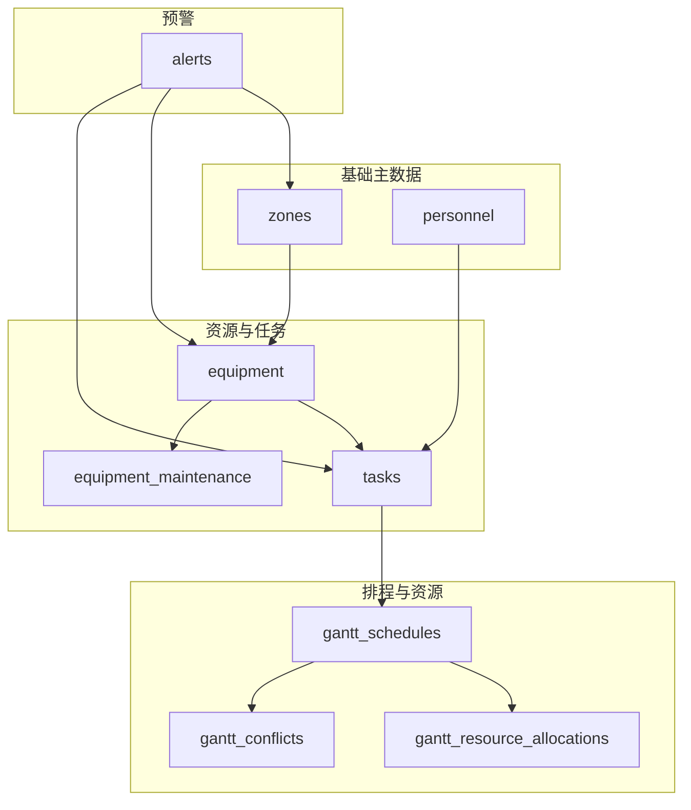

图表来源
- [resource_schema.sql:13-326](file://backend/sql/resource_schema.sql#L13-L326)

### 级联更新与删除策略
- 设备删除：
  - 先级联删除该设备的维护记录，再删除设备本身
  - 参考实现：[equipment_service.py:231-259](file://backend/modules/resource/services/equipment_service.py#L231-L259)
- 排程删除：
  - 先删除其资源分配记录，再将相关冲突标记为 ignored，最后删除排程
  - 参考实现：[gantt_service.py:528-550](file://backend/modules/resource/services/gantt_service.py#L528-L550)
- 预警处理：
  - 不直接级联删除关联实体，而是通过状态流转与时间戳补齐（processing/resolved/closed）
  - 参考实现：[alert_service.py:257-302](file://backend/modules/resource/services/alert_service.py#L257-L302)

章节来源
- [equipment_service.py:231-259](file://backend/modules/resource/services/equipment_service.py#L231-L259)
- [gantt_service.py:528-550](file://backend/modules/resource/services/gantt_service.py#L528-L550)
- [alert_service.py:257-302](file://backend/modules/resource/services/alert_service.py#L257-L302)