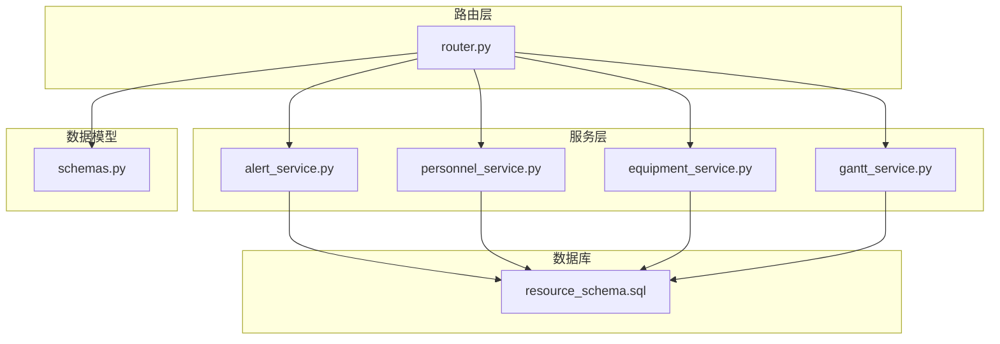
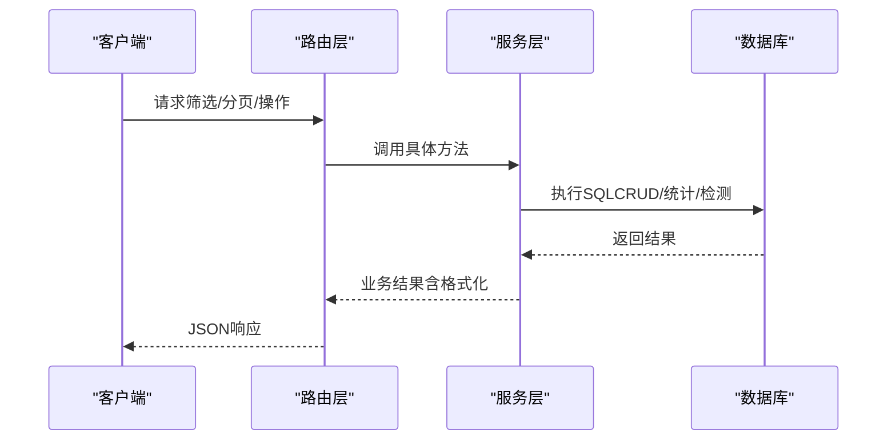
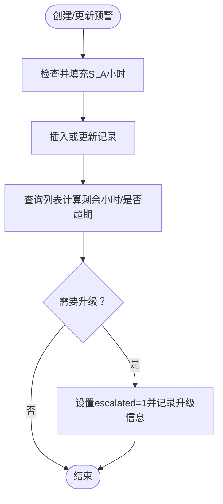
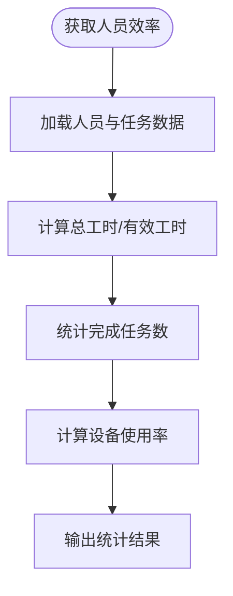
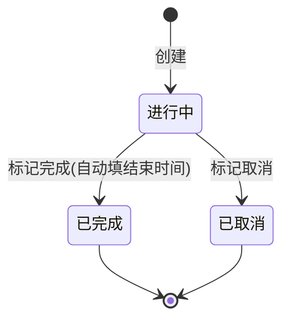
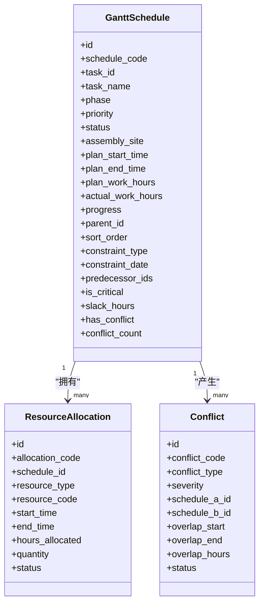
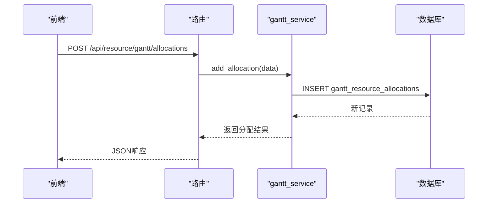
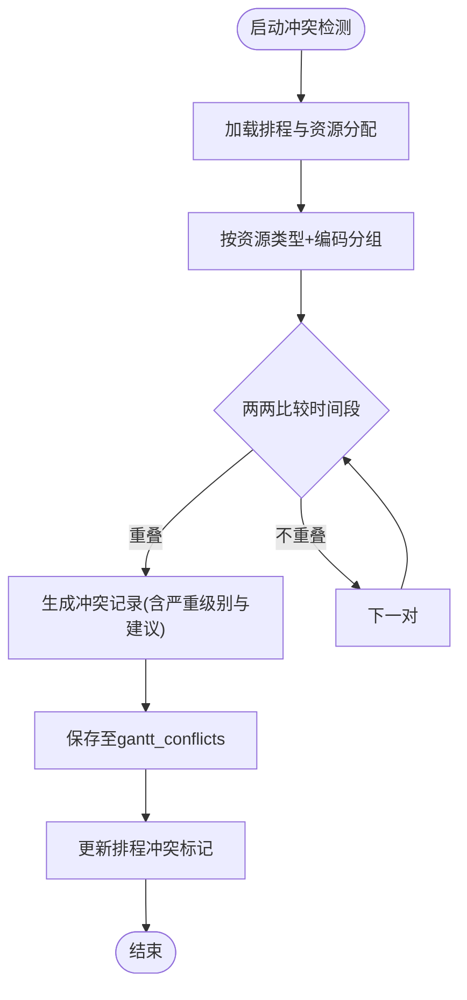
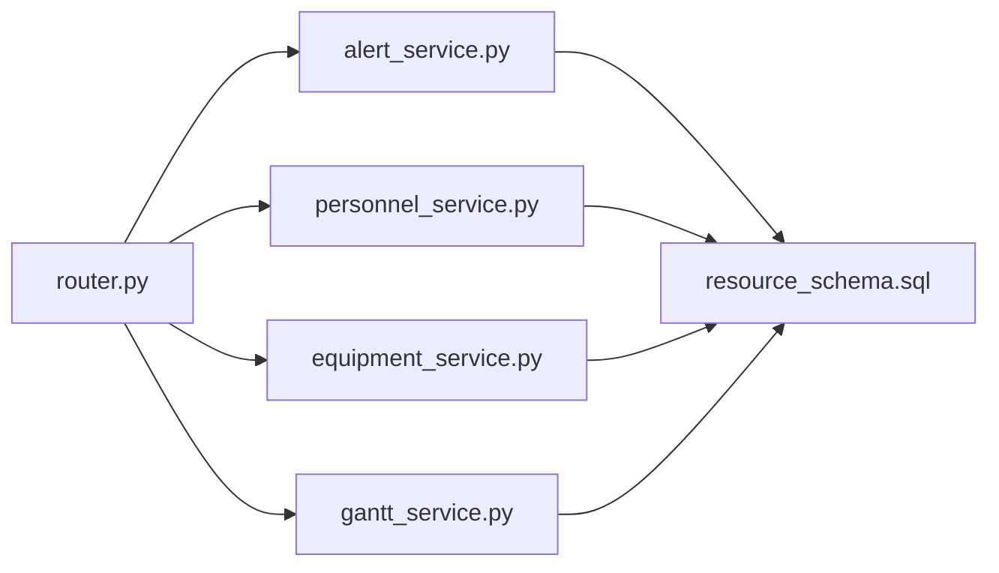

# 高级功能表

<cite>
**本文引用的文件**
- [backend/sql/resource_schema.sql](file://backend/sql/resource_schema.sql)
- [backend/modules/resource/services/alert_service.py](file://backend/modules/resource/services/alert_service.py)
- [backend/modules/resource/services/personnel_service.py](file://backend/modules/resource/services/personnel_service.py)
- [backend/modules/resource/services/equipment_service.py](file://backend/modules/resource/services/equipment_service.py)
- [backend/modules/resource/services/gantt_service.py](file://backend/modules/resource/services/gantt_service.py)
- [backend/modules/resource/schemas.py](file://backend/modules/resource/schemas.py)
- [backend/modules/resource/router.py](file://backend/modules/resource/router.py)
</cite>

## 目录
1. [引言](#引言)
2. [项目结构](#项目结构)
3. [核心组件](#核心组件)
4. [架构总览](#架构总览)
5. [详细组件分析](#详细组件分析)
6. [依赖关系分析](#依赖关系分析)
7. [性能考虑](#性能考虑)
8. [故障排查指南](#故障排查指南)
9. [结论](#结论)
10. [附录](#附录)

## 引言
本文件聚焦试制资源数智化管理系统的“高级功能表”设计与实现，覆盖以下关键能力：
- alerts（异常预警）：SLA机制、升级流程、统计与批量处理
- personnel_efficiency（人员效率统计）：指标计算逻辑与看板数据
- equipment_maintenance（设备维护记录）：生命周期管理与状态流转
- gantt_schedules（甘特排程计划）：复杂关系设计（前置依赖、约束、关键路径）
- gantt_resource_allocations（甘特资源分配）：资源占用与工时分配
- gantt_conflicts（甘特资源冲突）：冲突检测、严重级别与解决闭环

文档同时解释冗余字段的设计考量与性能优化策略，并提供可视化图示辅助理解。

## 项目结构
后端采用FastAPI路由层 + Service服务层 + SQL Schema的清晰分层：
- 路由层：定义REST接口，参数校验与异常包装
- 服务层：业务逻辑、查询构建、统计计算、冲突检测、关键路径计算
- 数据库Schema：统一表结构与索引定义

图表来源
- [backend/modules/resource/router.py:1-800](file://backend/modules/resource/router.py#L1-L800)
- [backend/modules/resource/services/alert_service.py:1-399](file://backend/modules/resource/services/alert_service.py#L1-L399)
- [backend/modules/resource/services/personnel_service.py:1-475](file://backend/modules/resource/services/personnel_service.py#L1-L475)
- [backend/modules/resource/services/equipment_service.py:1-495](file://backend/modules/resource/services/equipment_service.py#L1-L495)
- [backend/modules/resource/services/gantt_service.py:1-1427](file://backend/modules/resource/services/gantt_service.py#L1-L1427)
- [backend/sql/resource_schema.sql:1-326](file://backend/sql/resource_schema.sql#L1-L326)

章节来源
- [backend/modules/resource/router.py:1-800](file://backend/modules/resource/router.py#L1-L800)
- [backend/sql/resource_schema.sql:1-326](file://backend/sql/resource_schema.sql#L1-L326)

## 核心组件
- 异常预警（alerts）：支持多类型、多级别、SLA响应时长、升级上报、软超期展示、批量状态更新与统计
- 人员效率（personnel_efficiency）：按日统计总工时、有效工时、任务完成数、设备使用率等
- 设备维护（equipment_maintenance）：维护类型、起止时间、状态流转、关联设备
- 甘特排程（gantt_schedules）：任务/排程、阶段、优先级、约束、前置依赖、关键路径、浮动时差
- 资源分配（gantt_resource_allocations）：资源类型、编码、数量、工时、状态
- 资源冲突（gantt_conflicts）：资源重叠、时间重叠、依赖缺失、截止风险、过载等

章节来源
- [backend/sql/resource_schema.sql:112-326](file://backend/sql/resource_schema.sql#L112-L326)
- [backend/modules/resource/schemas.py:180-224](file://backend/modules/resource/schemas.py#L180-L224)

## 架构总览
系统通过路由暴露接口，调用服务层进行业务处理，最终读写数据库。高并发场景下，服务层负责聚合查询、过滤、分页与格式化；冲突检测与关键路径计算在内存中完成，结果落库并回写排程标记位以提升前端渲染性能。

图表来源
- [backend/modules/resource/router.py:1-800](file://backend/modules/resource/router.py#L1-L800)
- [backend/modules/resource/services/gantt_service.py:176-259](file://backend/modules/resource/services/gantt_service.py#L176-L259)
- [backend/modules/resource/services/alert_service.py:47-140](file://backend/modules/resource/services/alert_service.py#L47-L140)

## 详细组件分析

### 异常预警（alerts）
- 表结构要点
  - 唯一编号、类型、级别、标题、描述、来源、关联对象（类型/ID/名称/设备/任务/人员）、区域/场地、发现人/时间、SLA小时、是否升级、升级对象、状态、处理人/部门、介入/解决/关闭时间、处置方案、整改措施、预防措施、效果验证、损失金额、影响工时、附件数、备注
  - 索引：类型、级别、状态、触发时间、关联对象、区域、设备、处理人
- SLA机制与升级流程
  - 默认SLA：critical=4h, high=8h, medium=24h, low=72h；创建或更新时自动填充未设置的sla_hours
  - 软超期：查询时根据raised_at+sla_hours与当前时间计算剩余小时与是否超期，不直接修改状态
  - 升级：escalate_alert将escalated置1并记录escalated_to，同时在remark追加升级日志
  - 批量状态更新：processing/resolved/closed时自动写入对应时间戳
- 列表与统计
  - 支持多维度筛选（类型、级别、状态、来源、区域、场地、处理人、时间范围、关键词、仅升级、仅超期）
  - 统计包含总数、严重级别分布、状态分布、超期数、类型分布、交叉分布、近7天趋势、升级数

图表来源
- [backend/modules/resource/services/alert_service.py:188-254](file://backend/modules/resource/services/alert_service.py#L188-L254)
- [backend/modules/resource/services/alert_service.py:305-314](file://backend/modules/resource/services/alert_service.py#L305-L314)
- [backend/modules/resource/services/alert_service.py:47-140](file://backend/modules/resource/services/alert_service.py#L47-L140)

章节来源
- [backend/sql/resource_schema.sql:112-163](file://backend/sql/resource_schema.sql#L112-L163)
- [backend/modules/resource/services/alert_service.py:1-399](file://backend/modules/resource/services/alert_service.py#L1-L399)
- [backend/modules/resource/schemas.py:180-202](file://backend/modules/resource/schemas.py#L180-L202)

### 人员效率统计（personnel_efficiency）
- 表结构要点
  - 工号、统计日期、总工时、有效工时、完成任务数、设备使用率、主要工作区域
  - 唯一键：(personnel_code, stat_date)，索引：工号、日期
- 计算逻辑说明
  - 当前服务层提供人员看板KPI与来源分布、地图位置等；人员效率统计接口为占位实现，后续可基于tasks与personnel表聚合计算
  - 建议指标：
    - 总工时：按状态working累计（如当日8小时）或结合实际工时字段
    - 有效工时：扣除等待/空闲/异常时间后的净产出工时
    - 完成任务数：按任务完成状态统计
    - 设备使用率：设备busy时长/可用时长
- 数据来源与聚合
  - 可从tasks.actual_work_hours、status、plan_work_hours与personnel.status组合计算
  - 可按department、zone_code分组输出

图表来源
- [backend/modules/resource/services/personnel_service.py:325-379](file://backend/modules/resource/services/personnel_service.py#L325-L379)
- [backend/sql/resource_schema.sql:166-181](file://backend/sql/resource_schema.sql#L166-L181)

章节来源
- [backend/sql/resource_schema.sql:166-181](file://backend/sql/resource_schema.sql#L166-L181)
- [backend/modules/resource/services/personnel_service.py:1-475](file://backend/modules/resource/services/personnel_service.py#L1-L475)

### 设备维护记录（equipment_maintenance）
- 表结构要点
  - 设备编号、维护类型（例行/维修/巡检）、开始/结束时间、维护人员、描述、状态（进行中/已完成/已取消）
  - 索引：设备、类型、状态
- 生命周期管理
  - 创建：校验设备存在，插入维护记录，默认状态in_progress
  - 更新：completed时自动补end_time；支持cancelled
  - 删除：删除设备时级联删除其维护记录
- 查询与统计
  - 支持按设备、状态分页查询
  - 设备状态变更与统计由equipment_service提供

图表来源
- [backend/modules/resource/services/equipment_service.py:396-439](file://backend/modules/resource/services/equipment_service.py#L396-L439)
- [backend/modules/resource/services/equipment_service.py:442-495](file://backend/modules/resource/services/equipment_service.py#L442-L495)
- [backend/modules/resource/services/equipment_service.py:231-259](file://backend/modules/resource/services/equipment_service.py#L231-L259)

章节来源
- [backend/sql/resource_schema.sql:183-199](file://backend/sql/resource_schema.sql#L183-L199)
- [backend/modules/resource/services/equipment_service.py:1-495](file://backend/modules/resource/services/equipment_service.py#L1-L495)

### 甘特排程计划（gantt_schedules）
- 表结构要点
  - 排程编号、关联任务、名称、类型、试制类别、项目群/编号、车号/车型、阶段、优先级、状态、颜色标签、装配场地/区域、举升机数量、设备编码、负责人/PM/CVE/主管、计划/实际起止时间、计划/实际工时、进度（可手动覆盖）、父级/排序、约束类型/日期、前置依赖、是否关键路径、浮动时差、是否存在冲突、冲突次数、备注、创建人、时间戳
  - 索引：任务、类型、状态、优先级、场地、关键路径、冲突、起止时间、父级
- 复杂关系设计
  - 前置依赖：predecessor_ids存储逗号分隔或JSON数组，支持环检测
  - 约束：start_no_earlier/end_no_later/must_on/as_soon_as_possible
  - 关键路径：拓扑排序DAG计算最早/最晚开始结束时间，slack<0.5视为关键
  - 冲突标记：has_conflict与conflict_count用于快速筛选
- 数据处理
  - 创建/更新时自动计算计划工时与进度（除非手动覆盖）
  - 详情查询包含关联资源分配与开放冲突

图表来源
- [backend/sql/resource_schema.sql:201-259](file://backend/sql/resource_schema.sql#L201-L259)
- [backend/modules/resource/services/gantt_service.py:396-465](file://backend/modules/resource/services/gantt_service.py#L396-L465)
- [backend/modules/resource/services/gantt_service.py:1255-1372](file://backend/modules/resource/services/gantt_service.py#L1255-L1372)

章节来源
- [backend/sql/resource_schema.sql:201-259](file://backend/sql/resource_schema.sql#L201-L259)
- [backend/modules/resource/services/gantt_service.py:1-1427](file://backend/modules/resource/services/gantt_service.py#L1-L1427)

### 甘特资源分配（gantt_resource_allocations）
- 表结构要点
  - 分配编号、排程ID/编号、资源类型（设备/人员/区域/举升机/物料/其他）、资源编码/名称、占用起止时间、分配工时、数量、优先级、状态（计划/使用中/已用/释放/取消）、备注
  - 索引：排程、资源类型+编码、状态、起止时间
- 功能
  - 新增/删除/批量分配
  - 查询时关联排程信息，便于前端展示

图表来源
- [backend/modules/resource/services/gantt_service.py:651-696](file://backend/modules/resource/services/gantt_service.py#L651-L696)
- [backend/sql/resource_schema.sql:261-286](file://backend/sql/resource_schema.sql#L261-L286)

章节来源
- [backend/sql/resource_schema.sql:261-286](file://backend/sql/resource_schema.sql#L261-L286)
- [backend/modules/resource/services/gantt_service.py:608-724](file://backend/modules/resource/services/gantt_service.py#L608-L724)

### 甘特资源冲突（gantt_conflicts）
- 表结构要点
  - 冲突编号、类型（资源重叠/时间重叠/依赖缺失/截止风险/过载/其他）、严重级别、关联排程A/B、资源类型/编码/名称、重叠起止时间/小时数、建议、状态（开放/审核中/已解决/忽略）、解决方式/解决人/时间、检测时间、装配场地
  - 索引：类型、严重级别、状态、排程A/B、资源、场地、检测时间
- 冲突检测逻辑
  - 资源重叠：按资源类型+编码分组，两两比较时间段是否重叠，按重叠小时数定严重级别
  - 依赖缺失：前置任务结束时间晚于当前任务开始时间
  - 截止风险：当前时间超过计划结束时间一定天数
  - 同场地设备/区域重叠：同一场地的设备或区域在同一时段被多个排程占用
  - 保存后更新排程的has_conflict与conflict_count

图表来源
- [backend/modules/resource/services/gantt_service.py:775-1076](file://backend/modules/resource/services/gantt_service.py#L775-L1076)
- [backend/sql/resource_schema.sql:288-325](file://backend/sql/resource_schema.sql#L288-L325)

章节来源
- [backend/sql/resource_schema.sql:288-325](file://backend/sql/resource_schema.sql#L288-L325)
- [backend/modules/resource/services/gantt_service.py:775-1076](file://backend/modules/resource/services/gantt_service.py#L775-L1076)

## 依赖关系分析
- 模块耦合
  - router依赖各service；service依赖database工具函数；schema定义Pydantic模型
  - gantt_service内部强耦合：冲突检测与关键路径计算共享解析与格式化工具
- 外部依赖
  - 数据库MariaDB/MySQL，使用InnoDB引擎与utf8mb4字符集
- 潜在循环依赖
  - 无直接代码循环导入；依赖关系清晰单向

图表来源
- [backend/modules/resource/router.py:1-800](file://backend/modules/resource/router.py#L1-L800)
- [backend/modules/resource/services/alert_service.py:1-399](file://backend/modules/resource/services/alert_service.py#L1-L399)
- [backend/modules/resource/services/personnel_service.py:1-475](file://backend/modules/resource/services/personnel_service.py#L1-L475)
- [backend/modules/resource/services/equipment_service.py:1-495](file://backend/modules/resource/services/equipment_service.py#L1-L495)
- [backend/modules/resource/services/gantt_service.py:1-1427](file://backend/modules/resource/services/gantt_service.py#L1-L1427)
- [backend/sql/resource_schema.sql:1-326](file://backend/sql/resource_schema.sql#L1-L326)

章节来源
- [backend/modules/resource/router.py:1-800](file://backend/modules/resource/router.py#L1-L800)
- [backend/sql/resource_schema.sql:1-326](file://backend/sql/resource_schema.sql#L1-L326)

## 性能考虑
- 索引优化
  - alerts：类型、级别、状态、触发时间、关联对象、区域、设备、处理人
  - personnel_efficiency：工号、日期
  - equipment_maintenance：设备、类型、状态
  - gantt_schedules：任务、类型、状态、优先级、场地、关键路径、冲突、起止时间、父级
  - gantt_resource_allocations：排程、资源类型+编码、状态、起止时间
  - gantt_conflicts：类型、严重级别、状态、排程A/B、资源、场地、检测时间
- 查询优化
  - 列表接口使用WHERE条件拼接与LIMIT/OFFSET分页
  - 统计接口使用GROUP BY与聚合函数减少应用层计算
  - 冲突检测先清理open冲突再重建，避免脏数据累积
- 冗余字段
  - 排程与冲突表中冗余schedule_code、resource_name等，减少JOIN提升读取性能
  - alerts中related_name、related_equipment、related_task、related_personnel冗余，便于快速展示
- 计算卸载
  - 关键路径与冲突检测在服务层内存计算，结果落库并更新标记位，前端可直接读取

[本节为通用性能指导，无需特定文件引用]

## 故障排查指南
- 预警相关
  - 超期显示异常：检查raised_at与sla_hours是否正确；确认查询时软超期计算逻辑
  - 升级未生效：确认escalated与escalated_to字段更新；检查remark追加逻辑
- 人员效率
  - 指标为空：确认efficiency表是否有数据；检查tasks与personnel关联关系
- 设备维护
  - 状态无法更新：检查valid_statuses与传入值；确认end_time在completed时自动填充
- 甘特冲突
  - 冲突未生成：检查资源分配起止时间是否为空；确认时间段重叠判断逻辑
  - 关键路径错误：检查predecessor_ids解析与DAG拓扑排序；确认duration计算

章节来源
- [backend/modules/resource/services/alert_service.py:143-172](file://backend/modules/resource/services/alert_service.py#L143-L172)
- [backend/modules/resource/services/equipment_service.py:442-495](file://backend/modules/resource/services/equipment_service.py#L442-L495)
- [backend/modules/resource/services/gantt_service.py:775-1076](file://backend/modules/resource/services/gantt_service.py#L775-L1076)
- [backend/modules/resource/services/gantt_service.py:1255-1372](file://backend/modules/resource/services/gantt_service.py#L1255-L1372)

## 结论
本系统通过清晰的层次化设计与完善的数据库索引，实现了异常预警SLA与升级、人员效率统计、设备维护生命周期管理以及甘特排程的复杂关系处理能力。冗余字段与内存计算相结合，在保证正确性的前提下提升了查询与展示性能。未来可进一步扩展人员效率的实际工时计算与更精细的设备利用率统计。

[本节为总结性内容，无需特定文件引用]

## 附录
- API概览（部分）
  - 设备：GET/POST/PUT/DELETE /api/resource/equipment
  - 维护：GET/POST /api/resource/equipment/{code}/maintenance；PUT /api/resource/equipment/maintenance/{id}/status
  - 人员：GET/POST/PUT/DELETE /api/resource/personnel；GET /api/resource/personnel/stats；GET /api/resource/personnel/source-distribution；GET /api/resource/personnel/map
  - 任务：GET/POST/PUT/DELETE /api/resource/tasks；GET /api/resource/tasks/stats
  - 预警：GET/POST/PUT /api/resource/alerts（服务层提供CRUD与统计）
  - 甘特：GET/POST/PUT/DELETE /api/resource/gantt/*（服务层提供排程、分配、冲突、关键路径）

章节来源
- [backend/modules/resource/router.py:1-800](file://backend/modules/resource/router.py#L1-L800)
- [backend/modules/resource/services/alert_service.py:1-399](file://backend/modules/resource/services/alert_service.py#L1-L399)
- [backend/modules/resource/services/personnel_service.py:1-475](file://backend/modules/resource/services/personnel_service.py#L1-L475)
- [backend/modules/resource/services/equipment_service.py:1-495](file://backend/modules/resource/services/equipment_service.py#L1-L495)
- [backend/modules/resource/services/gantt_service.py:1-1427](file://backend/modules/resource/services/gantt_service.py#L1-L1427)