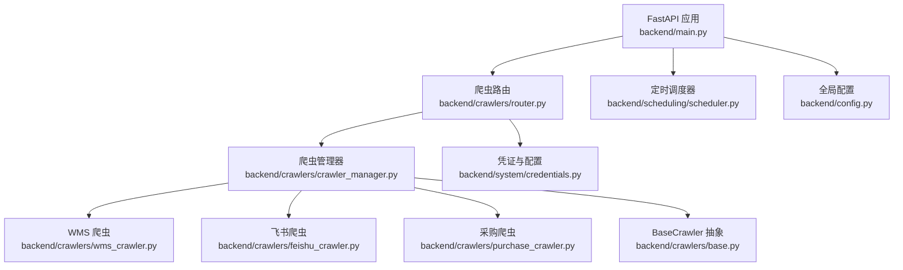
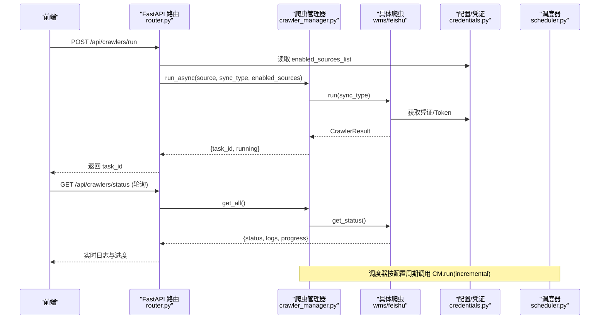
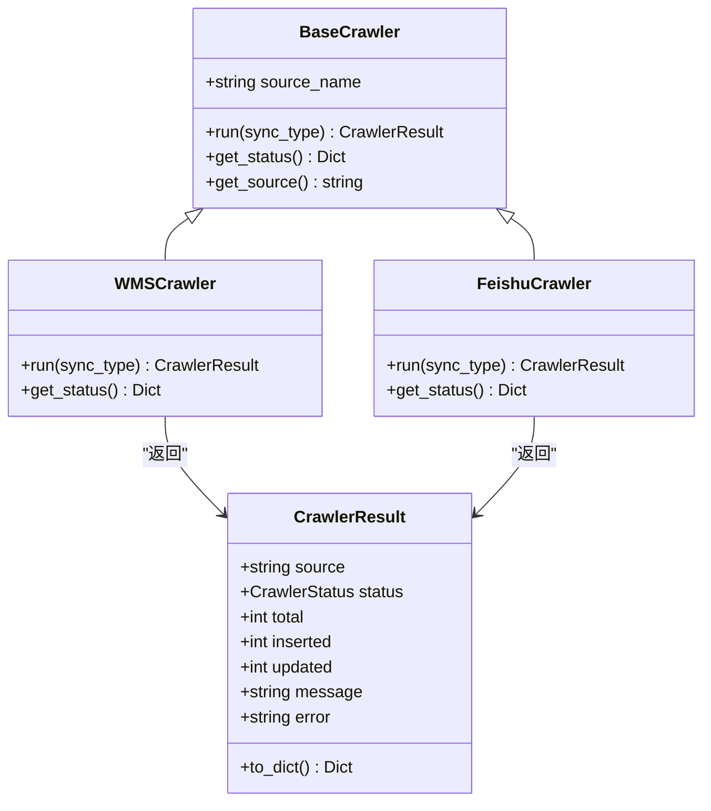
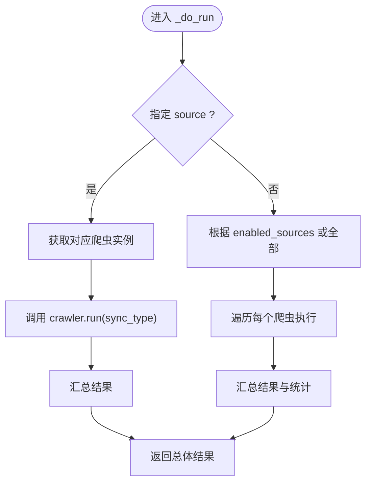
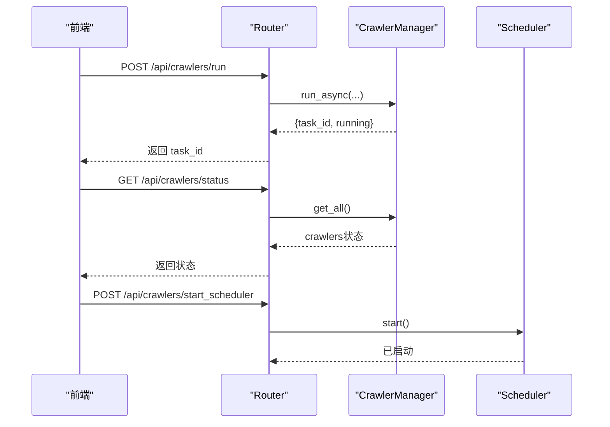
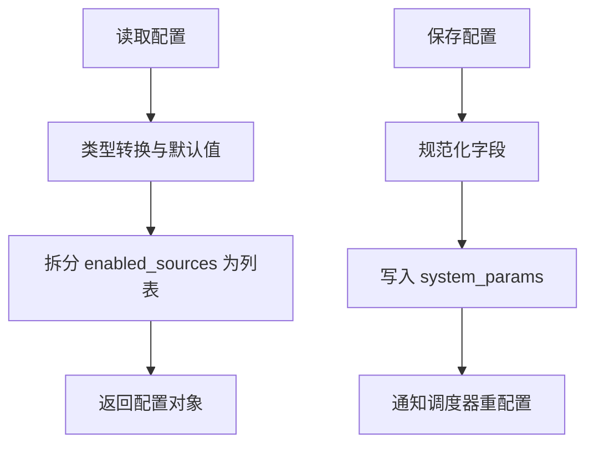
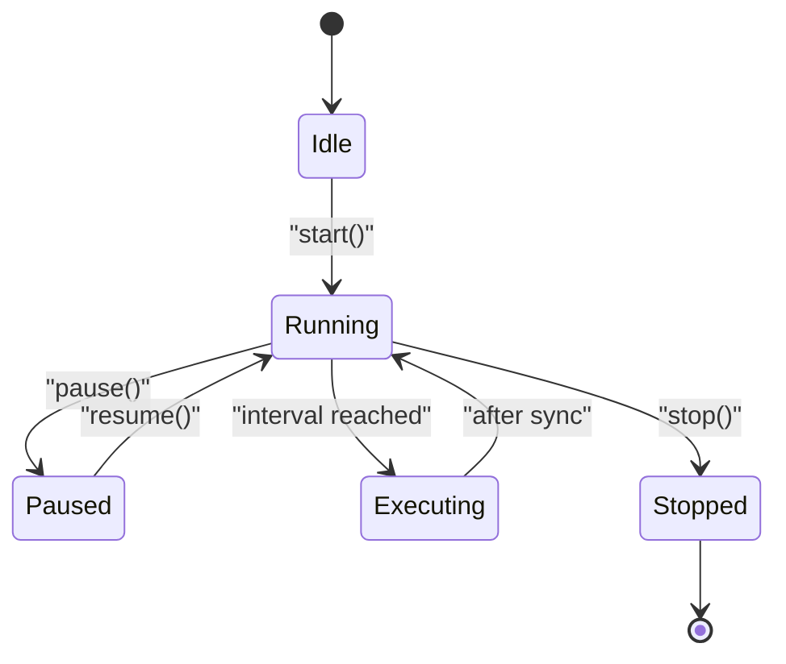
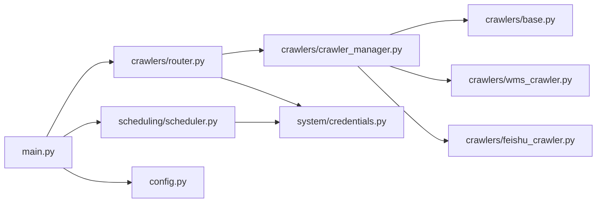

# 扩展开发指南

<cite>
**本文引用的文件**
- [backend/crawlers/base.py](file://backend/crawlers/base.py)
- [backend/crawlers/wms_crawler.py](file://backend/crawlers/wms_crawler.py)
- [backend/crawlers/feishu_crawler.py](file://backend/crawlers/feishu_crawler.py)
- [backend/crawlers/crawler_manager.py](file://backend/crawlers/crawler_manager.py)
- [backend/crawlers/router.py](file://backend/crawlers/router.py)
- [backend/system/credentials.py](file://backend/system/credentials.py)
- [backend/scheduling/scheduler.py](file://backend/scheduling/scheduler.py)
- [backend/config.py](file://backend/config.py)
- [backend/main.py](file://backend/main.py)
- [backend/scripts/run_crawler.py](file://backend/scripts/run_crawler.py)
</cite>

## 目录
1. [简介](#简介)
2. [项目结构](#项目结构)
3. [核心组件](#核心组件)
4. [架构总览](#架构总览)
5. [详细组件分析](#详细组件分析)
6. [依赖关系分析](#依赖关系分析)
7. [性能与可扩展性](#性能与可扩展性)
8. [测试策略与调试技巧](#测试策略与调试技巧)
9. [完整开发示例：从零到上线](#完整开发示例从零到上线)
10. [代码规范、安全与最佳实践](#代码规范安全与最佳实践)
11. [故障排查](#故障排查)
12. [结论](#结论)

## 简介
本指南面向需要在 spiderV5 系统中新增数据源爬虫的开发者。你将学会：
- 基于 BaseCrawler 基类实现新爬虫，完成继承与方法重写
- 通过 CrawlerManager 注册新爬虫，参与统一调度
- 使用路由接口进行运行、状态查询、配置管理
- 理解动态加载、依赖注入与服务发现机制
- 掌握配置管理系统（环境变量、数据库参数、运行时更新）
- 制定测试策略（单元、集成、模拟数据）并高效调试
- 遵循代码规范、性能要求与安全最佳实践，完成从需求到部署的全流程

## 项目结构
后端采用 FastAPI 模块化组织，爬虫子系统位于 backend/crawlers，包含基类、具体爬虫实现、管理器与路由；系统凭证与配置在 backend/system；定时调度在 backend/scheduling；全局配置在 backend/config；应用入口在 backend/main.py。

图表来源
- [backend/main.py:18-83](file://backend/main.py#L18-L83)
- [backend/crawlers/router.py:1-225](file://backend/crawlers/router.py#L1-L225)
- [backend/crawlers/crawler_manager.py:1-305](file://backend/crawlers/crawler_manager.py#L1-L305)
- [backend/crawlers/base.py:1-67](file://backend/crawlers/base.py#L1-L67)
- [backend/system/credentials.py:294-401](file://backend/system/credentials.py#L294-L401)
- [backend/scheduling/scheduler.py:1-196](file://backend/scheduling/scheduler.py#L1-L196)
- [backend/config.py:48-102](file://backend/config.py#L48-L102)

章节来源
- [backend/main.py:18-83](file://backend/main.py#L18-L83)
- [backend/crawlers/router.py:1-225](file://backend/crawlers/router.py#L1-L225)
- [backend/crawlers/crawler_manager.py:1-305](file://backend/crawlers/crawler_manager.py#L1-L305)
- [backend/config.py:48-102](file://backend/config.py#L48-L102)

## 核心组件
- BaseCrawler：定义爬虫抽象接口与结果模型，强制实现 run 与 get_status
- CrawlerManager：集中管理所有爬虫实例，提供同步/异步执行、任务跟踪、停止控制
- 具体爬虫：如 WMSCrawler、FeishuCrawler，实现各自的数据源拉取、清洗、入库逻辑
- Router：暴露 /api/crawlers/* 接口，处理运行、状态、配置、调度控制
- Credentials：持久化凭证与爬虫同步配置，支持自动登录、Token 刷新
- Scheduler：后台线程按配置周期触发增量同步，避免与手动任务冲突
- Config：集中读取 .env 环境变量，提供全局 Settings

章节来源
- [backend/crawlers/base.py:12-67](file://backend/crawlers/base.py#L12-L67)
- [backend/crawlers/crawler_manager.py:22-107](file://backend/crawlers/crawler_manager.py#L22-L107)
- [backend/crawlers/wms_crawler.py:44-477](file://backend/crawlers/wms_crawler.py#L44-L477)
- [backend/crawlers/feishu_crawler.py:55-200](file://backend/crawlers/feishu_crawler.py#L55-L200)
- [backend/crawlers/router.py:43-225](file://backend/crawlers/router.py#L43-L225)
- [backend/system/credentials.py:294-401](file://backend/system/credentials.py#L294-L401)
- [backend/scheduling/scheduler.py:16-196](file://backend/scheduling/scheduler.py#L16-L196)
- [backend/config.py:48-102](file://backend/config.py#L48-L102)

## 架构总览
下图展示了请求从前端到后端的路由、管理器、具体爬虫、配置与调度的交互流程。

图表来源
- [backend/crawlers/router.py:89-147](file://backend/crawlers/router.py#L89-L147)
- [backend/crawlers/crawler_manager.py:134-197](file://backend/crawlers/crawler_manager.py#L134-L197)
- [backend/crawlers/wms_crawler.py:313-477](file://backend/crawlers/wms_crawler.py#L313-L477)
- [backend/system/credentials.py:339-401](file://backend/system/credentials.py#L339-L401)
- [backend/scheduling/scheduler.py:155-196](file://backend/scheduling/scheduler.py#L155-L196)

## 详细组件分析

### BaseCrawler 抽象与结果模型
- 定义 SyncType（auto/full/incremental）、CrawlerStatus（idle/running/success/failed/cancelled）
- CrawlerResult 封装 source、status、total、inserted、updated、message、error，并提供 to_dict
- BaseCrawler 强制子类实现 run 与 get_status，并提供 get_source

图表来源
- [backend/crawlers/base.py:12-67](file://backend/crawlers/base.py#L12-L67)
- [backend/crawlers/wms_crawler.py:44-477](file://backend/crawlers/wms_crawler.py#L44-L477)
- [backend/crawlers/feishu_crawler.py:55-200](file://backend/crawlers/feishu_crawler.py#L55-L200)

章节来源
- [backend/crawlers/base.py:12-67](file://backend/crawlers/base.py#L12-L67)

### 爬虫管理器（CrawlerManager）
- 维护 _crawlers 字典，初始化时注册 wms、feishu、purchase
- 提供 list_sources、get_all、get_status、get_task
- 同步 run 与异步 run_async：异步模式立即返回 task_id，后台线程执行，支持前端轮询日志
- 内部 _do_run 统一执行逻辑，聚合各爬虫结果，统计 success/failed，生成 summary
- 支持 stop_source、request_stop、reset_stop_flag 优雅停止

图表来源
- [backend/crawlers/crawler_manager.py:200-301](file://backend/crawlers/crawler_manager.py#L200-L301)

章节来源
- [backend/crawlers/crawler_manager.py:22-107](file://backend/crawlers/crawler_manager.py#L22-L107)
- [backend/crawlers/crawler_manager.py:134-197](file://backend/crawlers/crawler_manager.py#L134-L197)
- [backend/crawlers/crawler_manager.py:200-301](file://backend/crawlers/crawler_manager.py#L200-L301)

### 路由层（/api/crawlers/*）
- GET /config：读取爬虫同步配置
- POST /config：保存配置并通知调度器重配置
- GET /status：获取所有爬虫状态与当前配置
- GET /status/{source}：获取指定爬虫状态
- GET /task/{task_id}：获取任务元信息
- POST /run：异步执行爬虫（默认非阻塞），支持 force_full、blocking
- GET /summary：摘要信息（含调度器状态）
- POST /start_scheduler /stop_scheduler：启动/停止自动调度
- POST /stop：停止正在运行的爬虫任务

图表来源
- [backend/crawlers/router.py:43-225](file://backend/crawlers/router.py#L43-L225)
- [backend/crawlers/crawler_manager.py:134-197](file://backend/crawlers/crawler_manager.py#L134-L197)
- [backend/scheduling/scheduler.py:34-66](file://backend/scheduling/scheduler.py#L34-L66)

章节来源
- [backend/crawlers/router.py:43-225](file://backend/crawlers/router.py#L43-L225)

### 凭证与配置管理（Credentials）
- 爬虫同步配置键值：mode、incremental_interval_minutes、full_interval_hours、enabled_sources、auto_login、last_run_at、last_full_run_at、last_status
- get_crawler_config：从 system_params 表读取，带默认值与类型转换，拆分 enabled_sources 为列表
- save_crawler_config：规范化并持久化配置，支持字符串/列表输入
- update_crawler_run_status / update_crawler_last_full_run：记录最近执行时间与状态
- 凭证管理：支持自动登录获取 Token、手动同步 Token/Cookie、飞书 tenant_access_token 获取与缓存

图表来源
- [backend/system/credentials.py:294-401](file://backend/system/credentials.py#L294-L401)
- [backend/system/credentials.py:404-441](file://backend/system/credentials.py#L404-L441)
- [backend/system/credentials.py:448-573](file://backend/system/credentials.py#L448-L573)

章节来源
- [backend/system/credentials.py:294-401](file://backend/system/credentials.py#L294-L401)
- [backend/system/credentials.py:404-441](file://backend/system/credentials.py#L404-L441)
- [backend/system/credentials.py:448-573](file://backend/system/credentials.py#L448-L573)

### 定时调度器（Scheduler）
- 独立后台线程，按配置间隔循环检查
- 支持暂停/恢复，避免与手动任务冲突
- 每次循环读取配置，若为 auto 且无爬虫运行则执行增量同步
- 执行完成后更新运行状态

图表来源
- [backend/scheduling/scheduler.py:16-196](file://backend/scheduling/scheduler.py#L16-L196)

章节来源
- [backend/scheduling/scheduler.py:16-196](file://backend/scheduling/scheduler.py#L16-L196)

### 具体爬虫实现要点
- WMSCrawler：
  - 登录与鉴权：从 spider_credentials 读取 authorization/cookie，设置 requests.Session 头
  - 增量同步：构建 filter 数组传入 di360 API，服务端直接返回时间范围内数据
  - 分页拉取与批量插入：INSERT IGNORE 去重，进度与日志实时更新
  - 时间处理：UTC 与北京时间转换，确保过滤条件正确
- FeishuCrawler：
  - 获取飞书 tenant_access_token，支持过期自动刷新
  - 分页读取表格数据，避免 10MB 限制
  - 数据归一化：数值、日期、仓库名称标准化后入库

章节来源
- [backend/crawlers/wms_crawler.py:64-125](file://backend/crawlers/wms_crawler.py#L64-L125)
- [backend/crawlers/wms_crawler.py:127-213](file://backend/crawlers/wms_crawler.py#L127-L213)
- [backend/crawlers/wms_crawler.py:216-310](file://backend/crawlers/wms_crawler.py#L216-L310)
- [backend/crawlers/wms_crawler.py:313-477](file://backend/crawlers/wms_crawler.py#L313-L477)
- [backend/crawlers/feishu_crawler.py:55-200](file://backend/crawlers/feishu_crawler.py#L55-L200)
- [backend/system/credentials.py:448-573](file://backend/system/credentials.py#L448-L573)

## 依赖关系分析
- 模块耦合：
  - router 依赖 crawler_manager 与 credentials
  - crawler_manager 依赖 base 与各具体爬虫
  - scheduler 依赖 credentials 与 crawler_manager
  - main 注册所有路由，启动/停止调度器
- 外部依赖：
  - requests 用于 HTTP 调用
  - MySQL 数据库用于凭证、配置与业务数据
  - FastAPI/Uvicorn 作为 Web 框架与服务器

图表来源
- [backend/main.py:18-83](file://backend/main.py#L18-L83)
- [backend/crawlers/router.py:1-225](file://backend/crawlers/router.py#L1-L225)
- [backend/crawlers/crawler_manager.py:1-305](file://backend/crawlers/crawler_manager.py#L1-L305)
- [backend/system/credentials.py:294-401](file://backend/system/credentials.py#L294-L401)
- [backend/scheduling/scheduler.py:1-196](file://backend/scheduling/scheduler.py#L1-L196)
- [backend/config.py:48-102](file://backend/config.py#L48-L102)

章节来源
- [backend/main.py:18-83](file://backend/main.py#L18-L83)
- [backend/crawlers/router.py:1-225](file://backend/crawlers/router.py#L1-L225)
- [backend/crawlers/crawler_manager.py:1-305](file://backend/crawlers/crawler_manager.py#L1-L305)
- [backend/system/credentials.py:294-401](file://backend/system/credentials.py#L294-L401)
- [backend/scheduling/scheduler.py:1-196](file://backend/scheduling/scheduler.py#L1-L196)
- [backend/config.py:48-102](file://backend/config.py#L48-L102)

## 性能与可扩展性
- 网络层：
  - 指数退避重试，避免瞬时失败导致中断
  - Session 复用减少握手开销
- 数据层：
  - 批量插入与 INSERT IGNORE 去重，降低重复写入成本
  - 分页拉取，控制内存占用
- 并发与调度：
  - 异步执行任务，前端轮询日志，提升用户体验
  - 调度器避免与手动任务冲突，支持暂停/恢复
- 可扩展性：
  - 新增爬虫只需继承 BaseCrawler 并在管理器中注册
  - 配置驱动启用/禁用数据源，无需修改核心逻辑

[本节为通用指导，不直接分析具体文件]

## 测试策略与调试技巧
- 单元测试：
  - 针对爬虫的 run/get_status 方法，构造 Mock 的数据库与 HTTP 响应
  - 验证增量/全量逻辑、时间转换、批量插入行为
- 集成测试：
  - 使用测试数据库与沙箱环境，端到端验证 /api/crawlers/run 与 /status
  - 校验配置保存与调度器行为
- 模拟数据生成：
  - 利用静态页面中的 mock 数据生成脚本思路，构造符合 schema 的测试数据集
  - 针对飞书/WMS 等外部系统，使用本地代理或 Mock Server 模拟响应
- 调试技巧：
  - 查看爬虫实时日志：GET /api/crawlers/status 轮询 logs 字段
  - 使用脚本直接运行：python -m backend.scripts.run_crawler [source|all] [sync_type]
  - 检查调度器状态：GET /api/crawlers/summary 中的 scheduler 字段

章节来源
- [backend/crawlers/router.py:61-86](file://backend/crawlers/router.py#L61-L86)
- [backend/scripts/run_crawler.py:1-27](file://backend/scripts/run_crawler.py#L1-L27)
- [backend/crawlers/wms_crawler.py:112-125](file://backend/crawlers/wms_crawler.py#L112-L125)
- [backend/crawlers/feishu_crawler.py:72-82](file://backend/crawlers/feishu_crawler.py#L72-L82)

## 完整开发示例：从零到上线
以下以“新增采购系统爬虫”为例，展示从需求分析到部署上线的完整流程。

- 需求分析
  - 明确数据源：采购系统 API
  - 同步策略：首次全量，后续增量（基于更新时间或流水号）
  - 目标表：采购到货明细表（字段映射需与现有 delivery_detail 或专用表一致）
  - 认证方式：用户名密码或 Token/Cookie

- 设计实现
  - 新建爬虫类继承 BaseCrawler，实现 run 与 get_status
  - 在 CrawlerManager._init_crawlers 中注册新爬虫
  - 配置凭证：通过 credentials 保存用户名密码或 Token
  - 配置启用：在 system_params 中设置 enabled_sources 包含新爬虫

- 路由与接口
  - 通过 POST /api/crawlers/run 触发执行，支持 force_full、blocking
  - 通过 GET /api/crawlers/status 轮询日志与进度
  - 通过 POST /api/crawlers/start_scheduler 启动自动增量同步

- 测试验证
  - 单元测试：Mock 外部 API 与数据库，验证增量逻辑与入库
  - 集成测试：在测试环境执行 /run，确认数据写入与状态更新
  - 模拟数据：构造不同场景（空表、部分数据、异常响应）

- 部署上线
  - 配置 .env 环境变量（如 PURCHASE_API_URL、PURCHASE_API_KEY）
  - 配置 system_params 中的 enabled_sources、interval 等
  - 启动服务：uvicorn 运行 backend.main:app
  - 监控：观察 /summary 与日志，确保调度器正常运行

章节来源
- [backend/crawlers/base.py:51-67](file://backend/crawlers/base.py#L51-L67)
- [backend/crawlers/crawler_manager.py:90-97](file://backend/crawlers/crawler_manager.py#L90-L97)
- [backend/system/credentials.py:294-401](file://backend/system/credentials.py#L294-L401)
- [backend/crawlers/router.py:89-147](file://backend/crawlers/router.py#L89-L147)
- [backend/config.py:72-79](file://backend/config.py#L72-L79)
- [backend/main.py:122-159](file://backend/main.py#L122-L159)

## 代码规范、安全与最佳实践
- 代码规范
  - 严格实现 BaseCrawler 接口，保持 run 与 get_status 签名一致
  - 使用统一的日志格式与级别，便于前端展示与问题定位
  - 错误处理：捕获异常并返回 CrawlerResult，标记 failed/cancelled
- 性能要求
  - 批量操作优先，避免逐条插入
  - 合理设置 PAGE_SIZE、SLEEP_SECONDS、MAX_RETRIES
  - 控制日志缓冲区大小，防止内存增长
- 安全考虑
  - 凭证存储于数据库，避免硬编码
  - 对外部 API 调用设置超时与重试上限
  - 谨慎处理 Cookie/Token，避免泄露
- 可维护性
  - 新增数据源仅修改 _init_crawlers 与实现爬虫类
  - 配置驱动启用/禁用，减少代码变更

[本节为通用指导，不直接分析具体文件]

## 故障排查
- 常见问题
  - 未知数据源：检查 _init_crawlers 是否注册
  - 凭证无效：确认 spider_credentials 中 authorization/cookie 有效
  - 调度器未执行：检查 system_params 中 mode 与 enabled_sources
  - 网络异常：查看爬虫日志中的重试与错误信息
- 诊断步骤
  - 使用 /api/crawlers/status 查看实时日志
  - 使用 /api/crawlers/summary 检查调度器状态
  - 使用脚本直接运行爬虫，快速定位问题
  - 检查数据库 system_params 与 spider_credentials 表

章节来源
- [backend/crawlers/crawler_manager.py:216-227](file://backend/crawlers/crawler_manager.py#L216-L227)
- [backend/crawlers/wms_crawler.py:64-125](file://backend/crawlers/wms_crawler.py#L64-L125)
- [backend/scheduling/scheduler.py:76-91](file://backend/scheduling/scheduler.py#L76-L91)
- [backend/crawlers/router.py:150-177](file://backend/crawlers/router.py#L150-L177)

## 结论
通过 BaseCrawler 抽象与 CrawlerManager 统一管理，spiderV5 提供了高度可扩展的爬虫框架。开发者只需关注具体数据源的接入逻辑，即可快速新增数据源并融入统一调度与配置体系。结合完善的接口、凭证管理与定时调度，系统能够稳定、高效地支撑多源数据的持续同步与治理。遵循本文的规范与实践，可显著降低开发与维护成本，保障系统的安全性与性能。