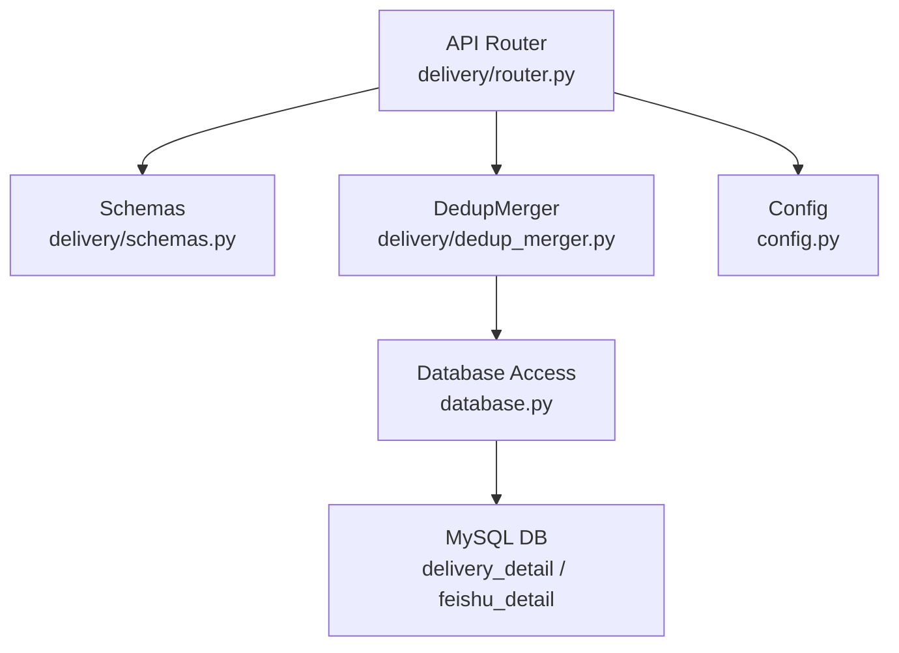
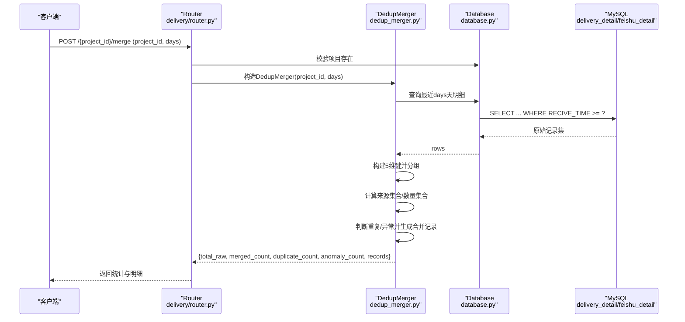
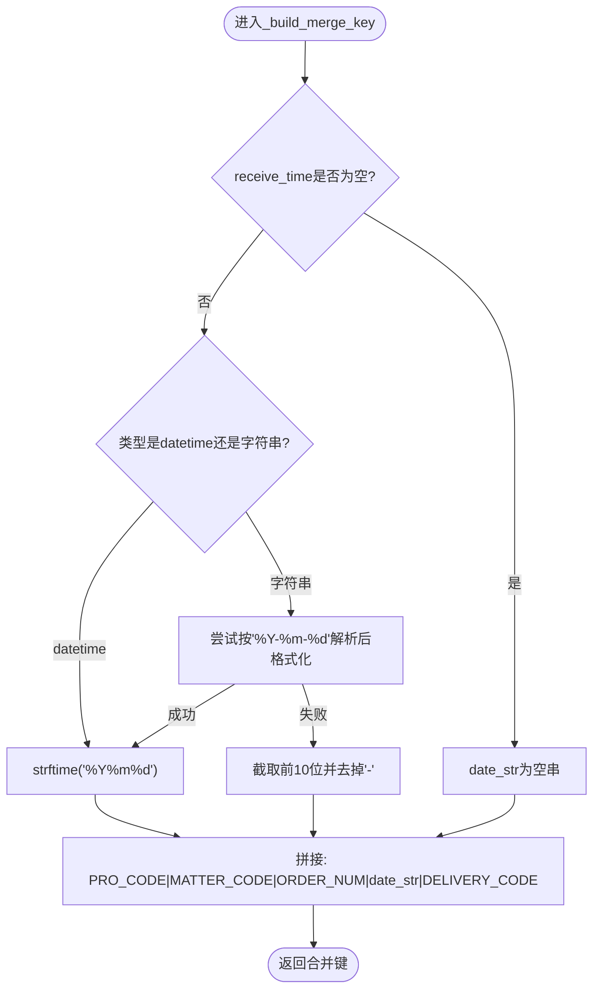
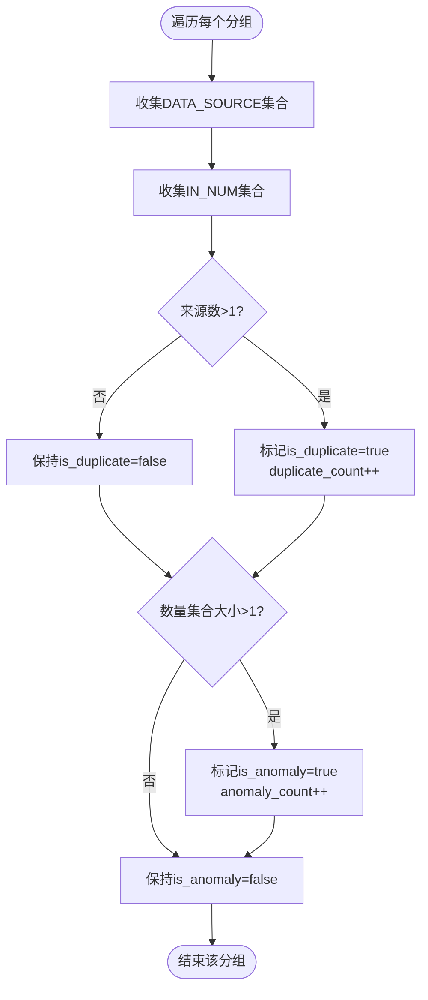
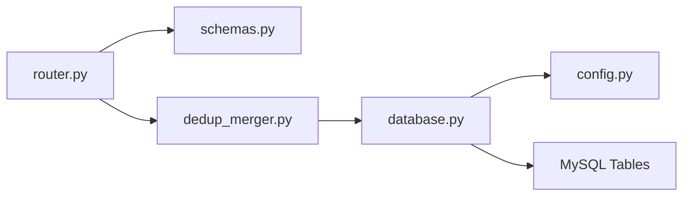

# 去重合并算法

<cite>
**本文引用的文件**
- [backend/delivery/dedup_merger.py](file://backend/delivery/dedup_merger.py)
- [backend/delivery/schemas.py](file://backend/delivery/schemas.py)
- [backend/delivery/router.py](file://backend/delivery/router.py)
- [backend/database.py](file://backend/database.py)
- [backend/config.py](file://backend/config.py)
</cite>

## 目录
1. [简介](#简介)
2. [项目结构](#项目结构)
3. [核心组件](#核心组件)
4. [架构总览](#架构总览)
5. [详细组件分析](#详细组件分析)
6. [依赖关系分析](#依赖关系分析)
7. [性能考虑](#性能考虑)
8. [故障排查指南](#故障排查指南)
9. [结论](#结论)
10. [附录](#附录)

## 简介
本文件围绕“多源到货数据去重合并”的算法与实现进行系统化说明，重点覆盖：
- 5维匹配键构建逻辑（项目号、零件号、数量、时间、单据号）
- 日期格式化处理与时间窗口设置
- 重复检测策略（同一天内多源识别、来源数统计、冲突检测）
- 数据融合逻辑（主记录选择规则、字段优先级、异常标记）
- 合并结果结构与统计信息（重复计数、异常计数、数据来源追踪）
- 算法配置选项与性能优化建议

该能力服务于仓库WMS与飞书共享表等多源到货数据的统一视图与质量治理。

## 项目结构
与去重合并直接相关的后端模块位于 delivery 子模块，包含路由、请求/响应模型定义以及核心合并器实现；数据库访问通过统一的 database 模块提供；服务配置由 config 模块管理。

图表来源
- [backend/delivery/router.py:229-259](file://backend/delivery/router.py#L229-L259)
- [backend/delivery/schemas.py:6-30](file://backend/delivery/schemas.py#L6-L30)
- [backend/delivery/dedup_merger.py:7-128](file://backend/delivery/dedup_merger.py#L7-L128)
- [backend/database.py:51-85](file://backend/database.py#L51-L85)
- [backend/config.py:48-102](file://backend/config.py#L48-L102)

章节来源
- [backend/delivery/router.py:229-259](file://backend/delivery/router.py#L229-L259)
- [backend/delivery/schemas.py:6-30](file://backend/delivery/schemas.py#L6-L30)
- [backend/delivery/dedup_merger.py:7-128](file://backend/delivery/dedup_merger.py#L7-L128)
- [backend/database.py:51-85](file://backend/database.py#L51-L85)
- [backend/config.py:48-102](file://backend/config.py#L48-L102)

## 核心组件
- DedupMerger：负责从数据库拉取最近N天的原始到货明细，基于5维键分组、去重、冲突检测与结果聚合。
- Schemas：定义合并请求参数与返回结构，约束字段类型与默认值。
- Router：暴露REST接口，接收项目ID与时间窗口，调用合并器并返回统计与明细。
- Database：封装连接池与查询方法，供合并器读取原始数据。
- Config：集中管理数据库与服务配置。

章节来源
- [backend/delivery/dedup_merger.py:7-128](file://backend/delivery/dedup_merger.py#L7-L128)
- [backend/delivery/schemas.py:6-30](file://backend/delivery/schemas.py#L6-L30)
- [backend/delivery/router.py:229-259](file://backend/delivery/router.py#L229-L259)
- [backend/database.py:51-85](file://backend/database.py#L51-L85)
- [backend/config.py:48-102](file://backend/config.py#L48-L102)

## 架构总览
下图展示了从HTTP请求到数据合并的完整流程，包括时间窗口过滤、5维键分组、重复与异常判定及结果组装。

图表来源
- [backend/delivery/router.py:229-259](file://backend/delivery/router.py#L229-L259)
- [backend/delivery/dedup_merger.py:36-128](file://backend/delivery/dedup_merger.py#L36-L128)
- [backend/database.py:51-85](file://backend/database.py#L51-L85)

## 详细组件分析

### 5维匹配键构建与日期处理
- 维度组成：项目号(PRO_CODE)、零件号(MATTER_CODE)、订单数量(ORDER_NUM)、收货时间(按天归一化)、送货单号(DELIVERY_CODE)。
- 时间归一化：将datetime或字符串形式的收货时间转换为“YYYYMMDD”，兼容多种输入格式；若解析失败则截取前10位并去除分隔符。
- 键拼接：使用固定分隔符将五维组合为稳定可比较的字符串键，用于后续分组。

图表来源
- [backend/delivery/dedup_merger.py:21-34](file://backend/delivery/dedup_merger.py#L21-L34)

章节来源
- [backend/delivery/dedup_merger.py:21-34](file://backend/delivery/dedup_merger.py#L21-L34)

### 时间窗口与数据获取
- 时间窗口：以当前时间为基准，向前推N天（days），仅查询该窗口内的明细，降低数据量并提升性能。
- 数据源：当前实现从 delivery_detail 表拉取数据；如需扩展至多源联合，可在SQL层合并或增加数据源标识。
- 排序：按收货时间倒序，便于后续主记录选择策略（如优先最新）。

章节来源
- [backend/delivery/dedup_merger.py:36-46](file://backend/delivery/dedup_merger.py#L36-L46)
- [backend/delivery/router.py:229-259](file://backend/delivery/router.py#L229-L259)

### 重复检测策略
- 分组依据：同一5维键下的所有记录视为一组候选重复。
- 多源重复判定：组内记录的数据来源(DATA_SOURCE)集合大小大于1即标记为多源重复。
- 冲突检测：组内记录的入库数量(IN_NUM)集合大小大于1即标记为异常（数量不一致）。
- 统计指标：累计重复组数与异常组数，便于质量评估。

图表来源
- [backend/delivery/dedup_merger.py:79-115](file://backend/delivery/dedup_merger.py#L79-L115)

章节来源
- [backend/delivery/dedup_merger.py:79-115](file://backend/delivery/dedup_merger.py#L79-L115)

### 数据融合逻辑与主记录选择
- 主记录选择：每组取第一条记录作为代表（group[0]），其关键字段（项目号、零件号、名称、订单号、入库数、收货时间等）被写入合并结果。
- 字段优先级：当前实现未做跨源字段优先级合并，而是沿用首条记录的值；如需更复杂的主次源优先级策略，可在分组后对组内记录排序再选取。
- 异常标记：当组内数量不一致时，输出 is_anomaly=true，便于下游人工复核或系统自动拦截。
- 来源追踪：输出 sources 列表与 source_count，明确记录来自哪些数据源。

章节来源
- [backend/delivery/dedup_merger.py:102-115](file://backend/delivery/dedup_merger.py#L102-L115)

### 合并结果结构与统计信息
- 顶层统计：
  - total_raw：原始记录总数
  - merged_count：合并后记录数
  - duplicate_count：多源重复组数
  - anomaly_count：异常组数（数量不一致）
- 明细记录字段：
  - merge_key：5维键
  - pro_code、matter_code、matter_name、order_num、in_num、receive_time
  - sources：来源列表
  - source_count：来源数量
  - is_duplicate：是否多源重复
  - is_anomaly：是否异常（数量不一致）

章节来源
- [backend/delivery/dedup_merger.py:48-128](file://backend/delivery/dedup_merger.py#L48-L128)
- [backend/delivery/schemas.py:11-30](file://backend/delivery/schemas.py#L11-L30)

### API与配置
- 接口：
  - POST /{project_id}/merge：执行去重合并，入参 project_id 与 days（默认7，范围1-365）
  - GET /{project_id}/merge-summary：返回合并摘要统计
- 配置项：
  - 数据库连接：host/port/user/password/database
  - 服务端口、调试开关、CORS等
  - 爬虫间隔与超时（与数据同步相关）

章节来源
- [backend/delivery/router.py:229-259](file://backend/delivery/router.py#L229-L259)
- [backend/delivery/schemas.py:6-9](file://backend/delivery/schemas.py#L6-L9)
- [backend/config.py:48-102](file://backend/config.py#L48-L102)

## 依赖关系分析
- Router 依赖 Schemas 进行请求校验，依赖 DedupMerger 执行合并。
- DedupMerger 依赖 Database 模块进行SQL查询。
- Database 模块依赖 Config 提供的数据库连接参数。
- 数据源表：delivery_detail（WMS）、feishu_detail（飞书），当前合并器聚焦于 delivery_detail，但数据结构与字段名在路由中体现双源一致性。

图表来源
- [backend/delivery/router.py:229-259](file://backend/delivery/router.py#L229-L259)
- [backend/delivery/dedup_merger.py:36-46](file://backend/delivery/dedup_merger.py#L36-L46)
- [backend/database.py:51-85](file://backend/database.py#L51-L85)
- [backend/config.py:48-102](file://backend/config.py#L48-L102)

章节来源
- [backend/delivery/router.py:229-259](file://backend/delivery/router.py#L229-L259)
- [backend/delivery/dedup_merger.py:36-46](file://backend/delivery/dedup_merger.py#L36-L46)
- [backend/database.py:51-85](file://backend/database.py#L51-L85)
- [backend/config.py:48-102](file://backend/config.py#L48-L102)

## 性能考虑
- 时间窗口限制：通过 days 参数限制查询范围，减少内存占用与计算量。
- 分组复杂度：O(N) 扫描+哈希分组，适合中等规模数据；超大时可考虑分片或增量合并。
- 数据库索引：建议在 RECIVE_TIME、PRO_CODE、MATTER_CODE、DELIVERY_CODE 上建立合适索引以提升查询效率。
- 批量与分页：合并过程一次性加载窗口内数据，若数据量增长，可引入分页或流式处理。
- 日志与监控：合并前后记录日志，便于定位瓶颈与异常。

[本节为通用性能建议，不直接分析具体代码文件]

## 故障排查指南
- 数据库连接失败：检查 backend/.env 中的 DB_HOST/DB_PORT/DB_USER/DB_PASSWORD/DB_DATABASE 配置是否正确。
- 无数据返回：确认 days 参数是否合理，RECIVE_TIME 字段是否存在且有效；核对 delivery_detail 表是否有数据。
- 重复/异常过多：检查 DELIVERY_CODE、ORDER_NUM、MATTER_CODE 等关键业务字段是否规范；必要时调整5维键策略或引入更细粒度匹配。
- 时间解析异常：确保 RECIVE_TIME 格式符合预期；若为字符串，需保证前10位可解析为日期。

章节来源
- [backend/database.py:12-43](file://backend/database.py#L12-L43)
- [backend/delivery/dedup_merger.py:21-34](file://backend/delivery/dedup_merger.py#L21-L34)
- [backend/delivery/router.py:229-259](file://backend/delivery/router.py#L229-L259)

## 结论
该去重合并算法以“5维匹配键”为核心，结合时间窗口与来源统计，实现了多源到货数据的快速去重与异常识别。当前实现简洁高效，适用于中小规模数据场景；未来可扩展多源联合查询、更灵活的主记录选择策略与增量合并机制，以支撑更大体量与更高时效性需求。

[本节为总结性内容，不直接分析具体代码文件]

## 附录

### API参考
- POST /{project_id}/merge
  - 入参：project_id（必填）、days（可选，默认7，范围1-365）
  - 返回：total_raw、merged_count、duplicate_count、anomaly_count、records
- GET /{project_id}/merge-summary
  - 入参：project_id（路径）、days（可选，默认7，范围1-365）
  - 返回：project_id、days、total_raw、merged_count、duplicate_count、anomaly_count

章节来源
- [backend/delivery/router.py:229-259](file://backend/delivery/router.py#L229-L259)
- [backend/delivery/schemas.py:6-30](file://backend/delivery/schemas.py#L6-L30)

### 数据模型
- MergeRequest：project_id、days
- MergeRecord：merge_key、pro_code、matter_code、matter_name、order_num、in_num、receive_time、sources、source_count、is_duplicate、is_anomaly
- MergeResult：total_raw、merged_count、duplicate_count、anomaly_count、records

章节来源
- [backend/delivery/schemas.py:6-30](file://backend/delivery/schemas.py#L6-L30)