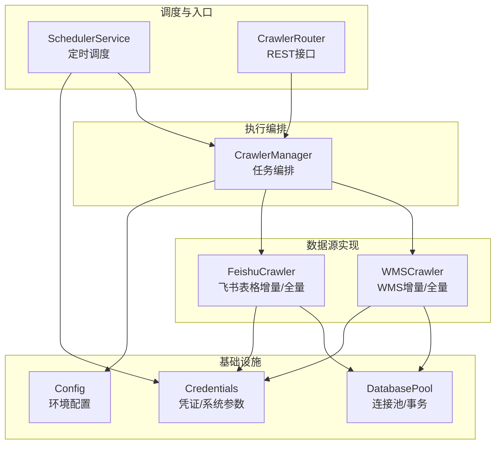
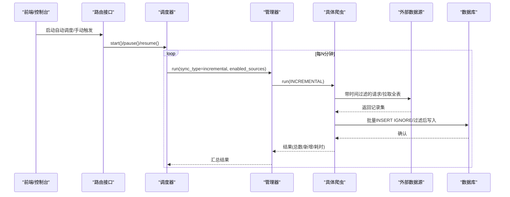
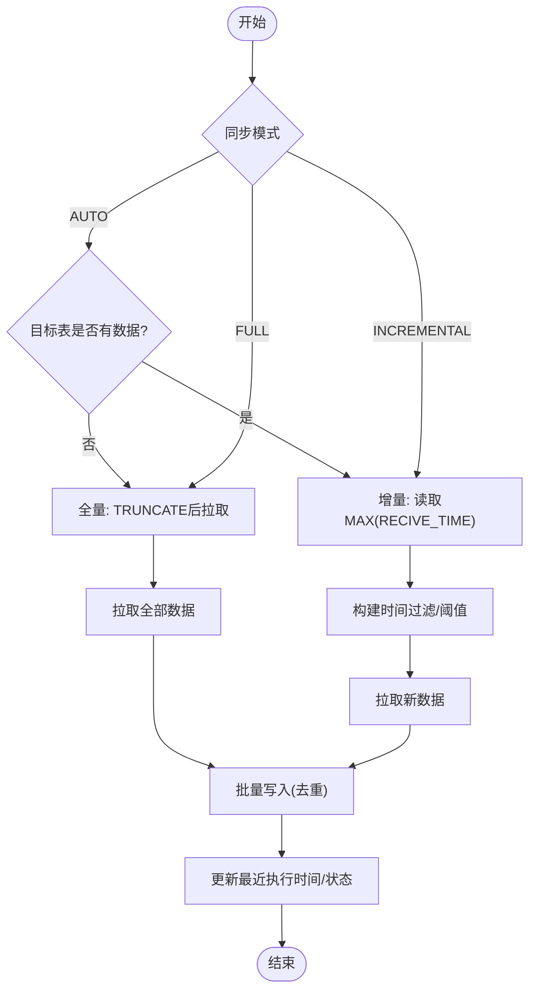
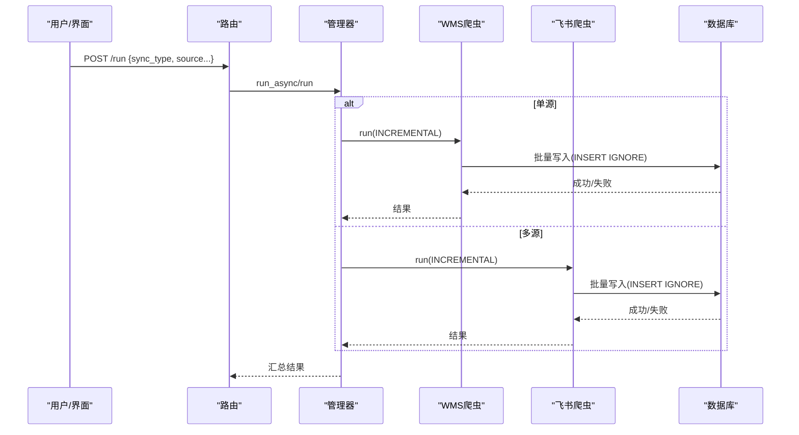
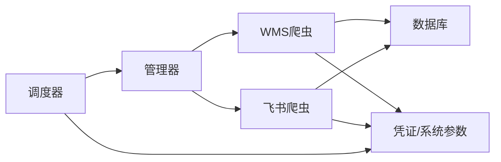

# 增量同步机制

<cite>
**本文引用的文件**
- [backend/crawlers/base.py](file://backend/crawlers/base.py)
- [backend/crawlers/wms_crawler.py](file://backend/crawlers/wms_crawler.py)
- [backend/crawlers/feishu_crawler.py](file://backend/crawlers/feishu_crawler.py)
- [backend/crawlers/crawler_manager.py](file://backend/crawlers/crawler_manager.py)
- [backend/scheduling/scheduler.py](file://backend/scheduling/scheduler.py)
- [backend/system/credentials.py](file://backend/system/credentials.py)
- [backend/database.py](file://backend/database.py)
- [backend/config.py](file://backend/config.py)
- [backend/crawlers/router.py](file://backend/crawlers/router.py)
- [backend/modules/resource/services/gantt_service.py](file://backend/modules/resource/services/gantt_service.py)
</cite>

## 目录
1. [简介](#简介)
2. [项目结构](#项目结构)
3. [核心组件](#核心组件)
4. [架构总览](#架构总览)
5. [详细组件分析](#详细组件分析)
6. [依赖关系分析](#依赖关系分析)
7. [性能考虑](#性能考虑)
8. [故障排查指南](#故障排查指南)
9. [结论](#结论)
10. [附录](#附录)

## 简介
本文件系统性阐述本仓库的增量同步机制，覆盖变更检测算法（时间戳比较、版本号管理、状态标记）、执行流程（全量与增量切换、数据一致性保证、冲突解决规则）、版本控制系统（快照、变更历史、回滚）、监控与恢复（断点续传、错误重试、修复策略），以及性能优化与监控告警。

## 项目结构
后端以“爬虫基类 + 多数据源实现 + 统一管理器 + 定时调度器”的分层组织方式实现增量同步：
- 基类定义同步类型与结果模型
- WMS/飞书等具体爬虫实现各自的数据拉取、过滤与入库逻辑
- 管理器统一编排多个爬虫的执行与状态聚合
- 调度器按配置周期触发自动增量同步
- 凭证与系统参数集中管理，支撑认证与运行控制
- 数据库连接池封装提供稳定读写能力

**图表来源**
- [backend/scheduling/scheduler.py:16-196](file://backend/scheduling/scheduler.py#L16-L196)
- [backend/crawlers/crawler_manager.py:22-305](file://backend/crawlers/crawler_manager.py#L22-L305)
- [backend/crawlers/wms_crawler.py:44-477](file://backend/crawlers/wms_crawler.py#L44-L477)
- [backend/crawlers/feishu_crawler.py:55-419](file://backend/crawlers/feishu_crawler.py#L55-L419)
- [backend/database.py:12-116](file://backend/database.py#L12-L116)
- [backend/config.py:48-102](file://backend/config.py#L48-L102)
- [backend/system/credentials.py:297-441](file://backend/system/credentials.py#L297-L441)

**章节来源**
- [backend/scheduling/scheduler.py:16-196](file://backend/scheduling/scheduler.py#L16-L196)
- [backend/crawlers/crawler_manager.py:22-305](file://backend/crawlers/crawler_manager.py#L22-L305)
- [backend/crawlers/wms_crawler.py:44-477](file://backend/crawlers/wms_crawler.py#L44-L477)
- [backend/crawlers/feishu_crawler.py:55-419](file://backend/crawlers/feishu_crawler.py#L55-L419)
- [backend/database.py:12-116](file://backend/database.py#L12-L116)
- [backend/config.py:48-102](file://backend/config.py#L48-L102)
- [backend/system/credentials.py:297-441](file://backend/system/credentials.py#L297-L441)

## 核心组件
- 同步类型与结果模型：定义 AUTO/FULL/INCREMENTAL 三种模式与执行结果字段（总量、新增、更新、消息、错误）
- 爬虫基类：抽象 run/get_status 接口，统一日志与进度上报
- WMS 爬虫：基于服务端 filter 的时间范围增量拉取；本地去重插入；UTC/北京时间转换
- 飞书爬虫：分页读取表格数据；本地 RECIVE_TIME 阈值过滤；批量插入
- 管理器：统一启动、异步执行、停止信号、结果汇总
- 调度器：后台线程按间隔执行自动增量同步，支持暂停/恢复/重载配置
- 凭证与系统参数：保存登录凭据、Token、启用数据源列表、执行间隔等
- 数据库：连接池、事务封装、批量写入

**章节来源**
- [backend/crawlers/base.py:12-67](file://backend/crawlers/base.py#L12-L67)
- [backend/crawlers/wms_crawler.py:127-310](file://backend/crawlers/wms_crawler.py#L127-L310)
- [backend/crawlers/feishu_crawler.py:205-249](file://backend/crawlers/feishu_crawler.py#L205-L249)
- [backend/crawlers/crawler_manager.py:22-305](file://backend/crawlers/crawler_manager.py#L22-L305)
- [backend/scheduling/scheduler.py:16-196](file://backend/scheduling/scheduler.py#L16-L196)
- [backend/system/credentials.py:297-441](file://backend/system/credentials.py#L297-L441)
- [backend/database.py:12-116](file://backend/database.py#L12-L116)

## 架构总览
增量同步由“调度器 -> 管理器 -> 具体爬虫 -> 外部API/表格 -> 数据库”的链路构成。调度器根据系统参数决定何时执行增量同步；管理器负责实例化并调用各爬虫；爬虫通过各自协议获取数据并按增量条件过滤后落库；数据库提供连接池与事务保障。

**图表来源**
- [backend/scheduling/scheduler.py:93-196](file://backend/scheduling/scheduler.py#L93-L196)
- [backend/crawlers/crawler_manager.py:113-305](file://backend/crawlers/crawler_manager.py#L113-L305)
- [backend/crawlers/wms_crawler.py:313-467](file://backend/crawlers/wms_crawler.py#L313-L467)
- [backend/crawlers/feishu_crawler.py:251-419](file://backend/crawlers/feishu_crawler.py#L251-L419)
- [backend/database.py:73-116](file://backend/database.py#L73-L116)

## 详细组件分析

### 变更检测算法
- 时间戳比较
  - WMS：从 delivery_detail 表查询最大 RECIVE_TIME，转换为 UTC 字符串作为服务端 filter 条件（严格大于），仅拉取新增/变更记录
  - 飞书：从 feishu_detail 表查询最大 RECIVE_TIME，在本地逐行比对，跳过小于等于阈值的记录
- 版本号管理
  - 未显式维护独立版本号字段，采用“最近一次成功同步时间”作为隐式版本锚点（system_params 中 crawler_last_run_at / crawler_last_full_run_at）
  - 每次自动同步完成后更新最近执行时间与状态
- 状态标记
  - 爬虫级别：IDLE/RUNNING/SUCCESS/FAILED/CANCELLED
  - 任务级：running/end_time/result/status（异步任务元信息）
  - 调度器：running/paused/interval_minutes/last_run_at

**图表来源**
- [backend/crawlers/wms_crawler.py:313-364](file://backend/crawlers/wms_crawler.py#L313-L364)
- [backend/crawlers/feishu_crawler.py:273-294](file://backend/crawlers/feishu_crawler.py#L273-L294)
- [backend/system/credentials.py:404-418](file://backend/system/credentials.py#L404-L418)

**章节来源**
- [backend/crawlers/wms_crawler.py:216-271](file://backend/crawlers/wms_crawler.py#L216-L271)
- [backend/crawlers/feishu_crawler.py:205-220](file://backend/crawlers/feishu_crawler.py#L205-L220)
- [backend/system/credentials.py:297-418](file://backend/system/credentials.py#L297-L418)

### 增量同步执行流程
- 全量扫描与增量更新的切换逻辑
  - 自动模式：若目标表有数据则走增量，否则走全量
  - 强制全量：可通过请求参数 force_full 或 sync_type=full 触发
- 数据一致性保证策略
  - 使用 INSERT IGNORE 避免重复插入（基于业务主键/唯一约束）
  - 数据库写操作封装为事务提交，失败时回滚
  - 时间戳严格大于比较，避免边界重复
- 冲突解决规则
  - 增量同步本身不直接产生资源占用冲突；冲突检测在排程模块中进行（gantt_conflicts），并提供解决/忽略状态流转，影响排程表的 has_conflict/conflict_count 标记

**图表来源**
- [backend/crawlers/router.py:89-147](file://backend/crawlers/router.py#L89-L147)
- [backend/crawlers/crawler_manager.py:113-305](file://backend/crawlers/crawler_manager.py#L113-L305)
- [backend/crawlers/wms_crawler.py:273-310](file://backend/crawlers/wms_crawler.py#L273-L310)
- [backend/crawlers/feishu_crawler.py:222-249](file://backend/crawlers/feishu_crawler.py#L222-L249)
- [backend/database.py:73-116](file://backend/database.py#L73-L116)

**章节来源**
- [backend/crawlers/wms_crawler.py:313-467](file://backend/crawlers/wms_crawler.py#L313-L467)
- [backend/crawlers/feishu_crawler.py:251-419](file://backend/crawlers/feishu_crawler.py#L251-L419)
- [backend/database.py:73-116](file://backend/database.py#L73-L116)
- [backend/modules/resource/services/gantt_service.py:1029-1252](file://backend/modules/resource/services/gantt_service.py#L1029-L1252)

### 版本控制系统设计
- 数据快照管理
  - 全量同步前清空目标表，形成“时间点快照”
  - 增量同步基于时间戳增量追加，不破坏历史
- 变更历史追踪
  - system_params 记录最近一次执行时间、状态、最近一次全量执行时间
  - 爬虫内部日志保留最近若干条，便于回溯
- 回滚机制
  - 当前未实现跨版本快照回滚；如需回滚可结合“再次全量覆盖”或“按时间窗口重建表”的方式实现

**章节来源**
- [backend/system/credentials.py:297-418](file://backend/system/credentials.py#L297-L418)
- [backend/crawlers/wms_crawler.py:344-364](file://backend/crawlers/wms_crawler.py#L344-L364)
- [backend/crawlers/feishu_crawler.py:283-294](file://backend/crawlers/feishu_crawler.py#L283-L294)

### 同步状态监控与故障恢复
- 断点续传
  - 基于 MAX(RECIVE_TIME) 的增量起点，天然具备断点续传能力
- 错误重试
  - 网络超时/连接异常采用指数退避重试（WMS/飞书均实现）
- 数据修复策略
  - 对异常字段进行规范化（如时间格式、数值类型、仓库名称归一化）
  - 批量写入失败时记录日志并继续后续批次，降低单次失败影响面
- 调度器容错
  - 读取配置失败、执行异常时等待并重试；支持暂停/恢复避免与手动任务冲突

**章节来源**
- [backend/crawlers/wms_crawler.py:180-213](file://backend/crawlers/wms_crawler.py#L180-L213)
- [backend/crawlers/feishu_crawler.py:132-203](file://backend/crawlers/feishu_crawler.py#L132-L203)
- [backend/scheduling/scheduler.py:93-196](file://backend/scheduling/scheduler.py#L93-L196)

### 冲突检测与处理（关联模块）
- 冲突检测：基于资源占用时间段重叠计算，生成 gantt_conflicts 记录，并更新相关排程记录的冲突计数与标记
- 冲突处理：支持“解决/忽略”，处理后重新统计剩余开放冲突数并刷新排程表标记

**章节来源**
- [backend/modules/resource/services/gantt_service.py:832-860](file://backend/modules/resource/services/gantt_service.py#L832-L860)
- [backend/modules/resource/services/gantt_service.py:1029-1252](file://backend/modules/resource/services/gantt_service.py#L1029-L1252)

## 依赖关系分析
- 低耦合高内聚：每个爬虫只关注自身数据源协议与入库映射；管理器负责编排；调度器只关心配置与周期
- 外部依赖：WMS API、飞书 Sheets API、MySQL 数据库
- 关键依赖链：调度器 -> 管理器 -> 爬虫 -> 外部API/表格 -> 数据库
- 潜在循环依赖：无直接循环；通过延迟导入避免启动期耦合

**图表来源**
- [backend/scheduling/scheduler.py:16-196](file://backend/scheduling/scheduler.py#L16-L196)
- [backend/crawlers/crawler_manager.py:22-305](file://backend/crawlers/crawler_manager.py#L22-L305)
- [backend/crawlers/wms_crawler.py:44-477](file://backend/crawlers/wms_crawler.py#L44-L477)
- [backend/crawlers/feishu_crawler.py:55-419](file://backend/crawlers/feishu_crawler.py#L55-L419)
- [backend/system/credentials.py:297-441](file://backend/system/credentials.py#L297-L441)

**章节来源**
- [backend/scheduling/scheduler.py:16-196](file://backend/scheduling/scheduler.py#L16-L196)
- [backend/crawlers/crawler_manager.py:22-305](file://backend/crawlers/crawler_manager.py#L22-L305)
- [backend/system/credentials.py:297-441](file://backend/system/credentials.py#L297-L441)

## 性能考虑
- 批量写入：使用 executemany 批量插入，减少往返开销
- 去重策略：INSERT IGNORE 利用唯一约束避免重复写入
- 分页拉取：WMS 按页拉取，飞书按行块拉取，控制内存占用
- 连接复用：requests.Session 复用连接；数据库连接池复用连接
- 重试与退避：网络异常指数退避，提高稳定性
- 建议优化
  - 为 delivery_detail/feishu_detail 的 RECIVE_TIME 建立索引，提升 MAX 查询效率
  - 合理设置 PAGE_SIZE/BATCH_SIZE，平衡吞吐与内存
  - 对高频访问的 system_params 增加缓存层，减少频繁读库

[本节为通用性能建议，无需特定文件引用]

## 故障排查指南
- 常见问题定位
  - 凭证无效：检查 spider_credentials 中对应 source 的 authorization/cookie 是否有效
  - 飞书 Token 过期：检查 config_json 中的 expire_at，必要时强制刷新
  - 时间戳不一致：确认 WMS 的 UTC/北京时间转换是否正确
  - 调度器未执行：检查 system_params 中的 crawler_mode 与 interval_minutes
- 日志与状态
  - 查看爬虫实时日志与进度（manager.get_all/get_status）
  - 查看调度器状态（running/paused/last_run_at）
- 恢复步骤
  - 修正凭证后重启调度器或触发一次增量同步
  - 若数据严重不一致，可执行一次全量覆盖

**章节来源**
- [backend/crawlers/wms_crawler.py:64-109](file://backend/crawlers/wms_crawler.py#L64-L109)
- [backend/crawlers/feishu_crawler.py:263-271](file://backend/crawlers/feishu_crawler.py#L263-L271)
- [backend/system/credentials.py:509-573](file://backend/system/credentials.py#L509-L573)
- [backend/scheduling/scheduler.py:67-74](file://backend/scheduling/scheduler.py#L67-L74)

## 结论
本系统的增量同步以“时间戳锚点 + 服务端过滤/本地过滤 + 批量去重写入”为核心，配合调度器的周期性自动执行与管理器的统一编排，实现了稳定、可扩展的多源数据同步。通过完善的日志、重试与状态标记，系统在异常场景下具备良好的可观测性与恢复能力。未来可在索引优化、缓存层与更细粒度的冲突解决策略上持续改进。

## 附录
- 关键配置项（system_params）
  - crawler_mode：auto/manual
  - crawler_incremental_interval_minutes：增量同步间隔（分钟）
  - crawler_enabled_sources：启用的数据源（逗号分隔）
  - crawler_last_run_at / crawler_last_full_run_at：最近执行时间
  - crawler_auto_login：是否自动登录刷新 token
- 关键接口
  - /crawlers/config：读取/保存同步配置
  - /crawlers/run：触发同步（支持 source/sync_type/enabled_sources）
  - /crawlers/start_scheduler / stop_scheduler：启停自动调度
  - /crawlers/status：查询所有爬虫状态与配置

**章节来源**
- [backend/system/credentials.py:297-441](file://backend/system/credentials.py#L297-L441)
- [backend/crawlers/router.py:43-201](file://backend/crawlers/router.py#L43-L201)