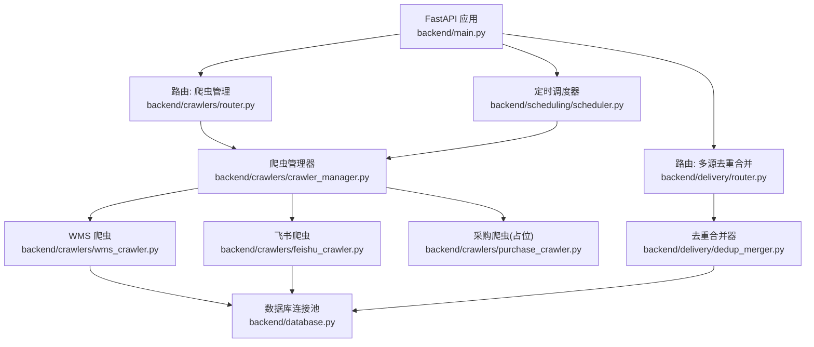
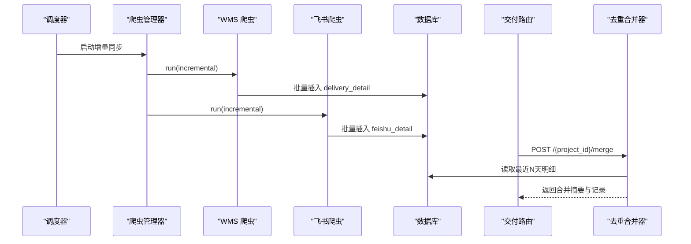
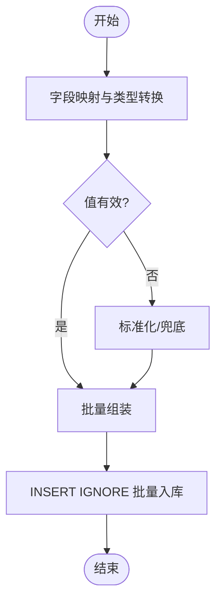
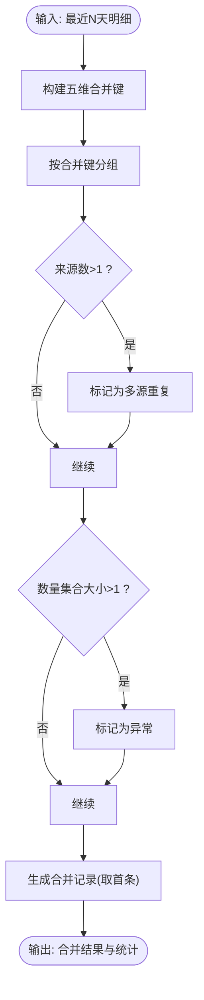
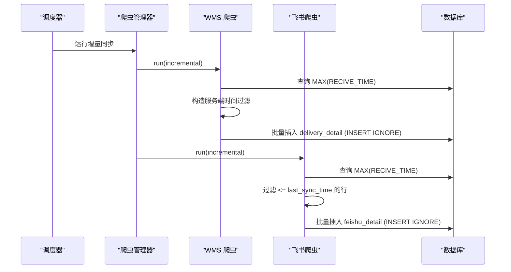
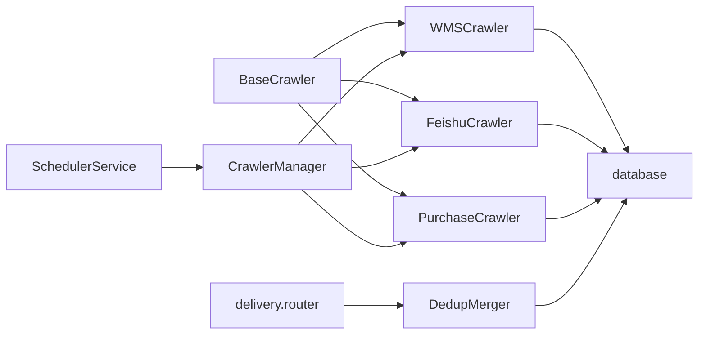

# 数据处理流程

<cite>
**本文引用的文件**
- [backend/main.py](file://backend/main.py)
- [backend/config.py](file://backend/config.py)
- [backend/database.py](file://backend/database.py)
- [backend/crawlers/base.py](file://backend/crawlers/base.py)
- [backend/crawlers/wms_crawler.py](file://backend/crawlers/wms_crawler.py)
- [backend/crawlers/feishu_crawler.py](file://backend/crawlers/feishu_crawler.py)
- [backend/crawlers/purchase_crawler.py](file://backend/crawlers/purchase_crawler.py)
- [backend/crawlers/crawler_manager.py](file://backend/crawlers/crawler_manager.py)
- [backend/scheduling/scheduler.py](file://backend/scheduling/scheduler.py)
- [backend/delivery/router.py](file://backend/delivery/router.py)
- [backend/delivery/dedup_merger.py](file://backend/delivery/dedup_merger.py)
- [backend/delivery/schemas.py](file://backend/delivery/schemas.py)
</cite>

## 目录
1. [简介](#简介)
2. [项目结构](#项目结构)
3. [核心组件](#核心组件)
4. [架构总览](#架构总览)
5. [详细组件分析](#详细组件分析)
6. [依赖关系分析](#依赖关系分析)
7. [性能考虑](#性能考虑)
8. [故障排查指南](#故障排查指南)
9. [结论](#结论)
10. [附录](#附录)

## 简介
本文件面向“数据采集后的清洗转换与融合”这一核心目标，系统化梳理从多源采集、数据清洗标准化、字段映射与类型转换，到去重合并、增量同步、版本控制与一致性保障、数据质量检查规则以及管道设计与最佳实践。文档同时给出关键流程图与时序图，帮助读者快速理解端到端的数据处理流水线。

## 项目结构
后端采用 FastAPI 作为服务入口，模块按职责划分：
- 爬虫层：WMS、飞书、采购（待实现）等数据源接入
- 调度层：定时任务自动执行增量同步
- 管理层：统一调度与管理爬虫实例
- 存储层：数据库连接池与通用读写封装
- 交付层：多源到货数据的查询、统计与去重合并
- 配置与日志：全局配置、健康检查、CORS、异常处理

图表来源
- [backend/main.py:29-83](file://backend/main.py#L29-L83)
- [backend/crawlers/crawler_manager.py:90-97](file://backend/crawlers/crawler_manager.py#L90-L97)
- [backend/delivery/router.py:229-259](file://backend/delivery/router.py#L229-L259)
- [backend/delivery/dedup_merger.py:7-128](file://backend/delivery/dedup_merger.py#L7-L128)
- [backend/scheduling/scheduler.py:16-196](file://backend/scheduling/scheduler.py#L16-L196)

章节来源
- [backend/main.py:29-83](file://backend/main.py#L29-L83)
- [backend/config.py:48-102](file://backend/config.py#L48-L102)

## 核心组件
- 爬虫基类与结果模型：定义统一的爬取接口、状态枚举与结果结构
- WMS 爬虫：对接仓库系统 API，支持增量/全量、分页拉取、时间过滤、批量入库
- 飞书爬虫：读取共享表格，字段映射、值规范化、批量入库
- 爬虫管理器：注册/调度多个爬虫，支持同步/异步执行、停止标志、任务追踪
- 调度器：后台线程按配置周期触发增量同步，避免与手动任务冲突
- 数据库封装：连接池、事务化写操作、批量写入
- 去重合并器：基于五维键的重复检测、异常标记与合并输出
- 路由与模式：REST 接口暴露查询、统计、合并能力；Pydantic 校验请求体

章节来源
- [backend/crawlers/base.py:12-67](file://backend/crawlers/base.py#L12-L67)
- [backend/crawlers/wms_crawler.py:44-477](file://backend/crawlers/wms_crawler.py#L44-L477)
- [backend/crawlers/feishu_crawler.py:55-419](file://backend/crawlers/feishu_crawler.py#L55-L419)
- [backend/crawlers/crawler_manager.py:22-305](file://backend/crawlers/crawler_manager.py#L22-L305)
- [backend/scheduling/scheduler.py:16-196](file://backend/scheduling/scheduler.py#L16-L196)
- [backend/database.py:12-116](file://backend/database.py#L12-L116)
- [backend/delivery/dedup_merger.py:7-128](file://backend/delivery/dedup_merger.py#L7-L128)
- [backend/delivery/schemas.py:6-30](file://backend/delivery/schemas.py#L6-L30)

## 架构总览
下图展示从采集到融合的完整链路：调度器周期性触发爬虫管理器，管理器调用具体爬虫；爬虫将原始数据清洗后落库；交付层提供去重合并接口，对多源数据进行五维匹配与异常识别。

图表来源
- [backend/scheduling/scheduler.py:155-184](file://backend/scheduling/scheduler.py#L155-L184)
- [backend/crawlers/crawler_manager.py:200-301](file://backend/crawlers/crawler_manager.py#L200-L301)
- [backend/crawlers/wms_crawler.py:313-457](file://backend/crawlers/wms_crawler.py#L313-L457)
- [backend/crawlers/feishu_crawler.py:251-399](file://backend/crawlers/feishu_crawler.py#L251-L399)
- [backend/delivery/router.py:229-259](file://backend/delivery/router.py#L229-L259)
- [backend/delivery/dedup_merger.py:48-128](file://backend/delivery/dedup_merger.py#L48-L128)

## 详细组件分析

### 数据采集与清洗转换
- 字段映射与类型转换
  - WMS：将 API 返回字段映射至 delivery_detail 表字段，数值型字段强制转 int，RECIVE_TIME 做时区转换（UTC→北京时间），空值兜底为默认值
  - 飞书：通过列索引映射至 feishu_detail，日期多种格式解析并统一为标准字符串，数量字段清理逗号后转整型，仓库名称归一化
- 数据验证与标准化
  - 空值/空白统一为空串或默认值
  - 日期解析失败回退为截取前19字符
  - 状态字段在查询时进行空值规范化（如“未标注”）
- 批量入库与去重
  - 使用 INSERT IGNORE 避免重复插入
  - 分批提交，降低单次负载

图表来源
- [backend/crawlers/wms_crawler.py:273-310](file://backend/crawlers/wms_crawler.py#L273-L310)
- [backend/crawlers/feishu_crawler.py:84-111](file://backend/crawlers/feishu_crawler.py#L84-L111)
- [backend/delivery/router.py:18-25](file://backend/delivery/router.py#L18-L25)

章节来源
- [backend/crawlers/wms_crawler.py:237-310](file://backend/crawlers/wms_crawler.py#L237-L310)
- [backend/crawlers/feishu_crawler.py:84-111](file://backend/crawlers/feishu_crawler.py#L84-L111)
- [backend/delivery/router.py:18-25](file://backend/delivery/router.py#L18-L25)

### 去重合并算法
- 五维匹配键：项目号 + 零件号 + 数量 + 接收日期（天级）+ 单据号
- 重复检测策略：同一合并键下若来源数 > 1，则标记为多源重复
- 冲突解决规则：同一合并键下数量不一致，标记为异常；合并结果以组内第一条为准
- 数据融合逻辑：聚合 sources、source_count、is_duplicate、is_anomaly 等元信息

图表来源
- [backend/delivery/dedup_merger.py:21-34](file://backend/delivery/dedup_merger.py#L21-L34)
- [backend/delivery/dedup_merger.py:64-115](file://backend/delivery/dedup_merger.py#L64-L115)

章节来源
- [backend/delivery/dedup_merger.py:7-128](file://backend/delivery/dedup_merger.py#L7-L128)
- [backend/delivery/router.py:229-259](file://backend/delivery/router.py#L229-L259)
- [backend/delivery/schemas.py:6-30](file://backend/delivery/schemas.py#L6-L30)

### 增量同步机制
- 变更检测
  - WMS：根据数据库中最大 RECIVE_TIME，构造服务端 filter 条件（严格大于），仅拉取新增/变更记录
  - 飞书：读取数据库中最大 RECIVE_TIME，跳过小于等于该时间的行
- 版本控制
  - 全量模式：TRUNCATE 目标表后重新拉取
  - 增量模式：基于时间戳过滤，避免重复
- 数据一致性保证
  - 使用 INSERT IGNORE 防止重复插入
  - 数据库连接池与事务化写操作，异常时回滚
  - 爬虫状态与进度记录，便于中断恢复与监控

图表来源
- [backend/scheduling/scheduler.py:155-184](file://backend/scheduling/scheduler.py#L155-L184)
- [backend/crawlers/wms_crawler.py:216-271](file://backend/crawlers/wms_crawler.py#L216-L271)
- [backend/crawlers/wms_crawler.py:313-457](file://backend/crawlers/wms_crawler.py#L313-L457)
- [backend/crawlers/feishu_crawler.py:205-249](file://backend/crawlers/feishu_crawler.py#L205-L249)
- [backend/crawlers/feishu_crawler.py:251-399](file://backend/crawlers/feishu_crawler.py#L251-L399)

章节来源
- [backend/crawlers/wms_crawler.py:216-271](file://backend/crawlers/wms_crawler.py#L216-L271)
- [backend/crawlers/feishu_crawler.py:205-249](file://backend/crawlers/feishu_crawler.py#L205-L249)
- [backend/database.py:73-116](file://backend/database.py#L73-L116)

### 数据质量检查规则
- 完整性验证
  - 空值/空白字段标准化为默认值或空串
  - 日期解析失败回退为截断字符串
- 业务规则校验
  - 状态字段空值统一为“未标注”，便于统计与筛选
  - 仓库名称归一化（内库/外库关键词映射）
- 异常数据处理
  - 去重合并阶段对“数量不一致”的记录标记异常
  - 爬虫异常捕获并记录错误信息，状态置为 FAILED

章节来源
- [backend/delivery/router.py:18-25](file://backend/delivery/router.py#L18-L25)
- [backend/crawlers/feishu_crawler.py:113-130](file://backend/crawlers/feishu_crawler.py#L113-L130)
- [backend/delivery/dedup_merger.py:94-100](file://backend/delivery/dedup_merger.py#L94-L100)
- [backend/crawlers/wms_crawler.py:459-467](file://backend/crawlers/wms_crawler.py#L459-L467)
- [backend/crawlers/feishu_crawler.py:401-409](file://backend/crawlers/feishu_crawler.py#L401-L409)

### 数据处理管道的设计模式与最佳实践
- 设计模式
  - 抽象基类 + 具体实现：BaseCrawler 统一接口，各数据源独立扩展
  - 管理器模式：CrawlerManager 集中注册与调度
  - 单例模式：数据库连接池、调度器、爬虫管理器
  - 批处理模式：批量插入减少网络与IO开销
- 最佳实践
  - 增量优先：默认 AUTO 模式根据是否有数据选择 FULL/INCREMENTAL
  - 幂等写入：INSERT IGNORE 避免重复
  - 可观测性：每爬虫维护 logs、progress、last_result，便于前端轮询
  - 优雅退出：支持 _stop_requested 标志，循环中检查并安全退出
  - 配置外置：环境变量集中管理，敏感信息不硬编码

章节来源
- [backend/crawlers/base.py:51-67](file://backend/crawlers/base.py#L51-L67)
- [backend/crawlers/crawler_manager.py:22-97](file://backend/crawlers/crawler_manager.py#L22-L97)
- [backend/database.py:12-43](file://backend/database.py#L12-L43)
- [backend/scheduling/scheduler.py:16-74](file://backend/scheduling/scheduler.py#L16-L74)
- [backend/config.py:48-102](file://backend/config.py#L48-L102)

## 依赖关系分析
- 低耦合高内聚：爬虫与数据库解耦，通过 database 模块访问；路由与合并逻辑分离
- 直接依赖
  - 爬虫 → database（读/写）、config（URL/超时等）
  - 管理器 → 各爬虫、logger
  - 调度器 → 管理器、系统配置
  - 交付路由 → 去重合并器、database
- 潜在风险
  - 外部 API 不稳定：需重试与超时保护（已实现指数退避）
  - 时间一致性问题：WMS 与数据库时区差异已在代码中处理
  - 大表查询性能：建议增加索引与分页限制

图表来源
- [backend/crawlers/base.py:51-67](file://backend/crawlers/base.py#L51-L67)
- [backend/crawlers/wms_crawler.py:44-477](file://backend/crawlers/wms_crawler.py#L44-L477)
- [backend/crawlers/feishu_crawler.py:55-419](file://backend/crawlers/feishu_crawler.py#L55-L419)
- [backend/crawlers/purchase_crawler.py:12-49](file://backend/crawlers/purchase_crawler.py#L12-L49)
- [backend/crawlers/crawler_manager.py:22-305](file://backend/crawlers/crawler_manager.py#L22-L305)
- [backend/scheduling/scheduler.py:16-196](file://backend/scheduling/scheduler.py#L16-L196)
- [backend/delivery/router.py:229-259](file://backend/delivery/router.py#L229-L259)
- [backend/delivery/dedup_merger.py:7-128](file://backend/delivery/dedup_merger.py#L7-L128)
- [backend/database.py:12-116](file://backend/database.py#L12-L116)

章节来源
- [backend/crawlers/crawler_manager.py:22-305](file://backend/crawlers/crawler_manager.py#L22-L305)
- [backend/scheduling/scheduler.py:16-196](file://backend/scheduling/scheduler.py#L16-L196)
- [backend/delivery/router.py:229-259](file://backend/delivery/router.py#L229-L259)
- [backend/delivery/dedup_merger.py:7-128](file://backend/delivery/dedup_merger.py#L7-L128)
- [backend/database.py:12-116](file://backend/database.py#L12-L116)

## 性能考虑
- 批量写入：使用 executemany 与 INSERT IGNORE，减少往返次数与重复冲突
- 分页拉取：WMS 按页拉取，控制内存占用；飞书按批次读取，避免一次性过大响应
- 连接复用：requests.Session 复用 TCP 连接；数据库连接池减少握手开销
- 重试与退避：网络异常指数退避重试，提升鲁棒性
- 增量优先：AUTO 模式智能切换 FULL/INCREMENTAL，降低无效数据量
- 日志限流：每个爬虫日志缓冲区上限，避免内存增长

章节来源
- [backend/crawlers/wms_crawler.py:180-213](file://backend/crawlers/wms_crawler.py#L180-L213)
- [backend/crawlers/wms_crawler.py:273-310](file://backend/crawlers/wms_crawler.py#L273-L310)
- [backend/crawlers/feishu_crawler.py:132-203](file://backend/crawlers/feishu_crawler.py#L132-L203)
- [backend/crawlers/feishu_crawler.py:222-249](file://backend/crawlers/feishu_crawler.py#L222-L249)
- [backend/database.py:104-116](file://backend/database.py#L104-L116)

## 故障排查指南
- 常见问题定位
  - 数据库连接失败：检查 .env 配置（DB_HOST/PORT/USER/PASSWORD/DATABASE）
  - 爬虫无数据：确认凭证有效、API 可达、时间过滤条件正确
  - 重复数据：确认 INSERT IGNORE 生效、增量时间戳是否更新
  - 合并异常：关注 is_anomaly 标记，核对数量字段一致性
- 日志与状态
  - 每个爬虫维护 logs、progress、last_result，可通过状态接口查看
  - 调度器状态包含 running/paused/interval_minutes/last_run_at
- 恢复机制
  - 支持中途停止：_stop_requested 标志，循环中检查并安全退出
  - 异常捕获：爬虫异常记录错误信息，状态置为 FAILED，不影响其他源

章节来源
- [backend/database.py:12-43](file://backend/database.py#L12-L43)
- [backend/crawlers/wms_crawler.py:459-467](file://backend/crawlers/wms_crawler.py#L459-L467)
- [backend/crawlers/feishu_crawler.py:401-409](file://backend/crawlers/feishu_crawler.py#L401-L409)
- [backend/scheduling/scheduler.py:67-74](file://backend/scheduling/scheduler.py#L67-L74)
- [backend/crawlers/crawler_manager.py:39-88](file://backend/crawlers/crawler_manager.py#L39-L88)

## 结论
本系统实现了从多源采集、清洗标准化、字段映射与类型转换，到去重合并与增量同步的完整数据处理流水线。通过抽象基类、管理器与调度器的协作，系统具备良好的可扩展性与可观测性；结合批量写入、重试退避与幂等插入，保障了性能与一致性。建议在后续迭代中持续完善采购系统接入、增强数据质量规则与监控告警能力。

## 附录
- 关键接口
  - 多源去重合并：POST /api/delivery/{project_id}/merge
  - 合并摘要：GET /api/delivery/{project_id}/merge-summary
  - 详情查询：GET /api/delivery/detail（支持分页、筛选、状态归一化）
  - 统计：GET /api/delivery/stats、/state-distribution、/feishu-state-distribution
- 配置项
  - 数据库、爬虫间隔、超时、CORS、服务器端口等均在 config.py 中集中管理

章节来源
- [backend/delivery/router.py:41-118](file://backend/delivery/router.py#L41-L118)
- [backend/delivery/router.py:121-164](file://backend/delivery/router.py#L121-L164)
- [backend/delivery/router.py:167-226](file://backend/delivery/router.py#L167-L226)
- [backend/delivery/router.py:229-259](file://backend/delivery/router.py#L229-L259)
- [backend/config.py:48-102](file://backend/config.py#L48-L102)