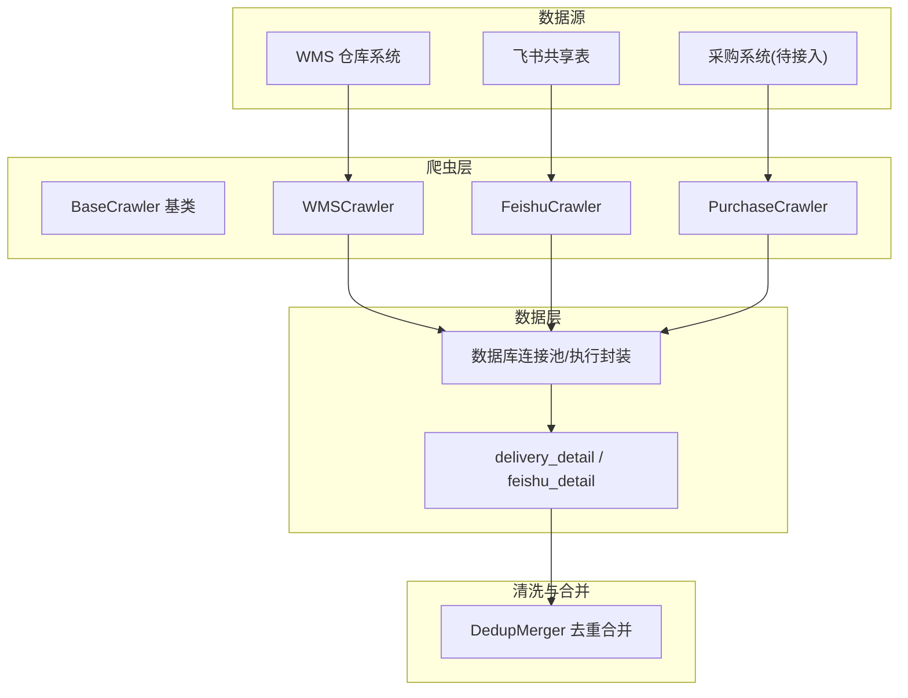
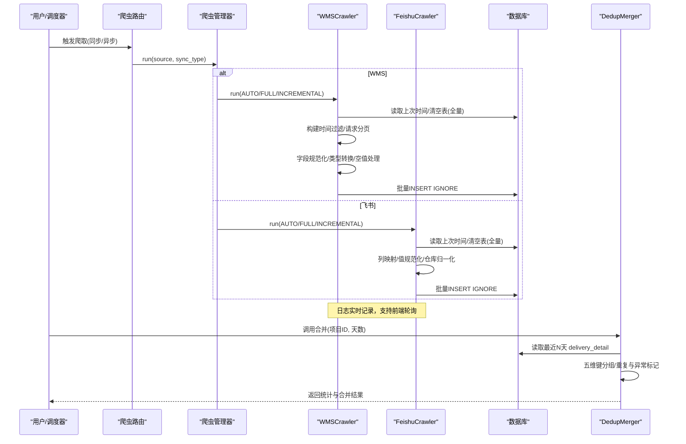
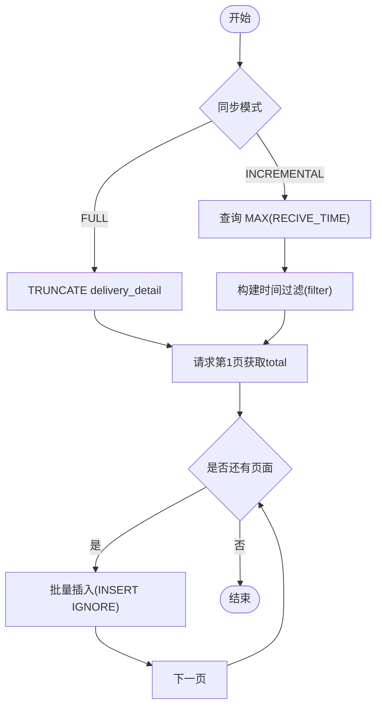
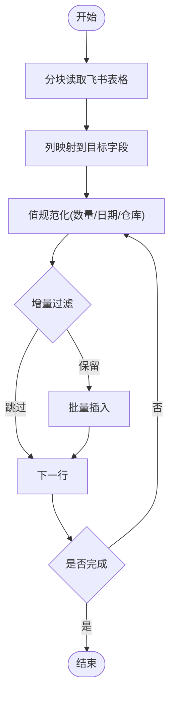
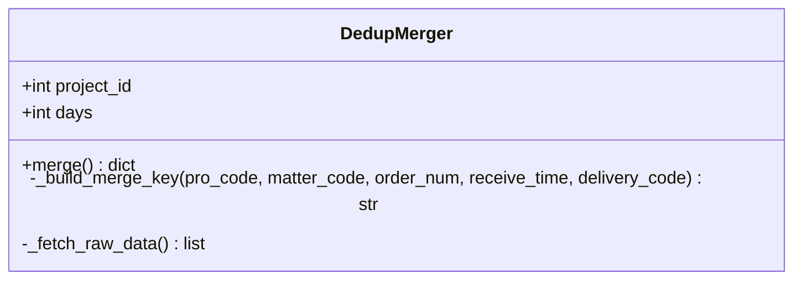
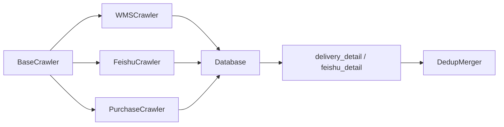

# 数据清洗转换

<cite>
**本文引用的文件**
- [backend/crawlers/base.py](file://backend/crawlers/base.py)
- [backend/crawlers/wms_crawler.py](file://backend/crawlers/wms_crawler.py)
- [backend/crawlers/feishu_crawler.py](file://backend/crawlers/feishu_crawler.py)
- [backend/crawlers/purchase_crawler.py](file://backend/crawlers/purchase_crawler.py)
- [backend/delivery/dedup_merger.py](file://backend/delivery/dedup_merger.py)
- [backend/delivery/schemas.py](file://backend/delivery/schemas.py)
- [backend/database.py](file://backend/database.py)
- [backend/config.py](file://backend/config.py)
- [backend/logger.py](file://backend/logger.py)
- [backend/system/credentials.py](file://backend/system/credentials.py)
- [backend/crawlers/router.py](file://backend/crawlers/router.py)
</cite>

## 目录
1. [简介](#简介)
2. [项目结构](#项目结构)
3. [核心组件](#核心组件)
4. [架构总览](#架构总览)
5. [详细组件分析](#详细组件分析)
6. [依赖关系分析](#依赖关系分析)
7. [性能考量](#性能考量)
8. [故障排查指南](#故障排查指南)
9. [结论](#结论)
10. [附录](#附录)

## 简介
本文件聚焦于“从不同数据源采集后的原始数据处理流程”，覆盖字段验证、格式标准化、类型转换、空值处理等关键步骤，并详细说明各数据源的特定清洗规则（WMS系统到货数据、飞书表格采购信息、采购系统订单数据）。同时描述数据质量检查机制（完整性校验、业务规则校验、异常标记与处理策略），以及数据清洗管道的设计模式与最佳实践（错误处理、日志记录、重试与幂等入库）。

## 项目结构
后端以爬虫为入口，分别对接 WMS、飞书、采购系统等外部数据源；通过统一的基类抽象运行状态、结果对象与日志；数据落库前进行字段规范化与类型转换；最后通过去重合并器对多源数据进行聚合与异常识别。

图表来源
- [backend/crawlers/base.py:51-67](file://backend/crawlers/base.py#L51-L67)
- [backend/crawlers/wms_crawler.py:44-47](file://backend/crawlers/wms_crawler.py#L44-L47)
- [backend/crawlers/feishu_crawler.py:55-58](file://backend/crawlers/feishu_crawler.py#L55-L58)
- [backend/crawlers/purchase_crawler.py:12-15](file://backend/crawlers/purchase_crawler.py#L12-L15)
- [backend/database.py:12-43](file://backend/database.py#L12-L43)
- [backend/delivery/dedup_merger.py:7-15](file://backend/delivery/dedup_merger.py#L7-L15)

章节来源
- [backend/crawlers/base.py:51-67](file://backend/crawlers/base.py#L51-L67)
- [backend/crawlers/wms_crawler.py:44-47](file://backend/crawlers/wms_crawler.py#L44-L47)
- [backend/crawlers/feishu_crawler.py:55-58](file://backend/crawlers/feishu_crawler.py#L55-L58)
- [backend/crawlers/purchase_crawler.py:12-15](file://backend/crawlers/purchase_crawler.py#L12-L15)
- [backend/database.py:12-43](file://backend/database.py#L12-L43)
- [backend/delivery/dedup_merger.py:7-15](file://backend/delivery/dedup_merger.py#L7-L15)

## 核心组件
- BaseCrawler：定义统一接口（run/get_status）、同步类型枚举、结果对象 CrawlerResult，提供 source_name 标识数据来源。
- WMSCrawler：对接 WMS 系统，增量/全量拉取到货明细，时间过滤、时区转换、批量插入、重试与日志。
- FeishuCrawler：读取飞书表格，列映射、单元格值规范化（日期/数量）、仓库名称归一化、批量插入。
- PurchaseCrawler：占位实现，预留采购系统 API 接入点。
- DedupMerger：基于五维键（项目号、零件号、数量、天级时间、单据号）进行多源去重合并，标记重复与异常。
- Database：连接池与查询/执行封装，支持事务回滚与批量写入。
- Config：集中配置（数据库、爬虫间隔、WMS/飞书/采购系统地址与密钥等）。
- Logger：统一日志输出（文件+控制台），按模块命名。
- Credentials：凭证管理与自动登录获取 Token（WMS、飞书）。

章节来源
- [backend/crawlers/base.py:12-67](file://backend/crawlers/base.py#L12-L67)
- [backend/crawlers/wms_crawler.py:44-47](file://backend/crawlers/wms_crawler.py#L44-L47)
- [backend/crawlers/feishu_crawler.py:55-58](file://backend/crawlers/feishu_crawler.py#L55-L58)
- [backend/crawlers/purchase_crawler.py:12-15](file://backend/crawlers/purchase_crawler.py#L12-L15)
- [backend/delivery/dedup_merger.py:7-15](file://backend/delivery/dedup_merger.py#L7-L15)
- [backend/database.py:12-43](file://backend/database.py#L12-L43)
- [backend/config.py:48-98](file://backend/config.py#L48-L98)
- [backend/logger.py:14-38](file://backend/logger.py#L14-L38)
- [backend/system/credentials.py:25-118](file://backend/system/credentials.py#L25-L118)

## 架构总览
下图展示从数据源到落库再到合并的端到端流程，包括清洗、转换、校验与异常处理。

图表来源
- [backend/crawlers/router.py:89-147](file://backend/crawlers/router.py#L89-L147)
- [backend/crawlers/wms_crawler.py:313-467](file://backend/crawlers/wms_crawler.py#L313-L467)
- [backend/crawlers/feishu_crawler.py:251-409](file://backend/crawlers/feishu_crawler.py#L251-L409)
- [backend/delivery/dedup_merger.py:48-128](file://backend/delivery/dedup_merger.py#L48-L128)
- [backend/database.py:51-116](file://backend/database.py#L51-L116)

## 详细组件分析

### WMS 到货数据清洗转换
- 同步模式识别：AUTO 根据 delivery_detail 是否有数据决定 FULL 或 INCREMENTAL；FULL 会 TRUNCATE 表。
- 增量条件：从 delivery_detail 取 MAX(RECIVE_TIME)，构造服务端 filter 数组（嵌套括号结构）传入 WMS API，仅拉取 RECIVE_TIME > last_time 的数据。
- 时区处理：API 返回 UTC 时间，入库前转换为北京时间（UTC+8）；向 API 传过滤条件时再转回 UTC。
- 字段规范化：
  - 数值字段 ORDER_NUM/SEND_NUM/RECIVE_NUM/IN_NUM/CANT_NUM 强制转为 int，非法则置 0。
  - 字符串字段 None 转空串。
  - RECIVE_TIME 标准化为 "YYYY-MM-DD HH:MM:SS"。
- 批量入库：使用 INSERT IGNORE 保证幂等，避免重复插入。
- 重试与超时：网络请求指数退避重试，失败页跳过并继续。
- 日志与进度：每页处理记录日志，支持前端轮询查看。

图表来源
- [backend/crawlers/wms_crawler.py:313-467](file://backend/crawlers/wms_crawler.py#L313-L467)
- [backend/crawlers/wms_crawler.py:127-178](file://backend/crawlers/wms_crawler.py#L127-L178)
- [backend/crawlers/wms_crawler.py:237-310](file://backend/crawlers/wms_crawler.py#L237-L310)

章节来源
- [backend/crawlers/wms_crawler.py:127-178](file://backend/crawlers/wms_crawler.py#L127-L178)
- [backend/crawlers/wms_crawler.py:216-310](file://backend/crawlers/wms_crawler.py#L216-L310)
- [backend/crawlers/wms_crawler.py:313-467](file://backend/crawlers/wms_crawler.py#L313-L467)

### 飞书表格采购信息清洗转换
- 数据获取：分块读取表格（避免10MB限制），逐批拼接 values。
- 列映射：将飞书列索引映射到目标字段（如 DELIVERY_CODE、PRO_NAME、MATTER_CODE 等）。
- 值规范化：
  - 数量字段 ORDER_NUM/RECIVE_NUM 去除逗号后转 int，非法置 0。
  - 日期字段 RECIVE_TIME 支持多种格式，统一为 "YYYY-MM-DD HH:MM:SS"。
  - 仓库名称 WH_NAME 归一化：内库关键词映射到“总院试制内库”，外库关键词映射到“总院试制外库”。
- 增量过滤：若存在上次 RECIVE_TIME，则跳过 <= 该时间的行。
- 批量入库：INSERT IGNORE 保证幂等。
- 日志与进度：每处理一定条数写入日志，支持前端轮询。

图表来源
- [backend/crawlers/feishu_crawler.py:132-203](file://backend/crawlers/feishu_crawler.py#L132-L203)
- [backend/crawlers/feishu_crawler.py:84-130](file://backend/crawlers/feishu_crawler.py#L84-L130)
- [backend/crawlers/feishu_crawler.py:251-409](file://backend/crawlers/feishu_crawler.py#L251-L409)

章节来源
- [backend/crawlers/feishu_crawler.py:84-130](file://backend/crawlers/feishu_crawler.py#L84-L130)
- [backend/crawlers/feishu_crawler.py:132-203](file://backend/crawlers/feishu_crawler.py#L132-L203)
- [backend/crawlers/feishu_crawler.py:251-409](file://backend/crawlers/feishu_crawler.py#L251-L409)

### 采购系统订单数据清洗转换（待实现）
- 当前为占位实现，返回失败状态并提示 API 尚未接入。
- 后续扩展建议：遵循 BaseCrawler 接口，实现 run() 与 get_status()，复用数据库封装与日志模块，保持与其他爬虫一致的清洗与入库流程。

章节来源
- [backend/crawlers/purchase_crawler.py:12-49](file://backend/crawlers/purchase_crawler.py#L12-L49)

### 多源去重合并与异常标记
- 五维匹配键：(项目号 PRO_CODE, 零件号 MATTER_CODE, 数量 ORDER_NUM, 天级时间 RECIVE_TIME, 单据号 DELIVERY_CODE)。
- 分组逻辑：按键分组，收集来源列表与数量集合。
- 重复与异常：
  - 多源重复：同一键下 sources 数量 > 1。
  - 异常：同一键下 IN_NUM 不一致。
- 输出：统计原始/合并/重复/异常数量及合并后记录。

图表来源
- [backend/delivery/dedup_merger.py:7-15](file://backend/delivery/dedup_merger.py#L7-L15)
- [backend/delivery/dedup_merger.py:21-46](file://backend/delivery/dedup_merger.py#L21-L46)
- [backend/delivery/dedup_merger.py:48-128](file://backend/delivery/dedup_merger.py#L48-L128)

章节来源
- [backend/delivery/dedup_merger.py:21-46](file://backend/delivery/dedup_merger.py#L21-L46)
- [backend/delivery/dedup_merger.py:48-128](file://backend/delivery/dedup_merger.py#L48-L128)

## 依赖关系分析
- 爬虫层依赖：
  - BaseCrawler：统一接口与结果对象。
  - Database：连接池与执行封装。
  - Config：全局配置（URL、端口、开关等）。
  - Logger：统一日志。
  - Credentials：凭证管理（WMS/飞书）。
- 数据层：
  - delivery_detail：WMS 到货明细。
  - feishu_detail：飞书到货登记。
- 合并层：
  - DedupMerger：读取 delivery_detail，生成合并结果。

图表来源
- [backend/crawlers/base.py:51-67](file://backend/crawlers/base.py#L51-L67)
- [backend/database.py:12-43](file://backend/database.py#L12-L43)
- [backend/delivery/dedup_merger.py:7-15](file://backend/delivery/dedup_merger.py#L7-L15)

章节来源
- [backend/crawlers/base.py:51-67](file://backend/crawlers/base.py#L51-L67)
- [backend/database.py:12-43](file://backend/database.py#L12-L43)
- [backend/delivery/dedup_merger.py:7-15](file://backend/delivery/dedup_merger.py#L7-L15)

## 性能考量
- 分页与批量：WMS 分页拉取（PAGE_SIZE=2000），飞书分块读取（batch_size=1000），入库使用 executemany 批量写入，减少往返次数。
- 幂等入库：INSERT IGNORE 避免重复插入，降低去重成本。
- 重试与退避：网络请求指数退避重试，提高稳定性。
- 连接复用：requests.Session 与数据库连接池复用，降低开销。
- 日志缓冲：内存日志限制最大行数（500），避免无限增长。

[本节为通用指导，不直接分析具体文件]

## 故障排查指南
- 凭证问题：
  - WMS：缺少 Authorization 或 Cookie，需在系统设置中配置；登录失败会记录警告并返回失败结果。
  - 飞书：未获取到 tenant_access_token，需配置 app_id/app_secret；Token 过期会自动刷新。
- 网络异常：
  - 超时/连接失败：指数退避重试，超过最大重试次数记录错误并返回。
- 数据异常：
  - 字段类型转换失败：数值字段置 0，日期字段尝试多种格式解析，失败保留原值。
  - 仓库名称不规范：通过关键词映射归一化。
- 数据库异常：
  - 连接池初始化失败：检查 .env 配置（DB_HOST/PORT/USER/PASSWORD/DATABASE）。
  - 写操作失败：execute/execute_all 捕获异常并回滚，记录错误日志。
- 停止任务：
  - 支持手动停止爬虫（设置 _stop_requested），在循环检查点退出并返回取消状态。

章节来源
- [backend/system/credentials.py:25-118](file://backend/system/credentials.py#L25-L118)
- [backend/crawlers/wms_crawler.py:80-121](file://backend/crawlers/wms_crawler.py#L80-L121)
- [backend/crawlers/feishu_crawler.py:251-271](file://backend/crawlers/feishu_crawler.py#L251-L271)
- [backend/database.py:12-43](file://backend/database.py#L12-L43)
- [backend/crawlers/wms_crawler.py:180-213](file://backend/crawlers/wms_crawler.py#L180-L213)
- [backend/crawlers/feishu_crawler.py:146-198](file://backend/crawlers/feishu_crawler.py#L146-L198)

## 结论
本项目通过统一的爬虫基类与标准化的清洗转换流程，实现了 WMS 与飞书数据的高效采集与入库，并在多源数据层面提供了去重合并与异常标记能力。结合重试、幂等入库与完善日志，整体具备较强的鲁棒性与可维护性。后续可扩展采购系统接入，进一步完善数据闭环。

[本节为总结，不直接分析具体文件]

## 附录

### 数据质量检查机制
- 完整性验证：
  - 必填字段缺失：字符串字段 None 转空串；数值字段非法转 0。
  - 时间字段：多种格式解析，确保入库一致性。
- 业务规则校验：
  - 仓库名称归一化：关键词映射到标准仓库名。
  - 增量过滤：基于 RECIVE_TIME 跳过已有记录。
- 异常标记：
  - 多源重复：同一键下来源数 > 1。
  - 数量异常：同一键下 IN_NUM 不一致。

章节来源
- [backend/crawlers/feishu_crawler.py:84-130](file://backend/crawlers/feishu_crawler.py#L84-L130)
- [backend/delivery/dedup_merger.py:79-115](file://backend/delivery/dedup_merger.py#L79-L115)

### 数据清洗管道设计模式与最佳实践
- 分层设计：爬虫层负责数据采集与初步清洗；数据层负责持久化；合并层负责多源聚合与质量评估。
- 幂等写入：INSERT IGNORE 避免重复，简化去重逻辑。
- 重试与超时：指数退避重试，提升网络稳定性。
- 日志与监控：统一日志模块，内存日志限制大小，支持前端轮询。
- 配置驱动：集中配置管理，便于环境切换与参数调整。

[本节为通用指导，不直接分析具体文件]