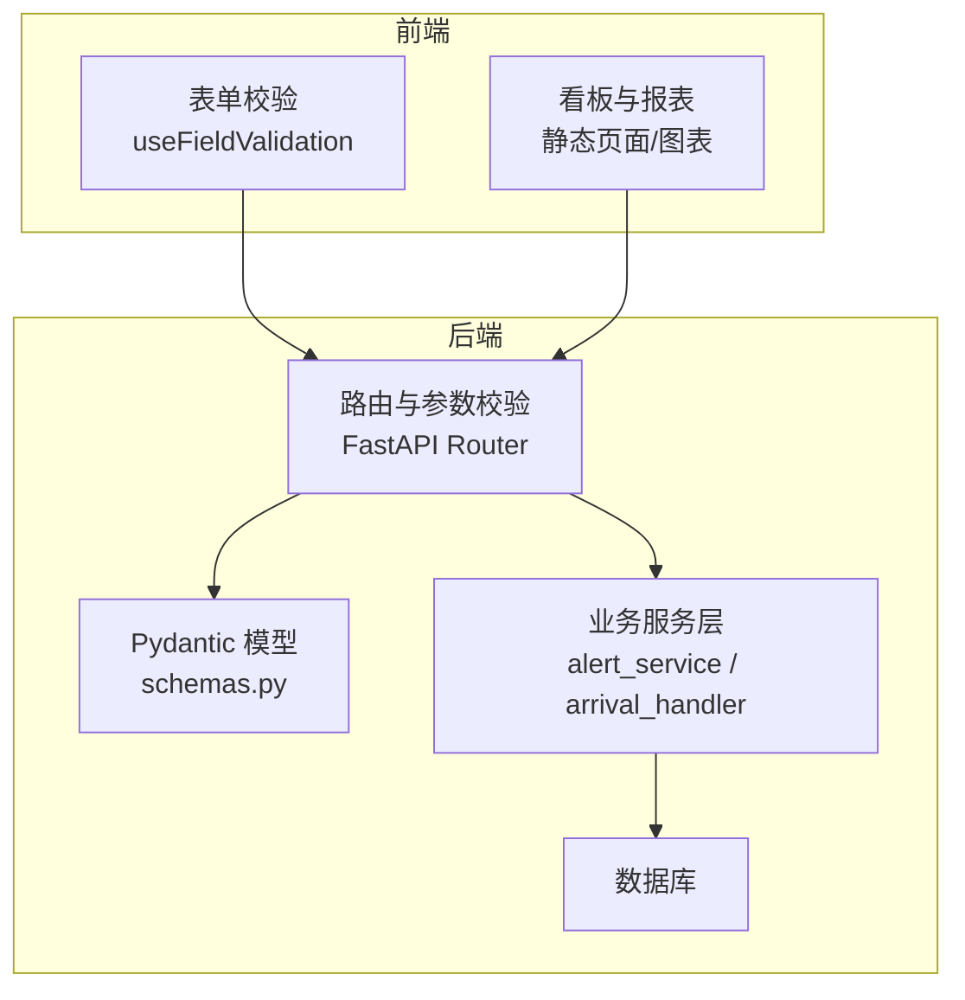
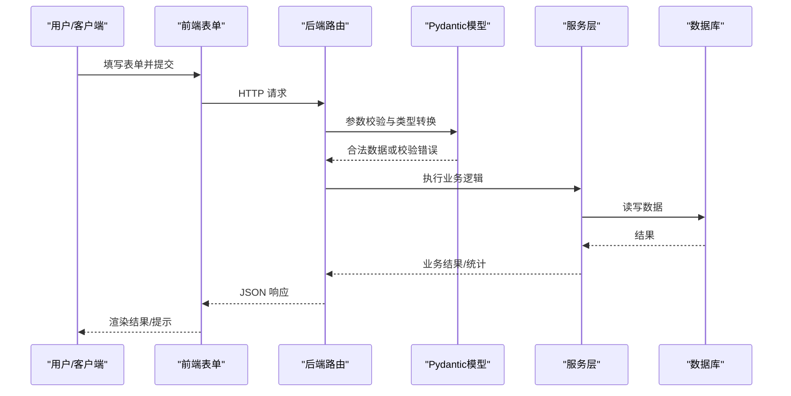
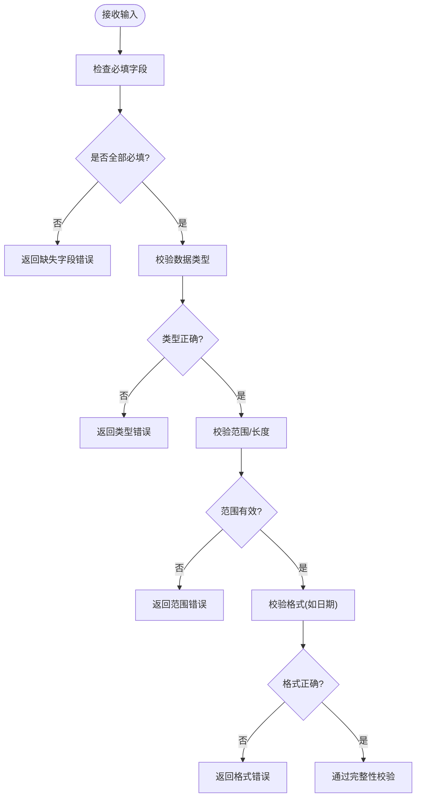
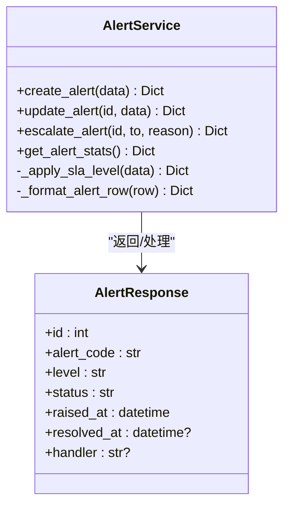
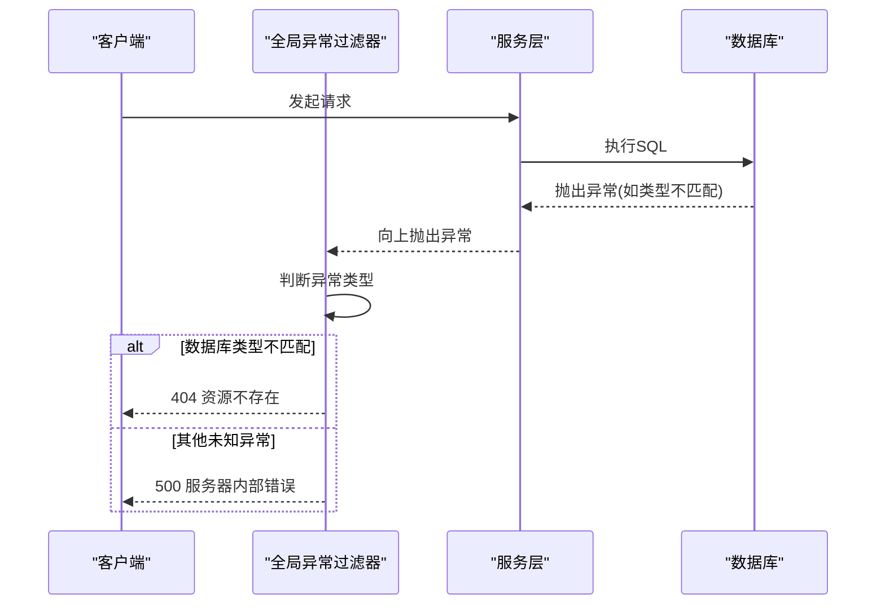
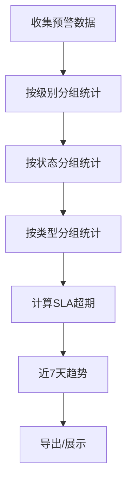
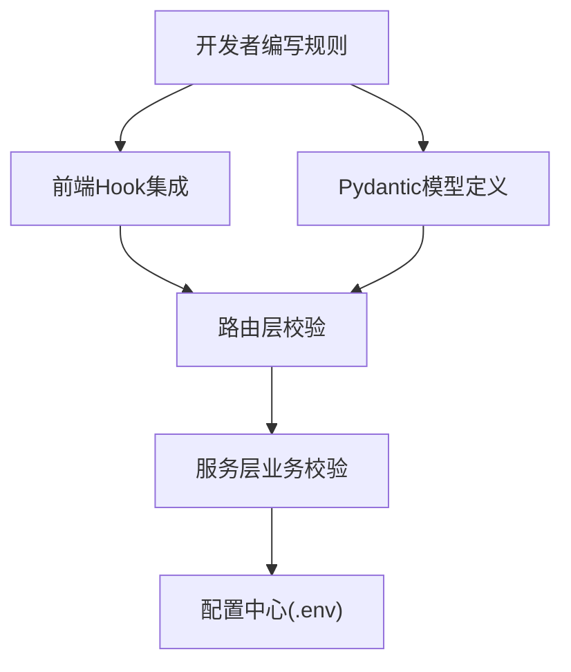
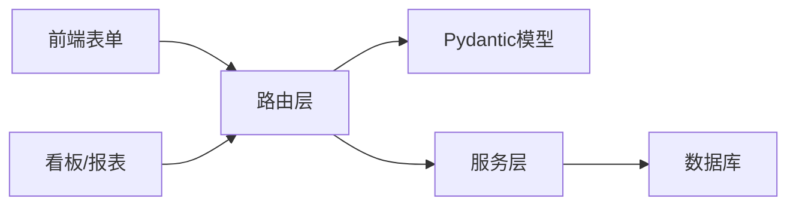

# 数据质量验证

<cite>
**本文引用的文件**
- [backend/core/exceptions.py](file://backend/core/exceptions.py)
- [backend/config.py](file://backend/config.py)
- [backend/qr_arrival/arrival_handler.py](file://backend/qr_arrival/arrival_handler.py)
- [backend/qr_arrival/schemas.py](file://backend/qr_arrival/schemas.py)
- [backend/modules/resource/schemas.py](file://backend/modules/resource/schemas.py)
- [backend/modules/resource/router.py](file://backend/modules/resource/router.py)
- [backend/modules/resource/services/alert_service.py](file://backend/modules/resource/services/alert_service.py)
- [backend/pbom/schemas.py](file://backend/pbom/schemas.py)
- [backend/critical_parts/schemas.py](file://backend/critical_parts/schemas.py)
- [webui_ref/server/common/filters/exception.filter.ts](file://webui_ref/server/common/filters/exception.filter.ts)
- [webui_ref/client/src/components/business-ui/form/hooks/form-utils.ts](file://webui_ref/client/src/components/business-ui/form/hooks/form-utils.ts)
- [static/index.html](file://static/index.html)
</cite>

## 目录
1. [简介](#简介)
2. [项目结构](#项目结构)
3. [核心组件](#核心组件)
4. [架构总览](#架构总览)
5. [详细组件分析](#详细组件分析)
6. [依赖关系分析](#依赖关系分析)
7. [性能考虑](#性能考虑)
8. [故障排查指南](#故障排查指南)
9. [结论](#结论)
10. [附录](#附录)

## 简介
本文件围绕“数据质量验证”目标，系统梳理并说明本项目在数据完整性校验、业务规则校验、异常数据处理机制、质量监控与报告生成、以及验证规则配置与管理工具等方面的实现与最佳实践。内容覆盖后端输入校验、服务层业务约束、前端表单校验、预警与SLA管理、以及可视化统计等关键环节，帮助读者快速理解并扩展数据质量能力。

## 项目结构
本项目采用前后端分离架构：
- 后端（Python/FastAPI）：提供资源管理、到件处理、PBOM解析、关键件评分、预警服务等模块，使用 Pydantic 进行请求模型校验，并在服务层实施业务规则与状态机约束。
- 前端（React/NestJS 参考实现）：提供表单校验、指标展示、预警看板与趋势图，支持筛选、分页与可视化反馈。

**图示来源**
- [backend/modules/resource/router.py:1-120](file://backend/modules/resource/router.py#L1-L120)
- [backend/modules/resource/schemas.py:1-60](file://backend/modules/resource/schemas.py#L1-L60)
- [backend/qr_arrival/arrival_handler.py:1-47](file://backend/qr_arrival/arrival_handler.py#L1-L47)
- [webui_ref/client/src/components/business-ui/form/hooks/form-utils.ts:1-23](file://webui_ref/client/src/components/business-ui/form/hooks/form-utils.ts#L1-L23)

**章节来源**
- [backend/modules/resource/router.py:1-120](file://backend/modules/resource/router.py#L1-L120)
- [backend/modules/resource/schemas.py:1-60](file://backend/modules/resource/schemas.py#L1-L60)
- [backend/qr_arrival/arrival_handler.py:1-47](file://backend/qr_arrival/arrival_handler.py#L1-L47)
- [webui_ref/client/src/components/business-ui/form/hooks/form-utils.ts:1-23](file://webui_ref/client/src/components/business-ui/form/hooks/form-utils.ts#L1-L23)

## 核心组件
- 输入与数据模型校验：通过 Pydantic 模型定义必填字段、类型、范围与描述，确保进入系统的请求具备基本合法性。
- 业务规则与服务层校验：在服务层对枚举值、状态机、关联关系、SLA 等进行二次校验与自动补全。
- 前端表单校验：基于 Hook 统一获取字段有效性及错误消息，提升交互体验。
- 异常与降级处理：统一异常分类与响应封装，避免将底层异常直接暴露给调用方。
- 质量监控与报告：提供预警统计、趋势分析、SLA 超期计算与可视化展示。
- 配置与环境：集中读取环境变量，提供默认值与回退策略，增强鲁棒性。

**章节来源**
- [backend/qr_arrival/schemas.py:1-46](file://backend/qr_arrival/schemas.py#L1-L46)
- [backend/modules/resource/schemas.py:1-224](file://backend/modules/resource/schemas.py#L1-L224)
- [backend/modules/resource/services/alert_service.py:1-120](file://backend/modules/resource/services/alert_service.py#L1-L120)
- [webui_ref/client/src/components/business-ui/form/hooks/form-utils.ts:1-23](file://webui_ref/client/src/components/business-ui/form/hooks/form-utils.ts#L1-L23)
- [backend/config.py:1-102](file://backend/config.py#L1-L102)

## 架构总览
数据从前端提交后，经过路由层参数校验与模型转换，进入服务层执行业务规则校验与持久化；同时，质量指标与预警信息通过服务层聚合查询返回前端展示。

**图示来源**
- [backend/modules/resource/router.py:112-154](file://backend/modules/resource/router.py#L112-L154)
- [backend/qr_arrival/schemas.py:1-46](file://backend/qr_arrival/schemas.py#L1-L46)
- [backend/modules/resource/services/alert_service.py:188-254](file://backend/modules/resource/services/alert_service.py#L188-L254)

## 详细组件分析

### 数据完整性检查规则
- 必填字段验证：通过 Pydantic 的 Field(..., ...) 强制必填，如到货数量、零件号、时间等。
- 数据类型校验：严格限定类型（int、str、datetime），非法类型将被拒绝。
- 范围检查：限制数值范围（如 gt=0）、字符串长度（min_length/max_length）。
- 格式校验：日期时间格式校验（YYYY-MM-DD HH:mm）。

**图示来源**
- [backend/qr_arrival/schemas.py:1-46](file://backend/qr_arrival/schemas.py#L1-L46)
- [backend/qr_arrival/arrival_handler.py:10-47](file://backend/qr_arrival/arrival_handler.py#L10-L47)

**章节来源**
- [backend/qr_arrival/schemas.py:1-46](file://backend/qr_arrival/schemas.py#L1-L46)
- [backend/qr_arrival/arrival_handler.py:10-47](file://backend/qr_arrival/arrival_handler.py#L10-L47)

### 业务规则验证
- 枚举与状态合法性：服务层对预警类型、级别、状态等枚举值进行校验，防止非法状态写入。
- 关联关系验证：创建/更新时校验关联对象是否存在（例如任务、设备、人员）。
- 状态机约束：状态变更时自动补齐时间戳（开始处理、解决、关闭时间），保证流程可追溯。
- SLA 管理：根据级别自动填充默认响应时长，并提供软超期计算用于前端展示与过滤。

**图示来源**
- [backend/modules/resource/services/alert_service.py:188-303](file://backend/modules/resource/services/alert_service.py#L188-L303)
- [backend/modules/resource/schemas.py:180-202](file://backend/modules/resource/schemas.py#L180-L202)

**章节来源**
- [backend/modules/resource/services/alert_service.py:188-303](file://backend/modules/resource/services/alert_service.py#L188-L303)
- [backend/modules/resource/schemas.py:180-202](file://backend/modules/resource/schemas.py#L180-L202)

### 异常数据处理机制
- 错误分类：区分业务异常、参数校验异常、数据库异常与未知异常，分别映射为合适的 HTTP 状态码与响应体。
- 降级处理：对于非致命错误（如数据库类型不匹配导致的无效 UUID），降级为“资源不存在”，避免 500 噪声。
- 人工干预流程：预警升级记录备注，保留时间戳与责任人，便于审计与回溯。

**图示来源**
- [webui_ref/server/common/filters/exception.filter.ts:39-78](file://webui_ref/server/common/filters/exception.filter.ts#L39-L78)

**章节来源**
- [webui_ref/server/common/filters/exception.filter.ts:39-78](file://webui_ref/server/common/filters/exception.filter.ts#L39-L78)
- [backend/core/exceptions.py:1-8](file://backend/core/exceptions.py#L1-L8)

### 数据质量监控与报告生成
- 质量指标统计：按级别、状态、类型分布统计预警数量，计算未解决数、超期数、升级数等。
- 趋势分析：近7天新增趋势、交叉分布（类型×状态）柱状图数据。
- 问题预警：SLA 软超期计算，支持仅显示超期项的过滤。
- 可视化：前端静态页面与图表展示，支持筛选与分页。

**图示来源**
- [backend/modules/resource/services/alert_service.py:337-399](file://backend/modules/resource/services/alert_service.py#L337-L399)
- [static/index.html:9495-9516](file://static/index.html#L9495-L9516)

**章节来源**
- [backend/modules/resource/services/alert_service.py:337-399](file://backend/modules/resource/services/alert_service.py#L337-L399)
- [static/index.html:9495-9516](file://static/index.html#L9495-L9516)

### 验证规则配置与管理工具
- 自定义验证器开发指南：
  - 在前端使用 Hook 统一获取字段有效性，结合表单组件渲染错误提示。
  - 在后端使用 Pydantic 模型定义字段约束，必要时在服务层增加复杂业务校验。
  - 通过路由层捕获 ValueError 并转换为 400 错误响应，保持接口一致性。
- 配置管理：
  - 集中读取环境变量，提供默认值与回退策略，确保运行环境缺失配置时仍可启动。
  - 上传目录、端口、跨域等关键配置均可通过 .env 控制。

**图示来源**
- [webui_ref/client/src/components/business-ui/form/hooks/form-utils.ts:1-23](file://webui_ref/client/src/components/business-ui/form/hooks/form-utils.ts#L1-L23)
- [backend/modules/resource/router.py:112-154](file://backend/modules/resource/router.py#L112-L154)
- [backend/config.py:1-102](file://backend/config.py#L1-L102)

**章节来源**
- [webui_ref/client/src/components/business-ui/form/hooks/form-utils.ts:1-23](file://webui_ref/client/src/components/business-ui/form/hooks/form-utils.ts#L1-L23)
- [backend/modules/resource/router.py:112-154](file://backend/modules/resource/router.py#L112-L154)
- [backend/config.py:1-102](file://backend/config.py#L1-L102)

## 依赖关系分析
- 路由层依赖 Pydantic 模型进行入参校验，并将业务异常转换为 HTTP 错误。
- 服务层依赖数据库访问函数进行数据读写，并对枚举、状态机、SLA 进行校验与自动补全。
- 前端依赖表单 Hook 进行实时校验，并通过静态页面与图表进行质量指标展示。

**图示来源**
- [backend/modules/resource/router.py:1-120](file://backend/modules/resource/router.py#L1-L120)
- [backend/modules/resource/services/alert_service.py:188-303](file://backend/modules/resource/services/alert_service.py#L188-L303)
- [webui_ref/client/src/components/business-ui/form/hooks/form-utils.ts:1-23](file://webui_ref/client/src/components/business-ui/form/hooks/form-utils.ts#L1-L23)

**章节来源**
- [backend/modules/resource/router.py:1-120](file://backend/modules/resource/router.py#L1-L120)
- [backend/modules/resource/services/alert_service.py:188-303](file://backend/modules/resource/services/alert_service.py#L188-L303)
- [webui_ref/client/src/components/business-ui/form/hooks/form-utils.ts:1-23](file://webui_ref/client/src/components/business-ui/form/hooks/form-utils.ts#L1-L23)

## 性能考虑
- 批量操作：批量更新预警状态时使用 IN 子句减少多次往返，提高吞吐。
- 统计查询：使用 GROUP BY 与条件聚合减少应用层计算开销。
- 前端缓存与分页：列表与图表数据分页加载，降低首屏压力。
- 配置回退：配置读取失败时回退默认值，避免启动失败影响整体可用性。

[本节为通用指导，无需特定文件引用]

## 故障排查指南
- 常见错误定位：
  - 参数校验失败：检查 Pydantic 模型定义与前端传参类型是否一致。
  - 业务规则失败：检查服务层枚举与状态机约束，确认传入值是否在允许集合内。
  - 数据库异常：关注类型不匹配（如非法 UUID）导致的降级处理，核对 ID 格式。
- 日志与追踪：
  - 服务层记录批量更新失败日志，便于定位问题。
  - 前端通过 Hook 获取错误消息，辅助快速定位表单问题。

**章节来源**
- [backend/modules/resource/services/alert_service.py:317-334](file://backend/modules/resource/services/alert_service.py#L317-L334)
- [webui_ref/client/src/components/business-ui/form/hooks/form-utils.ts:1-23](file://webui_ref/client/src/components/business-ui/form/hooks/form-utils.ts#L1-L23)

## 结论
本项目通过“前端表单校验 + 后端模型校验 + 服务层业务规则 + 统一异常处理 + 质量监控与报告”的多层体系，构建了完整的数据质量验证闭环。建议后续持续完善：
- 扩展更多业务规则校验（如关联关系强校验、跨表一致性检查）。
- 引入更细粒度的质量指标与告警阈值。
- 强化配置管理与动态规则下发能力，支持运行时调整。

[本节为总结性内容，无需特定文件引用]

## 附录
- 关键数据模型与接口路径参考：
  - 到件提交模型与校验：[backend/qr_arrival/schemas.py:1-46](file://backend/qr_arrival/schemas.py#L1-L46)
  - 到件处理器校验逻辑：[backend/qr_arrival/arrival_handler.py:10-47](file://backend/qr_arrival/arrival_handler.py#L10-L47)
  - 资源管理模型（设备/区域/人员/任务/预警）：[backend/modules/resource/schemas.py:1-224](file://backend/modules/resource/schemas.py#L1-L224)
  - 路由层示例（设备/人员/任务）：[backend/modules/resource/router.py:112-154](file://backend/modules/resource/router.py#L112-L154)
  - 预警服务（创建/更新/统计）：[backend/modules/resource/services/alert_service.py:188-399](file://backend/modules/resource/services/alert_service.py#L188-L399)
  - PBOM 解析模型：[backend/pbom/schemas.py:1-48](file://backend/pbom/schemas.py#L1-L48)
  - 关键件评分模型：[backend/critical_parts/schemas.py:1-40](file://backend/critical_parts/schemas.py#L1-L40)
  - 前端表单校验 Hook：[webui_ref/client/src/components/business-ui/form/hooks/form-utils.ts:1-23](file://webui_ref/client/src/components/business-ui/form/hooks/form-utils.ts#L1-L23)
  - 全局异常过滤器：[webui_ref/server/common/filters/exception.filter.ts:39-78](file://webui_ref/server/common/filters/exception.filter.ts#L39-L78)
  - 静态页面预警数据与展示：[static/index.html:9495-9516](file://static/index.html#L9495-L9516)