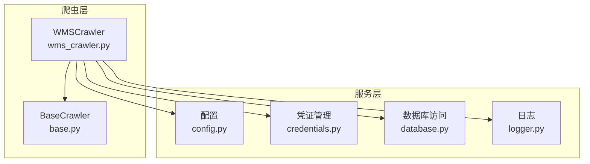
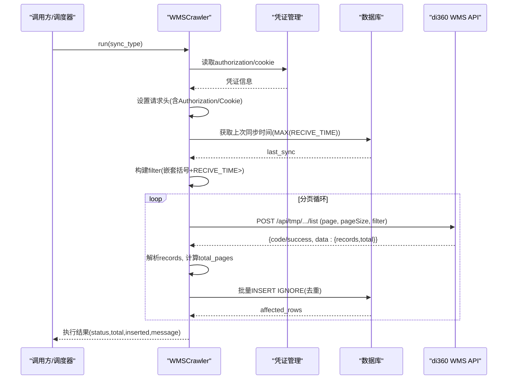
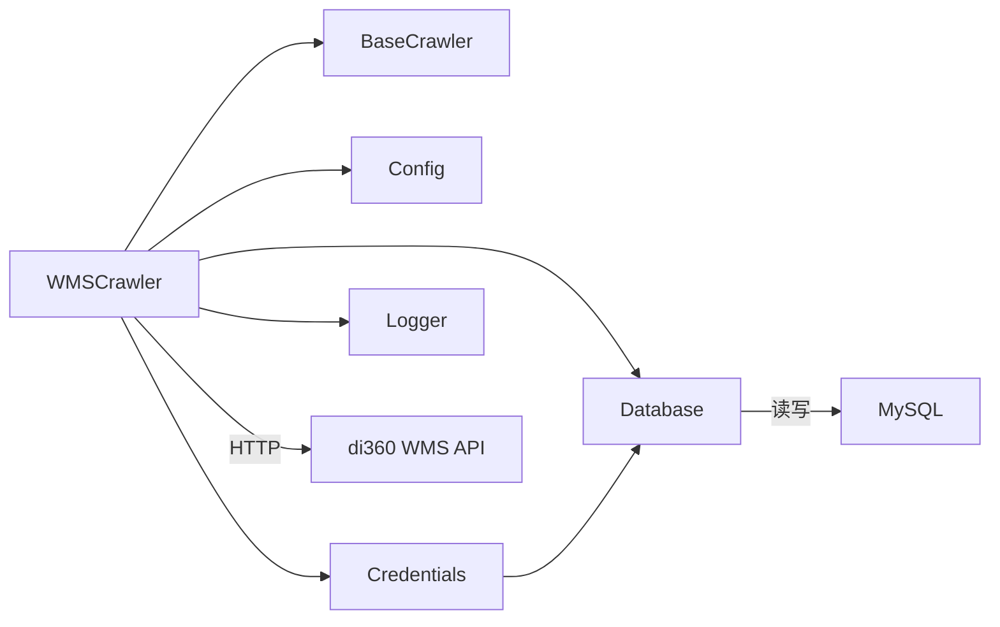
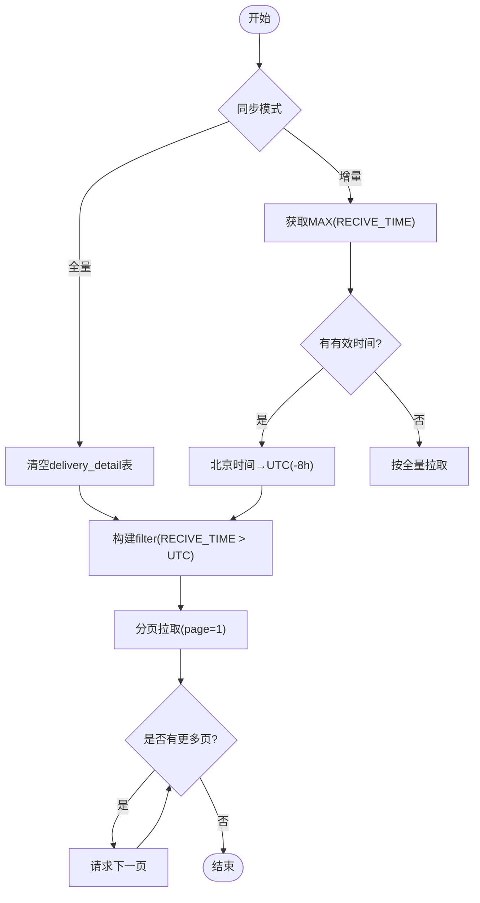

# WMS系统集成

<cite>
**本文引用的文件**
- [wms_crawler.py](file://backend/crawlers/wms_crawler.py)
- [base.py](file://backend/crawlers/base.py)
- [config.py](file://backend/config.py)
- [database.py](file://backend/database.py)
- [credentials.py](file://backend/system/credentials.py)
- [logger.py](file://backend/logger.py)
</cite>

## 目录
1. [简介](#简介)
2. [项目结构](#项目结构)
3. [核心组件](#核心组件)
4. [架构总览](#架构总览)
5. [详细组件分析](#详细组件分析)
6. [依赖关系分析](#依赖关系分析)
7. [性能考量](#性能考量)
8. [故障排查指南](#故障排查指南)
9. [结论](#结论)
10. [附录：集成示例与最佳实践](#附录：集成示例与最佳实践)

## 简介
本文件面向WMS系统（di360）集成的实现说明，覆盖认证机制（Authorization与Cookie）、请求头配置、分页查询处理、增量同步策略（时间过滤器构建、UTC与北京时间转换、RECIVE_TIME字段处理）、数据抓取流程（请求体构造、响应解析、错误重试与指数退避）、数据映射规则（字段对应、类型转换、数值字段处理），并提供完整的集成示例代码路径指引，以及常见问题排查方法。

## 项目结构
本项目后端采用模块化组织，WMS集成主要位于爬虫模块中，配合配置、数据库、凭证管理、日志等基础能力完成端到端的数据拉取与入库。

图表来源
- [wms_crawler.py:44-110](file://backend/crawlers/wms_crawler.py#L44-L110)
- [base.py:12-67](file://backend/crawlers/base.py#L12-L67)
- [config.py:48-66](file://backend/config.py#L48-L66)
- [credentials.py:25-118](file://backend/system/credentials.py#L25-L118)
- [database.py:12-116](file://backend/database.py#L12-L116)
- [logger.py:14-43](file://backend/logger.py#L14-L43)

章节来源
- [wms_crawler.py:1-477](file://backend/crawlers/wms_crawler.py#L1-L477)
- [base.py:1-67](file://backend/crawlers/base.py#L1-L67)
- [config.py:1-102](file://backend/config.py#L1-L102)
- [database.py:1-116](file://backend/database.py#L1-L116)
- [credentials.py:1-573](file://backend/system/credentials.py#L1-L573)
- [logger.py:1-43](file://backend/logger.py#L1-L43)

## 核心组件
- WMSCrawler：封装与di360 WMS的API对接、增量/全量同步、分页拉取、批量入库、重试与日志。
- BaseCrawler：定义统一的爬虫接口（运行模式、状态、结果）。
- Config：集中管理环境变量与WMS接口地址等配置。
- Credentials：支持自动登录获取Token/Cookie并持久化到数据库，供爬虫使用。
- Database：连接池与通用CRUD封装，提供批量写入能力。
- Logger：统一日志输出，便于前端读取与问题定位。

章节来源
- [wms_crawler.py:44-110](file://backend/crawlers/wms_crawler.py#L44-L110)
- [base.py:12-67](file://backend/crawlers/base.py#L12-L67)
- [config.py:48-66](file://backend/config.py#L48-L66)
- [credentials.py:25-118](file://backend/system/credentials.py#L25-L118)
- [database.py:12-116](file://backend/database.py#L12-L116)
- [logger.py:14-43](file://backend/logger.py#L14-L43)

## 架构总览
下图展示了从凭证管理、登录认证、分页拉取、增量过滤、数据映射到批量入库的完整链路。

图表来源
- [wms_crawler.py:127-178](file://backend/crawlers/wms_crawler.py#L127-L178)
- [wms_crawler.py:180-213](file://backend/crawlers/wms_crawler.py#L180-L213)
- [wms_crawler.py:216-271](file://backend/crawlers/wms_crawler.py#L216-L271)
- [wms_crawler.py:273-310](file://backend/crawlers/wms_crawler.py#L273-L310)
- [wms_crawler.py:313-457](file://backend/crawlers/wms_crawler.py#L313-L457)
- [credentials.py:25-118](file://backend/system/credentials.py#L25-L118)
- [database.py:51-116](file://backend/database.py#L51-L116)

## 详细组件分析

### 认证机制与请求头配置
- 凭证来源：从spider_credentials表读取authorization与cookie；若为空则提示配置缺失。
- 请求头：包含Accept、Content-Type、Host、Origin、Referer、User-Agent、Sec-Fetch-*等，确保与浏览器一致；同时设置verify=False以兼容内网证书环境。
- Cookie：当存在cookie时附加到请求头，增强鉴权稳定性。
- 自动登录：支持通过登录接口获取JWT Token并保存至数据库，后续爬虫优先使用已保存凭证。

章节来源
- [wms_crawler.py:64-109](file://backend/crawlers/wms_crawler.py#L64-L109)
- [credentials.py:25-118](file://backend/system/credentials.py#L25-L118)

### 分页查询处理
- 分页参数：page/pageNo与pageSize组合，默认每页2000条。
- 首次请求用于获取total_count，并据此计算total_pages。
- 循环从第2页开始拉取，直至达到total_pages或返回空记录。
- 进度追踪：current_page、total_pages、inserted、processed在运行中更新，供前端实时展示。

章节来源
- [wms_crawler.py:27-31](file://backend/crawlers/wms_crawler.py#L27-L31)
- [wms_crawler.py:154-178](file://backend/crawlers/wms_crawler.py#L154-L178)
- [wms_crawler.py:180-213](file://backend/crawlers/wms_crawler.py#L180-L213)
- [wms_crawler.py:376-432](file://backend/crawlers/wms_crawler.py#L376-L432)

### 增量同步策略
- 时间过滤器构建：通过filter数组实现“嵌套括号分组 + RECIVE_TIME > start_time_str”的条件结构，由服务端直接返回时间范围内的新数据。
- UTC与北京时间转换：
  - 向API传过滤条件时，将数据库中的北京时间转换为UTC（-8小时）。
  - 入库时将API返回的UTC时间转换为北京时间（+8小时）存储。
- 增量判断：若数据库无有效RECIVE_TIME，则按全量拉取。

章节来源
- [wms_crawler.py:127-152](file://backend/crawlers/wms_crawler.py#L127-L152)
- [wms_crawler.py:216-271](file://backend/crawlers/wms_crawler.py#L216-L271)
- [wms_crawler.py:349-364](file://backend/crawlers/wms_crawler.py#L349-L364)

### 数据抓取流程
- 请求体构造：包含viewName、appId、companyId、orgId、userGroup、timeZone等固定字段，以及动态的filter与分页参数。
- 响应解析：校验code或success，提取data.records与data.total；异常消息记录为warn日志。
- 错误重试：对超时与连接失败进行指数退避重试（最多3次），每次等待时间为2^attempt秒。

章节来源
- [wms_crawler.py:154-178](file://backend/crawlers/wms_crawler.py#L154-L178)
- [wms_crawler.py:180-213](file://backend/crawlers/wms_crawler.py#L180-L213)

### 数据映射规则
- 字段顺序：与delivery_detail表字段保持一致，包括DELIVERY_CODE、APPLY_CODE、PRO_CODE、PRO_NAME、MATTER_CODE、MATTER_NAME、STYLIST_USERNAME、ZYS_USERNAME、STATE、FROM_ORDER_CODE、ORDER_NUM、SEND_NUM、RECIVE_NUM、IN_NUM、CANT_NUM、SEND_WH_NAME、WH_NAME、RECIVE_USERNAME、RECIVE_TIME。
- 数据类型转换：
  - 数值字段（ORDER_NUM、SEND_NUM、RECIVE_NUM、IN_NUM、CANT_NUM）强制转为int，空值或缺失时置0。
  - RECIVE_TIME字段进行UTC→北京时间转换，格式化为标准字符串。
  - 其他字段统一转为字符串，None转空串。
- 去重策略：使用INSERT IGNORE避免重复插入相同主键的记录。

章节来源
- [wms_crawler.py:34-41](file://backend/crawlers/wms_crawler.py#L34-L41)
- [wms_crawler.py:237-258](file://backend/crawlers/wms_crawler.py#L237-L258)
- [wms_crawler.py:273-310](file://backend/crawlers/wms_crawler.py#L273-L310)

### 批处理与入库
- 批量写入：使用executemany批量插入，提升吞吐。
- 事务控制：execute_all内部commit，异常时rollback，保证一致性。
- 影响行数：返回affected_rows作为入库统计。

章节来源
- [database.py:104-116](file://backend/database.py#L104-L116)
- [wms_crawler.py:273-310](file://backend/crawlers/wms_crawler.py#L273-L310)

## 依赖关系分析
- WMSCrawler依赖：
  - BaseCrawler：统一接口与枚举。
  - Config：读取QUERY_URL等配置。
  - Credentials：读取authorization/cookie。
  - Database：读写delivery_detail表。
  - Logger：记录运行日志。
- 外部依赖：
  - di360 WMS API：POST /api/tmp/warehouse/buWhDeliveryDetailQuery/list。
  - MySQL：持久化凭证与业务数据。

图表来源
- [wms_crawler.py:44-110](file://backend/crawlers/wms_crawler.py#L44-L110)
- [base.py:12-67](file://backend/crawlers/base.py#L12-L67)
- [config.py:48-66](file://backend/config.py#L48-L66)
- [credentials.py:25-118](file://backend/system/credentials.py#L25-L118)
- [database.py:12-116](file://backend/database.py#L12-L116)

章节来源
- [wms_crawler.py:44-110](file://backend/crawlers/wms_crawler.py#L44-L110)
- [base.py:12-67](file://backend/crawlers/base.py#L12-L67)
- [config.py:48-66](file://backend/config.py#L48-L66)
- [credentials.py:25-118](file://backend/system/credentials.py#L25-L118)
- [database.py:12-116](file://backend/database.py#L12-L116)

## 性能考量
- 连接复用：requests.Session在任务内复用，减少握手开销。
- 批量写入：executemany一次性提交多行，降低IO次数。
- 分页大小：PAGE_SIZE=2000，平衡内存占用与网络往返。
- 重试策略：指数退避避免瞬时抖动导致失败。
- 日志缓冲：限制最近500行，避免内存无限增长。

[本节为通用指导，不直接分析具体文件]

## 故障排查指南
- 认证失败
  - 检查spider_credentials中是否存在有效的authorization或cookie。
  - 确认登录接口可达且返回code=200；如公司内网不可达，仅保存凭证供后续重试。
  - 参考路径：[credentials.py:25-118](file://backend/system/credentials.py#L25-L118)、[wms_crawler.py:64-109](file://backend/crawlers/wms_crawler.py#L64-L109)
- 网络超时/连接失败
  - 查看日志中的重试记录与等待时间；确认网络连通性与防火墙策略。
  - 调整timeout或增大MAX_RETRIES（当前为3次）。
  - 参考路径：[wms_crawler.py:180-213](file://backend/crawlers/wms_crawler.py#L180-L213)
- 数据格式异常
  - 检查API返回结构是否包含code/success与data.records；异常消息会记录为warn。
  - 确认字段映射与类型转换逻辑；数值字段空值应置0。
  - 参考路径：[wms_crawler.py:180-213](file://backend/crawlers/wms_crawler.py#L180-L213)、[wms_crawler.py:273-310](file://backend/crawlers/wms_crawler.py#L273-L310)
- 增量同步未生效
  - 确认数据库中RECIVE_TIME是否为空或无效；若无有效时间，将回退为全量拉取。
  - 检查时间过滤器构建是否正确（嵌套括号结构与RECIVE_TIME > 条件）。
  - 参考路径：[wms_crawler.py:216-271](file://backend/crawlers/wms_crawler.py#L216-L271)、[wms_crawler.py:349-364](file://backend/crawlers/wms_crawler.py#L349-L364)

章节来源
- [credentials.py:25-118](file://backend/system/credentials.py#L25-L118)
- [wms_crawler.py:64-109](file://backend/crawlers/wms_crawler.py#L64-L109)
- [wms_crawler.py:180-213](file://backend/crawlers/wms_crawler.py#L180-L213)
- [wms_crawler.py:216-271](file://backend/crawlers/wms_crawler.py#L216-L271)
- [wms_crawler.py:273-310](file://backend/crawlers/wms_crawler.py#L273-L310)
- [wms_crawler.py:349-364](file://backend/crawlers/wms_crawler.py#L349-L364)

## 结论
本集成方案通过标准化认证、严格的增量过滤、稳健的重试机制与高效的批量入库，实现了与di360 WMS系统的稳定对接。结合配置化管理与日志可观测性，能够支撑大规模数据的持续同步与运维排障。

[本节为总结性内容，不直接分析具体文件]

## 附录：集成示例与最佳实践

### 完整集成流程示例（步骤与路径）
- 登录验证
  - 调用自动登录接口获取JWT Token并保存到数据库；或直接手动同步Token/Cookie。
  - 参考路径：[credentials.py:25-118](file://backend/system/credentials.py#L25-L118)、[credentials.py:121-148](file://backend/system/credentials.py#L121-L148)
- 数据拉取
  - 初始化Session并设置请求头（Authorization/Cookie）。
  - 构建请求体（viewName、appId、filter等）并分页拉取。
  - 参考路径：[wms_crawler.py:80-109](file://backend/crawlers/wms_crawler.py#L80-L109)、[wms_crawler.py:154-178](file://backend/crawlers/wms_crawler.py#L154-L178)、[wms_crawler.py:180-213](file://backend/crawlers/wms_crawler.py#L180-L213)
- 批量入库
  - 解析响应records，进行字段映射与类型转换。
  - 使用INSERT IGNORE批量写入delivery_detail表。
  - 参考路径：[wms_crawler.py:237-310](file://backend/crawlers/wms_crawler.py#L237-L310)、[database.py:104-116](file://backend/database.py#L104-L116)

### 增量同步流程图

图表来源
- [wms_crawler.py:313-457](file://backend/crawlers/wms_crawler.py#L313-L457)
- [wms_crawler.py:216-271](file://backend/crawlers/wms_crawler.py#L216-L271)

### 常见配置项与环境变量
- QUERY_URL：WMS查询接口地址。
- LOGIN_URL：WMS登录接口地址。
- DB_*：数据库连接配置。
- SPIDER_INTERVAL_MINUTES/SPIDER_TIMEOUT_SECONDS：爬虫间隔与超时。
- 参考路径：[config.py:48-66](file://backend/config.py#L48-L66)、[config.py:58-66](file://backend/config.py#L58-L66)

章节来源
- [config.py:48-66](file://backend/config.py#L48-L66)