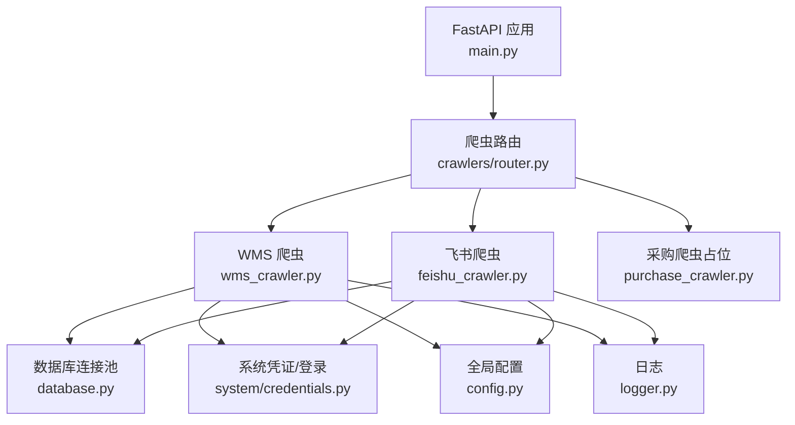
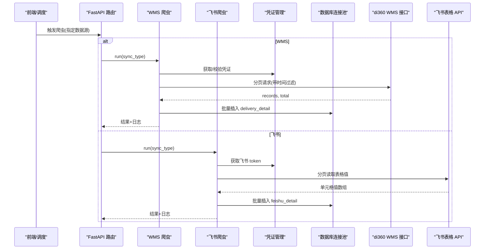
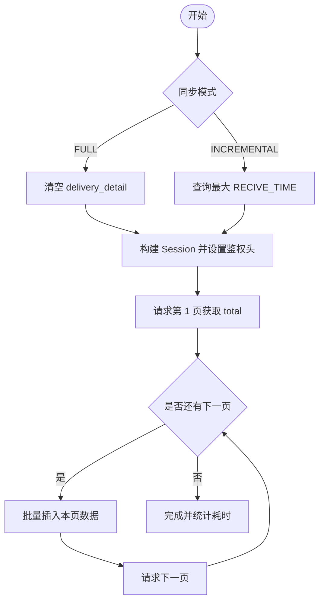
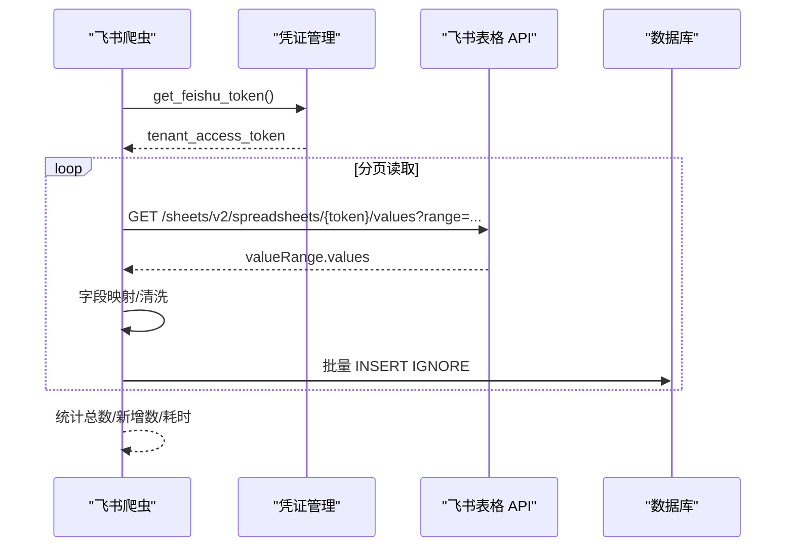
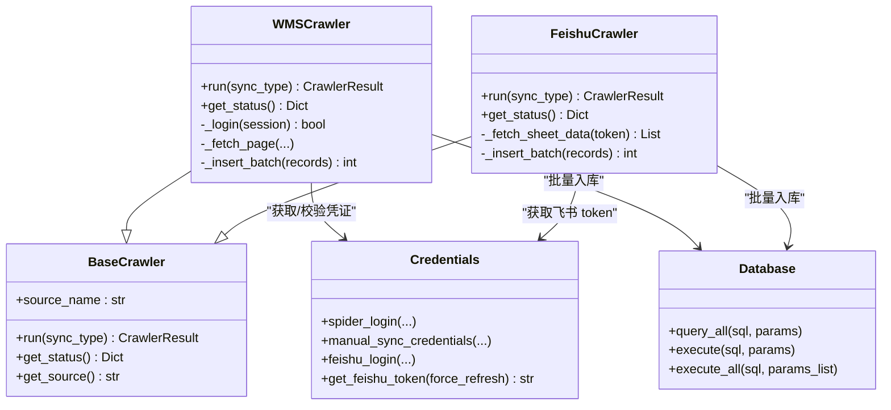

# 数据源集成

<cite>
**本文引用的文件**
- [wms_crawler.py](file://backend/crawlers/wms_crawler.py)
- [feishu_crawler.py](file://backend/crawlers/feishu_crawler.py)
- [purchase_crawler.py](file://backend/crawlers/purchase_crawler.py)
- [base.py](file://backend/crawlers/base.py)
- [credentials.py](file://backend/system/credentials.py)
- [config.py](file://backend/config.py)
- [database.py](file://backend/database.py)
- [logger.py](file://backend/logger.py)
- [main.py](file://backend/main.py)
- [run_crawler.py](file://backend/scripts/run_crawler.py)
- [test_feishu_sync.py](file://backend/scripts/test_feishu_sync.py)
</cite>

## 目录
1. [简介](#简介)
2. [项目结构](#项目结构)
3. [核心组件](#核心组件)
4. [架构总览](#架构总览)
5. [详细组件分析](#详细组件分析)
6. [依赖关系分析](#依赖关系分析)
7. [性能与限流](#性能与限流)
8. [故障排查指南](#故障排查指南)
9. [结论](#结论)
10. [附录：配置与示例](#附录配置与示例)

## 简介
本文件面向“数据源集成”目标，系统性说明 WMS 系统集成、飞书表格同步、采购系统对接的实现方案与最佳实践。内容覆盖 API 认证、数据抓取、字段映射、错误处理、增量同步策略、连接池管理、限流控制、日志记录与常见问题的排查方法，并提供可操作的集成示例路径。

## 项目结构
后端采用模块化设计，爬虫以“基类 + 具体实现”的方式组织，统一通过数据库连接池访问 MySQL，凭证由系统模块集中管理，配置通过环境变量加载。

图表来源
- [main.py:18-83](file://backend/main.py#L18-L83)
- [wms_crawler.py:20-25](file://backend/crawlers/wms_crawler.py#L20-L25)
- [feishu_crawler.py:12-18](file://backend/crawlers/feishu_crawler.py#L12-L18)
- [database.py:12-43](file://backend/database.py#L12-L43)
- [credentials.py:17-23](file://backend/system/credentials.py#L17-L23)
- [config.py:48-75](file://backend/config.py#L48-L75)
- [logger.py:14-38](file://backend/logger.py#L14-L38)

章节来源
- [main.py:18-83](file://backend/main.py#L18-L83)
- [config.py:48-75](file://backend/config.py#L48-L75)

## 核心组件
- 爬虫基类与状态模型：定义统一的运行接口、同步模式枚举、结果对象与状态机。
- WMS 爬虫：对接 di360 WMS 查询接口，支持全量/增量、分页拉取、时间过滤、批量入库。
- 飞书爬虫：通过飞书 v2 表格 API 分页读取共享表，字段映射并清洗后入库。
- 采购爬虫：当前为占位实现，预留扩展点。
- 凭证管理：统一维护多数据源凭证，支持自动登录获取 Token、手动同步 Token/Cookie、飞书 tenant_access_token 获取与刷新。
- 数据库连接池：基于 dbutils.PooledDB 的延迟初始化连接池，提供读写与批量执行封装。
- 配置中心：从 .env 加载数据库、服务、爬虫间隔、WMS/飞书/采购等外部地址与密钥。
- 日志：按模块输出到文件与控制台，支持轮转。

章节来源
- [base.py:12-67](file://backend/crawlers/base.py#L12-L67)
- [wms_crawler.py:44-125](file://backend/crawlers/wms_crawler.py#L44-L125)
- [feishu_crawler.py:55-82](file://backend/crawlers/feishu_crawler.py#L55-L82)
- [purchase_crawler.py:12-49](file://backend/crawlers/purchase_crawler.py#L12-L49)
- [credentials.py:25-149](file://backend/system/credentials.py#L25-L149)
- [database.py:12-116](file://backend/database.py#L12-L116)
- [config.py:48-75](file://backend/config.py#L48-L75)
- [logger.py:14-38](file://backend/logger.py#L14-L38)

## 架构总览
整体流程：前端或调度器触发爬虫任务 → 爬虫实例化并执行 run → 调用外部 API 获取数据 → 本地清洗与映射 → 批量写入数据库 → 返回执行结果与日志快照。

图表来源
- [wms_crawler.py:313-467](file://backend/crawlers/wms_crawler.py#L313-L467)
- [feishu_crawler.py:251-409](file://backend/crawlers/feishu_crawler.py#L251-L409)
- [credentials.py:448-573](file://backend/system/credentials.py#L448-L573)
- [database.py:51-116](file://backend/database.py#L51-L116)

## 详细组件分析

### WMS 系统集成
- API 认证
  - 从凭证表读取 authorization/cookie，注入 requests.Session 的请求头；支持跳过证书校验用于内网环境。
  - 登录接口在凭证管理中统一处理，支持自动登录与手动同步。
- 数据抓取
  - 使用固定 viewName 与 appId/orgId 等上下文参数构造请求体。
  - 增量同步通过 filter 嵌套结构传入 RECIVE_TIME > last_time，服务端直接返回新数据。
  - 分页拉取，默认页大小 2000，逐页处理。
- 字段映射与清洗
  - 将 API 返回字段映射到 delivery_detail 表列，数字字段做安全转换，RECIVE_TIME 做 UTC→北京时间转换。
- 错误处理
  - 网络超时/连接异常指数退避重试；接口业务码非成功时记录告警；批量插入失败回滚并记录错误。
- 进度与日志
  - 每页处理更新进度；日志缓冲限制 500 行，同时落盘。

图表来源
- [wms_crawler.py:127-178](file://backend/crawlers/wms_crawler.py#L127-L178)
- [wms_crawler.py:180-213](file://backend/crawlers/wms_crawler.py#L180-L213)
- [wms_crawler.py:216-310](file://backend/crawlers/wms_crawler.py#L216-L310)
- [wms_crawler.py:313-467](file://backend/crawlers/wms_crawler.py#L313-L467)

章节来源
- [wms_crawler.py:64-109](file://backend/crawlers/wms_crawler.py#L64-L109)
- [wms_crawler.py:127-178](file://backend/crawlers/wms_crawler.py#L127-L178)
- [wms_crawler.py:180-213](file://backend/crawlers/wms_crawler.py#L180-L213)
- [wms_crawler.py:216-310](file://backend/crawlers/wms_crawler.py#L216-L310)
- [wms_crawler.py:313-467](file://backend/crawlers/wms_crawler.py#L313-L467)

### 飞书表格同步机制
- OAuth/Token 认证
  - 通过 credentials 模块获取 tenant_access_token，支持从数据库缓存或 .env 配置中读取 app_id/app_secret，并在过期前自动刷新。
- 表格操作
  - 使用 v2 表格 API 按范围分页读取，避免单次响应过大；遇到连续空块提前终止。
- 数据格式转换
  - 对日期、数量等字段进行规范化；仓库名称按关键词归一化。
- 增量同步策略
  - 首次全量；后续根据 feishu_detail 表中最大 RECIVE_TIME 过滤旧数据，仅处理新增。
- 错误处理
  - 网络超时/HTTP 错误指数退避重试；解析失败记录警告并继续。

图表来源
- [credentials.py:448-573](file://backend/system/credentials.py#L448-L573)
- [feishu_crawler.py:132-203](file://backend/crawlers/feishu_crawler.py#L132-L203)
- [feishu_crawler.py:222-249](file://backend/crawlers/feishu_crawler.py#L222-L249)
- [feishu_crawler.py:251-409](file://backend/crawlers/feishu_crawler.py#L251-L409)

章节来源
- [feishu_crawler.py:84-130](file://backend/crawlers/feishu_crawler.py#L84-L130)
- [feishu_crawler.py:132-203](file://backend/crawlers/feishu_crawler.py#L132-L203)
- [feishu_crawler.py:205-249](file://backend/crawlers/feishu_crawler.py#L205-L249)
- [feishu_crawler.py:251-409](file://backend/crawlers/feishu_crawler.py#L251-L409)
- [credentials.py:448-573](file://backend/system/credentials.py#L448-L573)

### 采购系统对接方案
- 现状
  - 已提供 PurchaseCrawler 骨架，当前未接入真实 API，返回失败状态与提示信息。
- 建议接入步骤
  - 在 config.py 中补充采购系统 URL/Key 等配置项。
  - 在 credentials.py 中增加采购系统的登录/Token 获取逻辑。
  - 在 purchase_crawler.py 中实现请求构造、响应解析、字段映射、批量入库与重试。
  - 复用现有日志与错误处理模式，保证与其他爬虫一致的行为。

章节来源
- [purchase_crawler.py:12-49](file://backend/crawlers/purchase_crawler.py#L12-L49)
- [config.py:72-75](file://backend/config.py#L72-L75)

### 配置参数与连接池管理
- 配置项
  - 数据库：主机、端口、用户、密码、库名。
  - 爬虫：执行间隔、超时时间。
  - WMS：登录与查询接口地址。
  - 飞书：app_id、app_secret、表格接口地址。
  - 采购：API 地址与 Key。
  - 服务：监听地址、端口、调试开关、CORS 源。
- 连接池
  - 使用 PooledDB 延迟初始化，最小空闲 0，最大连接 10，阻塞等待；失败时抛出明确错误提示。
  - 提供 query_all/query_one/execute/execute_last_id/execute_all 等封装，确保事务提交与回滚。

章节来源
- [config.py:48-75](file://backend/config.py#L48-L75)
- [database.py:12-43](file://backend/database.py#L12-L43)
- [database.py:51-116](file://backend/database.py#L51-L116)

### 错误处理与重试
- WMS 爬虫
  - 网络层：Timeout/ConnectionError 指数退避重试；业务码非成功记录告警。
  - 数据层：批量插入失败捕获异常并记录错误。
- 飞书爬虫
  - 网络层：超时/HTTP 错误指数退避重试；连续空块停止读取。
  - 数据层：批量插入失败捕获异常并记录错误。
- 凭证管理
  - 登录失败或无法连接公司内网时，仍保存凭证供后续重试；Token 过期自动刷新。

章节来源
- [wms_crawler.py:180-213](file://backend/crawlers/wms_crawler.py#L180-L213)
- [wms_crawler.py:273-310](file://backend/crawlers/wms_crawler.py#L273-L310)
- [feishu_crawler.py:146-203](file://backend/crawlers/feishu_crawler.py#L146-L203)
- [feishu_crawler.py:222-249](file://backend/crawlers/feishu_crawler.py#L222-L249)
- [credentials.py:25-118](file://backend/system/credentials.py#L25-L118)
- [credentials.py:509-573](file://backend/system/credentials.py#L509-L573)

### 日志记录
- 每个爬虫维护内存日志缓冲（最多 500 条），便于前端实时查看。
- 同时通过 logger 写入文件（按模块分文件，单文件 10MB，保留 7 份）。
- 关键节点记录：开始/结束、页数、入库数、错误信息。

章节来源
- [wms_crawler.py:112-125](file://backend/crawlers/wms_crawler.py#L112-L125)
- [feishu_crawler.py:72-82](file://backend/crawlers/feishu_crawler.py#L72-L82)
- [logger.py:14-38](file://backend/logger.py#L14-L38)

## 依赖关系分析
- 爬虫均依赖 base 定义的抽象接口与枚举类型，保证行为一致。
- 凭证管理与数据库连接池被多个爬虫共用，降低耦合度。
- 配置集中管理，便于切换环境与参数调优。

图表来源
- [base.py:12-67](file://backend/crawlers/base.py#L12-L67)
- [wms_crawler.py:44-125](file://backend/crawlers/wms_crawler.py#L44-L125)
- [feishu_crawler.py:55-82](file://backend/crawlers/feishu_crawler.py#L55-L82)
- [credentials.py:25-149](file://backend/system/credentials.py#L25-L149)
- [database.py:51-116](file://backend/database.py#L51-L116)

章节来源
- [base.py:12-67](file://backend/crawlers/base.py#L12-L67)
- [wms_crawler.py:44-125](file://backend/crawlers/wms_crawler.py#L44-L125)
- [feishu_crawler.py:55-82](file://backend/crawlers/feishu_crawler.py#L55-L82)
- [credentials.py:25-149](file://backend/system/credentials.py#L25-L149)
- [database.py:51-116](file://backend/database.py#L51-L116)

## 性能与限流
- 分页与批处理
  - WMS 页大小 2000，飞书每次读取 1000 行，批量入库减少 IO 次数。
- 连接复用
  - requests.Session 复用 TCP 连接；数据库使用连接池，避免频繁创建连接。
- 重试与退避
  - 指数退避重试，避免瞬时拥塞导致雪崩。
- 限流建议
  - 可在爬虫循环中加入 sleep 控制 QPS；根据外部系统能力调整 PAGE_SIZE 与 batch size。
  - 对于飞书大表，可根据实际行数调整 max_rows 与 batch_size。
- 资源清理
  - 应用关闭时停止调度器与爬虫管理器，释放线程与连接。

章节来源
- [wms_crawler.py:28-30](file://backend/crawlers/wms_crawler.py#L28-L30)
- [wms_crawler.py:180-213](file://backend/crawlers/wms_crawler.py#L180-L213)
- [feishu_crawler.py:20-21](file://backend/crawlers/feishu_crawler.py#L20-L21)
- [feishu_crawler.py:132-203](file://backend/crawlers/feishu_crawler.py#L132-L203)
- [database.py:12-43](file://backend/database.py#L12-L43)
- [main.py:122-159](file://backend/main.py#L122-L159)

## 故障排查指南
- 无法连接数据库
  - 检查 backend/.env 中的 DB_HOST/PORT/USER/PASSWORD/DATABASE；确认连接池初始化日志。
- WMS 凭证无效
  - 在系统设置中重新登录或手动同步 Token/Cookie；确认 Authorization 与 Cookie 是否正确注入。
- 飞书 Token 过期或获取失败
  - 检查 app_id/app_secret 配置；确认 get_feishu_token 能获取有效 token；必要时强制刷新。
- 表格无数据或为空
  - 检查表格范围与行列偏移；确认 valueRenderOption 与 dateTimeRenderOption 设置；观察连续空块计数。
- 数据重复或丢失
  - 确认 INSERT IGNORE 去重逻辑；核对 RECIVE_TIME 时间转换是否正确（UTC↔北京时间）。
- 性能问题
  - 适当增大页大小或批大小；降低请求频率；检查网络与远端系统负载。

章节来源
- [database.py:12-43](file://backend/database.py#L12-L43)
- [wms_crawler.py:64-109](file://backend/crawlers/wms_crawler.py#L64-L109)
- [credentials.py:509-573](file://backend/system/credentials.py#L509-L573)
- [feishu_crawler.py:132-203](file://backend/crawlers/feishu_crawler.py#L132-L203)
- [wms_crawler.py:237-271](file://backend/crawlers/wms_crawler.py#L237-L271)

## 结论
本集成方案通过统一的爬虫基类、集中化的凭证与配置管理、稳定的数据库连接池与完善的错误处理，实现了 WMS 与飞书的高效数据同步。采购系统已预留扩展点，可按相同模式快速接入。建议在生产环境中结合外部系统能力调优分页与批大小，并完善监控与告警。

## 附录：配置与示例
- 配置要点
  - 数据库与服务：DB_HOST/PORT/USER/PASSWORD/DATABASE、SERVER_HOST/PORT、DEBUG、CORS_ORIGINS。
  - WMS：LOGIN_URL、QUERY_URL。
  - 飞书：FEISHU_APP_ID、FEISHU_APP_SECRET、FEISHU_SHEET_URL。
  - 采购：PURCHASE_API_URL、PURCHASE_API_KEY。
- 运行示例
  - 手动运行爬虫：python -m backend.scripts.run_crawler [wms|feishu|purchase|all] [auto|full|incremental]
  - 测试飞书同步：python backend/scripts/test_feishu_sync.py
- 代码片段路径（不含具体代码）
  - WMS 认证与请求构造：[wms_crawler.py:64-109](file://backend/crawlers/wms_crawler.py#L64-L109)、[wms_crawler.py:154-178](file://backend/crawlers/wms_crawler.py#L154-L178)
  - WMS 增量过滤与入库：[wms_crawler.py:127-153](file://backend/crawlers/wms_crawler.py#L127-L153)、[wms_crawler.py:273-310](file://backend/crawlers/wms_crawler.py#L273-L310)
  - 飞书 Token 获取与刷新：[credentials.py:448-573](file://backend/system/credentials.py#L448-L573)
  - 飞书表格分页读取：[feishu_crawler.py:132-203](file://backend/crawlers/feishu_crawler.py#L132-L203)
  - 字段映射与清洗：[feishu_crawler.py:84-130](file://backend/crawlers/feishu_crawler.py#L84-L130)
  - 批量入库封装：[database.py:104-116](file://backend/database.py#L104-L116)
  - 日志输出：[logger.py:14-38](file://backend/logger.py#L14-L38)

章节来源
- [config.py:48-75](file://backend/config.py#L48-L75)
- [run_crawler.py:17-23](file://backend/scripts/run_crawler.py#L17-L23)
- [test_feishu_sync.py:14-57](file://backend/scripts/test_feishu_sync.py#L14-L57)
- [wms_crawler.py:64-109](file://backend/crawlers/wms_crawler.py#L64-L109)
- [wms_crawler.py:127-178](file://backend/crawlers/wms_crawler.py#L127-L178)
- [wms_crawler.py:273-310](file://backend/crawlers/wms_crawler.py#L273-L310)
- [credentials.py:448-573](file://backend/system/credentials.py#L448-L573)
- [feishu_crawler.py:84-130](file://backend/crawlers/feishu_crawler.py#L84-L130)
- [feishu_crawler.py:132-203](file://backend/crawlers/feishu_crawler.py#L132-L203)
- [database.py:104-116](file://backend/database.py#L104-L116)
- [logger.py:14-38](file://backend/logger.py#L14-L38)