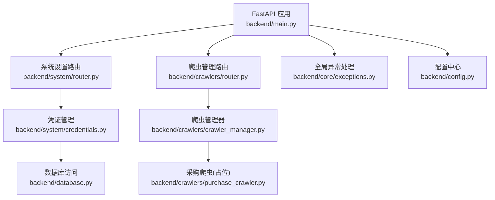
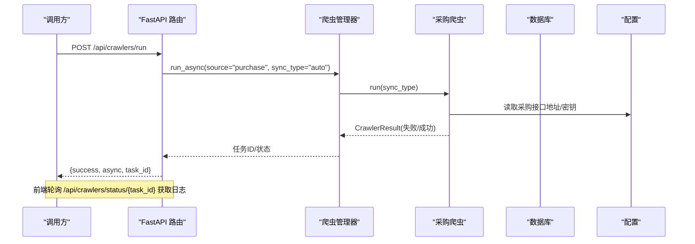
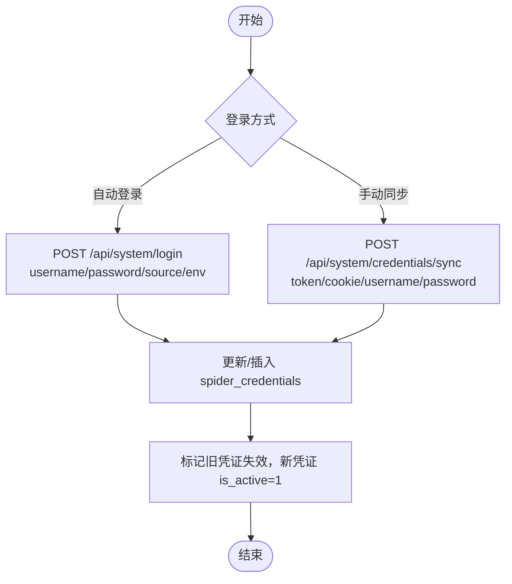
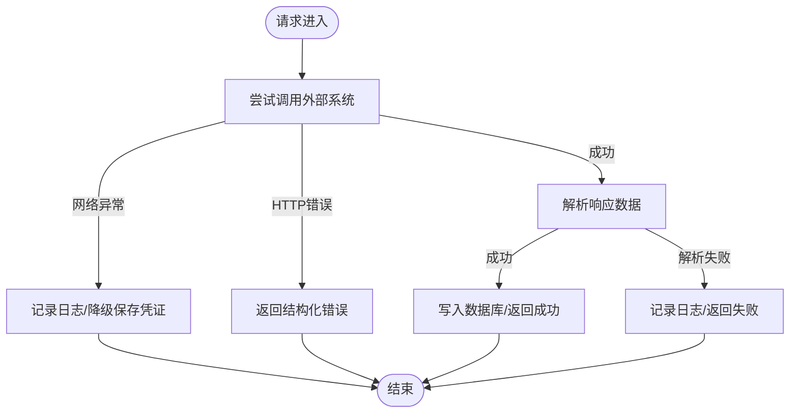
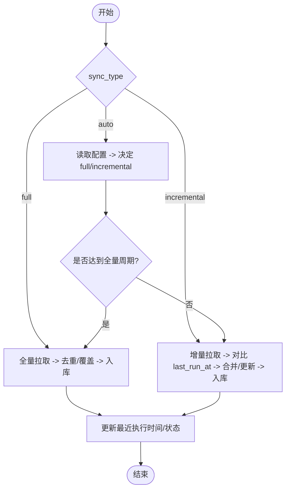
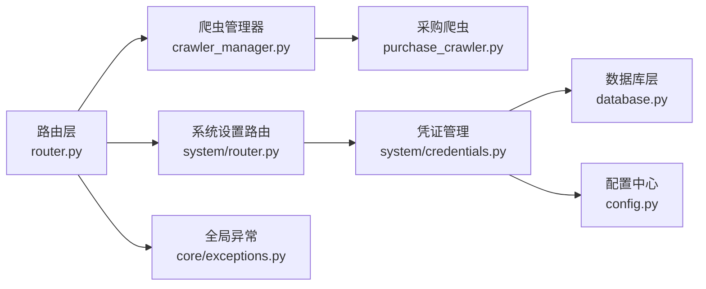

# 采购系统对接

<cite>
**本文引用的文件**
- [backend/main.py](file://backend/main.py)
- [backend/config.py](file://backend/config.py)
- [backend/crawlers/base.py](file://backend/crawlers/base.py)
- [backend/crawlers/router.py](file://backend/crawlers/router.py)
- [backend/crawlers/crawler_manager.py](file://backend/crawlers/crawler_manager.py)
- [backend/crawlers/purchase_crawler.py](file://backend/crawlers/purchase_crawler.py)
- [backend/system/router.py](file://backend/system/router.py)
- [backend/system/credentials.py](file://backend/system/credentials.py)
- [backend/database.py](file://backend/database.py)
- [backend/core/exceptions.py](file://backend/core/exceptions.py)
</cite>

## 目录
1. [简介](#简介)
2. [项目结构](#项目结构)
3. [核心组件](#核心组件)
4. [架构总览](#架构总览)
5. [详细组件分析](#详细组件分析)
6. [依赖关系分析](#依赖关系分析)
7. [性能考虑](#性能考虑)
8. [故障排查指南](#故障排查指南)
9. [结论](#结论)
10. [附录：接口规范与对接示例](#附录接口规范与对接示例)

## 简介
本文件面向“采购系统对接”的集成与二次开发，基于现有后端服务（FastAPI）与爬虫框架，提供以下能力说明：
- RESTful API 设计：统一路由、请求参数、响应结构
- 认证授权机制：凭证管理、登录获取 Token、Cookie/JWT 同步
- 数据解析逻辑：JSON/XML 提取、字段映射、类型转换
- 异常处理策略：网络异常、业务异常、数据异常的识别与处理
- 数据同步机制：全量同步、增量同步、冲突检测方案
- 对接示例：接口调用、数据解析、错误处理的完整流程
- 性能优化建议：连接池、并发控制、缓存策略

## 项目结构
后端采用模块化 FastAPI 应用，按功能划分路由与模块；爬虫子系统通过抽象基类统一管理多数据源（WMS、飞书、采购系统）。数据库使用 MySQL 连接池，配置集中管理。

图表来源
- [backend/main.py:29-83](file://backend/main.py#L29-L83)
- [backend/crawlers/router.py:43-147](file://backend/crawlers/router.py#L43-L147)
- [backend/crawlers/crawler_manager.py:22-95](file://backend/crawlers/crawler_manager.py#L22-L95)
- [backend/system/router.py:52-109](file://backend/system/router.py#L52-L109)
- [backend/system/credentials.py:25-148](file://backend/system/credentials.py#L25-L148)
- [backend/database.py:12-43](file://backend/database.py#L12-L43)
- [backend/config.py:48-88](file://backend/config.py#L48-L88)

章节来源
- [backend/main.py:29-83](file://backend/main.py#L29-L83)
- [backend/config.py:48-88](file://backend/config.py#L48-L88)

## 核心组件
- 应用入口与中间件：注册路由、CORS、健康检查、SPA 回退、启动/关闭事件
- 爬虫基类与状态：定义同步类型、运行状态、结果对象
- 爬虫管理器：统一调度、异步执行、任务跟踪、停止控制
- 凭证管理：自动登录、手动同步、Token/Cookie 存储、系统参数
- 数据库层：连接池、查询/执行封装、批量操作
- 异常体系：业务异常基类与全局处理器

章节来源
- [backend/crawlers/base.py:12-67](file://backend/crawlers/base.py#L12-L67)
- [backend/crawlers/crawler_manager.py:22-305](file://backend/crawlers/crawler_manager.py#L22-L305)
- [backend/system/credentials.py:25-148](file://backend/system/credentials.py#L25-L148)
- [backend/database.py:12-116](file://backend/database.py#L12-L116)
- [backend/core/exceptions.py:1-8](file://backend/core/exceptions.py#L1-L8)

## 架构总览
整体架构围绕“REST 接口 + 爬虫调度 + 凭证管理 + 数据库持久化”展开。采购系统作为新增数据源，通过继承 BaseCrawler 接入统一调度，复用凭证管理与配置体系。

图表来源
- [backend/crawlers/router.py:89-147](file://backend/crawlers/router.py#L89-L147)
- [backend/crawlers/crawler_manager.py:134-197](file://backend/crawlers/crawler_manager.py#L134-L197)
- [backend/crawlers/purchase_crawler.py:12-49](file://backend/crawlers/purchase_crawler.py#L12-L49)
- [backend/config.py:72-75](file://backend/config.py#L72-L75)

## 详细组件分析

### 认证与授权机制
- 凭证来源
  - 自动登录：支持 WMS（di360）登录获取 JWT/Token，并保存 Cookie
  - 手动同步：从浏览器复制 Token/Cookie 或用户名密码进行同步
  - 飞书应用：获取 tenant_access_token 并持久化
- 存储与有效性
  - 凭证表去重保留最新记录，is_active 标记激活态
  - 列表返回时兼容多种 token 字段名（authorization/token/cookie）
- 配置项
  - 采购系统预留配置键：PURCHASE_API_URL、PURCHASE_API_KEY
  - 服务端口、CORS、上传目录等

图表来源
- [backend/system/router.py:52-96](file://backend/system/router.py#L52-L96)
- [backend/system/credentials.py:25-148](file://backend/system/credentials.py#L25-L148)

章节来源
- [backend/system/router.py:52-96](file://backend/system/router.py#L52-L96)
- [backend/system/credentials.py:25-148](file://backend/system/credentials.py#L25-L148)
- [backend/config.py:72-75](file://backend/config.py#L72-L75)

### 数据解析逻辑
- JSON/XML 提取
  - 当前采购爬虫为占位实现，未实际调用外部 API
  - 可参考 WMS/飞书脚本中的字段映射思路，建立列头到内部字段的映射表
- 字段映射规则
  - 将外部系统的字段名映射到内部标准字段（如 DELIVERY_CODE、ORDER_NUM、RECIVE_TIME 等）
  - 支持未知列降级为 COL_索引，便于后续扩展
- 数据类型转换
  - 数值型字段需做安全转换（int/float），字符串时间字段需标准化为统一格式
  - 空值与缺失字段需有默认值或跳过策略

章节来源
- [backend/scripts/probe_v2.py:100-139](file://backend/scripts/probe_v2.py#L100-L139)
- [backend/scripts/probe_new_feishu_sheet.py:100-141](file://backend/scripts/probe_new_feishu_sheet.py#L100-L141)

### 异常处理策略
- 网络异常
  - 登录或抓取时捕获 ConnectionError，降级保存凭证并提示内网限制
  - HTTP 非 200 时返回结构化错误信息
- 业务异常
  - 自定义 BusinessError，全局处理器统一返回 {error: message}
- 数据异常
  - 解析失败时记录日志并返回失败状态，不影响其他数据源执行

图表来源
- [backend/system/credentials.py:25-118](file://backend/system/credentials.py#L25-L118)
- [backend/core/exceptions.py:1-8](file://backend/core/exceptions.py#L1-L8)
- [backend/main.py:85-92](file://backend/main.py#L85-L92)

章节来源
- [backend/system/credentials.py:25-118](file://backend/system/credentials.py#L25-L118)
- [backend/core/exceptions.py:1-8](file://backend/core/exceptions.py#L1-L8)
- [backend/main.py:85-92](file://backend/main.py#L85-L92)

### 数据同步机制
- 同步模式
  - 自动（auto）：根据配置间隔执行增量同步
  - 全量（full）：覆盖式拉取全部历史数据
  - 增量（incremental）：仅拉取上次同步后的新增/变更记录
- 调度与配置
  - 通过 /api/crawlers/config 读写 crawler_mode、crawler_incremental_interval_minutes、crawler_full_interval_hours、crawler_enabled_sources 等
  - 支持暂停/恢复调度器，避免手动触发与自动调度冲突
- 冲突检测
  - 以主键/业务键（如送货单号+零件编码）判断是否已存在
  - 存在则更新数量/状态，不存在则新增
  - 对关键字段变更（如收货数量）记录审计日志

图表来源
- [backend/crawlers/router.py:43-58](file://backend/crawlers/router.py#L43-L58)
- [backend/system/credentials.py:297-417](file://backend/system/credentials.py#L297-L417)
- [backend/crawlers/base.py:12-16](file://backend/crawlers/base.py#L12-L16)

章节来源
- [backend/crawlers/router.py:43-58](file://backend/crawlers/router.py#L43-L58)
- [backend/system/credentials.py:297-417](file://backend/system/credentials.py#L297-L417)
- [backend/crawlers/base.py:12-16](file://backend/crawlers/base.py#L12-L16)

## 依赖关系分析
- 路由层依赖爬虫管理器，管理器依赖具体爬虫实例
- 凭证管理依赖数据库层，配置中心提供运行时参数
- 全局异常处理器统一捕获业务异常
- 采购爬虫目前为占位，待接入真实 API 后复用上述基础设施

图表来源
- [backend/crawlers/router.py:1-11](file://backend/crawlers/router.py#L1-L11)
- [backend/crawlers/crawler_manager.py:1-17](file://backend/crawlers/crawler_manager.py#L1-L17)
- [backend/system/router.py:1-11](file://backend/system/router.py#L1-L11)
- [backend/system/credentials.py:1-14](file://backend/system/credentials.py#L1-L14)
- [backend/database.py:1-7](file://backend/database.py#L1-L7)
- [backend/core/exceptions.py:1-8](file://backend/core/exceptions.py#L1-L8)
- [backend/config.py:1-14](file://backend/config.py#L1-L14)

章节来源
- [backend/crawlers/router.py:1-11](file://backend/crawlers/router.py#L1-L11)
- [backend/crawlers/crawler_manager.py:1-17](file://backend/crawlers/crawler_manager.py#L1-L17)
- [backend/system/router.py:1-11](file://backend/system/router.py#L1-L11)
- [backend/system/credentials.py:1-14](file://backend/system/credentials.py#L1-L14)
- [backend/database.py:1-7](file://backend/database.py#L1-L7)
- [backend/core/exceptions.py:1-8](file://backend/core/exceptions.py#L1-L8)
- [backend/config.py:1-14](file://backend/config.py#L1-L14)

## 性能考虑
- 连接池配置
  - 数据库连接池最大连接数、最小缓存、阻塞等待策略已在 database.py 中配置
  - 建议根据并发量调整 maxconnections/mincached/maxcached
- 并发控制
  - 爬虫管理器支持异步执行，避免阻塞请求线程
  - 可通过 enabled_sources 限定并行数据源，降低资源竞争
- 缓存策略
  - 对外部 API 的鉴权 Token 可短期缓存，减少重复登录
  - 对频繁读取的配置（如系统参数）可加内存缓存
- 超时与重试
  - 外部 API 调用应设置合理超时，失败时指数退避重试
  - 对幂等接口可重试，非幂等接口需谨慎

章节来源
- [backend/database.py:12-43](file://backend/database.py#L12-L43)
- [backend/crawlers/crawler_manager.py:134-197](file://backend/crawlers/crawler_manager.py#L134-L197)

## 故障排查指南
- 无法连接数据库
  - 检查 backend/.env 中 DB_HOST/DB_PORT/DB_USER/DB_PASSWORD/DB_DATABASE
  - 查看初始化失败的错误日志
- 登录失败或未获取到 Token
  - 确认目标系统可达（公司内网）
  - 检查响应体是否包含 token/authorization/access_token 字段
- 爬虫执行失败
  - 查看 /api/crawlers/status 与 /api/crawlers/task/{task_id} 的日志
  - 确认启用数据源配置正确
- 配置未生效
  - 通过 /api/crawlers/config 读取当前配置
  - 保存后通知调度器重新加载

章节来源
- [backend/database.py:12-43](file://backend/database.py#L12-L43)
- [backend/system/credentials.py:25-118](file://backend/system/credentials.py#L25-L118)
- [backend/crawlers/router.py:61-86](file://backend/crawlers/router.py#L61-L86)

## 结论
本项目已具备完整的 REST 接口、爬虫调度、凭证管理与数据库持久化能力。采购系统对接只需在 PurchaseCrawler 中实现真实 API 调用，复用现有认证、解析、同步与异常处理机制即可快速上线。建议优先完成字段映射与增量同步逻辑，再逐步完善冲突检测与性能优化。

## 附录：接口规范与对接示例

### RESTful API 设计
- 基础路径
  - 系统设置：/api/system/*
  - 爬虫管理：/api/crawlers/*
- 关键接口
  - 登录获取 Token：POST /api/system/login
    - 请求体：{source, username, password, env}
    - 响应：{success, message, data: {token, cookie, source}}
  - 手动同步凭证：POST /api/system/credentials/sync
    - 请求体：{source, token_type, token, authorization, cookie, username, password}
    - 响应：{success, message, data}
  - 读取爬虫配置：GET /api/crawlers/config
    - 响应：{success, data: {crawler_mode, intervals, enabled_sources_list...}}
  - 保存爬虫配置：POST /api/crawlers/config
    - 请求体：{crawler_mode, crawler_incremental_interval_minutes, crawler_full_interval_hours, crawler_enabled_sources...}
    - 响应：{success, data, message}
  - 执行爬虫：POST /api/crawlers/run
    - 请求体：{source, sync_type/mode, enabled_sources, force_full, blocking}
    - 响应：{success, async, task_id, message}
  - 查询任务状态：GET /api/crawlers/task/{task_id}
    - 响应：{success, data: {running, start_time, end_time, result...}}
  - 获取所有状态：GET /api/crawlers/status
    - 响应：{success, data: {crawlers, config, sources}}

章节来源
- [backend/system/router.py:52-109](file://backend/system/router.py#L52-L109)
- [backend/crawlers/router.py:43-147](file://backend/crawlers/router.py#L43-L147)

### 请求参数格式与响应数据结构
- 请求参数
  - 统一使用 application/json
  - 字段命名遵循驼峰或下划线均可，路由层会做兼容处理
- 响应结构
  - 成功：{success: true, data: ..., message?: string}
  - 失败：{success: false, error: string, message?: string}
  - 业务异常：由全局处理器返回 {error: string}

章节来源
- [backend/main.py:85-92](file://backend/main.py#L85-L92)
- [backend/crawlers/router.py:43-147](file://backend/crawlers/router.py#L43-L147)
- [backend/system/router.py:52-109](file://backend/system/router.py#L52-L109)

### 认证授权机制
- API 密钥管理
  - 采购系统预留 PURCHASE_API_URL、PURCHASE_API_KEY
  - 建议在凭证管理中增加“采购系统”源，保存 API Key 或 Token
- 签名算法与请求头
  - 若采购系统要求签名，可在 PurchaseCrawler 中实现签名生成与 Header 注入
  - 常见做法：HMAC-SHA256 + Timestamp + Nonce，Header 中包含 Authorization 或 X-Signature
- 请求头配置
  - Content-Type: application/json
  - Authorization: Bearer <token> 或自定义 Header

章节来源
- [backend/config.py:72-75](file://backend/config.py#L72-L75)
- [backend/system/credentials.py:25-148](file://backend/system/credentials.py#L25-L148)

### 数据解析逻辑
- JSON/XML 提取
  - 优先解析 JSON，若为 XML 则转换为字典后再处理
- 字段映射规则
  - 建立外部字段到内部字段的映射表，支持未知列降级
- 数据类型转换
  - 数值型字段安全转换，时间字段标准化，空值默认处理

章节来源
- [backend/scripts/probe_v2.py:100-139](file://backend/scripts/probe_v2.py#L100-L139)
- [backend/scripts/probe_new_feishu_sheet.py:100-141](file://backend/scripts/probe_new_feishu_sheet.py#L100-L141)

### 异常处理策略
- 网络异常：捕获连接错误，降级保存凭证并提示
- 业务异常：抛出 BusinessError，全局处理器统一返回
- 数据异常：解析失败记录日志并返回失败状态

章节来源
- [backend/system/credentials.py:25-118](file://backend/system/credentials.py#L25-L118)
- [backend/core/exceptions.py:1-8](file://backend/core/exceptions.py#L1-L8)
- [backend/main.py:85-92](file://backend/main.py#L85-L92)

### 数据同步机制
- 全量同步：覆盖式拉取，适合首次初始化或修复数据
- 增量同步：基于 last_run_at 或游标，仅拉取变更
- 冲突检测：以业务键判断是否存在，存在则更新，不存在则新增

章节来源
- [backend/system/credentials.py:297-417](file://backend/system/credentials.py#L297-L417)
- [backend/crawlers/base.py:12-16](file://backend/crawlers/base.py#L12-L16)

### 对接示例代码（流程示意）
- 步骤一：配置采购系统凭证
  - 调用 POST /api/system/credentials/sync，保存 API Key 或 Token
- 步骤二：执行采购爬虫
  - 调用 POST /api/crawlers/run，传入 {source: "purchase", sync_type: "auto"}
- 步骤三：轮询任务状态
  - 调用 GET /api/crawlers/task/{task_id}，获取运行日志与结果
- 步骤四：解析与入库
  - 在 PurchaseCrawler.run 中实现 API 调用、字段映射、类型转换与入库

章节来源
- [backend/system/router.py:79-96](file://backend/system/router.py#L79-L96)
- [backend/crawlers/router.py:89-147](file://backend/crawlers/router.py#L89-L147)
- [backend/crawlers/purchase_crawler.py:12-49](file://backend/crawlers/purchase_crawler.py#L12-L49)

### 性能优化建议
- 连接池：根据并发调整数据库连接池大小
- 并发控制：通过 enabled_sources 限制并行数据源
- 缓存策略：缓存 Token 与配置，减少重复请求
- 超时重试：外部 API 设置超时与指数退避重试

章节来源
- [backend/database.py:12-43](file://backend/database.py#L12-L43)
- [backend/crawlers/crawler_manager.py:134-197](file://backend/crawlers/crawler_manager.py#L134-L197)