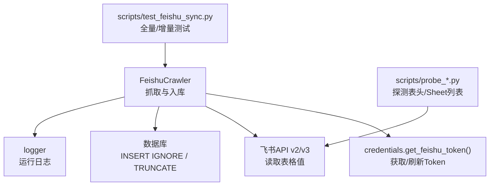
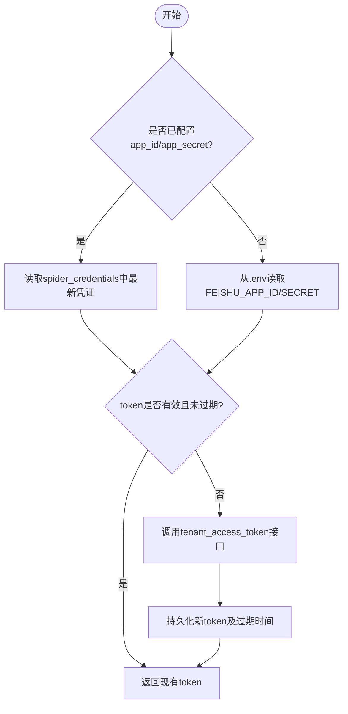
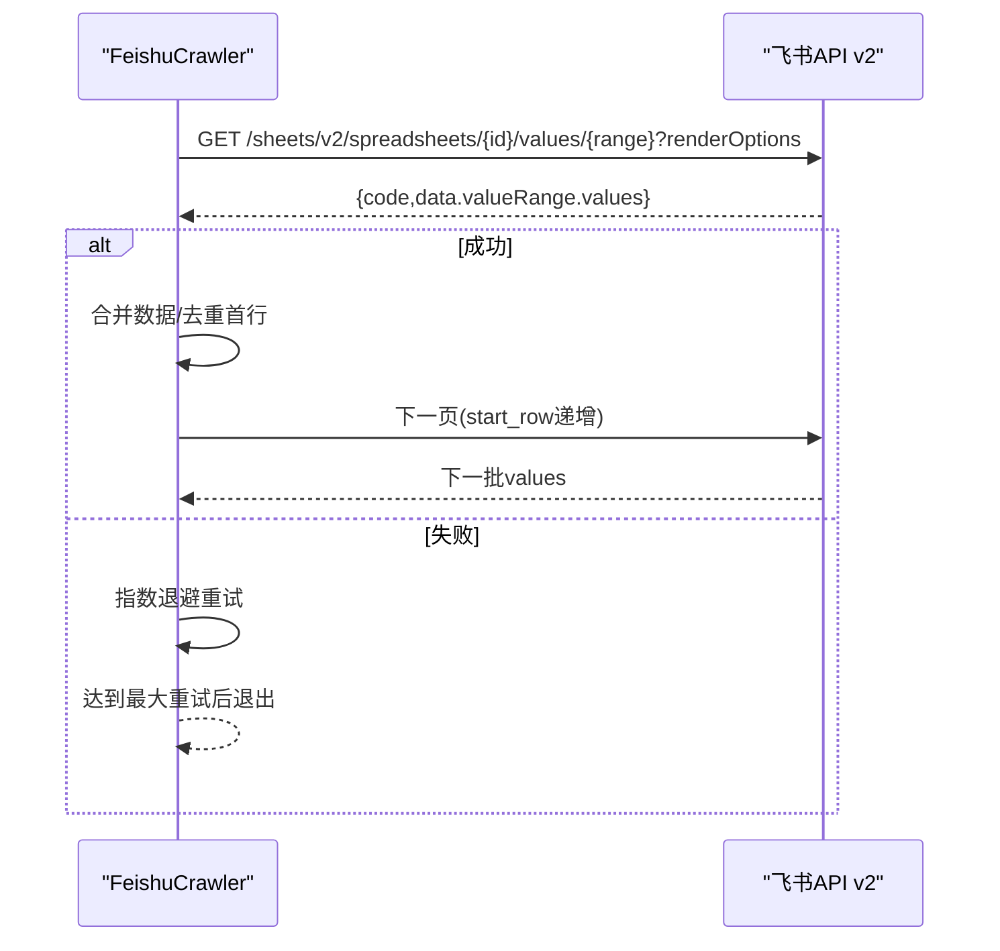
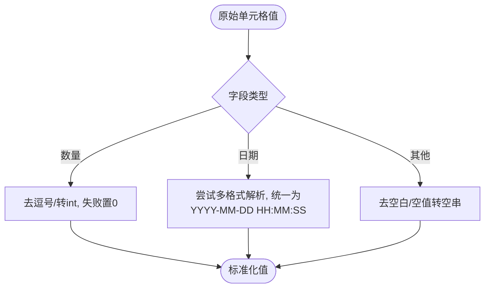
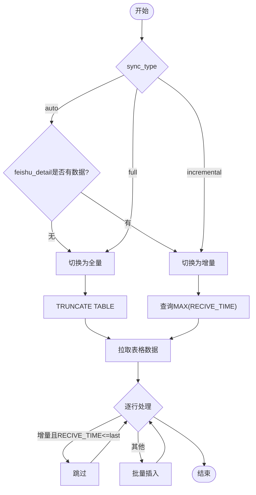
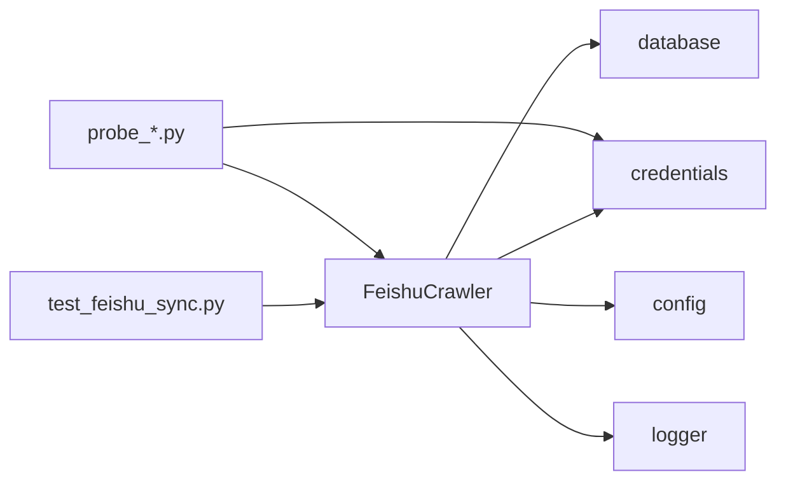

# 飞书表格同步

<cite>
**本文引用的文件**
- [backend/crawlers/feishu_crawler.py](file://backend/crawlers/feishu_crawler.py)
- [backend/system/credentials.py](file://backend/system/credentials.py)
- [backend/config.py](file://backend/config.py)
- [backend/logger.py](file://backend/logger.py)
- [backend/crawlers/base.py](file://backend/crawlers/base.py)
- [backend/scripts/test_feishu_sync.py](file://backend/scripts/test_feishu_sync.py)
- [backend/scripts/probe_sheet_list.py](file://backend/scripts/probe_sheet_list.py)
- [backend/scripts/probe_feishu_header.py](file://backend/scripts/probe_feishu_header.py)
- [backend/scripts/update_feishu_schema.py](file://backend/scripts/update_feishu_schema.py)
</cite>

## 目录
1. [简介](#简介)
2. [项目结构](#项目结构)
3. [核心组件](#核心组件)
4. [架构总览](#架构总览)
5. [详细组件分析](#详细组件分析)
6. [依赖关系分析](#依赖关系分析)
7. [性能与限流](#性能与限流)
8. [故障排查指南](#故障排查指南)
9. [结论](#结论)
10. [附录：集成示例与最佳实践](#附录：集成示例与最佳实践)

## 简介
本仓库实现了基于飞书开放平台的表格数据同步能力，将飞书共享表中的到货登记数据拉取并写入本地数据库。系统涵盖：
- 应用授权与访问令牌获取（tenant_access_token）
- 表格元数据读取与单元格值批量读取
- 数据格式转换（日期、数值、空值、仓库名称归一化）
- 增量同步策略（基于时间戳过滤）
- 错误重试、日志记录与运行状态追踪
- 脚本化的探测与测试工具

## 项目结构
围绕“飞书表格同步”的关键代码集中在以下模块：
- 爬虫实现：FeishuCrawler 负责调用飞书 API、解析数据、写入数据库
- 凭证管理：credentials 提供飞书 tenant_access_token 的获取与缓存
- 配置中心：config 提供环境变量加载与全局设置
- 日志：logger 提供统一日志输出
- 基类：base 定义爬虫抽象接口与结果模型
- 脚本：probe_* 与 test_* 用于调试、探测与验证



图表来源
- [backend/crawlers/feishu_crawler.py:12-17](file://backend/crawlers/feishu_crawler.py#L12-L17)
- [backend/system/credentials.py:448-573](file://backend/system/credentials.py#L448-L573)
- [backend/scripts/test_feishu_sync.py:14-21](file://backend/scripts/test_feishu_sync.py#L14-L21)
- [backend/scripts/probe_sheet_list.py:17-42](file://backend/scripts/probe_sheet_list.py#L17-L42)

章节来源
- [backend/crawlers/feishu_crawler.py:1-419](file://backend/crawlers/feishu_crawler.py#L1-L419)
- [backend/system/credentials.py:1-573](file://backend/system/credentials.py#L1-L573)
- [backend/config.py:1-102](file://backend/config.py#L1-L102)
- [backend/logger.py:1-43](file://backend/logger.py#L1-L43)
- [backend/crawlers/base.py:1-67](file://backend/crawlers/base.py#L1-L67)

## 核心组件
- FeishuCrawler：继承 BaseCrawler，实现 run/get_status，完成从飞书拉取到落库的全流程
- credentials：封装飞书 tenant_access_token 的获取、过期判断与持久化
- config：集中管理环境变量（如 FEISHU_APP_ID/SECRET）
- logger：统一日志输出，支持文件轮转与控制台输出
- base：定义 SyncType/CrawlerStatus/CrawlerResult 等通用类型

章节来源
- [backend/crawlers/feishu_crawler.py:55-419](file://backend/crawlers/feishu_crawler.py#L55-L419)
- [backend/system/credentials.py:448-573](file://backend/system/credentials.py#L448-L573)
- [backend/config.py:48-102](file://backend/config.py#L48-L102)
- [backend/logger.py:14-43](file://backend/logger.py#L14-L43)
- [backend/crawlers/base.py:12-67](file://backend/crawlers/base.py#L12-L67)

## 架构总览
下图展示了从凭证获取到数据入库的整体流程，包括自动/全量/增量三种同步模式。

```mermaid
sequenceDiagram
participant U as "调用方"
participant C as "FeishuCrawler.run()"
participant T as "credentials.get_feishu_token()"
participant F as "飞书API(v2/v3)"
participant DB as "数据库"
U->>C : 执行同步(sync_type=auto/full/incremental)
C->>T : 获取有效tenant_access_token
T-->>C : token(可能自动刷新)
C->>F : 分页读取表格值(带valueRenderOption/dateTimeRenderOption)
F-->>C : 返回values(逐批)
C->>DB : 全量时TRUNCATE; 增量时按RECIVE_TIME过滤
C->>DB : 批量INSERT IGNORE写入feishu_detail
C-->>U : 返回CrawlerResult(状态/统计/消息)
```

图表来源
- [backend/crawlers/feishu_crawler.py:251-399](file://backend/crawlers/feishu_crawler.py#L251-L399)
- [backend/system/credentials.py:509-573](file://backend/system/credentials.py#L509-L573)

## 详细组件分析

### 认证与令牌管理（OAuth2.0风格）
- 使用飞书内部应用的 tenant_access_token 进行鉴权
- 通过 app_id/app_secret 调用认证接口获取 token，并缓存至 spider_credentials 表
- get_feishu_token 会检查过期时间，必要时自动刷新；若未配置则回退到 .env 中的 FEISHU_APP_ID/SECRET
- 支持手动登录保存凭证或自动登录刷新



图表来源
- [backend/system/credentials.py:448-573](file://backend/system/credentials.py#L448-L573)
- [backend/config.py:67-70](file://backend/config.py#L67-L70)

章节来源
- [backend/system/credentials.py:448-573](file://backend/system/credentials.py#L448-L573)
- [backend/config.py:67-70](file://backend/config.py#L67-L70)

### 表格操作API与数据读取
- 使用 v2 API 读取 values，支持 valueRenderOption=ToString 与 dateTimeRenderOption=FormattedString
- 采用分页读取（每批约1000行），避免单次请求过大
- 遇到连续空批次时提前终止，提升效率
- 支持重试机制（指数退避）以应对网络抖动与临时错误



图表来源
- [backend/crawlers/feishu_crawler.py:132-203](file://backend/crawlers/feishu_crawler.py#L132-L203)

章节来源
- [backend/crawlers/feishu_crawler.py:132-203](file://backend/crawlers/feishu_crawler.py#L132-L203)

### 数据格式转换与映射
- 字段映射：COLUMN_MAPPING 将飞书列索引映射到目标字段名
- 数值处理：ORDER_NUM/RECIVE_NUM 去除逗号并转为整数，异常时置0
- 日期处理：RECIVE_TIME 支持多种常见格式，统一为 "YYYY-MM-DD HH:MM:SS"
- 空值处理：None/空白字符串统一为空串
- 仓库名称归一化：根据关键词映射到“总院试制内库/外库”



图表来源
- [backend/crawlers/feishu_crawler.py:84-131](file://backend/crawlers/feishu_crawler.py#L84-L131)

章节来源
- [backend/crawlers/feishu_crawler.py:28-52](file://backend/crawlers/feishu_crawler.py#L28-L52)
- [backend/crawlers/feishu_crawler.py:84-131](file://backend/crawlers/feishu_crawler.py#L84-L131)

### 增量同步实现方案
- 自动模式：若 feishu_detail 已有数据则切换为增量，否则全量
- 全量模式：先 TRUNCATE 再写入
- 增量模式：查询数据库中最大 RECIVE_TIME，仅处理大于该时间的记录
- 过滤逻辑：在内存中对每条记录的 RECIVE_TIME 进行比较，跳过旧数据



图表来源
- [backend/crawlers/feishu_crawler.py:273-296](file://backend/crawlers/feishu_crawler.py#L273-L296)
- [backend/crawlers/feishu_crawler.py:205-220](file://backend/crawlers/feishu_crawler.py#L205-L220)
- [backend/crawlers/feishu_crawler.py:316-377](file://backend/crawlers/feishu_crawler.py#L316-L377)

章节来源
- [backend/crawlers/feishu_crawler.py:273-377](file://backend/crawlers/feishu_crawler.py#L273-L377)

### 错误处理与重试
- 网络超时/HTTP错误/JSON解析异常均捕获并记录日志
- 指数退避重试（最多3次），每次等待间隔递增
- 遇到连续空批次时提前停止，避免无效请求
- 批量插入失败时记录错误并继续后续处理

章节来源
- [backend/crawlers/feishu_crawler.py:146-203](file://backend/crawlers/feishu_crawler.py#L146-L203)
- [backend/crawlers/feishu_crawler.py:222-249](file://backend/crawlers/feishu_crawler.py#L222-L249)

### 日志记录
- 统一通过 logger 输出，包含时间、级别、来源与消息
- 文件处理器按大小轮转（10MB，保留7份），控制台同时输出
- 爬虫内部维护最近500条日志便于查看

章节来源
- [backend/logger.py:14-43](file://backend/logger.py#L14-L43)
- [backend/crawlers/feishu_crawler.py:72-82](file://backend/crawlers/feishu_crawler.py#L72-L82)

## 依赖关系分析
- FeishuCrawler 依赖 credentials.get_feishu_token 获取令牌
- 依赖 database 模块进行查询与写入
- 依赖 config 获取环境变量
- 依赖 logger 记录运行日志
- scripts 作为独立入口用于探测与测试



图表来源
- [backend/crawlers/feishu_crawler.py:12-17](file://backend/crawlers/feishu_crawler.py#L12-L17)
- [backend/system/credentials.py:448-573](file://backend/system/credentials.py#L448-L573)
- [backend/scripts/test_feishu_sync.py:10-21](file://backend/scripts/test_feishu_sync.py#L10-L21)
- [backend/scripts/probe_sheet_list.py:11-12](file://backend/scripts/probe_sheet_list.py#L11-L12)

章节来源
- [backend/crawlers/feishu_crawler.py:12-17](file://backend/crawlers/feishu_crawler.py#L12-L17)
- [backend/system/credentials.py:448-573](file://backend/system/credentials.py#L448-L573)
- [backend/scripts/test_feishu_sync.py:10-21](file://backend/scripts/test_feishu_sync.py#L10-L21)
- [backend/scripts/probe_sheet_list.py:11-12](file://backend/scripts/probe_sheet_list.py#L11-L12)

## 性能与限流
- 分页读取：每批约1000行，减少单次响应体积
- 延迟控制：每批请求后短暂休眠，降低对远端压力
- 重试策略：指数退避，缓解瞬时拥塞
- 建议：
  - 合理设置 batch_size 与 sleep_seconds，平衡吞吐与稳定性
  - 在高并发场景下可引入令牌桶/漏桶限流器
  - 监控飞书API返回码与耗时，动态调整参数

[本节为通用指导，不直接分析具体文件]

## 故障排查指南
- 无法获取Token：
  - 检查 .env 中 FEISHU_APP_ID/SECRET 是否正确
  - 确认飞书应用权限与网络可达
  - 查看 credentials 日志定位错误信息
- 表格为空或仅有表头：
  - 确认 SPREADSHEET_TOKEN/SHEET_ID 正确
  - 使用 probe_feishu_header.py 探测前N行数据
- 增量未生效：
  - 检查 feishu_detail 中 RECIVE_TIME 是否为空或无效
  - 确认增量模式下 last_sync_time 获取正常
- 写入失败：
  - 检查数据库连接与表结构（可使用 update_feishu_schema.py 更新字段）
  - 查看批量插入日志与异常堆栈

章节来源
- [backend/system/credentials.py:509-573](file://backend/system/credentials.py#L509-L573)
- [backend/scripts/probe_feishu_header.py:17-63](file://backend/scripts/probe_feishu_header.py#L17-L63)
- [backend/scripts/update_feishu_schema.py:12-37](file://backend/scripts/update_feishu_schema.py#L12-L37)

## 结论
本实现以简洁可靠的架构完成了飞书表格到本地数据库的稳定同步，具备：
- 完善的令牌管理与自动刷新
- 灵活的同步模式（全量/增量/自动）
- 健壮的数据清洗与格式转换
- 完善的日志与错误重试机制
- 丰富的探测与测试脚本支撑

## 附录：集成示例与最佳实践

### 建立连接与获取令牌
- 在 .env 中配置 FEISHU_APP_ID/SECRET，或通过系统设置保存凭证
- 调用 credentials.get_feishu_token() 获取有效 token

章节来源
- [backend/config.py:67-70](file://backend/config.py#L67-L70)
- [backend/system/credentials.py:509-573](file://backend/system/credentials.py#L509-L573)

### 读取表格数据
- 使用 v2 API 读取 values，设置 valueRenderOption/dateTimeRenderOption
- 分页读取，注意连续空批次提前终止

章节来源
- [backend/crawlers/feishu_crawler.py:132-203](file://backend/crawlers/feishu_crawler.py#L132-L203)

### 写入数据
- 批量 INSERT IGNORE 写入 feishu_detail，避免重复键冲突
- 全量模式先 TRUNCATE 再写入

章节来源
- [backend/crawlers/feishu_crawler.py:222-249](file://backend/crawlers/feishu_crawler.py#L222-L249)
- [backend/crawlers/feishu_crawler.py:283-285](file://backend/crawlers/feishu_crawler.py#L283-L285)

### 完整同步流程示例（脚本）
- 清空表 -> 运行全量同步 -> 打印统计与前几条数据 -> 查看状态分布

章节来源
- [backend/scripts/test_feishu_sync.py:14-57](file://backend/scripts/test_feishu_sync.py#L14-L57)

### 探测与调试
- 使用 probe_feishu_header.py 查看表头与前N行数据
- 使用 probe_sheet_list.py 列出所有 sheet 并探测第一个

章节来源
- [backend/scripts/probe_feishu_header.py:17-63](file://backend/scripts/probe_feishu_header.py#L17-L63)
- [backend/scripts/probe_sheet_list.py:17-42](file://backend/scripts/probe_sheet_list.py#L17-L42)

### 表结构维护
- 使用 update_feishu_schema.py 添加/删除字段，确保与飞书列映射一致

章节来源
- [backend/scripts/update_feishu_schema.py:12-37](file://backend/scripts/update_feishu_schema.py#L12-L37)